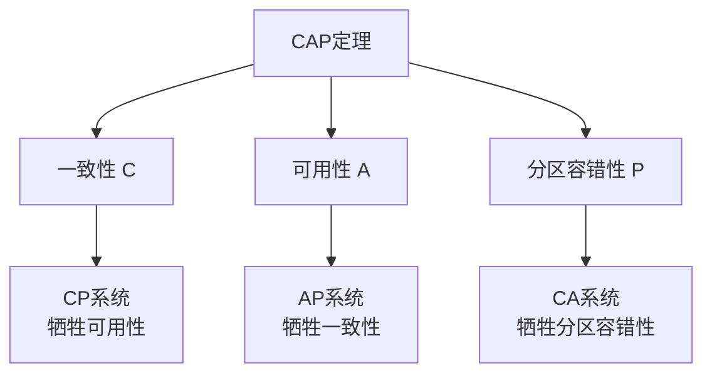

# 区块链基础概念

**学习阶段**: 阶段一 | **难度**: ⭐⭐☆☆☆ | **预估时间**: 15-20小时

---

## 📚 学习目标

完成本章学习后，您将能够：
- 理解区块链的核心概念和工作原理
- 掌握分布式系统的基本知识
- 了解密码学在区块链中的应用
- 区分不同类型的共识机制

---

## 🎯 核心概念

### 1. 什么是区块链？

区块链是一种**分布式账本技术**，通过密码学方法将数据块按时间顺序链接，形成不可篡改的数据链条。

#### 核心特征
- **去中心化**: 没有单一控制点
- **不可篡改**: 历史数据无法修改
- **透明性**: 所有交易公开可验证
- **共识机制**: 网络参与者达成一致

#### 基本结构
```
区块链 = 区块1 → 区块2 → 区块3 → ... → 区块N

每个区块包含:
├── 区块头 (Block Header)
│   ├── 前一区块哈希
│   ├── 默克尔根
│   ├── 时间戳
│   └── 随机数 (Nonce)
└── 交易数据 (Transaction Data)
    ├── 交易1
    ├── 交易2
    └── ...
```

### 2. 分布式系统基础

#### 2.1 CAP定理

在分布式系统中，以下三个特性无法同时满足：

- **一致性 (Consistency)**: 所有节点同时看到相同数据
- **可用性 (Availability)**: 系统持续可用
- **分区容错性 (Partition Tolerance)**: 网络分区时系统仍能工作



#### 2.2 拜占庭将军问题

在存在恶意节点的分布式网络中，如何达成共识？

**问题描述**:
- 多个将军围攻城市
- 只能通过信使传递消息
- 部分将军可能是叛徒
- 需要达成一致的攻击计划

**解决方案**:
- 需要超过2/3的诚实节点
- 使用数字签名验证消息
- 多轮投票达成共识

### 3. 密码学基础

#### 3.1 哈希函数

**特性**:
- **确定性**: 相同输入产生相同输出
- **快速计算**: 计算效率高
- **雪崩效应**: 输入微小变化导致输出巨大变化
- **不可逆**: 无法从输出推导输入
- **抗碰撞**: 难以找到两个不同输入产生相同输出

**常用哈希算法**:
```bash
# SHA-256示例
echo "Hello Blockchain" | sha256sum
# 输出: 7d865e959b2466918c9863afca942d0fb89d7c9ac0c99bafc3749504ded97730

# 微小变化的影响
echo "Hello blockchain" | sha256sum  
# 输出: 4ae7c3b6ac0beff671efa8cf57386151c06e58ca53a78d83f36107316cec125f
```

#### 3.2 数字签名

**工作原理**:
1. 使用私钥对消息进行签名
2. 其他人使用公钥验证签名
3. 确保消息来源和完整性

```python
# 数字签名示例 (概念性代码)
def digital_signature_example():
    # 1. 生成密钥对
    private_key, public_key = generate_keypair()
    
    # 2. 创建消息
    message = "Transfer 10 tokens to Alice"
    
    # 3. 使用私钥签名
    signature = sign(message, private_key)
    
    # 4. 使用公钥验证
    is_valid = verify(message, signature, public_key)
    
    return is_valid  # True if signature is valid
```

#### 3.3 默克尔树 (Merkle Tree)

用于高效验证大量数据的完整性：

```
        Root Hash
       /          \
   Hash AB      Hash CD
   /    \       /     \
Hash A Hash B Hash C Hash D
  |     |       |      |
 Tx A  Tx B    Tx C   Tx D
```

**优势**:
- 只需要根哈希就能验证整个数据集
- 可以高效验证单个交易的存在性
- 支持增量更新

### 4. 共识机制概述

#### 4.1 工作量证明 (Proof of Work, PoW)

**原理**:
- 矿工竞争解决数学难题
- 第一个解决的矿工获得记账权
- 其他节点验证并接受新区块

**特点**:
- ✅ 安全性高，经过实战验证
- ✅ 完全去中心化
- ❌ 能耗巨大
- ❌ 交易确认时间长

**应用**: Bitcoin, Ethereum (历史)

#### 4.2 权益证明 (Proof of Stake, PoS)

**原理**:
- 验证者质押代币获得记账权
- 记账权概率与质押数量成正比
- 恶意行为会被惩罚（削减质押）

**特点**:
- ✅ 能耗低
- ✅ 交易确认快
- ✅ 支持链上治理
- ❌ 可能存在"富者愈富"问题

**应用**: Ethereum 2.0, Cosmos, Polkadot

#### 4.3 委托权益证明 (Delegated Proof of Stake, DPoS)

**原理**:
- 代币持有者投票选择验证者
- 验证者轮流产生区块
- 提高了交易处理速度

**特点**:
- ✅ 高性能 (高TPS)
- ✅ 能耗低
- ✅ 治理效率高
- ❌ 相对中心化

**应用**: EOS, Tron

#### 4.4 实用拜占庭容错 (Practical Byzantine Fault Tolerance, pBFT)

**原理**:
- 三阶段协议：预准备、准备、提交
- 需要超过2/3节点诚实
- 提供即时最终性

**特点**:
- ✅ 即时最终性
- ✅ 高安全性
- ✅ 适合许可网络
- ❌ 扩展性有限

**应用**: Hyperledger Fabric, Tendermint

---

## 🔍 深入理解：区块链类型

### 公有链 (Public Blockchain)

**特征**:
- 完全开放，任何人可参与
- 高度去中心化
- 透明度最高

**优势**:
- 抗审查性强
- 网络效应大
- 创新活跃

**挑战**:
- 性能相对较低
- 治理复杂
- 能耗可能较高

**典型应用**: Bitcoin, Ethereum

### 联盟链 (Consortium Blockchain)

**特征**:
- 半开放网络
- 由联盟成员共同维护
- 部分去中心化

**优势**:
- 性能较高
- 治理相对简单
- 合规性好

**挑战**:
- 中心化程度较高
- 准入门槛存在
- 创新相对保守

**典型应用**: 银行间清算, 供应链金融

### 私有链 (Private Blockchain)

**特征**:
- 封闭网络
- 单一组织控制
- 中心化程度最高

**优势**:
- 性能最高
- 隐私保护好
- 完全可控

**挑战**:
- 去中心化程度低
- 信任成本高
- 网络效应有限

**典型应用**: 企业内部系统, 政府应用

---

## 💡 实践练习

### 练习1: 哈希函数实验

```bash
# 1. 安装必要工具
# macOS: brew install coreutils
# Ubuntu: sudo apt-get install coreutils

# 2. 体验哈希函数特性
echo "Blockchain" | sha256sum
echo "blockchain" | sha256sum  # 注意大小写差异
echo "Blockchain " | sha256sum  # 注意空格影响

# 3. 验证雪崩效应
echo "Hello World" | sha256sum
echo "Hello World!" | sha256sum
```

### 练习2: 简单区块链模拟

```python
import hashlib
import json
from datetime import datetime

class Block:
    def __init__(self, index, transactions, timestamp, previous_hash):
        self.index = index
        self.transactions = transactions
        self.timestamp = timestamp
        self.previous_hash = previous_hash
        self.hash = self.calculate_hash()
    
    def calculate_hash(self):
        block_string = json.dumps({
            "index": self.index,
            "transactions": self.transactions,
            "timestamp": str(self.timestamp),
            "previous_hash": self.previous_hash
        }, sort_keys=True)
        return hashlib.sha256(block_string.encode()).hexdigest()

class SimpleBlockchain:
    def __init__(self):
        self.chain = [self.create_genesis_block()]
    
    def create_genesis_block(self):
        return Block(0, [], datetime.now(), "0")
    
    def get_latest_block(self):
        return self.chain[-1]
    
    def add_block(self, transactions):
        previous_block = self.get_latest_block()
        new_block = Block(
            previous_block.index + 1,
            transactions,
            datetime.now(),
            previous_block.hash
        )
        self.chain.append(new_block)
    
    def is_chain_valid(self):
        for i in range(1, len(self.chain)):
            current_block = self.chain[i]
            previous_block = self.chain[i-1]
            
            if current_block.hash != current_block.calculate_hash():
                return False
            
            if current_block.previous_hash != previous_block.hash:
                return False
        
        return True

# 使用示例
blockchain = SimpleBlockchain()
blockchain.add_block(["Alice -> Bob: 10 tokens"])
blockchain.add_block(["Bob -> Charlie: 5 tokens"])

print(f"区块链是否有效: {blockchain.is_chain_valid()}")
for block in blockchain.chain:
    print(f"区块 {block.index}: {block.hash[:16]}...")
```

### 练习3: 共识机制对比分析

创建一个表格，对比不同共识机制：

| 特性 | PoW | PoS | DPoS | pBFT |
|------|-----|-----|------|------|
| 能耗 | 高 | 低 | 低 | 低 |
| TPS | 低 | 中 | 高 | 高 |
| 最终性 | 概率性 | 概率性 | 概率性 | 即时 |
| 去中心化程度 | 高 | 中 | 中 | 低 |
| 适用场景 | 公有链 | 公有链 | 公有链 | 联盟链 |

---

## 📖 扩展阅读

### 必读资料
1. **《精通比特币》** - Andreas M. Antonopoulos
2. **《区块链技术指南》** - 邹均等
3. **Bitcoin白皮书** - Satoshi Nakamoto
4. **Ethereum黄皮书** - Gavin Wood

### 在线资源
- [Bitcoin.org](https://bitcoin.org/) - 比特币官方资源
- [Ethereum.org](https://ethereum.org/) - 以太坊学习资源
- [Coursera区块链课程](https://www.coursera.org/specializations/blockchain)
- [MIT区块链课程](https://ocw.mit.edu/courses/sloan-school-of-management/)

### 技术论文
- [Bitcoin: A Peer-to-Peer Electronic Cash System](https://bitcoin.org/bitcoin.pdf)
- [Ethereum: A Next-Generation Smart Contract and Decentralized Application Platform](https://ethereum.org/en/whitepaper/)
- [The Byzantine Generals Problem](https://lamport.azurewebsites.net/pubs/byz.pdf)

---

## ✅ 学习检查点

完成本章学习后，请确认您能够：

- [ ] 解释区块链的基本工作原理
- [ ] 描述分布式系统中的CAP定理
- [ ] 理解拜占庭将军问题及其解决方案
- [ ] 区分不同类型的哈希函数和数字签名
- [ ] 对比各种共识机制的优缺点
- [ ] 实现简单的区块链数据结构
- [ ] 分析不同类型区块链的适用场景

### 自测题目

1. 为什么区块链被称为"不可篡改"的？
2. CAP定理中，区块链通常选择哪两个特性？
3. PoW和PoS的主要区别是什么？
4. 默克尔树在区块链中的作用是什么？
5. 什么情况下会选择联盟链而不是公有链？

---

**下一章**: [公链架构设计](./02-Blockchain-Architecture.md)

*继续深入学习区块链技术的架构设计原理！*
