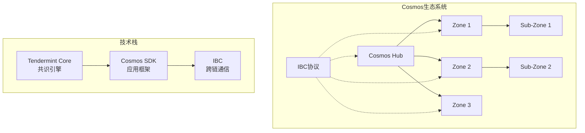
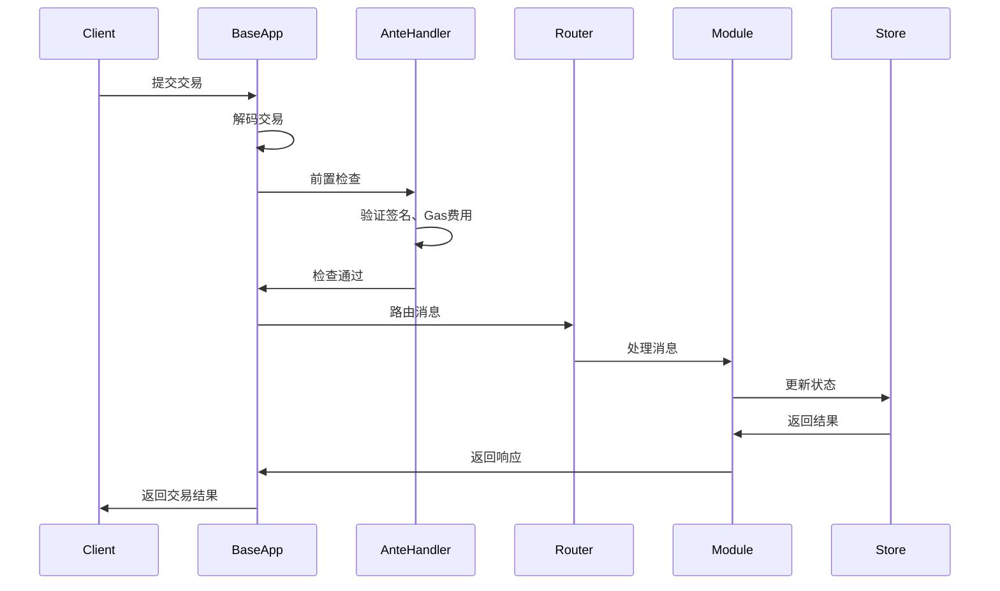

# Cosmos SDK深度解析

**学习阶段**: 阶段二 | **难度**: ⭐⭐⭐☆☆ | **预估时间**: 30-40小时

---

## 📚 学习目标

完成本章学习后，您将能够：
- 深入理解Cosmos SDK的架构和设计理念
- 掌握ABCI接口的工作原理
- 开发自定义Cosmos SDK模块
- 理解Cosmos生态系统的互操作性

---

## 🌌 Cosmos生态系统概述

### Cosmos愿景：区块链互联网

Cosmos致力于构建"区块链互联网"，通过以下核心技术实现：



### 核心组件

#### 1. Tendermint Core
- **职责**: 提供共识和网络层
- **特性**: BFT共识、即时最终性、高性能
- **接口**: ABCI (Application Blockchain Interface)

#### 2. Cosmos SDK
- **职责**: 应用层开发框架
- **特性**: 模块化、可组合、安全
- **语言**: Go语言实现

#### 3. IBC协议
- **职责**: 跨链通信标准
- **特性**: 去信任、通用、可扩展
- **应用**: 跨链资产转移、跨链智能合约调用

---

## 🏗️ Cosmos SDK架构深度解析

### 1. 整体架构

```go
// Cosmos SDK应用结构
type App struct {
    *baseapp.BaseApp
    
    // 编码器
    cdc               *codec.LegacyAmino
    appCodec          codec.Codec
    interfaceRegistry types.InterfaceRegistry
    
    // 密钥管理
    keys    map[string]*sdk.StoreKey
    tkeys   map[string]*sdk.TransientStoreKey
    memKeys map[string]*sdk.MemoryStoreKey
    
    // 模块管理器
    mm *module.Manager
    
    // 模块Keeper
    AccountKeeper    authkeeper.AccountKeeper
    BankKeeper       bankkeeper.Keeper
    StakingKeeper    stakingkeeper.Keeper
    DistrKeeper      distrkeeper.Keeper
    GovKeeper        govkeeper.Keeper
    // ... 其他Keeper
}
```

### 2. BaseApp核心组件

#### BaseApp结构
```go
type BaseApp struct {
    // 基础配置
    name               string
    db                 dbm.DB
    cms                sdk.CommitMultiStore
    storeLoader        StoreLoader
    router             sdk.Router
    queryRouter        sdk.QueryRouter
    
    // ABCI接口实现
    checkTx            sdk.AnteHandler
    deliverTx          sdk.AnteHandler
    initChainer        sdk.InitChainer
    beginBlocker       sdk.BeginBlocker
    endBlocker         sdk.EndBlocker
    
    // 状态管理
    checkState         *state
    deliverState       *state
    
    // 配置选项
    txDecoder          sdk.TxDecoder
    anteHandler        sdk.AnteHandler
    feeGrantKeeper     FeeGrantKeeper
}
```

#### 交易处理流程



### 3. ABCI接口详解

#### ABCI方法概览

```go
// ABCI接口定义
type Application interface {
    // 信息查询
    Info(RequestInfo) ResponseInfo
    Query(RequestQuery) ResponseQuery
    
    // 交易处理
    CheckTx(RequestCheckTx) ResponseCheckTx
    DeliverTx(RequestDeliverTx) ResponseDeliverTx
    
    // 区块处理
    BeginBlock(RequestBeginBlock) ResponseBeginBlock
    EndBlock(RequestEndBlock) ResponseEndBlock
    Commit() ResponseCommit
    
    // 初始化和快照
    InitChain(RequestInitChain) ResponseInitChain
    ListSnapshots(RequestListSnapshots) ResponseListSnapshots
    OfferSnapshot(RequestOfferSnapshot) ResponseOfferSnapshot
    LoadSnapshotChunk(RequestLoadSnapshotChunk) ResponseLoadSnapshotChunk
    ApplySnapshotChunk(RequestApplySnapshotChunk) ResponseApplySnapshotChunk
}
```

#### 区块生命周期

```go
// 区块处理生命周期
func (app *BaseApp) BeginBlock(req abci.RequestBeginBlock) abci.ResponseBeginBlock {
    // 1. 更新上下文
    app.deliverState.ctx = app.deliverState.ctx.
        WithBlockHeader(req.Header).
        WithBlockHeight(req.Header.Height)
    
    // 2. 执行BeginBlocker
    if app.beginBlocker != nil {
        res := app.beginBlocker(app.deliverState.ctx, req)
        return res
    }
    
    return abci.ResponseBeginBlock{}
}

func (app *BaseApp) DeliverTx(req abci.RequestDeliverTx) abci.ResponseDeliverTx {
    // 1. 解码交易
    tx, err := app.txDecoder(req.Tx)
    if err != nil {
        return sdkerrors.ResponseDeliverTx(err, 0, 0, app.trace)
    }
    
    // 2. 执行交易
    gInfo, result, anteEvents, err := app.runTx(runTxModeDeliver, req.Tx)
    if err != nil {
        return sdkerrors.ResponseDeliverTx(err, gInfo.GasWanted, gInfo.GasUsed, app.trace)
    }
    
    return abci.ResponseDeliverTx{
        GasWanted: int64(gInfo.GasWanted),
        GasUsed:   int64(gInfo.GasUsed),
        Log:       result.Log,
        Data:      result.Data,
        Events:    sdk.MarkEventsToIndex(result.Events, app.indexEvents),
    }
}

func (app *BaseApp) EndBlock(req abci.RequestEndBlock) abci.ResponseEndBlock {
    // 执行EndBlocker
    if app.endBlocker != nil {
        res := app.endBlocker(app.deliverState.ctx, req)
        return res
    }
    
    return abci.ResponseEndBlock{}
}

func (app *BaseApp) Commit() abci.ResponseCommit {
    // 1. 提交状态变更
    commitID := app.cms.Commit()
    
    // 2. 重置状态
    app.checkState = nil
    app.deliverState = nil
    
    return abci.ResponseCommit{
        Data: commitID.Hash,
    }
}
```

---

## 🧩 模块系统深度解析

### 1. 模块接口定义

```go
// AppModule接口
type AppModule interface {
    AppModuleBasic
    
    // 注册不变量
    RegisterInvariants(ir sdk.InvariantRegistry)
    
    // 路由
    Route() sdk.Route
    QuerierRoute() string
    LegacyQuerierHandler(*codec.LegacyAmino) sdk.Querier
    RegisterServices(cfg Configurator)
    
    // 创世状态
    InitGenesis(ctx sdk.Context, cdc codec.JSONCodec, data json.RawMessage) []abci.ValidatorUpdate
    ExportGenesis(ctx sdk.Context, cdc codec.JSONCodec) json.RawMessage
    
    // 区块处理
    BeginBlock(ctx sdk.Context, req abci.RequestBeginBlock)
    EndBlock(ctx sdk.Context, req abci.RequestEndBlock) []abci.ValidatorUpdate
}

// AppModuleBasic接口
type AppModuleBasic interface {
    Name() string
    RegisterLegacyAminoCodec(*codec.LegacyAmino)
    RegisterInterfaces(registry codectypes.InterfaceRegistry)
    DefaultGenesis(codec.JSONCodec) json.RawMessage
    ValidateGenesis(codec.JSONCodec, client.TxEncodingConfig, json.RawMessage) error
    RegisterRESTRoutes(client.Context, *mux.Router)
    RegisterGRPCGatewayRoutes(client.Context, *runtime.ServeMux)
    GetTxCmd() *cobra.Command
    GetQueryCmd() *cobra.Command
}
```

### 2. 自定义模块开发

#### 模块结构设计

```go
// RWA模块示例
package rwa

// 模块常量
const (
    ModuleName        = "rwa"
    StoreKey          = ModuleName
    RouterKey         = ModuleName
    QuerierRoute      = ModuleName
    DefaultParamspace = ModuleName
)

// 模块权限
var (
    KeyPrefixAsset     = []byte{0x01}
    KeyPrefixOwnership = []byte{0x02}
    KeyPrefixValuation = []byte{0x03}
)

// 资产类型定义
type Asset struct {
    ID          string         `json:"id"`
    Name        string         `json:"name"`
    AssetType   AssetType      `json:"asset_type"`
    Owner       sdk.AccAddress `json:"owner"`
    TotalSupply sdk.Int        `json:"total_supply"`
    Metadata    AssetMetadata  `json:"metadata"`
    Status      AssetStatus    `json:"status"`
    CreatedAt   time.Time      `json:"created_at"`
}

type AssetType int

const (
    AssetTypeProperty AssetType = iota
    AssetTypeCommodity
    AssetTypeBond
    AssetTypeEquity
)

type AssetMetadata struct {
    Description    string            `json:"description"`
    Location       string            `json:"location"`
    Valuation      sdk.Dec           `json:"valuation"`
    Documents      []string          `json:"documents"`
    Certifications []string          `json:"certifications"`
    Properties     map[string]string `json:"properties"`
}
```

#### Keeper实现

```go
// Keeper结构
type Keeper struct {
    storeKey      sdk.StoreKey
    cdc           codec.Codec
    paramstore    paramtypes.Subspace
    
    // 依赖的其他模块
    bankKeeper    types.BankKeeper
    accountKeeper types.AccountKeeper
    stakingKeeper types.StakingKeeper
}

// 构造函数
func NewKeeper(
    cdc codec.Codec,
    storeKey sdk.StoreKey,
    ps paramtypes.Subspace,
    bankKeeper types.BankKeeper,
    accountKeeper types.AccountKeeper,
    stakingKeeper types.StakingKeeper,
) *Keeper {
    if !ps.HasKeyTable() {
        ps = ps.WithKeyTable(types.ParamKeyTable())
    }
    
    return &Keeper{
        storeKey:      storeKey,
        cdc:           cdc,
        paramstore:    ps,
        bankKeeper:    bankKeeper,
        accountKeeper: accountKeeper,
        stakingKeeper: stakingKeeper,
    }
}

// 核心业务方法
func (k Keeper) CreateAsset(ctx sdk.Context, asset Asset) error {
    // 1. 验证资产信息
    if err := asset.Validate(); err != nil {
        return err
    }
    
    // 2. 检查资产是否已存在
    if k.HasAsset(ctx, asset.ID) {
        return types.ErrAssetAlreadyExists
    }
    
    // 3. 验证创建者权限
    if !k.HasCreatePermission(ctx, asset.Owner) {
        return types.ErrUnauthorized
    }
    
    // 4. 存储资产信息
    store := ctx.KVStore(k.storeKey)
    bz := k.cdc.MustMarshal(&asset)
    store.Set(types.AssetKey(asset.ID), bz)
    
    // 5. 发射事件
    ctx.EventManager().EmitEvent(
        sdk.NewEvent(
            types.EventTypeCreateAsset,
            sdk.NewAttribute(types.AttributeKeyAssetID, asset.ID),
            sdk.NewAttribute(types.AttributeKeyOwner, asset.Owner.String()),
            sdk.NewAttribute(types.AttributeKeyAssetType, asset.AssetType.String()),
        ),
    )
    
    return nil
}

func (k Keeper) GetAsset(ctx sdk.Context, assetID string) (Asset, bool) {
    store := ctx.KVStore(k.storeKey)
    bz := store.Get(types.AssetKey(assetID))
    if bz == nil {
        return Asset{}, false
    }
    
    var asset Asset
    k.cdc.MustUnmarshal(bz, &asset)
    return asset, true
}

func (k Keeper) TransferAsset(ctx sdk.Context, assetID string, from, to sdk.AccAddress, amount sdk.Int) error {
    // 1. 获取资产信息
    asset, found := k.GetAsset(ctx, assetID)
    if !found {
        return types.ErrAssetNotFound
    }
    
    // 2. 检查转移权限
    if !asset.Owner.Equals(from) {
        return types.ErrUnauthorized
    }
    
    // 3. 检查转移数量
    ownership := k.GetOwnership(ctx, assetID, from)
    if ownership.Amount.LT(amount) {
        return types.ErrInsufficientOwnership
    }
    
    // 4. 执行转移
    return k.doTransfer(ctx, assetID, from, to, amount)
}
```

#### 消息处理

```go
// 消息类型定义
type MsgCreateAsset struct {
    Creator   string        `json:"creator"`
    AssetID   string        `json:"asset_id"`
    Name      string        `json:"name"`
    AssetType AssetType     `json:"asset_type"`
    Metadata  AssetMetadata `json:"metadata"`
}

// 实现Msg接口
func (msg MsgCreateAsset) Route() string { return RouterKey }
func (msg MsgCreateAsset) Type() string  { return TypeMsgCreateAsset }

func (msg MsgCreateAsset) ValidateBasic() error {
    if _, err := sdk.AccAddressFromBech32(msg.Creator); err != nil {
        return sdkerrors.Wrapf(sdkerrors.ErrInvalidAddress, "invalid creator address: %s", err)
    }
    
    if len(msg.AssetID) == 0 {
        return sdkerrors.Wrap(sdkerrors.ErrInvalidRequest, "asset ID cannot be empty")
    }
    
    if len(msg.Name) == 0 {
        return sdkerrors.Wrap(sdkerrors.ErrInvalidRequest, "asset name cannot be empty")
    }
    
    return nil
}

func (msg MsgCreateAsset) GetSignBytes() []byte {
    bz := ModuleCdc.MustMarshalJSON(&msg)
    return sdk.MustSortJSON(bz)
}

func (msg MsgCreateAsset) GetSigners() []sdk.AccAddress {
    creator, err := sdk.AccAddressFromBech32(msg.Creator)
    if err != nil {
        panic(err)
    }
    return []sdk.AccAddress{creator}
}

// 消息处理器
func NewHandler(k keeper.Keeper) sdk.Handler {
    msgServer := keeper.NewMsgServerImpl(k)
    
    return func(ctx sdk.Context, msg sdk.Msg) (*sdk.Result, error) {
        ctx = ctx.WithEventManager(sdk.NewEventManager())
        
        switch msg := msg.(type) {
        case *types.MsgCreateAsset:
            res, err := msgServer.CreateAsset(sdk.WrapSDKContext(ctx), msg)
            return sdk.WrapServiceResult(ctx, res, err)
        case *types.MsgTransferAsset:
            res, err := msgServer.TransferAsset(sdk.WrapSDKContext(ctx), msg)
            return sdk.WrapServiceResult(ctx, res, err)
        default:
            return nil, sdkerrors.Wrapf(sdkerrors.ErrUnknownRequest, "unrecognized %s message type: %T", types.ModuleName, msg)
        }
    }
}
```

---

## 🔍 查询系统

### 1. gRPC查询服务

```go
// 查询服务定义
type QueryServer interface {
    // 查询单个资产
    Asset(context.Context, *QueryAssetRequest) (*QueryAssetResponse, error)
    
    // 查询资产列表
    Assets(context.Context, *QueryAssetsRequest) (*QueryAssetsResponse, error)
    
    // 查询所有权信息
    Ownership(context.Context, *QueryOwnershipRequest) (*QueryOwnershipResponse, error)
    
    // 查询模块参数
    Params(context.Context, *QueryParamsRequest) (*QueryParamsResponse, error)
}

// 查询服务实现
type queryServer struct {
    Keeper
}

func (q queryServer) Asset(goCtx context.Context, req *QueryAssetRequest) (*QueryAssetResponse, error) {
    if req == nil {
        return nil, status.Error(codes.InvalidArgument, "invalid request")
    }
    
    ctx := sdk.UnwrapSDKContext(goCtx)
    asset, found := q.GetAsset(ctx, req.AssetId)
    if !found {
        return nil, status.Errorf(codes.NotFound, "asset %s not found", req.AssetId)
    }
    
    return &QueryAssetResponse{Asset: asset}, nil
}

func (q queryServer) Assets(goCtx context.Context, req *QueryAssetsRequest) (*QueryAssetsResponse, error) {
    if req == nil {
        return nil, status.Error(codes.InvalidArgument, "invalid request")
    }
    
    ctx := sdk.UnwrapSDKContext(goCtx)
    
    var assets []Asset
    store := ctx.KVStore(q.storeKey)
    assetStore := prefix.NewStore(store, types.KeyPrefixAsset)
    
    pageRes, err := query.Paginate(assetStore, req.Pagination, func(key []byte, value []byte) error {
        var asset Asset
        if err := q.cdc.Unmarshal(value, &asset); err != nil {
            return err
        }
        assets = append(assets, asset)
        return nil
    })
    
    if err != nil {
        return nil, status.Error(codes.Internal, err.Error())
    }
    
    return &QueryAssetsResponse{
        Assets:     assets,
        Pagination: pageRes,
    }, nil
}
```

### 2. REST API端点

```go
// REST路由注册
func RegisterRESTRoutes(clientCtx client.Context, rtr *mux.Router) {
    r := rest.WithHTTPDeprecationHeaders(rtr)
    
    // 资产相关路由
    r.HandleFunc("/rwa/assets", queryAssetsHandlerFn(clientCtx)).Methods("GET")
    r.HandleFunc("/rwa/assets/{asset-id}", queryAssetHandlerFn(clientCtx)).Methods("GET")
    r.HandleFunc("/rwa/ownership/{asset-id}/{owner}", queryOwnershipHandlerFn(clientCtx)).Methods("GET")
    
    // 参数查询路由
    r.HandleFunc("/rwa/params", queryParamsHandlerFn(clientCtx)).Methods("GET")
}

// 查询处理函数
func queryAssetHandlerFn(clientCtx client.Context) http.HandlerFunc {
    return func(w http.ResponseWriter, r *http.Request) {
        vars := mux.Vars(r)
        assetID := vars["asset-id"]
        
        clientCtx, ok := rest.ParseQueryHeightOrReturnBadRequest(w, clientCtx, r)
        if !ok {
            return
        }
        
        queryClient := types.NewQueryClient(clientCtx)
        res, err := queryClient.Asset(context.Background(), &types.QueryAssetRequest{
            AssetId: assetID,
        })
        
        if err != nil {
            rest.WriteErrorResponse(w, http.StatusInternalServerError, err.Error())
            return
        }
        
        rest.PostProcessResponse(w, clientCtx, res)
    }
}
```

---

## 💡 实践练习

### 练习1: 创建简单的投票模块

```go
// 投票模块结构设计
type Proposal struct {
    ID          uint64         `json:"id"`
    Title       string         `json:"title"`
    Description string         `json:"description"`
    Proposer    sdk.AccAddress `json:"proposer"`
    Status      ProposalStatus `json:"status"`
    VotingStart time.Time      `json:"voting_start"`
    VotingEnd   time.Time      `json:"voting_end"`
    YesVotes    sdk.Int        `json:"yes_votes"`
    NoVotes     sdk.Int        `json:"no_votes"`
}

type Vote struct {
    ProposalID uint64         `json:"proposal_id"`
    Voter      sdk.AccAddress `json:"voter"`
    Option     VoteOption     `json:"option"`
    Weight     sdk.Dec        `json:"weight"`
}

// TODO: 实现投票模块的完整功能
// 1. Keeper方法：CreateProposal, Vote, TallyVotes
// 2. 消息类型：MsgCreateProposal, MsgVote
// 3. 查询接口：Proposal, Proposals, Vote, Votes
```

### 练习2: 模块集成测试

```go
func TestRWAModuleIntegration(t *testing.T) {
    // 1. 设置测试应用
    app := simapp.Setup(false)
    ctx := app.BaseApp.NewContext(false, tmproto.Header{})
    
    // 2. 创建测试账户
    creator := sdk.AccAddress("creator_address")
    recipient := sdk.AccAddress("recipient_address")
    
    // 3. 测试资产创建
    asset := types.Asset{
        ID:        "test-asset-001",
        Name:      "Test Property",
        AssetType: types.AssetTypeProperty,
        Owner:     creator,
        // ... 其他字段
    }
    
    err := app.RWAKeeper.CreateAsset(ctx, asset)
    require.NoError(t, err)
    
    // 4. 验证资产存储
    storedAsset, found := app.RWAKeeper.GetAsset(ctx, asset.ID)
    require.True(t, found)
    require.Equal(t, asset.Name, storedAsset.Name)
    
    // 5. 测试资产转移
    transferAmount := sdk.NewInt(1000)
    err = app.RWAKeeper.TransferAsset(ctx, asset.ID, creator, recipient, transferAmount)
    require.NoError(t, err)
    
    // 6. 验证转移结果
    ownership := app.RWAKeeper.GetOwnership(ctx, asset.ID, recipient)
    require.Equal(t, transferAmount, ownership.Amount)
}
```

---

## 📖 扩展阅读

### 官方文档
- [Cosmos SDK Documentation](https://docs.cosmos.network/)
- [Building Modules](https://docs.cosmos.network/main/building-modules/intro.html)
- [ABCI Specification](https://docs.tendermint.com/master/spec/abci/)

### 示例项目
- [Cosmos SDK Tutorials](https://tutorials.cosmos.network/)
- [Nameservice Tutorial](https://github.com/cosmos/sdk-tutorials/tree/master/nameservice)
- [Starport Examples](https://github.com/tendermint/starport)

### 进阶资源
- [Cosmos Academy](https://academy.cosmos.network/)
- [Interchain Developer Portal](https://tutorials.cosmos.network/)
- [Cosmos Blog](https://blog.cosmos.network/)

---

## ✅ 学习检查点

完成本章学习后，请确认您能够：

- [ ] 解释Cosmos SDK的整体架构
- [ ] 理解ABCI接口的工作原理
- [ ] 实现自定义模块的基本功能
- [ ] 设计模块间的依赖关系
- [ ] 编写gRPC查询服务
- [ ] 进行模块集成测试

### 实战项目

开发一个完整的RWA资产管理模块：

**功能要求**:
1. 资产创建和管理
2. 所有权转移
3. 资产估值更新
4. 权限控制系统
5. 查询接口

**技术要求**:
1. 使用Cosmos SDK v0.47+
2. 实现完整的CRUD操作
3. 包含单元测试和集成测试
4. 提供gRPC和REST API
5. 编写详细的技术文档

---

**下一章**: [Tendermint共识机制](./04-Tendermint-Consensus.md)

*深入学习Tendermint的BFT共识算法！*
