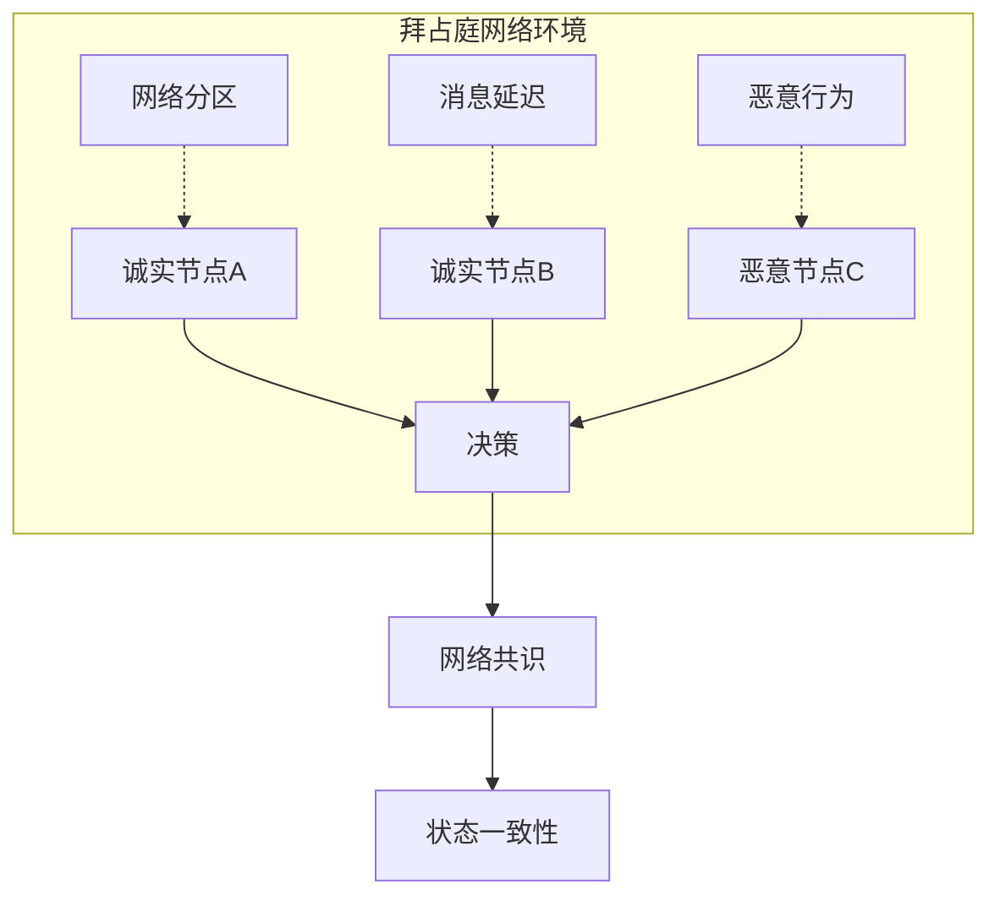
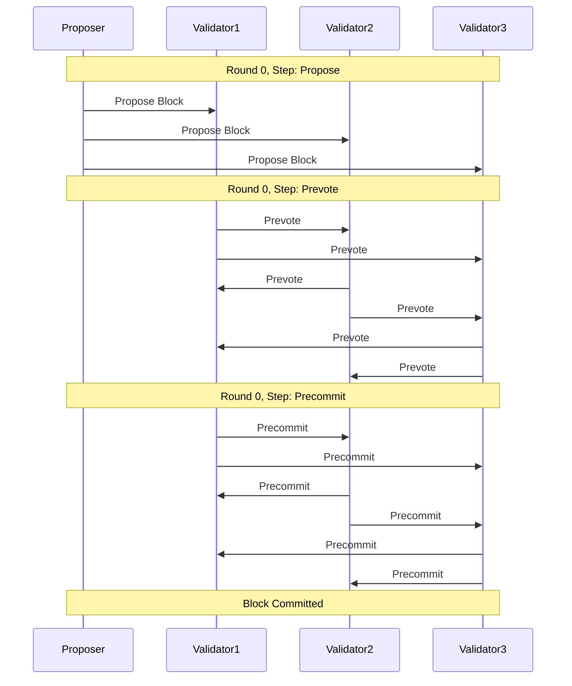
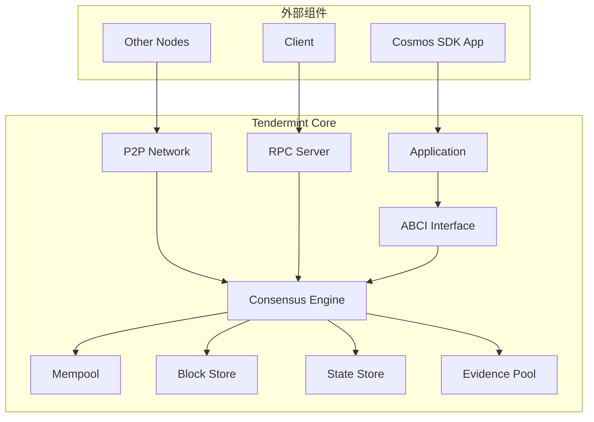
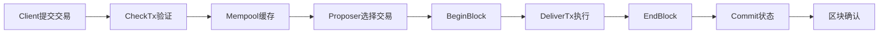
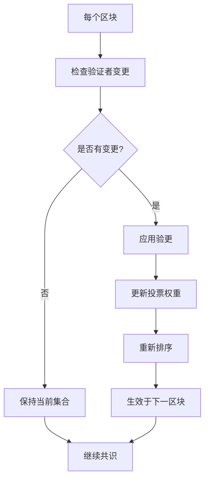
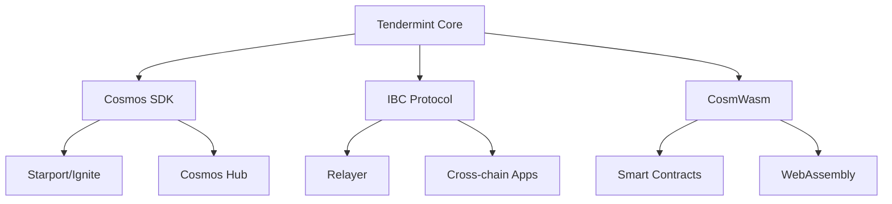

# Tendermint 共识机制

**学习阶段**: 阶段二 | **难度**: ⭐⭐⭐☆☆ | **预估时间**: 25-30 小时

---

## 📚 学习目标

完成本章学习后，您将能够：

-   深入理解 BFT 共识算法的原理和优势
-   掌握 Tendermint Core 的架构设计和工作机制
-   学会配置和管理验证者网络
-   掌握 Tendermint 的性能优化策略
-   理解 Tendermint 在 Cosmos 生态中的核心作用

---

## 🎯 BFT 共识算法原理

### 1. 拜占庭容错基础

**拜占庭将军问题**是分布式系统中的经典问题，描述了在存在恶意节点的网络中如何达成一致性。

#### 问题定义



#### BFT 容错能力

-   **安全性**: 诚实节点永远不会就不同的值达成共识
-   **活性**: 如果网络同步且诚实节点占多数，最终会达成共识
-   **容错阈值**: 最多容忍 f = (n-1)/3 个恶意节点，其中 n 为总节点数

### 2. Tendermint BFT 算法

Tendermint 采用改进的 PBFT（Practical Byzantine Fault Tolerance）算法，具有以下特点：

#### 核心特性

-   **即时最终性**: 一旦区块被确认，立即具有最终性
-   **安全优先**: 在网络分区时优先保证安全性而非可用性
-   **简化设计**: 相比传统 PBFT，简化了算法复杂度

#### 共识流程



---

## 🏗️ Tendermint Core 架构

### 1. 核心组件

Tendermint Core 由以下主要组件构成：



#### 组件职责

**1. Consensus Engine（共识引擎）**

```go
// 共识状态机的核心结构
type ConsensusState struct {
    config        *cfg.ConsensusConfig
    privValidator types.PrivValidator
    blockStore    sm.BlockStore
    mempool       mempl.Mempool
    evpool        sm.EvidencePool

    // 共识状态
    Height          int64
    Round           int32
    Step            cstypes.RoundStepType
    Votes           *HeightVoteSet
    CommitRound     int32
    LastCommit      *types.Commit
    LastValidators  *types.ValidatorSet
    Validators      *types.ValidatorSet
    Proposal        *types.Proposal
    ProposalBlock   *types.Block
}
```

**2. Mempool（内存池）**

-   管理未确认的交易
-   防止重复交易和垃圾交易
-   为提议者提供交易排序

**3. Block Store（区块存储）**

-   持久化存储已确认的区块
-   提供区块查询和检索功能
-   支持区块同步和状态恢复

### 2. ABCI 接口详解

**Application Blockchain Interface (ABCI)** 是 Tendermint 与应用层的标准接口。

#### ABCI 方法分类

```go
// ABCI接口定义
type Application interface {
    // 信息查询
    Info(RequestInfo) ResponseInfo
    Query(RequestQuery) ResponseQuery

    // 交易处理
    CheckTx(RequestCheckTx) ResponseCheckTx
    DeliverTx(RequestDeliverTx) ResponseDeliverTx

    // 区块生命周期
    BeginBlock(RequestBeginBlock) ResponseBeginBlock
    EndBlock(RequestEndBlock) ResponseEndBlock
    Commit() ResponseCommit

    // 状态同步
    ListSnapshots(RequestListSnapshots) ResponseListSnapshots
    OfferSnapshot(RequestOfferSnapshot) ResponseOfferSnapshot
    LoadSnapshotChunk(RequestLoadSnapshotChunk) ResponseLoadSnapshotChunk
    ApplySnapshotChunk(RequestApplySnapshotChunk) ResponseApplySnapshotChunk
}
```

#### 交易生命周期



---

## 🔧 验证者网络管理

### 1. 验证者角色和职责

#### 验证者类型

```yaml
验证者分类:
    活跃验证者:
        数量: 通常100-200个
        职责: 参与共识投票
        奖励: 获得区块奖励和手续费

    候选验证者:
        数量: 无限制
        职责: 等待进入活跃集合
        奖励: 不参与共识，无直接奖励

    委托者:
        角色: 代币持有者
        行为: 委托给验证者
        收益: 分享验证者奖励
```

### 2. 验证者选择机制

#### Bonded Proof of Stake

```go
// 验证者权重计算
type Validator struct {
    Address     sdk.ConsAddress
    PubKey      crypto.PubKey
    VotingPower int64  // 投票权重
    Tokens      sdk.Int // 质押代币数量
}

// 验证者集合更新
func (vs *ValidatorSet) UpdateWithChangeSet(changes []*Validator) error {
    // 1. 验证变更的有效性
    // 2. 应用权重变更
    // 3. 重新排序验证者
    // 4. 更新总投票权重
    return nil
}
```

#### 验证者轮换



### 3. 验证者配置和运营

#### 节点配置

```toml
# config.toml
[consensus]
timeout_propose = "3s"
timeout_propose_delta = "500ms"
timeout_prevote = "1s"
timeout_prevote_delta = "500ms"
timeout_precommit = "1s"
timeout_precommit_delta = "500ms"
timeout_commit = "5s"

# 跳过超时提交
skip_timeout_commit = false

# 创建空块
create_empty_blocks = true
create_empty_blocks_interval = "0s"

# 对等节点配置
peer_gossip_sleep_duration = "100ms"
peer_query_maj23_sleep_duration = "2s"
```

#### 私钥管理

```go
// 验证者私钥接口
type PrivValidator interface {
    GetPubKey() (crypto.PubKey, error)
    SignVote(chainID string, vote *Vote) error
    SignProposal(chainID string, proposal *Proposal) error
}

// 文件私钥验证者
type FilePV struct {
    Key           PrivValidatorKey
    LastSignState LastSignState
    keyFilePath   string
    stateFilePath string
}
```

---

## ⚡ 性能优化策略

### 1. 共识性能优化

#### 超时参数调优

```go
// 共识超时配置优化
type ConsensusConfig struct {
    // 提案超时 - 影响区块生产速度
    TimeoutPropose time.Duration // 建议: 1-3秒

    // 投票超时 - 影响共识收敛速度
    TimeoutPrevote   time.Duration // 建议: 1秒
    TimeoutPrecommit time.Duration // 建议: 1秒

    // 提交超时 - 影响最终确认时间
    TimeoutCommit time.Duration // 建议: 1-5秒
}

// 动态超时调整策略
func (cs *ConsensusState) calculateTimeout(step cstypes.RoundStepType, round int32) time.Duration {
    baseTimeout := cs.config.getBaseTimeout(step)

    // 根据轮次增加超时时间
    roundTimeout := time.Duration(round) * cs.config.getTimeoutDelta(step)

    return baseTimeout + roundTimeout
}
```

#### 网络优化

```yaml
网络性能优化:
    连接管理:
        - 维持足够的对等连接 (建议20-50个)
        - 优先连接地理位置近的节点
        - 定期清理无效连接

    消息传播:
        - 使用消息压缩减少带宽
        - 批量发送消息减少网络开销
        - 实现智能路由避免重复传播

    带宽控制:
        - 限制每个连接的带宽使用
        - 优先传播共识相关消息
        - 实现消息优先级队列
```

### 2. 存储性能优化

#### 状态存储优化

```go
// IAVL树优化配置
type IAVLConfig struct {
    // 缓存大小 - 影响读取性能
    CacheSize int // 建议: 10000-50000

    // 快照间隔 - 影响同步速度
    SnapshotInterval uint64 // 建议: 1000-5000

    // 修剪策略 - 影响存储空间
    PruningStrategy string // "default", "nothing", "everything"
}

// 状态同步优化
func (app *BaseApp) Snapshot(height uint64, format uint32) (<-chan io.ReadCloser, error) {
    // 1. 创建状态快照
    // 2. 压缩快照数据
    // 3. 分块传输
    return snapshotChan, nil
}
```

#### 区块存储优化

```go
// 区块存储配置
type BlockStoreConfig struct {
    // 区块缓存大小
    BlockCacheSize int

    // 区块索引缓存
    IndexCacheSize int

    // 压缩算法
    CompressionType string // "none", "gzip", "lz4"
}
```

### 3. 内存池优化

#### 交易池管理

```go
// 内存池配置优化
type MempoolConfig struct {
    // 最大交易数量
    Size int // 建议: 5000-10000

    // 最大交易字节数
    MaxTxsBytes int64 // 建议: 1GB

    // 缓存大小
    CacheSize int // 建议: 10000

    // 交易生存时间
    TTLDuration time.Duration // 建议: 1小时
}

// 交易优先级排序
func (mem *CListMempool) prioritizeTransactions() {
    // 1. 按手续费排序
    // 2. 考虑交易依赖关系
    // 3. 防止垃圾交易攻击
}
```

---

## 💻 实践练习

### 练习 1: 搭建 Tendermint 测试网络

#### 环境准备

```bash
# 安装Tendermint
go install github.com/tendermint/tendermint/cmd/tendermint@latest

# 验证安装
tendermint version
```

#### 单节点网络

```bash
# 初始化节点
tendermint init

# 启动节点
tendermint node --proxy_app=kvstore
```

#### 多节点网络配置

```bash
# 生成4个验证者的配置
tendermint testnet --v 4 --o ./testnet --populate-persistent-peers

# 启动节点0
cd testnet/node0
tendermint node --proxy_app=kvstore

# 启动其他节点 (在不同终端)
cd testnet/node1 && tendermint node --proxy_app=kvstore
cd testnet/node2 && tendermint node --proxy_app=kvstore
cd testnet/node3 && tendermint node --proxy_app=kvstore
```

### 练习 2: 自定义 ABCI 应用

#### 简单计数器应用

```go
package main

import (
    "encoding/binary"
    "encoding/json"
    "fmt"

    abcitypes "github.com/tendermint/tendermint/abci/types"
    "github.com/tendermint/tendermint/libs/log"
)

type CounterApplication struct {
    abcitypes.BaseApplication

    hashCount int
    txCount   int
    serial    bool
}

func NewCounterApplication(serial bool) *CounterApplication {
    return &CounterApplication{serial: serial}
}

func (app *CounterApplication) Info(req abcitypes.RequestInfo) abcitypes.ResponseInfo {
    return abcitypes.ResponseInfo{
        Data:       fmt.Sprintf("{\"hashes\":%v,\"txs\":%v}", app.hashCount, app.txCount),
        Version:    version.ABCIVersion,
        AppVersion: 1,
    }
}

func (app *CounterApplication) DeliverTx(req abcitypes.RequestDeliverTx) abcitypes.ResponseDeliverTx {
    // 解析交易
    var tx map[string]interface{}
    if err := json.Unmarshal(req.Tx, &tx); err != nil {
        return abcitypes.ResponseDeliverTx{Code: 1, Log: err.Error()}
    }

    // 执行业务逻辑
    app.txCount++

    return abcitypes.ResponseDeliverTx{Code: 0}
}

func (app *CounterApplication) CheckTx(req abcitypes.RequestCheckTx) abcitypes.ResponseCheckTx {
    // 验证交易格式
    var tx map[string]interface{}
    if err := json.Unmarshal(req.Tx, &tx); err != nil {
        return abcitypes.ResponseCheckTx{Code: 1, Log: err.Error()}
    }

    return abcitypes.ResponseCheckTx{Code: 0}
}

func (app *CounterApplication) Commit() abcitypes.ResponseCommit {
    // 计算应用状态哈希
    app.hashCount++

    if app.txCount == 0 {
        return abcitypes.ResponseCommit{}
    }

    hash := make([]byte, 8)
    binary.BigEndian.PutUint64(hash, uint64(app.txCount))

    return abcitypes.ResponseCommit{Data: hash}
}
```

### 练习 3: 验证者操作实践

#### 创建验证者

```bash
# 生成验证者密钥
tendermint gen_validator > validator.json

# 查看验证者信息
cat validator.json
```

#### 验证者签名测试

```go
// 验证者签名验证
func validateSignature(pubKey crypto.PubKey, msg []byte, sig []byte) bool {
    return pubKey.VerifySignature(msg, sig)
}

// 创建投票
func createVote(privVal types.PrivValidator, chainID string, height int64, round int32) (*types.Vote, error) {
    vote := &types.Vote{
        Type:      types.PrevoteType,
        Height:    height,
        Round:     round,
        Timestamp: time.Now(),
    }

    err := privVal.SignVote(chainID, vote)
    return vote, err
}
```

---

## 🔧 开发工具和资源

### 开发工具

#### Tendermint CLI 工具

```bash
# 节点管理
tendermint init              # 初始化节点
tendermint node             # 启动节点
tendermint unsafe_reset_all # 重置节点数据

# 测试网络
tendermint testnet          # 生成测试网络配置
tendermint show_validator   # 显示验证者信息

# 调试工具
tendermint version          # 版本信息
tendermint probe_upnp       # 网络连接测试
```

#### 监控和调试

```yaml
监控工具:
    Prometheus指标:
        - 共识轮次和高度
        - 验证者投票统计
        - 网络连接状态
        - 内存池大小

    日志分析:
        - 共识状态变化
        - 网络消息传播
        - 性能瓶颈识别

    性能分析:
        - CPU使用率
        - 内存占用
        - 磁盘I/O
        - 网络带宽
```

### 参考资源

#### 官方文档

-   [Tendermint Core 文档](https://docs.tendermint.com/)
-   [ABCI 规范](https://github.com/tendermint/tendermint/tree/master/spec/abci)
-   [共识算法详解](https://github.com/tendermint/tendermint/tree/master/spec/consensus)

#### 学习资源

-   [Tendermint 大学](https://github.com/tendermint/tendermint/tree/master/docs)
-   [共识算法论文](https://arxiv.org/abs/1807.04938)
-   [BFT 算法比较](https://blog.cosmos.network/consensus-compare-casper-vs-tendermint-6df154ad56ae)

---

## 📈 进阶学习

### 深入研究方向

#### 1. 共识算法优化

-   **HotStuff 算法**: 线性通信复杂度的 BFT 算法
-   **异步 BFT**: 处理网络异步环境的共识
-   **分片共识**: 提高网络吞吐量的分片技术

#### 2. 性能提升技术

-   **并行执行**: 交易并行处理技术
-   **状态通道**: 链下状态更新机制
-   **零知识证明**: 隐私保护的共识验证

#### 3. 跨链共识

-   **IBC 协议**: 跨链通信的共识机制
-   **中继链**: 多链互操作的共识协调
-   **原子交换**: 跨链资产交换的共识保证

### 相关技术栈



### 实际项目应用

#### 主要采用 Tendermint 的项目

-   **Cosmos Hub**: Cosmos 生态的中心枢纽
-   **Binance Chain**: 币安去中心化交易所
-   **Terra**: 稳定币和 DeFi 生态
-   **Osmosis**: 去中心化 AMM 协议
-   **Akash**: 去中心化云计算平台

---

## ✅ 学习检查点

### 理论掌握检查

**基础概念** (必须掌握):

-   [ ] 理解拜占庭容错的基本原理
-   [ ] 掌握 Tendermint BFT 算法流程
-   [ ] 了解 ABCI 接口的作用和方法
-   [ ] 理解验证者网络的运作机制

**深入理解** (建议掌握):

-   [ ] 分析共识算法的安全性和活性
-   [ ] 理解不同超时参数对性能的影响
-   [ ] 掌握验证者轮换的具体机制
-   [ ] 了解状态同步和快照机制

### 实践能力验证

**基础实践** (必须完成):

-   [ ] 成功搭建单节点 Tendermint 网络
-   [ ] 实现简单的 ABCI 应用
-   [ ] 配置多节点测试网络
-   [ ] 进行基本的验证者操作

**进阶实践** (建议完成):

-   [ ] 优化共识参数提升性能
-   [ ] 实现自定义的交易验证逻辑
-   [ ] 集成监控和日志分析
-   [ ] 测试网络分区和恢复场景

### 项目应用评估

**应用设计** (综合能力):

-   [ ] 设计适合特定场景的共识参数
-   [ ] 规划验证者网络的部署策略
-   [ ] 制定网络升级和维护方案
-   [ ] 评估共识机制的安全风险

---

## 📚 参考资源

### 技术文档

-   [Tendermint 官方文档](https://docs.tendermint.com/)
-   [ABCI 接口规范](https://github.com/tendermint/tendermint/tree/master/spec/abci)
-   [共识算法规范](https://github.com/tendermint/tendermint/tree/master/spec/consensus)
-   [P2P 网络协议](https://github.com/tendermint/tendermint/tree/master/spec/p2p)

### 学术论文

-   [The latest gossip on BFT consensus](https://arxiv.org/abs/1807.04938)
-   [Practical Byzantine Fault Tolerance](http://pmg.csail.mit.edu/papers/osdi99.pdf)
-   [HotStuff: BFT Consensus with Linearity and Responsiveness](https://arxiv.org/abs/1803.05069)

### 开源项目

-   [Tendermint Core](https://github.com/tendermint/tendermint)
-   [Cosmos SDK](https://github.com/cosmos/cosmos-sdk)
-   [IBC Go](https://github.com/cosmos/ibc-go)

### 社区资源

-   [Cosmos 开发者门户](https://tutorials.cosmos.network/)
-   [Tendermint 博客](https://blog.cosmos.network/)
-   [Discord 社区](https://discord.gg/cosmosnetwork)

---

**下一章**: [IBC 跨链通信协议](./05-IBC-Cross-Chain.md)
