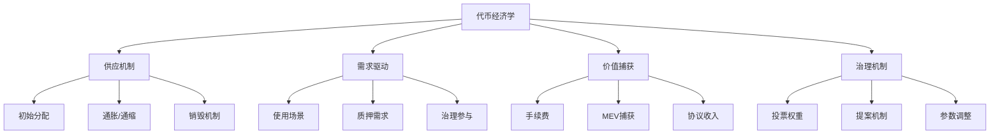

# 代币经济学设计

**学习阶段**: 阶段三 | **难度**: ⭐⭐⭐⭐☆ | **预估时间**: 25-30小时

---

## 📚 学习目标

完成本章学习后，您将能够：
- 理解代币经济学的基础理论和设计原则
- 掌握通胀与通缩机制的设计方法
- 设计可持续的激励机制和价值捕获模型
- 分析和优化代币分配策略
- 构建经济模型的数学基础

---

## 💰 代币经济学基础理论

### 1. 代币经济学定义

**代币经济学 (Tokenomics)** = Token + Economics，是研究代币在区块链生态系统中的经济行为、激励机制和价值流转的学科。

#### 核心要素



### 2. 代币功能分类

#### 2.1 支付代币 (Payment Token)
- **功能**: 作为交易媒介和价值存储
- **特征**: 流动性高、波动性相对较低
- **示例**: Bitcoin, Litecoin

#### 2.2 实用代币 (Utility Token)
- **功能**: 获取网络服务和功能
- **特征**: 与平台使用量相关
- **示例**: Ethereum (Gas费), Filecoin (存储费用)

#### 2.3 治理代币 (Governance Token)
- **功能**: 参与协议治理和决策
- **特征**: 投票权重、提案权
- **示例**: UNI, COMP, AAVE

#### 2.4 证券代币 (Security Token)
- **功能**: 代表传统金融资产的所有权
- **特征**: 受监管、有分红权
- **示例**: 房地产代币、股权代币

### 3. 经济学基础原理

#### 3.1 供需平衡

```python
# 供需平衡模型
import numpy as np
import matplotlib.pyplot as plt

def supply_curve(price, supply_elasticity=1.5):
    """供应曲线：价格越高，供应越多"""
    return supply_elasticity * price

def demand_curve(price, demand_elasticity=-1.2, max_demand=1000):
    """需求曲线：价格越高，需求越少"""
    return max_demand * (price ** demand_elasticity)

def find_equilibrium(supply_func, demand_func, price_range):
    """寻找均衡点"""
    prices = np.linspace(0.1, price_range, 1000)
    supply = [supply_func(p) for p in prices]
    demand = [demand_func(p) for p in prices]
    
    # 找到供需最接近的点
    differences = [abs(s - d) for s, d in zip(supply, demand)]
    equilibrium_index = differences.index(min(differences))
    
    return prices[equilibrium_index], supply[equilibrium_index]

# 计算均衡价格和数量
eq_price, eq_quantity = find_equilibrium(supply_curve, demand_curve, 10)
print(f"均衡价格: ${eq_price:.2f}")
print(f"均衡数量: {eq_quantity:.0f}")
```

#### 3.2 网络效应

**梅特卡夫定律**: 网络价值与用户数量的平方成正比

```python
def metcalfe_value(users, value_per_connection=1):
    """梅特卡夫定律：V = k * n^2"""
    return value_per_connection * users ** 2

def network_growth_simulation(initial_users, growth_rate, periods):
    """网络增长模拟"""
    users = [initial_users]
    values = [metcalfe_value(initial_users)]
    
    for i in range(periods):
        new_users = users[-1] * (1 + growth_rate)
        users.append(new_users)
        values.append(metcalfe_value(new_users))
    
    return users, values

# 模拟网络增长
users, values = network_growth_simulation(1000, 0.1, 24)  # 10%月增长率，24个月
print(f"初始价值: {values[0]:,.0f}")
print(f"24个月后价值: {values[-1]:,.0f}")
print(f"价值增长倍数: {values[-1]/values[0]:.1f}x")
```

---

## 🔄 通胀与通缩机制设计

### 1. 通胀机制 (Inflation)

#### 1.1 固定通胀率

```python
class FixedInflationModel:
    def __init__(self, initial_supply, annual_inflation_rate):
        self.initial_supply = initial_supply
        self.annual_inflation_rate = annual_inflation_rate
    
    def calculate_supply(self, years):
        """计算指定年份后的代币供应量"""
        return self.initial_supply * (1 + self.annual_inflation_rate) ** years
    
    def calculate_inflation_rewards(self, years):
        """计算通胀奖励总量"""
        final_supply = self.calculate_supply(years)
        return final_supply - self.initial_supply

# 示例：10%年通胀率
model = FixedInflationModel(1_000_000_000, 0.10)
print(f"5年后供应量: {model.calculate_supply(5):,.0f}")
print(f"5年通胀奖励: {model.calculate_inflation_rewards(5):,.0f}")
```

#### 1.2 动态通胀率

基于质押率的动态调整机制：

```python
class DynamicInflationModel:
    def __init__(self, initial_supply, target_staking_ratio=0.67):
        self.initial_supply = initial_supply
        self.target_staking_ratio = target_staking_ratio
        self.min_inflation = 0.07  # 7%
        self.max_inflation = 0.20  # 20%
    
    def calculate_inflation_rate(self, current_staking_ratio):
        """基于当前质押率计算通胀率"""
        if current_staking_ratio >= self.target_staking_ratio:
            # 质押率达标，使用最低通胀率
            return self.min_inflation
        else:
            # 质押率不足，提高通胀率激励质押
            ratio_deficit = self.target_staking_ratio - current_staking_ratio
            inflation_increase = ratio_deficit * (self.max_inflation - self.min_inflation) / self.target_staking_ratio
            return min(self.min_inflation + inflation_increase, self.max_inflation)
    
    def calculate_staking_rewards(self, staked_amount, total_supply, staking_ratio):
        """计算质押奖励"""
        inflation_rate = self.calculate_inflation_rate(staking_ratio)
        total_rewards = total_supply * inflation_rate
        
        # 奖励分配给质押者
        if staked_amount > 0:
            return (staked_amount / (total_supply * staking_ratio)) * total_rewards
        return 0

# 示例：动态通胀模型
dynamic_model = DynamicInflationModel(1_000_000_000)

# 不同质押率下的通胀率
staking_ratios = [0.3, 0.5, 0.67, 0.8]
for ratio in staking_ratios:
    inflation = dynamic_model.calculate_inflation_rate(ratio)
    print(f"质押率 {ratio*100:.0f}%: 通胀率 {inflation*100:.1f}%")
```

### 2. 通缩机制 (Deflation)

#### 2.1 代币销毁机制

```python
class TokenBurnModel:
    def __init__(self, initial_supply):
        self.initial_supply = initial_supply
        self.current_supply = initial_supply
        self.total_burned = 0
    
    def burn_from_fees(self, transaction_volume, fee_rate, burn_percentage):
        """从交易费用中销毁代币"""
        total_fees = transaction_volume * fee_rate
        burn_amount = total_fees * burn_percentage
        
        self.current_supply -= burn_amount
        self.total_burned += burn_amount
        
        return burn_amount
    
    def burn_from_buyback(self, buyback_amount):
        """回购销毁"""
        self.current_supply -= buyback_amount
        self.total_burned += buyback_amount
        
        return buyback_amount
    
    def get_burn_rate(self):
        """计算累计销毁率"""
        return self.total_burned / self.initial_supply

# 示例：代币销毁模拟
burn_model = TokenBurnModel(1_000_000_000)

# 模拟12个月的交易费用销毁
monthly_volume = 10_000_000  # 月交易量
fee_rate = 0.003  # 0.3%手续费
burn_percentage = 0.5  # 50%手续费销毁

for month in range(12):
    burned = burn_model.burn_from_fees(monthly_volume, fee_rate, burn_percentage)
    print(f"第{month+1}月销毁: {burned:,.0f}, 剩余供应: {burn_model.current_supply:,.0f}")

print(f"年度销毁率: {burn_model.get_burn_rate()*100:.2f}%")
```

#### 2.2 EIP-1559风格的销毁机制

```python
class EIP1559BurnModel:
    def __init__(self, base_fee_per_gas=20, target_gas_per_block=15_000_000):
        self.base_fee = base_fee_per_gas  # Gwei
        self.target_gas = target_gas_per_block
        self.max_change_denominator = 8  # 12.5%最大变化
    
    def update_base_fee(self, actual_gas_used):
        """根据实际Gas使用量更新基础费用"""
        if actual_gas_used > self.target_gas:
            # 使用量超过目标，提高基础费用
            gas_used_delta = actual_gas_used - self.target_gas
            base_fee_delta = max(
                self.base_fee * gas_used_delta // self.target_gas // self.max_change_denominator,
                1
            )
            self.base_fee += base_fee_delta
        elif actual_gas_used < self.target_gas:
            # 使用量低于目标，降低基础费用
            gas_used_delta = self.target_gas - actual_gas_used
            base_fee_delta = self.base_fee * gas_used_delta // self.target_gas // self.max_change_denominator
            self.base_fee = max(self.base_fee - base_fee_delta, 1)
        
        return self.base_fee
    
    def calculate_burned_fees(self, gas_used):
        """计算销毁的基础费用"""
        return gas_used * self.base_fee / 1e9  # 转换为ETH单位

# 示例：EIP-1559销毁模拟
eip1559 = EIP1559BurnModel()

# 模拟不同网络拥堵情况
scenarios = [
    ("低拥堵", 10_000_000),
    ("正常", 15_000_000),
    ("高拥堵", 25_000_000),
    ("极度拥堵", 30_000_000)
]

for scenario, gas_used in scenarios:
    burned = eip1559.calculate_burned_fees(gas_used)
    new_base_fee = eip1559.update_base_fee(gas_used)
    print(f"{scenario}: 销毁 {burned:.2f} ETH, 新基础费用 {new_base_fee} Gwei")
```

---

## 🎯 激励机制设计

### 1. 质押奖励机制

#### 1.1 基础质押奖励

```python
class StakingRewardModel:
    def __init__(self, total_supply, annual_inflation_rate):
        self.total_supply = total_supply
        self.annual_inflation_rate = annual_inflation_rate
    
    def calculate_staking_apr(self, total_staked):
        """计算质押年化收益率"""
        if total_staked == 0:
            return 0
        
        annual_rewards = self.total_supply * self.annual_inflation_rate
        return annual_rewards / total_staked
    
    def calculate_individual_rewards(self, staked_amount, total_staked, days):
        """计算个人质押奖励"""
        if total_staked == 0:
            return 0
        
        daily_rewards = (self.total_supply * self.annual_inflation_rate) / 365
        individual_share = staked_amount / total_staked
        
        return daily_rewards * individual_share * days

# 示例：质押奖励计算
staking_model = StakingRewardModel(1_000_000_000, 0.10)

# 不同质押率下的APR
staking_ratios = [0.3, 0.5, 0.67, 0.8]
for ratio in staking_ratios:
    total_staked = staking_model.total_supply * ratio
    apr = staking_model.calculate_staking_apr(total_staked)
    print(f"质押率 {ratio*100:.0f}%: APR {apr*100:.1f}%")
```

#### 1.2 复合质押奖励

```python
class CompoundStakingModel:
    def __init__(self, initial_stake, annual_apr, compound_frequency=365):
        self.initial_stake = initial_stake
        self.annual_apr = annual_apr
        self.compound_frequency = compound_frequency  # 复利频率（每年）
    
    def calculate_compound_returns(self, years):
        """计算复利收益"""
        rate_per_period = self.annual_apr / self.compound_frequency
        total_periods = years * self.compound_frequency
        
        final_amount = self.initial_stake * (1 + rate_per_period) ** total_periods
        return final_amount - self.initial_stake
    
    def simulate_staking_journey(self, years, additional_monthly_stake=0):
        """模拟质押历程"""
        current_stake = self.initial_stake
        monthly_rate = self.annual_apr / 12
        
        results = []
        for month in range(int(years * 12)):
            # 添加新质押
            current_stake += additional_monthly_stake
            
            # 计算月度奖励
            monthly_reward = current_stake * monthly_rate
            current_stake += monthly_reward
            
            results.append({
                'month': month + 1,
                'stake': current_stake,
                'monthly_reward': monthly_reward,
                'total_rewards': current_stake - self.initial_stake - (additional_monthly_stake * (month + 1))
            })
        
        return results

# 示例：复合质押模拟
compound_model = CompoundStakingModel(10000, 0.12)  # 10,000代币，12% APR

# 5年复利收益
compound_returns = compound_model.calculate_compound_returns(5)
print(f"5年复利收益: {compound_returns:,.2f}")

# 模拟每月追加质押1000代币
journey = compound_model.simulate_staking_journey(2, 1000)
final_result = journey[-1]
print(f"24个月后总质押: {final_result['stake']:,.2f}")
print(f"总奖励: {final_result['total_rewards']:,.2f}")
```

### 2. 流动性挖矿机制

```python
class LiquidityMiningModel:
    def __init__(self, total_rewards_per_day, pools):
        self.total_rewards_per_day = total_rewards_per_day
        self.pools = pools  # {pool_name: weight}
        self.total_weight = sum(pools.values())
    
    def calculate_pool_rewards(self, pool_name):
        """计算单个池子的日奖励"""
        if pool_name not in self.pools:
            return 0
        
        pool_weight = self.pools[pool_name]
        return self.total_rewards_per_day * (pool_weight / self.total_weight)
    
    def calculate_user_rewards(self, pool_name, user_liquidity, total_pool_liquidity):
        """计算用户在特定池子的奖励"""
        if total_pool_liquidity == 0:
            return 0
        
        pool_daily_rewards = self.calculate_pool_rewards(pool_name)
        user_share = user_liquidity / total_pool_liquidity
        
        return pool_daily_rewards * user_share
    
    def calculate_apy(self, pool_name, total_pool_liquidity, token_price):
        """计算池子的年化收益率"""
        daily_rewards = self.calculate_pool_rewards(pool_name)
        annual_rewards = daily_rewards * 365
        
        if total_pool_liquidity == 0:
            return 0
        
        pool_value_usd = total_pool_liquidity * token_price
        return (annual_rewards * token_price) / pool_value_usd

# 示例：流动性挖矿配置
pools_config = {
    'ABLE/USDC': 40,    # 40%权重
    'ABLE/ETH': 30,     # 30%权重
    'ABLE/BTC': 20,     # 20%权重
    'ABLE/ATOM': 10     # 10%权重
}

lm_model = LiquidityMiningModel(100000, pools_config)  # 每日10万代币奖励

# 计算各池子奖励
for pool_name in pools_config:
    daily_rewards = lm_model.calculate_pool_rewards(pool_name)
    print(f"{pool_name} 池日奖励: {daily_rewards:,.0f} ABLE")

# 计算用户奖励示例
user_liquidity = 50000  # 用户提供5万代币流动性
total_pool_liquidity = 1000000  # 池子总流动性100万
user_daily_rewards = lm_model.calculate_user_rewards('ABLE/USDC', user_liquidity, total_pool_liquidity)
print(f"用户日奖励: {user_daily_rewards:,.2f} ABLE")
```

---

## 💎 价值捕获模型

### 1. 手续费价值捕获

```python
class FeeValueCaptureModel:
    def __init__(self, fee_structure):
        self.fee_structure = fee_structure  # {transaction_type: fee_rate}
    
    def calculate_protocol_revenue(self, transaction_volumes):
        """计算协议收入"""
        total_revenue = 0
        revenue_breakdown = {}
        
        for tx_type, volume in transaction_volumes.items():
            if tx_type in self.fee_structure:
                fee_rate = self.fee_structure[tx_type]
                revenue = volume * fee_rate
                total_revenue += revenue
                revenue_breakdown[tx_type] = revenue
        
        return total_revenue, revenue_breakdown
    
    def distribute_revenue(self, total_revenue, distribution_model):
        """分配协议收入"""
        distribution = {}
        
        for recipient, percentage in distribution_model.items():
            distribution[recipient] = total_revenue * percentage
        
        return distribution

# 示例：RWA平台手续费模型
fee_structure = {
    'asset_tokenization': 0.005,    # 0.5%资产代币化费用
    'asset_transfer': 0.001,        # 0.1%资产转移费用
    'asset_trading': 0.003,         # 0.3%资产交易费用
    'yield_distribution': 0.002,    # 0.2%收益分配费用
}

# 收入分配模型
distribution_model = {
    'token_holders': 0.40,    # 40%给代币持有者
    'stakers': 0.30,          # 30%给质押者
    'treasury': 0.20,         # 20%进入国库
    'development': 0.10       # 10%用于开发
}

fee_model = FeeValueCaptureModel(fee_structure)

# 模拟月度交易量
monthly_volumes = {
    'asset_tokenization': 50_000_000,   # 5000万美元资产代币化
    'asset_transfer': 20_000_000,       # 2000万美元资产转移
    'asset_trading': 100_000_000,       # 1亿美元资产交易
    'yield_distribution': 30_000_000    # 3000万美元收益分配
}

total_revenue, breakdown = fee_model.calculate_protocol_revenue(monthly_volumes)
distribution = fee_model.distribute_revenue(total_revenue, distribution_model)

print(f"月度总收入: ${total_revenue:,.0f}")
print("\n收入来源:")
for source, amount in breakdown.items():
    print(f"  {source}: ${amount:,.0f}")

print("\n收入分配:")
for recipient, amount in distribution.items():
    print(f"  {recipient}: ${amount:,.0f}")
```

### 2. MEV价值捕获

```python
class MEVCaptureModel:
    def __init__(self, validator_commission=0.05):
        self.validator_commission = validator_commission
    
    def calculate_mev_rewards(self, block_mev_value, proposer_share=0.8):
        """计算MEV奖励分配"""
        proposer_reward = block_mev_value * proposer_share
        validator_reward = proposer_reward * self.validator_commission
        delegator_reward = proposer_reward - validator_reward
        
        # 剩余部分分配给所有验证者
        remaining_mev = block_mev_value * (1 - proposer_share)
        
        return {
            'proposer_validator': validator_reward,
            'proposer_delegators': delegator_reward,
            'all_validators': remaining_mev
        }
    
    def simulate_mev_distribution(self, daily_mev_value, num_validators, days=30):
        """模拟MEV分配"""
        daily_per_validator = daily_mev_value / num_validators
        
        total_rewards = {}
        for day in range(days):
            day_rewards = self.calculate_mev_rewards(daily_per_validator)
            
            for category, reward in day_rewards.items():
                if category not in total_rewards:
                    total_rewards[category] = 0
                total_rewards[category] += reward
        
        return total_rewards

# 示例：MEV价值捕获
mev_model = MEVCaptureModel(0.05)  # 5%验证者佣金

# 模拟参数
daily_mev = 100_000  # 日MEV价值10万美元
num_validators = 100  # 100个验证者

monthly_mev_distribution = mev_model.simulate_mev_distribution(daily_mev, num_validators, 30)

print("月度MEV分配:")
for category, amount in monthly_mev_distribution.items():
    print(f"  {category}: ${amount:,.2f}")
```

---

## 📊 代币分配策略

### 1. 初始分配模型

```python
class TokenDistributionModel:
    def __init__(self, total_supply):
        self.total_supply = total_supply
        self.allocations = {}
        self.vesting_schedules = {}
    
    def add_allocation(self, category, percentage, vesting_schedule=None):
        """添加分配类别"""
        amount = self.total_supply * percentage
        self.allocations[category] = {
            'percentage': percentage,
            'amount': amount,
            'vesting': vesting_schedule
        }
        
        if vesting_schedule:
            self.vesting_schedules[category] = vesting_schedule
    
    def calculate_circulating_supply(self, months_elapsed):
        """计算流通供应量"""
        circulating = 0
        
        for category, allocation in self.allocations.items():
            if allocation['vesting']:
                # 有锁仓期的分配
                vested_amount = self.calculate_vested_amount(
                    category, 
                    allocation['amount'], 
                    months_elapsed
                )
                circulating += vested_amount
            else:
                # 无锁仓期的分配
                circulating += allocation['amount']
        
        return circulating
    
    def calculate_vested_amount(self, category, total_amount, months_elapsed):
        """计算已解锁数量"""
        vesting = self.vesting_schedules[category]
        cliff_months = vesting.get('cliff_months', 0)
        vesting_months = vesting.get('vesting_months', 0)
        
        if months_elapsed < cliff_months:
            return 0
        
        if months_elapsed >= cliff_months + vesting_months:
            return total_amount
        
        # 线性解锁
        vesting_progress = (months_elapsed - cliff_months) / vesting_months
        return total_amount * vesting_progress

# 示例：RealChain代币分配
distribution = TokenDistributionModel(1_000_000_000)  # 10亿代币

# 添加分配类别
distribution.add_allocation('ecosystem', 0.30)  # 30%生态发展，无锁仓
distribution.add_allocation('team', 0.20, {     # 20%团队，12个月cliff，36个月线性解锁
    'cliff_months': 12,
    'vesting_months': 36
})
distribution.add_allocation('public_sale', 0.25)  # 25%公开销售，无锁仓
distribution.add_allocation('validators', 0.15, { # 15%验证者激励，6个月cliff，24个月线性解锁
    'cliff_months': 6,
    'vesting_months': 24
})
distribution.add_allocation('treasury', 0.10, {   # 10%国库，24个月cliff，48个月线性解锁
    'cliff_months': 24,
    'vesting_months': 48
})

# 模拟5年流通供应量变化
print("流通供应量变化:")
for year in range(6):
    months = year * 12
    circulating = distribution.calculate_circulating_supply(months)
    percentage = (circulating / distribution.total_supply) * 100
    print(f"第{year}年: {circulating:,.0f} ({percentage:.1f}%)")
```

### 2. 动态分配调整

```python
class DynamicAllocationModel:
    def __init__(self, base_distribution):
        self.base_distribution = base_distribution
        self.adjustment_factors = {}
    
    def add_adjustment_factor(self, category, factor_name, factor_function):
        """添加调整因子"""
        if category not in self.adjustment_factors:
            self.adjustment_factors[category] = {}
        self.adjustment_factors[category][factor_name] = factor_function
    
    def calculate_adjusted_allocation(self, category, base_amount, context):
        """计算调整后的分配"""
        if category not in self.adjustment_factors:
            return base_amount
        
        adjusted_amount = base_amount
        for factor_name, factor_func in self.adjustment_factors[category].items():
            adjustment = factor_func(context)
            adjusted_amount *= adjustment
        
        return adjusted_amount

# 示例：基于网络表现的动态调整
def network_performance_factor(context):
    """基于网络表现的调整因子"""
    tps = context.get('tps', 0)
    uptime = context.get('uptime', 0)
    
    # TPS调整：目标5000 TPS
    tps_factor = min(tps / 5000, 1.2)  # 最高120%
    
    # 正常运行时间调整：目标99.9%
    uptime_factor = min(uptime / 0.999, 1.1)  # 最高110%
    
    return tps_factor * uptime_factor

def governance_participation_factor(context):
    """基于治理参与度的调整因子"""
    participation_rate = context.get('governance_participation', 0)
    
    # 目标参与率50%
    if participation_rate >= 0.5:
        return 1.1  # 110%
    elif participation_rate >= 0.3:
        return 1.0  # 100%
    else:
        return 0.9  # 90%

# 应用动态调整
dynamic_model = DynamicAllocationModel(distribution)
dynamic_model.add_adjustment_factor('validators', 'performance', network_performance_factor)
dynamic_model.add_adjustment_factor('ecosystem', 'governance', governance_participation_factor)

# 模拟网络状态
network_context = {
    'tps': 4500,
    'uptime': 0.998,
    'governance_participation': 0.45
}

# 计算调整后的验证者奖励
base_validator_rewards = 1_000_000  # 基础100万代币奖励
adjusted_rewards = dynamic_model.calculate_adjusted_allocation(
    'validators', 
    base_validator_rewards, 
    network_context
)

print(f"基础验证者奖励: {base_validator_rewards:,.0f}")
print(f"调整后奖励: {adjusted_rewards:,.0f}")
print(f"调整倍数: {adjusted_rewards/base_validator_rewards:.2f}x")
```

---

## 💡 实践练习

### 练习1: 设计可持续的代币经济模型

为一个RWA平台设计完整的代币经济模型：

```python
class RWATokenomicsModel:
    def __init__(self):
        # TODO: 实现以下功能
        # 1. 代币供应机制（初始供应、通胀/通缩）
        # 2. 价值捕获机制（手续费、协议收入）
        # 3. 激励机制（质押奖励、流动性挖矿）
        # 4. 治理机制（投票权重、提案奖励）
        # 5. 分配策略（初始分配、锁仓计划）
        pass
    
    def simulate_10_year_economics(self):
        """模拟10年经济发展"""
        # TODO: 实现10年经济模拟
        # 包括供应量变化、价格预测、收入分配等
        pass

# 要求：
# 1. 设计合理的代币分配比例
# 2. 实现动态通胀调整机制
# 3. 设计多层次的价值捕获
# 4. 确保长期可持续性
```

### 练习2: 经济模型压力测试

```python
def stress_test_tokenomics(model, scenarios):
    """对代币经济模型进行压力测试"""
    results = {}
    
    for scenario_name, params in scenarios.items():
        # TODO: 实现压力测试
        # 1. 极端市场条件测试
        # 2. 攻击场景模拟
        # 3. 经济参数敏感性分析
        # 4. 长期可持续性验证
        pass
    
    return results

# 测试场景：
scenarios = {
    'bear_market': {'price_drop': 0.8, 'volume_drop': 0.5},
    'bull_market': {'price_increase': 5.0, 'volume_increase': 3.0},
    'governance_attack': {'malicious_proposals': 10, 'vote_buying': True},
    'validator_centralization': {'top_validators_share': 0.8}
}
```

---

## 📖 扩展阅读

### 学术资源
- [Token Economy: How Blockchains and Smart Contracts Revolutionize the Economy](https://github.com/sherminvo/TokenEconomyBook)
- [Cryptoeconomics: An Introduction](https://cryptoeconomics.study/)
- [Mechanism Design for Blockchain Applications](https://arxiv.org/abs/1909.07073)

### 实践案例
- [Ethereum Economic Model](https://ethereum.org/en/developers/docs/gas/)
- [Cosmos Hub Tokenomics](https://hub.cosmos.network/main/hub-overview/overview.html)
- [Uniswap Token Economics](https://uniswap.org/blog/uni)

### 分析工具
- [Token Terminal](https://tokenterminal.com/) - 协议收入分析
- [Messari](https://messari.io/) - 代币经济数据
- [DeFiPulse](https://defipulse.com/) - DeFi协议分析

---

## ✅ 学习检查点

完成本章学习后，请确认您能够：

- [ ] 理解代币经济学的基本原理和设计要素
- [ ] 设计合理的通胀/通缩机制
- [ ] 构建可持续的激励机制
- [ ] 实现有效的价值捕获模型
- [ ] 制定合理的代币分配策略
- [ ] 进行经济模型的量化分析

### 综合项目

设计一个完整的RWA专用链代币经济模型：

**要求**:
1. **代币设计**: 多功能代币（支付、治理、质押）
2. **供应机制**: 动态通胀调整 + 费用销毁
3. **激励设计**: 验证者奖励 + 流动性挖矿 + 治理激励
4. **价值捕获**: 多层次费用结构 + MEV分享
5. **分配策略**: 合理的初始分配 + 锁仓计划
6. **可持续性**: 10年经济模拟 + 压力测试

---

**下一章**: [链上治理机制](./07-On-Chain-Governance.md)

*学习如何设计有效的去中心化治理系统！*
