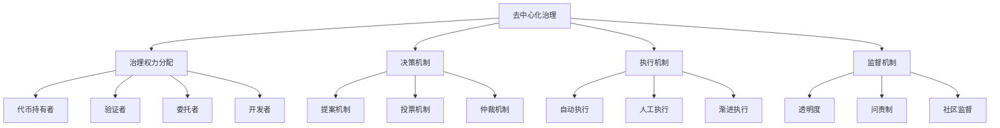
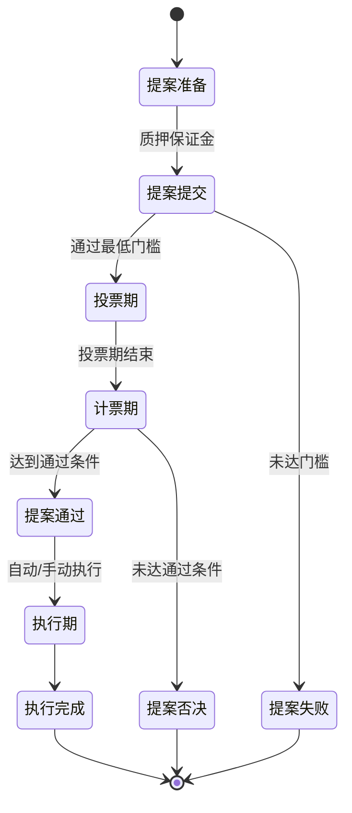
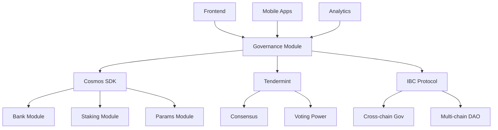

# 链上治理机制

**学习阶段**: 阶段三 | **难度**: ⭐⭐⭐⭐☆ | **预估时间**: 20-25 小时

---

## 📚 学习目标

完成本章学习后，您将能够：

-   深入理解去中心化治理的理论基础和设计原则
-   掌握 Cosmos SDK 治理模块的架构和实现
-   设计和实现多层治理机制
-   开发提案和投票系统
-   理解参数升级和网络治理的最佳实践

---

## 🏛️ 治理模型设计

### 1. 去中心化治理基础

#### 治理理论框架



#### 治理参与者角色

```go
// 治理参与者类型
type GovernanceActor struct {
    Address     sdk.AccAddress
    ActorType   ActorType
    VotingPower sdk.Int
    Reputation  uint64
    Stake       sdk.Coins
}

type ActorType int32

const (
    VALIDATOR   ActorType = 0  // 验证者
    DELEGATOR   ActorType = 1  // 委托者
    DEVELOPER   ActorType = 2  // 开发者
    COMMUNITY   ActorType = 3  // 社区成员
    FOUNDATION  ActorType = 4  // 基金会
)

// 治理权重计算
func (ga GovernanceActor) CalculateVotingWeight(proposalType ProposalType) sdk.Dec {
    baseWeight := sdk.NewDecFromInt(ga.VotingPower)

    // 根据提案类型调整权重
    switch proposalType {
    case PARAMETER_CHANGE:
        // 技术提案，验证者权重更高
        if ga.ActorType == VALIDATOR {
            return baseWeight.Mul(sdk.NewDec(2))
        }
    case COMMUNITY_POOL_SPEND:
        // 资金提案，所有人平等
        return baseWeight
    case SOFTWARE_UPGRADE:
        // 升级提案，开发者和验证者权重更高
        if ga.ActorType == VALIDATOR || ga.ActorType == DEVELOPER {
            return baseWeight.Mul(sdk.NewDecWithPrec(15, 1)) // 1.5倍
        }
    }

    return baseWeight
}
```

### 2. 治理架构设计

#### 多层治理结构

```yaml
治理层级:
    L1_核心协议治理:
        权限: 协议参数修改、软件升级
        参与者: 验证者、大额质押者
        门槛: 高质押要求、技术能力验证

    L2_应用层治理:
        权限: 应用参数、功能开关
        参与者: 应用用户、开发者
        门槛: 中等质押要求

    L3_社区治理:
        权限: 社区资金、营销决策
        参与者: 所有代币持有者
        门槛: 低质押要求

    L4_紧急治理:
        权限: 紧急暂停、安全响应
        参与者: 安全委员会、核心开发者
        门槛: 多重签名验证
```

#### 治理流程设计



---

## 🗳️ 提案和投票机制

### 1. 提案系统实现

#### 提案类型定义

```go
// 提案类型枚举
type ProposalType int32

const (
    TEXT_PROPOSAL           ProposalType = 0  // 文本提案
    PARAMETER_CHANGE        ProposalType = 1  // 参数修改
    SOFTWARE_UPGRADE        ProposalType = 2  // 软件升级
    COMMUNITY_POOL_SPEND    ProposalType = 3  // 社区资金支出
    CANCEL_SOFTWARE_UPGRADE ProposalType = 4  // 取消升级
    CLIENT_UPDATE           ProposalType = 5  // 客户端更新
    CUSTOM_PROPOSAL         ProposalType = 6  // 自定义提案
)

// 提案结构
type Proposal struct {
    ProposalId       uint64
    Content          Content
    Status           ProposalStatus
    FinalTallyResult TallyResult
    SubmitTime       time.Time
    DepositEndTime   time.Time
    TotalDeposit     sdk.Coins
    VotingStartTime  time.Time
    VotingEndTime    time.Time
    Metadata         string
}

// 提案内容接口
type Content interface {
    GetTitle() string
    GetDescription() string
    ProposalRoute() string
    ProposalType() string
    ValidateBasic() error
    String() string
}

// 参数修改提案
type ParameterChangeProposal struct {
    Title       string
    Description string
    Changes     []ParamChange
}

type ParamChange struct {
    Subspace string
    Key      string
    Value    string
}

func (pcp ParameterChangeProposal) ValidateBasic() error {
    if len(strings.TrimSpace(pcp.Title)) == 0 {
        return errors.New("proposal title cannot be blank")
    }
    if len(pcp.Title) > MaxTitleLength {
        return errors.New("proposal title is too long")
    }
    if len(pcp.Description) > MaxDescriptionLength {
        return errors.New("proposal description is too long")
    }
    if len(pcp.Changes) == 0 {
        return errors.New("proposal must have at least one parameter change")
    }

    for _, change := range pcp.Changes {
        if len(strings.TrimSpace(change.Subspace)) == 0 {
            return errors.New("parameter change subspace cannot be blank")
        }
        if len(strings.TrimSpace(change.Key)) == 0 {
            return errors.New("parameter change key cannot be blank")
        }
    }

    return nil
}
```

#### 提案生命周期管理

```go
// 治理模块Keeper
type Keeper struct {
    cdc           codec.BinaryCodec
    storeKey      storetypes.StoreKey
    paramSpace    paramtypes.Subspace
    authKeeper    types.AccountKeeper
    bankKeeper    types.BankKeeper
    stakingKeeper types.StakingKeeper
    router        types.Router
}

// 提交提案
func (k Keeper) SubmitProposal(
    ctx sdk.Context,
    content Content,
    initialDeposit sdk.Coins,
    proposer sdk.AccAddress,
) (Proposal, error) {
    // 1. 验证提案内容
    if err := content.ValidateBasic(); err != nil {
        return Proposal{}, err
    }

    // 2. 生成提案ID
    proposalID, err := k.GetProposalID(ctx)
    if err != nil {
        return Proposal{}, err
    }

    // 3. 创建提案
    submitTime := ctx.BlockHeader().Time
    depositPeriod := k.GetDepositParams(ctx).MaxDepositPeriod

    proposal := Proposal{
        ProposalId:     proposalID,
        Content:        content,
        Status:         StatusDepositPeriod,
        SubmitTime:     submitTime,
        DepositEndTime: submitTime.Add(depositPeriod),
        TotalDeposit:   sdk.NewCoins(),
    }

    // 4. 存储提案
    k.SetProposal(ctx, proposal)
    k.IncrementProposalNumber(ctx)

    // 5. 处理初始保证金
    if !initialDeposit.IsZero() {
        _, err = k.AddDeposit(ctx, proposalID, proposer, initialDeposit)
        if err != nil {
            return Proposal{}, err
        }
    }

    // 6. 发出事件
    ctx.EventManager().EmitEvent(
        sdk.NewEvent(
            types.EventTypeSubmitProposal,
            sdk.NewAttribute(types.AttributeKeyProposalID, fmt.Sprintf("%d", proposalID)),
            sdk.NewAttribute(types.AttributeKeyProposalType, content.ProposalType()),
        ),
    )

    return proposal, nil
}

// 添加保证金
func (k Keeper) AddDeposit(
    ctx sdk.Context,
    proposalID uint64,
    depositor sdk.AccAddress,
    depositAmount sdk.Coins,
) (bool, error) {
    // 1. 获取提案
    proposal, ok := k.GetProposal(ctx, proposalID)
    if !ok {
        return false, types.ErrUnknownProposal
    }

    // 2. 检查提案状态
    if proposal.Status != StatusDepositPeriod {
        return false, types.ErrInactiveProposal
    }

    // 3. 转移保证金
    if err := k.bankKeeper.SendCoinsFromAccountToModule(
        ctx, depositor, types.ModuleName, depositAmount,
    ); err != nil {
        return false, err
    }

    // 4. 更新保证金记录
    deposit, found := k.GetDeposit(ctx, proposalID, depositor)
    if found {
        deposit.Amount = deposit.Amount.Add(depositAmount...)
    } else {
        deposit = types.NewDeposit(proposalID, depositor, depositAmount)
    }
    k.SetDeposit(ctx, deposit)

    // 5. 更新提案总保证金
    proposal.TotalDeposit = proposal.TotalDeposit.Add(depositAmount...)
    k.SetProposal(ctx, proposal)

    // 6. 检查是否达到最低保证金
    minDeposit := k.GetDepositParams(ctx).MinDeposit
    if proposal.TotalDeposit.IsAllGTE(minDeposit) {
        // 进入投票期
        proposal.Status = StatusVotingPeriod
        votingPeriod := k.GetVotingParams(ctx).VotingPeriod
        proposal.VotingStartTime = ctx.BlockHeader().Time
        proposal.VotingEndTime = proposal.VotingStartTime.Add(votingPeriod)
        k.SetProposal(ctx, proposal)

        return true, nil
    }

    return false, nil
}
```

### 2. 投票系统实现

#### 投票选项和权重

```go
// 投票选项
type VoteOption int32

const (
    OptionEmpty      VoteOption = 0  // 空投票
    OptionYes        VoteOption = 1  // 赞成
    OptionAbstain    VoteOption = 2  // 弃权
    OptionNo         VoteOption = 3  // 反对
    OptionNoWithVeto VoteOption = 4  // 强烈反对
)

// 加权投票
type WeightedVoteOption struct {
    Option VoteOption
    Weight sdk.Dec
}

type Vote struct {
    ProposalId uint64
    Voter      string
    Options    []WeightedVoteOption
    Metadata   string
}

// 投票处理
func (k Keeper) AddVote(
    ctx sdk.Context,
    proposalID uint64,
    voter sdk.AccAddress,
    options []WeightedVoteOption,
    metadata string,
) error {
    // 1. 验证提案状态
    proposal, ok := k.GetProposal(ctx, proposalID)
    if !ok {
        return types.ErrUnknownProposal
    }

    if proposal.Status != StatusVotingPeriod {
        return types.ErrInactiveProposal
    }

    // 2. 验证投票权重
    totalWeight := sdk.ZeroDec()
    for _, option := range options {
        if option.Weight.IsNegative() {
            return types.ErrInvalidVote
        }
        totalWeight = totalWeight.Add(option.Weight)
    }

    if !totalWeight.Equal(sdk.OneDec()) {
        return types.ErrInvalidVote
    }

    // 3. 检查投票权限
    if !k.HasVotingPower(ctx, voter) {
        return types.ErrNoVotingPower
    }

    // 4. 存储投票
    vote := types.NewVote(proposalID, voter, options, metadata)
    k.SetVote(ctx, vote)

    // 5. 发出事件
    ctx.EventManager().EmitEvent(
        sdk.NewEvent(
            types.EventTypeProposalVote,
            sdk.NewAttribute(types.AttributeKeyProposalID, fmt.Sprintf("%d", proposalID)),
            sdk.NewAttribute(types.AttributeKeyVoter, voter.String()),
        ),
    )

    return nil
}

// 检查投票权限
func (k Keeper) HasVotingPower(ctx sdk.Context, voter sdk.AccAddress) bool {
    // 检查是否为验证者
    if k.stakingKeeper.GetValidator(ctx, sdk.ValAddress(voter)) != nil {
        return true
    }

    // 检查是否有委托
    delegations := k.stakingKeeper.GetAllDelegatorDelegations(ctx, voter)
    return len(delegations) > 0
}
```

### 3. 投票计算和结果统计

#### 投票权重计算

```go
// 计票结果
type TallyResult struct {
    Yes        sdk.Int
    Abstain    sdk.Int
    No         sdk.Int
    NoWithVeto sdk.Int
}

// 执行计票
func (k Keeper) Tally(ctx sdk.Context, proposal Proposal) (passes bool, burnDeposits bool, tallyResults TallyResult) {
    results := make(map[VoteOption]sdk.Dec)
    results[OptionYes] = sdk.ZeroDec()
    results[OptionAbstain] = sdk.ZeroDec()
    results[OptionNo] = sdk.ZeroDec()
    results[OptionNoWithVeto] = sdk.ZeroDec()

    totalVotingPower := sdk.ZeroDec()

    // 1. 统计验证者投票
    k.stakingKeeper.IterateBondedValidatorsByPower(ctx, func(index int64, validator stakingtypes.ValidatorI) (stop bool) {
        validatorAddr := sdk.AccAddress(validator.GetOperator())
        votingPower := sdk.NewDecFromInt(validator.GetBondedTokens())

        // 获取验证者投票
        vote, found := k.GetVote(ctx, proposal.ProposalId, validatorAddr)
        if found {
            // 验证者已投票
            for _, option := range vote.Options {
                results[option.Option] = results[option.Option].Add(votingPower.Mul(option.Weight))
            }
        } else {
            // 验证者未投票，统计委托者投票
            k.stakingKeeper.IterateDelegations(ctx, validatorAddr, func(index int64, delegation stakingtypes.DelegationI) (stop bool) {
                delegatorAddr := delegation.GetDelegatorAddr()
                delegatorVote, found := k.GetVote(ctx, proposal.ProposalId, delegatorAddr)

                if found {
                    // 委托者已投票
                    delegatorPower := sdk.NewDecFromInt(delegation.GetShares().TruncateInt())
                    for _, option := range delegatorVote.Options {
                        results[option.Option] = results[option.Option].Add(delegatorPower.Mul(option.Weight))
                    }
                }

                return false
            })
        }

        totalVotingPower = totalVotingPower.Add(votingPower)
        return false
    })

    // 2. 计算最终结果
    tallyResults = TallyResult{
        Yes:        results[OptionYes].TruncateInt(),
        Abstain:    results[OptionAbstain].TruncateInt(),
        No:         results[OptionNo].TruncateInt(),
        NoWithVeto: results[OptionNoWithVeto].TruncateInt(),
    }

    // 3. 判断提案是否通过
    tallyParams := k.GetTallyParams(ctx)

    // 检查参与度
    totalVotes := results[OptionYes].Add(results[OptionAbstain]).Add(results[OptionNo]).Add(results[OptionNoWithVeto])
    if totalVotes.LT(totalVotingPower.Mul(tallyParams.Quorum)) {
        // 参与度不足
        return false, false, tallyResults
    }

    // 检查否决票
    if results[OptionNoWithVeto].Quo(totalVotes).GT(tallyParams.VetoThreshold) {
        // 否决票过多，销毁保证金
        return false, true, tallyResults
    }

    // 检查通过阈值
    if results[OptionYes].Quo(totalVotes.Sub(results[OptionAbstain])).GT(tallyParams.Threshold) {
        return true, false, tallyResults
    }

    return false, false, tallyResults
}
```

---

## ⚙️ 参数升级流程

### 1. 参数管理系统

#### 参数分类和权限

```go
// 参数类别
type ParameterCategory int32

const (
    CONSENSUS_PARAMS    ParameterCategory = 0  // 共识参数
    ECONOMIC_PARAMS     ParameterCategory = 1  // 经济参数
    GOVERNANCE_PARAMS   ParameterCategory = 2  // 治理参数
    SECURITY_PARAMS     ParameterCategory = 3  // 安全参数
    OPERATIONAL_PARAMS  ParameterCategory = 4  // 运营参数
)

// 参数定义
type Parameter struct {
    Key         string
    Value       interface{}
    Category    ParameterCategory
    MinValue    interface{}
    MaxValue    interface{}
    UpdateAuth  UpdateAuthority
    Description string
}

type UpdateAuthority int32

const (
    GOVERNANCE_ONLY     UpdateAuthority = 0  // 仅治理
    VALIDATOR_SET       UpdateAuthority = 1  // 验证者集合
    EMERGENCY_COMMITTEE UpdateAuthority = 2  // 紧急委员会
    AUTOMATIC          UpdateAuthority = 3  // 自动调整
)

// 参数注册表
type ParameterRegistry struct {
    parameters map[string]Parameter
    mu         sync.RWMutex
}

func NewParameterRegistry() *ParameterRegistry {
    return &ParameterRegistry{
        parameters: make(map[string]Parameter),
    }
}

func (pr *ParameterRegistry) RegisterParameter(param Parameter) error {
    pr.mu.Lock()
    defer pr.mu.Unlock()

    // 验证参数定义
    if err := param.Validate(); err != nil {
        return err
    }

    pr.parameters[param.Key] = param
    return nil
}

// 参数验证
func (p Parameter) Validate() error {
    if len(strings.TrimSpace(p.Key)) == 0 {
        return errors.New("parameter key cannot be empty")
    }

    if p.Value == nil {
        return errors.New("parameter value cannot be nil")
    }

    // 验证值范围
    if p.MinValue != nil && p.MaxValue != nil {
        if !p.isInRange() {
            return errors.New("parameter value out of range")
        }
    }

    return nil
}

func (p Parameter) isInRange() bool {
    // 根据类型检查范围
    switch v := p.Value.(type) {
    case int64:
        min, minOk := p.MinValue.(int64)
        max, maxOk := p.MaxValue.(int64)
        if minOk && maxOk {
            return v >= min && v <= max
        }
    case sdk.Dec:
        min, minOk := p.MinValue.(sdk.Dec)
        max, maxOk := p.MaxValue.(sdk.Dec)
        if minOk && maxOk {
            return v.GTE(min) && v.LTE(max)
        }
    case time.Duration:
        min, minOk := p.MinValue.(time.Duration)
        max, maxOk := p.MaxValue.(time.Duration)
        if minOk && maxOk {
            return v >= min && v <= max
        }
    }
    return true
}
```

#### 参数升级提案处理

```go
// 参数升级处理器
type ParameterChangeHandler struct {
    paramKeeper   paramtypes.Keeper
    registry      *ParameterRegistry
    upgradeKeeper upgradetypes.Keeper
}

// 处理参数修改提案
func (pch ParameterChangeHandler) HandleParameterChangeProposal(
    ctx sdk.Context,
    proposal *types.ParameterChangeProposal,
) error {
    for _, change := range proposal.Changes {
        // 1. 验证参数存在
        param, exists := pch.registry.GetParameter(change.Key)
        if !exists {
            return fmt.Errorf("parameter %s not found", change.Key)
        }

        // 2. 验证修改权限
        if !pch.hasUpdatePermission(ctx, param.UpdateAuth) {
            return fmt.Errorf("insufficient permission to update parameter %s", change.Key)
        }

        // 3. 验证新值
        newValue, err := pch.parseValue(change.Value, param.Value)
        if err != nil {
            return fmt.Errorf("invalid value for parameter %s: %v", change.Key, err)
        }

        // 4. 验证值范围
        tempParam := param
        tempParam.Value = newValue
        if err := tempParam.Validate(); err != nil {
            return fmt.Errorf("parameter validation failed for %s: %v", change.Key, err)
        }

        // 5. 应用参数修改
        if err := pch.applyParameterChange(ctx, change.Subspace, change.Key, newValue); err != nil {
            return fmt.Errorf("failed to apply parameter change for %s: %v", change.Key, err)
        }

        // 6. 记录参数修改历史
        pch.recordParameterChange(ctx, change.Key, param.Value, newValue)
    }

    return nil
}

// 应用参数修改
func (pch ParameterChangeHandler) applyParameterChange(
    ctx sdk.Context,
    subspace string,
    key string,
    value interface{},
) error {
    // 获取参数子空间
    ss, ok := pch.paramKeeper.GetSubspace(subspace)
    if !ok {
        return fmt.Errorf("subspace %s not found", subspace)
    }

    // 根据值类型设置参数
    switch v := value.(type) {
    case string:
        ss.Set(ctx, []byte(key), v)
    case int64:
        ss.Set(ctx, []byte(key), v)
    case sdk.Dec:
        ss.Set(ctx, []byte(key), v)
    case bool:
        ss.Set(ctx, []byte(key), v)
    case time.Duration:
        ss.Set(ctx, []byte(key), v)
    default:
        return fmt.Errorf("unsupported parameter type: %T", v)
    }

    return nil
}

// 记录参数修改历史
func (pch ParameterChangeHandler) recordParameterChange(
    ctx sdk.Context,
    key string,
    oldValue interface{},
    newValue interface{},
) {
    change := ParameterChangeRecord{
        Key       : key,
        OldValue  : oldValue,
        NewValue  : newValue,
        Height    : ctx.BlockHeight(),
        Time      : ctx.BlockTime(),
        Proposer  : "", // 从上下文获取
    }

    // 存储到状态中
    pch.storeParameterChangeRecord(ctx, change)

    // 发出事件
    ctx.EventManager().EmitEvent(
        sdk.NewEvent(
            "parameter_change",
            sdk.NewAttribute("key", key),
            sdk.NewAttribute("old_value", fmt.Sprintf("%v", oldValue)),
            sdk.NewAttribute("new_value", fmt.Sprintf("%v", newValue)),
        ),
    )
}
```

### 2. 软件升级机制

#### 升级提案处理

```go
// 软件升级提案
type SoftwareUpgradeProposal struct {
    Title       string
    Description string
    Plan        upgradetypes.Plan
}

type Plan struct {
    Name                string
    Height              int64
    Info                string
    UpgradedClientState *codectypes.Any
}

// 升级处理器
type UpgradeHandler struct {
    upgradeKeeper upgradetypes.Keeper
    appKeepers    AppKeepers
}

// 处理升级提案
func (uh UpgradeHandler) HandleSoftwareUpgradeProposal(
    ctx sdk.Context,
    proposal *upgradetypes.SoftwareUpgradeProposal,
) error {
    // 1. 验证升级计划
    if err := proposal.Plan.ValidateBasic(); err != nil {
        return fmt.Errorf("invalid upgrade plan: %v", err)
    }

    // 2. 检查升级高度
    if proposal.Plan.Height <= ctx.BlockHeight() {
        return fmt.Errorf("upgrade height %d must be greater than current height %d",
            proposal.Plan.Height, ctx.BlockHeight())
    }

    // 3. 检查是否已有升级计划
    if uh.upgradeKeeper.HasUpgradedClient(ctx, proposal.Plan.Height) {
        return fmt.Errorf("upgrade plan already exists for height %d", proposal.Plan.Height)
    }

    // 4. 设置升级计划
    uh.upgradeKeeper.ScheduleUpgrade(ctx, proposal.Plan)

    // 5. 发出升级事件
    ctx.EventManager().EmitEvent(
        sdk.NewEvent(
            upgradetypes.EventTypeUpgrade,
            sdk.NewAttribute(upgradetypes.AttributeKeyUpgradeName, proposal.Plan.Name),
            sdk.NewAttribute(upgradetypes.AttributeKeyUpgradeHeight, fmt.Sprintf("%d", proposal.Plan.Height)),
        ),
    )

    return nil
}

// 升级执行逻辑
func (uh UpgradeHandler) ApplyUpgrade(ctx sdk.Context, plan upgradetypes.Plan) error {
    // 1. 执行升级前检查
    if err := uh.preUpgradeCheck(ctx, plan); err != nil {
        return fmt.Errorf("pre-upgrade check failed: %v", err)
    }

    // 2. 执行模块升级
    for moduleName, moduleKeeper := range uh.appKeepers.GetModuleKeepers() {
        if upgrader, ok := moduleKeeper.(ModuleUpgrader); ok {
            if err := upgrader.Upgrade(ctx, plan); err != nil {
                return fmt.Errorf("module %s upgrade failed: %v", moduleName, err)
            }
        }
    }

    // 3. 执行升级后处理
    if err := uh.postUpgradeProcess(ctx, plan); err != nil {
        return fmt.Errorf("post-upgrade process failed: %v", err)
    }

    return nil
}

// 模块升级接口
type ModuleUpgrader interface {
    Upgrade(ctx sdk.Context, plan upgradetypes.Plan) error
}

// 升级前检查
func (uh UpgradeHandler) preUpgradeCheck(ctx sdk.Context, plan upgradetypes.Plan) error {
    // 检查系统状态
    if !uh.isSystemHealthy(ctx) {
        return errors.New("system is not healthy for upgrade")
    }

    // 检查升级兼容性
    if !uh.isUpgradeCompatible(ctx, plan) {
        return errors.New("upgrade is not compatible with current state")
    }

    // 备份关键状态
    if err := uh.backupCriticalState(ctx); err != nil {
        return fmt.Errorf("failed to backup critical state: %v", err)
    }

    return nil
}
```

---

## 🤝 社区参与激励

### 1. 治理激励机制

#### 参与奖励系统

```go
// 治理参与奖励
type GovernanceReward struct {
    Participant sdk.AccAddress
    Activity    ActivityType
    Reward      sdk.Coins
    Multiplier  sdk.Dec
    Timestamp   time.Time
}

type ActivityType int32

const (
    PROPOSAL_SUBMISSION ActivityType = 0  // 提案提交
    VOTING             ActivityType = 1  // 投票参与
    DELEGATION         ActivityType = 2  // 委托参与
    DISCUSSION         ActivityType = 3  // 讨论参与
    VALIDATION         ActivityType = 4  // 验证参与
)

// 奖励计算器
type RewardCalculator struct {
    baseRewards    map[ActivityType]sdk.Dec
    multipliers    map[string]sdk.Dec
    totalPool      sdk.Coins
    distributedPool sdk.Coins
}

// 计算治理奖励
func (rc *RewardCalculator) CalculateReward(
    ctx sdk.Context,
    participant sdk.AccAddress,
    activity ActivityType,
    contribution sdk.Dec,
) sdk.Coins {
    // 1. 获取基础奖励
    baseReward := rc.baseRewards[activity]

    // 2. 计算贡献度乘数
    contributionMultiplier := rc.calculateContributionMultiplier(contribution)

    // 3. 计算质量乘数
    qualityMultiplier := rc.calculateQualityMultiplier(ctx, participant, activity)

    // 4. 计算时间衰减
    timeDecay := rc.calculateTimeDecay(ctx)

    // 5. 计算最终奖励
    finalReward := baseReward.
        Mul(contributionMultiplier).
        Mul(qualityMultiplier).
        Mul(timeDecay)

    // 6. 转换为代币数量
    rewardAmount := sdk.NewInt(finalReward.TruncateInt64())
    return sdk.NewCoins(sdk.NewCoin("uable", rewardAmount))
}

// 计算贡献度乘数
func (rc *RewardCalculator) calculateContributionMultiplier(contribution sdk.Dec) sdk.Dec {
    // 使用对数函数避免过度激励
    if contribution.LTE(sdk.ZeroDec()) {
        return sdk.ZeroDec()
    }

    // 简化的对数近似: log(1 + x)
    return sdk.OneDec().Add(contribution.Quo(sdk.NewDec(10)))
}

// 计算质量乘数
func (rc *RewardCalculator) calculateQualityMultiplier(
    ctx sdk.Context,
    participant sdk.AccAddress,
    activity ActivityType,
) sdk.Dec {
    // 基于历史参与质量计算
    history := rc.getParticipationHistory(ctx, participant)

    qualityScore := sdk.OneDec()

    switch activity {
    case PROPOSAL_SUBMISSION:
        // 基于提案通过率
        if history.ProposalsSubmitted > 0 {
            passRate := sdk.NewDec(history.ProposalsPassed).Quo(sdk.NewDec(history.ProposalsSubmitted))
            qualityScore = qualityScore.Add(passRate)
        }
    case VOTING:
        // 基于投票一致性和参与率
        if history.VotingOpportunities > 0 {
            participationRate := sdk.NewDec(history.VotesSubmitted).Quo(sdk.NewDec(history.VotingOpportunities))
            qualityScore = qualityScore.Add(participationRate.Mul(sdk.NewDecWithPrec(5, 1))) // 0.5倍权重
        }
    }

    return qualityScore
}
```

#### 声誉系统

```go
// 治理声誉系统
type ReputationSystem struct {
    scores map[string]ReputationScore
    mu     sync.RWMutex
}

type ReputationScore struct {
    Address            sdk.AccAddress
    OverallScore       sdk.Dec
    ProposalScore      sdk.Dec
    VotingScore        sdk.Dec
    DelegationScore    sdk.Dec
    CommunityScore     sdk.Dec
    LastUpdated        time.Time
    ParticipationCount int64
}

// 更新声誉分数
func (rs *ReputationSystem) UpdateReputation(
    ctx sdk.Context,
    participant sdk.AccAddress,
    activity ActivityType,
    outcome OutcomeType,
    impact sdk.Dec,
) {
    rs.mu.Lock()
    defer rs.mu.Unlock()

    key := participant.String()
    score, exists := rs.scores[key]
    if !exists {
        score = ReputationScore{
            Address:      participant,
            OverallScore: sdk.NewDec(100), // 初始分数
        }
    }

    // 根据活动类型和结果更新分数
    delta := rs.calculateReputationDelta(activity, outcome, impact)

    switch activity {
    case PROPOSAL_SUBMISSION:
        score.ProposalScore = score.ProposalScore.Add(delta)
    case VOTING:
        score.VotingScore = score.VotingScore.Add(delta)
    case DELEGATION:
        score.DelegationScore = score.DelegationScore.Add(delta)
    case DISCUSSION:
        score.CommunityScore = score.CommunityScore.Add(delta)
    }

    // 更新总分
    score.OverallScore = rs.calculateOverallScore(score)
    score.LastUpdated = ctx.BlockTime()
    score.ParticipationCount++

    rs.scores[key] = score
}

type OutcomeType int32

const (
    POSITIVE_OUTCOME OutcomeType = 0  // 正面结果
    NEUTRAL_OUTCOME  OutcomeType = 1  // 中性结果
    NEGATIVE_OUTCOME OutcomeType = 2  // 负面结果
)

// 计算声誉变化
func (rs *ReputationSystem) calculateReputationDelta(
    activity ActivityType,
    outcome OutcomeType,
    impact sdk.Dec,
) sdk.Dec {
    baseDeltas := map[ActivityType]map[OutcomeType]sdk.Dec{
        PROPOSAL_SUBMISSION: {
            POSITIVE_OUTCOME: sdk.NewDec(10),
            NEUTRAL_OUTCOME:  sdk.NewDec(2),
            NEGATIVE_OUTCOME: sdk.NewDec(-5),
        },
        VOTING: {
            POSITIVE_OUTCOME: sdk.NewDec(3),
            NEUTRAL_OUTCOME:  sdk.NewDec(1),
            NEGATIVE_OUTCOME: sdk.NewDec(-1),
        },
        DELEGATION: {
            POSITIVE_OUTCOME: sdk.NewDec(2),
            NEUTRAL_OUTCOME:  sdk.NewDec(1),
            NEGATIVE_OUTCOME: sdk.NewDec(-2),
        },
    }

    baseDelta := baseDeltas[activity][outcome]
    return baseDelta.Mul(impact)
}
```

### 2. 社区建设机制

#### 治理论坛集成

```go
// 链上论坛系统
type GovernanceForum struct {
    keeper ForumKeeper
}

type ForumPost struct {
    ID          uint64
    ProposalID  uint64
    Author      sdk.AccAddress
    Title       string
    Content     string
    Category    PostCategory
    Timestamp   time.Time
    Upvotes     int64
    Downvotes   int64
    Replies     []Reply
    Status      PostStatus
}

type PostCategory int32

const (
    GENERAL_DISCUSSION PostCategory = 0
    PROPOSAL_DISCUSSION PostCategory = 1
    TECHNICAL_DISCUSSION PostCategory = 2
    GOVERNANCE_META PostCategory = 3
)

type PostStatus int32

const (
    ACTIVE   PostStatus = 0
    ARCHIVED PostStatus = 1
    DELETED  PostStatus = 2
    PINNED   PostStatus = 3
)

// 创建讨论帖
func (gf *GovernanceForum) CreatePost(
    ctx sdk.Context,
    author sdk.AccAddress,
    title string,
    content string,
    category PostCategory,
    proposalID uint64,
) (uint64, error) {
    // 1. 验证作者权限
    if !gf.hasPostingPermission(ctx, author) {
        return 0, errors.New("insufficient permission to create post")
    }

    // 2. 验证内容
    if err := gf.validatePostContent(title, content); err != nil {
        return 0, err
    }

    // 3. 创建帖子
    postID := gf.keeper.GetNextPostID(ctx)
    post := ForumPost{
        ID:         postID,
        ProposalID: proposalID,
        Author:     author,
        Title:      title,
        Content:    content,
        Category:   category,
        Timestamp:  ctx.BlockTime(),
        Status:     ACTIVE,
    }

    // 4. 存储帖子
    gf.keeper.SetPost(ctx, post)
    gf.keeper.IncrementPostID(ctx)

    // 5. 更新作者声誉
    gf.updateAuthorReputation(ctx, author, DISCUSSION, POSITIVE_OUTCOME, sdk.OneDec())

    return postID, nil
}

// 投票系统
func (gf *GovernanceForum) VoteOnPost(
    ctx sdk.Context,
    voter sdk.AccAddress,
    postID uint64,
    isUpvote bool,
) error {
    // 1. 获取帖子
    post, found := gf.keeper.GetPost(ctx, postID)
    if !found {
        return errors.New("post not found")
    }

    // 2. 检查投票权限
    if !gf.hasVotingPermission(ctx, voter) {
        return errors.New("insufficient permission to vote")
    }

    // 3. 检查重复投票
    if gf.keeper.HasVoted(ctx, postID, voter) {
        return errors.New("already voted on this post")
    }

    // 4. 记录投票
    vote := PostVote{
        PostID:    postID,
        Voter:     voter,
        IsUpvote:  isUpvote,
        Timestamp: ctx.BlockTime(),
    }
    gf.keeper.SetPostVote(ctx, vote)

    // 5. 更新帖子分数
    if isUpvote {
        post.Upvotes++
    } else {
        post.Downvotes++
    }
    gf.keeper.SetPost(ctx, post)

    return nil
}
```

---

## 💻 实践练习

### 练习 1: 部署治理模块

#### 环境准备

```bash
# 创建治理测试链
mkdir governance-testnet && cd governance-testnet

# 初始化链配置
gaiad init governance-test --chain-id governance-test

# 配置治理参数
cat > genesis_governance.json << EOF
{
  "voting_params": {
    "voting_period": "172800s"
  },
  "tally_params": {
    "quorum": "0.334000000000000000",
    "threshold": "0.500000000000000000",
    "veto_threshold": "0.334000000000000000"
  },
  "deposit_params": {
    "min_deposit": [
      {
        "denom": "stake",
        "amount": "10000000"
      }
    ],
    "max_deposit_period": "172800s"
  }
}
EOF

# 更新创世文件
jq '.app_state.gov = input' ~/.gaia/config/genesis.json genesis_governance.json > temp.json
mv temp.json ~/.gaia/config/genesis.json
```

#### 创建测试提案

```bash
# 创建文本提案
gaiad tx gov submit-proposal \
  --title="测试治理提案" \
  --description="这是一个测试治理功能的文本提案" \
  --type="Text" \
  --deposit="10000000stake" \
  --from=validator \
  --chain-id=governance-test

# 查看提案状态
gaiad query gov proposals

# 对提案投票
gaiad tx gov vote 1 yes \
  --from=validator \
  --chain-id=governance-test

# 查看投票结果
gaiad query gov votes 1
```

### 练习 2: 参数修改提案

#### 创建参数修改提案

```json
{
    "title": "修改质押参数",
    "description": "调整最大验证者数量和解绑时间",
    "changes": [
        {
            "subspace": "staking",
            "key": "MaxValidators",
            "value": "150"
        },
        {
            "subspace": "staking",
            "key": "UnbondingTime",
            "value": "1814400s"
        }
    ],
    "deposit": "10000000stake"
}
```

```bash
# 提交参数修改提案
gaiad tx gov submit-proposal param-change proposal.json \
  --from=validator \
  --chain-id=governance-test

# 投票支持提案
gaiad tx gov vote 2 yes \
  --from=validator \
  --chain-id=governance-test

# 查看参数修改结果
gaiad query staking params
```

### 练习 3: 自定义治理模块

#### 实现投票权重调整

```go
// 自定义投票权重计算
type CustomVotingPowerCalculator struct {
    stakingKeeper types.StakingKeeper
    bankKeeper    types.BankKeeper
}

func (cvpc CustomVotingPowerCalculator) CalculateVotingPower(
    ctx sdk.Context,
    voter sdk.AccAddress,
    proposalType string,
) sdk.Dec {
    // 1. 获取基础质押权重
    stakingPower := cvpc.getStakingPower(ctx, voter)

    // 2. 获取治理代币权重
    govTokens := cvpc.getGovernanceTokens(ctx, voter)

    // 3. 根据提案类型调整权重
    typeMultiplier := cvpc.getTypeMultiplier(proposalType)

    // 4. 计算最终投票权重
    totalPower := stakingPower.Add(govTokens).Mul(typeMultiplier)

    return totalPower
}

func (cvpc CustomVotingPowerCalculator) getStakingPower(
    ctx sdk.Context,
    voter sdk.AccAddress,
) sdk.Dec {
    // 获取委托的质押代币
    delegations := cvpc.stakingKeeper.GetAllDelegatorDelegations(ctx, voter)
    totalStaked := sdk.ZeroDec()

    for _, delegation := range delegations {
        validator, found := cvpc.stakingKeeper.GetValidator(ctx, delegation.ValidatorAddress)
        if found {
            shares := delegation.Shares
            tokens := validator.TokensFromShares(shares)
            totalStaked = totalStaked.Add(tokens)
        }
    }

    return totalStaked
}

func (cvpc CustomVotingPowerCalculator) getGovernanceTokens(
    ctx sdk.Context,
    voter sdk.AccAddress,
) sdk.Dec {
    // 获取治理专用代币余额
    govBalance := cvpc.bankKeeper.GetBalance(ctx, voter, "gov")
    return sdk.NewDecFromInt(govBalance.Amount)
}
```

---

## 🔧 开发工具和资源

### 开发工具

#### 治理相关 CLI 命令

```bash
# 提案管理
gaiad tx gov submit-proposal text [proposal-file] # 提交文本提案
gaiad tx gov submit-proposal param-change [proposal-file] # 参数修改提案
gaiad tx gov submit-proposal software-upgrade [name] [height] # 软件升级提案

# 保证金管理
gaiad tx gov deposit [proposal-id] [deposit] # 添加保证金

# 投票管理
gaiad tx gov vote [proposal-id] [option] # 投票
gaiad tx gov weighted-vote [proposal-id] [options] # 加权投票

# 查询命令
gaiad query gov proposals # 查看所有提案
gaiad query gov proposal [proposal-id] # 查看特定提案
gaiad query gov votes [proposal-id] # 查看提案投票
gaiad query gov tally [proposal-id] # 查看计票结果
gaiad query gov params # 查看治理参数
```

#### 治理监控工具

```yaml
治理监控工具:
    Mintscan:
        - 提案浏览器
        - 投票统计
        - 治理参数监控

    Cosmos Station:
        - 移动端治理参与
        - 提案通知
        - 投票提醒

    Keplr Wallet:
        - 浏览器插件治理
        - 一键投票
        - 提案详情查看

    自定义监控:
        - Prometheus指标
        - Grafana仪表板
        - 告警系统
```

### 参考资源

#### 官方文档

-   [Cosmos SDK 治理模块](https://docs.cosmos.network/main/modules/gov/)
-   [治理最佳实践](https://hub.cosmos.network/main/governance/)
-   [参数修改指南](https://docs.cosmos.network/main/modules/params/)

#### 学习资源

-   [治理机制设计](https://blog.cosmos.network/governance-in-cosmos-b5e8b1b5c5a6)
-   [去中心化治理理论](https://medium.com/1kxnetwork/blockchain-governance-101-eea5201d7992)
-   [治理攻击防护](https://blog.cosmos.network/governance-attacks-and-how-to-prevent-them-4c8c5b3c7a8f)

---

## 📈 进阶学习

### 深入研究方向

#### 1. 治理机制优化

-   **二次投票**: 减少大户控制的二次投票机制
-   **流动性民主**: 可撤销委托的动态治理
-   **预测市场**: 基于市场机制的决策预测

#### 2. 跨链治理

-   **多链治理**: 跨多个区块链的统一治理
-   **治理互操作**: 不同治理系统间的协调
-   **联邦治理**: 多个自治区域的联合治理

#### 3. AI 辅助治理

-   **智能提案**: AI 生成和优化提案内容
-   **投票建议**: 基于历史数据的投票建议
-   **治理分析**: 自动化的治理效果分析

### 相关技术栈



### 实际项目应用

#### 主要治理项目案例

-   **Cosmos Hub**: 原生 Cosmos 治理实现
-   **Osmosis**: 流动性治理和参数调整
-   **Juno**: 智能合约治理集成
-   **Akash**: 去中心化云计算治理
-   **Regen**: 生态系统治理模式

---

## ✅ 学习检查点

### 理论掌握检查

**基础概念** (必须掌握):

-   [ ] 理解去中心化治理的基本原理
-   [ ] 掌握提案和投票机制的设计
-   [ ] 了解参数升级的流程和风险
-   [ ] 理解治理激励机制的作用

**深入理解** (建议掌握):

-   [ ] 分析不同治理模型的优缺点
-   [ ] 理解治理攻击的类型和防护
-   [ ] 掌握多层治理架构的设计
-   [ ] 了解跨链治理的挑战和解决方案

### 实践能力验证

**基础实践** (必须完成):

-   [ ] 成功部署治理模块
-   [ ] 创建和投票文本提案
-   [ ] 实现参数修改提案
-   [ ] 配置治理参数和权限

**进阶实践** (建议完成):

-   [ ] 开发自定义投票权重计算
-   [ ] 实现治理激励分发系统
-   [ ] 集成治理论坛功能
-   [ ] 构建治理分析工具

### 项目应用评估

**应用设计** (综合能力):

-   [ ] 设计适合项目的治理架构
-   [ ] 制定治理参数和流程
-   [ ] 评估治理风险和缓解措施
-   [ ] 规划社区参与激励方案

---

## 📚 参考资源

### 技术文档

-   [Cosmos SDK 治理模块文档](https://docs.cosmos.network/main/modules/gov/)
-   [治理提案类型规范](https://github.com/cosmos/cosmos-sdk/tree/main/x/gov)
-   [参数管理最佳实践](https://docs.cosmos.network/main/modules/params/)
-   [升级模块文档](https://docs.cosmos.network/main/modules/upgrade/)

### 学术论文

-   [Blockchain Governance: Programming Our Future](https://medium.com/@FEhrsam/blockchain-governance-programming-our-future-c3bfe30f2d74)
-   [The Governance of Blockchain Protocols](https://papers.ssrn.com/sol3/papers.cfm?abstract_id=3326244)
-   [Decentralized Governance of Distributed Ledgers](https://arxiv.org/abs/1811.03490)

### 开源项目

-   [Cosmos SDK Gov Module](https://github.com/cosmos/cosmos-sdk/tree/main/x/gov)
-   [Commonwealth](https://github.com/hicommonwealth/commonwealth) - 治理论坛
-   [Snapshot](https://github.com/snapshot-labs/snapshot) - 链下投票平台
-   [Tally](https://github.com/withtally/tally-ho) - 治理分析工具

### 社区资源

-   [Cosmos 治理论坛](https://forum.cosmos.network/)
-   [治理工作组](https://github.com/cosmos/governance)
-   [Discord 治理频道](https://discord.gg/cosmosnetwork)

---

**下一章**: [合规框架集成](./08-Compliance-Framework.md)
