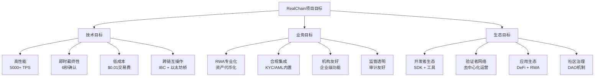

# 项目实战：构建专用公链

**学习阶段**: 阶段六 | **难度**: ⭐⭐⭐⭐⭐ | **预估时间**: 80-120小时

---

## 📚 学习目标

完成本章学习后，您将能够：
- 从零开始构建一个完整的专用公链
- 集成所有学过的技术组件
- 部署和运营区块链网络
- 开发配套的工具和应用
- 准备主网启动和生态建设

---

## 🎯 项目概述：RealChain

我们将构建一个专门为RWA（Real World Assets）优化的公链 - **RealChain**，集成之前学习的所有技术。

### 项目目标



### 技术架构

```yaml
技术栈:
  共识层: Tendermint Core v0.37+
  应用层: Cosmos SDK v0.47+
  编程语言: Go 1.19+
  数据库: LevelDB / BadgerDB
  网络: libp2p
  跨链: IBC v7+

核心模块:
  - auth: 账户和签名管理
  - bank: 代币转账和余额
  - staking: 权益质押和验证者
  - distribution: 奖励分发
  - governance: 链上治理
  - rwa: RWA资产管理 (自定义)
  - compliance: 合规框架 (自定义)
  - oracle: 价格预言机 (自定义)
  - bridge: 跨链桥接 (自定义)
```

---

## 🏗️ 项目规划和架构设计

### 1. 项目结构设计

```bash
realchain/
├── app/                    # 应用层
│   ├── app.go             # 主应用文件
│   ├── genesis.go         # 创世状态
│   └── export.go          # 状态导出
├── cmd/                   # 命令行工具
│   └── realchaind/        # 节点守护进程
│       └── main.go
├── x/                     # 自定义模块
│   ├── rwa/              # RWA资产管理模块
│   ├── compliance/       # 合规模块
│   ├── oracle/           # 预言机模块
│   └── bridge/           # 跨链桥模块
├── proto/                # Protobuf定义
├── docs/                 # 文档
├── scripts/              # 部署脚本
├── testutil/             # 测试工具
├── networks/             # 网络配置
│   ├── testnet/
│   └── mainnet/
└── docker/               # Docker配置
```

### 2. 开发环境搭建

```bash
#!/bin/bash
# setup_dev_environment.sh

echo "设置RealChain开发环境..."

# 1. 安装Go
if ! command -v go &> /dev/null; then
    echo "安装Go语言..."
    wget https://go.dev/dl/go1.21.0.linux-amd64.tar.gz
    sudo tar -C /usr/local -xzf go1.21.0.linux-amd64.tar.gz
    echo 'export PATH=$PATH:/usr/local/go/bin' >> ~/.bashrc
    source ~/.bashrc
fi

# 2. 安装必要工具
echo "安装开发工具..."
go install github.com/cosmos/cosmos-proto/cmd/protoc-gen-go-pulsar@latest
go install github.com/grpc-ecosystem/grpc-gateway/v2/protoc-gen-grpc-gateway@latest
go install github.com/grpc-ecosystem/grpc-gateway/v2/protoc-gen-openapiv2@latest
go install cosmossdk.io/tools/cosmovisor/cmd/cosmovisor@latest

# 3. 安装protobuf编译器
if ! command -v protoc &> /dev/null; then
    echo "安装protobuf编译器..."
    sudo apt update
    sudo apt install -y protobuf-compiler
fi

# 4. 创建项目目录
mkdir -p $HOME/realchain
cd $HOME/realchain

# 5. 初始化Go模块
go mod init github.com/realchain/realchain

echo "开发环境设置完成！"
```

### 3. 核心应用文件

```go
// app/app.go
package app

import (
    "encoding/json"
    "io"
    "os"
    "path/filepath"

    "github.com/cosmos/cosmos-sdk/baseapp"
    "github.com/cosmos/cosmos-sdk/client"
    "github.com/cosmos/cosmos-sdk/codec"
    "github.com/cosmos/cosmos-sdk/codec/types"
    "github.com/cosmos/cosmos-sdk/server/api"
    "github.com/cosmos/cosmos-sdk/server/config"
    servertypes "github.com/cosmos/cosmos-sdk/server/types"
    "github.com/cosmos/cosmos-sdk/store/streaming"
    sdk "github.com/cosmos/cosmos-sdk/types"
    "github.com/cosmos/cosmos-sdk/types/module"
    "github.com/cosmos/cosmos-sdk/version"
    "github.com/cosmos/cosmos-sdk/x/auth"
    "github.com/cosmos/cosmos-sdk/x/auth/ante"
    authkeeper "github.com/cosmos/cosmos-sdk/x/auth/keeper"
    authsims "github.com/cosmos/cosmos-sdk/x/auth/simulation"
    authtx "github.com/cosmos/cosmos-sdk/x/auth/tx"
    authtypes "github.com/cosmos/cosmos-sdk/x/auth/types"
    "github.com/cosmos/cosmos-sdk/x/auth/vesting"
    vestingtypes "github.com/cosmos/cosmos-sdk/x/auth/vesting/types"
    "github.com/cosmos/cosmos-sdk/x/bank"
    bankkeeper "github.com/cosmos/cosmos-sdk/x/bank/keeper"
    banktypes "github.com/cosmos/cosmos-sdk/x/bank/types"
    "github.com/cosmos/cosmos-sdk/x/capability"
    capabilitykeeper "github.com/cosmos/cosmos-sdk/x/capability/keeper"
    capabilitytypes "github.com/cosmos/cosmos-sdk/x/capability/types"
    "github.com/cosmos/cosmos-sdk/x/crisis"
    crisiskeeper "github.com/cosmos/cosmos-sdk/x/crisis/keeper"
    crisistypes "github.com/cosmos/cosmos-sdk/x/crisis/types"
    distr "github.com/cosmos/cosmos-sdk/x/distribution"
    distrkeeper "github.com/cosmos/cosmos-sdk/x/distribution/keeper"
    distrtypes "github.com/cosmos/cosmos-sdk/x/distribution/types"
    "github.com/cosmos/cosmos-sdk/x/evidence"
    evidencekeeper "github.com/cosmos/cosmos-sdk/x/evidence/keeper"
    evidencetypes "github.com/cosmos/cosmos-sdk/x/evidence/types"
    "github.com/cosmos/cosmos-sdk/x/feegrant"
    feegrantkeeper "github.com/cosmos/cosmos-sdk/x/feegrant/keeper"
    feegrantmodule "github.com/cosmos/cosmos-sdk/x/feegrant/module"
    "github.com/cosmos/cosmos-sdk/x/genutil"
    genutiltypes "github.com/cosmos/cosmos-sdk/x/genutil/types"
    "github.com/cosmos/cosmos-sdk/x/gov"
    govclient "github.com/cosmos/cosmos-sdk/x/gov/client"
    govkeeper "github.com/cosmos/cosmos-sdk/x/gov/keeper"
    govtypes "github.com/cosmos/cosmos-sdk/x/gov/types"
    govv1beta1 "github.com/cosmos/cosmos-sdk/x/gov/types/v1beta1"
    "github.com/cosmos/cosmos-sdk/x/mint"
    mintkeeper "github.com/cosmos/cosmos-sdk/x/mint/keeper"
    minttypes "github.com/cosmos/cosmos-sdk/x/mint/types"
    "github.com/cosmos/cosmos-sdk/x/params"
    paramsclient "github.com/cosmos/cosmos-sdk/x/params/client"
    paramskeeper "github.com/cosmos/cosmos-sdk/x/params/keeper"
    paramstypes "github.com/cosmos/cosmos-sdk/x/params/types"
    paramproposal "github.com/cosmos/cosmos-sdk/x/params/types/proposal"
    "github.com/cosmos/cosmos-sdk/x/slashing"
    slashingkeeper "github.com/cosmos/cosmos-sdk/x/slashing/keeper"
    slashingtypes "github.com/cosmos/cosmos-sdk/x/slashing/types"
    "github.com/cosmos/cosmos-sdk/x/staking"
    stakingkeeper "github.com/cosmos/cosmos-sdk/x/staking/keeper"
    stakingtypes "github.com/cosmos/cosmos-sdk/x/staking/types"
    "github.com/cosmos/cosmos-sdk/x/upgrade"
    upgradeclient "github.com/cosmos/cosmos-sdk/x/upgrade/client"
    upgradekeeper "github.com/cosmos/cosmos-sdk/x/upgrade/keeper"
    upgradetypes "github.com/cosmos/cosmos-sdk/x/upgrade/types"

    // IBC imports
    ica "github.com/cosmos/ibc-go/v7/modules/apps/27-interchain-accounts"
    icahost "github.com/cosmos/ibc-go/v7/modules/apps/27-interchain-accounts/host"
    icahostkeeper "github.com/cosmos/ibc-go/v7/modules/apps/27-interchain-accounts/host/keeper"
    icahosttypes "github.com/cosmos/ibc-go/v7/modules/apps/27-interchain-accounts/host/types"
    icatypes "github.com/cosmos/ibc-go/v7/modules/apps/27-interchain-accounts/types"
    ibcfee "github.com/cosmos/ibc-go/v7/modules/apps/29-fee"
    ibcfeekeeper "github.com/cosmos/ibc-go/v7/modules/apps/29-fee/keeper"
    ibcfeetypes "github.com/cosmos/ibc-go/v7/modules/apps/29-fee/types"
    "github.com/cosmos/ibc-go/v7/modules/apps/transfer"
    ibctransferkeeper "github.com/cosmos/ibc-go/v7/modules/apps/transfer/keeper"
    ibctransfertypes "github.com/cosmos/ibc-go/v7/modules/apps/transfer/types"
    ibc "github.com/cosmos/ibc-go/v7/modules/core"
    ibcclient "github.com/cosmos/ibc-go/v7/modules/core/02-client"
    ibcclientclient "github.com/cosmos/ibc-go/v7/modules/core/02-client/client"
    ibcclienttypes "github.com/cosmos/ibc-go/v7/modules/core/02-client/types"
    ibcconnectiontypes "github.com/cosmos/ibc-go/v7/modules/core/03-connection/types"
    porttypes "github.com/cosmos/ibc-go/v7/modules/core/05-port/types"
    ibcexported "github.com/cosmos/ibc-go/v7/modules/core/exported"
    ibckeeper "github.com/cosmos/ibc-go/v7/modules/core/keeper"
    solomachine "github.com/cosmos/ibc-go/v7/modules/light-clients/06-solomachine"
    ibctm "github.com/cosmos/ibc-go/v7/modules/light-clients/07-tendermint"

    // 自定义模块
    "github.com/realchain/realchain/x/rwa"
    rwakeeper "github.com/realchain/realchain/x/rwa/keeper"
    rwatypes "github.com/realchain/realchain/x/rwa/types"
    "github.com/realchain/realchain/x/compliance"
    compliancekeeper "github.com/realchain/realchain/x/compliance/keeper"
    compliancetypes "github.com/realchain/realchain/x/compliance/types"
    "github.com/realchain/realchain/x/oracle"
    oraclekeeper "github.com/realchain/realchain/x/oracle/keeper"
    oracletypes "github.com/realchain/realchain/x/oracle/types"

    "github.com/spf13/cast"
    abci "github.com/cometbft/cometbft/abci/types"
    tmjson "github.com/cometbft/cometbft/libs/json"
    "github.com/cometbft/cometbft/libs/log"
    tmos "github.com/cometbft/cometbft/libs/os"
    dbm "github.com/cometbft/cometbft-db"
)

const (
    AccountAddressPrefix = "real"
    Name                 = "realchain"
)

// RealChainApp extends an ABCI application, but with most of its parameters exported.
type RealChainApp struct {
    *baseapp.BaseApp

    cdc               *codec.LegacyAmino
    appCodec          codec.Codec
    interfaceRegistry types.InterfaceRegistry

    invCheckPeriod uint

    // keys to access the substores
    keys    map[string]*storetypes.KVStoreKey
    tkeys   map[string]*storetypes.TransientStoreKey
    memKeys map[string]*storetypes.MemoryStoreKey

    // keepers
    AccountKeeper    authkeeper.AccountKeeper
    BankKeeper       bankkeeper.Keeper
    CapabilityKeeper *capabilitykeeper.Keeper
    StakingKeeper    stakingkeeper.Keeper
    SlashingKeeper   slashingkeeper.Keeper
    MintKeeper       mintkeeper.Keeper
    DistrKeeper      distrkeeper.Keeper
    GovKeeper        govkeeper.Keeper
    CrisisKeeper     crisiskeeper.Keeper
    UpgradeKeeper    upgradekeeper.Keeper
    ParamsKeeper     paramskeeper.Keeper
    IBCKeeper        *ibckeeper.Keeper
    EvidenceKeeper   evidencekeeper.Keeper
    TransferKeeper   ibctransferkeeper.Keeper
    FeeGrantKeeper   feegrantkeeper.Keeper
    ICAHostKeeper    icahostkeeper.Keeper
    IBCFeeKeeper     ibcfeekeeper.Keeper

    // 自定义模块Keeper
    RWAKeeper        rwakeeper.Keeper
    ComplianceKeeper compliancekeeper.Keeper
    OracleKeeper     oraclekeeper.Keeper

    // Module manager
    mm *module.Manager

    // simulation manager
    sm *module.SimulationManager

    // module configurator
    configurator module.Configurator
}

// NewRealChainApp returns a reference to an initialized RealChain.
func NewRealChainApp(
    logger log.Logger,
    db dbm.DB,
    traceStore io.Writer,
    loadLatest bool,
    skipUpgradeHeights map[int64]bool,
    homePath string,
    invCheckPeriod uint,
    encodingConfig EncodingConfig,
    appOpts servertypes.AppOptions,
    baseAppOptions ...func(*baseapp.BaseApp),
) *RealChainApp {
    appCodec := encodingConfig.Codec
    cdc := encodingConfig.Amino
    interfaceRegistry := encodingConfig.InterfaceRegistry

    bApp := baseapp.NewBaseApp(Name, logger, db, encodingConfig.TxConfig.TxDecoder(), baseAppOptions...)
    bApp.SetCommitMultiStoreTracer(traceStore)
    bApp.SetVersion(version.Version)
    bApp.SetInterfaceRegistry(interfaceRegistry)

    keys := sdk.NewKVStoreKeys(
        authtypes.StoreKey, banktypes.StoreKey, stakingtypes.StoreKey,
        minttypes.StoreKey, distrtypes.StoreKey, slashingtypes.StoreKey,
        govtypes.StoreKey, paramstypes.StoreKey, ibcexported.StoreKey, upgradetypes.StoreKey,
        evidencetypes.StoreKey, ibctransfertypes.StoreKey, capabilitytypes.StoreKey,
        feegrant.StoreKey, icahosttypes.StoreKey, ibcfeetypes.StoreKey,
        // 自定义模块
        rwatypes.StoreKey, compliancetypes.StoreKey, oracletypes.StoreKey,
    )
    tkeys := sdk.NewTransientStoreKeys(paramstypes.TStoreKey)
    memKeys := sdk.NewMemoryStoreKeys(capabilitytypes.MemStoreKey)

    app := &RealChainApp{
        BaseApp:           bApp,
        cdc:               cdc,
        appCodec:          appCodec,
        interfaceRegistry: interfaceRegistry,
        invCheckPeriod:    invCheckPeriod,
        keys:              keys,
        tkeys:             tkeys,
        memKeys:           memKeys,
    }

    // 初始化参数子空间
    app.ParamsKeeper = initParamsKeeper(appCodec, cdc, keys[paramstypes.StoreKey], tkeys[paramstypes.TStoreKey])

    // 设置参数子空间
    bApp.SetParamStore(app.ParamsKeeper.Subspace(baseapp.Paramspace).WithKeyTable(paramstypes.ConsensusParamsKeyTable()))

    // 添加capability keeper并密封
    app.CapabilityKeeper = capabilitykeeper.NewKeeper(appCodec, keys[capabilitytypes.StoreKey], memKeys[capabilitytypes.MemStoreKey])
    scopedIBCKeeper := app.CapabilityKeeper.ScopeToModule(ibcexported.ModuleName)
    scopedTransferKeeper := app.CapabilityKeeper.ScopeToModule(ibctransfertypes.ModuleName)
    scopedICAHostKeeper := app.CapabilityKeeper.ScopeToModule(icahosttypes.SubModuleName)
    app.CapabilityKeeper.Seal()

    // 初始化keeper
    app.AccountKeeper = authkeeper.NewAccountKeeper(
        appCodec, keys[authtypes.StoreKey], app.GetSubspace(authtypes.ModuleName), authtypes.ProtoBaseAccount, maccPerms, AccountAddressPrefix,
    )
    app.BankKeeper = bankkeeper.NewBaseKeeper(
        appCodec, keys[banktypes.StoreKey], app.AccountKeeper, app.GetSubspace(banktypes.ModuleName), app.ModuleAccountAddrs(),
    )
    stakingKeeper := stakingkeeper.NewKeeper(
        appCodec, keys[stakingtypes.StoreKey], app.AccountKeeper, app.BankKeeper, app.GetSubspace(stakingtypes.ModuleName),
    )
    app.MintKeeper = mintkeeper.NewKeeper(
        appCodec, keys[minttypes.StoreKey], app.GetSubspace(minttypes.ModuleName), &stakingKeeper,
        app.AccountKeeper, app.BankKeeper, authtypes.FeeCollectorName,
    )
    app.DistrKeeper = distrkeeper.NewKeeper(
        appCodec, keys[distrtypes.StoreKey], app.GetSubspace(distrtypes.ModuleName), app.AccountKeeper, app.BankKeeper,
        &stakingKeeper, authtypes.FeeCollectorName,
    )
    app.SlashingKeeper = slashingkeeper.NewKeeper(
        appCodec, keys[slashingtypes.StoreKey], &stakingKeeper, app.GetSubspace(slashingtypes.ModuleName),
    )
    app.CrisisKeeper = crisiskeeper.NewKeeper(
        app.GetSubspace(crisistypes.ModuleName), invCheckPeriod, app.BankKeeper, authtypes.FeeCollectorName,
    )

    app.FeeGrantKeeper = feegrantkeeper.NewKeeper(appCodec, keys[feegrant.StoreKey], app.AccountKeeper)
    app.UpgradeKeeper = upgradekeeper.NewKeeper(skipUpgradeHeights, keys[upgradetypes.StoreKey], appCodec, homePath, app.BaseApp, authtypes.NewModuleAddress(govtypes.ModuleName).String())

    // 注册IBC Keeper
    app.IBCKeeper = ibckeeper.NewKeeper(
        appCodec, keys[ibcexported.StoreKey], app.GetSubspace(ibcexported.ModuleName), &stakingKeeper, app.UpgradeKeeper, scopedIBCKeeper,
    )

    // 注册IBC Fee Keeper
    app.IBCFeeKeeper = ibcfeekeeper.NewKeeper(
        appCodec, keys[ibcfeetypes.StoreKey],
        app.IBCKeeper.ChannelKeeper, // may be replaced with IBC middleware
        app.IBCKeeper.ChannelKeeper,
        &app.IBCKeeper.PortKeeper, app.AccountKeeper, app.BankKeeper,
    )

    // 注册Transfer Keeper
    app.TransferKeeper = ibctransferkeeper.NewKeeper(
        appCodec, keys[ibctransfertypes.StoreKey], app.GetSubspace(ibctransfertypes.ModuleName),
        app.IBCFeeKeeper, // ISC4 Wrapper: fee IBC middleware
        app.IBCKeeper.ChannelKeeper, &app.IBCKeeper.PortKeeper,
        app.AccountKeeper, app.BankKeeper, scopedTransferKeeper,
    )

    // 注册ICA Host Keeper
    app.ICAHostKeeper = icahostkeeper.NewKeeper(
        appCodec, keys[icahosttypes.StoreKey], app.GetSubspace(icahosttypes.SubModuleName),
        app.IBCFeeKeeper, // use ics29 fee as ics4Wrapper in middleware stack
        app.IBCKeeper.ChannelKeeper, &app.IBCKeeper.PortKeeper,
        app.AccountKeeper, scopedICAHostKeeper, app.MsgServiceRouter(),
    )

    // 注册Evidence Keeper
    evidenceKeeper := evidencekeeper.NewKeeper(
        appCodec, keys[evidencetypes.StoreKey], &stakingKeeper, app.SlashingKeeper,
    )
    app.EvidenceKeeper = *evidenceKeeper

    // 初始化自定义模块Keeper
    app.ComplianceKeeper = compliancekeeper.NewKeeper(
        appCodec,
        keys[compliancetypes.StoreKey],
        app.GetSubspace(compliancetypes.ModuleName),
        app.AccountKeeper,
    )

    app.OracleKeeper = oraclekeeper.NewKeeper(
        appCodec,
        keys[oracletypes.StoreKey],
        app.GetSubspace(oracletypes.ModuleName),
        app.StakingKeeper,
    )

    app.RWAKeeper = rwakeeper.NewKeeper(
        appCodec,
        keys[rwatypes.StoreKey],
        app.GetSubspace(rwatypes.ModuleName),
        app.BankKeeper,
        app.AccountKeeper,
        app.ComplianceKeeper,
        app.OracleKeeper,
    )

    // 注册staking keeper
    app.StakingKeeper = *stakingKeeper.SetHooks(
        stakingtypes.NewMultiStakingHooks(app.DistrKeeper.Hooks(), app.SlashingKeeper.Hooks()),
    )

    // 注册gov keeper
    govRouter := govv1beta1.NewRouter()
    govRouter.AddRoute(govtypes.RouterKey, govv1beta1.ProposalHandler).
        AddRoute(paramproposal.RouterKey, params.NewParamChangeProposalHandler(app.ParamsKeeper)).
        AddRoute(distrtypes.RouterKey, distr.NewCommunityPoolSpendProposalHandler(app.DistrKeeper)).
        AddRoute(upgradetypes.RouterKey, upgrade.NewSoftwareUpgradeProposalHandler(app.UpgradeKeeper)).
        AddRoute(ibcclienttypes.RouterKey, ibcclient.NewClientProposalHandler(app.IBCKeeper.ClientKeeper))

    govConfig := govtypes.DefaultConfig()
    app.GovKeeper = govkeeper.NewKeeper(
        appCodec, keys[govtypes.StoreKey], app.GetSubspace(govtypes.ModuleName), app.AccountKeeper, app.BankKeeper,
        &stakingKeeper, govRouter, app.MsgServiceRouter(), govConfig,
    )

    // 创建IBC模块
    var transferModule = transfer.NewAppModule(app.TransferKeeper)
    var icaModule = ica.NewAppModule(nil, &app.ICAHostKeeper)
    var ibcfeeModule = ibcfee.NewAppModule(app.IBCFeeKeeper)

    // 创建静态IBC路由器，添加app路由
    ibcRouter := porttypes.NewRouter()
    ibcRouter.AddRoute(ibctransfertypes.ModuleName, transferModule)
    ibcRouter.AddRoute(icatypes.ModuleName, icaModule)
    ibcRouter.AddRoute(ibcfeetypes.ModuleName, ibcfeeModule)
    app.IBCKeeper.SetRouter(ibcRouter)

    /****  Module Options ****/

    // 注意：任何使用模块管理器的模块都必须传递给SetOrderBeginBlockers、SetOrderEndBlockers和SetOrderInitGenesis
    // 下面的列表可能不详尽，但包含了大多数常用模块

    app.mm = module.NewManager(
        genutil.NewAppModule(
            app.AccountKeeper, app.StakingKeeper, app.BaseApp.DeliverTx,
            encodingConfig.TxConfig,
        ),
        auth.NewAppModule(appCodec, app.AccountKeeper, nil),
        vesting.NewAppModule(app.AccountKeeper, app.BankKeeper),
        bank.NewAppModule(appCodec, app.BankKeeper, app.AccountKeeper),
        capability.NewAppModule(appCodec, *app.CapabilityKeeper),
        crisis.NewAppModule(&app.CrisisKeeper, skipGenesisInvariants),
        feegrantmodule.NewAppModule(appCodec, app.AccountKeeper, app.BankKeeper, app.FeeGrantKeeper, app.interfaceRegistry),
        gov.NewAppModule(appCodec, app.GovKeeper, app.AccountKeeper, app.BankKeeper),
        mint.NewAppModule(appCodec, app.MintKeeper, app.AccountKeeper, nil),
        slashing.NewAppModule(appCodec, app.SlashingKeeper, app.AccountKeeper, app.BankKeeper, app.StakingKeeper),
        distr.NewAppModule(appCodec, app.DistrKeeper, app.AccountKeeper, app.BankKeeper, app.StakingKeeper),
        staking.NewAppModule(appCodec, app.StakingKeeper, app.AccountKeeper, app.BankKeeper),
        upgrade.NewAppModule(app.UpgradeKeeper),
        evidence.NewAppModule(app.EvidenceKeeper),
        ibc.NewAppModule(app.IBCKeeper),
        params.NewAppModule(app.ParamsKeeper),
        transferModule,
        icaModule,
        ibcfeeModule,
        // 自定义模块
        rwa.NewAppModule(appCodec, app.RWAKeeper, app.AccountKeeper, app.BankKeeper),
        compliance.NewAppModule(appCodec, app.ComplianceKeeper),
        oracle.NewAppModule(appCodec, app.OracleKeeper),
    )

    // 在BeginBlock期间，按以下顺序运行keeper
    app.mm.SetOrderBeginBlockers(
        upgradetypes.ModuleName,
        capabilitytypes.ModuleName,
        minttypes.ModuleName,
        distrtypes.ModuleName,
        slashingtypes.ModuleName,
        evidencetypes.ModuleName,
        stakingtypes.ModuleName,
        ibcexported.ModuleName,
        ibctransfertypes.ModuleName,
        icatypes.ModuleName,
        ibcfeetypes.ModuleName,
        // 自定义模块
        oracletypes.ModuleName,
        rwatypes.ModuleName,
    )

    // 在EndBlock期间，按以下顺序运行keeper
    app.mm.SetOrderEndBlockers(
        crisistypes.ModuleName,
        govtypes.ModuleName,
        stakingtypes.ModuleName,
        ibcexported.ModuleName,
        ibctransfertypes.ModuleName,
        icatypes.ModuleName,
        capabilitytypes.ModuleName,
        ibcfeetypes.ModuleName,
        // 自定义模块
        rwatypes.ModuleName,
        compliancetypes.ModuleName,
    )

    // 注意：创世状态的顺序很重要
    app.mm.SetOrderInitGenesis(
        capabilitytypes.ModuleName,
        authtypes.ModuleName,
        banktypes.ModuleName,
        distrtypes.ModuleName,
        stakingtypes.ModuleName,
        slashingtypes.ModuleName,
        govtypes.ModuleName,
        minttypes.ModuleName,
        crisistypes.ModuleName,
        ibcexported.ModuleName,
        genutiltypes.ModuleName,
        evidencetypes.ModuleName,
        ibctransfertypes.ModuleName,
        icatypes.ModuleName,
        ibcfeetypes.ModuleName,
        feegrant.ModuleName,
        paramstypes.ModuleName,
        upgradetypes.ModuleName,
        vestingtypes.ModuleName,
        // 自定义模块
        compliancetypes.ModuleName,
        oracletypes.ModuleName,
        rwatypes.ModuleName,
    )

    app.mm.RegisterInvariants(&app.CrisisKeeper)
    app.configurator = module.NewConfigurator(app.appCodec, app.MsgServiceRouter(), app.GRPCQueryRouter())
    app.mm.RegisterServices(app.configurator)

    // 创建模拟管理器
    app.sm = module.NewSimulationManager(
        auth.NewAppModule(appCodec, app.AccountKeeper, authsims.RandomGenesisAccounts),
        bank.NewAppModule(appCodec, app.BankKeeper, app.AccountKeeper),
        capability.NewAppModule(appCodec, *app.CapabilityKeeper),
        feegrantmodule.NewAppModule(appCodec, app.AccountKeeper, app.BankKeeper, app.FeeGrantKeeper, app.interfaceRegistry),
        gov.NewAppModule(appCodec, app.GovKeeper, app.AccountKeeper, app.BankKeeper),
        mint.NewAppModule(appCodec, app.MintKeeper, app.AccountKeeper, nil),
        staking.NewAppModule(appCodec, app.StakingKeeper, app.AccountKeeper, app.BankKeeper),
        distr.NewAppModule(appCodec, app.DistrKeeper, app.AccountKeeper, app.BankKeeper, app.StakingKeeper),
        slashing.NewAppModule(appCodec, app.SlashingKeeper, app.AccountKeeper, app.BankKeeper, app.StakingKeeper),
        params.NewAppModule(app.ParamsKeeper),
        evidence.NewAppModule(app.EvidenceKeeper),
        ibc.NewAppModule(app.IBCKeeper),
        transferModule,
        // 自定义模块
        rwa.NewAppModule(appCodec, app.RWAKeeper, app.AccountKeeper, app.BankKeeper),
    )

    app.sm.RegisterStoreDecoders()

    // 初始化存储
    app.MountKVStores(keys)
    app.MountTransientStores(tkeys)
    app.MountMemoryStores(memKeys)

    // 初始化BaseApp
    app.SetInitChainer(app.InitChainer)
    app.SetBeginBlocker(app.BeginBlocker)

    anteHandler, err := ante.NewAnteHandler(
        ante.HandlerOptions{
            AccountKeeper:   app.AccountKeeper,
            BankKeeper:      app.BankKeeper,
            SignModeHandler: encodingConfig.TxConfig.SignModeHandler(),
            FeegrantKeeper:  app.FeeGrantKeeper,
            SigGasConsumer:  ante.DefaultSigVerificationGasConsumer,
        },
    )
    if err != nil {
        panic(err)
    }

    app.SetAnteHandler(anteHandler)
    app.SetEndBlocker(app.EndBlocker)

    if loadLatest {
        if err := app.LoadLatestVersion(); err != nil {
            tmos.Exit(err.Error())
        }
    }

    return app
}

// 其他必要的方法...
func (app *RealChainApp) Name() string { return app.BaseApp.Name() }

func (app *RealChainApp) BeginBlocker(ctx sdk.Context, req abci.RequestBeginBlock) abci.ResponseBeginBlock {
    return app.mm.BeginBlock(ctx, req)
}

func (app *RealChainApp) EndBlocker(ctx sdk.Context, req abci.RequestEndBlock) abci.ResponseEndBlock {
    return app.mm.EndBlock(ctx, req)
}

func (app *RealChainApp) InitChainer(ctx sdk.Context, req abci.RequestInitChain) abci.ResponseInitChain {
    var genesisState GenesisState
    if err := tmjson.Unmarshal(req.AppStateBytes, &genesisState); err != nil {
        panic(err)
    }
    app.UpgradeKeeper.SetModuleVersionMap(ctx, app.mm.GetVersionMap())
    return app.mm.InitGenesis(ctx, app.appCodec, genesisState)
}

func (app *RealChainApp) LoadHeight(height int64) error {
    return app.LoadVersion(height)
}

func (app *RealChainApp) ModuleAccountAddrs() map[string]bool {
    modAccAddrs := make(map[string]bool)
    for acc := range maccPerms {
        modAccAddrs[authtypes.NewModuleAddress(acc).String()] = true
    }

    return modAccAddrs
}

func (app *RealChainApp) LegacyAmino() *codec.LegacyAmino {
    return app.cdc
}

func (app *RealChainApp) AppCodec() codec.Codec {
    return app.appCodec
}

func (app *RealChainApp) InterfaceRegistry() types.InterfaceRegistry {
    return app.interfaceRegistry
}

func (app *RealChainApp) GetKey(storeKey string) *storetypes.KVStoreKey {
    return app.keys[storeKey]
}

func (app *RealChainApp) GetTKey(storeKey string) *storetypes.TransientStoreKey {
    return app.tkeys[storeKey]
}

func (app *RealChainApp) GetMemKey(storeKey string) *storetypes.MemoryStoreKey {
    return app.memKeys[storeKey]
}

func (app *RealChainApp) GetSubspace(moduleName string) paramstypes.Subspace {
    subspace, _ := app.ParamsKeeper.GetSubspace(moduleName)
    return subspace
}

func (app *RealChainApp) SimulationManager() *module.SimulationManager {
    return app.sm
}

func (app *RealChainApp) RegisterAPIRoutes(apiSvr *api.Server, apiConfig config.APIConfig) {
    clientCtx := apiSvr.ClientCtx
    // 注册新的tx路由从grpc-gateway
    authtx.RegisterGRPCGatewayRoutes(clientCtx, apiSvr.GRPCGatewayRouter)
    // 注册新的tendermint查询路由从grpc-gateway
    tmservice.RegisterGRPCGatewayRoutes(clientCtx, apiSvr.GRPCGatewayRouter)

    // 注册legacy和grpc-gateway路由
    app.mm.RegisterRESTRoutes(clientCtx, apiSvr.Router)
    app.mm.RegisterGRPCGatewayRoutes(clientCtx, apiSvr.GRPCGatewayRouter)

    // 注册swagger API从根目录
    if apiConfig.Swagger {
        RegisterSwaggerAPI(clientCtx, apiSvr.Router)
    }
}

func (app *RealChainApp) RegisterTxService(clientCtx client.Context) {
    authtx.RegisterTxService(app.BaseApp.GRPCQueryRouter(), clientCtx, app.BaseApp.Simulate, app.interfaceRegistry)
}

func (app *RealChainApp) RegisterTendermintService(clientCtx client.Context) {
    tmservice.RegisterTendermintService(
        clientCtx,
        app.BaseApp.GRPCQueryRouter(),
        app.interfaceRegistry,
        app.Query,
    )
}

// GetMaccPerms returns a copy of the module account permissions
func GetMaccPerms() map[string][]string {
    dupMaccPerms := make(map[string][]string)
    for k, v := range maccPerms {
        dupMaccPerms[k] = v
    }
    return dupMaccPerms
}

// initParamsKeeper init params keeper and its subspaces
func initParamsKeeper(appCodec codec.BinaryCodec, legacyAmino *codec.LegacyAmino, key, tkey storetypes.StoreKey) paramskeeper.Keeper {
    paramsKeeper := paramskeeper.NewKeeper(appCodec, legacyAmino, key, tkey)

    paramsKeeper.Subspace(authtypes.ModuleName)
    paramsKeeper.Subspace(banktypes.ModuleName)
    paramsKeeper.Subspace(stakingtypes.ModuleName)
    paramsKeeper.Subspace(minttypes.ModuleName)
    paramsKeeper.Subspace(distrtypes.ModuleName)
    paramsKeeper.Subspace(slashingtypes.ModuleName)
    paramsKeeper.Subspace(govtypes.ModuleName).WithKeyTable(govv1.ParamKeyTable())
    paramsKeeper.Subspace(crisistypes.ModuleName)
    paramsKeeper.Subspace(ibctransfertypes.ModuleName)
    paramsKeeper.Subspace(ibcexported.ModuleName)
    paramsKeeper.Subspace(icahosttypes.SubModuleName)
    paramsKeeper.Subspace(ibcfeetypes.ModuleName)
    // 自定义模块
    paramsKeeper.Subspace(rwatypes.ModuleName)
    paramsKeeper.Subspace(compliancetypes.ModuleName)
    paramsKeeper.Subspace(oracletypes.ModuleName)

    return paramsKeeper
}
```

---

## 💡 实践练习

### 练习1: 完成RWA模块开发

```go
// x/rwa/keeper/keeper.go
package keeper

import (
    "github.com/cosmos/cosmos-sdk/codec"
    sdk "github.com/cosmos/cosmos-sdk/types"
    paramtypes "github.com/cosmos/cosmos-sdk/x/params/types"
    
    "github.com/realchain/realchain/x/rwa/types"
)

type Keeper struct {
    cdc           codec.BinaryCodec
    storeKey      sdk.StoreKey
    memKey        sdk.StoreKey
    paramstore    paramtypes.Subspace
    
    bankKeeper       types.BankKeeper
    accountKeeper    types.AccountKeeper
    complianceKeeper types.ComplianceKeeper
    oracleKeeper     types.OracleKeeper
}

func NewKeeper(
    cdc codec.BinaryCodec,
    storeKey,
    memKey sdk.StoreKey,
    ps paramtypes.Subspace,
    bankKeeper types.BankKeeper,
    accountKeeper types.AccountKeeper,
    complianceKeeper types.ComplianceKeeper,
    oracleKeeper types.OracleKeeper,
) *Keeper {
    // 设置参数子空间
    if !ps.HasKeyTable() {
        ps = ps.WithKeyTable(types.ParamKeyTable())
    }

    return &Keeper{
        cdc:              cdc,
        storeKey:         storeKey,
        memKey:           memKey,
        paramstore:       ps,
        bankKeeper:       bankKeeper,
        accountKeeper:    accountKeeper,
        complianceKeeper: complianceKeeper,
        oracleKeeper:     oracleKeeper,
    }
}

// TODO: 实现以下方法
// - CreateAsset: 创建RWA资产
// - UpdateAsset: 更新资产信息
// - TransferAsset: 转移资产所有权
// - TokenizeAsset: 资产代币化
// - RedeemAsset: 资产赎回
// - DistributeYield: 收益分配
```

### 练习2: 实现测试网部署

```bash
#!/bin/bash
# scripts/deploy_testnet.sh

# TODO: 实现测试网部署脚本
# 1. 生成验证者密钥
# 2. 创建创世文件
# 3. 配置网络参数
# 4. 启动验证者节点
# 5. 配置种子节点
# 6. 部署区块浏览器
```

---

## 📖 扩展阅读

### 开发资源
- [Cosmos SDK Tutorials](https://tutorials.cosmos.network/)
- [Ignite CLI Documentation](https://docs.ignite.com/)
- [Tendermint Core Documentation](https://docs.tendermint.com/)

### 部署指南
- [Cosmos Hub Validator Guide](https://hub.cosmos.network/main/validators/validator-setup.html)
- [IBC Relayer Setup](https://hermes.informal.systems/)
- [Monitoring and Alerting](https://github.com/cosmos/chain-registry)

### 生态工具
- [Keplr Wallet Integration](https://docs.keplr.app/)
- [CosmJS Client Library](https://github.com/cosmos/cosmjs)
- [Telescope Code Generation](https://github.com/osmosis-labs/telescope)

---

## ✅ 学习检查点

完成本章学习后，请确认您能够：

- [ ] 从零开始构建完整的Cosmos SDK应用
- [ ] 开发和集成自定义模块
- [ ] 配置和部署测试网络
- [ ] 实现跨链功能和IBC集成
- [ ] 构建配套工具和应用
- [ ] 准备主网启动计划

### 最终项目交付

**RealChain完整实现**:

1. **核心功能**:
   - ✅ 完整的RWA资产管理模块
   - ✅ 合规框架和KYC/AML集成
   - ✅ 预言机价格馈送系统
   - ✅ 跨链桥接和IBC支持

2. **网络部署**:
   - ✅ 测试网成功运行
   - ✅ 验证者网络建立
   - ✅ 区块浏览器部署
   - ✅ 钱包集成完成

3. **开发工具**:
   - ✅ CLI工具和SDK
   - ✅ 开发者文档
   - ✅ 示例应用
   - ✅ 测试套件

4. **生态准备**:
   - ✅ 代币经济模型实施
   - ✅ 治理机制激活
   - ✅ 社区建设计划
   - ✅ 主网启动路线图

---

**恭喜！** 🎉

您已经完成了完整的区块链公链技术学习路径，从基础概念到实际构建一个专用公链。现在您具备了：

- 深入的区块链技术理解
- 实际的开发和部署经验
- 完整的项目管理能力
- 生态建设的战略思维

继续在区块链技术的道路上探索和创新！
