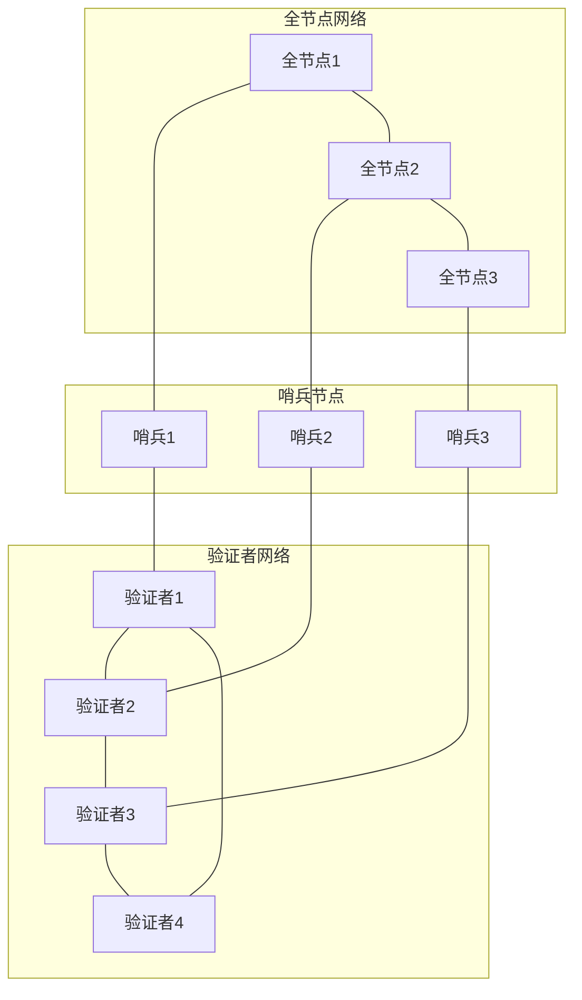
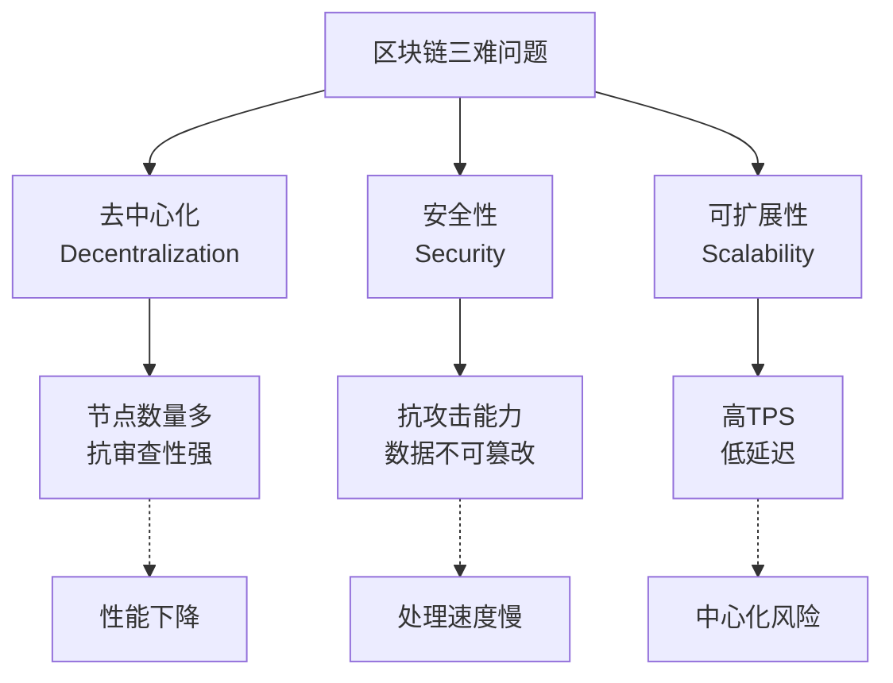

# 公链架构设计

**学习阶段**: 阶段一 | **难度**: ⭐⭐☆☆☆ | **预估时间**: 20-25小时

---

## 📚 学习目标

完成本章学习后，您将能够：
- 理解现代公链的分层架构设计
- 掌握模块化设计的核心原理
- 分析性能与安全的权衡策略
- 设计可扩展的区块链架构

---

## 🏗️ 现代公链架构概览

### 分层架构模型

现代公链通常采用分层架构，每层负责特定功能：

```
┌─────────────────────────────────────┐
│          应用层 (Application)        │  ← DApps, 钱包, 浏览器
├─────────────────────────────────────┤
│          接口层 (Interface)          │  ← RPC, REST API, GraphQL
├─────────────────────────────────────┤
│          业务层 (Business Logic)     │  ← 智能合约, 状态机
├─────────────────────────────────────┤
│          共识层 (Consensus)          │  ← 共识算法, 验证者网络
├─────────────────────────────────────┤
│          网络层 (Network)            │  ← P2P网络, 消息传播
├─────────────────────────────────────┤
│          存储层 (Storage)            │  ← 状态存储, 区块存储
└─────────────────────────────────────┘
```

### 核心组件分析

#### 1. 存储层 (Storage Layer)

**职责**: 持久化存储区块链数据

**关键组件**:
- **状态存储**: 当前账户状态、智能合约状态
- **区块存储**: 历史区块和交易数据
- **索引存储**: 快速查询索引

**技术选择**:
```yaml
状态存储:
  - IAVL树 (Cosmos): 版本化的AVL树
  - Patricia Trie (Ethereum): 前缀树结构
  - RocksDB: 高性能键值存储

区块存储:
  - LevelDB: 轻量级存储引擎
  - BadgerDB: Go语言原生存储
  - PostgreSQL: 关系型数据库(某些场景)
```

#### 2. 网络层 (Network Layer)

**职责**: 节点间通信和数据传播

**核心功能**:
- **节点发现**: 自动发现网络中的其他节点
- **消息传播**: 高效传播交易和区块
- **连接管理**: 维护稳定的网络连接

**网络拓扑**:


#### 3. 共识层 (Consensus Layer)

**职责**: 确保网络对区块链状态达成一致

**关键机制**:
- **区块提议**: 验证者提议新区块
- **投票机制**: 验证者对区块进行投票
- **最终确定**: 确定区块的最终状态

**Tendermint共识流程**:
```
轮次开始 → 提议阶段 → 预投票阶段 → 预提交阶段 → 提交阶段 → 新轮次
    ↓         ↓          ↓           ↓           ↓
  选择提议者  广播区块   收集预投票   收集预提交   更新状态
```

#### 4. 业务层 (Business Logic Layer)

**职责**: 实现区块链的核心业务逻辑

**模块化设计**:
```go
// Cosmos SDK模块示例
type AppModule interface {
    // 模块名称
    Name() string
    
    // 注册服务
    RegisterServices(cfg Configurator)
    
    // 初始化创世状态
    InitGenesis(ctx sdk.Context, data json.RawMessage)
    
    // 导出创世状态
    ExportGenesis(ctx sdk.Context) json.RawMessage
    
    // 开始区块处理
    BeginBlock(ctx sdk.Context, req abci.RequestBeginBlock)
    
    // 结束区块处理
    EndBlock(ctx sdk.Context, req abci.RequestEndBlock) []abci.ValidatorUpdate
}
```

---

## 🔧 模块化设计原理

### 1. 模块化的优势

**可维护性**:
- 代码结构清晰，职责分离
- 独立开发和测试
- 降低系统复杂度

**可扩展性**:
- 插拔式模块设计
- 支持自定义功能模块
- 便于功能升级

**可复用性**:
- 模块可在不同项目间复用
- 标准化接口设计
- 社区贡献和协作

### 2. Cosmos SDK模块系统

#### 核心模块

```yaml
基础模块:
  - auth: 账户和签名验证
  - bank: 代币转账和余额管理
  - staking: 权益质押和验证者管理
  - distribution: 奖励分发
  - governance: 链上治理
  - slashing: 验证者惩罚机制

扩展模块:
  - ibc: 跨链通信
  - upgrade: 链上升级
  - evidence: 恶意行为证据
  - crisis: 紧急停机机制
```

#### 自定义模块开发

```go
// 自定义RWA模块示例
package rwa

import (
    "github.com/cosmos/cosmos-sdk/codec"
    sdk "github.com/cosmos/cosmos-sdk/types"
    "github.com/cosmos/cosmos-sdk/types/module"
)

// RWA模块结构
type AppModule struct {
    keeper Keeper
    cdc    codec.Codec
}

// 实现模块接口
func (am AppModule) Name() string {
    return ModuleName
}

func (am AppModule) RegisterServices(cfg module.Configurator) {
    types.RegisterMsgServer(cfg.MsgServer(), keeper.NewMsgServerImpl(am.keeper))
    types.RegisterQueryServer(cfg.QueryServer(), am.keeper)
}

// 处理消息
func (am AppModule) Route() sdk.Route {
    return sdk.NewRoute(types.RouterKey, NewHandler(am.keeper))
}

// 查询处理
func (am AppModule) QuerierRoute() string {
    return types.QuerierRoute
}
```

### 3. 模块间通信

#### Keeper模式

```go
// Keeper负责模块状态管理
type Keeper struct {
    storeKey   sdk.StoreKey
    cdc        codec.Codec
    bankKeeper types.BankKeeper    // 依赖其他模块
    stakingKeeper types.StakingKeeper
}

// 跨模块调用示例
func (k Keeper) TransferTokens(ctx sdk.Context, from, to sdk.AccAddress, amount sdk.Coins) error {
    // 调用bank模块进行转账
    return k.bankKeeper.SendCoins(ctx, from, to, amount)
}

func (k Keeper) GetValidatorPower(ctx sdk.Context, valAddr sdk.ValAddress) int64 {
    // 调用staking模块获取验证者权重
    validator, found := k.stakingKeeper.GetValidator(ctx, valAddr)
    if !found {
        return 0
    }
    return validator.GetConsensusPower()
}
```

---

## ⚖️ 性能与安全权衡

### 1. 区块链三难问题



### 2. 性能优化策略

#### 分片技术 (Sharding)

```yaml
水平分片:
  原理: 将网络分成多个分片，并行处理交易
  优势: 显著提高TPS
  挑战: 跨分片通信复杂，安全性降低

垂直分片:
  原理: 不同类型的交易在不同分片处理
  优势: 专业化处理，效率高
  挑战: 负载均衡困难
```

#### 状态通道 (State Channels)

```python
# 状态通道概念示例
class StateChannel:
    def __init__(self, participants, initial_state):
        self.participants = participants
        self.state = initial_state
        self.nonce = 0
        self.is_open = True
    
    def update_state(self, new_state, signatures):
        # 验证所有参与者签名
        if self.verify_signatures(new_state, signatures):
            self.state = new_state
            self.nonce += 1
            return True
        return False
    
    def close_channel(self, final_state, signatures):
        # 关闭通道，将最终状态提交到主链
        if self.verify_signatures(final_state, signatures):
            self.submit_to_mainchain(final_state)
            self.is_open = False
```

#### Layer 2解决方案

```yaml
Rollups:
  Optimistic Rollups:
    - 乐观执行，争议时回滚
    - 高吞吐量，低成本
    - 挑战期较长
  
  ZK Rollups:
    - 零知识证明验证
    - 即时最终性
    - 计算成本高

侧链:
  - 独立的区块链
  - 与主链双向锚定
  - 可定制共识机制
```

### 3. 安全性考虑

#### 攻击向量分析

```yaml
共识层攻击:
  51%攻击: 控制超过一半算力/权益
  Long Range攻击: 从历史区块重新构建链
  Nothing at Stake: PoS中的多重投票

网络层攻击:
  Eclipse攻击: 隔离目标节点
  DDoS攻击: 拒绝服务攻击
  Sybil攻击: 创建大量虚假身份

应用层攻击:
  智能合约漏洞: 重入攻击、整数溢出
  治理攻击: 恶意提案和投票
  经济攻击: 操纵代币价格
```

#### 安全防护机制

```go
// 重入攻击防护示例
type ReentrancyGuard struct {
    mutex sync.Mutex
    locked bool
}

func (rg *ReentrancyGuard) NonReentrant(fn func() error) error {
    rg.mutex.Lock()
    defer rg.mutex.Unlock()
    
    if rg.locked {
        return errors.New("reentrant call detected")
    }
    
    rg.locked = true
    defer func() { rg.locked = false }()
    
    return fn()
}

// 使用示例
func (k Keeper) WithdrawFunds(ctx sdk.Context, amount sdk.Int) error {
    return k.reentrancyGuard.NonReentrant(func() error {
        // 执行提取逻辑
        return k.doWithdraw(ctx, amount)
    })
}
```

---

## 🎯 架构设计最佳实践

### 1. 设计原则

#### 单一职责原则
- 每个模块只负责一个特定功能
- 避免模块间的紧耦合
- 便于测试和维护

#### 开放封闭原则
- 对扩展开放，对修改封闭
- 通过接口定义模块边界
- 支持插件式架构

#### 依赖倒置原则
- 高层模块不依赖低层模块
- 都依赖于抽象接口
- 便于模块替换和升级

### 2. 接口设计

```go
// 良好的接口设计示例
type TokenKeeper interface {
    // 基础操作
    MintTokens(ctx sdk.Context, amount sdk.Int, recipient sdk.AccAddress) error
    BurnTokens(ctx sdk.Context, amount sdk.Int, owner sdk.AccAddress) error
    TransferTokens(ctx sdk.Context, from, to sdk.AccAddress, amount sdk.Int) error
    
    // 查询操作
    GetBalance(ctx sdk.Context, addr sdk.AccAddress) sdk.Int
    GetTotalSupply(ctx sdk.Context) sdk.Int
    
    // 权限控制
    HasPermission(ctx sdk.Context, addr sdk.AccAddress, permission string) bool
}

// 具体实现
type tokenKeeper struct {
    storeKey sdk.StoreKey
    cdc      codec.Codec
}

func (k tokenKeeper) MintTokens(ctx sdk.Context, amount sdk.Int, recipient sdk.AccAddress) error {
    // 实现代币铸造逻辑
    store := ctx.KVStore(k.storeKey)
    
    // 更新总供应量
    totalSupply := k.GetTotalSupply(ctx)
    newTotalSupply := totalSupply.Add(amount)
    store.Set([]byte("total_supply"), k.cdc.MustMarshal(&newTotalSupply))
    
    // 更新接收者余额
    balance := k.GetBalance(ctx, recipient)
    newBalance := balance.Add(amount)
    store.Set(append([]byte("balance_"), recipient...), k.cdc.MustMarshal(&newBalance))
    
    return nil
}
```

### 3. 错误处理

```go
// 自定义错误类型
var (
    ErrInsufficientFunds = sdkerrors.Register(ModuleName, 1, "insufficient funds")
    ErrInvalidAddress    = sdkerrors.Register(ModuleName, 2, "invalid address")
    ErrUnauthorized      = sdkerrors.Register(ModuleName, 3, "unauthorized operation")
)

// 错误处理示例
func (k Keeper) ProcessTransfer(ctx sdk.Context, msg *types.MsgTransfer) error {
    // 验证地址
    if _, err := sdk.AccAddressFromBech32(msg.Sender); err != nil {
        return sdkerrors.Wrapf(ErrInvalidAddress, "invalid sender address: %s", msg.Sender)
    }
    
    // 检查余额
    balance := k.GetBalance(ctx, senderAddr)
    if balance.LT(msg.Amount) {
        return sdkerrors.Wrapf(ErrInsufficientFunds, "balance %s is less than %s", balance, msg.Amount)
    }
    
    // 执行转账
    return k.TransferTokens(ctx, senderAddr, recipientAddr, msg.Amount)
}
```

---

## 💡 实践练习

### 练习1: 设计简单的模块化架构

设计一个包含以下模块的简单区块链：
- 账户模块 (Account)
- 代币模块 (Token)  
- 治理模块 (Governance)

```go
// 定义模块接口
type Module interface {
    Name() string
    InitGenesis(ctx Context, data []byte) error
    ExportGenesis(ctx Context) ([]byte, error)
    BeginBlock(ctx Context) error
    EndBlock(ctx Context) error
}

// 实现账户模块
type AccountModule struct {
    keeper AccountKeeper
}

func (m AccountModule) Name() string {
    return "account"
}

// TODO: 实现其他方法
```

### 练习2: 分析现有公链架构

选择一个现有公链项目（如Cosmos Hub、Osmosis等），分析其架构设计：

1. 识别各个层次的组件
2. 分析模块间的依赖关系
3. 评估其性能和安全权衡
4. 提出可能的改进建议

### 练习3: 性能基准测试

```go
// 简单的性能测试框架
func BenchmarkTransactionProcessing(b *testing.B) {
    // 初始化测试环境
    app := setupTestApp()
    ctx := app.BaseApp.NewContext(false, tmproto.Header{})
    
    // 准备测试数据
    accounts := generateTestAccounts(1000)
    transactions := generateTestTransactions(accounts, b.N)
    
    // 开始基准测试
    b.ResetTimer()
    for i := 0; i < b.N; i++ {
        _, err := app.DeliverTx(abci.RequestDeliverTx{
            Tx: transactions[i],
        })
        if err != nil {
            b.Fatal(err)
        }
    }
}
```

---

## 📖 扩展阅读

### 技术文档
- [Cosmos SDK Architecture](https://docs.cosmos.network/main/intro/sdk-app-architecture.html)
- [Tendermint Core Documentation](https://docs.tendermint.com/)
- [Ethereum Architecture](https://ethereum.org/en/developers/docs/)

### 学术论文
- [Scalability of Blockchain Systems](https://arxiv.org/abs/1801.03998)
- [SoK: Consensus in the Age of Blockchains](https://arxiv.org/abs/1711.03936)
- [Layer 2 Blockchain Scaling: a Survey](https://arxiv.org/abs/2107.10881)

### 开源项目
- [Cosmos SDK](https://github.com/cosmos/cosmos-sdk)
- [Tendermint](https://github.com/tendermint/tendermint)
- [Substrate](https://github.com/paritytech/substrate)

---

## ✅ 学习检查点

完成本章学习后，请确认您能够：

- [ ] 描述现代公链的分层架构
- [ ] 解释模块化设计的优势和实现方式
- [ ] 分析区块链三难问题的权衡策略
- [ ] 设计基本的模块接口和依赖关系
- [ ] 识别常见的安全攻击向量
- [ ] 实现简单的性能优化方案

### 架构设计作业

设计一个专门用于RWA资产代币化的区块链架构：

1. **需求分析**: 列出RWA链的特殊需求
2. **架构设计**: 设计分层架构和核心模块
3. **接口定义**: 定义关键模块的接口
4. **安全考虑**: 分析潜在安全风险和防护措施
5. **性能优化**: 提出性能优化策略

---

**下一章**: [Cosmos SDK深度解析](./03-Cosmos-SDK-Deep-Dive.md)

*深入学习Cosmos SDK的架构和开发实践！*
