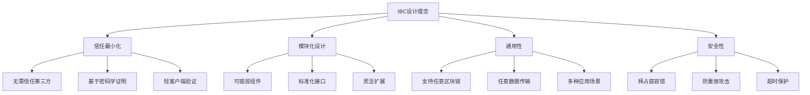
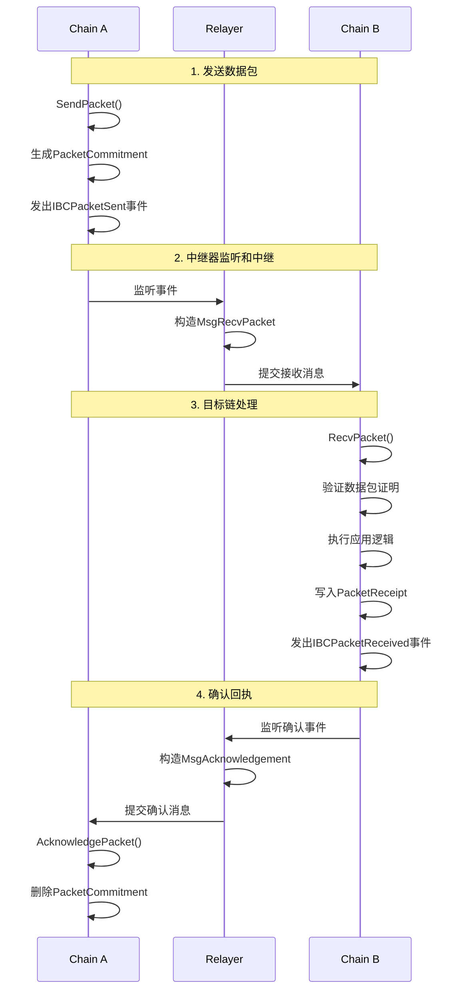
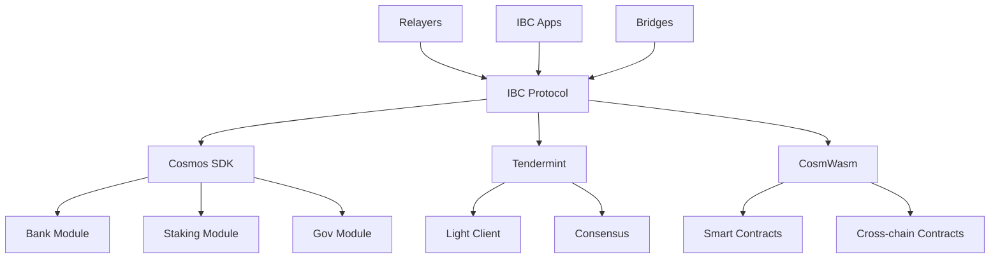
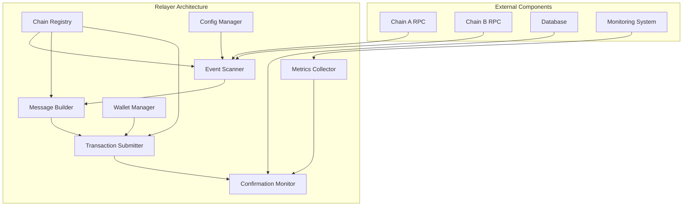

# IBC 跨链通信协议

**学习阶段**: 阶段二 | **难度**: ⭐⭐⭐☆☆ | **预估时间**: 25-30 小时

---

## 📚 学习目标

完成本章学习后，您将能够：

-   深入理解 IBC 协议的设计原理和架构
-   掌握跨链消息传递的完整机制
-   学会开发和部署中继器(Relayer)
-   实现跨链应用和资产转移
-   理解 IBC 在 Cosmos 生态中的核心作用

---

## 🌐 IBC 协议设计原理

### 1. IBC 协议概述

**Inter-Blockchain Communication (IBC)** 是 Cosmos 生态系统中实现区块链间通信的标准协议，被誉为"区块链互联网的 TCP/IP 协议"。

#### 核心设计理念



#### IBC 协议栈

```yaml
IBC协议栈:
    应用层 (IBC Applications):
        - ICS-20: 代币转移
        - ICS-27: 跨链账户
        - ICS-29: 中继费用
        - 自定义应用

    传输层 (IBC Core):
        - ICS-04: 通道和数据包
        - ICS-03: 连接握手
        - ICS-02: 客户端状态
        - ICS-23: 向量承诺

    网络层 (Relayer):
        - 消息中继
        - 状态同步
        - 证明生成
        - 超时处理
```

### 2. IBC 架构组件

#### 2.1 客户端(Client)

```go
// IBC客户端接口
type ClientState interface {
    ClientType() string
    GetLatestHeight() Height
    Validate() error
    GetProofSpecs() []*ics23.ProofSpec

    // 验证功能
    VerifyMembership(
        height Height,
        delayTimePeriod uint64,
        delayBlockPeriod uint64,
        proof []byte,
        path []byte,
        value []byte,
    ) error

    VerifyNonMembership(
        height Height,
        delayTimePeriod uint64,
        delayBlockPeriod uint64,
        proof []byte,
        path []byte,
    ) error
}

// Tendermint客户端状态
type ClientState struct {
    ChainId         string
    TrustLevel      Fraction
    TrustingPeriod  time.Duration
    UnbondingPeriod time.Duration
    MaxClockDrift   time.Duration
    FrozenHeight    Height
    LatestHeight    Height
    ProofSpecs      []*ics23.ProofSpec
    UpgradePath     []string
}
```

#### 2.2 连接(Connection)

```go
// IBC连接状态
type ConnectionEnd struct {
    ClientId    string
    Versions    []*Version
    State       State
    Counterparty Counterparty
    DelayPeriod uint64
}

// 连接握手状态
type State int32

const (
    UNINITIALIZED State = 0
    INIT          State = 1
    TRYOPEN       State = 2
    OPEN          State = 3
)

// 连接握手流程
func (k Keeper) ConnOpenInit(
    ctx sdk.Context,
    clientID string,
    counterparty Counterparty,
    version *Version,
    delayPeriod uint64,
) (string, error) {
    // 1. 验证客户端存在
    // 2. 创建连接标识符
    // 3. 存储连接状态
    // 4. 发出连接初始化事件
    return connectionID, nil
}
```

#### 2.3 通道(Channel)

```go
// IBC通道端点
type Channel struct {
    State          State
    Ordering       Order
    Counterparty   Counterparty
    ConnectionHops []string
    Version        string
}

// 通道排序类型
type Order int32

const (
    NONE_UNORDERED Order = 0
    UNORDERED      Order = 1
    ORDERED        Order = 2
)

// 数据包结构
type Packet struct {
    Sequence           uint64
    SourcePort         string
    SourceChannel      string
    DestinationPort    string
    DestinationChannel string
    Data               []byte
    TimeoutHeight      Height
    TimeoutTimestamp   uint64
}
```

---

## 🔄 跨链消息传递机制

### 1. 消息传递流程

#### 完整的跨链通信流程



#### 数据包生命周期管理

```go
// 发送数据包
func (k Keeper) SendPacket(
    ctx sdk.Context,
    channelCap *capabilitytypes.Capability,
    packet exported.PacketI,
) error {
    // 1. 验证通道状态
    channel, found := k.GetChannel(ctx, packet.GetSourcePort(), packet.GetSourceChannel())
    if !found || channel.State != types.OPEN {
        return sdkerrors.Wrapf(types.ErrChannelNotFound, "channel not found")
    }

    // 2. 验证超时设置
    if packet.GetTimeoutHeight().IsZero() && packet.GetTimeoutTimestamp() == 0 {
        return sdkerrors.Wrap(types.ErrInvalidPacket, "packet timeout height and timestamp cannot both be 0")
    }

    // 3. 生成数据包承诺
    commitment := types.CommitPacket(k.cdc, packet)
    k.SetPacketCommitment(ctx, packet.GetSourcePort(), packet.GetSourceChannel(), packet.GetSequence(), commitment)

    // 4. 递增序列号
    k.SetNextSequenceSend(ctx, packet.GetSourcePort(), packet.GetSourceChannel(), packet.GetSequence()+1)

    // 5. 发出事件
    ctx.EventManager().EmitEvents(sdk.Events{
        sdk.NewEvent(
            types.EventTypeSendPacket,
            sdk.NewAttribute(types.AttributeKeyData, string(packet.GetData())),
            sdk.NewAttribute(types.AttributeKeyTimeoutHeight, packet.GetTimeoutHeight().String()),
            sdk.NewAttribute(types.AttributeKeyTimeoutTimestamp, fmt.Sprintf("%d", packet.GetTimeoutTimestamp())),
        ),
    })

    return nil
}

// 接收数据包
func (k Keeper) RecvPacket(
    ctx sdk.Context,
    channelCap *capabilitytypes.Capability,
    packet exported.PacketI,
    proof []byte,
    proofHeight exported.Height,
) error {
    // 1. 验证数据包证明
    if err := k.verifyPacketCommitment(ctx, packet, proof, proofHeight); err != nil {
        return err
    }

    // 2. 检查数据包是否已接收
    if k.GetPacketReceipt(ctx, packet.GetDestPort(), packet.GetDestChannel(), packet.GetSequence()) {
        return sdkerrors.Wrap(types.ErrPacketReceived, "packet already received")
    }

    // 3. 验证数据包序列
    if err := k.validatePacketSequence(ctx, packet); err != nil {
        return err
    }

    // 4. 执行应用层逻辑
    ack := k.callPacketExecuted(ctx, channelCap, packet)

    // 5. 存储接收回执
    k.SetPacketReceipt(ctx, packet.GetDestPort(), packet.GetDestChannel(), packet.GetSequence())

    // 6. 存储确认信息
    if ack != nil {
        k.SetPacketAcknowledgement(ctx, packet.GetDestPort(), packet.GetDestChannel(), packet.GetSequence(), ack.Acknowledgement())
    }

    return nil
}
```

### 3. 中继器运营

#### 自动化中继脚本

```bash
#!/bin/bash
# 中继器自动化运营脚本

RELAYER_HOME="$HOME/.relayer"
CONFIG_FILE="$RELAYER_HOME/config/config.yaml"
LOG_FILE="$RELAYER_HOME/logs/relayer.log"

# 检查中继器状态
check_relayer_status() {
    echo "检查中继器状态..."
    rly paths list
    rly chains list
}

# 更新客户端
update_clients() {
    echo "更新客户端状态..."
    rly tx update-clients cosmoshub-osmosis --home $RELAYER_HOME
}

# 中继待处理的数据包
relay_packets() {
    echo "中继待处理数据包..."
    rly tx relay cosmoshub-osmosis --home $RELAYER_HOME
}

# 监控和告警
monitor_and_alert() {
    # 检查余额
    COSMOS_BALANCE=$(rly q balance cosmoshub)
    OSMOSIS_BALANCE=$(rly q balance osmosis)

    if [[ $COSMOS_BALANCE -lt 1000000 ]]; then
        echo "警告: Cosmos Hub余额不足"
        # 发送告警通知
    fi

    if [[ $OSMOSIS_BALANCE -lt 1000000 ]]; then
        echo "警告: Osmosis余额不足"
        # 发送告警通知
    fi
}

# 主循环
main() {
    while true; do
        check_relayer_status
        update_clients
        relay_packets
        monitor_and_alert

        echo "等待30秒后继续..."
        sleep 30
    done
}

# 启动中继器
main >> $LOG_FILE 2>&1
```

---

## 🚀 跨链应用开发

### 1. ICS-20 代币转移

#### 代币转移实现

```go
// ICS-20代币转移模块
type Keeper struct {
    cdc           codec.BinaryCodec
    storeKey      storetypes.StoreKey
    channelKeeper types.ChannelKeeper
    portKeeper    types.PortKeeper
    authKeeper    types.AccountKeeper
    bankKeeper    types.BankKeeper
    scopedKeeper  exported.ScopedKeeper
}

// 发送代币到其他链
func (k Keeper) SendTransfer(
    ctx sdk.Context,
    sourcePort,
    sourceChannel string,
    token sdk.Coin,
    sender sdk.AccAddress,
    receiver string,
    timeoutHeight clienttypes.Height,
    timeoutTimestamp uint64,
) error {
    // 1. 验证通道状态
    _, found := k.channelKeeper.GetChannel(ctx, sourcePort, sourceChannel)
    if !found {
        return sdkerrors.Wrapf(channeltypes.ErrChannelNotFound, "port ID (%s) channel ID (%s)", sourcePort, sourceChannel)
    }

    // 2. 构造转移数据
    transferData := types.NewFungibleTokenPacketData(
        token.Denom,
        token.Amount.String(),
        sender.String(),
        receiver,
    )

    // 3. 处理代币托管或销毁
    if k.hasTrace(ctx, sourcePort, sourceChannel, token.Denom) {
        // 销毁代币（回流到原链）
        if err := k.bankKeeper.BurnCoins(ctx, types.ModuleName, sdk.NewCoins(token)); err != nil {
            return err
        }
    } else {
        // 托管代币（发送到其他链）
        if err := k.bankKeeper.SendCoinsFromAccountToModule(ctx, sender, types.ModuleName, sdk.NewCoins(token)); err != nil {
            return err
        }
    }

    // 4. 发送IBC数据包
    packet := channeltypes.NewPacket(
        transferData.GetBytes(),
        k.channelKeeper.GetNextSequenceSend(ctx, sourcePort, sourceChannel),
        sourcePort,
        sourceChannel,
        counterpartyPort,
        counterpartyChannel,
        timeoutHeight,
        timeoutTimestamp,
    )

    return k.channelKeeper.SendPacket(ctx, channelCap, packet)
}

// 接收代币转移数据包
func (k Keeper) OnRecvPacket(
    ctx sdk.Context,
    packet channeltypes.Packet,
    data types.FungibleTokenPacketData,
) exported.Acknowledgement {
    // 1. 验证接收者地址
    receiver, err := sdk.AccAddressFromBech32(data.Receiver)
    if err != nil {
        return channeltypes.NewErrorAcknowledgement(err.Error())
    }

    // 2. 构造代币面额
    denom := k.constructDenom(packet.GetSourcePort(), packet.GetSourceChannel(), data.Denom)

    // 3. 解析代币数量
    amount, ok := sdk.NewIntFromString(data.Amount)
    if !ok {
        return channeltypes.NewErrorAcknowledgement("invalid amount")
    }

    token := sdk.NewCoin(denom, amount)

    // 4. 铸造或释放代币
    if k.hasTrace(ctx, packet.GetDestPort(), packet.GetDestChannel(), data.Denom) {
        // 释放托管的代币
        if err := k.bankKeeper.SendCoinsFromModuleToAccount(ctx, types.ModuleName, receiver, sdk.NewCoins(token)); err != nil {
            return channeltypes.NewErrorAcknowledgement(err.Error())
        }
    } else {
        // 铸造新的代币
        if err := k.bankKeeper.MintCoins(ctx, types.ModuleName, sdk.NewCoins(token)); err != nil {
            return channeltypes.NewErrorAcknowledgement(err.Error())
        }

        if err := k.bankKeeper.SendCoinsFromModuleToAccount(ctx, types.ModuleName, receiver, sdk.NewCoins(token)); err != nil {
            return channeltypes.NewErrorAcknowledgement(err.Error())
        }
    }

    return channeltypes.NewResultAcknowledgement([]byte{byte(1)})
}
```

### 2. ICS-27 跨链账户

#### 跨链账户实现

```go
// 跨链账户控制器
type ICAController struct {
    keeper icacontrollerkeeper.Keeper
}

// 注册跨链账户
func (c *ICAController) RegisterInterchainAccount(
    ctx sdk.Context,
    connectionID string,
    owner sdk.AccAddress,
    version string,
) error {
    // 1. 构造端口ID
    portID, err := icatypes.NewControllerPortID(owner.String())
    if err != nil {
        return err
    }

    // 2. 绑定端口
    cap := c.keeper.BindPort(ctx, portID)
    if err := c.keeper.ClaimCapability(ctx, cap, host.PortPath(portID)); err != nil {
        return err
    }

    // 3. 发起通道握手
    if err := c.keeper.InitiateHandshake(ctx, connectionID, portID, version); err != nil {
        return err
    }

    return nil
}

// 发送跨链交易
func (c *ICAController) SendTx(
    ctx sdk.Context,
    connectionID string,
    portID string,
    icaPacketData icatypes.InterchainAccountPacketData,
    timeoutTimestamp uint64,
) (uint64, error) {
    // 1. 获取活跃通道
    activeChannelID, found := c.keeper.GetActiveChannelID(ctx, connectionID, portID)
    if !found {
        return 0, icatypes.ErrActiveChannelNotFound
    }

    // 2. 发送数据包
    sequence, err := c.keeper.SendTx(ctx, nil, connectionID, portID, icaPacketData, timeoutTimestamp)
    if err != nil {
        return 0, err
    }

    return sequence, nil
}

// 构造跨链交易数据
func BuildInterchainAccountPacketData(msgs []sdk.Msg, memo string) (icatypes.InterchainAccountPacketData, error) {
    // 1. 序列化消息
    var txMsgData []byte
    for _, msg := range msgs {
        msgBytes, err := proto.Marshal(msg)
        if err != nil {
            return icatypes.InterchainAccountPacketData{}, err
        }
        txMsgData = append(txMsgData, msgBytes...)
    }

    // 2. 构造数据包数据
    icaPacketData := icatypes.InterchainAccountPacketData{
        Type: icatypes.EXECUTE_TX,
        Data: txMsgData,
        Memo: memo,
    }

    return icaPacketData, nil
}
```

### 3. 自定义 IBC 应用

#### 自定义应用框架

```go
// 自定义IBC应用接口
type IBCModule interface {
    // 通道握手回调
    OnChanOpenInit(
        ctx sdk.Context,
        order channeltypes.Order,
        connectionHops []string,
        portID string,
        channelID string,
        channelCap *capabilitytypes.Capability,
        counterparty channeltypes.Counterparty,
        version string,
    ) (string, error)

    OnChanOpenTry(
        ctx sdk.Context,
        order channeltypes.Order,
        connectionHops []string,
        portID,
        channelID string,
        channelCap *capabilitytypes.Capability,
        counterparty channeltypes.Counterparty,
        counterpartyVersion string,
    ) (version string, err error)

    OnChanOpenAck(
        ctx sdk.Context,
        portID,
        channelID string,
        counterpartyChannelID string,
        counterpartyVersion string,
    ) error

    OnChanOpenConfirm(
        ctx sdk.Context,
        portID,
        channelID string,
    ) error

    // 数据包处理回调
    OnRecvPacket(
        ctx sdk.Context,
        packet channeltypes.Packet,
        relayer sdk.AccAddress,
    ) exported.Acknowledgement

    OnAcknowledgementPacket(
        ctx sdk.Context,
        packet channeltypes.Packet,
        acknowledgement []byte,
        relayer sdk.AccAddress,
    ) error

    OnTimeoutPacket(
        ctx sdk.Context,
        packet channeltypes.Packet,
        relayer sdk.AccAddress,
    ) error
}

// 示例：跨链投票应用
type CrossChainVotingModule struct {
    keeper VotingKeeper
}

func (m CrossChainVotingModule) OnRecvPacket(
    ctx sdk.Context,
    packet channeltypes.Packet,
    relayer sdk.AccAddress,
) exported.Acknowledgement {
    var data VotingPacketData
    if err := types.ModuleCdc.UnmarshalJSON(packet.GetData(), &data); err != nil {
        return channeltypes.NewErrorAcknowledgement(err.Error())
    }

    switch data.Type {
    case "create_proposal":
        return m.handleCreateProposal(ctx, data)
    case "cast_vote":
        return m.handleCastVote(ctx, data)
    case "tally_votes":
        return m.handleTallyVotes(ctx, data)
    default:
        return channeltypes.NewErrorAcknowledgement("unknown packet type")
    }
}

func (m CrossChainVotingModule) handleCastVote(ctx sdk.Context, data VotingPacketData) exported.Acknowledgement {
    // 1. 验证投票者身份
    voter, err := sdk.AccAddressFromBech32(data.Voter)
    if err != nil {
        return channeltypes.NewErrorAcknowledgement("invalid voter address")
    }

    // 2. 验证提案存在
    proposal, found := m.keeper.GetProposal(ctx, data.ProposalID)
    if !found {
        return channeltypes.NewErrorAcknowledgement("proposal not found")
    }

    // 3. 记录投票
    vote := types.Vote{
        ProposalID: data.ProposalID,
        Voter:      voter.String(),
        Option:     data.VoteOption,
        Weight:     data.VotingPower,
    }

    m.keeper.SetVote(ctx, vote)

    return channeltypes.NewResultAcknowledgement([]byte("vote recorded"))
}
```

---

## 💻 实践练习

### 练习 1: 搭建 IBC 测试环境

#### 环境准备

```bash
# 安装Hermes中继器
cargo install ibc-relayer-cli --bin hermes

# 或使用Go中继器
go install github.com/cosmos/relayer/v2@latest

# 验证安装
hermes version
rly version
```

#### 配置测试链

```bash
# 启动两个测试链
# 链A - gaia
gaiad init test-chain-a --chain-id test-a
gaiad keys add validator-a
gaiad add-genesis-account validator-a 1000000000stake
gaiad gentx validator-a 100000000stake --chain-id test-a
gaiad collect-gentxs
gaiad start --rpc.laddr tcp://0.0.0.0:26657

# 链B - osmosis
osmosisd init test-chain-b --chain-id test-b
osmosisd keys add validator-b
osmosisd add-genesis-account validator-b 1000000000uosmo
osmosisd gentx validator-b 100000000uosmo --chain-id test-b
osmosisd collect-gentxs
osmosisd start --rpc.laddr tcp://0.0.0.0:36657
```

#### 配置中继器

```toml
# hermes配置文件
[global]
log_level = 'info'

[mode]

[mode.clients]
enabled = true
refresh = true
misbehaviour = true

[mode.connections]
enabled = false

[mode.channels]
enabled = false

[mode.packets]
enabled = true
clear_interval = 100
clear_on_start = true
tx_confirmation = true

[[chains]]
id = 'test-a'
rpc_addr = 'http://localhost:26657'
grpc_addr = 'http://localhost:9090'
websocket_addr = 'ws://localhost:26657/websocket'
rpc_timeout = '10s'
account_prefix = 'cosmos'
key_name = 'relayer-a'
store_prefix = 'ibc'
default_gas = 100000
max_gas = 400000
gas_price = { price = 0.001, denom = 'stake' }
gas_multiplier = 1.1
max_msg_num = 30
max_tx_size = 2097152
clock_drift = '5s'
max_block_time = '30s'
trusting_period = '14days'
trust_threshold = { numerator = '1', denominator = '3' }

[[chains]]
id = 'test-b'
rpc_addr = 'http://localhost:36657'
grpc_addr = 'http://localhost:9091'
websocket_addr = 'ws://localhost:36657/websocket'
rpc_timeout = '10s'
account_prefix = 'osmo'
key_name = 'relayer-b'
store_prefix = 'ibc'
default_gas = 100000
max_gas = 400000
gas_price = { price = 0.001, denom = 'uosmo' }
gas_multiplier = 1.1
max_msg_num = 30
max_tx_size = 2097152
clock_drift = '5s'
max_block_time = '30s'
trusting_period = '14days'
trust_threshold = { numerator = '1', denominator = '3' }
```

### 练习 2: 建立 IBC 连接

#### 创建客户端

```bash
# 创建客户端
hermes create client --host-chain test-a --reference-chain test-b
hermes create client --host-chain test-b --reference-chain test-a

# 查看客户端
hermes query clients --host-chain test-a
hermes query clients --host-chain test-b
```

#### 建立连接

```bash
# 创建连接
hermes create connection --a-chain test-a --b-chain test-b

# 查看连接状态
hermes query connections --chain test-a
hermes query connections --chain test-b
```

#### 创建通道

```bash
# 创建传输通道
hermes create channel --a-chain test-a --a-connection connection-0 --a-port transfer --b-port transfer

# 查看通道状态
hermes query channels --chain test-a
hermes query channels --chain test-b
```

### 练习 3: 跨链代币转移

#### 发送代币转移

```bash
# 从test-a发送代币到test-b
gaiad tx ibc-transfer transfer \
  transfer channel-0 \
  osmo1... \
  1000stake \
  --from validator-a \
  --chain-id test-a \
  --node tcp://localhost:26657

# 启动中继器处理数据包
hermes start
```

#### 验证转移结果

```bash
# 查看test-b链上的余额
osmosisd query bank balances osmo1... --node tcp://localhost:36657

# 查看IBC代币面额
osmosisd query bank total --node tcp://localhost:36657
```

---

## 🔧 开发工具和资源

### 开发工具

#### IBC 相关 CLI 工具

```bash
# Hermes中继器命令
hermes config validate                    # 验证配置
hermes health-check                       # 健康检查
hermes query clients --chain <chain-id>  # 查询客户端
hermes query connections --chain <chain-id> # 查询连接
hermes query channels --chain <chain-id>    # 查询通道
hermes clear packets --chain <chain-id>     # 清理数据包

# Go中继器命令
rly config init                          # 初始化配置
rly chains add-dir configs/              # 添加链配置
rly paths add <chain-a> <chain-b> <path> # 添加路径
rly tx link <path>                       # 建立完整连接
rly start <path>                         # 启动中继
```

#### 监控和调试工具

```yaml
IBC监控工具:
    Mintscan:
        - IBC交易浏览器
        - 跨链统计数据
        - 中继器状态监控

    Map of Zones:
        - Cosmos生态网络拓扑
        - IBC连接状态
        - 实时数据流

    Hermes Telemetry:
        - 中继器性能指标
        - Prometheus集成
        - Grafana仪表板

    IBC Packet Explorer:
        - 数据包追踪
        - 超时分析
        - 错误诊断
```

### 参考资源

#### 官方文档

-   [IBC 协议规范](https://github.com/cosmos/ibc)
-   [IBC Go 实现](https://github.com/cosmos/ibc-go)
-   [Hermes 中继器文档](https://hermes.informal.systems/)
-   [Go 中继器文档](https://github.com/cosmos/relayer)

#### 学习资源

-   [IBC 深度解析](https://tutorials.cosmos.network/academy/3-ibc/)
-   [跨链应用开发指南](https://github.com/cosmos/ibc-go/tree/main/docs)
-   [中继器运营指南](https://hub.cosmos.network/main/hub-tutorials/join-mainnet.html)

---

## 📈 进阶学习

### 深入研究方向

#### 1. IBC 协议优化

-   **数据包批处理**: 提高中继效率的批量处理
-   **状态压缩**: 减少存储空间的状态压缩技术
-   **并行处理**: 多通道并行数据包处理

#### 2. 跨链安全研究

-   **轻客户端安全**: 防止长程攻击和无利害攻击
-   **中继器安全**: 防止恶意中继器攻击
-   **跨链 MEV**: 跨链最大可提取价值研究

#### 3. 新兴跨链技术

-   **IBC v2.0**: 下一代 IBC 协议特性
-   **跨链智能合约**: 跨链合约执行机制
-   **跨链隐私**: 隐私保护的跨链通信

### 相关技术栈



### 实际项目应用

#### 主要 IBC 应用项目

-   **Osmosis**: 跨链 AMM 和 DEX
-   **Gravity Bridge**: 以太坊桥接
-   **Axelar**: 通用跨链协议
-   **Composable Finance**: 跨链 DeFi 基础设施
-   **Umee**: 跨链借贷协议

---

## ✅ 学习检查点

### 理论掌握检查

**基础概念** (必须掌握):

-   [ ] 理解 IBC 协议的设计原理和架构
-   [ ] 掌握客户端、连接、通道的概念
-   [ ] 了解跨链消息传递的完整流程
-   [ ] 理解中继器的作用和工作机制

**深入理解** (建议掌握):

-   [ ] 分析 IBC 协议的安全性保证
-   [ ] 理解不同 IBC 应用的实现原理
-   [ ] 掌握跨链应用的开发方法
-   [ ] 了解 IBC 生态系统的发展趋势

### 实践能力验证

**基础实践** (必须完成):

-   [ ] 成功搭建 IBC 测试环境
-   [ ] 建立完整的 IBC 连接
-   [ ] 实现跨链代币转移
-   [ ] 配置和运行中继器

**进阶实践** (建议完成):

-   [ ] 开发自定义 IBC 应用
-   [ ] 实现跨链账户功能
-   [ ] 优化中继器性能
-   [ ] 集成 IBC 监控系统

### 项目应用评估

**应用设计** (综合能力):

-   [ ] 设计跨链应用的架构
-   [ ] 评估跨链方案的安全风险
-   [ ] 制定中继器运营策略
-   [ ] 规划跨链生态系统发展

---

## 📚 参考资源

### 技术文档

-   [IBC 协议规范](https://github.com/cosmos/ibc)
-   [IBC Go 文档](https://ibc.cosmos.network/)
-   [Hermes 中继器指南](https://hermes.informal.systems/)
-   [跨链应用开发教程](https://tutorials.cosmos.network/academy/3-ibc/)

### 学术论文

-   [IBC: The Internet of Blockchains Protocol](https://arxiv.org/abs/1905.02849)
-   [Formal Verification of the IBC Protocol](https://arxiv.org/abs/2109.13086)
-   [Security Analysis of Cross-chain Protocols](https://eprint.iacr.org/2021/1589)

### 开源项目

-   [IBC Go](https://github.com/cosmos/ibc-go)
-   [Hermes Relayer](https://github.com/informalsystems/hermes)
-   [Go Relayer](https://github.com/cosmos/relayer)
-   [IBC Solidity](https://github.com/hyperledger-labs/yui-ibc-solidity)

### 社区资源

-   [IBC Gang Discord](https://discord.gg/cosmosnetwork)
-   [Cosmos 开发者门户](https://tutorials.cosmos.network/)
-   [IBC 协议论坛](https://forum.cosmos.network/)

---

**下一章**: [代币经济学设计](./06-Tokenomics-Design.md)

```go
// 数据包超时处理
func (k Keeper) TimeoutPacket(
    ctx sdk.Context,
    packet exported.PacketI,
    proof []byte,
    proofHeight exported.Height,
    nextSequenceRecv uint64,
) error {
    // 1. 验证超时条件
    if !k.hasPacketTimedOut(ctx, packet, proofHeight) {
        return sdkerrors.Wrap(types.ErrPacketTimeout, "packet has not timed out")
    }

    // 2. 验证未接收证明
    if err := k.verifyPacketReceiptAbsence(ctx, packet, proof, proofHeight); err != nil {
        return err
    }

    // 3. 删除数据包承诺
    k.deletePacketCommitment(ctx, packet.GetSourcePort(), packet.GetSourceChannel(), packet.GetSequence())

    // 4. 调用应用层超时处理
    k.callPacketTimeout(ctx, packet)

    return nil
}

// 检查数据包是否超时
func (k Keeper) hasPacketTimedOut(
    ctx sdk.Context,
    packet exported.PacketI,
    proofHeight exported.Height,
) bool {
    // 检查高度超时
    if !packet.GetTimeoutHeight().IsZero() {
        if proofHeight.GTE(packet.GetTimeoutHeight()) {
            return true
        }
    }

    // 检查时间戳超时
    if packet.GetTimeoutTimestamp() != 0 {
        consensusState, _ := k.clientKeeper.GetClientConsensusState(ctx, clientID, proofHeight)
        if consensusState.GetTimestamp() >= packet.GetTimeoutTimestamp() {
            return true
        }
    }

    return false
}
```

---

## 🤖 中继器(Relayer)实现

### 1. 中继器架构

#### 中继器核心组件



#### 中继器配置

```yaml
# relayer配置文件
global:
    api-listen-addr: :5183
    timeout: 10s
    memo: ""
    light-cache-size: 20

chains:
    cosmoshub:
        type: cosmos
        value:
            key: cosmos-key
            chain-id: cosmoshub-4
            rpc-addr: https://rpc.cosmos.network:443
            account-prefix: cosmos
            keyring-backend: test
            gas-adjustment: 1.2
            gas-prices: 0.01uatom
            debug: false
            timeout: 20s
            output-format: json
            sign-mode: direct

    osmosis:
        type: cosmos
        value:
            key: osmosis-key
            chain-id: osmosis-1
            rpc-addr: https://rpc.osmosis.zone:443
            account-prefix: osmo
            keyring-backend: test
            gas-adjustment: 1.2
            gas-prices: 0.01uosmo
            debug: false
            timeout: 20s
            output-format: json
            sign-mode: direct

paths:
    cosmoshub-osmosis:
        src:
            chain-id: cosmoshub-4
            client-id: 07-tendermint-0
            connection-id: connection-0
        dst:
            chain-id: osmosis-1
            client-id: 07-tendermint-0
            connection-id: connection-0
        src-channel-filter:
            rule: allowlist
            channel-list: [channel-0, channel-141]
```

### 2. 中继器实现

#### 事件监听器

```go
// 事件监听器结构
type EventScanner struct {
    chain      *Chain
    eventTypes []string
    height     int64
    client     rpcclient.Client
}

// 扫描IBC事件
func (es *EventScanner) ScanIBCEvents(ctx context.Context) ([]*IBCEvent, error) {
    // 1. 获取最新区块高度
    status, err := es.client.Status(ctx)
    if err != nil {
        return nil, err
    }

    latestHeight := status.SyncInfo.LatestBlockHeight

    // 2. 扫描指定高度范围的事件
    var events []*IBCEvent
    for height := es.height; height <= latestHeight; height++ {
        blockEvents, err := es.getBlockEvents(ctx, height)
        if err != nil {
            continue
        }

        // 3. 过滤IBC相关事件
        ibcEvents := es.filterIBCEvents(blockEvents)
        events = append(events, ibcEvents...)
    }

    es.height = latestHeight + 1
    return events, nil
}

// 过滤IBC事件
func (es *EventScanner) filterIBCEvents(events []abci.Event) []*IBCEvent {
    var ibcEvents []*IBCEvent

    for _, event := range events {
        switch event.Type {
        case "send_packet":
            ibcEvent := &IBCEvent{
                Type:   SendPacket,
                Height: es.height,
                Packet: es.parsePacketFromEvent(event),
            }
            ibcEvents = append(ibcEvents, ibcEvent)

        case "recv_packet":
            ibcEvent := &IBCEvent{
                Type:   RecvPacket,
                Height: es.height,
                Packet: es.parsePacketFromEvent(event),
            }
            ibcEvents = append(ibcEvents, ibcEvent)

        case "acknowledge_packet":
            ibcEvent := &IBCEvent{
                Type:   AckPacket,
                Height: es.height,
                Packet: es.parsePacketFromEvent(event),
            }
            ibcEvents = append(ibcEvents, ibcEvent)
        }
    }

    return ibcEvents
}
```

#### 消息构建器

```go
// 消息构建器
type MessageBuilder struct {
    srcChain *Chain
    dstChain *Chain
}

// 构建接收数据包消息
func (mb *MessageBuilder) BuildRecvPacketMsg(
    packet *Packet,
    proof []byte,
    proofHeight clienttypes.Height,
) (*channeltypes.MsgRecvPacket, error) {
    return &channeltypes.MsgRecvPacket{
        Packet:          *packet,
        ProofCommitment: proof,
        ProofHeight:     proofHeight,
        Signer:          mb.dstChain.GetAddress(),
    }, nil
}

// 构建确认消息
func (mb *MessageBuilder) BuildAckMsg(
    packet *Packet,
    ack []byte,
    proof []byte,
    proofHeight clienttypes.Height,
) (*channeltypes.MsgAcknowledgement, error) {
    return &channeltypes.MsgAcknowledgement{
        Packet:          *packet,
        Acknowledgement: ack,
        ProofAcked:      proof,
        ProofHeight:     proofHeight,
        Signer:          mb.srcChain.GetAddress(),
    }, nil
}

// 构建超时消息
func (mb *MessageBuilder) BuildTimeoutMsg(
    packet *Packet,
    proof []byte,
    proofHeight clienttypes.Height,
    nextSequenceRecv uint64,
) (*channeltypes.MsgTimeout, error) {
    return &channeltypes.MsgTimeout{
        Packet:           *packet,
        ProofUnreceived:  proof,
        ProofHeight:      proofHeight,
        NextSequenceRecv: nextSequenceRecv,
        Signer:           mb.srcChain.GetAddress(),
    }, nil
}
```
