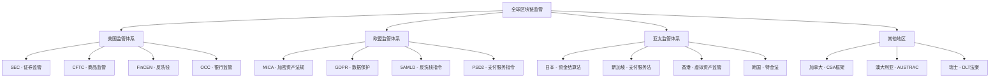
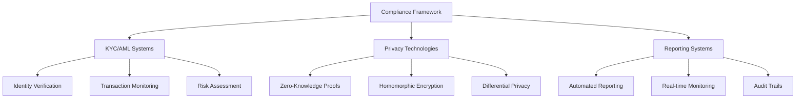

# 合规框架集成

**学习阶段**: 阶段四 | **难度**: ⭐⭐⭐⭐☆ | **预估时间**: 20-25 小时

---

## 📚 学习目标

完成本章学习后，您将能够：

-   深入理解全球区块链监管环境和合规要求
-   掌握 KYC/AML 系统的设计和集成方法
-   实现隐私保护技术与合规要求的平衡
-   开发自动化监管报告和审计系统
-   设计符合多司法管辖区要求的合规架构

---

## 🌍 全球监管环境分析

### 1. 主要监管框架概览

#### 全球监管格局



#### 监管分类体系

```go
// 监管分类枚举
type RegulatoryCategory int32

const (
    SECURITIES_REGULATION    RegulatoryCategory = 0  // 证券监管
    COMMODITIES_REGULATION   RegulatoryCategory = 1  // 商品监管
    BANKING_REGULATION       RegulatoryCategory = 2  // 银行监管
    AML_REGULATION          RegulatoryCategory = 3  // 反洗钱监管
    DATA_PROTECTION         RegulatoryCategory = 4  // 数据保护
    CONSUMER_PROTECTION     RegulatoryCategory = 5  // 消费者保护
    TAX_REGULATION          RegulatoryCategory = 6  // 税务监管
)

// 司法管辖区定义
type Jurisdiction struct {
    Code        string
    Name        string
    Region      string
    Regulations []Regulation
    Status      ComplianceStatus
}

type Regulation struct {
    ID          string
    Name        string
    Category    RegulatoryCategory
    Authority   string
    Effective   time.Time
    Requirements []Requirement
    Penalties   []Penalty
}

type Requirement struct {
    ID          string
    Description string
    Mandatory   bool
    Deadline    time.Time
    Evidence    []string
}

// 合规状态管理
type ComplianceStatus int32

const (
    COMPLIANT     ComplianceStatus = 0  // 合规
    NON_COMPLIANT ComplianceStatus = 1  // 不合规
    PENDING       ComplianceStatus = 2  // 待审核
    EXEMPT        ComplianceStatus = 3  // 豁免
)

// 合规管理器
type ComplianceManager struct {
    jurisdictions map[string]Jurisdiction
    policies      map[string]CompliancePolicy
    auditor       ComplianceAuditor
}

func NewComplianceManager() *ComplianceManager {
    return &ComplianceManager{
        jurisdictions: make(map[string]Jurisdiction),
        policies:      make(map[string]CompliancePolicy),
        auditor:       NewComplianceAuditor(),
    }
}

// 检查合规状态
func (cm *ComplianceManager) CheckCompliance(
    ctx sdk.Context,
    entity Entity,
    jurisdiction string,
) (ComplianceResult, error) {
    // 1. 获取适用的监管要求
    reqs, err := cm.getApplicableRequirements(jurisdiction, entity.Type)
    if err != nil {
        return ComplianceResult{}, err
    }

    // 2. 评估合规状态
    results := make([]RequirementResult, 0, len(reqs))
    for _, req := range reqs {
        result := cm.evaluateRequirement(ctx, entity, req)
        results = append(results, result)
    }

    // 3. 计算总体合规状态
    overallStatus := cm.calculateOverallStatus(results)

    return ComplianceResult{
        Entity:            entity,
        Jurisdiction:      jurisdiction,
        Requirements:      results,
        OverallStatus:     overallStatus,
        LastChecked:       ctx.BlockTime(),
        NextReviewDate:    cm.calculateNextReview(overallStatus),
    }, nil
}
```

### 2. 区域性监管特点

#### 美国监管体系

```yaml
美国监管特点:
    多机构监管:
        SEC:
            - 证券代币监管
            - Howey测试应用
            - 注册豁免条件
        CFTC:
            - 商品代币监管
            - 衍生品交易
            - 市场操纵防范
        FinCEN:
            - 货币服务业务
            - 反洗钱合规
            - 可疑活动报告

    关键法规:
        - 证券法 (Securities Act)
        - 商品交易法 (CEA)
        - 银行保密法 (BSA)
        - 爱国者法案 (USA PATRIOT Act)

    合规要点:
        - 代币分类明确
        - 注册或豁免
        - AML/KYC程序
        - 定期报告义务
```

#### 欧盟 MiCA 框架

```go
// MiCA合规实现
type MiCACompliance struct {
    licenseType    LicenseType
    authorizations []Authorization
    requirements   []MiCARequirement
}

type LicenseType int32

const (
    CASP_LICENSE           LicenseType = 0  // 加密资产服务提供商
    ART_ISSUER_LICENSE     LicenseType = 1  // 资产引用代币发行商
    EMT_ISSUER_LICENSE     LicenseType = 2  // 电子货币代币发行商
    SIGNIFICANT_ART_ISSUER LicenseType = 3  // 重要ART发行商
    SIGNIFICANT_EMT_ISSUER LicenseType = 4  // 重要EMT发行商
)

type MiCARequirement struct {
    Article     string
    Description string
    Applicable  bool
    Deadline    time.Time
    Status      ComplianceStatus
}

// MiCA合规检查
func (mc *MiCACompliance) CheckMiCACompliance(
    ctx sdk.Context,
    service CryptoAssetService,
) (MiCAComplianceResult, error) {
    result := MiCAComplianceResult{
        ServiceType: service.Type,
        CheckDate:   ctx.BlockTime(),
    }

    // 1. 确定适用的许可类型
    requiredLicense := mc.determineLicenseType(service)
    result.RequiredLicense = requiredLicense

    // 2. 检查许可状态
    hasLicense := mc.hasValidLicense(requiredLicense)
    result.HasValidLicense = hasLicense

    // 3. 检查具体要求
    requirements := mc.getRequirementsForLicense(requiredLicense)
    for _, req := range requirements {
        reqResult := mc.checkRequirement(ctx, service, req)
        result.RequirementResults = append(result.RequirementResults, reqResult)
    }

    // 4. 计算总体合规状态
    result.OverallCompliance = mc.calculateMiCACompliance(result)

    return result, nil
}

// 白皮书要求实现
func (mc *MiCACompliance) GenerateWhitePaper(
    token CryptoAsset,
) (WhitePaper, error) {
    wp := WhitePaper{
        TokenName:        token.Name,
        IssuerInfo:       token.Issuer,
        GenerationDate:   time.Now(),
        Version:         "1.0",
    }

    // MiCA第5条 - 白皮书内容要求
    wp.Sections = []WhitePaperSection{
        {
            Title: "发行人信息",
            Content: mc.generateIssuerSection(token.Issuer),
            Required: true,
        },
        {
            Title: "项目描述",
            Content: mc.generateProjectSection(token),
            Required: true,
        },
        {
            Title: "风险因素",
            Content: mc.generateRiskSection(token),
            Required: true,
        },
        {
            Title: "代币详情",
            Content: mc.generateTokenSection(token),
            Required: true,
        },
    }

    return wp, nil
}
```

---

## 🔐 KYC/AML 集成方案

### 1. KYC 系统设计

#### 身份验证架构

```go
// KYC系统核心结构
type KYCSystem struct {
    verificationLevels map[VerificationLevel]KYCRequirement
    providers         []KYCProvider
    riskEngine        RiskAssessmentEngine
    storage           SecureStorage
}

type VerificationLevel int32

const (
    BASIC_VERIFICATION    VerificationLevel = 0  // 基础验证
    ENHANCED_VERIFICATION VerificationLevel = 1  // 增强验证
    INSTITUTIONAL_VERIFICATION VerificationLevel = 2  // 机构验证
)

type KYCRequirement struct {
    Level           VerificationLevel
    Documents       []DocumentType
    Checks          []VerificationCheck
    TransactionLimit sdk.Int
    ValidityPeriod  time.Duration
}

type DocumentType int32

const (
    GOVERNMENT_ID     DocumentType = 0  // 政府身份证件
    PROOF_OF_ADDRESS  DocumentType = 1  // 地址证明
    PROOF_OF_INCOME   DocumentType = 2  // 收入证明
    BUSINESS_LICENSE  DocumentType = 3  // 营业执照
    BENEFICIAL_OWNERSHIP DocumentType = 4  // 实益所有权
)

type VerificationCheck int32

const (
    IDENTITY_VERIFICATION  VerificationCheck = 0  // 身份验证
    ADDRESS_VERIFICATION   VerificationCheck = 1  // 地址验证
    SANCTIONS_SCREENING    VerificationCheck = 2  // 制裁名单筛查
    PEP_SCREENING         VerificationCheck = 3  // 政治敏感人员筛查
    ADVERSE_MEDIA_CHECK   VerificationCheck = 4  // 负面媒体检查
    SOURCE_OF_FUNDS       VerificationCheck = 5  // 资金来源验证
)

// KYC流程实现
func (kyc *KYCSystem) ProcessKYCApplication(
    ctx sdk.Context,
    application KYCApplication,
) (KYCResult, error) {
    // 1. 初始验证
    if err := kyc.validateApplication(application); err != nil {
        return KYCResult{}, err
    }

    // 2. 文档验证
    docResults, err := kyc.verifyDocuments(ctx, application.Documents)
    if err != nil {
        return KYCResult{}, err
    }

    // 3. 身份检查
    identityResult, err := kyc.performIdentityChecks(ctx, application.PersonalInfo)
    if err != nil {
        return KYCResult{}, err
    }

    // 4. 风险评估
    riskScore, err := kyc.riskEngine.AssessRisk(ctx, application)
    if err != nil {
        return KYCResult{}, err
    }

    // 5. 决策制定
    decision := kyc.makeDecision(docResults, identityResult, riskScore)

    // 6. 存储结果
    result := KYCResult{
        ApplicationID:    application.ID,
        Decision:        decision,
        RiskScore:       riskScore,
        VerificationLevel: kyc.determineVerificationLevel(riskScore),
        ExpiryDate:      ctx.BlockTime().Add(kyc.getValidityPeriod(decision)),
        Timestamp:       ctx.BlockTime(),
    }

    if err := kyc.storage.StoreKYCResult(ctx, result); err != nil {
        return KYCResult{}, err
    }

    return result, nil
}

// 文档验证
func (kyc *KYCSystem) verifyDocuments(
    ctx sdk.Context,
    documents []Document,
) ([]DocumentVerificationResult, error) {
    results := make([]DocumentVerificationResult, 0, len(documents))

    for _, doc := range documents {
        // 1. 文档真实性验证
        authenticity, err := kyc.verifyDocumentAuthenticity(doc)
        if err != nil {
            return nil, err
        }

        // 2. 文档内容提取
        extractedData, err := kyc.extractDocumentData(doc)
        if err != nil {
            return nil, err
        }

        // 3. 数据一致性检查
        consistency := kyc.checkDataConsistency(extractedData)

        result := DocumentVerificationResult{
            DocumentID:   doc.ID,
            Type:        doc.Type,
            Authentic:   authenticity,
            Data:        extractedData,
            Consistent:  consistency,
            Timestamp:   ctx.BlockTime(),
        }

        results = append(results, result)
    }

    return results, nil
}
```

### 2. AML 监控系统

#### 交易监控引擎

```go
// AML监控系统
type AMLMonitoringSystem struct {
    rules           []MonitoringRule
    alertManager    AlertManager
    reportGenerator ReportGenerator
    blacklists      []Blacklist
}

type MonitoringRule struct {
    ID          string
    Name        string
    Description string
    Conditions  []RuleCondition
    Actions     []RuleAction
    Severity    AlertSeverity
    Enabled     bool
}

type RuleCondition struct {
    Field    string
    Operator ConditionOperator
    Value    interface{}
}

type ConditionOperator int32

const (
    EQUALS              ConditionOperator = 0
    GREATER_THAN        ConditionOperator = 1
    LESS_THAN          ConditionOperator = 2
    CONTAINS           ConditionOperator = 3
    IN_LIST            ConditionOperator = 4
    PATTERN_MATCH      ConditionOperator = 5
)

type AlertSeverity int32

const (
    LOW_SEVERITY    AlertSeverity = 0
    MEDIUM_SEVERITY AlertSeverity = 1
    HIGH_SEVERITY   AlertSeverity = 2
    CRITICAL_SEVERITY AlertSeverity = 3
)

// 交易监控
func (aml *AMLMonitoringSystem) MonitorTransaction(
    ctx sdk.Context,
    tx Transaction,
) ([]AMLAlert, error) {
    alerts := make([]AMLAlert, 0)

    // 1. 应用监控规则
    for _, rule := range aml.rules {
        if !rule.Enabled {
            continue
        }

        if aml.evaluateRule(ctx, tx, rule) {
            alert := AMLAlert{
                ID:          generateAlertID(),
                RuleID:      rule.ID,
                Transaction: tx,
                Severity:    rule.Severity,
                Timestamp:   ctx.BlockTime(),
                Status:      ALERT_PENDING,
            }

            alerts = append(alerts, alert)
        }
    }

    // 2. 黑名单检查
    blacklistAlerts := aml.checkBlacklists(ctx, tx)
    alerts = append(alerts, blacklistAlerts...)

    // 3. 模式识别
    patternAlerts := aml.detectSuspiciousPatterns(ctx, tx)
    alerts = append(alerts, patternAlerts...)

    // 4. 处理告警
    for _, alert := range alerts {
        if err := aml.alertManager.ProcessAlert(ctx, alert); err != nil {
            return nil, err
        }
    }

    return alerts, nil
}

// 可疑活动报告生成
func (aml *AMLMonitoringSystem) GenerateSAR(
    ctx sdk.Context,
    alerts []AMLAlert,
) (SuspiciousActivityReport, error) {
    sar := SuspiciousActivityReport{
        ID:           generateSARID(),
        GeneratedAt:  ctx.BlockTime(),
        ReportPeriod: aml.getReportPeriod(ctx),
        Status:       SAR_DRAFT,
    }

    // 1. 聚合相关告警
    suspiciousActivities := aml.aggregateAlerts(alerts)

    // 2. 分析活动模式
    for _, activity := range suspiciousActivities {
        analysis := aml.analyzeActivity(ctx, activity)

        sarEntry := SAREntry{
            ActivityType:    activity.Type,
            Description:     analysis.Description,
            InvolvedParties: activity.Parties,
            Transactions:    activity.Transactions,
            RiskLevel:       analysis.RiskLevel,
            Recommendation:  analysis.Recommendation,
        }

        sar.Entries = append(sar.Entries, sarEntry)
    }

    // 3. 生成报告摘要
    sar.Summary = aml.generateSummary(sar.Entries)

    // 4. 合规检查
    if err := aml.validateSAR(sar); err != nil {
        return SuspiciousActivityReport{}, err
    }

    return sar, nil
}
```

---

## 🔒 隐私保护技术

### 1. 零知识证明合规

#### zk-SNARK 合规验证

```go
// 零知识合规证明系统
type ZKComplianceSystem struct {
    circuit        ComplianceCircuit
    provingKey     ProvingKey
    verifyingKey   VerifyingKey
    trustedSetup   TrustedSetup
}

type ComplianceCircuit struct {
    Name        string
    Constraints []Constraint
    Inputs      []CircuitInput
    Outputs     []CircuitOutput
}

type CircuitInput struct {
    Name     string
    Type     InputType
    Private  bool
    Required bool
}

type InputType int32

const (
    FIELD_ELEMENT InputType = 0
    BOOLEAN       InputType = 1
    INTEGER       InputType = 2
    HASH          InputType = 3
)

// KYC零知识证明
func (zk *ZKComplianceSystem) GenerateKYCProof(
    ctx sdk.Context,
    kycData KYCData,
    requirements ComplianceRequirements,
) (ZKProof, error) {
    // 1. 准备电路输入
    inputs := make(map[string]interface{})

    // 私有输入 - 用户实际数据
    inputs["age"] = kycData.Age
    inputs["country"] = kycData.Country
    inputs["income"] = kycData.Income
    inputs["sanctions_check"] = kycData.SanctionsStatus

    // 公共输入 - 合规要求
    inputs["min_age"] = requirements.MinAge
    inputs["allowed_countries"] = requirements.AllowedCountries
    inputs["min_income"] = requirements.MinIncome

    // 2. 生成见证
    witness, err := zk.circuit.GenerateWitness(inputs)
    if err != nil {
        return ZKProof{}, err
    }

    // 3. 生成证明
    proof, err := zk.generateProof(witness)
    if err != nil {
        return ZKProof{}, err
    }

    // 4. 创建公共输入哈希
    publicInputs := zk.extractPublicInputs(inputs)
    publicHash := zk.hashPublicInputs(publicInputs)

    return ZKProof{
        Proof:        proof,
        PublicInputs: publicHash,
        Circuit:      zk.circuit.Name,
        Timestamp:    ctx.BlockTime(),
    }, nil
}

// 验证合规证明
func (zk *ZKComplianceSystem) VerifyComplianceProof(
    ctx sdk.Context,
    proof ZKProof,
    requirements ComplianceRequirements,
) (bool, error) {
    // 1. 验证证明格式
    if err := zk.validateProofFormat(proof); err != nil {
        return false, err
    }

    // 2. 重构公共输入
    expectedPublicInputs := zk.constructPublicInputs(requirements)
    expectedHash := zk.hashPublicInputs(expectedPublicInputs)

    // 3. 验证公共输入一致性
    if !bytes.Equal(proof.PublicInputs, expectedHash) {
        return false, errors.New("public inputs mismatch")
    }

    // 4. 验证零知识证明
    valid := zk.verifyProof(proof.Proof, proof.PublicInputs)

    return valid, nil
}
```

#### 同态加密应用

```go
// 同态加密合规系统
type HomomorphicComplianceSystem struct {
    publicKey    HomomorphicPublicKey
    privateKey   HomomorphicPrivateKey
    evaluator    HomomorphicEvaluator
}

// 加密交易金额进行合规检查
func (hc *HomomorphicComplianceSystem) CheckTransactionCompliance(
    ctx sdk.Context,
    encryptedAmount EncryptedValue,
    thresholds ComplianceThresholds,
) (ComplianceResult, error) {
    // 1. 加密阈值
    encryptedMinThreshold := hc.encrypt(thresholds.MinAmount)
    encryptedMaxThreshold := hc.encrypt(thresholds.MaxAmount)

    // 2. 同态比较运算
    // 检查 amount >= minThreshold
    minCheck := hc.evaluator.GreaterThanOrEqual(encryptedAmount, encryptedMinThreshold)

    // 检查 amount <= maxThreshold
    maxCheck := hc.evaluator.LessThanOrEqual(encryptedAmount, encryptedMaxThreshold)

    // 3. 组合结果
    complianceCheck := hc.evaluator.And(minCheck, maxCheck)

    // 4. 生成证明（不解密具体金额）
    proof := hc.generateComplianceProof(complianceCheck)

    return ComplianceResult{
        Compliant:   true, // 通过同态运算验证
        Proof:       proof,
        Timestamp:   ctx.BlockTime(),
        Encrypted:   true,
    }, nil
}

// 聚合合规统计
func (hc *HomomorphicComplianceSystem) AggregateComplianceStats(
    ctx sdk.Context,
    encryptedTransactions []EncryptedTransaction,
) (EncryptedStats, error) {
    // 1. 初始化累加器
    totalAmount := hc.encrypt(sdk.ZeroInt())
    transactionCount := hc.encrypt(sdk.ZeroInt())

    // 2. 同态累加
    for _, tx := range encryptedTransactions {
        totalAmount = hc.evaluator.Add(totalAmount, tx.Amount)
        transactionCount = hc.evaluator.Add(transactionCount, hc.encrypt(sdk.OneInt()))
    }

    // 3. 计算平均值（同态除法）
    averageAmount := hc.evaluator.Divide(totalAmount, transactionCount)

    return EncryptedStats{
        TotalAmount:      totalAmount,
        TransactionCount: transactionCount,
        AverageAmount:    averageAmount,
        Timestamp:       ctx.BlockTime(),
    }, nil
}
```

### 2. 差分隐私实现

#### 隐私保护统计

```go
// 差分隐私系统
type DifferentialPrivacySystem struct {
    epsilon     float64  // 隐私预算
    delta       float64  // 失败概率
    sensitivity float64  // 敏感度
    mechanism   PrivacyMechanism
}

type PrivacyMechanism int32

const (
    LAPLACE_MECHANISM    PrivacyMechanism = 0
    GAUSSIAN_MECHANISM   PrivacyMechanism = 1
    EXPONENTIAL_MECHANISM PrivacyMechanism = 2
)

// 差分隐私查询
func (dp *DifferentialPrivacySystem) PrivateQuery(
    ctx sdk.Context,
    query StatisticalQuery,
    dataset Dataset,
) (PrivateResult, error) {
    // 1. 计算真实结果
    trueResult := dp.executeQuery(query, dataset)

    // 2. 计算噪声参数
    noiseScale := dp.calculateNoiseScale(query.Sensitivity)

    // 3. 添加校准噪声
    noise := dp.generateNoise(noiseScale)
    privateResult := dp.addNoise(trueResult, noise)

    // 4. 更新隐私预算
    dp.updatePrivacyBudget(query.EpsilonCost)

    return PrivateResult{
        Value:         privateResult,
        Query:         query,
        NoiseAdded:    noise,
        EpsilonUsed:   query.EpsilonCost,
        Timestamp:     ctx.BlockTime(),
    }, nil
}

// 生成拉普拉斯噪声
func (dp *DifferentialPrivacySystem) generateLaplaceNoise(scale float64) float64 {
    // 使用拉普拉斯分布生成噪声
    u := rand.Float64() - 0.5
    if u < 0 {
        return scale * math.Log(1+2*u)
    }
    return -scale * math.Log(1-2*u)
}

// 隐私保护合规报告
func (dp *DifferentialPrivacySystem) GeneratePrivateComplianceReport(
    ctx sdk.Context,
    transactions []Transaction,
    reportRequirements ReportRequirements,
) (PrivateComplianceReport, error) {
    report := PrivateComplianceReport{
        Period:    reportRequirements.Period,
        Generated: ctx.BlockTime(),
    }

    // 1. 交易数量统计（添加噪声）
    trueCount := len(transactions)
    noisyCount := dp.addLaplaceNoise(float64(trueCount), 1.0/dp.epsilon)
    report.TransactionCount = int64(math.Max(0, noisyCount))

    // 2. 总交易金额统计（添加噪声）
    totalAmount := dp.calculateTotalAmount(transactions)
    noisyAmount := dp.addLaplaceNoise(totalAmount, reportRequirements.AmountSensitivity/dp.epsilon)
    report.TotalAmount = sdk.NewInt(int64(math.Max(0, noisyAmount)))

    // 3. 平均交易金额（后处理）
    if report.TransactionCount > 0 {
        report.AverageAmount = report.TotalAmount.Quo(sdk.NewInt(report.TransactionCount))
    }

    // 4. 合规违规统计
    violations := dp.countViolations(transactions)
    noisyViolations := dp.addLaplaceNoise(float64(violations), 1.0/dp.epsilon)
    report.ViolationCount = int64(math.Max(0, noisyViolations))

    return report, nil
}
```

---

## 📊 监管报告自动化

### 1. 报告生成系统

#### 自动化报告框架

```go
// 监管报告系统
type RegulatoryReportingSystem struct {
    templates    map[string]ReportTemplate
    schedulers   map[string]ReportScheduler
    generators   map[string]ReportGenerator
    distributors map[string]ReportDistributor
}

type ReportTemplate struct {
    ID           string
    Name         string
    Jurisdiction string
    Authority    string
    Format       ReportFormat
    Sections     []ReportSection
    Frequency    ReportFrequency
    Deadline     time.Duration
}

type ReportFormat int32

const (
    XML_FORMAT  ReportFormat = 0
    JSON_FORMAT ReportFormat = 1
    CSV_FORMAT  ReportFormat = 2
    PDF_FORMAT  ReportFormat = 3
    XBRL_FORMAT ReportFormat = 4
)

type ReportFrequency int32

const (
    DAILY_REPORT    ReportFrequency = 0
    WEEKLY_REPORT   ReportFrequency = 1
    MONTHLY_REPORT  ReportFrequency = 2
    QUARTERLY_REPORT ReportFrequency = 3
    ANNUAL_REPORT   ReportFrequency = 4
    AD_HOC_REPORT   ReportFrequency = 5
)

// 报告生成
func (rrs *RegulatoryReportingSystem) GenerateReport(
    ctx sdk.Context,
    templateID string,
    period ReportPeriod,
) (RegulatoryReport, error) {
    // 1. 获取报告模板
    template, exists := rrs.templates[templateID]
    if !exists {
        return RegulatoryReport{}, errors.New("template not found")
    }

    // 2. 收集数据
    data, err := rrs.collectReportData(ctx, template, period)
    if err != nil {
        return RegulatoryReport{}, err
    }

    // 3. 生成报告内容
    generator := rrs.generators[template.Format.String()]
    content, err := generator.Generate(template, data)
    if err != nil {
        return RegulatoryReport{}, err
    }

    // 4. 验证报告
    if err := rrs.validateReport(content, template); err != nil {
        return RegulatoryReport{}, err
    }

    // 5. 创建报告对象
    report := RegulatoryReport{
        ID:           generateReportID(),
        TemplateID:   templateID,
        Period:       period,
        Content:      content,
        Format:       template.Format,
        GeneratedAt:  ctx.BlockTime(),
        Status:       REPORT_GENERATED,
        Jurisdiction: template.Jurisdiction,
        Authority:    template.Authority,
    }

    return report, nil
}

// 数据收集
func (rrs *RegulatoryReportingSystem) collectReportData(
    ctx sdk.Context,
    template ReportTemplate,
    period ReportPeriod,
) (ReportData, error) {
    data := ReportData{
        Period:    period,
        Sections:  make(map[string]interface{}),
    }

    for _, section := range template.Sections {
        sectionData, err := rrs.collectSectionData(ctx, section, period)
        if err != nil {
            return ReportData{}, err
        }
        data.Sections[section.ID] = sectionData
    }

    return data, nil
}

// 特定报告类型实现 - FinCEN报告
func (rrs *RegulatoryReportingSystem) GenerateFinCENReport(
    ctx sdk.Context,
    period ReportPeriod,
) (FinCENReport, error) {
    report := FinCENReport{
        ReportingPeriod: period,
        GeneratedAt:     ctx.BlockTime(),
    }

    // 1. 货币服务业务报告
    msbData, err := rrs.collectMSBData(ctx, period)
    if err != nil {
        return FinCENReport{}, err
    }
    report.MSBReport = msbData

    // 2. 可疑活动报告
    sarData, err := rrs.collectSARData(ctx, period)
    if err != nil {
        return FinCENReport{}, err
    }
    report.SARReports = sarData

    // 3. 货币交易报告
    ctrData, err := rrs.collectCTRData(ctx, period)
    if err != nil {
        return FinCENReport{}, err
    }
    report.CTRReports = ctrData

    // 4. 外国银行账户报告
    fbarData, err := rrs.collectFBARData(ctx, period)
    if err != nil {
        return FinCENReport{}, err
    }
    report.FBARReports = fbarData

    return report, nil
}
```

### 2. 实时合规监控

#### 合规仪表板

```go
// 实时合规监控系统
type RealTimeComplianceMonitor struct {
    dashboard    ComplianceDashboard
    alertSystem  AlertSystem
    metrics      MetricsCollector
    notifications NotificationService
}

type ComplianceDashboard struct {
    Widgets []DashboardWidget
    Alerts  []ComplianceAlert
    Metrics []ComplianceMetric
    Status  OverallComplianceStatus
}

type DashboardWidget struct {
    ID       string
    Type     WidgetType
    Title    string
    Data     interface{}
    Config   WidgetConfig
    Position WidgetPosition
}

type WidgetType int32

const (
    METRIC_WIDGET     WidgetType = 0
    CHART_WIDGET      WidgetType = 1
    TABLE_WIDGET      WidgetType = 2
    ALERT_WIDGET      WidgetType = 3
    STATUS_WIDGET     WidgetType = 4
)

// 实时监控更新
func (rtcm *RealTimeComplianceMonitor) UpdateComplianceStatus(
    ctx sdk.Context,
) error {
    // 1. 收集实时指标
    metrics, err := rtcm.collectRealTimeMetrics(ctx)
    if err != nil {
        return err
    }

    // 2. 更新仪表板
    for _, metric := range metrics {
        if err := rtcm.updateDashboardWidget(metric); err != nil {
            return err
        }
    }

    // 3. 检查告警条件
    alerts := rtcm.checkAlertConditions(metrics)
    for _, alert := range alerts {
        if err := rtcm.processAlert(ctx, alert); err != nil {
            return err
        }
    }

    // 4. 更新总体状态
    overallStatus := rtcm.calculateOverallStatus(metrics, alerts)
    rtcm.dashboard.Status = overallStatus

    // 5. 发送通知
    if rtcm.shouldNotify(overallStatus) {
        if err := rtcm.sendNotifications(ctx, overallStatus, alerts); err != nil {
            return err
        }
    }

    return nil
}

// 合规指标收集
func (rtcm *RealTimeComplianceMonitor) collectRealTimeMetrics(
    ctx sdk.Context,
) ([]ComplianceMetric, error) {
    metrics := make([]ComplianceMetric, 0)

    // 1. KYC完成率
    kycRate, err := rtcm.calculateKYCCompletionRate(ctx)
    if err != nil {
        return nil, err
    }
    metrics = append(metrics, ComplianceMetric{
        Name:      "KYC_COMPLETION_RATE",
        Value:     kycRate,
        Unit:      "percentage",
        Timestamp: ctx.BlockTime(),
    })

    // 2. AML告警数量
    amlAlerts, err := rtcm.countActiveAMLAlerts(ctx)
    if err != nil {
        return nil, err
    }
    metrics = append(metrics, ComplianceMetric{
        Name:      "ACTIVE_AML_ALERTS",
        Value:     float64(amlAlerts),
        Unit:      "count",
        Timestamp: ctx.BlockTime(),
    })

    // 3. 合规违规率
    violationRate, err := rtcm.calculateViolationRate(ctx)
    if err != nil {
        return nil, err
    }
    metrics = append(metrics, ComplianceMetric{
        Name:      "VIOLATION_RATE",
        Value:     violationRate,
        Unit:      "percentage",
        Timestamp: ctx.BlockTime(),
    })

    // 4. 报告提交状态
    reportStatus, err := rtcm.checkReportSubmissionStatus(ctx)
    if err != nil {
        return nil, err
    }
    metrics = append(metrics, ComplianceMetric{
        Name:      "REPORT_SUBMISSION_STATUS",
        Value:     float64(reportStatus),
        Unit:      "status",
        Timestamp: ctx.BlockTime(),
    })

    return metrics, nil
}
```

---

## 💻 实践练习

### 练习 1: KYC 系统集成

#### 环境准备

```bash
# 创建合规测试环境
mkdir compliance-framework && cd compliance-framework

# 安装依赖
go mod init compliance-framework
go get github.com/cosmos/cosmos-sdk@latest
go get github.com/tendermint/tendermint@latest

# 创建KYC模块结构
mkdir -p x/kyc/{keeper,types,client/cli}
```

#### KYC 模块实现

```go
// x/kyc/types/kyc.go
package types

import (
    "time"
    sdk "github.com/cosmos/cosmos-sdk/types"
)

type KYCRecord struct {
    Address         sdk.AccAddress `json:"address"`
    Level          VerificationLevel `json:"level"`
    Status         KYCStatus `json:"status"`
    Documents      []Document `json:"documents"`
    VerifiedAt     time.Time `json:"verified_at"`
    ExpiresAt      time.Time `json:"expires_at"`
    RiskScore      sdk.Dec `json:"risk_score"`
}

type VerificationLevel int32

const (
    BASIC_LEVEL    VerificationLevel = 0
    ENHANCED_LEVEL VerificationLevel = 1
    PREMIUM_LEVEL  VerificationLevel = 2
)

type KYCStatus int32

const (
    PENDING_STATUS  KYCStatus = 0
    APPROVED_STATUS KYCStatus = 1
    REJECTED_STATUS KYCStatus = 2
    EXPIRED_STATUS  KYCStatus = 3
)

// x/kyc/keeper/keeper.go
package keeper

import (
    "github.com/cosmos/cosmos-sdk/codec"
    sdk "github.com/cosmos/cosmos-sdk/types"
    "github.com/cosmos/cosmos-sdk/x/params"
)

type Keeper struct {
    cdc        codec.BinaryCodec
    storeKey   sdk.StoreKey
    paramSpace params.Subspace
}

func (k Keeper) SetKYCRecord(ctx sdk.Context, record types.KYCRecord) {
    store := ctx.KVStore(k.storeKey)
    bz := k.cdc.MustMarshal(&record)
    store.Set(types.KYCKey(record.Address), bz)
}

func (k Keeper) GetKYCRecord(ctx sdk.Context, address sdk.AccAddress) (types.KYCRecord, bool) {
    store := ctx.KVStore(k.storeKey)
    bz := store.Get(types.KYCKey(address))
    if bz == nil {
        return types.KYCRecord{}, false
    }

    var record types.KYCRecord
    k.cdc.MustUnmarshal(bz, &record)
    return record, true
}

func (k Keeper) IsKYCCompliant(ctx sdk.Context, address sdk.AccAddress, requiredLevel types.VerificationLevel) bool {
    record, found := k.GetKYCRecord(ctx, address)
    if !found {
        return false
    }

    // 检查状态和级别
    if record.Status != types.APPROVED_STATUS {
        return false
    }

    if record.Level < requiredLevel {
        return false
    }

    // 检查是否过期
    if ctx.BlockTime().After(record.ExpiresAt) {
        return false
    }

    return true
}
```

### 练习 2: AML 监控实现

#### 交易监控规则

```go
// 大额交易监控
func (aml *AMLSystem) CreateLargeTransactionRule() MonitoringRule {
    return MonitoringRule{
        ID:   "LARGE_TRANSACTION",
        Name: "大额交易监控",
        Conditions: []RuleCondition{
            {
                Field:    "amount",
                Operator: GREATER_THAN,
                Value:    sdk.NewInt(10000000), // 10,000 USDT
            },
        },
        Actions: []RuleAction{
            {
                Type: CREATE_ALERT,
                Severity: MEDIUM_SEVERITY,
            },
            {
                Type: REQUIRE_MANUAL_REVIEW,
            },
        },
        Enabled: true,
    }
}

// 频繁交易监控
func (aml *AMLSystem) CreateFrequentTransactionRule() MonitoringRule {
    return MonitoringRule{
        ID:   "FREQUENT_TRANSACTIONS",
        Name: "频繁交易监控",
        Conditions: []RuleCondition{
            {
                Field:    "transaction_count_24h",
                Operator: GREATER_THAN,
                Value:    100,
            },
            {
                Field:    "total_amount_24h",
                Operator: GREATER_THAN,
                Value:    sdk.NewInt(50000000), // 50,000 USDT
            },
        },
        Actions: []RuleAction{
            {
                Type: CREATE_ALERT,
                Severity: HIGH_SEVERITY,
            },
            {
                Type: FREEZE_ACCOUNT,
                Duration: time.Hour * 24,
            },
        },
        Enabled: true,
    }
}

// 可疑模式检测
func (aml *AMLSystem) DetectStructuringPattern(
    ctx sdk.Context,
    address sdk.AccAddress,
    timeWindow time.Duration,
) (bool, error) {
    // 获取时间窗口内的交易
    transactions, err := aml.getTransactionsInWindow(ctx, address, timeWindow)
    if err != nil {
        return false, err
    }

    // 检测拆分交易模式
    threshold := sdk.NewInt(10000000) // 10,000 USDT
    suspiciousCount := 0

    for _, tx := range transactions {
        // 检查是否接近但低于报告阈值
        if tx.Amount.GT(threshold.MulRaw(9).QuoRaw(10)) && tx.Amount.LT(threshold) {
            suspiciousCount++
        }
    }

    // 如果有多笔接近阈值的交易，标记为可疑
    return suspiciousCount >= 3, nil
}
```

### 练习 3: 零知识合规证明

#### 年龄验证电路

```javascript
// circom电路定义
pragma circom 2.0.0;

template AgeVerification() {
    // 私有输入
    signal private input age;
    signal private input salt;

    // 公共输入
    signal input minAge;
    signal input ageCommitment;

    // 输出
    signal output isValid;

    // 组件
    component hasher = Poseidon(2);
    component geq = GreaterEqualThan(8);

    // 验证年龄承诺
    hasher.inputs[0] <== age;
    hasher.inputs[1] <== salt;
    hasher.out === ageCommitment;

    // 验证年龄满足最低要求
    geq.in[0] <== age;
    geq.in[1] <== minAge;

    isValid <== geq.out;
}

component main = AgeVerification();
```

```go
// Go集成代码
func (zk *ZKComplianceSystem) VerifyAge(
    ctx sdk.Context,
    proof ZKProof,
    minAge int,
    ageCommitment []byte,
) (bool, error) {
    // 构造公共输入
    publicInputs := []interface{}{
        minAge,
        ageCommitment,
    }

    // 验证证明
    valid, err := zk.verifyProof(proof, publicInputs)
    if err != nil {
        return false, err
    }

    return valid, nil
}
```

---

## 🔧 开发工具和资源

### 开发工具

#### 合规开发框架

```yaml
合规开发工具:
    KYC服务:
        - Jumio: 身份验证API
        - Onfido: 文档验证服务
        - Shufti Pro: 全球KYC解决方案
        - Sumsub: 合规自动化平台

    AML监控:
        - Chainalysis: 区块链分析
        - Elliptic: 交易监控
        - CipherTrace: 合规追踪
        - TRM Labs: 风险管理

    隐私技术:
        - Circom: zk-SNARK电路编译器
        - SnarkJS: JavaScript zk-SNARK库
        - Aztec: 隐私智能合约
        - Mina Protocol: 零知识区块链

    报告工具:
        - XBRL: 财务报告标准
        - RegTech APIs: 监管科技接口
        - Compliance Dashboard: 合规仪表板
```

#### CLI 工具示例

```bash
# 合规检查命令
compliance-cli check-kyc --address cosmos1... --level enhanced
compliance-cli monitor-aml --rules large-tx,frequent-tx
compliance-cli generate-report --type sar --period monthly
compliance-cli verify-zk-proof --circuit age-verification --proof proof.json

# 配置管理
compliance-cli config set-jurisdiction US
compliance-cli config add-rule --file aml-rule.json
compliance-cli config update-thresholds --kyc-amount 10000
```

### 参考资源

#### 监管指南

-   [FinCEN 虚拟货币指南](https://www.fincen.gov/resources/statutes-regulations/guidance)
-   [欧盟 MiCA 法规](https://eur-lex.europa.eu/legal-content/EN/TXT/?uri=CELEX:52020PC0593)
-   [FATF 虚拟资产指南](https://www.fatf-gafi.org/publications/fatfrecommendations/documents/guidance-rba-virtual-assets.html)

#### 技术标准

-   [ISO 27001 信息安全](https://www.iso.org/isoiec-27001-information-security.html)
-   [NIST 隐私框架](https://www.nist.gov/privacy-framework)
-   [GDPR 合规指南](https://gdpr.eu/)

---

## 📈 进阶学习

### 深入研究方向

#### 1. RegTech 创新

-   **AI 驱动合规**: 机器学习在合规监控中的应用
-   **实时风险评估**: 动态风险评分和预警系统
-   **自动化审计**: 智能合约审计和合规验证

#### 2. 隐私计算技术

-   **联邦学习**: 多方协作的隐私保护学习
-   **安全多方计算**: MPC 在合规中的应用
-   **可验证计算**: 外包计算的正确性验证

#### 3. 跨境合规

-   **多司法管辖区协调**: 不同法域间的合规协调
-   **数据本地化**: 数据驻留和跨境传输合规
-   **国际制裁合规**: 全球制裁名单的实时更新

### 相关技术栈



### 实际项目应用

#### 主要合规项目案例

-   **Circle USDC**: 完整的合规稳定币实现
-   **Coinbase**: 交易所合规最佳实践
-   **Chainalysis**: 区块链分析和合规工具
-   **Fireblocks**: 机构级数字资产合规
-   **BitGo**: 托管服务合规框架

---

## ✅ 学习检查点

### 理论掌握检查

**基础概念** (必须掌握):

-   [ ] 理解全球主要监管框架和要求
-   [ ] 掌握 KYC/AML 系统的设计原理
-   [ ] 了解隐私保护技术的合规应用
-   [ ] 理解监管报告的自动化实现

**深入理解** (建议掌握):

-   [ ] 分析不同司法管辖区的合规差异
-   [ ] 理解零知识证明在合规中的应用
-   [ ] 掌握差分隐私的实现方法
-   [ ] 了解 RegTech 的发展趋势

### 实践能力验证

**基础实践** (必须完成):

-   [ ] 实现基础 KYC 验证系统
-   [ ] 开发 AML 交易监控规则
-   [ ] 集成零知识合规证明
-   [ ] 构建自动化报告系统

**进阶实践** (建议完成):

-   [ ] 开发多司法管辖区合规框架
-   [ ] 实现隐私保护的合规统计
-   [ ] 构建实时合规监控仪表板
-   [ ] 集成第三方合规服务 API

### 项目应用评估

**应用设计** (综合能力):

-   [ ] 设计符合多地区要求的合规架构
-   [ ] 制定隐私保护与合规的平衡策略
-   [ ] 评估合规成本和技术可行性
-   [ ] 规划合规系统的扩展和维护

---

## 📚 参考资源

### 技术文档

-   [Cosmos SDK 合规模块开发](https://docs.cosmos.network/main/building-modules/)
-   [零知识证明开发指南](https://github.com/matter-labs/awesome-zero-knowledge-proofs)
-   [差分隐私实现教程](https://github.com/opendp/opendp)
-   [同态加密库文档](https://github.com/microsoft/SEAL)

### 法规文档

-   [美国银行保密法](https://www.fincen.gov/resources/statutes-regulations/statutes/bank-secrecy-act)
-   [欧盟第五反洗钱指令](https://eur-lex.europa.eu/legal-content/EN/TXT/?uri=celex%3A32018L1673)
-   [FATF 建议](https://www.fatf-gafi.org/publications/fatfrecommendations/)
-   [巴塞尔委员会指导原则](https://www.bis.org/bcbs/)

### 开源项目

-   [OpenMined](https://github.com/OpenMined/PySyft) - 隐私保护机器学习
-   [Aztec Protocol](https://github.com/AztecProtocol/aztec-packages) - 隐私智能合约
-   [Circom](https://github.com/iden3/circom) - zk-SNARK 电路编译器
-   [Differential Privacy Library](https://github.com/google/differential-privacy)

### 社区资源

-   [RegTech 协会](https://regtech.org.au/)
-   [隐私工程网络](https://privacyengineering.org/)
-   [零知识证明社区](https://zkp.science/)

---

**下一章**: [安全最佳实践](./09-Security-Best-Practices.md)
