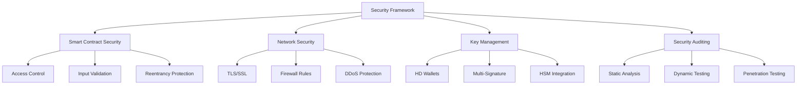

# 安全最佳实践

**学习阶段**: 阶段四 | **难度**: ⭐⭐⭐⭐☆ | **预估时间**: 20-25 小时

---

## 📚 学习目标

完成本章学习后，您将能够：

-   掌握智能合约安全开发的最佳实践
-   实现全面的网络安全防护体系
-   设计安全的密钥管理和存储方案
-   建立完整的安全审计和测试流程
-   应对常见的区块链安全威胁和攻击

---

## 🛡️ 智能合约安全

### 1. 常见安全漏洞分析

#### 重入攻击防护

```go
// 不安全的实现
type UnsafeContract struct {
    balances map[string]sdk.Int
    keeper   bankkeeper.Keeper
}

func (uc *UnsafeContract) Withdraw(ctx sdk.Context, user string, amount sdk.Int) error {
    // 漏洞：在状态更新前进行外部调用
    if err := uc.keeper.SendCoins(ctx, contractAddr, userAddr, amount); err != nil {
        return err
    }

    // 状态更新在外部调用之后，可能被重入攻击
    uc.balances[user] = uc.balances[user].Sub(amount)
    return nil
}

// 安全的实现
type SecureContract struct {
    balances map[string]sdk.Int
    keeper   bankkeeper.Keeper
    mutex    sync.RWMutex
}

func (sc *SecureContract) Withdraw(ctx sdk.Context, user string, amount sdk.Int) error {
    sc.mutex.Lock()
    defer sc.mutex.Unlock()

    // 1. 检查余额
    if sc.balances[user].LT(amount) {
        return errors.New("insufficient balance")
    }

    // 2. 先更新状态（CEI模式：Check-Effects-Interactions）
    sc.balances[user] = sc.balances[user].Sub(amount)

    // 3. 最后进行外部交互
    if err := sc.keeper.SendCoins(ctx, contractAddr, userAddr, amount); err != nil {
        // 回滚状态
        sc.balances[user] = sc.balances[user].Add(amount)
        return err
    }

    return nil
}
```

#### 整数溢出防护

```go
// 安全的数学运算库
type SafeMath struct{}

func (sm SafeMath) Add(a, b sdk.Int) (sdk.Int, error) {
    result := a.Add(b)

    // 检查溢出
    if result.LT(a) || result.LT(b) {
        return sdk.ZeroInt(), errors.New("integer overflow")
    }

    return result, nil
}

func (sm SafeMath) Sub(a, b sdk.Int) (sdk.Int, error) {
    if a.LT(b) {
        return sdk.ZeroInt(), errors.New("integer underflow")
    }

    return a.Sub(b), nil
}

func (sm SafeMath) Mul(a, b sdk.Int) (sdk.Int, error) {
    if a.IsZero() || b.IsZero() {
        return sdk.ZeroInt(), nil
    }

    result := a.Mul(b)

    // 检查溢出：result / a 应该等于 b
    if !result.Quo(a).Equal(b) {
        return sdk.ZeroInt(), errors.New("integer overflow")
    }

    return result, nil
}

// 在合约中使用安全数学运算
type TokenContract struct {
    balances map[string]sdk.Int
    safeMath SafeMath
}

func (tc *TokenContract) Transfer(from, to string, amount sdk.Int) error {
    // 安全的减法操作
    newFromBalance, err := tc.safeMath.Sub(tc.balances[from], amount)
    if err != nil {
        return err
    }

    // 安全的加法操作
    newToBalance, err := tc.safeMath.Add(tc.balances[to], amount)
    if err != nil {
        return err
    }

    // 更新状态
    tc.balances[from] = newFromBalance
    tc.balances[to] = newToBalance

    return nil
}
```

#### 访问控制实现

```go
// 基于角色的访问控制
type AccessControl struct {
    roles     map[string]map[string]bool // role -> address -> hasRole
    roleAdmin map[string]string          // role -> adminRole
}

const (
    DEFAULT_ADMIN_ROLE = "DEFAULT_ADMIN_ROLE"
    MINTER_ROLE       = "MINTER_ROLE"
    PAUSER_ROLE       = "PAUSER_ROLE"
    UPGRADER_ROLE     = "UPGRADER_ROLE"
)

func NewAccessControl(admin string) *AccessControl {
    ac := &AccessControl{
        roles:     make(map[string]map[string]bool),
        roleAdmin: make(map[string]string),
    }

    // 设置默认管理员
    ac.grantRole(DEFAULT_ADMIN_ROLE, admin)
    ac.setRoleAdmin(MINTER_ROLE, DEFAULT_ADMIN_ROLE)
    ac.setRoleAdmin(PAUSER_ROLE, DEFAULT_ADMIN_ROLE)
    ac.setRoleAdmin(UPGRADER_ROLE, DEFAULT_ADMIN_ROLE)

    return ac
}

func (ac *AccessControl) hasRole(role, account string) bool {
    if roleMap, exists := ac.roles[role]; exists {
        return roleMap[account]
    }
    return false
}

func (ac *AccessControl) grantRole(role, account string) {
    if ac.roles[role] == nil {
        ac.roles[role] = make(map[string]bool)
    }
    ac.roles[role][account] = true
}

func (ac *AccessControl) revokeRole(role, account string) {
    if roleMap, exists := ac.roles[role]; exists {
        delete(roleMap, account)
    }
}

func (ac *AccessControl) onlyRole(role, caller string) error {
    if !ac.hasRole(role, caller) {
        return fmt.Errorf("access denied: caller %s lacks role %s", caller, role)
    }
    return nil
}

// 在合约中使用访问控制
type SecureTokenContract struct {
    balances     map[string]sdk.Int
    totalSupply  sdk.Int
    accessControl *AccessControl
    paused       bool
}

func (stc *SecureTokenContract) Mint(ctx sdk.Context, to string, amount sdk.Int) error {
    caller := ctx.GetTxBytes() // 获取调用者地址

    // 检查权限
    if err := stc.accessControl.onlyRole(MINTER_ROLE, string(caller)); err != nil {
        return err
    }

    // 检查是否暂停
    if stc.paused {
        return errors.New("contract is paused")
    }

    // 执行铸币
    stc.balances[to] = stc.balances[to].Add(amount)
    stc.totalSupply = stc.totalSupply.Add(amount)

    return nil
}

func (stc *SecureTokenContract) Pause(ctx sdk.Context) error {
    caller := ctx.GetTxBytes()

    if err := stc.accessControl.onlyRole(PAUSER_ROLE, string(caller)); err != nil {
        return err
    }

    stc.paused = true
    return nil
}
```

### 2. 安全开发模式

#### 防御性编程

```go
// 输入验证和边界检查
type SecureValidator struct{}

func (sv *SecureValidator) ValidateAddress(addr string) error {
    if addr == "" {
        return errors.New("address cannot be empty")
    }

    // 验证地址格式
    if _, err := sdk.AccAddressFromBech32(addr); err != nil {
        return fmt.Errorf("invalid address format: %v", err)
    }

    return nil
}

func (sv *SecureValidator) ValidateAmount(amount sdk.Int) error {
    if amount.IsNil() {
        return errors.New("amount cannot be nil")
    }

    if amount.IsNegative() {
        return errors.New("amount cannot be negative")
    }

    if amount.IsZero() {
        return errors.New("amount cannot be zero")
    }

    // 检查最大值限制
    maxAmount := sdk.NewInt(1000000000000) // 1T tokens
    if amount.GT(maxAmount) {
        return errors.New("amount exceeds maximum limit")
    }

    return nil
}

func (sv *SecureValidator) ValidateTransfer(from, to string, amount sdk.Int) error {
    if err := sv.ValidateAddress(from); err != nil {
        return fmt.Errorf("invalid from address: %v", err)
    }

    if err := sv.ValidateAddress(to); err != nil {
        return fmt.Errorf("invalid to address: %v", err)
    }

    if from == to {
        return errors.New("cannot transfer to self")
    }

    if err := sv.ValidateAmount(amount); err != nil {
        return fmt.Errorf("invalid amount: %v", err)
    }

    return nil
}

// 状态一致性检查
type StateValidator struct {
    totalSupply sdk.Int
    balances    map[string]sdk.Int
}

func (sv *StateValidator) ValidateInvariant() error {
    // 检查总供应量等于所有余额之和
    calculatedTotal := sdk.ZeroInt()
    for _, balance := range sv.balances {
        calculatedTotal = calculatedTotal.Add(balance)
    }

    if !calculatedTotal.Equal(sv.totalSupply) {
        return fmt.Errorf("invariant violation: total supply %s != sum of balances %s",
            sv.totalSupply.String(), calculatedTotal.String())
    }

    return nil
}
```

#### 错误处理和日志记录

```go
// 安全的错误处理
type SecurityLogger struct {
    logger log.Logger
}

func (sl *SecurityLogger) LogSecurityEvent(ctx sdk.Context, event string, details map[string]interface{}) {
    logEntry := map[string]interface{}{
        "timestamp":    ctx.BlockTime(),
        "block_height": ctx.BlockHeight(),
        "event":        event,
        "tx_hash":      fmt.Sprintf("%X", ctx.TxBytes()),
    }

    // 合并详细信息
    for k, v := range details {
        logEntry[k] = v
    }

    sl.logger.Info("Security Event", logEntry)
}

func (sl *SecurityLogger) LogFailedAccess(ctx sdk.Context, caller, resource, action string) {
    sl.LogSecurityEvent(ctx, "ACCESS_DENIED", map[string]interface{}{
        "caller":   caller,
        "resource": resource,
        "action":   action,
    })
}

func (sl *SecurityLogger) LogSuspiciousActivity(ctx sdk.Context, activity string, risk string) {
    sl.LogSecurityEvent(ctx, "SUSPICIOUS_ACTIVITY", map[string]interface{}{
        "activity":   activity,
        "risk_level": risk,
    })
}

// 在合约中集成安全日志
type LoggedContract struct {
    securityLogger *SecurityLogger
    validator      *SecureValidator
}

func (lc *LoggedContract) Transfer(ctx sdk.Context, from, to string, amount sdk.Int) error {
    // 输入验证
    if err := lc.validator.ValidateTransfer(from, to, amount); err != nil {
        lc.securityLogger.LogSecurityEvent(ctx, "INVALID_TRANSFER_ATTEMPT", map[string]interface{}{
            "from":   from,
            "to":     to,
            "amount": amount.String(),
            "error":  err.Error(),
        })
        return err
    }

    // 执行转账逻辑...

    // 记录成功的转账
    lc.securityLogger.LogSecurityEvent(ctx, "TRANSFER_SUCCESS", map[string]interface{}{
        "from":   from,
        "to":     to,
        "amount": amount.String(),
    })

    return nil
}
```

---

## 🔐 网络安全防护

### 1. 节点安全配置

#### 防火墙和网络隔离

```yaml
# 网络安全配置示例
network_security:
    firewall_rules:
        # 只允许必要的端口
        - port: 26656 # P2P端口
          protocol: tcp
          source: trusted_peers
          action: allow

        - port: 26657 # RPC端口
          protocol: tcp
          source: internal_network
          action: allow

        - port: 1317 # REST API端口
          protocol: tcp
          source: api_clients
          action: allow

        # 拒绝所有其他连接
        - port: all
          protocol: all
          source: any
          action: deny

    network_segmentation:
        # 验证者节点网络
        validator_network:
            subnet: 10.0.1.0/24
            access: restricted
            monitoring: enabled

        # 全节点网络
        fullnode_network:
            subnet: 10.0.2.0/24
            access: public
            rate_limiting: enabled

        # 管理网络
        management_network:
            subnet: 10.0.3.0/24
            access: admin_only
            vpn_required: true
```

#### DDoS 防护

```go
// DDoS防护中间件
type DDoSProtection struct {
    rateLimiter map[string]*rate.Limiter
    mutex       sync.RWMutex
    maxRequests int
    window      time.Duration
}

func NewDDoSProtection(maxRequests int, window time.Duration) *DDoSProtection {
    return &DDoSProtection{
        rateLimiter: make(map[string]*rate.Limiter),
        maxRequests: maxRequests,
        window:      window,
    }
}

func (ddos *DDoSProtection) Allow(clientIP string) bool {
    ddos.mutex.Lock()
    defer ddos.mutex.Unlock()

    limiter, exists := ddos.rateLimiter[clientIP]
    if !exists {
        limiter = rate.NewLimiter(rate.Every(ddos.window), ddos.maxRequests)
        ddos.rateLimiter[clientIP] = limiter
    }

    return limiter.Allow()
}

// 在HTTP处理器中使用
func (ddos *DDoSProtection) Middleware(next http.Handler) http.Handler {
    return http.HandlerFunc(func(w http.ResponseWriter, r *http.Request) {
        clientIP := getClientIP(r)

        if !ddos.Allow(clientIP) {
            http.Error(w, "Rate limit exceeded", http.StatusTooManyRequests)
            return
        }

        next.ServeHTTP(w, r)
    })
}

func getClientIP(r *http.Request) string {
    // 检查X-Forwarded-For头
    xff := r.Header.Get("X-Forwarded-For")
    if xff != "" {
        return strings.Split(xff, ",")[0]
    }

    // 检查X-Real-IP头
    xri := r.Header.Get("X-Real-IP")
    if xri != "" {
        return xri
    }

    // 使用RemoteAddr
    ip, _, _ := net.SplitHostPort(r.RemoteAddr)
    return ip
}
```

### 2. 通信安全

#### TLS 配置

```go
// 安全的TLS配置
func CreateSecureTLSConfig() *tls.Config {
    return &tls.Config{
        MinVersion: tls.VersionTLS12,
        MaxVersion: tls.VersionTLS13,

        // 只使用安全的密码套件
        CipherSuites: []uint16{
            tls.TLS_ECDHE_RSA_WITH_AES_256_GCM_SHA384,
            tls.TLS_ECDHE_RSA_WITH_CHACHA20_POLY1305,
            tls.TLS_ECDHE_ECDSA_WITH_AES_256_GCM_SHA384,
            tls.TLS_ECDHE_ECDSA_WITH_CHACHA20_POLY1305,
        },

        // 启用HSTS
        PreferServerCipherSuites: true,

        // 证书验证
        ClientAuth: tls.RequireAndVerifyClientCert,

        // 禁用不安全的重协商
        Renegotiation: tls.RenegotiateNever,
    }
}

// P2P通信加密
type SecureP2PTransport struct {
    privateKey crypto.PrivKey
    tlsConfig  *tls.Config
}

func (spt *SecureP2PTransport) SecureConnection(conn net.Conn, isOutbound bool) (net.Conn, error) {
    var tlsConn *tls.Conn

    if isOutbound {
        tlsConn = tls.Client(conn, spt.tlsConfig)
    } else {
        tlsConn = tls.Server(conn, spt.tlsConfig)
    }

    // 执行TLS握手
    if err := tlsConn.Handshake(); err != nil {
        return nil, fmt.Errorf("TLS handshake failed: %v", err)
    }

    // 验证对等方身份
    if err := spt.verifyPeerIdentity(tlsConn); err != nil {
        return nil, fmt.Errorf("peer identity verification failed: %v", err)
    }

    return tlsConn, nil
}

func (spt *SecureP2PTransport) verifyPeerIdentity(conn *tls.Conn) error {
    state := conn.ConnectionState()

    if len(state.PeerCertificates) == 0 {
        return errors.New("no peer certificates")
    }

    cert := state.PeerCertificates[0]

    // 验证证书有效性
    if time.Now().After(cert.NotAfter) {
        return errors.New("peer certificate expired")
    }

    if time.Now().Before(cert.NotBefore) {
        return errors.New("peer certificate not yet valid")
    }

    // 可以添加更多的身份验证逻辑
    return nil
}
```

---

## 🔑 密钥管理方案

### 1. 分层确定性钱包

#### HD 钱包实现

```go
// HD钱包结构
type HDWallet struct {
    masterKey  *hdkeychain.ExtendedKey
    chainCode  []byte
    depth      uint8
    network    *chaincfg.Params
}

func NewHDWallet(seed []byte, network *chaincfg.Params) (*HDWallet, error) {
    // 从种子生成主密钥
    masterKey, err := hdkeychain.NewMaster(seed, network)
    if err != nil {
        return nil, fmt.Errorf("failed to create master key: %v", err)
    }

    return &HDWallet{
        masterKey: masterKey,
        network:   network,
    }, nil
}

// BIP44路径派生
func (hw *HDWallet) DeriveAccount(coinType, account uint32) (*hdkeychain.ExtendedKey, error) {
    // m/44'/coinType'/account'
    purpose, err := hw.masterKey.Child(hdkeychain.HardenedKeyStart + 44)
    if err != nil {
        return nil, err
    }

    coin, err := purpose.Child(hdkeychain.HardenedKeyStart + coinType)
    if err != nil {
        return nil, err
    }

    accountKey, err := coin.Child(hdkeychain.HardenedKeyStart + account)
    if err != nil {
        return nil, err
    }

    return accountKey, nil
}

func (hw *HDWallet) DeriveAddress(coinType, account, change, index uint32) (string, error) {
    accountKey, err := hw.DeriveAccount(coinType, account)
    if err != nil {
        return "", err
    }

    // m/44'/coinType'/account'/change/index
    changeKey, err := accountKey.Child(change)
    if err != nil {
        return "", err
    }

    addressKey, err := changeKey.Child(index)
    if err != nil {
        return "", err
    }

    // 获取公钥并生成地址
    pubKey, err := addressKey.ECPubKey()
    if err != nil {
        return "", err
    }

    // 转换为Cosmos地址格式
    cosmosAddr := sdk.AccAddress(pubKey.SerializeCompressed())
    return cosmosAddr.String(), nil
}

// 安全的种子生成
func GenerateSecureSeed(entropy int) ([]byte, error) {
    if entropy < 128 || entropy > 256 || entropy%32 != 0 {
        return nil, errors.New("entropy must be 128, 160, 192, 224, or 256 bits")
    }

    entropyBytes := make([]byte, entropy/8)
    if _, err := rand.Read(entropyBytes); err != nil {
        return nil, fmt.Errorf("failed to generate entropy: %v", err)
    }

    // 使用PBKDF2生成种子
    seed := pbkdf2.Key(entropyBytes, []byte("mnemonic"), 2048, 64, sha512.New)
    return seed, nil
}
```

### 2. 多重签名方案

#### 门限签名实现

```go
// 门限签名结构
type ThresholdSignature struct {
    threshold int
    total     int
    shares    map[int]*big.Int
    publicKey *ecdsa.PublicKey
}

func NewThresholdSignature(threshold, total int) (*ThresholdSignature, error) {
    if threshold > total || threshold < 1 {
        return nil, errors.New("invalid threshold parameters")
    }

    return &ThresholdSignature{
        threshold: threshold,
        total:     total,
        shares:    make(map[int]*big.Int),
    }, nil
}

// Shamir秘密共享
func (ts *ThresholdSignature) GenerateShares(secret *big.Int) (map[int]*big.Int, error) {
    // 生成随机系数
    coefficients := make([]*big.Int, ts.threshold-1)
    for i := range coefficients {
        coefficients[i] = new(big.Int).Rand(rand.New(rand.NewSource(time.Now().UnixNano())),
            secp256k1.S256().Params().N)
    }

    shares := make(map[int]*big.Int)

    // 为每个参与者计算份额
    for i := 1; i <= ts.total; i++ {
        x := big.NewInt(int64(i))
        y := new(big.Int).Set(secret)

        // 计算多项式值: f(x) = secret + a1*x + a2*x^2 + ... + a(t-1)*x^(t-1)
        for j, coeff := range coefficients {
            term := new(big.Int).Exp(x, big.NewInt(int64(j+1)), nil)
            term.Mul(term, coeff)
            y.Add(y, term)
        }

        y.Mod(y, secp256k1.S256().Params().N)
        shares[i] = y
    }

    return shares, nil
}

// 拉格朗日插值恢复秘密
func (ts *ThresholdSignature) RecoverSecret(shares map[int]*big.Int) (*big.Int, error) {
    if len(shares) < ts.threshold {
        return nil, fmt.Errorf("insufficient shares: need %d, got %d", ts.threshold, len(shares))
    }

    // 选择前threshold个份额
    selectedShares := make(map[int]*big.Int)
    count := 0
    for i, share := range shares {
        if count >= ts.threshold {
            break
        }
        selectedShares[i] = share
        count++
    }

    secret := big.NewInt(0)
    n := secp256k1.S256().Params().N

    for i, yi := range selectedShares {
        xi := big.NewInt(int64(i))
        numerator := big.NewInt(1)
        denominator := big.NewInt(1)

        // 计算拉格朗日系数
        for j := range selectedShares {
            if i != j {
                xj := big.NewInt(int64(j))

                // numerator *= (0 - xj) = -xj
                numerator.Mul(numerator, new(big.Int).Neg(xj))
                numerator.Mod(numerator, n)

                // denominator *= (xi - xj)
                diff := new(big.Int).Sub(xi, xj)
                denominator.Mul(denominator, diff)
                denominator.Mod(denominator, n)
            }
        }

        // 计算模逆
        denomInv := new(big.Int).ModInverse(denominator, n)
        if denomInv == nil {
            return nil, errors.New("failed to compute modular inverse")
        }

        // lagrange_coeff = numerator * denomInv
        lagrangeCoeff := new(big.Int).Mul(numerator, denomInv)
        lagrangeCoeff.Mod(lagrangeCoeff, n)

        // secret += yi * lagrange_coeff
        term := new(big.Int).Mul(yi, lagrangeCoeff)
        secret.Add(secret, term)
        secret.Mod(secret, n)
    }

    return secret, nil
}

// 多重签名钱包
type MultiSigWallet struct {
    threshold   int
    signers     []sdk.AccAddress
    publicKeys  []crypto.PubKey
    address     sdk.AccAddress
}

func NewMultiSigWallet(threshold int, publicKeys []crypto.PubKey) (*MultiSigWallet, error) {
    if threshold > len(publicKeys) || threshold < 1 {
        return nil, errors.New("invalid threshold")
    }

    signers := make([]sdk.AccAddress, len(publicKeys))
    for i, pubKey := range publicKeys {
        signers[i] = sdk.AccAddress(pubKey.Address())
    }

    // 生成多重签名地址
    multisigPubKey := multisig.NewLegacyAminoPubKey(threshold, publicKeys)
    address := sdk.AccAddress(multisigPubKey.Address())

    return &MultiSigWallet{
        threshold:  threshold,
        signers:    signers,
        publicKeys: publicKeys,
        address:    address,
    }, nil
}

func (msw *MultiSigWallet) CreateTransaction(msgs []sdk.Msg, fee sdk.Coins, memo string) (*tx.TxBuilder, error) {
    txBuilder := tx.NewTxBuilder()

    if err := txBuilder.SetMsgs(msgs...); err != nil {
        return nil, err
    }

    txBuilder.SetFeeAmount(fee)
    txBuilder.SetMemo(memo)

    return &txBuilder, nil
}

func (msw *MultiSigWallet) SignTransaction(txBuilder *tx.TxBuilder, signerIndex int, privateKey crypto.PrivKey) error {
    if signerIndex >= len(msw.signers) {
        return errors.New("invalid signer index")
    }

    // 验证私钥对应的公钥
    if !privateKey.PubKey().Equals(msw.publicKeys[signerIndex]) {
        return errors.New("private key does not match signer")
    }

    // 创建签名数据
    sigData := signing.SingleSignatureData{
        SignMode:  signing.SignMode_SIGN_MODE_LEGACY_AMINO_JSON,
        Signature: nil, // 将在签名时填充
    }

    sig := signing.SignatureV2{
        PubKey:   privateKey.PubKey(),
        Data:     &sigData,
        Sequence: 0, // 需要从链上获取
    }

    return txBuilder.SetSignatures(sig)
}
```

### 3. 硬件安全模块集成

#### HSM 接口实现

```go
// HSM接口定义
type HSMInterface interface {
    GenerateKey(keyType string, keySize int) (string, error)
    Sign(keyID string, data []byte) ([]byte, error)
    Verify(keyID string, data, signature []byte) (bool, error)
    DeleteKey(keyID string) error
    ListKeys() ([]string, error)
}

// PKCS#11 HSM实现
type PKCS11HSM struct {
    ctx     *pkcs11.Ctx
    session pkcs11.SessionHandle
    slot    uint
}

func NewPKCS11HSM(libraryPath string, slot uint, pin string) (*PKCS11HSM, error) {
    p := pkcs11.New(libraryPath)
    if p == nil {
        return nil, errors.New("failed to load PKCS#11 library")
    }

    if err := p.Initialize(); err != nil {
        return nil, fmt.Errorf("failed to initialize PKCS#11: %v", err)
    }

    session, err := p.OpenSession(slot, pkcs11.CKF_SERIAL_SESSION|pkcs11.CKF_RW_SESSION)
    if err != nil {
        return nil, fmt.Errorf("failed to open session: %v", err)
    }

    if err := p.Login(session, pkcs11.CKU_USER, pin); err != nil {
        return nil, fmt.Errorf("failed to login: %v", err)
    }

    return &PKCS11HSM{
        ctx:     p,
        session: session,
        slot:    slot,
    }, nil
}

func (hsm *PKCS11HSM) GenerateKey(keyType string, keySize int) (string, error) {
    var keyTemplate []*pkcs11.Attribute

    switch keyType {
    case "RSA":
        keyTemplate = []*pkcs11.Attribute{
            pkcs11.NewAttribute(pkcs11.CKA_CLASS, pkcs11.CKO_PRIVATE_KEY),
            pkcs11.NewAttribute(pkcs11.CKA_KEY_TYPE, pkcs11.CKK_RSA),
            pkcs11.NewAttribute(pkcs11.CKA_MODULUS_BITS, keySize),
            pkcs11.NewAttribute(pkcs11.CKA_SIGN, true),
            pkcs11.NewAttribute(pkcs11.CKA_TOKEN, true),
            pkcs11.NewAttribute(pkcs11.CKA_PRIVATE, true),
            pkcs11.NewAttribute(pkcs11.CKA_SENSITIVE, true),
        }
    case "ECDSA":
        keyTemplate = []*pkcs11.Attribute{
            pkcs11.NewAttribute(pkcs11.CKA_CLASS, pkcs11.CKO_PRIVATE_KEY),
            pkcs11.NewAttribute(pkcs11.CKA_KEY_TYPE, pkcs11.CKK_ECDSA),
            pkcs11.NewAttribute(pkcs11.CKA_EC_PARAMS, []byte{0x06, 0x08, 0x2a, 0x86, 0x48, 0xce, 0x3d, 0x03, 0x01, 0x07}), // secp256r1
            pkcs11.NewAttribute(pkcs11.CKA_SIGN, true),
            pkcs11.NewAttribute(pkcs11.CKA_TOKEN, true),
            pkcs11.NewAttribute(pkcs11.CKA_PRIVATE, true),
            pkcs11.NewAttribute(pkcs11.CKA_SENSITIVE, true),
        }
    default:
        return "", fmt.Errorf("unsupported key type: %s", keyType)
    }

    // 生成密钥对
    pubKey, privKey, err := hsm.ctx.GenerateKeyPair(hsm.session,
        []*pkcs11.Mechanism{pkcs11.NewMechanism(pkcs11.CKM_RSA_PKCS_KEY_PAIR_GEN, nil)},
        keyTemplate, keyTemplate)
    if err != nil {
        return "", fmt.Errorf("failed to generate key pair: %v", err)
    }

    // 返回私钥句柄作为密钥ID
    return fmt.Sprintf("%d", privKey), nil
}

func (hsm *PKCS11HSM) Sign(keyID string, data []byte) ([]byte, error) {
    keyHandle, err := strconv.ParseUint(keyID, 10, 64)
    if err != nil {
        return nil, fmt.Errorf("invalid key ID: %v", err)
    }

    // 初始化签名操作
    mechanism := []*pkcs11.Mechanism{pkcs11.NewMechanism(pkcs11.CKM_SHA256_RSA_PKCS, nil)}
    if err := hsm.ctx.SignInit(hsm.session, mechanism, pkcs11.ObjectHandle(keyHandle)); err != nil {
        return nil, fmt.Errorf("failed to initialize signing: %v", err)
    }

    // 执行签名
    signature, err := hsm.ctx.Sign(hsm.session, data)
    if err != nil {
        return nil, fmt.Errorf("failed to sign: %v", err)
    }

    return signature, nil
}

// HSM密钥管理器
type HSMKeyManager struct {
    hsm    HSMInterface
    keyMap map[string]string // 逻辑密钥名 -> HSM密钥ID
}

func NewHSMKeyManager(hsm HSMInterface) *HSMKeyManager {
    return &HSMKeyManager{
        hsm:    hsm,
        keyMap: make(map[string]string),
    }
}

func (hkm *HSMKeyManager) CreateValidatorKey(validatorName string) error {
    keyID, err := hkm.hsm.GenerateKey("ECDSA", 256)
    if err != nil {
        return fmt.Errorf("failed to generate validator key: %v", err)
    }

    hkm.keyMap[fmt.Sprintf("validator_%s", validatorName)] = keyID
    return nil
}

func (hkm *HSMKeyManager) SignValidatorMessage(validatorName string, message []byte) ([]byte, error) {
    keyName := fmt.Sprintf("validator_%s", validatorName)
    keyID, exists := hkm.keyMap[keyName]
    if !exists {
        return nil, fmt.Errorf("validator key not found: %s", validatorName)
    }

    return hkm.hsm.Sign(keyID, message)
}
```

---

## 🔍 安全审计流程

### 1. 自动化安全扫描

#### 静态代码分析

```go
// 安全规则检查器
type SecurityRuleChecker struct {
    rules []SecurityRule
}

type SecurityRule struct {
    ID          string
    Name        string
    Description string
    Severity    Severity
    Pattern     *regexp.Regexp
    Check       func(code string) []SecurityIssue
}

type Severity int

const (
    INFO Severity = iota
    LOW
    MEDIUM
    HIGH
    CRITICAL
)

type SecurityIssue struct {
    RuleID      string
    Severity    Severity
    Message     string
    File        string
    Line        int
    Column      int
    Suggestion  string
}

func NewSecurityRuleChecker() *SecurityRuleChecker {
    checker := &SecurityRuleChecker{}
    checker.loadDefaultRules()
    return checker
}

func (src *SecurityRuleChecker) loadDefaultRules() {
    src.rules = []SecurityRule{
        {
            ID:          "HARDCODED_SECRET",
            Name:        "Hardcoded Secret",
            Description: "Detects hardcoded secrets in source code",
            Severity:    CRITICAL,
            Pattern:     regexp.MustCompile(`(?i)(password|secret|key|token)\s*[:=]\s*["'][^"']{8,}["']`),
            Check:       src.checkHardcodedSecrets,
        },
        {
            ID:          "SQL_INJECTION",
            Name:        "SQL Injection",
            Description: "Detects potential SQL injection vulnerabilities",
            Severity:    HIGH,
            Pattern:     regexp.MustCompile(`(?i)query\s*\+\s*.*\+`),
            Check:       src.checkSQLInjection,
        },
        {
            ID:          "WEAK_CRYPTO",
            Name:        "Weak Cryptography",
            Description: "Detects use of weak cryptographic algorithms",
            Severity:    MEDIUM,
            Pattern:     regexp.MustCompile(`(?i)(md5|sha1|des|rc4)`),
            Check:       src.checkWeakCrypto,
        },
        {
            ID:          "UNSAFE_RANDOM",
            Name:        "Unsafe Random",
            Description: "Detects use of unsafe random number generation",
            Severity:    MEDIUM,
            Pattern:     regexp.MustCompile(`math/rand\.`),
            Check:       src.checkUnsafeRandom,
        },
    }
}

func (src *SecurityRuleChecker) ScanFile(filePath string) ([]SecurityIssue, error) {
    content, err := ioutil.ReadFile(filePath)
    if err != nil {
        return nil, fmt.Errorf("failed to read file: %v", err)
    }

    var issues []SecurityIssue

    for _, rule := range src.rules {
        ruleIssues := rule.Check(string(content))
        for _, issue := range ruleIssues {
            issue.File = filePath
            issues = append(issues, issue)
        }
    }

    return issues, nil
}

func (src *SecurityRuleChecker) checkHardcodedSecrets(code string) []SecurityIssue {
    var issues []SecurityIssue
    lines := strings.Split(code, "\n")

    for i, line := range lines {
        if src.rules[0].Pattern.MatchString(line) {
            issues = append(issues, SecurityIssue{
                RuleID:     "HARDCODED_SECRET",
                Severity:   CRITICAL,
                Message:    "Hardcoded secret detected",
                Line:       i + 1,
                Suggestion: "Use environment variables or secure configuration management",
            })
        }
    }

    return issues
}

func (src *SecurityRuleChecker) checkSQLInjection(code string) []SecurityIssue {
    var issues []SecurityIssue
    lines := strings.Split(code, "\n")

    for i, line := range lines {
        if src.rules[1].Pattern.MatchString(line) {
            issues = append(issues, SecurityIssue{
                RuleID:     "SQL_INJECTION",
                Severity:   HIGH,
                Message:    "Potential SQL injection vulnerability",
                Line:       i + 1,
                Suggestion: "Use parameterized queries or prepared statements",
            })
        }
    }

    return issues
}

func (src *SecurityRuleChecker) checkWeakCrypto(code string) []SecurityIssue {
    var issues []SecurityIssue
    lines := strings.Split(code, "\n")

    for i, line := range lines {
        if src.rules[2].Pattern.MatchString(line) {
            issues = append(issues, SecurityIssue{
                RuleID:     "WEAK_CRYPTO",
                Severity:   MEDIUM,
                Message:    "Weak cryptographic algorithm detected",
                Line:       i + 1,
                Suggestion: "Use SHA-256, SHA-3, or other secure hash functions",
            })
        }
    }

    return issues
}

func (src *SecurityRuleChecker) checkUnsafeRandom(code string) []SecurityIssue {
    var issues []SecurityIssue
    lines := strings.Split(code, "\n")

    for i, line := range lines {
        if src.rules[3].Pattern.MatchString(line) {
            issues = append(issues, SecurityIssue{
                RuleID:     "UNSAFE_RANDOM",
                Severity:   MEDIUM,
                Message:    "Unsafe random number generation",
                Line:       i + 1,
                Suggestion: "Use crypto/rand for cryptographic purposes",
            })
        }
    }

    return issues
}
```

### 2. 渗透测试框架

#### 自动化渗透测试

```go
// 渗透测试框架
type PenetrationTestFramework struct {
    testSuites []TestSuite
    reporter   TestReporter
    config     TestConfig
}

type TestSuite struct {
    Name        string
    Description string
    Tests       []SecurityTest
    Severity    Severity
}

type SecurityTest struct {
    ID          string
    Name        string
    Description string
    Execute     func(target TestTarget) TestResult
    Cleanup     func(target TestTarget) error
}

type TestTarget struct {
    URL         string
    Credentials map[string]string
    Headers     map[string]string
    Timeout     time.Duration
}

type TestResult struct {
    TestID      string
    Passed      bool
    Severity    Severity
    Message     string
    Evidence    []string
    Remediation string
}

// 网络安全测试套件
func (ptf *PenetrationTestFramework) CreateNetworkTestSuite() TestSuite {
    return TestSuite{
        Name:        "Network Security Tests",
        Description: "Tests for network-level security vulnerabilities",
        Severity:    HIGH,
        Tests: []SecurityTest{
            {
                ID:          "NET_001",
                Name:        "Port Scan Test",
                Description: "Scans for open ports and services",
                Execute:     ptf.executePortScan,
            },
            {
                ID:          "NET_002",
                Name:        "TLS Configuration Test",
                Description: "Tests TLS/SSL configuration security",
                Execute:     ptf.executeTLSTest,
            },
            {
                ID:          "NET_003",
                Name:        "DDoS Resilience Test",
                Description: "Tests resistance to DDoS attacks",
                Execute:     ptf.executeDDoSTest,
            },
        },
    }
}

func (ptf *PenetrationTestFramework) executePortScan(target TestTarget) TestResult {
    result := TestResult{
        TestID: "NET_001",
        Passed: true,
    }

    // 扫描常见端口
    commonPorts := []int{22, 80, 443, 8080, 26656, 26657, 1317}
    openPorts := []int{}

    for _, port := range commonPorts {
        conn, err := net.DialTimeout("tcp",
            fmt.Sprintf("%s:%d", target.URL, port),
            target.Timeout)
        if err == nil {
            conn.Close()
            openPorts = append(openPorts, port)
        }
    }

    // 分析结果
    if len(openPorts) > 5 {
        result.Passed = false
        result.Severity = MEDIUM
        result.Message = fmt.Sprintf("Too many open ports detected: %v", openPorts)
        result.Remediation = "Close unnecessary ports and use firewall rules"
    } else {
        result.Message = fmt.Sprintf("Port scan completed. Open ports: %v", openPorts)
    }

    result.Evidence = []string{fmt.Sprintf("Open ports: %v", openPorts)}
    return result
}

func (ptf *PenetrationTestFramework) executeTLSTest(target TestTarget) TestResult {
    result := TestResult{
        TestID: "NET_002",
        Passed: true,
    }

    // 测试TLS配置
    conn, err := tls.Dial("tcp", target.URL+":443", &tls.Config{
        InsecureSkipVerify: true,
    })
    if err != nil {
        result.Passed = false
        result.Severity = HIGH
        result.Message = "TLS connection failed"
        result.Evidence = []string{err.Error()}
        return result
    }
    defer conn.Close()

    state := conn.ConnectionState()

    // 检查TLS版本
    if state.Version < tls.VersionTLS12 {
        result.Passed = false
        result.Severity = HIGH
        result.Message = "Weak TLS version detected"
        result.Remediation = "Upgrade to TLS 1.2 or higher"
    }

    // 检查密码套件
    weakCiphers := []uint16{
        tls.TLS_RSA_WITH_RC4_128_SHA,
        tls.TLS_RSA_WITH_3DES_EDE_CBC_SHA,
    }

    for _, weakCipher := range weakCiphers {
        if state.CipherSuite == weakCipher {
            result.Passed = false
            result.Severity = MEDIUM
            result.Message = "Weak cipher suite detected"
            result.Remediation = "Configure strong cipher suites only"
            break
        }
    }

    result.Evidence = []string{
        fmt.Sprintf("TLS Version: %x", state.Version),
        fmt.Sprintf("Cipher Suite: %x", state.CipherSuite),
    }

    return result
}

// API安全测试套件
func (ptf *PenetrationTestFramework) CreateAPITestSuite() TestSuite {
    return TestSuite{
        Name:        "API Security Tests",
        Description: "Tests for API-level security vulnerabilities",
        Severity:    HIGH,
        Tests: []SecurityTest{
            {
                ID:          "API_001",
                Name:        "Authentication Bypass Test",
                Description: "Tests for authentication bypass vulnerabilities",
                Execute:     ptf.executeAuthBypassTest,
            },
            {
                ID:          "API_002",
                Name:        "Rate Limiting Test",
                Description: "Tests API rate limiting effectiveness",
                Execute:     ptf.executeRateLimitTest,
            },
            {
                ID:          "API_003",
                Name:        "Input Validation Test",
                Description: "Tests input validation and sanitization",
                Execute:     ptf.executeInputValidationTest,
            },
        },
    }
}

func (ptf *PenetrationTestFramework) executeAuthBypassTest(target TestTarget) TestResult {
    result := TestResult{
        TestID: "API_001",
        Passed: true,
    }

    // 测试无认证访问
    client := &http.Client{Timeout: target.Timeout}

    protectedEndpoints := []string{
        "/admin",
        "/api/v1/admin",
        "/api/v1/users",
        "/api/v1/transactions",
    }

    for _, endpoint := range protectedEndpoints {
        req, _ := http.NewRequest("GET", target.URL+endpoint, nil)

        resp, err := client.Do(req)
        if err != nil {
            continue
        }
        resp.Body.Close()

        // 如果返回200而不是401/403，可能存在认证绕过
        if resp.StatusCode == 200 {
            result.Passed = false
            result.Severity = CRITICAL
            result.Message = fmt.Sprintf("Authentication bypass detected on %s", endpoint)
            result.Evidence = append(result.Evidence,
                fmt.Sprintf("Endpoint %s returned %d without authentication", endpoint, resp.StatusCode))
            result.Remediation = "Implement proper authentication checks on all protected endpoints"
        }
    }

    return result
}

func (ptf *PenetrationTestFramework) executeRateLimitTest(target TestTarget) TestResult {
    result := TestResult{
        TestID: "API_002",
        Passed: true,
    }

    client := &http.Client{Timeout: target.Timeout}
    endpoint := target.URL + "/api/v1/status"

    // 发送大量请求测试速率限制
    requestCount := 100
    successCount := 0

    for i := 0; i < requestCount; i++ {
        req, _ := http.NewRequest("GET", endpoint, nil)
        resp, err := client.Do(req)
        if err != nil {
            continue
        }
        resp.Body.Close()

        if resp.StatusCode == 200 {
            successCount++
        }
    }

    // 如果成功率过高，可能缺乏速率限制
    successRate := float64(successCount) / float64(requestCount)
    if successRate > 0.8 {
        result.Passed = false
        result.Severity = MEDIUM
        result.Message = fmt.Sprintf("Insufficient rate limiting. Success rate: %.2f", successRate)
        result.Evidence = []string{
            fmt.Sprintf("Sent %d requests, %d succeeded", requestCount, successCount),
        }
        result.Remediation = "Implement proper rate limiting to prevent abuse"
    }

    return result
}
```

---

## 💻 实践练习

### 练习 1: 智能合约安全审计

#### 环境准备

```bash
# 创建安全审计环境
mkdir security-audit && cd security-audit

# 安装安全工具
go install github.com/securecodewarrior/gosec/v2/cmd/gosec@latest
go install honnef.co/go/tools/cmd/staticcheck@latest

# 创建测试合约
mkdir contracts && cd contracts
```

#### 漏洞合约示例

```go
// vulnerable_contract.go - 包含多种安全漏洞的示例合约
package contracts

import (
    "errors"
    sdk "github.com/cosmos/cosmos-sdk/types"
)

// 漏洞1: 重入攻击风险
type VulnerableContract struct {
    balances map[string]sdk.Int
    keeper   BankKeeper
}

func (vc *VulnerableContract) UnsafeWithdraw(ctx sdk.Context, user string, amount sdk.Int) error {
    // 漏洞：外部调用在状态更新之前
    if err := vc.keeper.SendCoins(ctx, contractAddr, userAddr, amount); err != nil {
        return err
    }

    // 状态更新在外部调用之后，存在重入风险
    vc.balances[user] = vc.balances[user].Sub(amount)
    return nil
}

// 漏洞2: 整数溢出
func (vc *VulnerableContract) UnsafeAdd(a, b sdk.Int) sdk.Int {
    // 漏洞：没有溢出检查
    return a.Add(b)
}

// 漏洞3: 访问控制缺失
func (vc *VulnerableContract) UnsafeMint(to string, amount sdk.Int) error {
    // 漏洞：没有权限检查，任何人都可以铸币
    vc.balances[to] = vc.balances[to].Add(amount)
    return nil
}

// 漏洞4: 硬编码密钥
const ADMIN_KEY = "hardcoded_secret_key_12345" // 漏洞：硬编码密钥

// 漏洞5: 弱随机数生成
func (vc *VulnerableContract) UnsafeRandom() int {
    // 漏洞：使用不安全的随机数生成
    return rand.Intn(1000000)
}
```

#### 安全审计脚本

```bash
#!/bin/bash
# security_audit.sh

echo "=== 开始安全审计 ==="

# 1. 静态代码分析
echo "1. 运行静态代码分析..."
gosec ./...
staticcheck ./...

# 2. 依赖漏洞扫描
echo "2. 扫描依赖漏洞..."
go list -json -m all | nancy sleuth

# 3. 代码质量检查
echo "3. 代码质量检查..."
golangci-lint run

# 4. 自定义安全规则检查
echo "4. 自定义安全规则检查..."
go run security_checker.go

echo "=== 审计完成 ==="
```

### 练习 2: 网络安全配置

#### 防火墙配置

```bash
#!/bin/bash
# firewall_setup.sh

# 清除现有规则
iptables -F
iptables -X
iptables -t nat -F
iptables -t nat -X

# 设置默认策略
iptables -P INPUT DROP
iptables -P FORWARD DROP
iptables -P OUTPUT ACCEPT

# 允许本地回环
iptables -A INPUT -i lo -j ACCEPT
iptables -A OUTPUT -o lo -j ACCEPT

# 允许已建立的连接
iptables -A INPUT -m state --state ESTABLISHED,RELATED -j ACCEPT

# 允许SSH（限制IP范围）
iptables -A INPUT -p tcp --dport 22 -s 192.168.1.0/24 -j ACCEPT

# 允许P2P端口（限制连接数）
iptables -A INPUT -p tcp --dport 26656 -m connlimit --connlimit-above 50 -j DROP
iptables -A INPUT -p tcp --dport 26656 -j ACCEPT

# 允许RPC端口（仅内网）
iptables -A INPUT -p tcp --dport 26657 -s 10.0.0.0/8 -j ACCEPT
iptables -A INPUT -p tcp --dport 26657 -s 172.16.0.0/12 -j ACCEPT
iptables -A INPUT -p tcp --dport 26657 -s 192.168.0.0/16 -j ACCEPT

# 允许REST API（限制速率）
iptables -A INPUT -p tcp --dport 1317 -m limit --limit 25/min --limit-burst 100 -j ACCEPT

# DDoS防护
iptables -A INPUT -p tcp --dport 80 -m limit --limit 25/minute --limit-burst 100 -j ACCEPT
iptables -A INPUT -p tcp --dport 443 -m limit --limit 25/minute --limit-burst 100 -j ACCEPT

# 记录被丢弃的包
iptables -A INPUT -m limit --limit 5/min -j LOG --log-prefix "iptables denied: " --log-level 7

# 保存规则
iptables-save > /etc/iptables/rules.v4

echo "防火墙配置完成"
```

### 练习 3: 密钥管理实现

#### 安全密钥存储

```go
// secure_keystore.go
package main

import (
    "crypto/aes"
    "crypto/cipher"
    "crypto/rand"
    "crypto/scrypt"
    "encoding/json"
    "errors"
    "io"
    "os"
)

type SecureKeystore struct {
    keys map[string]EncryptedKey
    masterPassword []byte
}

type EncryptedKey struct {
    Address    string `json:"address"`
    Crypto     Crypto `json:"crypto"`
    ID         string `json:"id"`
    Version    int    `json:"version"`
}

type Crypto struct {
    Cipher       string       `json:"cipher"`
    CipherText   string       `json:"ciphertext"`
    CipherParams CipherParams `json:"cipherparams"`
    KDF          string       `json:"kdf"`
    KDFParams    KDFParams    `json:"kdfparams"`
    MAC          string       `json:"mac"`
}

type CipherParams struct {
    IV string `json:"iv"`
}

type KDFParams struct {
    DKLen int    `json:"dklen"`
    N     int    `json:"n"`
    P     int    `json:"p"`
    R     int    `json:"r"`
    Salt  string `json:"salt"`
}

func NewSecureKeystore(password string) *SecureKeystore {
    return &SecureKeystore{
        keys: make(map[string]EncryptedKey),
        masterPassword: []byte(password),
    }
}

func (sk *SecureKeystore) StoreKey(address string, privateKey []byte) error {
    // 生成随机盐
    salt := make([]byte, 32)
    if _, err := io.ReadFull(rand.Reader, salt); err != nil {
        return err
    }

    // 使用scrypt派生密钥
    derivedKey, err := scrypt.Key(sk.masterPassword, salt, 32768, 8, 1, 32)
    if err != nil {
        return err
    }

    // 生成随机IV
    iv := make([]byte, 16)
    if _, err := io.ReadFull(rand.Reader, iv); err != nil {
        return err
    }

    // AES加密
    block, err := aes.NewCipher(derivedKey[:16])
    if err != nil {
        return err
    }

    ciphertext := make([]byte, len(privateKey))
    stream := cipher.NewCTR(block, iv)
    stream.XORKeyStream(ciphertext, privateKey)

    // 计算MAC
    mac := calculateMAC(derivedKey[16:], ciphertext)

    // 创建加密密钥结构
    encryptedKey := EncryptedKey{
        Address: address,
        Crypto: Crypto{
            Cipher:     "aes-128-ctr",
            CipherText: hex.EncodeToString(ciphertext),
            CipherParams: CipherParams{
                IV: hex.EncodeToString(iv),
            },
            KDF: "scrypt",
            KDFParams: KDFParams{
                DKLen: 32,
                N:     32768,
                P:     1,
                R:     8,
                Salt:  hex.EncodeToString(salt),
            },
            MAC: hex.EncodeToString(mac),
        },
        ID:      generateUUID(),
        Version: 3,
    }

    sk.keys[address] = encryptedKey
    return nil
}

func (sk *SecureKeystore) LoadKey(address string) ([]byte, error) {
    encryptedKey, exists := sk.keys[address]
    if !exists {
        return nil, errors.New("key not found")
    }

    // 解码参数
    salt, _ := hex.DecodeString(encryptedKey.Crypto.KDFParams.Salt)
    iv, _ := hex.DecodeString(encryptedKey.Crypto.CipherParams.IV)
    ciphertext, _ := hex.DecodeString(encryptedKey.Crypto.CipherText)
    mac, _ := hex.DecodeString(encryptedKey.Crypto.MAC)

    // 派生密钥
    derivedKey, err := scrypt.Key(sk.masterPassword, salt,
        encryptedKey.Crypto.KDFParams.N,
        encryptedKey.Crypto.KDFParams.R,
        encryptedKey.Crypto.KDFParams.P,
        encryptedKey.Crypto.KDFParams.DKLen)
    if err != nil {
        return nil, err
    }

    // 验证MAC
    expectedMAC := calculateMAC(derivedKey[16:], ciphertext)
    if !hmac.Equal(mac, expectedMAC) {
        return nil, errors.New("invalid password or corrupted key")
    }

    // 解密
    block, err := aes.NewCipher(derivedKey[:16])
    if err != nil {
        return nil, err
    }

    plaintext := make([]byte, len(ciphertext))
    stream := cipher.NewCTR(block, iv)
    stream.XORKeyStream(plaintext, ciphertext)

    return plaintext, nil
}

func (sk *SecureKeystore) SaveToFile(filename string) error {
    data, err := json.MarshalIndent(sk.keys, "", "  ")
    if err != nil {
        return err
    }

    return os.WriteFile(filename, data, 0600)
}

func (sk *SecureKeystore) LoadFromFile(filename string) error {
    data, err := os.ReadFile(filename)
    if err != nil {
        return err
    }

    return json.Unmarshal(data, &sk.keys)
}
```

---

## 🔧 开发工具和资源

### 安全开发工具

#### 静态分析工具

```yaml
静态分析工具:
    Go语言:
        - gosec: Go安全检查器
        - staticcheck: 静态代码分析
        - golangci-lint: 代码质量检查
        - nancy: 依赖漏洞扫描

    通用工具:
        - SonarQube: 代码质量和安全分析
        - Checkmarx: 静态应用安全测试
        - Veracode: 应用安全平台
        - Snyk: 开源漏洞扫描
```

#### 动态测试工具

```yaml
动态测试工具:
    网络安全:
        - Nmap: 网络扫描和服务发现
        - Nessus: 漏洞扫描器
        - OpenVAS: 开源漏洞评估
        - Wireshark: 网络协议分析

    Web安全:
        - OWASP ZAP: Web应用安全扫描
        - Burp Suite: Web安全测试平台
        - Nikto: Web服务器扫描
        - SQLMap: SQL注入测试工具

    区块链专用:
        - MythX: 智能合约安全分析
        - Slither: Solidity静态分析
        - Echidna: 智能合约模糊测试
        - Manticore: 符号执行工具
```

### 参考资源

#### 安全标准和框架

-   [OWASP Top 10](https://owasp.org/www-project-top-ten/)
-   [NIST 网络安全框架](https://www.nist.gov/cyberframework)
-   [ISO 27001 信息安全管理](https://www.iso.org/isoiec-27001-information-security.html)
-   [CIS 控制措施](https://www.cisecurity.org/controls/)

#### 区块链安全指南

-   [ConsenSys 智能合约最佳实践](https://consensys.github.io/smart-contract-best-practices/)
-   [OWASP 区块链安全指南](https://github.com/OWASP/www-project-blockchain-security-guideline)
-   [Trail of Bits 安全指南](https://github.com/trailofbits/publications)

---

## 📈 进阶学习

### 深入研究方向

#### 1. 高级密码学应用

-   **后量子密码学**: 抗量子计算攻击的密码算法
-   **同态加密**: 支持密文计算的加密方案
-   **多方安全计算**: 隐私保护的协作计算

#### 2. 零信任安全架构

-   **身份验证**: 持续身份验证和授权
-   **微分段**: 网络和应用层的精细化访问控制
-   **行为分析**: 基于 AI 的异常行为检测

#### 3. 安全运营自动化

-   **SOAR 平台**: 安全编排、自动化和响应
-   **威胁情报**: 自动化威胁情报收集和分析
-   **事件响应**: 自动化安全事件处理流程

### 相关技术栈



### 实际项目应用

#### 主要安全项目案例

-   **OpenZeppelin**: 智能合约安全库和工具
-   **MakerDAO**: 去中心化金融安全实践
-   **Compound**: 借贷协议安全设计
-   **Uniswap**: DEX 安全架构
-   **Chainlink**: 预言机网络安全

---

## ✅ 学习检查点

### 理论掌握检查

**基础概念** (必须掌握):

-   [ ] 理解常见智能合约安全漏洞和防护方法
-   [ ] 掌握网络安全配置和防护策略
-   [ ] 了解密钥管理的最佳实践
-   [ ] 理解安全审计的流程和方法

**深入理解** (建议掌握):

-   [ ] 分析高级安全威胁和攻击向量
-   [ ] 理解零信任安全架构的设计原理
-   [ ] 掌握自动化安全测试的实现方法
-   [ ] 了解后量子密码学的发展趋势

### 实践能力验证

**基础实践** (必须完成):

-   [ ] 实现安全的智能合约开发模式
-   [ ] 配置完整的网络安全防护体系
-   [ ] 开发安全的密钥管理系统
-   [ ] 建立自动化安全审计流程

**进阶实践** (建议完成):

-   [ ] 开发自定义安全扫描工具
-   [ ] 实现零信任网络架构
-   [ ] 构建安全运营中心(SOC)
-   [ ] 集成威胁情报和自动响应

### 项目应用评估

**应用设计** (综合能力):

-   [ ] 设计全面的区块链安全架构
-   [ ] 制定安全开发生命周期(SDLC)流程
-   [ ] 评估和缓解项目安全风险
-   [ ] 建立持续安全监控和改进机制

---

## 📚 参考资源

### 技术文档

-   [Cosmos SDK 安全指南](https://docs.cosmos.network/main/building-modules/security)
-   [Go 安全编程指南](https://github.com/Checkmarx/Go-SCP)
-   [密码学工程实践](https://www.crypto101.io/)
-   [网络安全架构设计](https://www.sans.org/white-papers/)

### 安全工具

-   [OWASP 安全工具](https://owasp.org/www-community/Free_for_Open_Source_Application_Security_Tools)
-   [NIST 网络安全工具](https://www.nist.gov/itl/applied-cybersecurity/nice/resources/online-learning-content)
-   [区块链安全工具集](https://github.com/crytic/awesome-ethereum-security)

### 开源项目

-   [OpenZeppelin Contracts](https://github.com/OpenZeppelin/openzeppelin-contracts) - 安全智能合约库
-   [Slither](https://github.com/crytic/slither) - Solidity 静态分析器
-   [MythX](https://mythx.io/) - 智能合约安全分析平台
-   [Securify](https://github.com/eth-sri/securify2) - 智能合约验证工具

### 社区资源

-   [区块链安全联盟](https://blockchainsecurityalliance.org/)
-   [以太坊安全社区](https://ethereum-security.github.io/)
-   [Cosmos 安全工作组](https://github.com/cosmos/security)

---

**下一章**: [DeFi 协议集成](./11-DeFi-Protocol-Integration.md)
