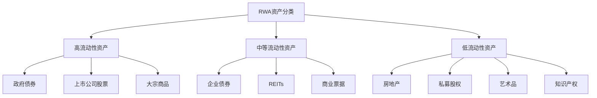

# RWA资产上链技术

**学习阶段**: 阶段五 | **难度**: ⭐⭐⭐⭐⭐ | **预估时间**: 25-30小时

---

## 📚 学习目标

完成本章学习后，您将能够：
- 深入理解RWA市场现状和发展趋势
- 掌握资产代币化的完整技术流程
- 设计合规的资产上链解决方案
- 实现资产估值和定价机制
- 构建流动性解决方案和交易系统

---

## 🌍 RWA市场分析

### 1. RWA市场概览

**Real World Assets (RWA)** 是指现实世界中具有内在价值的有形和无形资产，通过区块链技术进行代币化。

#### 市场规模和潜力

```python
# RWA市场规模分析
class RWAMarketAnalysis:
    def __init__(self):
        # 全球资产规模（万亿美元）
        self.global_assets = {
            'real_estate': 280,      # 房地产
            'bonds': 130,            # 债券
            'commodities': 20,       # 大宗商品
            'private_equity': 7,     # 私募股权
            'art_collectibles': 2,   # 艺术品收藏品
            'infrastructure': 15,    # 基础设施
            'intellectual_property': 5  # 知识产权
        }
        
        # 当前代币化比例（%）
        self.tokenization_rates = {
            'real_estate': 0.01,
            'bonds': 0.05,
            'commodities': 0.02,
            'private_equity': 0.001,
            'art_collectibles': 0.1,
            'infrastructure': 0.001,
            'intellectual_property': 0.001
        }
    
    def calculate_current_tokenized_value(self):
        """计算当前代币化价值"""
        total_tokenized = 0
        breakdown = {}
        
        for asset_type, total_value in self.global_assets.items():
            tokenization_rate = self.tokenization_rates[asset_type]
            tokenized_value = total_value * tokenization_rate
            total_tokenized += tokenized_value
            breakdown[asset_type] = tokenized_value
        
        return total_tokenized, breakdown
    
    def project_future_tokenization(self, years, annual_growth_rate=0.5):
        """预测未来代币化规模"""
        projections = {}
        
        for year in range(1, years + 1):
            year_tokenized = {}
            total_year = 0
            
            for asset_type, current_rate in self.tokenization_rates.items():
                # 假设代币化率每年增长50%
                future_rate = min(current_rate * (1 + annual_growth_rate) ** year, 0.1)  # 最高10%
                asset_value = self.global_assets[asset_type]
                tokenized_value = asset_value * future_rate
                
                year_tokenized[asset_type] = tokenized_value
                total_year += tokenized_value
            
            projections[f'year_{year}'] = {
                'total': total_year,
                'breakdown': year_tokenized
            }
        
        return projections

# 市场分析示例
market_analysis = RWAMarketAnalysis()

current_total, current_breakdown = market_analysis.calculate_current_tokenized_value()
print(f"当前RWA代币化总价值: ${current_total:.2f}万亿")
print("\n各类资产代币化价值:")
for asset_type, value in current_breakdown.items():
    print(f"  {asset_type}: ${value:.3f}万亿")

# 5年预测
projections = market_analysis.project_future_tokenization(5)
print(f"\n5年后预测总价值: ${projections['year_5']['total']:.2f}万亿")
```

### 2. RWA分类和特征

#### 2.1 按流动性分类



#### 2.2 按资产类型分类

```python
class RWAAssetClassification:
    def __init__(self):
        self.asset_categories = {
            'tangible_assets': {
                'real_estate': {
                    'residential': ['single_family', 'multi_family', 'condos'],
                    'commercial': ['office', 'retail', 'industrial', 'hospitality'],
                    'land': ['agricultural', 'development', 'recreational']
                },
                'commodities': {
                    'precious_metals': ['gold', 'silver', 'platinum'],
                    'energy': ['oil', 'natural_gas', 'coal'],
                    'agricultural': ['wheat', 'corn', 'soybeans', 'coffee']
                },
                'infrastructure': {
                    'transportation': ['airports', 'ports', 'railways'],
                    'utilities': ['power_plants', 'water_systems', 'telecom'],
                    'social': ['hospitals', 'schools', 'prisons']
                }
            },
            'intangible_assets': {
                'financial_instruments': {
                    'debt': ['government_bonds', 'corporate_bonds', 'loans'],
                    'equity': ['private_equity', 'venture_capital'],
                    'derivatives': ['futures', 'options', 'swaps']
                },
                'intellectual_property': {
                    'patents': ['technology', 'pharmaceutical', 'industrial'],
                    'copyrights': ['music', 'literature', 'software'],
                    'trademarks': ['brands', 'logos', 'domain_names']
                },
                'collectibles': {
                    'art': ['paintings', 'sculptures', 'photography'],
                    'luxury': ['watches', 'jewelry', 'cars'],
                    'sports': ['cards', 'memorabilia', 'equipment']
                }
            }
        }
    
    def get_asset_characteristics(self, asset_type):
        """获取资产特征"""
        characteristics = {
            'real_estate': {
                'liquidity': 'low',
                'volatility': 'medium',
                'divisibility': 'high_potential',
                'storage_cost': 'high',
                'regulatory_complexity': 'high'
            },
            'commodities': {
                'liquidity': 'high',
                'volatility': 'high',
                'divisibility': 'high',
                'storage_cost': 'medium',
                'regulatory_complexity': 'medium'
            },
            'bonds': {
                'liquidity': 'medium_to_high',
                'volatility': 'low_to_medium',
                'divisibility': 'high',
                'storage_cost': 'low',
                'regulatory_complexity': 'high'
            },
            'art': {
                'liquidity': 'very_low',
                'volatility': 'very_high',
                'divisibility': 'low',
                'storage_cost': 'high',
                'regulatory_complexity': 'medium'
            }
        }
        
        return characteristics.get(asset_type, {})

# 资产分类示例
classifier = RWAAssetClassification()
real_estate_chars = classifier.get_asset_characteristics('real_estate')
print("房地产资产特征:")
for char, value in real_estate_chars.items():
    print(f"  {char}: {value}")
```

---

## 🔧 资产代币化技术流程

### 1. 代币化架构设计

```python
from dataclasses import dataclass
from typing import List, Dict, Optional
from enum import Enum
import uuid
from datetime import datetime

class AssetStatus(Enum):
    PENDING_VERIFICATION = "pending_verification"
    VERIFIED = "verified"
    TOKENIZED = "tokenized"
    TRADING = "trading"
    REDEEMED = "redeemed"
    SUSPENDED = "suspended"

class TokenStandard(Enum):
    ERC20 = "erc20"
    ERC721 = "erc721"
    ERC1155 = "erc1155"
    COSMOS_SDK = "cosmos_sdk"

@dataclass
class AssetMetadata:
    """资产元数据"""
    asset_id: str
    name: str
    description: str
    asset_type: str
    location: Optional[str]
    legal_documents: List[str]
    appraisal_reports: List[str]
    certifications: List[str]
    images: List[str]
    created_at: datetime
    updated_at: datetime

@dataclass
class TokenizationConfig:
    """代币化配置"""
    total_supply: int
    decimals: int
    token_standard: TokenStandard
    minimum_investment: float
    maximum_investment: Optional[float]
    lock_period: Optional[int]  # 锁定期（天）
    dividend_frequency: Optional[str]  # 分红频率

class RWATokenizationEngine:
    def __init__(self):
        self.assets = {}
        self.tokens = {}
        self.verification_providers = []
        self.custody_providers = []
    
    def register_asset(self, metadata: AssetMetadata, valuation: float) -> str:
        """注册资产"""
        asset_id = str(uuid.uuid4())
        
        asset_record = {
            'id': asset_id,
            'metadata': metadata,
            'valuation': valuation,
            'status': AssetStatus.PENDING_VERIFICATION,
            'verification_history': [],
            'tokenization_config': None,
            'token_contract': None
        }
        
        self.assets[asset_id] = asset_record
        return asset_id
    
    def verify_asset(self, asset_id: str, verifier: str, verification_result: Dict) -> bool:
        """资产验证"""
        if asset_id not in self.assets:
            raise ValueError(f"Asset {asset_id} not found")
        
        asset = self.assets[asset_id]
        
        verification_record = {
            'verifier': verifier,
            'timestamp': datetime.now(),
            'result': verification_result,
            'status': 'approved' if verification_result.get('approved', False) else 'rejected'
        }
        
        asset['verification_history'].append(verification_record)
        
        # 检查是否所有必要的验证都通过
        if self._all_verifications_passed(asset):
            asset['status'] = AssetStatus.VERIFIED
            return True
        
        return False
    
    def tokenize_asset(self, asset_id: str, config: TokenizationConfig) -> str:
        """资产代币化"""
        if asset_id not in self.assets:
            raise ValueError(f"Asset {asset_id} not found")
        
        asset = self.assets[asset_id]
        
        if asset['status'] != AssetStatus.VERIFIED:
            raise ValueError("Asset must be verified before tokenization")
        
        # 创建代币合约
        token_contract = self._deploy_token_contract(asset, config)
        
        # 更新资产记录
        asset['tokenization_config'] = config
        asset['token_contract'] = token_contract
        asset['status'] = AssetStatus.TOKENIZED
        
        # 记录代币信息
        token_id = f"token_{asset_id}"
        self.tokens[token_id] = {
            'asset_id': asset_id,
            'contract_address': token_contract['address'],
            'total_supply': config.total_supply,
            'circulating_supply': 0,
            'holders': {},
            'trading_history': []
        }
        
        return token_id
    
    def _all_verifications_passed(self, asset: Dict) -> bool:
        """检查所有验证是否通过"""
        required_verifications = ['legal', 'financial', 'technical']
        
        approved_verifications = set()
        for verification in asset['verification_history']:
            if verification['status'] == 'approved':
                # 假设验证结果包含验证类型
                verification_type = verification['result'].get('type')
                if verification_type:
                    approved_verifications.add(verification_type)
        
        return all(req in approved_verifications for req in required_verifications)
    
    def _deploy_token_contract(self, asset: Dict, config: TokenizationConfig) -> Dict:
        """部署代币合约（模拟）"""
        # 在实际实现中，这里会调用区块链部署合约
        contract_address = f"0x{uuid.uuid4().hex[:40]}"
        
        return {
            'address': contract_address,
            'standard': config.token_standard.value,
            'deployment_tx': f"0x{uuid.uuid4().hex}",
            'deployed_at': datetime.now()
        }

# 使用示例
tokenization_engine = RWATokenizationEngine()

# 1. 注册房地产资产
property_metadata = AssetMetadata(
    asset_id="",
    name="Manhattan Office Building",
    description="Premium office building in Manhattan financial district",
    asset_type="commercial_real_estate",
    location="New York, NY",
    legal_documents=["deed.pdf", "title_insurance.pdf"],
    appraisal_reports=["appraisal_2024.pdf"],
    certifications=["energy_efficiency.pdf"],
    images=["exterior.jpg", "interior.jpg"],
    created_at=datetime.now(),
    updated_at=datetime.now()
)

asset_id = tokenization_engine.register_asset(property_metadata, 50_000_000)  # 5000万美元估值
print(f"资产已注册: {asset_id}")

# 2. 资产验证
legal_verification = tokenization_engine.verify_asset(
    asset_id, 
    "Legal Verification Corp", 
    {"approved": True, "type": "legal", "score": 95}
)

financial_verification = tokenization_engine.verify_asset(
    asset_id,
    "Financial Audit LLC",
    {"approved": True, "type": "financial", "score": 92}
)

technical_verification = tokenization_engine.verify_asset(
    asset_id,
    "Technical Assessment Inc",
    {"approved": True, "type": "technical", "score": 88}
)

print(f"验证状态: {tokenization_engine.assets[asset_id]['status']}")

# 3. 代币化配置
tokenization_config = TokenizationConfig(
    total_supply=50_000_000,  # 5000万代币，每代币代表1美元价值
    decimals=18,
    token_standard=TokenStandard.ERC20,
    minimum_investment=1000,  # 最小投资1000美元
    maximum_investment=None,
    lock_period=90,  # 90天锁定期
    dividend_frequency="quarterly"
)

# 4. 执行代币化
token_id = tokenization_engine.tokenize_asset(asset_id, tokenization_config)
print(f"代币化完成: {token_id}")
print(f"合约地址: {tokenization_engine.tokens[token_id]['contract_address']}")
```

### 2. 智能合约实现

#### 2.1 RWA代币合约

```solidity
// SPDX-License-Identifier: MIT
pragma solidity ^0.8.19;

import "@openzeppelin/contracts/token/ERC20/ERC20.sol";
import "@openzeppelin/contracts/access/AccessControl.sol";
import "@openzeppelin/contracts/security/Pausable.sol";
import "@openzeppelin/contracts/security/ReentrancyGuard.sol";

/**
 * @title RWAToken
 * @dev RWA资产代币化合约
 */
contract RWAToken is ERC20, AccessControl, Pausable, ReentrancyGuard {
    bytes32 public constant MINTER_ROLE = keccak256("MINTER_ROLE");
    bytes32 public constant BURNER_ROLE = keccak256("BURNER_ROLE");
    bytes32 public constant PAUSER_ROLE = keccak256("PAUSER_ROLE");
    bytes32 public constant COMPLIANCE_ROLE = keccak256("COMPLIANCE_ROLE");
    
    // 资产信息
    struct AssetInfo {
        string assetId;           // 资产ID
        string name;              // 资产名称
        string description;       // 资产描述
        string assetType;         // 资产类型
        uint256 totalValue;       // 资产总价值（美元）
        string[] documents;       // 法律文件IPFS哈希
        bool isActive;            // 是否活跃
    }
    
    // 分红信息
    struct DividendInfo {
        uint256 totalAmount;      // 分红总额
        uint256 recordDate;       // 记录日期
        uint256 paymentDate;      // 支付日期
        uint256 perTokenAmount;   // 每代币分红金额
        bool isPaid;              // 是否已支付
    }
    
    AssetInfo public assetInfo;
    DividendInfo[] public dividends;
    
    // 用户分红记录
    mapping(address => mapping(uint256 => bool)) public dividendClaimed;
    
    // 合规白名单
    mapping(address => bool) public whitelisted;
    
    // 锁定期设置
    uint256 public lockPeriod;
    mapping(address => uint256) public lockEndTime;
    
    // 事件
    event AssetInfoUpdated(string assetId, string name, uint256 totalValue);
    event DividendDeclared(uint256 indexed dividendId, uint256 totalAmount, uint256 perTokenAmount);
    event DividendClaimed(address indexed holder, uint256 indexed dividendId, uint256 amount);
    event AddressWhitelisted(address indexed account);
    event AddressRemovedFromWhitelist(address indexed account);
    event TokensLocked(address indexed account, uint256 endTime);
    
    constructor(
        string memory name,
        string memory symbol,
        AssetInfo memory _assetInfo,
        uint256 _lockPeriod
    ) ERC20(name, symbol) {
        _grantRole(DEFAULT_ADMIN_ROLE, msg.sender);
        _grantRole(MINTER_ROLE, msg.sender);
        _grantRole(BURNER_ROLE, msg.sender);
        _grantRole(PAUSER_ROLE, msg.sender);
        _grantRole(COMPLIANCE_ROLE, msg.sender);
        
        assetInfo = _assetInfo;
        lockPeriod = _lockPeriod;
    }
    
    /**
     * @dev 铸造代币（仅限MINTER_ROLE）
     */
    function mint(address to, uint256 amount) public onlyRole(MINTER_ROLE) {
        require(whitelisted[to], "接收者未通过KYC验证");
        _mint(to, amount);
        
        // 设置锁定期
        if (lockPeriod > 0) {
            lockEndTime[to] = block.timestamp + lockPeriod;
            emit TokensLocked(to, lockEndTime[to]);
        }
    }
    
    /**
     * @dev 销毁代币（仅限BURNER_ROLE）
     */
    function burn(uint256 amount) public onlyRole(BURNER_ROLE) {
        _burn(msg.sender, amount);
    }
    
    /**
     * @dev 从指定地址销毁代币
     */
    function burnFrom(address account, uint256 amount) public onlyRole(BURNER_ROLE) {
        _burn(account, amount);
    }
    
    /**
     * @dev 暂停合约（仅限PAUSER_ROLE）
     */
    function pause() public onlyRole(PAUSER_ROLE) {
        _pause();
    }
    
    /**
     * @dev 恢复合约（仅限PAUSER_ROLE）
     */
    function unpause() public onlyRole(PAUSER_ROLE) {
        _unpause();
    }
    
    /**
     * @dev 添加到白名单（仅限COMPLIANCE_ROLE）
     */
    function addToWhitelist(address account) public onlyRole(COMPLIANCE_ROLE) {
        whitelisted[account] = true;
        emit AddressWhitelisted(account);
    }
    
    /**
     * @dev 从白名单移除（仅限COMPLIANCE_ROLE）
     */
    function removeFromWhitelist(address account) public onlyRole(COMPLIANCE_ROLE) {
        whitelisted[account] = false;
        emit AddressRemovedFromWhitelist(account);
    }
    
    /**
     * @dev 批量添加到白名单
     */
    function batchAddToWhitelist(address[] calldata accounts) external onlyRole(COMPLIANCE_ROLE) {
        for (uint256 i = 0; i < accounts.length; i++) {
            whitelisted[accounts[i]] = true;
            emit AddressWhitelisted(accounts[i]);
        }
    }
    
    /**
     * @dev 声明分红（仅限管理员）
     */
    function declareDividend(
        uint256 totalAmount,
        uint256 recordDate,
        uint256 paymentDate
    ) external onlyRole(DEFAULT_ADMIN_ROLE) {
        require(totalAmount > 0, "分红金额必须大于0");
        require(paymentDate > recordDate, "支付日期必须晚于记录日期");
        require(paymentDate > block.timestamp, "支付日期必须在未来");
        
        uint256 totalSupplyAtRecord = totalSupply();
        require(totalSupplyAtRecord > 0, "总供应量不能为0");
        
        uint256 perTokenAmount = totalAmount / totalSupplyAtRecord;
        
        dividends.push(DividendInfo({
            totalAmount: totalAmount,
            recordDate: recordDate,
            paymentDate: paymentDate,
            perTokenAmount: perTokenAmount,
            isPaid: false
        }));
        
        uint256 dividendId = dividends.length - 1;
        emit DividendDeclared(dividendId, totalAmount, perTokenAmount);
    }
    
    /**
     * @dev 领取分红
     */
    function claimDividend(uint256 dividendId) external nonReentrant {
        require(dividendId < dividends.length, "无效的分红ID");
        require(!dividendClaimed[msg.sender][dividendId], "分红已领取");
        
        DividendInfo storage dividend = dividends[dividendId];
        require(block.timestamp >= dividend.paymentDate, "分红支付日期未到");
        require(!dividend.isPaid, "分红已全部支付");
        
        uint256 holderBalance = balanceOf(msg.sender);
        require(holderBalance > 0, "持有量为0");
        
        uint256 dividendAmount = holderBalance * dividend.perTokenAmount;
        require(dividendAmount > 0, "分红金额为0");
        
        dividendClaimed[msg.sender][dividendId] = true;
        
        // 转账分红（这里假设使用ETH，实际可能是稳定币）
        payable(msg.sender).transfer(dividendAmount);
        
        emit DividendClaimed(msg.sender, dividendId, dividendAmount);
    }
    
    /**
     * @dev 更新资产信息（仅限管理员）
     */
    function updateAssetInfo(
        string memory name,
        string memory description,
        uint256 totalValue,
        string[] memory documents
    ) external onlyRole(DEFAULT_ADMIN_ROLE) {
        assetInfo.name = name;
        assetInfo.description = description;
        assetInfo.totalValue = totalValue;
        assetInfo.documents = documents;
        
        emit AssetInfoUpdated(assetInfo.assetId, name, totalValue);
    }
    
    /**
     * @dev 重写转账函数，添加合规检查
     */
    function _beforeTokenTransfer(
        address from,
        address to,
        uint256 amount
    ) internal override whenNotPaused {
        super._beforeTokenTransfer(from, to, amount);
        
        // 检查锁定期
        if (from != address(0)) {  // 不是铸造
            require(block.timestamp >= lockEndTime[from], "代币仍在锁定期内");
        }
        
        // 检查接收者白名单（除了销毁）
        if (to != address(0)) {  // 不是销毁
            require(whitelisted[to], "接收者未通过KYC验证");
        }
    }
    
    /**
     * @dev 获取分红数量
     */
    function getDividendCount() external view returns (uint256) {
        return dividends.length;
    }
    
    /**
     * @dev 获取用户可领取的分红
     */
    function getClaimableDividends(address holder) external view returns (uint256[] memory) {
        uint256 balance = balanceOf(holder);
        if (balance == 0) {
            return new uint256[](0);
        }
        
        uint256 count = 0;
        for (uint256 i = 0; i < dividends.length; i++) {
            if (!dividendClaimed[holder][i] && 
                block.timestamp >= dividends[i].paymentDate &&
                !dividends[i].isPaid) {
                count++;
            }
        }
        
        uint256[] memory claimable = new uint256[](count);
        uint256 index = 0;
        
        for (uint256 i = 0; i < dividends.length; i++) {
            if (!dividendClaimed[holder][i] && 
                block.timestamp >= dividends[i].paymentDate &&
                !dividends[i].isPaid) {
                claimable[index] = i;
                index++;
            }
        }
        
        return claimable;
    }
    
    /**
     * @dev 紧急提取（仅限管理员）
     */
    function emergencyWithdraw() external onlyRole(DEFAULT_ADMIN_ROLE) {
        payable(msg.sender).transfer(address(this).balance);
    }
    
    /**
     * @dev 接收ETH用于分红支付
     */
    receive() external payable {}
}
```

#### 2.2 资产管理合约

```solidity
// SPDX-License-Identifier: MIT
pragma solidity ^0.8.19;

import "./RWAToken.sol";
import "@openzeppelin/contracts/access/Ownable.sol";
import "@openzeppelin/contracts/security/ReentrancyGuard.sol";

/**
 * @title RWAAssetManager
 * @dev RWA资产管理合约
 */
contract RWAAssetManager is Ownable, ReentrancyGuard {
    struct AssetRecord {
        address tokenContract;    // 代币合约地址
        string assetId;          // 资产ID
        uint256 totalValue;      // 资产总价值
        uint256 tokenSupply;     // 代币总供应量
        address custodian;       // 托管方
        bool isActive;           // 是否活跃
        uint256 createdAt;       // 创建时间
    }
    
    // 资产记录
    mapping(string => AssetRecord) public assets;
    string[] public assetIds;
    
    // 授权的验证方
    mapping(address => bool) public authorizedVerifiers;
    
    // 授权的托管方
    mapping(address => bool) public authorizedCustodians;
    
    // 事件
    event AssetTokenized(
        string indexed assetId,
        address indexed tokenContract,
        uint256 totalValue,
        uint256 tokenSupply
    );
    event AssetUpdated(string indexed assetId, uint256 newValue);
    event VerifierAuthorized(address indexed verifier);
    event CustodianAuthorized(address indexed custodian);
    
    /**
     * @dev 授权验证方
     */
    function authorizeVerifier(address verifier) external onlyOwner {
        authorizedVerifiers[verifier] = true;
        emit VerifierAuthorized(verifier);
    }
    
    /**
     * @dev 授权托管方
     */
    function authorizeCustodian(address custodian) external onlyOwner {
        authorizedCustodians[custodian] = true;
        emit CustodianAuthorized(custodian);
    }
    
    /**
     * @dev 代币化资产
     */
    function tokenizeAsset(
        string memory assetId,
        string memory tokenName,
        string memory tokenSymbol,
        RWAToken.AssetInfo memory assetInfo,
        uint256 tokenSupply,
        uint256 lockPeriod,
        address custodian
    ) external onlyOwner returns (address) {
        require(bytes(assetId).length > 0, "资产ID不能为空");
        require(assets[assetId].tokenContract == address(0), "资产已代币化");
        require(authorizedCustodians[custodian], "托管方未授权");
        
        // 部署RWA代币合约
        RWAToken token = new RWAToken(
            tokenName,
            tokenSymbol,
            assetInfo,
            lockPeriod
        );
        
        // 铸造代币到合约地址
        token.mint(address(this), tokenSupply);
        
        // 记录资产信息
        assets[assetId] = AssetRecord({
            tokenContract: address(token),
            assetId: assetId,
            totalValue: assetInfo.totalValue,
            tokenSupply: tokenSupply,
            custodian: custodian,
            isActive: true,
            createdAt: block.timestamp
        });
        
        assetIds.push(assetId);
        
        emit AssetTokenized(assetId, address(token), assetInfo.totalValue, tokenSupply);
        
        return address(token);
    }
    
    /**
     * @dev 更新资产价值
     */
    function updateAssetValue(
        string memory assetId,
        uint256 newValue
    ) external {
        require(authorizedVerifiers[msg.sender], "未授权的验证方");
        require(assets[assetId].isActive, "资产不活跃");
        
        assets[assetId].totalValue = newValue;
        
        emit AssetUpdated(assetId, newValue);
    }
    
    /**
     * @dev 获取资产数量
     */
    function getAssetCount() external view returns (uint256) {
        return assetIds.length;
    }
    
    /**
     * @dev 获取所有资产ID
     */
    function getAllAssetIds() external view returns (string[] memory) {
        return assetIds;
    }
}
```

---

## 💡 实践练习

### 练习1: 实现完整的房地产代币化流程

```python
class RealEstateTokenization:
    def __init__(self):
        # TODO: 实现房地产代币化系统
        # 1. 资产评估和验证
        # 2. 法律合规检查
        # 3. 代币合约部署
        # 4. 投资者KYC/AML
        # 5. 代币分发和交易
        pass
    
    def evaluate_property(self, property_data):
        """房地产评估"""
        # TODO: 实现评估算法
        # 考虑位置、面积、市场价格、租金收益等因素
        pass
    
    def verify_legal_documents(self, documents):
        """法律文件验证"""
        # TODO: 实现文件验证流程
        # 检查产权证、抵押情况、法律纠纷等
        pass
    
    def deploy_property_token(self, property_info, tokenization_config):
        """部署房地产代币"""
        # TODO: 实现代币合约部署
        # 包括分红机制、治理权利、赎回条款等
        pass

# 要求：
# 1. 设计完整的评估模型
# 2. 实现合规检查流程
# 3. 创建灵活的代币化配置
# 4. 支持多种投资模式
```

### 练习2: 构建资产估值系统

```python
class AssetValuationSystem:
    def __init__(self):
        # TODO: 实现多资产类型估值系统
        # 支持房地产、债券、商品、艺术品等
        pass
    
    def dcf_valuation(self, cash_flows, discount_rate):
        """现金流折现估值"""
        # TODO: 实现DCF模型
        pass
    
    def comparable_analysis(self, asset, comparables):
        """可比分析估值"""
        # TODO: 实现可比分析
        pass
    
    def market_approach(self, asset, market_data):
        """市场法估值"""
        # TODO: 实现市场法估值
        pass

# 要求：
# 1. 实现多种估值方法
# 2. 支持实时价格更新
# 3. 考虑市场波动和风险
# 4. 提供估值报告和分析
```

---

## 📖 扩展阅读

### 行业报告
- [RWA Market Report 2024](https://www.mckinsey.com/industries/financial-services/our-insights/tokenization-a-digital-asset-déjà-vu-or-paradigm-shift)
- [Tokenization of Real World Assets](https://www2.deloitte.com/content/dam/Deloitte/lu/Documents/financial-services/lu-tokenization-of-assets-disrupting-financial-industry.pdf)
- [BCG Digital Assets Report](https://www.bcg.com/publications/2021/how-to-realize-blockchain-benefits-with-tokenization)

### 技术标准
- [ERC-3643: T-REX Token Standard](https://eips.ethereum.org/EIPS/eip-3643)
- [ERC-1400: Security Token Standard](https://eips.ethereum.org/EIPS/eip-1400)
- [ISO 20022: Financial Services Messages](https://www.iso20022.org/)

### 监管指南
- [SEC Digital Asset Guidelines](https://www.sec.gov/corpfin/framework-investment-contract-analysis-digital-assets)
- [EU MiCA Regulation](https://eur-lex.europa.eu/legal-content/EN/TXT/?uri=CELEX%3A32023R1114)
- [Singapore MAS Token Guidelines](https://www.mas.gov.sg/regulation/guidance/guidance-on-digital-token-offerings)

---

## ✅ 学习检查点

完成本章学习后，请确认您能够：

- [ ] 分析RWA市场机会和挑战
- [ ] 设计完整的资产代币化流程
- [ ] 实现合规的智能合约系统
- [ ] 构建资产估值和定价机制
- [ ] 开发流动性解决方案
- [ ] 处理监管合规要求

### 综合项目

开发一个完整的RWA代币化平台：

**功能要求**:
1. **多资产支持**: 房地产、债券、商品、艺术品
2. **完整流程**: 评估、验证、代币化、交易、赎回
3. **合规框架**: KYC/AML、监管报告、税务处理
4. **估值系统**: 多种估值方法、实时更新
5. **交易系统**: AMM、订单簿、流动性激励

**技术要求**:
1. 基于Cosmos SDK或Ethereum
2. 模块化架构设计
3. 完整的测试覆盖
4. 安全审计通过
5. 用户友好的界面

---

**下一章**: [DeFi协议集成](./11-DeFi-Protocol-Integration.md)

*学习如何将RWA与DeFi生态系统集成！*
