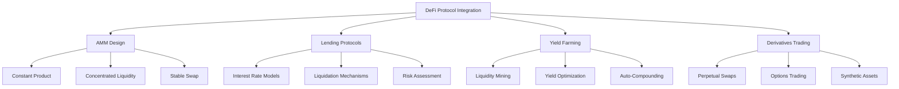

# DeFi 协议集成

**学习阶段**: 阶段五 | **难度**: ⭐⭐⭐⭐⭐ | **预估时间**: 25-30 小时

---

## 📚 学习目标

完成本章学习后，您将能够：

-   深入理解 DeFi 协议的核心机制和设计原理
-   掌握 AMM（自动做市商）的实现和优化方法
-   实现完整的流动性挖矿和收益农场系统
-   开发去中心化借贷协议和风险管理机制
-   构建衍生品交易平台和复杂金融产品
-   集成多种 DeFi 协议实现组合性创新

---

## 🔄 自动做市商(AMM)设计

### 1. 恒定乘积做市商

#### 核心 AMM 实现

```go
// AMM核心结构
type AMMPool struct {
    TokenA      string
    TokenB      string
    ReserveA    sdk.Int
    ReserveB    sdk.Int
    TotalShares sdk.Int
    FeeRate     sdk.Dec
    K           sdk.Int // 恒定乘积 K = ReserveA * ReserveB
}

type AMMKeeper struct {
    cdc        codec.BinaryCodec
    storeKey   sdk.StoreKey
    bankKeeper types.BankKeeper
    pools      map[string]*AMMPool
}

// 创建流动性池
func (ak *AMMKeeper) CreatePool(
    ctx sdk.Context,
    creator sdk.AccAddress,
    tokenA, tokenB string,
    amountA, amountB sdk.Int,
) (*AMMPool, error) {
    // 1. 验证输入
    if amountA.IsZero() || amountB.IsZero() {
        return nil, errors.New("initial amounts must be positive")
    }

    // 2. 创建池ID
    poolID := generatePoolID(tokenA, tokenB)
    if _, exists := ak.pools[poolID]; exists {
        return nil, errors.New("pool already exists")
    }

    // 3. 计算初始流动性份额
    initialShares := calculateInitialShares(amountA, amountB)

    // 4. 创建池
    pool := &AMMPool{
        TokenA:      tokenA,
        TokenB:      tokenB,
        ReserveA:    amountA,
        ReserveB:    amountB,
        TotalShares: initialShares,
        FeeRate:     sdk.NewDecWithPrec(3, 3), // 0.3%
        K:           amountA.Mul(amountB),
    }

    // 5. 转移代币到池
    if err := ak.transferToPool(ctx, creator, tokenA, amountA); err != nil {
        return nil, err
    }
    if err := ak.transferToPool(ctx, creator, tokenB, amountB); err != nil {
        return nil, err
    }

    // 6. 铸造LP代币给创建者
    if err := ak.mintLPTokens(ctx, creator, poolID, initialShares); err != nil {
        return nil, err
    }

    ak.pools[poolID] = pool
    return pool, nil
}

// 添加流动性
func (ak *AMMKeeper) AddLiquidity(
    ctx sdk.Context,
    provider sdk.AccAddress,
    poolID string,
    amountA, amountB sdk.Int,
) (sdk.Int, error) {
    pool, exists := ak.pools[poolID]
    if !exists {
        return sdk.ZeroInt(), errors.New("pool not found")
    }

    // 1. 计算最优比例
    optimalAmountB := amountA.Mul(pool.ReserveB).Quo(pool.ReserveA)
    optimalAmountA := amountB.Mul(pool.ReserveA).Quo(pool.ReserveB)

    var finalAmountA, finalAmountB sdk.Int

    if optimalAmountB.LTE(amountB) {
        finalAmountA = amountA
        finalAmountB = optimalAmountB
    } else {
        finalAmountA = optimalAmountA
        finalAmountB = amountB
    }

    // 2. 计算LP代币数量
    shareA := finalAmountA.Mul(pool.TotalShares).Quo(pool.ReserveA)
    shareB := finalAmountB.Mul(pool.TotalShares).Quo(pool.ReserveB)

    // 取较小值确保不超过池子比例
    shares := sdk.MinInt(shareA, shareB)

    // 3. 更新池状态
    pool.ReserveA = pool.ReserveA.Add(finalAmountA)
    pool.ReserveB = pool.ReserveB.Add(finalAmountB)
    pool.TotalShares = pool.TotalShares.Add(shares)
    pool.K = pool.ReserveA.Mul(pool.ReserveB)

    // 4. 转移代币
    if err := ak.transferToPool(ctx, provider, pool.TokenA, finalAmountA); err != nil {
        return sdk.ZeroInt(), err
    }
    if err := ak.transferToPool(ctx, provider, pool.TokenB, finalAmountB); err != nil {
        return sdk.ZeroInt(), err
    }

    // 5. 铸造LP代币
    if err := ak.mintLPTokens(ctx, provider, poolID, shares); err != nil {
        return sdk.ZeroInt(), err
    }

    return shares, nil
}

// 交换代币
func (ak *AMMKeeper) SwapTokens(
    ctx sdk.Context,
    trader sdk.AccAddress,
    poolID string,
    tokenIn string,
    amountIn sdk.Int,
    minAmountOut sdk.Int,
) (sdk.Int, error) {
    pool, exists := ak.pools[poolID]
    if !exists {
        return sdk.ZeroInt(), errors.New("pool not found")
    }

    var reserveIn, reserveOut sdk.Int
    var tokenOut string

    if tokenIn == pool.TokenA {
        reserveIn = pool.ReserveA
        reserveOut = pool.ReserveB
        tokenOut = pool.TokenB
    } else if tokenIn == pool.TokenB {
        reserveIn = pool.ReserveB
        reserveOut = pool.ReserveA
        tokenOut = pool.TokenA
    } else {
        return sdk.ZeroInt(), errors.New("invalid token")
    }

    // 1. 计算输出数量（扣除手续费）
    amountInWithFee := amountIn.Mul(sdk.NewInt(1000).Sub(pool.FeeRate.MulInt64(1000).TruncateInt()))
    amountOut := amountInWithFee.Mul(reserveOut).Quo(
        reserveIn.Mul(sdk.NewInt(1000)).Add(amountInWithFee))

    // 2. 检查滑点保护
    if amountOut.LT(minAmountOut) {
        return sdk.ZeroInt(), errors.New("insufficient output amount")
    }

    // 3. 更新池状态
    if tokenIn == pool.TokenA {
        pool.ReserveA = pool.ReserveA.Add(amountIn)
        pool.ReserveB = pool.ReserveB.Sub(amountOut)
    } else {
        pool.ReserveB = pool.ReserveB.Add(amountIn)
        pool.ReserveA = pool.ReserveA.Sub(amountOut)
    }

    // 4. 验证恒定乘积（考虑手续费）
    newK := pool.ReserveA.Mul(pool.ReserveB)
    if newK.LT(pool.K) {
        return sdk.ZeroInt(), errors.New("K invariant violation")
    }
    pool.K = newK

    // 5. 执行代币转移
    if err := ak.transferToPool(ctx, trader, tokenIn, amountIn); err != nil {
        return sdk.ZeroInt(), err
    }
    if err := ak.transferFromPool(ctx, trader, tokenOut, amountOut); err != nil {
        return sdk.ZeroInt(), err
    }

    return amountOut, nil
}
```

### 2. 高级 AMM 机制

#### 集中流动性 AMM

```go
// Uniswap V3风格的集中流动性
type ConcentratedLiquidityPool struct {
    TokenA      string
    TokenB      string
    Fee         sdk.Dec
    TickSpacing int32

    // 当前价格和tick
    SqrtPriceX96 *big.Int
    Tick         int32

    // 全局流动性
    Liquidity *big.Int

    // Tick数据
    Ticks map[int32]*TickInfo

    // 位置数据
    Positions map[string]*Position
}

type TickInfo struct {
    LiquidityGross *big.Int // 总流动性
    LiquidityNet   *big.Int // 净流动性变化
    FeeGrowthOutside0X128 *big.Int // 手续费增长
    FeeGrowthOutside1X128 *big.Int
}

type Position struct {
    Owner           sdk.AccAddress
    TickLower       int32
    TickUpper       int32
    Liquidity       *big.Int
    FeeGrowthInside0LastX128 *big.Int
    FeeGrowthInside1LastX128 *big.Int
    TokensOwed0     *big.Int
    TokensOwed1     *big.Int
}

// 添加集中流动性
func (clp *ConcentratedLiquidityPool) AddLiquidity(
    ctx sdk.Context,
    owner sdk.AccAddress,
    tickLower, tickUpper int32,
    amount0Desired, amount1Desired *big.Int,
) (*Position, *big.Int, *big.Int, error) {
    // 1. 验证tick范围
    if tickLower >= tickUpper {
        return nil, nil, nil, errors.New("invalid tick range")
    }

    // 2. 计算流动性数量
    liquidity := calculateLiquidityForAmounts(
        clp.SqrtPriceX96,
        tickToSqrtPrice(tickLower),
        tickToSqrtPrice(tickUpper),
        amount0Desired,
        amount1Desired,
    )

    // 3. 计算实际需要的代币数量
    amount0, amount1 := calculateAmountsForLiquidity(
        clp.SqrtPriceX96,
        tickToSqrtPrice(tickLower),
        tickToSqrtPrice(tickUpper),
        liquidity,
    )

    // 4. 更新tick数据
    if err := clp.updateTick(tickLower, liquidity, false); err != nil {
        return nil, nil, nil, err
    }
    if err := clp.updateTick(tickUpper, liquidity, true); err != nil {
        return nil, nil, nil, err
    }

    // 5. 如果当前价格在范围内，更新全局流动性
    if clp.Tick >= tickLower && clp.Tick < tickUpper {
        clp.Liquidity = new(big.Int).Add(clp.Liquidity, liquidity)
    }

    // 6. 创建或更新位置
    positionKey := getPositionKey(owner, tickLower, tickUpper)
    position, exists := clp.Positions[positionKey]
    if !exists {
        position = &Position{
            Owner:     owner,
            TickLower: tickLower,
            TickUpper: tickUpper,
            Liquidity: big.NewInt(0),
        }
        clp.Positions[positionKey] = position
    }

    // 7. 更新位置流动性
    position.Liquidity = new(big.Int).Add(position.Liquidity, liquidity)

    return position, amount0, amount1, nil
}

// 集中流动性交换
func (clp *ConcentratedLiquidityPool) Swap(
    zeroForOne bool,
    amountSpecified *big.Int,
    sqrtPriceLimitX96 *big.Int,
) (*big.Int, *big.Int, error) {
    state := &SwapState{
        amountSpecifiedRemaining: new(big.Int).Set(amountSpecified),
        amountCalculated:        big.NewInt(0),
        sqrtPriceX96:           new(big.Int).Set(clp.SqrtPriceX96),
        tick:                   clp.Tick,
        liquidity:              new(big.Int).Set(clp.Liquidity),
    }

    for state.amountSpecifiedRemaining.Sign() != 0 {
        // 1. 找到下一个初始化的tick
        var tickNext int32
        var initialized bool

        if zeroForOne {
            tickNext, initialized = clp.nextInitializedTickWithinOneWord(state.tick, false)
        } else {
            tickNext, initialized = clp.nextInitializedTickWithinOneWord(state.tick, true)
        }

        // 2. 计算到下一个tick的价格
        sqrtPriceNextX96 := tickToSqrtPrice(tickNext)

        // 3. 计算交换数量
        sqrtPriceTargetX96 := sqrtPriceNextX96
        if (zeroForOne && sqrtPriceNextX96.Cmp(sqrtPriceLimitX96) < 0) ||
           (!zeroForOne && sqrtPriceNextX96.Cmp(sqrtPriceLimitX96) > 0) {
            sqrtPriceTargetX96 = sqrtPriceLimitX96
        }

        // 4. 执行交换计算
        amountIn, amountOut, sqrtPriceAfterX96 := computeSwapStep(
            state.sqrtPriceX96,
            sqrtPriceTargetX96,
            state.liquidity,
            state.amountSpecifiedRemaining,
        )

        // 5. 更新状态
        state.sqrtPriceX96 = sqrtPriceAfterX96
        state.amountSpecifiedRemaining = new(big.Int).Sub(state.amountSpecifiedRemaining, amountIn)
        state.amountCalculated = new(big.Int).Add(state.amountCalculated, amountOut)

        // 6. 如果到达tick边界，更新流动性
        if sqrtPriceAfterX96.Cmp(sqrtPriceNextX96) == 0 {
            if initialized {
                liquidityNet := clp.Ticks[tickNext].LiquidityNet
                if zeroForOne {
                    liquidityNet = new(big.Int).Neg(liquidityNet)
                }
                state.liquidity = new(big.Int).Add(state.liquidity, liquidityNet)
            }

            state.tick = tickNext
            if zeroForOne {
                state.tick--
            }
        } else {
            state.tick = priceToTick(sqrtPriceAfterX96)
        }
    }

    // 7. 更新池状态
    clp.SqrtPriceX96 = state.sqrtPriceX96
    clp.Tick = state.tick
    clp.Liquidity = state.liquidity

    var amount0, amount1 *big.Int
    if zeroForOne {
        amount0 = new(big.Int).Sub(amountSpecified, state.amountSpecifiedRemaining)
        amount1 = state.amountCalculated
    } else {
        amount0 = state.amountCalculated
        amount1 = new(big.Int).Sub(amountSpecified, state.amountSpecifiedRemaining)
    }

    return amount0, amount1, nil
}
```

---

## 💰 流动性挖矿系统

### 1. 基础挖矿机制

#### 流动性挖矿实现

```go
// 流动性挖矿池
type LiquidityMiningPool struct {
    PoolID          string
    RewardToken     string
    RewardPerBlock  sdk.Int
    StartBlock      int64
    EndBlock        int64
    TotalStaked     sdk.Int
    AccRewardPerShare sdk.Dec
    LastRewardBlock int64
}

type UserStake struct {
    User            sdk.AccAddress
    Amount          sdk.Int
    RewardDebt      sdk.Int
    PendingReward   sdk.Int
}

type LiquidityMiningKeeper struct {
    cdc        codec.BinaryCodec
    storeKey   sdk.StoreKey
    bankKeeper types.BankKeeper
    pools      map[string]*LiquidityMiningPool
    userStakes map[string]*UserStake
}

// 质押LP代币
func (lmk *LiquidityMiningKeeper) Stake(
    ctx sdk.Context,
    user sdk.AccAddress,
    poolID string,
    amount sdk.Int,
) error {
    pool, exists := lmk.pools[poolID]
    if !exists {
        return errors.New("mining pool not found")
    }

    // 1. 更新池奖励
    if err := lmk.updatePool(ctx, poolID); err != nil {
        return err
    }

    // 2. 获取用户质押信息
    userKey := getUserStakeKey(user, poolID)
    userStake, exists := lmk.userStakes[userKey]
    if !exists {
        userStake = &UserStake{
            User:   user,
            Amount: sdk.ZeroInt(),
        }
        lmk.userStakes[userKey] = userStake
    }

    // 3. 计算待领取奖励
    if userStake.Amount.IsPositive() {
        pending := userStake.Amount.Mul(pool.AccRewardPerShare.TruncateInt()).
            Quo(sdk.NewInt(1e12)).Sub(userStake.RewardDebt)
        userStake.PendingReward = userStake.PendingReward.Add(pending)
    }

    // 4. 转移LP代币到合约
    if err := lmk.bankKeeper.SendCoins(ctx, user,
        lmk.getModuleAddress(), sdk.NewCoins(sdk.NewCoin(poolID, amount))); err != nil {
        return err
    }

    // 5. 更新质押信息
    userStake.Amount = userStake.Amount.Add(amount)
    pool.TotalStaked = pool.TotalStaked.Add(amount)
    userStake.RewardDebt = userStake.Amount.Mul(pool.AccRewardPerShare.TruncateInt()).
        Quo(sdk.NewInt(1e12))

    return nil
}

// 解除质押
func (lmk *LiquidityMiningKeeper) Unstake(
    ctx sdk.Context,
    user sdk.AccAddress,
    poolID string,
    amount sdk.Int,
) error {
    pool, exists := lmk.pools[poolID]
    if !exists {
        return errors.New("mining pool not found")
    }

    userKey := getUserStakeKey(user, poolID)
    userStake, exists := lmk.userStakes[userKey]
    if !exists || userStake.Amount.LT(amount) {
        return errors.New("insufficient staked amount")
    }

    // 1. 更新池奖励
    if err := lmk.updatePool(ctx, poolID); err != nil {
        return err
    }

    // 2. 计算待领取奖励
    pending := userStake.Amount.Mul(pool.AccRewardPerShare.TruncateInt()).
        Quo(sdk.NewInt(1e12)).Sub(userStake.RewardDebt)
    userStake.PendingReward = userStake.PendingReward.Add(pending)

    // 3. 更新质押信息
    userStake.Amount = userStake.Amount.Sub(amount)
    pool.TotalStaked = pool.TotalStaked.Sub(amount)
    userStake.RewardDebt = userStake.Amount.Mul(pool.AccRewardPerShare.TruncateInt()).
        Quo(sdk.NewInt(1e12))

    // 4. 返还LP代币
    if err := lmk.bankKeeper.SendCoins(ctx, lmk.getModuleAddress(), user,
        sdk.NewCoins(sdk.NewCoin(poolID, amount))); err != nil {
        return err
    }

    return nil
}

// 领取奖励
func (lmk *LiquidityMiningKeeper) ClaimReward(
    ctx sdk.Context,
    user sdk.AccAddress,
    poolID string,
) (sdk.Int, error) {
    pool, exists := lmk.pools[poolID]
    if !exists {
        return sdk.ZeroInt(), errors.New("mining pool not found")
    }

    userKey := getUserStakeKey(user, poolID)
    userStake, exists := lmk.userStakes[userKey]
    if !exists {
        return sdk.ZeroInt(), errors.New("no stake found")
    }

    // 1. 更新池奖励
    if err := lmk.updatePool(ctx, poolID); err != nil {
        return sdk.ZeroInt(), err
    }

    // 2. 计算总奖励
    pending := userStake.Amount.Mul(pool.AccRewardPerShare.TruncateInt()).
        Quo(sdk.NewInt(1e12)).Sub(userStake.RewardDebt)
    totalReward := userStake.PendingReward.Add(pending)

    if totalReward.IsZero() {
        return sdk.ZeroInt(), nil
    }

    // 3. 发放奖励
    if err := lmk.bankKeeper.SendCoins(ctx, lmk.getModuleAddress(), user,
        sdk.NewCoins(sdk.NewCoin(pool.RewardToken, totalReward))); err != nil {
        return sdk.ZeroInt(), err
    }

    // 4. 重置奖励状态
    userStake.PendingReward = sdk.ZeroInt()
    userStake.RewardDebt = userStake.Amount.Mul(pool.AccRewardPerShare.TruncateInt()).
        Quo(sdk.NewInt(1e12))

    return totalReward, nil
}

// 更新池奖励
func (lmk *LiquidityMiningKeeper) updatePool(ctx sdk.Context, poolID string) error {
    pool := lmk.pools[poolID]
    currentBlock := ctx.BlockHeight()

    if currentBlock <= pool.LastRewardBlock {
        return nil
    }

    if pool.TotalStaked.IsZero() {
        pool.LastRewardBlock = currentBlock
        return nil
    }

    // 计算区块奖励
    endBlock := pool.EndBlock
    if currentBlock < endBlock {
        endBlock = currentBlock
    }

    blocks := endBlock - pool.LastRewardBlock
    reward := pool.RewardPerBlock.MulRaw(blocks)

    // 更新累积奖励
    pool.AccRewardPerShare = pool.AccRewardPerShare.Add(
        sdk.NewDecFromInt(reward.Mul(sdk.NewInt(1e12))).Quo(sdk.NewDecFromInt(pool.TotalStaked)))
    pool.LastRewardBlock = currentBlock

    return nil
}
```

### 2. 收益农场优化

#### 多重奖励机制

```go
// 多重奖励农场
type MultiRewardFarm struct {
    PoolID          string
    StakeToken      string
    RewardTokens    []RewardTokenInfo
    TotalStaked     sdk.Int
    LastUpdateTime  time.Time
}

type RewardTokenInfo struct {
    Token           string
    RewardRate      sdk.Dec  // 每秒奖励率
    RewardPerTokenStored sdk.Dec
    PeriodFinish    time.Time
}

type UserRewardInfo struct {
    User                sdk.AccAddress
    StakedAmount        sdk.Int
    UserRewardPerTokenPaid map[string]sdk.Dec
    Rewards             map[string]sdk.Int
}

// 更新奖励
func (mrf *MultiRewardFarm) UpdateReward(ctx sdk.Context, user sdk.AccAddress) error {
    currentTime := ctx.BlockTime()

    // 1. 更新每个奖励代币的累积奖励
    for i, rewardToken := range mrf.RewardTokens {
        if currentTime.Before(rewardToken.PeriodFinish) && mrf.TotalStaked.IsPositive() {
            duration := currentTime.Sub(mrf.LastUpdateTime)
            reward := rewardToken.RewardRate.MulInt64(int64(duration.Seconds()))
            mrf.RewardTokens[i].RewardPerTokenStored = rewardToken.RewardPerTokenStored.Add(
                reward.QuoInt(mrf.TotalStaked))
        }
    }

    mrf.LastUpdateTime = currentTime

    // 2. 更新用户奖励
    if !user.Empty() {
        userInfo := mrf.getUserRewardInfo(user)

        for _, rewardToken := range mrf.RewardTokens {
            earned := mrf.calculateEarned(userInfo, rewardToken.Token)
            userInfo.Rewards[rewardToken.Token] = userInfo.Rewards[rewardToken.Token].Add(earned)
            userInfo.UserRewardPerTokenPaid[rewardToken.Token] = rewardToken.RewardPerTokenStored
        }
    }

    return nil
}

// 计算已赚取奖励
func (mrf *MultiRewardFarm) calculateEarned(userInfo *UserRewardInfo, rewardToken string) sdk.Int {
    rewardPerToken := mrf.getRewardPerToken(rewardToken)
    userRewardPerTokenPaid := userInfo.UserRewardPerTokenPaid[rewardToken]

    return userInfo.StakedAmount.ToDec().Mul(
        rewardPerToken.Sub(userRewardPerTokenPaid)).TruncateInt()
}

// 复合收益策略
type CompoundStrategy struct {
    FarmAddress     sdk.AccAddress
    RewardToken     string
    TargetPool      string
    CompoundFee     sdk.Dec
    LastCompound    time.Time
    MinCompoundAmount sdk.Int
}

func (cs *CompoundStrategy) AutoCompound(ctx sdk.Context) error {
    // 1. 检查是否到达复合时间
    if ctx.BlockTime().Sub(cs.LastCompound) < time.Hour*24 {
        return nil
    }

    // 2. 获取待领取奖励
    pendingReward := cs.getPendingReward(ctx)
    if pendingReward.LT(cs.MinCompoundAmount) {
        return nil
    }

    // 3. 领取奖励
    if err := cs.claimReward(ctx); err != nil {
        return err
    }

    // 4. 扣除复合手续费
    fee := pendingReward.ToDec().Mul(cs.CompoundFee).TruncateInt()
    compoundAmount := pendingReward.Sub(fee)

    // 5. 将奖励代币兑换为LP代币
    lpTokens, err := cs.swapToLP(ctx, compoundAmount)
    if err != nil {
        return err
    }

    // 6. 重新质押LP代币
    if err := cs.restake(ctx, lpTokens); err != nil {
        return err
    }

    cs.LastCompound = ctx.BlockTime()
    return nil
}
```

---

## 🏦 去中心化借贷协议

### 1. 借贷核心机制

#### 借贷池实现

```go
// 借贷市场
type LendingMarket struct {
    Asset           string
    TotalSupply     sdk.Int
    TotalBorrow     sdk.Int
    SupplyIndex     sdk.Dec
    BorrowIndex     sdk.Dec
    SupplyRate      sdk.Dec
    BorrowRate      sdk.Dec
    ReserveFactor   sdk.Dec
    CollateralFactor sdk.Dec
    LastUpdateTime  time.Time
}

type UserAccount struct {
    User            sdk.AccAddress
    SupplyBalance   map[string]sdk.Int
    BorrowBalance   map[string]sdk.Int
    SupplyIndex     map[string]sdk.Dec
    BorrowIndex     map[string]sdk.Dec
}

type LendingKeeper struct {
    cdc         codec.BinaryCodec
    storeKey    sdk.StoreKey
    bankKeeper  types.BankKeeper
    oracleKeeper types.OracleKeeper
    markets     map[string]*LendingMarket
    accounts    map[string]*UserAccount
}

// 供应资产
func (lk *LendingKeeper) Supply(
    ctx sdk.Context,
    supplier sdk.AccAddress,
    asset string,
    amount sdk.Int,
) error {
    market, exists := lk.markets[asset]
    if !exists {
        return errors.New("market not found")
    }

    // 1. 更新市场利率
    if err := lk.updateMarket(ctx, asset); err != nil {
        return err
    }

    // 2. 获取用户账户
    account := lk.getUserAccount(supplier)

    // 3. 计算累积利息
    if account.SupplyBalance[asset].IsPositive() {
        interest := lk.calculateSupplyInterest(account, asset, market)
        account.SupplyBalance[asset] = account.SupplyBalance[asset].Add(interest)
    }

    // 4. 更新供应余额
    account.SupplyBalance[asset] = account.SupplyBalance[asset].Add(amount)
    account.SupplyIndex[asset] = market.SupplyIndex

    // 5. 更新市场总供应
    market.TotalSupply = market.TotalSupply.Add(amount)

    // 6. 转移资产到协议
    if err := lk.bankKeeper.SendCoins(ctx, supplier, lk.getModuleAddress(),
        sdk.NewCoins(sdk.NewCoin(asset, amount))); err != nil {
        return err
    }

    return nil
}

// 借款
func (lk *LendingKeeper) Borrow(
    ctx sdk.Context,
    borrower sdk.AccAddress,
    asset string,
    amount sdk.Int,
) error {
    market, exists := lk.markets[asset]
    if !exists {
        return errors.New("market not found")
    }

    // 1. 更新市场利率
    if err := lk.updateMarket(ctx, asset); err != nil {
        return err
    }

    // 2. 获取用户账户
    account := lk.getUserAccount(borrower)

    // 3. 检查借款能力
    borrowPower, err := lk.calculateBorrowPower(ctx, borrower)
    if err != nil {
        return err
    }

    assetPrice, err := lk.oracleKeeper.GetPrice(ctx, asset)
    if err != nil {
        return err
    }

    borrowValue := amount.ToDec().Mul(assetPrice)
    if borrowValue.GT(borrowPower) {
        return errors.New("insufficient collateral")
    }

    // 4. 计算累积利息
    if account.BorrowBalance[asset].IsPositive() {
        interest := lk.calculateBorrowInterest(account, asset, market)
        account.BorrowBalance[asset] = account.BorrowBalance[asset].Add(interest)
    }

    // 5. 更新借款余额
    account.BorrowBalance[asset] = account.BorrowBalance[asset].Add(amount)
    account.BorrowIndex[asset] = market.BorrowIndex

    // 6. 更新市场总借款
    market.TotalBorrow = market.TotalBorrow.Add(amount)

    // 7. 转移资产给借款人
    if err := lk.bankKeeper.SendCoins(ctx, lk.getModuleAddress(), borrower,
        sdk.NewCoins(sdk.NewCoin(asset, amount))); err != nil {
        return err
    }

    return nil
}

// 计算借款能力
func (lk *LendingKeeper) calculateBorrowPower(
    ctx sdk.Context,
    user sdk.AccAddress,
) (sdk.Dec, error) {
    account := lk.getUserAccount(user)
    totalCollateralValue := sdk.ZeroDec()
    totalBorrowValue := sdk.ZeroDec()

    // 1. 计算抵押品价值
    for asset, balance := range account.SupplyBalance {
        if balance.IsPositive() {
            market := lk.markets[asset]
            price, err := lk.oracleKeeper.GetPrice(ctx, asset)
            if err != nil {
                return sdk.ZeroDec(), err
            }

            // 计算累积利息后的余额
            interest := lk.calculateSupplyInterest(account, asset, market)
            totalBalance := balance.Add(interest)

            collateralValue := totalBalance.ToDec().Mul(price).Mul(market.CollateralFactor)
            totalCollateralValue = totalCollateralValue.Add(collateralValue)
        }
    }

    // 2. 计算借款价值
    for asset, balance := range account.BorrowBalance {
        if balance.IsPositive() {
            market := lk.markets[asset]
            price, err := lk.oracleKeeper.GetPrice(ctx, asset)
            if err != nil {
                return sdk.ZeroDec(), err
            }

            // 计算累积利息后的余额
            interest := lk.calculateBorrowInterest(account, asset, market)
            totalBalance := balance.Add(interest)

            borrowValue := totalBalance.ToDec().Mul(price)
            totalBorrowValue = totalBorrowValue.Add(borrowValue)
        }
    }

    return totalCollateralValue.Sub(totalBorrowValue), nil
}

// 清算
func (lk *LendingKeeper) Liquidate(
    ctx sdk.Context,
    liquidator sdk.AccAddress,
    borrower sdk.AccAddress,
    repayAsset string,
    repayAmount sdk.Int,
    collateralAsset string,
) (sdk.Int, error) {
    // 1. 检查借款人是否可被清算
    borrowPower, err := lk.calculateBorrowPower(ctx, borrower)
    if err != nil {
        return sdk.ZeroInt(), err
    }

    if borrowPower.IsPositive() {
        return sdk.ZeroInt(), errors.New("account is not liquidatable")
    }

    // 2. 计算清算奖励
    repayPrice, err := lk.oracleKeeper.GetPrice(ctx, repayAsset)
    if err != nil {
        return sdk.ZeroInt(), err
    }

    collateralPrice, err := lk.oracleKeeper.GetPrice(ctx, collateralAsset)
    if err != nil {
        return sdk.ZeroInt(), err
    }

    // 清算奖励 = 还款金额 * 还款价格 * (1 + 清算奖励率) / 抵押品价格
    liquidationIncentive := sdk.NewDecWithPrec(105, 2) // 5%奖励
    collateralAmount := repayAmount.ToDec().Mul(repayPrice).Mul(liquidationIncentive).Quo(collateralPrice).TruncateInt()

    // 3. 执行还款
    if err := lk.repayBorrow(ctx, liquidator, borrower, repayAsset, repayAmount); err != nil {
        return sdk.ZeroInt(), err
    }

    // 4. 转移抵押品给清算人
    borrowerAccount := lk.getUserAccount(borrower)
    if borrowerAccount.SupplyBalance[collateralAsset].LT(collateralAmount) {
        collateralAmount = borrowerAccount.SupplyBalance[collateralAsset]
    }

    borrowerAccount.SupplyBalance[collateralAsset] = borrowerAccount.SupplyBalance[collateralAsset].Sub(collateralAmount)

    if err := lk.bankKeeper.SendCoins(ctx, lk.getModuleAddress(), liquidator,
        sdk.NewCoins(sdk.NewCoin(collateralAsset, collateralAmount))); err != nil {
        return sdk.ZeroInt(), err
    }

    return collateralAmount, nil
}
```

### 2. 利率模型

#### 动态利率计算

```go
// 利率模型接口
type InterestRateModel interface {
    CalculateSupplyRate(utilization sdk.Dec, reserveFactor sdk.Dec) sdk.Dec
    CalculateBorrowRate(utilization sdk.Dec) sdk.Dec
}

// 跳跃利率模型
type JumpRateModel struct {
    BaseRate       sdk.Dec
    Multiplier     sdk.Dec
    JumpMultiplier sdk.Dec
    Kink           sdk.Dec
}

func (jrm *JumpRateModel) CalculateBorrowRate(utilization sdk.Dec) sdk.Dec {
    if utilization.LTE(jrm.Kink) {
        // 在拐点之前：borrowRate = baseRate + utilization * multiplier
        return jrm.BaseRate.Add(utilization.Mul(jrm.Multiplier))
    } else {
        // 在拐点之后：borrowRate = baseRate + kink * multiplier + (utilization - kink) * jumpMultiplier
        normalRate := jrm.BaseRate.Add(jrm.Kink.Mul(jrm.Multiplier))
        excessUtil := utilization.Sub(jrm.Kink)
        return normalRate.Add(excessUtil.Mul(jrm.JumpMultiplier))
    }
}

func (jrm *JumpRateModel) CalculateSupplyRate(utilization sdk.Dec, reserveFactor sdk.Dec) sdk.Dec {
    borrowRate := jrm.CalculateBorrowRate(utilization)
    rateToPool := borrowRate.Mul(sdk.OneDec().Sub(reserveFactor))
    return utilization.Mul(rateToPool)
}

// 更新市场利率
func (lk *LendingKeeper) updateMarket(ctx sdk.Context, asset string) error {
    market := lk.markets[asset]
    currentTime := ctx.BlockTime()

    if currentTime.Equal(market.LastUpdateTime) {
        return nil
    }

    // 1. 计算时间差
    timeDelta := currentTime.Sub(market.LastUpdateTime)

    // 2. 计算利用率
    var utilization sdk.Dec
    if market.TotalSupply.IsPositive() {
        utilization = market.TotalBorrow.ToDec().Quo(market.TotalSupply.ToDec())
    }

    // 3. 获取利率模型
    rateModel := lk.getInterestRateModel(asset)

    // 4. 计算新利率
    market.BorrowRate = rateModel.CalculateBorrowRate(utilization)
    market.SupplyRate = rateModel.CalculateSupplyRate(utilization, market.ReserveFactor)

    // 5. 更新累积指数
    borrowRatePerSecond := market.BorrowRate.QuoInt64(365 * 24 * 3600)
    supplyRatePerSecond := market.SupplyRate.QuoInt64(365 * 24 * 3600)

    seconds := sdk.NewDec(int64(timeDelta.Seconds()))

    market.BorrowIndex = market.BorrowIndex.Mul(sdk.OneDec().Add(borrowRatePerSecond.Mul(seconds)))
    market.SupplyIndex = market.SupplyIndex.Mul(sdk.OneDec().Add(supplyRatePerSecond.Mul(seconds)))

    market.LastUpdateTime = currentTime

    return nil
}
```

---

## 📊 衍生品交易平台

### 1. 永续合约

#### 永续合约实现

```go
// 永续合约市场
type PerpetualMarket struct {
    Symbol          string
    BaseAsset       string
    QuoteAsset      string
    IndexPrice      sdk.Dec
    MarkPrice       sdk.Dec
    FundingRate     sdk.Dec
    NextFundingTime time.Time

    // 风险参数
    MaintenanceMargin sdk.Dec
    InitialMargin     sdk.Dec
    MaxLeverage       sdk.Dec

    // 市场状态
    TotalLongSize     sdk.Int
    TotalShortSize    sdk.Int
    TotalLongValue    sdk.Dec
    TotalShortValue   sdk.Dec
}

type Position struct {
    Trader          sdk.AccAddress
    Symbol          string
    Size            sdk.Int  // 正数为多头，负数为空头
    EntryPrice      sdk.Dec
    Margin          sdk.Int
    LastFundingIndex sdk.Dec
    UnrealizedPnL   sdk.Dec
    LiquidationPrice sdk.Dec
}

type PerpetualKeeper struct {
    cdc         codec.BinaryCodec
    storeKey    sdk.StoreKey
    bankKeeper  types.BankKeeper
    oracleKeeper types.OracleKeeper
    markets     map[string]*PerpetualMarket
    positions   map[string]*Position
}

// 开仓
func (pk *PerpetualKeeper) OpenPosition(
    ctx sdk.Context,
    trader sdk.AccAddress,
    symbol string,
    size sdk.Int,
    leverage sdk.Dec,
    isLong bool,
) error {
    market, exists := pk.markets[symbol]
    if !exists {
        return errors.New("market not found")
    }

    // 1. 验证杠杆
    if leverage.GT(market.MaxLeverage) {
        return errors.New("leverage too high")
    }

    // 2. 计算所需保证金
    markPrice := market.MarkPrice
    positionValue := size.ToDec().Mul(markPrice)
    requiredMargin := positionValue.Quo(leverage)

    if requiredMargin.LT(positionValue.Mul(market.InitialMargin)) {
        requiredMargin = positionValue.Mul(market.InitialMargin)
    }

    // 3. 检查余额并锁定保证金
    if err := pk.lockMargin(ctx, trader, market.QuoteAsset, requiredMargin.TruncateInt()); err != nil {
        return err
    }

    // 4. 创建或更新仓位
    positionKey := getPositionKey(trader, symbol)
    position, exists := pk.positions[positionKey]

    if !exists {
        // 新建仓位
        position = &Position{
            Trader:     trader,
            Symbol:     symbol,
            Size:       size,
            EntryPrice: markPrice,
            Margin:     requiredMargin.TruncateInt(),
            LastFundingIndex: market.FundingRate,
        }

        if !isLong {
            position.Size = position.Size.Neg()
        }

        pk.positions[positionKey] = position
    } else {
        // 更新现有仓位
        if err := pk.updatePosition(ctx, position, size, isLong, markPrice); err != nil {
            return err
        }
    }

    // 5. 计算清算价格
    position.LiquidationPrice = pk.calculateLiquidationPrice(position, market)

    // 6. 更新市场统计
    if isLong {
        market.TotalLongSize = market.TotalLongSize.Add(size)
        market.TotalLongValue = market.TotalLongValue.Add(positionValue)
    } else {
        market.TotalShortSize = market.TotalShortSize.Add(size)
        market.TotalShortValue = market.TotalShortValue.Add(positionValue)
    }

    return nil
}

// 计算资金费率
func (pk *PerpetualKeeper) UpdateFundingRate(ctx sdk.Context, symbol string) error {
    market := pk.markets[symbol]

    // 1. 获取指数价格和标记价格
    indexPrice, err := pk.oracleKeeper.GetPrice(ctx, market.BaseAsset)
    if err != nil {
        return err
    }

    market.IndexPrice = indexPrice

    // 2. 计算标记价格（使用EMA）
    emaWeight := sdk.NewDecWithPrec(1, 1) // 0.1
    market.MarkPrice = market.MarkPrice.Mul(sdk.OneDec().Sub(emaWeight)).Add(indexPrice.Mul(emaWeight))

    // 3. 计算溢价率
    premium := market.MarkPrice.Sub(indexPrice).Quo(indexPrice)

    // 4. 计算资金费率
    // fundingRate = clamp(premium, -0.05%, 0.05%) + clamp(interest - premium, -0.05%, 0.05%)
    interest := sdk.NewDecWithPrec(1, 4) // 0.01% 基础利率

    premiumClamped := clampDec(premium, sdk.NewDecWithPrec(-5, 4), sdk.NewDecWithPrec(5, 4))
    interestComponent := clampDec(interest.Sub(premium), sdk.NewDecWithPrec(-5, 4), sdk.NewDecWithPrec(5, 4))

    market.FundingRate = premiumClamped.Add(interestComponent)

    return nil
}

// 结算资金费用
func (pk *PerpetualKeeper) SettleFunding(ctx sdk.Context, symbol string) error {
    market := pk.markets[symbol]

    if ctx.BlockTime().Before(market.NextFundingTime) {
        return nil
    }

    // 1. 遍历所有仓位
    for _, position := range pk.positions {
        if position.Symbol != symbol {
            continue
        }

        // 2. 计算资金费用
        fundingPayment := position.Size.ToDec().Mul(market.MarkPrice).Mul(market.FundingRate)

        // 3. 多头支付，空头收取
        if position.Size.IsPositive() {
            // 多头仓位支付资金费用
            position.Margin = position.Margin.Sub(fundingPayment.TruncateInt())
        } else {
            // 空头仓位收取资金费用
            position.Margin = position.Margin.Add(fundingPayment.Abs().TruncateInt())
        }

        position.LastFundingIndex = market.FundingRate

        // 4. 检查是否需要清算
        if pk.shouldLiquidate(position, market) {
            if err := pk.liquidatePosition(ctx, position); err != nil {
                return err
            }
        }
    }

    // 5. 更新下次资金费率结算时间
    market.NextFundingTime = market.NextFundingTime.Add(time.Hour * 8)

    return nil
}

// 清算仓位
func (pk *PerpetualKeeper) liquidatePosition(ctx sdk.Context, position *Position) error {
    market := pk.markets[position.Symbol]

    // 1. 计算清算价值
    positionValue := position.Size.Abs().ToDec().Mul(market.MarkPrice)

    // 2. 计算清算费用
    liquidationFee := positionValue.Mul(sdk.NewDecWithPrec(5, 3)) // 0.5%

    // 3. 计算剩余保证金
    remainingMargin := position.Margin.ToDec().Sub(liquidationFee)
    if remainingMargin.IsNegative() {
        remainingMargin = sdk.ZeroDec()
    }

    // 4. 更新市场统计
    if position.Size.IsPositive() {
        market.TotalLongSize = market.TotalLongSize.Sub(position.Size)
        market.TotalLongValue = market.TotalLongValue.Sub(positionValue)
    } else {
        market.TotalShortSize = market.TotalShortSize.Sub(position.Size.Abs())
        market.TotalShortValue = market.TotalShortValue.Sub(positionValue)
    }

    // 5. 返还剩余保证金
    if remainingMargin.IsPositive() {
        if err := pk.bankKeeper.SendCoins(ctx, pk.getModuleAddress(), position.Trader,
            sdk.NewCoins(sdk.NewCoin(market.QuoteAsset, remainingMargin.TruncateInt()))); err != nil {
            return err
        }
    }

    // 6. 删除仓位
    positionKey := getPositionKey(position.Trader, position.Symbol)
    delete(pk.positions, positionKey)

    return nil
}
```

### 2. 期权协议

#### 期权定价和交易

```go
// 期权合约
type OptionContract struct {
    Symbol          string
    UnderlyingAsset string
    StrikePrice     sdk.Dec
    ExpiryTime      time.Time
    OptionType      OptionType
    Premium         sdk.Dec
    TotalSupply     sdk.Int
    Settled         bool
}

type OptionType int32

const (
    CALL_OPTION OptionType = 0
    PUT_OPTION  OptionType = 1
)

type OptionPosition struct {
    Holder      sdk.AccAddress
    Symbol      string
    Amount      sdk.Int
    IsWriter    bool
    Collateral  sdk.Int
}

// Black-Scholes期权定价
func (oc *OptionContract) CalculatePremium(
    spotPrice sdk.Dec,
    volatility sdk.Dec,
    riskFreeRate sdk.Dec,
    timeToExpiry sdk.Dec,
) sdk.Dec {
    // 1. 计算d1和d2
    d1 := spotPrice.Quo(oc.StrikePrice).
        Add(riskFreeRate.Add(volatility.Mul(volatility).QuoInt64(2)).Mul(timeToExpiry)).
        Quo(volatility.Mul(timeToExpiry.ApproxSqrt()))

    d2 := d1.Sub(volatility.Mul(timeToExpiry.ApproxSqrt()))

    // 2. 计算累积正态分布
    nd1 := cumulativeNormalDistribution(d1)
    nd2 := cumulativeNormalDistribution(d2)

    // 3. 计算期权价格
    if oc.OptionType == CALL_OPTION {
        // Call = S * N(d1) - K * e^(-r*T) * N(d2)
        discountFactor := sdk.OneDec().Quo(riskFreeRate.Mul(timeToExpiry).ApproxExp())
        return spotPrice.Mul(nd1).Sub(oc.StrikePrice.Mul(discountFactor).Mul(nd2))
    } else {
        // Put = K * e^(-r*T) * N(-d2) - S * N(-d1)
        discountFactor := sdk.OneDec().Quo(riskFreeRate.Mul(timeToExpiry).ApproxExp())
        nNegD1 := sdk.OneDec().Sub(nd1)
        nNegD2 := sdk.OneDec().Sub(nd2)
        return oc.StrikePrice.Mul(discountFactor).Mul(nNegD2).Sub(spotPrice.Mul(nNegD1))
    }
}

// 期权行权
func (ok *OptionKeeper) ExerciseOption(
    ctx sdk.Context,
    holder sdk.AccAddress,
    symbol string,
    amount sdk.Int,
) error {
    contract, exists := ok.contracts[symbol]
    if !exists {
        return errors.New("option contract not found")
    }

    if ctx.BlockTime().After(contract.ExpiryTime) {
        return errors.New("option expired")
    }

    position := ok.getPosition(holder, symbol)
    if position.Amount.LT(amount) || position.IsWriter {
        return errors.New("insufficient option balance")
    }

    // 1. 获取当前价格
    spotPrice, err := ok.oracleKeeper.GetPrice(ctx, contract.UnderlyingAsset)
    if err != nil {
        return err
    }

    // 2. 检查是否有利可图
    var payoff sdk.Dec
    if contract.OptionType == CALL_OPTION {
        if spotPrice.LTE(contract.StrikePrice) {
            return errors.New("call option out of money")
        }
        payoff = spotPrice.Sub(contract.StrikePrice)
    } else {
        if spotPrice.GTE(contract.StrikePrice) {
            return errors.New("put option out of money")
        }
        payoff = contract.StrikePrice.Sub(spotPrice)
    }

    // 3. 计算总收益
    totalPayoff := payoff.MulInt(amount)

    // 4. 从期权池转移资产给持有者
    if err := ok.transferFromPool(ctx, holder, contract.UnderlyingAsset,
        totalPayoff.TruncateInt()); err != nil {
        return err
    }

    // 5. 销毁期权代币
    position.Amount = position.Amount.Sub(amount)
    contract.TotalSupply = contract.TotalSupply.Sub(amount)

    return nil
}

// 期权到期结算
func (ok *OptionKeeper) SettleExpiredOption(ctx sdk.Context, symbol string) error {
    contract, exists := ok.contracts[symbol]
    if !exists {
        return errors.New("option contract not found")
    }

    if ctx.BlockTime().Before(contract.ExpiryTime) || contract.Settled {
        return errors.New("option not ready for settlement")
    }

    // 1. 获取到期时价格
    spotPrice, err := ok.oracleKeeper.GetPrice(ctx, contract.UnderlyingAsset)
    if err != nil {
        return err
    }

    // 2. 计算内在价值
    var intrinsicValue sdk.Dec
    if contract.OptionType == CALL_OPTION {
        if spotPrice.GT(contract.StrikePrice) {
            intrinsicValue = spotPrice.Sub(contract.StrikePrice)
        }
    } else {
        if spotPrice.LT(contract.StrikePrice) {
            intrinsicValue = contract.StrikePrice.Sub(spotPrice)
        }
    }

    // 3. 自动行权所有价内期权
    if intrinsicValue.IsPositive() {
        for _, position := range ok.getPositionsBySymbol(symbol) {
            if !position.IsWriter && position.Amount.IsPositive() {
                totalPayoff := intrinsicValue.MulInt(position.Amount)

                if err := ok.transferFromPool(ctx, position.Holder,
                    contract.UnderlyingAsset, totalPayoff.TruncateInt()); err != nil {
                    return err
                }
            }
        }
    }

    // 4. 返还期权卖方剩余抵押品
    for _, position := range ok.getPositionsBySymbol(symbol) {
        if position.IsWriter && position.Collateral.IsPositive() {
            if err := ok.bankKeeper.SendCoins(ctx, ok.getModuleAddress(),
                position.Holder, sdk.NewCoins(sdk.NewCoin(contract.UnderlyingAsset,
                position.Collateral))); err != nil {
                return err
            }
        }
    }

    contract.Settled = true
    return nil
}
```

---

## 🔗 协议组合性

### 1. DeFi 乐高积木

#### 协议聚合器

```go
// DeFi协议聚合器
type DeFiAggregator struct {
    ammPools     map[string]AMMPool
    lendingPools map[string]LendingMarket
    farmPools    map[string]LiquidityMiningPool
    vaults       map[string]Vault
}

type Vault struct {
    ID              string
    Name            string
    Strategy        Strategy
    TotalAssets     sdk.Int
    TotalShares     sdk.Int
    PerformanceFee  sdk.Dec
    ManagementFee   sdk.Dec
    LastHarvest     time.Time
}

type Strategy interface {
    Execute(ctx sdk.Context, vault *Vault) error
    EstimateAPY(ctx sdk.Context, vault *Vault) (sdk.Dec, error)
    GetRiskLevel() RiskLevel
}

// 收益优化策略
type YieldOptimizationStrategy struct {
    protocols []ProtocolAdapter
    weights   []sdk.Dec
    rebalanceThreshold sdk.Dec
}

func (yos *YieldOptimizationStrategy) Execute(ctx sdk.Context, vault *Vault) error {
    // 1. 获取各协议当前收益率
    yields := make([]sdk.Dec, len(yos.protocols))
    for i, protocol := range yos.protocols {
        apy, err := protocol.GetAPY(ctx)
        if err != nil {
            return err
        }
        yields[i] = apy
    }

    // 2. 计算最优权重分配
    optimalWeights := yos.calculateOptimalWeights(yields)

    // 3. 检查是否需要重新平衡
    needRebalance := false
    for i, currentWeight := range yos.weights {
        if optimalWeights[i].Sub(currentWeight).Abs().GT(yos.rebalanceThreshold) {
            needRebalance = true
            break
        }
    }

    if !needRebalance {
        return nil
    }

    // 4. 执行重新平衡
    totalAssets := vault.TotalAssets

    for i, protocol := range yos.protocols {
        targetAmount := totalAssets.ToDec().Mul(optimalWeights[i]).TruncateInt()
        currentAmount := totalAssets.ToDec().Mul(yos.weights[i]).TruncateInt()

        if targetAmount.GT(currentAmount) {
            // 增加投资
            additional := targetAmount.Sub(currentAmount)
            if err := protocol.Deposit(ctx, additional); err != nil {
                return err
            }
        } else if targetAmount.LT(currentAmount) {
            // 减少投资
            reduction := currentAmount.Sub(targetAmount)
            if err := protocol.Withdraw(ctx, reduction); err != nil {
                return err
            }
        }
    }

    // 5. 更新权重
    yos.weights = optimalWeights

    return nil
}

// 闪电贷套利策略
type FlashLoanArbitrageStrategy struct {
    flashLoanProvider FlashLoanProvider
    dexes            []DEXAdapter
    minProfitThreshold sdk.Dec
}

func (flas *FlashLoanArbitrageStrategy) ExecuteArbitrage(
    ctx sdk.Context,
    asset string,
    amount sdk.Int,
) error {
    // 1. 寻找套利机会
    opportunity, found := flas.findArbitrageOpportunity(ctx, asset, amount)
    if !found {
        return errors.New("no profitable arbitrage opportunity")
    }

    // 2. 执行闪电贷
    return flas.flashLoanProvider.ExecuteFlashLoan(ctx, asset, amount,
        func(ctx sdk.Context, loanAmount sdk.Int) error {
            // 3. 在价格较低的DEX买入
            buyAmount, err := opportunity.BuyDEX.Swap(ctx, asset,
                opportunity.QuoteAsset, loanAmount)
            if err != nil {
                return err
            }

            // 4. 在价格较高的DEX卖出
            sellAmount, err := opportunity.SellDEX.Swap(ctx, opportunity.QuoteAsset,
                asset, buyAmount)
            if err != nil {
                return err
            }

            // 5. 计算利润
            profit := sellAmount.Sub(loanAmount)
            flashLoanFee := loanAmount.ToDec().Mul(flas.flashLoanProvider.GetFeeRate()).TruncateInt()
            netProfit := profit.Sub(flashLoanFee)

            if netProfit.LT(loanAmount.ToDec().Mul(flas.minProfitThreshold).TruncateInt()) {
                return errors.New("insufficient profit")
            }

            return nil
        })
}

// 跨协议组合策略
type CrossProtocolStrategy struct {
    lendingProtocol LendingProtocol
    ammProtocol     AMMProtocol
    farmProtocol    FarmProtocol
    leverageRatio   sdk.Dec
}

func (cps *CrossProtocolStrategy) ExecuteLeveragedYieldFarming(
    ctx sdk.Context,
    baseAsset string,
    amount sdk.Int,
) error {
    // 1. 供应基础资产到借贷协议
    if err := cps.lendingProtocol.Supply(ctx, baseAsset, amount); err != nil {
        return err
    }

    // 2. 借出稳定币
    borrowAmount := amount.ToDec().Mul(cps.leverageRatio).TruncateInt()
    stablecoin, err := cps.lendingProtocol.Borrow(ctx, "USDC", borrowAmount)
    if err != nil {
        return err
    }

    // 3. 在AMM中添加流动性
    lpTokens, err := cps.ammProtocol.AddLiquidity(ctx, baseAsset, "USDC",
        amount, stablecoin)
    if err != nil {
        return err
    }

    // 4. 质押LP代币进行流动性挖矿
    if err := cps.farmProtocol.Stake(ctx, lpTokens); err != nil {
        return err
    }

    return nil
}
```

### 2. 风险管理

#### 组合风险评估

```go
// 风险管理器
type RiskManager struct {
    riskModels    map[string]RiskModel
    correlations  map[string]map[string]sdk.Dec
    riskLimits    map[string]sdk.Dec
    stressTests   []StressTest
}

type RiskModel interface {
    CalculateVaR(positions []Position, confidence sdk.Dec) sdk.Dec
    CalculateExpectedShortfall(positions []Position, confidence sdk.Dec) sdk.Dec
    GetRiskMetrics(position Position) RiskMetrics
}

type RiskMetrics struct {
    Volatility    sdk.Dec
    Beta          sdk.Dec
    Sharpe        sdk.Dec
    MaxDrawdown   sdk.Dec
    LiquidityRisk sdk.Dec
}

// 蒙特卡洛风险模型
type MonteCarloRiskModel struct {
    simulations int
    timeHorizon int
    priceModel  PriceModel
}

func (mcrm *MonteCarloRiskModel) CalculateVaR(
    positions []Position,
    confidence sdk.Dec,
) sdk.Dec {
    // 1. 运行蒙特卡洛模拟
    pnlDistribution := make([]sdk.Dec, mcrm.simulations)

    for i := 0; i < mcrm.simulations; i++ {
        // 2. 生成价格路径
        pricePaths := mcrm.generatePricePaths(positions)

        // 3. 计算组合PnL
        portfolioPnL := sdk.ZeroDec()
        for j, position := range positions {
            positionPnL := mcrm.calculatePositionPnL(position, pricePaths[j])
            portfolioPnL = portfolioPnL.Add(positionPnL)
        }

        pnlDistribution[i] = portfolioPnL
    }

    // 4. 排序并计算VaR
    sort.Slice(pnlDistribution, func(i, j int) bool {
        return pnlDistribution[i].LT(pnlDistribution[j])
    })

    varIndex := int(sdk.OneDec().Sub(confidence).MulInt64(int64(mcrm.simulations)).TruncateInt64())
    return pnlDistribution[varIndex].Neg()
}

// 动态对冲策略
type DynamicHedgingStrategy struct {
    hedgeRatio      sdk.Dec
    rebalanceFreq   time.Duration
    hedgeThreshold  sdk.Dec
    hedgeInstruments []HedgeInstrument
}

type HedgeInstrument struct {
    Symbol      string
    Type        InstrumentType
    Delta       sdk.Dec
    Gamma       sdk.Dec
    Vega        sdk.Dec
    Liquidity   sdk.Int
}

func (dhs *DynamicHedgingStrategy) ExecuteHedge(
    ctx sdk.Context,
    portfolio Portfolio,
) error {
    // 1. 计算组合希腊字母
    portfolioGreeks := dhs.calculatePortfolioGreeks(portfolio)

    // 2. 确定对冲需求
    hedgeNeeds := HedgeNeeds{
        DeltaHedge: portfolioGreeks.Delta.Mul(dhs.hedgeRatio),
        GammaHedge: portfolioGreeks.Gamma.Mul(dhs.hedgeRatio),
        VegaHedge:  portfolioGreeks.Vega.Mul(dhs.hedgeRatio),
    }

    // 3. 选择最优对冲工具组合
    hedgePortfolio := dhs.optimizeHedgePortfolio(hedgeNeeds)

    // 4. 执行对冲交易
    for _, hedge := range hedgePortfolio {
        if err := dhs.executeHedgeTrade(ctx, hedge); err != nil {
            return err
        }
    }

    return nil
}

// 流动性风险管理
type LiquidityRiskManager struct {
    liquidityProviders []LiquidityProvider
    emergencyFunds     map[string]sdk.Int
    liquidityBuffer    sdk.Dec
}

func (lrm *LiquidityRiskManager) AssessLiquidityRisk(
    ctx sdk.Context,
    asset string,
    amount sdk.Int,
) (LiquidityRisk, error) {
    // 1. 评估市场深度
    marketDepth := lrm.getMarketDepth(ctx, asset)

    // 2. 计算价格影响
    priceImpact := lrm.calculatePriceImpact(amount, marketDepth)

    // 3. 评估流动性提供者风险
    providerRisk := lrm.assessProviderRisk(ctx, asset)

    // 4. 计算综合流动性风险
    liquidityRisk := LiquidityRisk{
        Asset:         asset,
        Amount:        amount,
        PriceImpact:   priceImpact,
        ProviderRisk:  providerRisk,
        TimeToLiquidate: lrm.estimateLiquidationTime(amount, marketDepth),
        RiskLevel:     lrm.calculateRiskLevel(priceImpact, providerRisk),
    }

    return liquidityRisk, nil
}
```

---

## 💻 实践练习

### 练习 1: AMM 协议开发

#### 环境准备

```bash
# 创建DeFi开发环境
mkdir defi-protocols && cd defi-protocols

# 初始化项目
go mod init defi-protocols
go get github.com/cosmos/cosmos-sdk@latest
go get github.com/tendermint/tendermint@latest

# 创建AMM模块
mkdir -p x/amm/{keeper,types,client/cli}
```

#### AMM 实现练习

```go
// 练习：实现简单的恒定乘积AMM
package main

import (
    "fmt"
    sdk "github.com/cosmos/cosmos-sdk/types"
)

type SimpleAMM struct {
    TokenA   string
    TokenB   string
    ReserveA sdk.Int
    ReserveB sdk.Int
    FeeRate  sdk.Dec
}

func NewSimpleAMM(tokenA, tokenB string, reserveA, reserveB sdk.Int) *SimpleAMM {
    return &SimpleAMM{
        TokenA:   tokenA,
        TokenB:   tokenB,
        ReserveA: reserveA,
        ReserveB: reserveB,
        FeeRate:  sdk.NewDecWithPrec(3, 3), // 0.3%
    }
}

// 练习任务1: 实现代币交换功能
func (amm *SimpleAMM) Swap(tokenIn string, amountIn sdk.Int) (sdk.Int, error) {
    // TODO: 实现交换逻辑
    // 1. 验证输入代币
    // 2. 计算输出数量（考虑手续费）
    // 3. 更新储备量
    // 4. 验证恒定乘积不变性

    return sdk.ZeroInt(), nil
}

// 练习任务2: 实现添加流动性功能
func (amm *SimpleAMM) AddLiquidity(amountA, amountB sdk.Int) (sdk.Int, error) {
    // TODO: 实现添加流动性逻辑
    // 1. 计算最优比例
    // 2. 计算LP代币数量
    // 3. 更新储备量

    return sdk.ZeroInt(), nil
}

// 练习任务3: 实现移除流动性功能
func (amm *SimpleAMM) RemoveLiquidity(lpTokens sdk.Int, totalLPSupply sdk.Int) (sdk.Int, sdk.Int, error) {
    // TODO: 实现移除流动性逻辑
    // 1. 计算应得的代币数量
    // 2. 更新储备量
    // 3. 返回代币数量

    return sdk.ZeroInt(), sdk.ZeroInt(), nil
}

func main() {
    // 测试AMM功能
    amm := NewSimpleAMM("TokenA", "TokenB",
        sdk.NewInt(1000000), sdk.NewInt(2000000))

    fmt.Printf("Initial reserves: %s %s, %s %s\n",
        amm.ReserveA.String(), amm.TokenA,
        amm.ReserveB.String(), amm.TokenB)

    // 测试交换
    amountOut, err := amm.Swap("TokenA", sdk.NewInt(1000))
    if err != nil {
        fmt.Printf("Swap error: %v\n", err)
    } else {
        fmt.Printf("Swapped 1000 TokenA for %s TokenB\n", amountOut.String())
    }
}
```

### 练习 2: 借贷协议集成

#### 借贷池实现

```go
// 练习：实现简单的借贷协议
type SimpleLendingPool struct {
    Asset         string
    TotalSupply   sdk.Int
    TotalBorrow   sdk.Int
    SupplyRate    sdk.Dec
    BorrowRate    sdk.Dec
    Utilization   sdk.Dec
    ReserveFactor sdk.Dec
}

// 练习任务1: 实现利率计算
func (slp *SimpleLendingPool) UpdateRates() {
    // TODO: 实现利率更新逻辑
    // 1. 计算利用率 = totalBorrow / totalSupply
    // 2. 根据利用率计算借款利率
    // 3. 计算供应利率 = borrowRate * utilization * (1 - reserveFactor)
}

// 练习任务2: 实现供应功能
func (slp *SimpleLendingPool) Supply(amount sdk.Int) error {
    // TODO: 实现供应逻辑
    // 1. 更新利率
    // 2. 增加总供应量
    // 3. 铸造cToken给供应者

    return nil
}

// 练习任务3: 实现借款功能
func (slp *SimpleLendingPool) Borrow(amount sdk.Int, collateralValue sdk.Dec) error {
    // TODO: 实现借款逻辑
    // 1. 检查抵押品是否足够
    // 2. 更新利率
    // 3. 增加总借款量
    // 4. 转移资产给借款人

    return nil
}
```

### 练习 3: 收益农场开发

#### 流动性挖矿实现

```bash
#!/bin/bash
# 部署收益农场脚本

echo "部署流动性挖矿合约..."

# 1. 编译合约
go build -o farm-contract ./cmd/farm

# 2. 初始化农场参数
./farm-contract init \
  --pool-token "LP-TOKEN" \
  --reward-token "REWARD-TOKEN" \
  --reward-per-block "1000000" \
  --start-block "1000" \
  --end-block "100000"

# 3. 启动农场
./farm-contract start

echo "流动性挖矿农场部署完成"
```

---

## 🔧 开发工具和资源

### DeFi 开发框架

#### 核心工具

```yaml
DeFi开发工具:
    智能合约框架:
        - Cosmos SDK: 区块链应用框架
        - CosmWasm: WebAssembly智能合约
        - Hardhat: 以太坊开发环境
        - Foundry: 快速智能合约开发

    测试工具:
        - Go测试框架: 单元测试和集成测试
        - Testnet部署: 测试网络部署
        - Fuzz测试: 模糊测试工具
        - 压力测试: 性能测试工具

    分析工具:
        - DeFi Pulse: DeFi数据分析
        - DeBank: 投资组合跟踪
        - Zapper: DeFi协议聚合
        - APY Vision: 收益率分析
```

#### 开发库和 SDK

```yaml
开发库:
    数学库:
        - big.Int: 大整数运算
        - decimal: 精确小数计算
        - math/rand: 随机数生成

    加密库:
        - crypto/sha256: 哈希函数
        - secp256k1: 椭圆曲线签名
        - bls12-381: BLS签名

    网络库:
        - gRPC: 远程过程调用
        - WebSocket: 实时通信
        - HTTP客户端: REST API
```

### 参考资源

#### DeFi 协议文档

-   [Uniswap 协议文档](https://docs.uniswap.org/)
-   [Compound 协议文档](https://compound.finance/docs)
-   [Aave 协议文档](https://docs.aave.com/)
-   [Curve 协议文档](https://curve.readthedocs.io/)

#### 学术资源

-   [DeFi 研究论文](https://arxiv.org/list/q-fin.TR/recent)
-   [AMM 机制分析](https://arxiv.org/abs/2103.01193)
-   [流动性挖矿经济学](https://arxiv.org/abs/2106.13036)

---

## 📈 进阶学习

### 深入研究方向

#### 1. 高级 DeFi 机制

-   **MEV 优化**: 最大可提取价值的优化策略
-   **跨链 DeFi**: 多链协议互操作性
-   **算法稳定币**: 去中心化稳定币机制

#### 2. 风险管理创新

-   **动态风险定价**: 实时风险评估和定价
-   **保险协议**: 去中心化保险产品
-   **系统性风险**: 整体市场风险管理

#### 3. 可扩展性解决方案

-   **Layer 2 集成**: 二层网络 DeFi 应用
-   **状态通道**: 高频交易解决方案
-   **分片技术**: 并行处理优化

### 相关技术栈



### 实际项目应用

#### 主要 DeFi 项目案例

-   **Uniswap**: 去中心化交易所和 AMM
-   **Compound**: 去中心化借贷协议
-   **Yearn Finance**: 收益优化聚合器
-   **Synthetix**: 合成资产协议
-   **Balancer**: 自动化投资组合管理

---

## ✅ 学习检查点

### 理论掌握检查

**基础概念** (必须掌握):

-   [ ] 理解 AMM 的工作原理和不同类型
-   [ ] 掌握借贷协议的核心机制
-   [ ] 了解流动性挖矿的激励设计
-   [ ] 理解衍生品交易的基本原理

**深入理解** (建议掌握):

-   [ ] 分析不同 DeFi 协议的优缺点
-   [ ] 理解协议组合性和可组合性
-   [ ] 掌握风险管理的高级技术
-   [ ] 了解 DeFi 创新的发展趋势

### 实践能力验证

**基础实践** (必须完成):

-   [ ] 实现基础 AMM 交易功能
-   [ ] 开发简单的借贷协议
-   [ ] 构建流动性挖矿系统
-   [ ] 集成多个 DeFi 协议

**进阶实践** (建议完成):

-   [ ] 开发集中流动性 AMM
-   [ ] 实现动态利率模型
-   [ ] 构建收益优化策略
-   [ ] 开发衍生品交易平台

### 项目应用评估

**应用设计** (综合能力):

-   [ ] 设计完整的 DeFi 生态系统
-   [ ] 制定风险管理和合规策略
-   [ ] 评估协议的经济可持续性
-   [ ] 规划 DeFi 协议的扩展和升级

---

## 📚 参考资源

### 技术文档

-   [Cosmos SDK DeFi 模块开发](https://docs.cosmos.network/main/building-modules/)
-   [AMM 数学原理](https://github.com/runtimeverification/verified-smart-contracts/blob/uniswap/uniswap/x-y-k.pdf)
-   [DeFi 协议安全指南](https://github.com/crytic/building-secure-contracts)
-   [流动性挖矿最佳实践](https://github.com/compound-finance/compound-protocol)

### 开源项目

-   [Uniswap V3 Core](https://github.com/Uniswap/v3-core) - 集中流动性 AMM
-   [Compound Protocol](https://github.com/compound-finance/compound-protocol) - 借贷协议
-   [Yearn Vaults](https://github.com/yearn/yearn-vaults) - 收益优化策略
-   [Synthetix](https://github.com/Synthetixio/synthetix) - 合成资产协议

### 社区资源

-   [DeFi 开发者社区](https://defi-developer.com/)
-   [DeFi 研究论坛](https://research.paradigm.xyz/)
-   [Cosmos DeFi 工作组](https://github.com/cosmos/defi)

---

**上一章**: [安全最佳实践](./09-Security-Best-Practices.md)
**返回**: [学习路径首页](./README.md)
