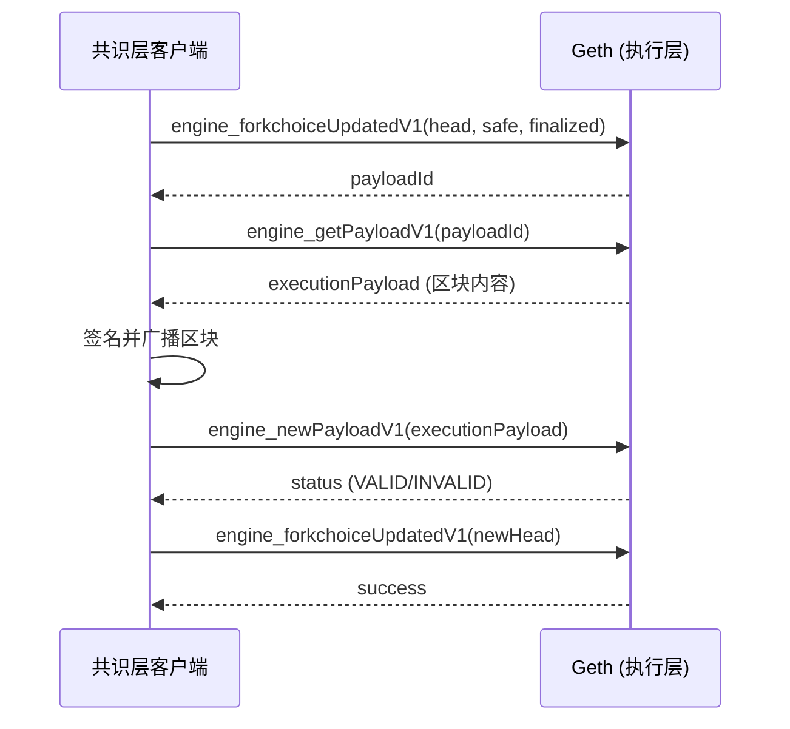
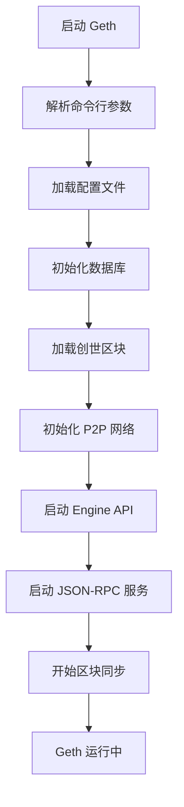

# 02 - Geth 架构 (Geth Architecture)

**难度**: ⭐⭐☆☆☆ | **预估学习时间**: 10-12 小时

---

## 📋 本章概述

本章将深入介绍 Go-Ethereum (Geth) 客户端的架构设计,包括核心组件、数据存储、P2P 网络和执行层与共识层的交互机制。

### 学习目标

完成本章学习后,您将能够:

- 理解 Geth 客户端的整体架构
- 掌握 Geth 的核心组件和职责
- 理解数据库和存储机制
- 了解执行层与共识层的交互
- 掌握 Geth 的启动流程

---

## 1. Geth 客户端概述

### 1.1 什么是 Geth?

**Go-Ethereum (Geth)** 是以太坊官方的 Go 语言实现,是最流行的以太坊执行层客户端。

**核心特性**:
- **执行层客户端**: 负责交易执行和状态管理
- **EVM 实现**: 完整的以太坊虚拟机
- **P2P 网络**: devp2p 协议实现
- **JSON-RPC API**: 标准的以太坊 API
- **高性能**: Go 语言实现,并发性能优秀

### 1.2 Geth 在以太坊生态中的角色

```plaintext
┌──────────────────────────────────────────────────────────┐
│                    以太坊网络                              │
├──────────────────────────────────────────────────────────┤
│                                                           │
│  ┌─────────────────┐         ┌─────────────────┐        │
│  │   共识层客户端    │         │   共识层客户端    │        │
│  │  (Prysm/Lighthouse)│ ◄──► │  (Prysm/Lighthouse)│      │
│  └────────┬────────┘         └────────┬────────┘        │
│           │ Engine API                │ Engine API      │
│  ┌────────▼────────┐         ┌────────▼────────┐        │
│  │   执行层客户端    │         │   执行层客户端    │        │
│  │     (Geth)      │ ◄──► │     (Geth)      │        │
│  └─────────────────┘  P2P   └─────────────────┘        │
│                                                           │
└──────────────────────────────────────────────────────────┘
```

### 1.3 Geth 版本历史

| 版本 | 发布时间 | 主要特性 |
|------|----------|----------|
| **v1.0.0** | 2015.07 | Frontier 主网启动 |
| **v1.5.0** | 2016.09 | 引入 Whisper 协议 |
| **v1.8.0** | 2018.02 | 引入 Puppeth 工具 |
| **v1.10.0** | 2021.03 | Snap Sync 同步模式 |
| **v1.11.0** | 2022.09 | The Merge 支持 |
| **v1.13.0** | 2023.09 | Path-based 存储方案 |

---

## 2. Geth 整体架构

### 2.1 架构分层

```plaintext
┌─────────────────────────────────────────────────────────┐
│                    应用层 (Application)                   │
│  - Geth Console (JavaScript)                            │
│  - JSON-RPC Server (HTTP/WebSocket/IPC)                 │
│  - GraphQL Server                                       │
└─────────────────────────────────────────────────────────┘
                          ▲
                          │
┌─────────────────────────▼───────────────────────────────┐
│                    核心层 (Core)                          │
│  ┌──────────┐  ┌──────────┐  ┌──────────┐              │
│  │   EVM    │  │ Tx Pool  │  │  Miner   │              │
│  └──────────┘  └──────────┘  └──────────┘              │
│  ┌──────────┐  ┌──────────┐  ┌──────────┐              │
│  │ Blockchain│  │  State   │  │ Consensus│              │
│  └──────────┘  └──────────┘  └──────────┘              │
└─────────────────────────────────────────────────────────┘
                          ▲
                          │
┌─────────────────────────▼───────────────────────────────┐
│                    存储层 (Storage)                       │
│  ┌──────────────────┐  ┌──────────────────┐            │
│  │  LevelDB/Pebble  │  │  Ancient Store   │            │
│  │  (Recent Data)   │  │  (Freezer)       │            │
│  └──────────────────┘  └──────────────────┘            │
└─────────────────────────────────────────────────────────┘
                          ▲
                          │
┌─────────────────────────▼───────────────────────────────┐
│                    网络层 (Network)                       │
│  ┌──────────────────┐  ┌──────────────────┐            │
│  │  devp2p (P2P)    │  │  Engine API      │            │
│  │  - Node Discovery│  │  (Consensus)     │            │
│  │  - Block Sync    │  │                  │            │
│  └──────────────────┘  └──────────────────┘            │
└─────────────────────────────────────────────────────────┘
```

### 2.2 核心组件

| 组件 | 职责 | 关键功能 |
|------|------|----------|
| **EVM** | 执行智能合约 | 操作码执行、Gas 计算、状态更新 |
| **Transaction Pool** | 管理待处理交易 | 交易验证、排序、广播 |
| **Blockchain** | 管理区块链数据 | 区块验证、链重组、分叉选择 |
| **State** | 管理账户状态 | 状态树、存储、快照 |
| **Consensus** | 共识接口 | Engine API、区块生产 |
| **P2P Network** | 节点通信 | 节点发现、区块同步、交易广播 |
| **Database** | 数据持久化 | LevelDB/Pebble、Ancient Store |

---

## 3. 数据库与存储

### 3.1 存储架构

Geth 使用两层存储架构:

```plaintext
┌─────────────────────────────────────────────────────────┐
│              Key-Value Store (LevelDB/Pebble)            │
│  - 最近的区块和状态 (~128 个区块)                          │
│  - 交易索引                                              │
│  - 状态树 (Trie)                                         │
│  - 快照 (Snapshot)                                       │
│  存储位置: <datadir>/geth/chaindata/                     │
└─────────────────────────────────────────────────────────┘
                          +
┌─────────────────────────────────────────────────────────┐
│              Ancient Store (Freezer)                     │
│  - 历史区块 (Headers, Bodies, Receipts)                  │
│  - 历史状态 (可选,Archive 模式)                           │
│  - 不可变数据,追加写入                                    │
│  存储位置: <datadir>/geth/chaindata/ancient/             │
└─────────────────────────────────────────────────────────┘
```

### 3.2 数据库引擎

Geth 支持两种数据库引擎:

| 引擎 | 特性 | 适用场景 |
|------|------|----------|
| **LevelDB** | 默认引擎,成熟稳定 | 通用场景 |
| **Pebble** | 更好的性能,活跃维护 | 高性能需求 |

**切换到 Pebble**:

```bash
# 需要全新数据目录,无法从 LevelDB 迁移
geth --db.engine=pebble --datadir /path/to/new/datadir
```

### 3.3 存储方案

Geth 支持两种状态存储方案:

#### Hash-based Scheme (传统方案)

- 使用 Merkle Patricia Trie
- 节点以哈希值为键存储
- 适合验证和同步

#### Path-based Scheme (新方案,v1.13+)

- 使用路径作为键
- 更高效的存储和访问
- 支持历史状态索引

**初始化 Path-based 存储**:

```bash
geth --state.scheme=path init --datadir data genesis.json
```

### 3.4 数据目录结构

```plaintext
<datadir>/
├── geth/
│   ├── chaindata/              # 主数据库
│   │   ├── 000001.log          # LevelDB 日志文件
│   │   ├── CURRENT             # 当前数据库版本
│   │   ├── LOCK                # 数据库锁文件
│   │   ├── LOG                 # LevelDB 日志
│   │   ├── MANIFEST-000000     # 数据库清单
│   │   └── ancient/            # Freezer 数据库
│   │       ├── chain/          # 区块链数据
│   │       │   ├── bodies.0000.cdat
│   │       │   ├── headers.0000.cdat
│   │       │   ├── hashes.0000.cdat
│   │       │   └── receipts.0000.cdat
│   │       └── state/          # 历史状态 (Archive 模式)
│   ├── lightchaindata/         # Light 客户端数据
│   ├── nodes/                  # 节点发现数据
│   └── LOCK                    # Geth 实例锁
├── keystore/                   # 账户密钥库
│   └── UTC--2023-...--address  # 加密的私钥文件
└── geth.ipc                    # IPC 通信文件
```

### 3.5 数据库性能指标

Geth 提供详细的数据库性能指标:

```plaintext
LevelDB Metrics:
  - compTimeMeter: 压缩总时间
  - compReadMeter: 压缩读取数据量
  - compWriteMeter: 压缩写入数据量
  - diskSizeGauge: 数据库总大小
  - diskReadMeter: 有效读取数据量
  - diskWriteMeter: 有效写入数据量

Freezer Metrics:
  - readMeter: 读取数据量
  - writeMeter: 写入数据量
  - sizeGauge: Freezer 总大小
```

---

## 4. 执行层与共识层交互

### 4.1 Engine API

The Merge 后,Geth 通过 **Engine API** 与共识层客户端通信。

**Engine API 端点**:

```plaintext
默认地址: http://localhost:8551
认证方式: JWT (JSON Web Token)
协议: JSON-RPC over HTTP
```

**启动 Geth 并配置 Engine API**:

```bash
geth \
  --authrpc.addr localhost \
  --authrpc.port 8551 \
  --authrpc.vhosts localhost \
  --authrpc.jwtsecret /path/to/jwtsecret
```

### 4.2 JWT 认证

Engine API 使用 JWT 进行认证:

**生成 JWT Secret**:

```bash
# 生成 32 字节的随机密钥
openssl rand -hex 32 > jwtsecret
```

**JWT Secret 格式**:

```plaintext
0x1234567890abcdef1234567890abcdef1234567890abcdef1234567890abcdef
```

### 4.3 Engine API 方法

| 方法 | 描述 | 调用方 |
|------|------|--------|
| `engine_newPayloadV1` | 提交新的执行负载 | 共识层 |
| `engine_forkchoiceUpdatedV1` | 更新分叉选择 | 共识层 |
| `engine_getPayloadV1` | 获取执行负载 | 共识层 |
| `engine_exchangeTransitionConfigurationV1` | 交换配置 | 共识层 |

### 4.4 区块生产流程



---

## 5. P2P 网络层

### 5.1 devp2p 协议

Geth 使用 **devp2p** 协议进行节点间通信。

**devp2p 协议栈**:

```plaintext
┌─────────────────────────────────────┐
│      应用协议 (eth, snap, les)       │
├─────────────────────────────────────┤
│      RLPx (加密传输层)               │
├─────────────────────────────────────┤
│      节点发现 (Discovery v4/v5)      │
├─────────────────────────────────────┤
│      传输层 (TCP/UDP)                │
└─────────────────────────────────────┘
```

### 5.2 节点发现

**Discovery v4 (基于 Kademlia DHT)**:

```plaintext
1. Bootstrap Nodes: 连接到预配置的引导节点
2. PING/PONG: 检测节点活跃性
3. FIND_NODE: 查找特定距离的节点
4. NEIGHBORS: 返回邻近节点列表
```

**Discovery v5 (改进版)**:

- 更好的隐私保护
- 支持 ENR (Ethereum Node Records)
- 更高效的节点发现

### 5.3 以太坊子协议

| 协议 | 版本 | 用途 |
|------|------|------|
| **eth** | eth/66, eth/67, eth/68 | 区块和交易同步 |
| **snap** | snap/1 | 快照同步 |
| **les** | les/4 | 轻客户端协议 |

---

## 6. Geth 启动流程

### 6.1 启动步骤



### 6.2 启动日志解析

**典型的 Geth 启动日志**:

```log
INFO [10-04|10:20:52.028] Starting Geth on Ethereum mainnet...
INFO [10-04|10:20:52.028] Bumping default cache on mainnet provided=1024 updated=4096
INFO [10-04|10:20:52.030] Maximum peer count ETH=50 LES=0 total=50
INFO [10-04|10:20:52.035] Allocated trie memory caches clean=614.00MiB dirty=1024.00MiB
INFO [10-04|10:20:52.035] Allocated cache and file handles database=/home/geth/chaindata cache=2.00GiB handles=524,288
INFO [10-04|10:20:52.128] Opened ancient database database=/home/geth/chaindata/ancient/chain readonly=false
INFO [10-04|10:20:52.386] Chain ID: 1 (mainnet)
INFO [10-04|10:20:52.386] Consensus: Beacon (proof-of-stake), merged from Ethash (proof-of-work)
```

**关键信息**:
- **Cache 分配**: Trie 缓存、数据库缓存
- **数据库路径**: chaindata 和 ancient 数据库位置
- **Chain ID**: 网络标识 (1 = Mainnet)
- **共识机制**: Beacon (PoS)

---

## 7. 实践练习

### 练习 1: 检查 Geth 数据库

```bash
# 检查数据库存储使用情况
geth db inspect --datadir /path/to/datadir

# 查看数据库统计信息
geth db stats --datadir /path/to/datadir
```

### 练习 2: 配置 Engine API

1. 生成 JWT Secret
2. 启动 Geth 并配置 Engine API
3. 验证 Engine API 端点可访问

### 练习 3: 分析启动日志

1. 启动 Geth 节点
2. 分析启动日志中的关键信息
3. 理解各个组件的初始化顺序

---

## 8. 总结

本章介绍了 Geth 客户端的架构:

- ✅ **整体架构**: 分层设计和核心组件
- ✅ **数据库存储**: LevelDB/Pebble 和 Ancient Store
- ✅ **Engine API**: 执行层与共识层交互
- ✅ **P2P 网络**: devp2p 协议和节点发现
- ✅ **启动流程**: Geth 的初始化过程

---

## 9. 延伸阅读

- [Geth 架构文档](https://geth.ethereum.org/docs/fundamentals/node-architecture)
- [devp2p 协议规范](https://github.com/ethereum/devp2p)
- [Engine API 规范](https://github.com/ethereum/execution-apis/tree/main/src/engine)
- [Geth 源码](https://github.com/ethereum/go-ethereum)

---

**上一章**: [01 - 以太坊基础](./01-Ethereum-Fundamentals.md)  
**下一章**: [03 - 节点设置与管理](./03-Node-Setup-and-Management.md)

