# RWA-HUSD 项目架构图

**文档版本**: v1.0
**创建时间**: 2025-10-09 11:45:00 CST
**文档类型**: 系统架构分析
**项目**: RWA-HUSD（房产代币化平台）

---

## 📑 目录

1. [系统整体架构](#1-系统整体架构)
2. [核心合约详解](#2-核心合约详解)
3. [数据流程图](#3-数据流程图)
4. [技术栈说明](#4-技术栈说明)
5. [安全机制](#5-安全机制)
6. [其他关键合约](#6-其他关键合约)
7. [完整系统架构](#7-完整系统架构)
8. [部署架构](#8-部署架构)
9. [总结](#9-总结)

---

## 1. 系统整体架构

### 1.1 架构总览

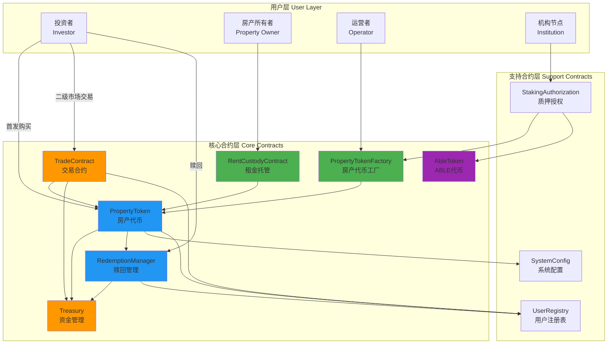
```mermaid
graph TB
    subgraph "用户层 User Layer"
        User[投资者<br/>Investor]
        PropertyOwner[房产所有者<br/>Property Owner]
        Operator[运营者<br/>Operator]
        Institution[机构节点<br/>Institution]
    end

    subgraph "核心合约层 Core Contracts"
        Factory[PropertyTokenFactory<br/>房产代币工厂]
        Token[PropertyToken<br/>房产代币]
        Treasury[Treasury<br/>资金管理]
        Rent[RentCustodyContract<br/>租金托管]
        Redemption[RedemptionManager<br/>赎回管理]
        Trade[TradeContract<br/>交易合约]
        Able[AbleToken<br/>ABLE代币]
    end

    subgraph "支持合约层 Support Contracts"
        SystemConfig[SystemConfig<br/>系统配置]
        UserRegistry[UserRegistry<br/>用户注册表]
        Staking[StakingAuthorization<br/>质押授权]
    end

    %% 用户层交互
    Institution --> Staking
    Staking --> Factory
    Operator --> Factory
    PropertyOwner --> Rent
    User -->|首发购买| Token
    User -->|二级市场交易| Trade
    User -->|赎回| Redemption

    %% 核心合约交互
    Factory --> Token
    Token --> Treasury
    Token --> Redemption
    Rent --> Token
    Trade --> Token
    Trade --> Treasury
    Redemption --> Treasury
    Staking --> Able

    %% 支持合约交互
    Token --> SystemConfig
    Token --> UserRegistry
    Trade --> UserRegistry
    Redemption --> UserRegistry

    style Factory fill:#4CAF50
    style Token fill:#2196F3
    style Treasury fill:#FF9800
    style Rent fill:#4CAF50
    style Redemption fill:#2196F3
    style Trade fill:#FF9800
    style Able fill:#9C27B0
```

### 1.2 合约关系图

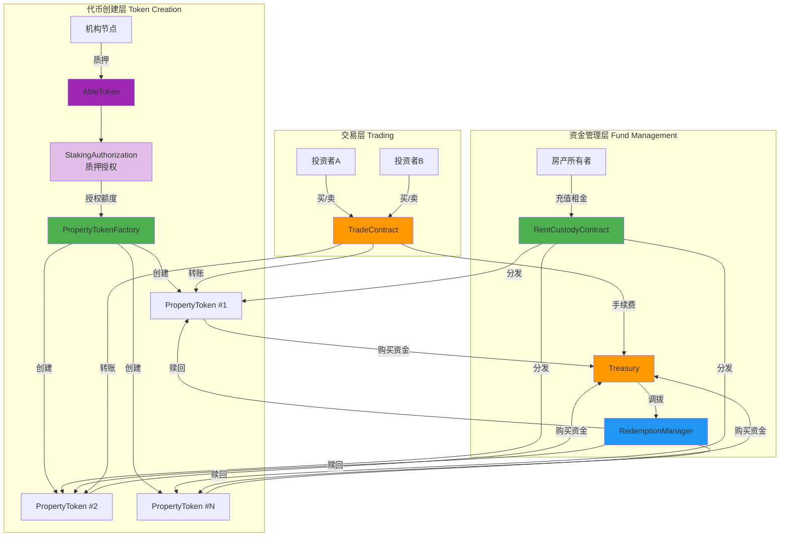
```mermaid
graph TB
    subgraph "代币创建层 Token Creation"
        Institution[机构节点]
        Staking[StakingAuthorization<br/>质押授权]
        Able[AbleToken]
        Factory[PropertyTokenFactory]

        Institution -->|质押| Able
        Able --> Staking
        Staking -->|授权额度| Factory
        Factory -->|创建| Token1[PropertyToken #1]
        Factory -->|创建| Token2[PropertyToken #2]
        Factory -->|创建| TokenN[PropertyToken #N]
    end

    subgraph "资金管理层 Fund Management"
        Token1 -->|购买资金| Treasury[Treasury]
        Token2 -->|购买资金| Treasury
        TokenN -->|购买资金| Treasury

        PropertyOwner[房产所有者] -->|充值租金| Rent[RentCustodyContract]
        Rent -->|分发| Token1
        Rent -->|分发| Token2
        Rent -->|分发| TokenN

        Treasury -->|调拨| Redemption[RedemptionManager]
        Redemption -->|赎回| Token1
        Redemption -->|赎回| Token2
        Redemption -->|赎回| TokenN
    end

    subgraph "交易层 Trading"
        User1[投资者A] -->|买/卖| Trade[TradeContract]
        User2[投资者B] -->|买/卖| Trade
        Trade -->|转账| Token1
        Trade -->|转账| Token2
        Trade -->|手续费| Treasury
    end

    style Factory fill:#4CAF50
    style Treasury fill:#FF9800
    style Rent fill:#4CAF50
    style Redemption fill:#2196F3
    style Trade fill:#FF9800
    style Able fill:#9C27B0
    style Staking fill:#E1BEE7
```

---

## 2. 核心合约详解

### 2.1 PropertyTokenFactory（房产代币工厂）

#### 合约架构

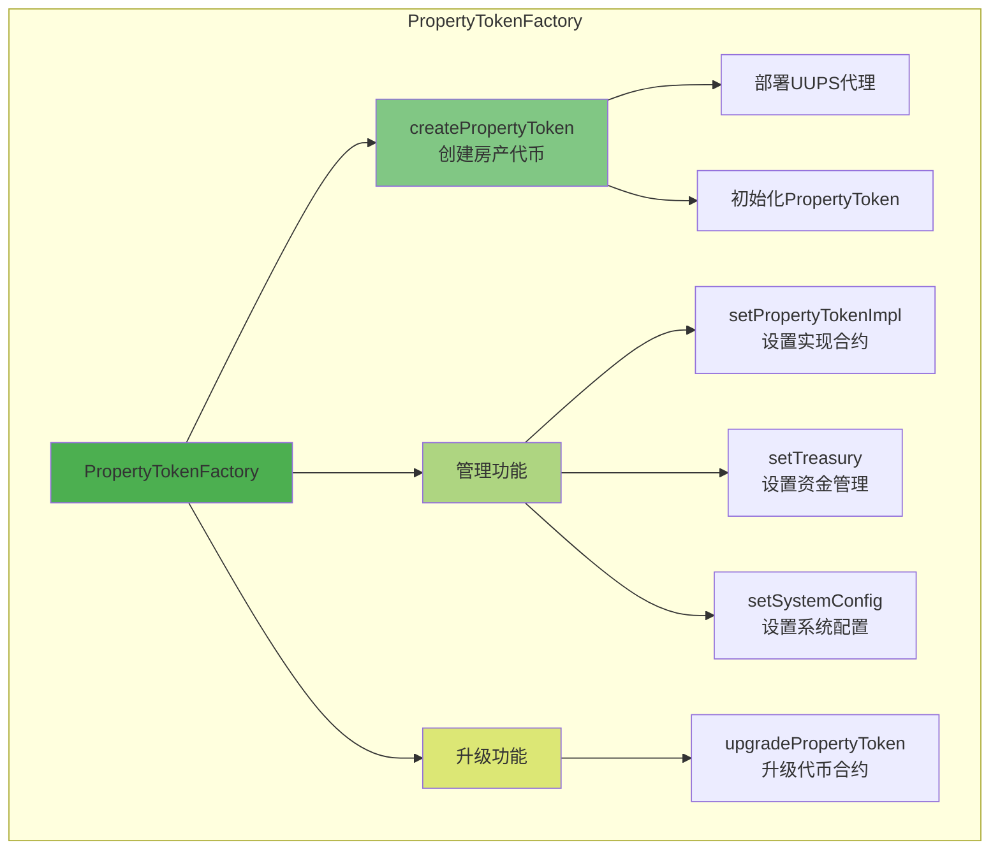
```mermaid
graph TB
    subgraph "PropertyTokenFactory"
        Factory[PropertyTokenFactory]

        Factory --> Create[createPropertyToken<br/>创建房产代币]
        Factory --> Manage[管理功能]
        Factory --> Upgrade[升级功能]

        Create --> Deploy[部署UUPS代理]
        Create --> Init[初始化PropertyToken]

        Manage --> SetImpl[setPropertyTokenImpl<br/>设置实现合约]
        Manage --> SetTreasury[setTreasury<br/>设置资金管理]
        Manage --> SetConfig[setSystemConfig<br/>设置系统配置]

        Upgrade --> UpgradeImpl[upgradePropertyToken<br/>升级代币合约]
    end

    style Factory fill:#4CAF50
    style Create fill:#81C784
    style Manage fill:#AED581
    style Upgrade fill:#DCE775
```

#### 核心功能

**1. 创建房产代币**

```solidity
function createPropertyToken(
    string memory name,
    string memory symbol,
    uint256 totalSupply,
    uint256 price,
    address propertyOwner
) external onlyRole(OPERATOR_ROLE) returns (address)
```

**功能**：

-   ✅ 使用 UUPS 代理模式部署 PropertyToken
-   ✅ 初始化代币参数（名称、符号、总供应量、价格）
-   ✅ 设置房产所有者
-   ✅ 授予 FACTORY_ROLE 和 PROPERTY_OWNER_ROLE

**2. 管理功能**

-   `setPropertyTokenImpl()` - 设置 PropertyToken 实现合约
-   `setTreasury()` - 设置 Treasury 合约地址
-   `setSystemConfig()` - 设置 SystemConfig 合约地址
-   `setUserRegistry()` - 设置 UserRegistry 合约地址

**3. 升级功能**

-   `upgradePropertyToken()` - 升级指定的 PropertyToken 合约

#### 访问控制

| 角色                   | 权限   | 说明                  |
| ---------------------- | ------ | --------------------- |
| **DEFAULT_ADMIN_ROLE** | 管理员 | 可以授予/撤销其他角色 |
| **OPERATOR_ROLE**      | 运营者 | 可以创建房产代币      |
| **UPGRADER_ROLE**      | 升级者 | 可以升级合约          |

---

### 2.2 PropertyToken（房产代币）

#### 合约架构

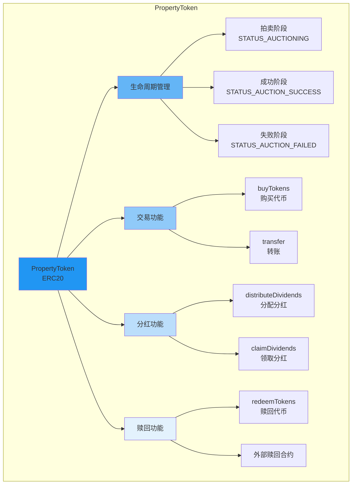
```mermaid
graph TB
    subgraph "PropertyToken"
        Token[PropertyToken<br/>ERC20]

        Token --> Lifecycle[生命周期管理]
        Token --> Trading[交易功能]
        Token --> Dividend[分红功能]
        Token --> Redemption[赎回功能]

        Lifecycle --> Auction[拍卖阶段<br/>STATUS_AUCTIONING]
        Lifecycle --> Success[成功阶段<br/>STATUS_AUCTION_SUCCESS]
        Lifecycle --> Failed[失败阶段<br/>STATUS_AUCTION_FAILED]

        Trading --> Buy[buyTokens<br/>购买代币]
        Trading --> Transfer[transfer<br/>转账]

        Dividend --> Distribute[distributeDividends<br/>分配分红]
        Dividend --> Claim[claimDividends<br/>领取分红]

        Redemption --> Redeem[redeemTokens<br/>赎回代币]
        Redemption --> External[外部赎回合约]
    end

    style Token fill:#2196F3
    style Lifecycle fill:#64B5F6
    style Trading fill:#90CAF9
    style Dividend fill:#BBDEFB
    style Redemption fill:#E3F2FD
```

#### 核心功能

**1. 购买代币**

```solidity
function buyTokens(uint256 amount)
    external
    payable
    nonReentrant
    whenNotPaused
```

**流程**：

1. 检查拍卖状态（STATUS_AUCTIONING）
2. 验证用户 KYC 状态
3. 计算购买金额（amount \* price）
4. 转账代币给用户
5. 将资金存入 Treasury

**2. 分红功能**

```solidity
function distributeDividends()
    external
    payable
    onlyRole(PROPERTY_OWNER_ROLE)
```

**流程**：

1. 房产所有者发送分红资金
2. 记录分红金额和时间
3. 用户可以调用 claimDividends()领取

**3. 赎回功能**

```solidity
function redeemTokens(uint256 amount)
    external
    nonReentrant
    whenNotPaused
```

**流程**：

1. 检查拍卖成功状态（STATUS_AUCTION_SUCCESS）
2. 销毁用户的代币
3. 调用外部赎回合约处理资金返还

#### 状态机

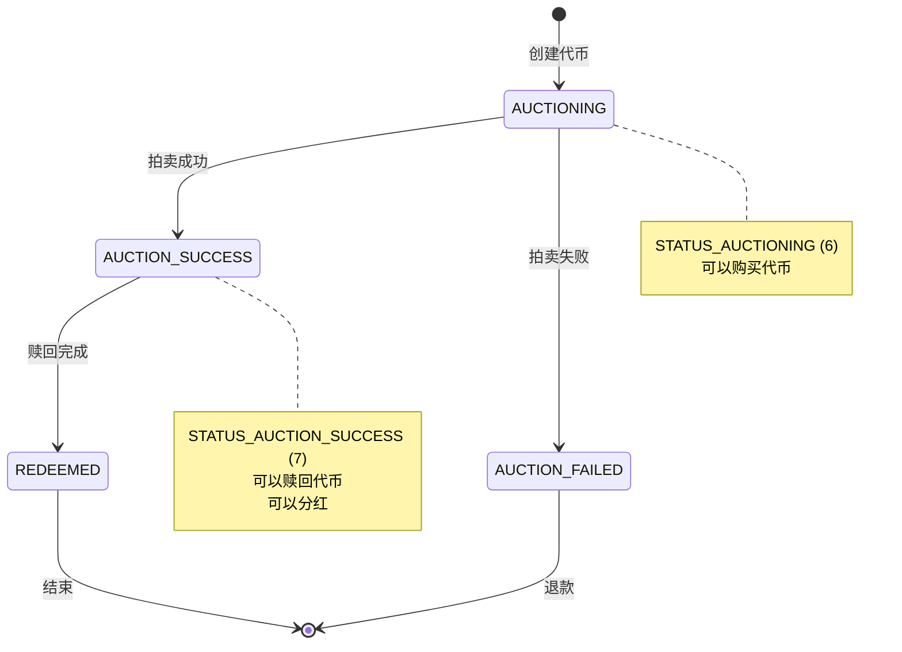
```mermaid
stateDiagram-v2
    [*] --> AUCTIONING: 创建代币
    AUCTIONING --> AUCTION_SUCCESS: 拍卖成功
    AUCTIONING --> AUCTION_FAILED: 拍卖失败
    AUCTION_SUCCESS --> REDEEMED: 赎回完成
    AUCTION_FAILED --> [*]: 退款
    REDEEMED --> [*]: 结束

    note right of AUCTIONING
        STATUS_AUCTIONING (6)
        可以购买代币
    end note

    note right of AUCTION_SUCCESS
        STATUS_AUCTION_SUCCESS (7)
        可以赎回代币
        可以分红
    end note
```

#### 访问控制

| 角色                    | 权限       | 说明                          |
| ----------------------- | ---------- | ----------------------------- |
| **FACTORY_ROLE**        | 工厂角色   | 由 Factory 授予，可以设置配置 |
| **PROPERTY_OWNER_ROLE** | 房产所有者 | 可以分配分红、管理房产        |

---

### 2.3 Treasury（资金管理）

#### 合约架构

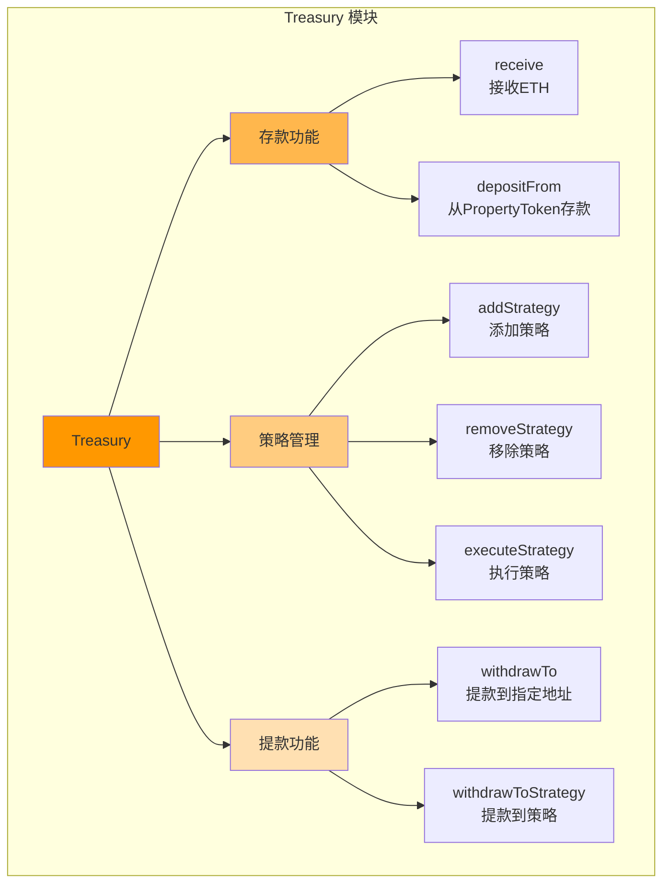
```mermaid
graph TB
    subgraph TreasuryGroup["Treasury 模块"]
        Treasury[Treasury]

        Treasury --> Deposit[存款功能]
        Treasury --> Strategy[策略管理]
        Treasury --> Withdraw[提款功能]

        Deposit --> ReceiveETH["receive<br/>接收ETH"]
        Deposit --> DepositFrom["depositFrom<br/>从PropertyToken存款"]

        Strategy --> AddStrategy["addStrategy<br/>添加策略"]
        Strategy --> RemoveStrategy["removeStrategy<br/>移除策略"]
        Strategy --> ExecuteStrategy["executeStrategy<br/>执行策略"]

        Withdraw --> WithdrawTo["withdrawTo<br/>提款到指定地址"]
        Withdraw --> WithdrawToStrategy["withdrawToStrategy<br/>提款到策略"]
    end

    classDef orange fill:#FF9800;
    classDef lightOrange fill:#FFB74D;
    classDef paleOrange fill:#FFCC80;
    classDef lighterOrange fill:#FFE0B2;

    class Treasury orange
    class Deposit lightOrange
    class Strategy paleOrange
    class Withdraw lighterOrange
```

#### 核心功能

**1. 存款功能**

```solidity
function depositFrom(address token, uint256 amount)
    external
    payable
    nonReentrant
    whenNotPaused
```

**功能**：

-   ✅ 接收来自 PropertyToken 的资金
-   ✅ 支持 ETH 和 ERC20 代币
-   ✅ 记录存款金额和来源

**2. 策略管理**

```solidity
function addStrategy(address strategy)
    external
    onlyOwner
```

**功能**：

-   ✅ 添加投资策略合约
-   ✅ 移除策略合约
-   ✅ 执行策略（如 DeFi 收益策略）

**3. 提款功能**

```solidity
function withdrawTo(address to, uint256 amount)
    external
    onlyOwner
    nonReentrant
```

**功能**：

-   ✅ 提款到指定地址
-   ✅ 提款到策略合约
-   ✅ 支持 ETH 和 ERC20 代币

---

## 3. 数据流程图

### 3.1 购买代币流程

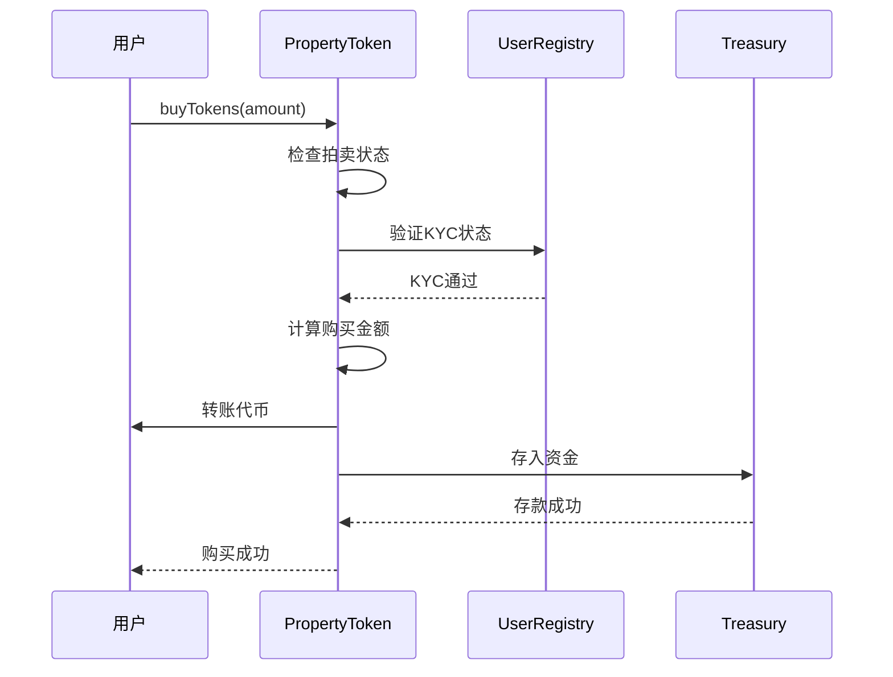
```mermaid
sequenceDiagram
    participant User as 用户
    participant Token as PropertyToken
    participant Registry as UserRegistry
    participant Treasury as Treasury

    User->>Token: buyTokens(amount)
    Token->>Token: 检查拍卖状态
    Token->>Registry: 验证KYC状态
    Registry-->>Token: KYC通过
    Token->>Token: 计算购买金额
    Token->>User: 转账代币
    Token->>Treasury: 存入资金
    Treasury-->>Token: 存款成功
    Token-->>User: 购买成功
```

### 3.2 租金分红流程

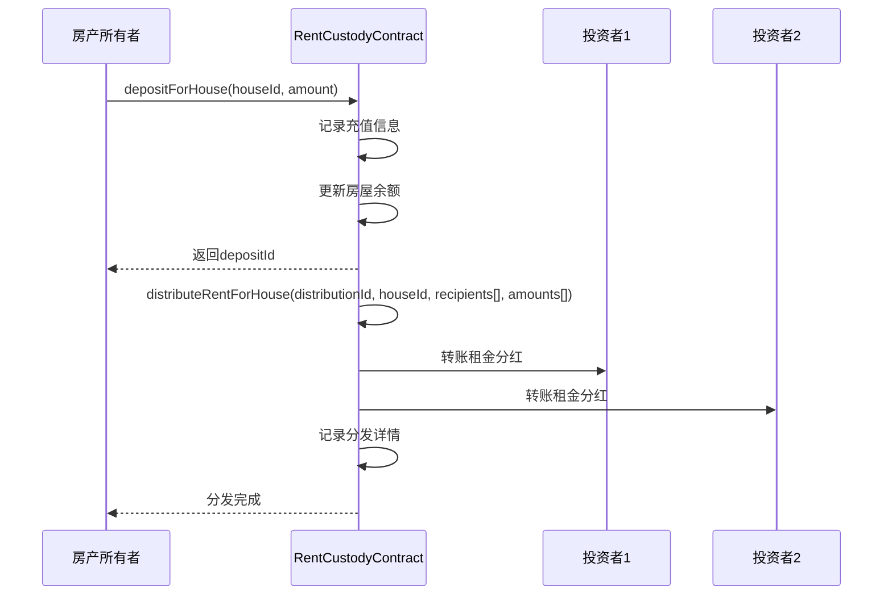
```mermaid
sequenceDiagram
    participant Owner as 房产所有者
    participant Rent as RentCustodyContract
    participant User1 as 投资者1
    participant User2 as 投资者2

    Owner->>Rent: depositForHouse(houseId, amount)
    Rent->>Rent: 记录充值信息
    Rent->>Rent: 更新房屋余额
    Rent-->>Owner: 返回depositId

    Rent->>Rent: distributeRentForHouse(distributionId, houseId, recipients[], amounts[])
    Rent->>User1: 转账租金分红
    Rent->>User2: 转账租金分红
    Rent->>Rent: 记录分发详情
    Rent-->>Owner: 分发完成
```

### 3.3 赎回流程

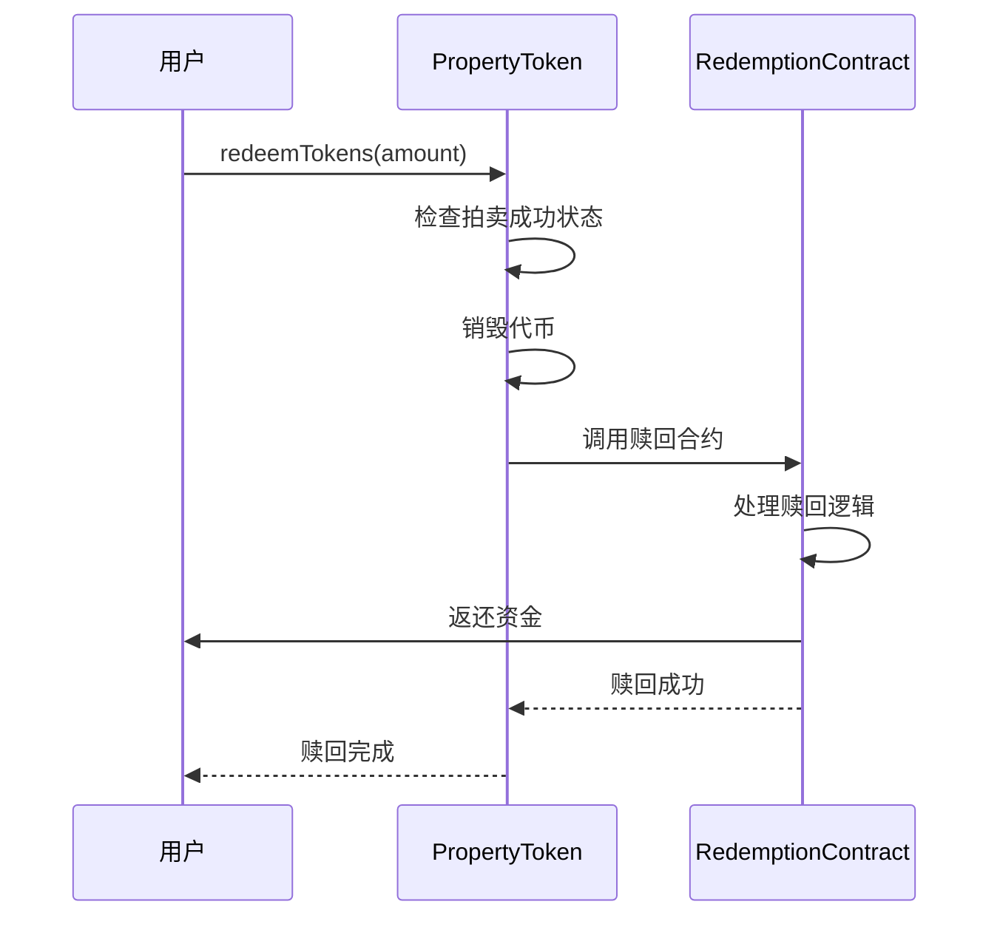
```mermaid
sequenceDiagram
    participant User as 用户
    participant Token as PropertyToken
    participant Redemption as RedemptionContract

    User->>Token: redeemTokens(amount)
    Token->>Token: 检查拍卖成功状态
    Token->>Token: 销毁代币
    Token->>Redemption: 调用赎回合约
    Redemption->>Redemption: 处理赎回逻辑
    Redemption->>User: 返还资金
    Redemption-->>Token: 赎回成功
    Token-->>User: 赎回完成
```

### 3.4 二级市场交易流程

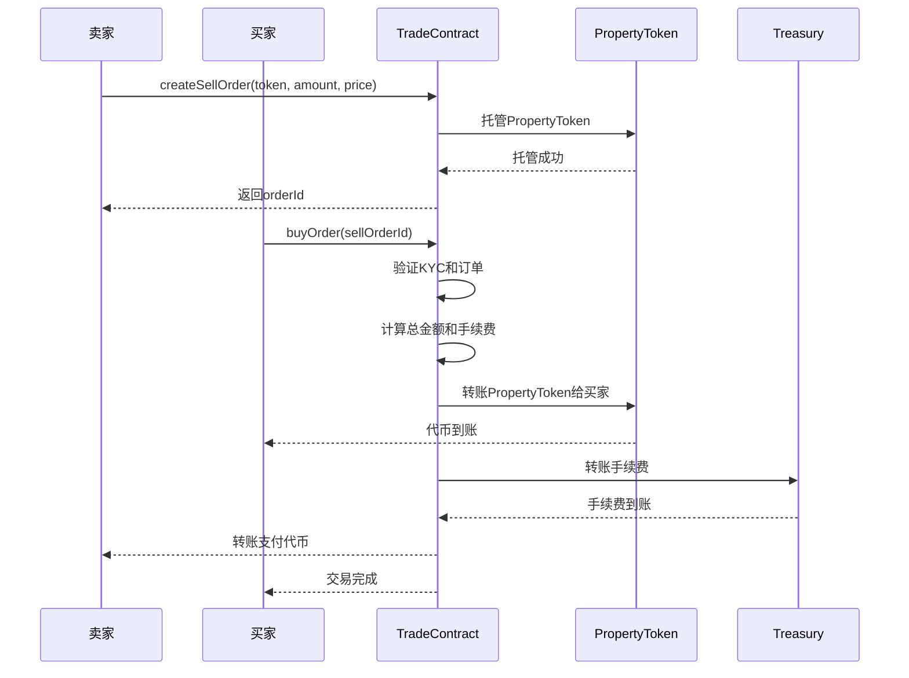
```mermaid
sequenceDiagram
    participant Seller as 卖家
    participant Buyer as 买家
    participant Trade as TradeContract
    participant Token as PropertyToken
    participant Treasury as Treasury

    Seller->>Trade: createSellOrder(token, amount, price)
    Trade->>Token: 托管PropertyToken
    Token-->>Trade: 托管成功
    Trade-->>Seller: 返回orderId

    Buyer->>Trade: buyOrder(sellOrderId)
    Trade->>Trade: 验证KYC和订单
    Trade->>Trade: 计算总金额和手续费
    Trade->>Token: 转账PropertyToken给买家
    Token-->>Buyer: 代币到账
    Trade->>Treasury: 转账手续费
    Treasury-->>Trade: 手续费到账
    Trade-->>Seller: 转账支付代币
    Trade-->>Buyer: 交易完成
```

### 3.5 机构质押授权流程

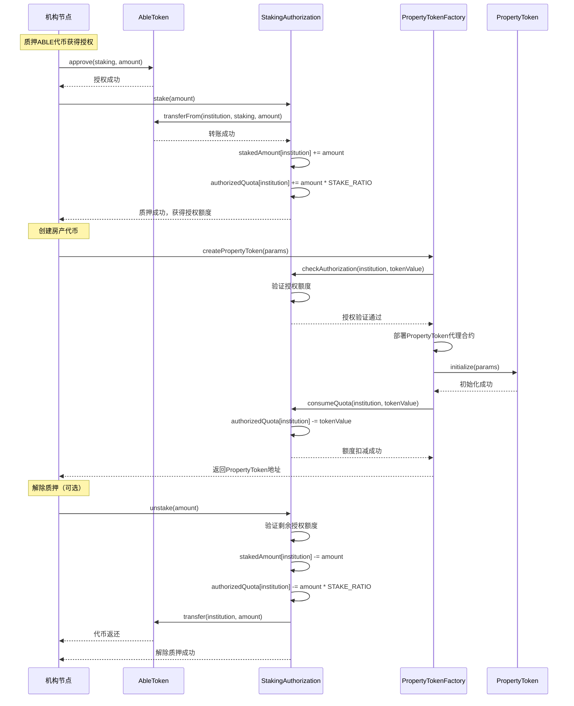
```mermaid
sequenceDiagram
    participant Institution as 机构节点
    participant Able as AbleToken
    participant Staking as StakingAuthorization
    participant Factory as PropertyTokenFactory
    participant Token as PropertyToken

    Note over Institution: 质押ABLE代币获得授权

    Institution->>Able: approve(staking, amount)
    Able-->>Institution: 授权成功

    Institution->>Staking: stake(amount)
    Staking->>Able: transferFrom(institution, staking, amount)
    Able-->>Staking: 转账成功

    Staking->>Staking: stakedAmount[institution] += amount
    Staking->>Staking: authorizedQuota[institution] += amount * STAKE_RATIO
    Staking-->>Institution: 质押成功，获得授权额度

    Note over Institution: 创建房产代币

    Institution->>Factory: createPropertyToken(params)
    Factory->>Staking: checkAuthorization(institution, tokenValue)
    Staking->>Staking: 验证授权额度
    Staking-->>Factory: 授权验证通过

    Factory->>Factory: 部署PropertyToken代理合约
    Factory->>Token: initialize(params)
    Token-->>Factory: 初始化成功

    Factory->>Staking: consumeQuota(institution, tokenValue)
    Staking->>Staking: authorizedQuota[institution] -= tokenValue
    Staking-->>Factory: 额度扣减成功

    Factory-->>Institution: 返回PropertyToken地址

    Note over Institution: 解除质押（可选）

    Institution->>Staking: unstake(amount)
    Staking->>Staking: 验证剩余授权额度
    Staking->>Staking: stakedAmount[institution] -= amount
    Staking->>Staking: authorizedQuota[institution] -= amount * STAKE_RATIO
    Staking->>Able: transfer(institution, amount)
    Able-->>Institution: 代币返还
    Staking-->>Institution: 解除质押成功
```

---

## 4. 技术栈说明

### 4.1 核心技术

| 技术             | 版本    | 说明           |
| ---------------- | ------- | -------------- |
| **Solidity**     | ^0.8.20 | 智能合约语言   |
| **OpenZeppelin** | 5.0.0   | 合约库         |
| **UUPS Proxy**   | -       | 可升级代理模式 |
| **Hardhat**      | -       | 开发框架       |

### 4.2 OpenZeppelin 库使用

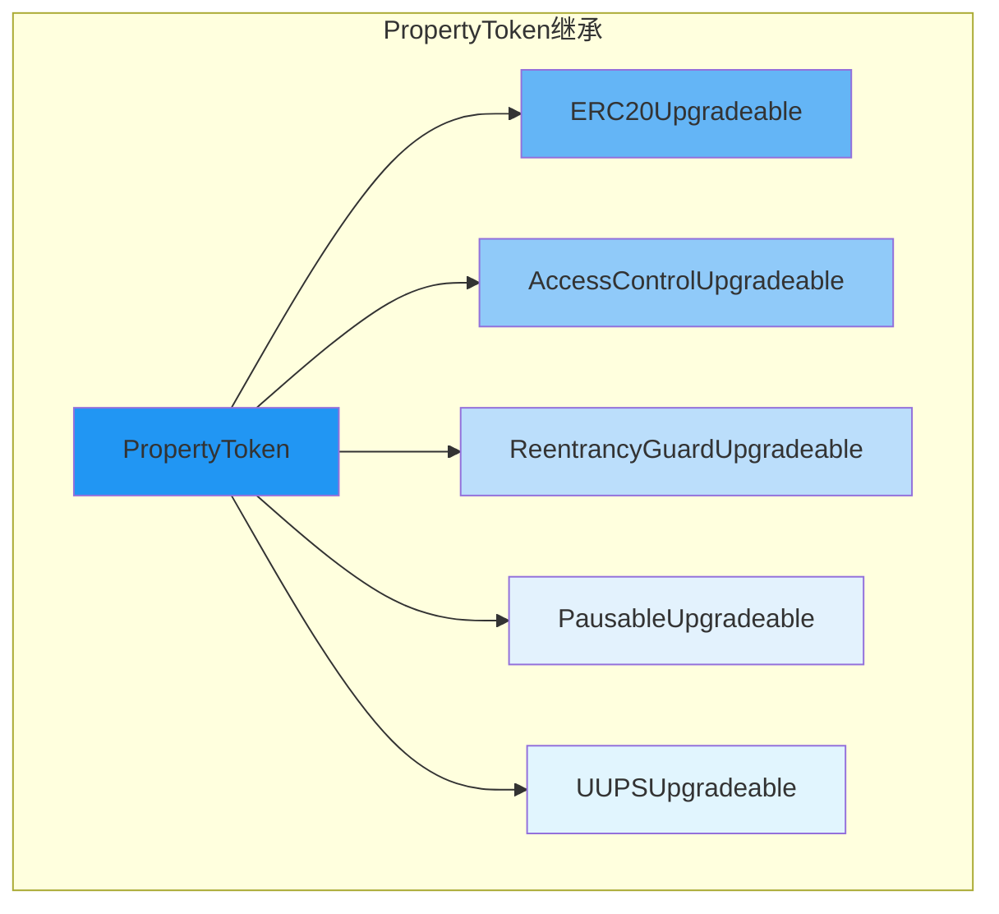
```mermaid
graph TB
    subgraph "PropertyToken继承"
        Token[PropertyToken]
        ERC20[ERC20Upgradeable]
        Access[AccessControlUpgradeable]
        Reentrancy[ReentrancyGuardUpgradeable]
        Pausable[PausableUpgradeable]
        UUPS[UUPSUpgradeable]

        Token --> ERC20
        Token --> Access
        Token --> Reentrancy
        Token --> Pausable
        Token --> UUPS
    end

    style Token fill:#2196F3
    style ERC20 fill:#64B5F6
    style Access fill:#90CAF9
    style Reentrancy fill:#BBDEFB
    style Pausable fill:#E3F2FD
    style UUPS fill:#E1F5FE
```

**继承说明**：

-   **ERC20Upgradeable**: 标准 ERC20 代币功能
-   **AccessControlUpgradeable**: 基于角色的访问控制
-   **ReentrancyGuardUpgradeable**: 防止重入攻击
-   **PausableUpgradeable**: 紧急暂停功能
-   **UUPSUpgradeable**: UUPS 代理模式，支持合约升级

### 4.3 UUPS 代理模式

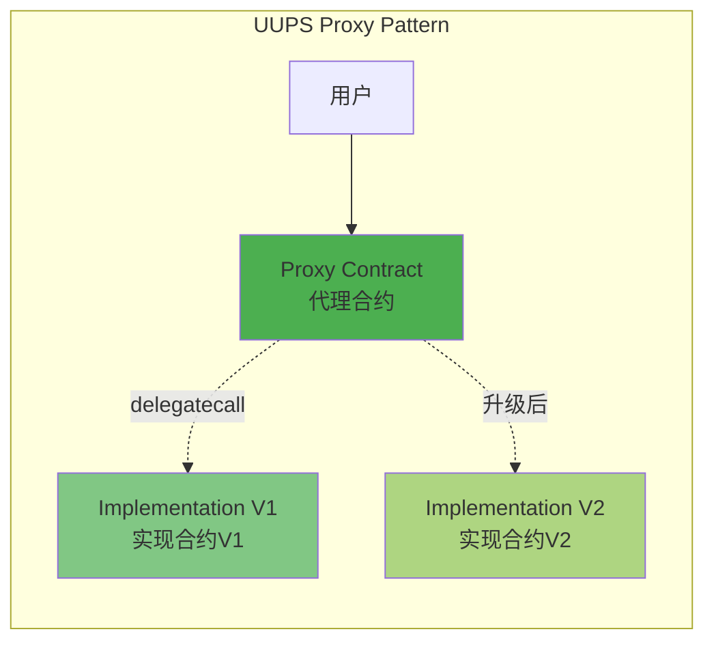
```mermaid
graph LR
    subgraph "UUPS Proxy Pattern"
        User[用户]
        Proxy[Proxy Contract<br/>代理合约]
        Impl1[Implementation V1<br/>实现合约V1]
        Impl2[Implementation V2<br/>实现合约V2]

        User --> Proxy
        Proxy -.delegatecall.-> Impl1
        Proxy -.升级后.-> Impl2
    end

    style Proxy fill:#4CAF50
    style Impl1 fill:#81C784
    style Impl2 fill:#AED581
```

**优势**：

-   ✅ 合约可升级：可以修复 bug 和添加新功能
-   ✅ 状态保留：升级后数据不丢失
-   ✅ Gas 优化：相比 Transparent Proxy 更省 Gas
-   ✅ 安全性：升级逻辑在实现合约中，更安全

---

## 5. 安全机制

### 5.1 安全特性

| 安全机制     | 实现方式             | 说明                        |
| ------------ | -------------------- | --------------------------- |
| **访问控制** | AccessControl        | 基于角色的权限管理          |
| **重入保护** | ReentrancyGuard      | 防止重入攻击                |
| **暂停机制** | Pausable             | 紧急情况下暂停合约          |
| **升级控制** | UUPS + AccessControl | 只有授权者可以升级          |
| **KYC 验证** | UserRegistry         | 只有通过 KYC 的用户可以交易 |
| **状态检查** | 状态机               | 严格的状态转换控制          |

### 5.2 安全检查清单

**合约部署前**：

-   [ ] 所有合约通过 Slither 静态分析
-   [ ] 所有合约通过单元测试
-   [ ] 所有合约通过集成测试
-   [ ] 关键功能通过模糊测试
-   [ ] 代码通过第三方审计

**合约部署后**：

-   [ ] 设置正确的角色权限
-   [ ] 配置正确的外部合约地址
-   [ ] 测试升级流程
-   [ ] 监控合约事件
-   [ ] 准备紧急暂停方案

---

## 6. 其他关键合约

### 6.1 RentCustodyContract（租金托管合约）

#### 合约架构

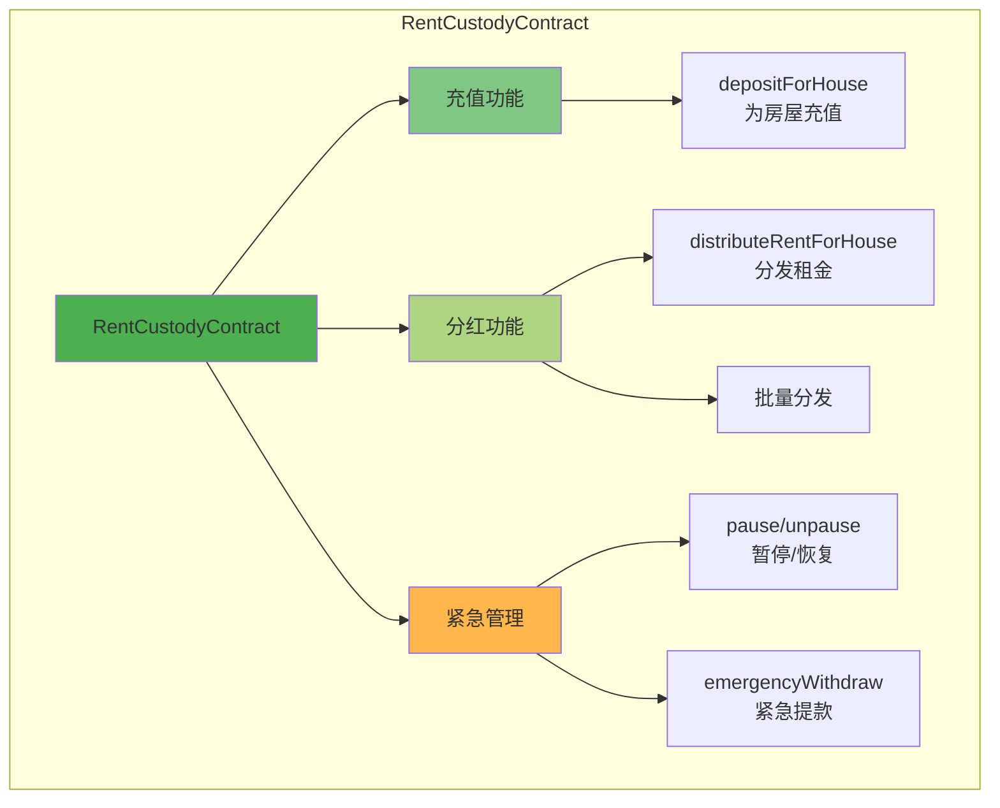
```mermaid
graph TB
    subgraph "RentCustodyContract"
        Rent[RentCustodyContract]

        Rent --> Deposit[充值功能]
        Rent --> Distribute[分红功能]
        Rent --> Emergency[紧急管理]

        Deposit --> DepositForHouse[depositForHouse<br/>为房屋充值]

        Distribute --> DistributeRent[distributeRentForHouse<br/>分发租金]
        Distribute --> BatchDistribute[批量分发]

        Emergency --> Pause[pause/unpause<br/>暂停/恢复]
        Emergency --> EmergencyWithdraw[emergencyWithdraw<br/>紧急提款]
    end

    style Rent fill:#4CAF50
    style Deposit fill:#81C784
    style Distribute fill:#AED581
    style Emergency fill:#FFB74D
```

#### 核心功能

**1. 充值功能**

```solidity
function depositForHouse(uint256 houseId, uint256 amount)
    external
    nonReentrant
    whenNotPaused
    returns (uint256 depositId)
```

**功能**：

-   ✅ 为指定房屋充值租金
-   ✅ 记录充值历史
-   ✅ 更新房屋余额
-   ✅ 支持最小/最大金额限制

**2. 分红功能**

```solidity
function distributeRentForHouse(
    uint256 distributionId,
    uint256 houseId,
    address[] calldata recipients,
    uint256[] calldata amounts
) external onlyOperationAdmin whenNotPaused
```

**功能**：

-   ✅ 批量分发租金给多个接收者
-   ✅ 记录分发历史
-   ✅ 支持部分失败处理
-   ✅ 最大批量限制（防止 Gas 耗尽）

**3. 数据结构**

| 结构体                 | 字段                                                             | 说明     |
| ---------------------- | ---------------------------------------------------------------- | -------- |
| **DepositRecord**      | depositId, houseId, amount, timestamp, token, depositor          | 充值记录 |
| **HouseBalance**       | totalDeposited, totalDistributed, currentBalance, lastUpdateTime | 房屋余额 |
| **DistributionDetail** | distributionId, houseId, totalAmount, successCount, failCount    | 分发详情 |

#### 安全特性

-   ✅ **重入保护**: ReentrancyGuard
-   ✅ **暂停机制**: Pausable
-   ✅ **权限控制**: onlyOperationAdmin 修饰符
-   ✅ **降级机制**: 系统配置失效时使用紧急管理员
-   ✅ **批量限制**: MAX_BATCH_SIZE_LIMIT = 1000

---

### 6.2 RedemptionManager（赎回管理合约）

#### 合约架构

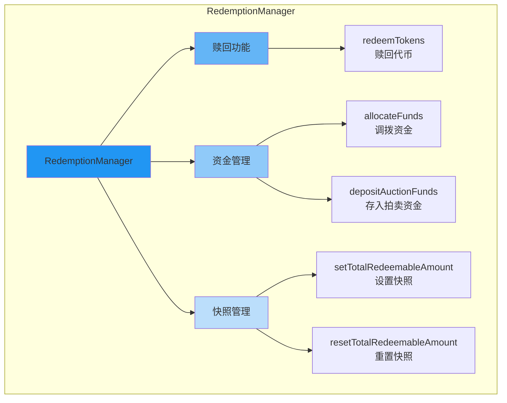
```mermaid
graph TB
    subgraph "RedemptionManager"
        Redemption[RedemptionManager]

        Redemption --> Redeem[赎回功能]
        Redemption --> Funds[资金管理]
        Redemption --> Snapshot[快照管理]

        Redeem --> RedeemTokens[redeemTokens<br/>赎回代币]

        Funds --> AllocateFunds[allocateFunds<br/>调拨资金]
        Funds --> DepositAuction[depositAuctionFunds<br/>存入拍卖资金]

        Snapshot --> SetSnapshot[setTotalRedeemableAmount<br/>设置快照]
        Snapshot --> ResetSnapshot[resetTotalRedeemableAmount<br/>重置快照]
    end

    style Redemption fill:#2196F3
    style Redeem fill:#64B5F6
    style Funds fill:#90CAF9
    style Snapshot fill:#BBDEFB
```

#### 核心功能

**1. 赎回功能**

```solidity
function redeemTokens(address propertyToken)
    external
    whenNotPaused
    nonReentrant
```

**流程**：

1. 验证房产状态为 7（拍卖成功）
2. 验证用户 KYC 状态
3. 获取用户代币余额（赎回全部）
4. 基于快照计算赎回金额
5. 计算手续费（0.1%）
6. 销毁用户代币
7. 转账净金额给用户

**公平性保证**：

-   ✅ 所有用户获得相同的每代币赎回价值
-   ✅ 无论赎回时间先后，待遇完全一致
-   ✅ 缩减比例在快照时全局应用

**2. 资金管理**

```solidity
function allocateFunds(address propertyToken, uint256 amount)
    external
    onlyAdmin
    whenNotPaused
    nonReentrant
```

**功能**：

-   ✅ 调拨资金到赎回合约
-   ✅ 自动将房产状态设置为 6（拍卖中）
-   ✅ 更新可支配额度

**3. 数据结构**

| 变量                      | 类型                        | 说明               |
| ------------------------- | --------------------------- | ------------------ |
| **availableBalances**     | mapping(address => uint256) | 各代币的可支配额度 |
| **treasuryBalances**      | mapping(address => uint256) | 国库调拨资金余额   |
| **auctionBalances**       | mapping(address => uint256) | 拍卖资金余额       |
| **totalRedeemableAmount** | mapping(address => uint256) | 总可赎回金额快照   |
| **totalAllocatedBalance** | uint256                     | 全局分配余额       |

#### 安全特性

-   ✅ **公平赎回**: 全局快照机制
-   ✅ **不变量验证**: 验证全局资金平衡
-   ✅ **手续费**: 0.1%手续费
-   ✅ **状态机**: 严格的状态转换控制

---

### 6.3 TradeContract（交易合约）

#### 合约架构

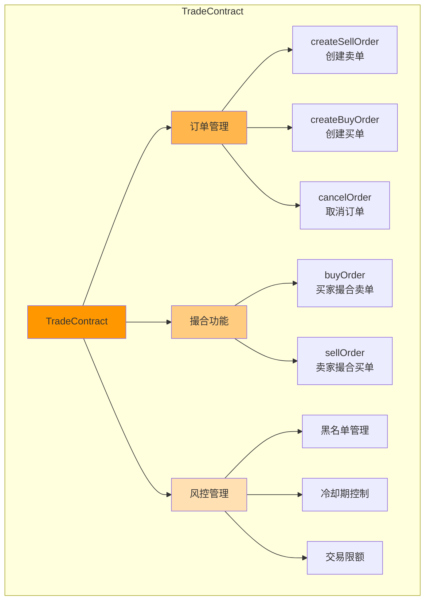
```mermaid
graph TB
    subgraph "TradeContract"
        Trade[TradeContract]

        Trade --> Order[订单管理]
        Trade --> Match[撮合功能]
        Trade --> Risk[风控管理]

        Order --> CreateSell[createSellOrder<br/>创建卖单]
        Order --> CreateBuy[createBuyOrder<br/>创建买单]
        Order --> Cancel[cancelOrder<br/>取消订单]

        Match --> BuyOrder[buyOrder<br/>买家撮合卖单]
        Match --> SellOrder[sellOrder<br/>卖家撮合买单]

        Risk --> Blacklist[黑名单管理]
        Risk --> Cooldown[冷却期控制]
        Risk --> Limits[交易限额]
    end

    style Trade fill:#FF9800
    style Order fill:#FFB74D
    style Match fill:#FFCC80
    style Risk fill:#FFE0B2
```

#### 核心功能

**1. 创建订单**

**创建卖单**：

```solidity
function createSellOrder(
    address token,
    string calldata propertyId,
    uint256 amount,
    uint256 price
) external nonReentrant whenNotPaused returns (uint256 orderId)
```

**流程**：

-   ✅ KYC 验证
-   ✅ 黑名单检查
-   ✅ 交易限额验证
-   ✅ 托管 PropertyToken 到合约
-   ✅ 记录订单信息

**创建买单**：

```solidity
function createBuyOrder(
    address token,
    string calldata propertyId,
    uint256 amount,
    uint256 price
) external nonReentrant whenNotPaused returns (uint256 orderId)
```

**流程**：

-   ✅ KYC 验证
-   ✅ 黑名单检查
-   ✅ 交易限额验证
-   ✅ 托管支付代币（gross 金额）到合约
-   ✅ 记录订单信息

**2. 撮合交易**

**买家撮合卖单**：

```solidity
function buyOrder(uint256 sellOrderId)
    external
    nonReentrant
    whenNotPaused
```

**流程**：

1. 验证订单有效性
2. KYC 验证（买家和卖家）
3. 冷却期检查
4. 计算总金额和手续费
5. 转账 PropertyToken 给买家
6. 转账支付代币给卖家（扣除手续费）
7. 转账手续费到 Treasury
8. 更新订单状态

**3. 风控管理**

| 风控参数            | 说明             | 默认值      |
| ------------------- | ---------------- | ----------- |
| **minTradeAmount**  | 最小成交数量     | 1           |
| **maxTradeAmount**  | 最大成交数量     | 0（不限制） |
| **cooldownPeriod**  | 冷却期（秒）     | 10          |
| **MAX_USER_ORDERS** | 每用户最大订单数 | 100         |
| **blacklist**       | 黑名单           | mapping     |

#### 订单数据结构

```solidity
struct Order {
    uint256 id;              // 订单ID
    address creator;         // 创建者
    address token;           // PropertyToken地址
    string propertyId;       // 房屋ID
    uint256 amount;          // 剩余数量
    uint256 price;           // 单价
    bool isSellOrder;        // true: 卖单; false: 买单
    bool active;             // 订单是否有效
    uint40 createdAt;        // 创建时间
    uint256 feeBps;          // 费率快照
    address paymentToken;    // 支付代币
}
```

#### 安全特性

-   ✅ **KYC 验证**: 买卖双方都需要通过 KYC
-   ✅ **黑名单**: 防止恶意用户
-   ✅ **冷却期**: 防止高频交易攻击
-   ✅ **订单限制**: 防止 DoS 攻击
-   ✅ **手续费**: 自动收取并转入 Treasury

---

### 6.4 AbleToken（ABLE 代币合约）

#### 合约架构

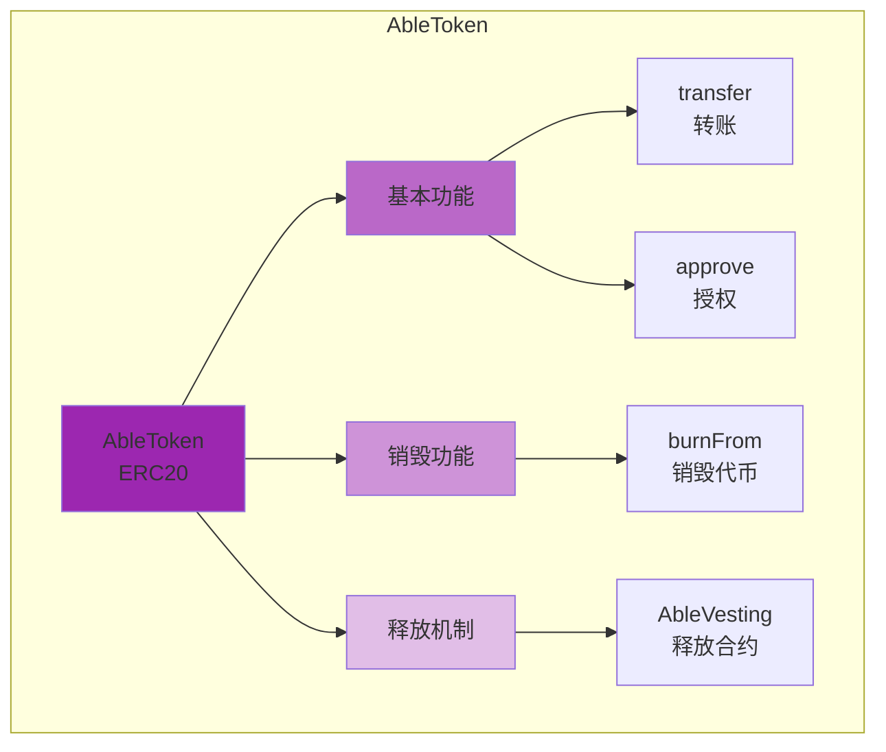
```mermaid
graph TB
    subgraph "AbleToken"
        Able[AbleToken<br/>ERC20]

        Able --> Basic[基本功能]
        Able --> Burn[销毁功能]
        Able --> Vesting[释放机制]

        Basic --> Transfer[transfer<br/>转账]
        Basic --> Approve[approve<br/>授权]

        Burn --> BurnFrom[burnFrom<br/>销毁代币]

        Vesting --> AbleVesting[AbleVesting<br/>释放合约]
    end

    style Able fill:#9C27B0
    style Basic fill:#BA68C8
    style Burn fill:#CE93D8
    style Vesting fill:#E1BEE7
```

#### 核心特性

**1. 代币参数**

| 参数         | 值                 | 说明       |
| ------------ | ------------------ | ---------- |
| **名称**     | ABLE               | 代币名称   |
| **符号**     | ABLE               | 代币符号   |
| **精度**     | 18                 | 小数位数   |
| **总供应量** | 1,000,000,000 ABLE | 固定供应量 |

**2. 代币分配**

```solidity
// 7个分配模块
enum Module {
    CommunityIncentives,  // 社区激励: 42% (420M)
    TeamAdvisors,         // 团队顾问: 20% (200M)
    DaoFund,              // DAO基金: 15% (150M)
    PrivateInvestors,     // 私募投资者: 12% (120M)
    IEO,                  // IEO: 5% (50M)
    NodeIncentives,       // 节点激励: 4% (40M)
    Airdrop               // 空投: 2% (20M)
}
```

---

## 7. 完整系统架构

### 7.1 全局架构图

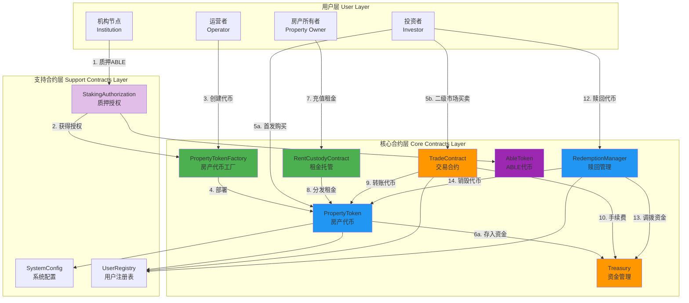
```mermaid
graph TB
    subgraph "用户层 User Layer"
        User[投资者<br/>Investor]
        PropertyOwner[房产所有者<br/>Property Owner]
        Operator[运营者<br/>Operator]
        Institution[机构节点<br/>Institution]
    end

    subgraph "核心合约层 Core Contracts Layer"
        Factory[PropertyTokenFactory<br/>房产代币工厂]
        Token[PropertyToken<br/>房产代币]
        Treasury[Treasury<br/>资金管理]
        Rent[RentCustodyContract<br/>租金托管]
        Redemption[RedemptionManager<br/>赎回管理]
        Trade[TradeContract<br/>交易合约]
        Able[AbleToken<br/>ABLE代币]
    end

    subgraph "支持合约层 Support Contracts Layer"
        SystemConfig[SystemConfig<br/>系统配置]
        UserRegistry[UserRegistry<br/>用户注册表]
        Staking[StakingAuthorization<br/>质押授权]
    end

    %% 机构入驻流程
    Institution -->|1. 质押ABLE| Staking
    Staking -->|2. 获得授权| Factory

    %% 房产上链流程
    Operator -->|3. 创建代币| Factory
    Factory -->|4. 部署| Token

    %% 投资者首发购买流程
    User -->|5a. 首发购买| Token
    Token -->|6a. 存入资金| Treasury

    %% 租金分红流程
    PropertyOwner -->|7. 充值租金| Rent
    Rent -->|8. 分发租金| Token

    %% 二级市场交易流程
    User -->|5b. 二级市场买卖| Trade
    Trade -->|9. 转账代币| Token
    Trade -->|10. 手续费| Treasury

    %% 代币赎回流程
    User -->|12. 赎回代币| Redemption
    Redemption -->|13. 调拨资金| Treasury
    Redemption -->|14. 销毁代币| Token

    %% 支持合约交互
    Token --> SystemConfig
    Token --> UserRegistry
    Trade --> UserRegistry
    Redemption --> UserRegistry
    Staking --> Able

    style Factory fill:#4CAF50
    style Token fill:#2196F3
    style Treasury fill:#FF9800
    style Rent fill:#4CAF50
    style Redemption fill:#2196F3
    style Trade fill:#FF9800
    style Able fill:#9C27B0
    style Staking fill:#E1BEE7
```

### 7.2 合约交互流程

#### 流程 1：机构入驻

**参与合约**: Institution → AbleToken → StakingAuthorization → PropertyTokenFactory

**流程描述**:

1. 机构质押 ABLE 代币到 StakingAuthorization 合约
2. StakingAuthorization 计算授权额度（1 ABLE = 1 USD 授权额度）
3. 机构获得房产上链授权
4. 机构可以通过 PropertyTokenFactory 创建房产代币

**关键步骤**:

-   ✅ 机构调用 `AbleToken.approve(staking, amount)`
-   ✅ 机构调用 `StakingAuthorization.stake(amount)`
-   ✅ StakingAuthorization 更新 `authorizedQuota[institution]`
-   ✅ 机构可以创建总价值不超过授权额度的房产代币

---

#### 流程 2：房产上链

**参与合约**: Operator → PropertyTokenFactory → PropertyToken

**流程描述**:

1. 运营者通过 PropertyTokenFactory 创建新的房产代币
2. Factory 验证机构的授权额度
3. Factory 部署 PropertyToken 的 UUPS 代理合约
4. Factory 初始化 PropertyToken 参数
5. Factory 扣减机构的授权额度

**关键步骤**:

-   ✅ 运营者调用 `PropertyTokenFactory.createPropertyToken(params)`
-   ✅ Factory 验证 `StakingAuthorization.checkAuthorization(institution, tokenValue)`
-   ✅ Factory 部署并初始化 PropertyToken
-   ✅ Factory 调用 `StakingAuthorization.consumeQuota(institution, tokenValue)`

---

#### 流程 3：投资者购买

**参与合约**: User → PropertyToken → Treasury

**流程描述**:

1. 投资者通过 PropertyToken 购买代币
2. PropertyToken 验证用户 KYC 状态
3. PropertyToken 验证房产状态（拍卖中）
4. PropertyToken 转账代币给投资者
5. PropertyToken 将购买资金存入 Treasury

**关键步骤**:

-   ✅ 投资者调用 `PropertyToken.buyTokens(amount)`
-   ✅ PropertyToken 验证 `UserRegistry.isKYCVerified(user)`
-   ✅ PropertyToken 验证 `status == 1`（拍卖中）
-   ✅ PropertyToken 调用 `Treasury.deposit(amount)`

---

#### 流程 4：租金分红

**参与合约**: PropertyOwner → RentCustodyContract → PropertyToken → Investors

**流程描述**:

1. 房产所有者充值租金到 RentCustodyContract
2. RentCustodyContract 记录充值信息
3. 运营者批量分发租金给代币持有者
4. RentCustodyContract 转账租金给投资者

**关键步骤**:

-   ✅ 房产所有者调用 `RentCustodyContract.depositForHouse(houseId, amount)`
-   ✅ RentCustodyContract 记录 `DepositRecord`
-   ✅ 运营者调用 `RentCustodyContract.distributeRentForHouse(distributionId, houseId, recipients[], amounts[])`
-   ✅ RentCustodyContract 批量转账（最大 1000 个接收者）

---

#### 流程 5：二级市场交易

**参与合约**: Seller/Buyer → TradeContract → PropertyToken → Treasury

**流程描述**:

1. 卖家创建卖单，托管 PropertyToken 到 TradeContract
2. 买家撮合卖单，支付代币 + 手续费
3. TradeContract 转账 PropertyToken 给买家
4. TradeContract 转账支付代币给卖家（扣除手续费）
5. TradeContract 转账手续费到 Treasury

**关键步骤**:

-   ✅ 卖家调用 `TradeContract.createSellOrder(token, propertyId, amount, price)`
-   ✅ TradeContract 托管 `PropertyToken.transferFrom(seller, trade, amount)`
-   ✅ 买家调用 `TradeContract.buyOrder(sellOrderId)`
-   ✅ TradeContract 验证 KYC、计算手续费、执行转账

---

#### 流程 6：代币赎回

**参与合约**: PropertyToken → RedemptionManager → Treasury → User

**流程描述**:

1. 房产拍卖成功，状态变为 7
2. 管理员设置总可赎回金额快照
3. 投资者赎回代币
4. RedemptionManager 计算赎回金额（基于快照）
5. RedemptionManager 销毁代币并转账资金给投资者

**关键步骤**:

-   ✅ 管理员调用 `RedemptionManager.setTotalRedeemableAmount(propertyToken, amount)`
-   ✅ 投资者调用 `RedemptionManager.redeemTokens(propertyToken)`
-   ✅ RedemptionManager 验证 `PropertyToken.status() == 7`
-   ✅ RedemptionManager 计算赎回金额并扣除 0.1%手续费
-   ✅ RedemptionManager 调用 `PropertyToken.burn(user, amount)`

---

## 8. 部署架构

### 8.1 部署顺序

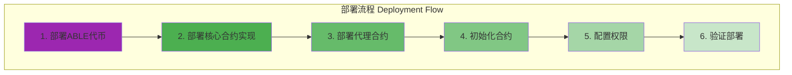
```mermaid
graph TB
    subgraph "部署流程 Deployment Flow"
        Step1[1. 部署ABLE代币]
        Step2[2. 部署核心合约实现]
        Step3[3. 部署代理合约]
        Step4[4. 初始化合约]
        Step5[5. 配置权限]
        Step6[6. 验证部署]

        Step1 --> Step2
        Step2 --> Step3
        Step3 --> Step4
        Step4 --> Step5
        Step5 --> Step6
    end

    style Step1 fill:#9C27B0
    style Step2 fill:#4CAF50
    style Step3 fill:#66BB6A
    style Step4 fill:#81C784
    style Step5 fill:#A5D6A7
    style Step6 fill:#C8E6C9
```

### 8.2 详细步骤

#### 步骤 1：部署 ABLE 代币及相关合约

```
1. AbleToken
   - 固定供应量：1,000,000,000 ABLE
   - 部署后立即铸造全部代币给部署者

2. AbleVesting
   - 管理7个分配模块的释放
   - 设置TGE时间和释放参数

3. AbleVestingFactory
   - 批量创建Vesting合约

4. StakingAuthorization
   - 质押授权合约
   - 设置质押比例（STAKE_RATIO = 1）
```

#### 步骤 2：部署核心合约实现

```
1. PropertyTokenFactory Implementation
2. PropertyToken Implementation
3. Treasury Implementation
4. RentCustodyContract Implementation
5. RedemptionManager Implementation
6. TradeContract Implementation
```

#### 步骤 3：部署代理合约

```
1. PropertyTokenFactory Proxy (UUPS)
2. Treasury Proxy (UUPS)
3. RentCustodyContract Proxy (UUPS)
4. RedemptionManager Proxy (UUPS)
5. TradeContract Proxy (UUPS)
```

#### 步骤 4：初始化合约

```
1. 初始化PropertyTokenFactory
   - 设置SystemConfig地址
   - 设置UserRegistry地址
   - 设置Treasury地址
   - 设置StakingAuthorization地址

2. 初始化Treasury
   - 设置SystemConfig地址
   - 设置支付代币地址

3. 初始化RentCustodyContract
   - 设置SystemConfig地址
   - 设置紧急管理员

4. 初始化RedemptionManager
   - 设置SystemConfig地址
   - 设置UserRegistry地址
   - 设置Treasury地址

5. 初始化TradeContract
   - 设置SystemConfig地址
   - 设置UserRegistry地址
   - 设置Treasury地址
```

#### 步骤 5：配置权限

```
1. PropertyTokenFactory
   - 授予OPERATOR_ROLE（运营者）
   - 授予UPGRADER_ROLE（升级者）

2. Treasury
   - 授予OPERATOR_ROLE
   - 授予UPGRADER_ROLE

3. RentCustodyContract
   - 授予OPERATOR_ROLE
   - 授予UPGRADER_ROLE
   - 设置紧急管理员

4. RedemptionManager
   - 授予ADMIN_ROLE
   - 授予UPGRADER_ROLE

5. TradeContract
   - 授予ADMIN_ROLE
   - 授予UPGRADER_ROLE

6. SystemConfig
   - 配置支付代币地址
   - 配置交易手续费率
   - 配置其他系统参数
```

#### 步骤 6：验证部署

```
1. 测试质押ABLE代币
   - 机构质押ABLE代币
   - 验证授权额度计算正确

2. 测试创建PropertyToken
   - 运营者创建房产代币
   - 验证代理合约部署成功
   - 验证初始化参数正确

3. 测试购买代币
   - 投资者购买PropertyToken
   - 验证资金存入Treasury

4. 测试租金分红
   - 房产所有者充值租金
   - 批量分发给代币持有者
   - 验证分发记录正确

5. 测试二级市场交易
   - 创建买卖订单
   - 撮合交易
   - 验证手续费收取

6. 测试赎回
   - 设置赎回快照
   - 投资者赎回代币
   - 验证赎回金额计算正确
```

---

## 9. 总结

### 9.1 架构特点

**优势**：

-   ✅ **完整业务闭环**: 从机构入驻到资产退出的全流程支持
-   ✅ **模块化设计**: 7 个核心合约各司其职，易于扩展
-   ✅ **可升级**: UUPS 代理模式，支持合约升级
-   ✅ **安全性高**: 多重安全机制（重入保护、暂停机制、访问控制、KYC 验证）
-   ✅ **合规性强**: KYC 验证，符合监管要求
-   ✅ **灵活性好**: 支持多种资产类型和业务场景
-   ✅ **质押授权**: 机构需质押 ABLE 代币才能上链资产，保证平台质量

**改进建议**：

-   💡 完善质押授权机制（StakingAuthorization 合约开发）
-   💡 添加更多的合规模块（如地域限制、投资者分类）
-   💡 集成更多的 DeFi 协议（如 Aave、Compound）
-   💡 支持跨链资产（通过桥接协议）
-   💡 优化二级市场交易（支持部分成交、限价单、市价单）

### 9.2 适用场景

基于完整的 7 合约系统，RWA-HUSD 平台适用于以下场景：

-   ✅ **房地产代币化**: 住宅、商业地产、工业地产
-   ✅ **股票代币化**: 私募股权、上市公司股票
-   ✅ **私募基金代币化**: PE 基金、VC 基金、对冲基金
-   ✅ **艺术品代币化**: 绘画、雕塑、收藏品
-   ✅ **债券代币化**: 企业债、政府债
-   ✅ **其他实物资产代币化**: 贵金属、大宗商品

### 9.3 核心竞争力

-   🎯 **质押授权机制**: 通过 ABLE 代币质押，确保机构资质和平台资产质量
-   🎯 **完整业务流程**: 覆盖资产上链、交易、分红、赎回全生命周期
-   🎯 **企业级安全**: 多层安全机制，符合金融级安全标准
-   🎯 **监管合规**: 内置 KYC/AML 验证，满足全球监管要求
-   🎯 **可扩展架构**: 模块化设计，易于添加新功能和支持新资产类型

---

**文档维护**: RWA-HUSD 技术团队
**联系方式**: tech@rwa-husd.com
**最后更新**: 2025-10-11 08:30:00 CST
