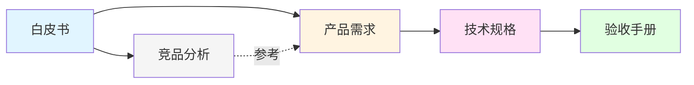

# [000] USDable Chain 文档体系索引

**文档编号**: [000]  
**文档版本**: v1.0  
**创建时间**: 2025-10-16  
**文档类型**: 文档索引  
**所属项目**: USDable Chain RWA 专用链

---

## 文档体系概览

USDable Chain 文档体系采用分层架构,从产品愿景到技术实现,再到验收标准,形成完整的文档链条。

```mermaid
graph TB
    A[USDable Chain 白皮书<br/>L1 产品愿景<br/>待创建] --> B[[006] 竞品分析<br/>Centrifuge 与 Plume Network]
    A --> C[[007] 公链开发需求文档<br/>L2 产品需求]
    
    B -.参考.-> C
    
    C --> D[[008] RWA 专用链技术规格书<br/>L3 技术规格]
    
    D --> E[[012] RWA 专用链验收手册<br/>L4 验收手册<br/>待创建]
    
    style A fill:#e1f5ff,stroke:#0066cc,stroke-width:2px
    style B fill:#f5f5f5,stroke:#666,stroke-width:1px
    style C fill:#fff4e1,stroke:#ff9900,stroke-width:2px
    style D fill:#ffe1f5,stroke:#cc0066,stroke-width:2px
    style E fill:#e1ffe1,stroke:#00cc66,stroke-width:2px
```

---

## 文档清单

### L1 产品愿景层

#### USDable Chain 白皮书 (待创建)
- **状态**: 待创建
- **目标读者**: 投资人、合作伙伴、社区成员
- **核心内容**: 产品愿景、市场定位、商业模式、代币经济学
- **优先级**: P1

---

### L0 参考文档层

#### [006] 竞品分析-Centrifuge与Plume-Network
- **状态**: ✅ 已完成
- **文件路径**: `RealChain-Project/RWA-Blockchain-PRD/[006]竞品分析-Centrifuge与Plume-Network.md`
- **目标读者**: 产品团队、技术团队
- **核心内容**:
  - Centrifuge 分析 (核心业务、区块链特性、公链与业务耦合、值得学习的地方)
  - Plume Network 分析 (核心业务、区块链特性、公链与业务耦合、值得学习的地方)
  - 对比分析 (技术架构、合规方案、代币经济、生态策略)
  - 对 USDable Chain 的启示
- **文档篇幅**: 336 行
- **优先级**: P0
- **参考链接**:
  - [Centrifuge 官方文档](https://docs.centrifuge.io/)
  - [Plume Network 官方文档](https://docs.plumenetwork.xyz/)

---

### L2 产品需求层

#### [007] USDable Chain 公链开发需求文档
- **状态**: ✅ 已完成
- **文件路径**: `RealChain-Project/RWA-Blockchain-PRD/[007]USDable-Chain-公链开发需求文档.md`
- **目标读者**: 产品团队、技术团队、项目管理团队
- **核心内容**:
  - 总体设计原则 (核心理念、技术准则、差异化定位)
  - 核心功能模块 (钱包、RPC、浏览器、节点、Token 标准、DEX、预言机、跨链桥)
  - 基础设施模块 (SaaS 上链、合规/KYC/AML)
  - 安全与合规模块
  - 运维与监控模块
  - 对外接口规范
- **文档篇幅**: 465 行 (含相关文档章节)
- **优先级**: P0
- **参考文档**: [006] 竞品分析、[008] 技术规格书

---

### L3 技术规格层

#### [008] RWA 专用链技术规格书
- **状态**: ✅ 已完成 (v1.0)
- **文件路径**: `RWA 专用链技术规格书 v1.0.md`
- **目标读者**: 第三方区块链开发团队、审计团队、SRE 团队、合规顾问
- **核心内容**:
  - 背景与目标
  - 术语缩写
  - 网络与节点 (节点类型、P2P 网络、数据可用性)
  - 共识、执行与费用市场 (PoS、EVM、EIP-1559)
  - 合规引擎 (Policy DSL、preTransfer 钩子、错误码)
  - RWA 资产标准 (IRWAToken 接口、生命周期状态机)
  - 分红系统 (调度、计税、分配)
  - 金融协议 (DEX/AMM、借贷/抵押/清算、稳定币、保险池)
  - 预言机与风控 (价格聚合、NAV 计算、异常检测)
  - 跨链分红 (桥架构、合规、限额)
  - 治理与升级 (提案类型、投票、Timelock)
  - 数据、事件、索引 (事件 Schema、API/SDK、限流)
  - 安全、审计、SRE (合约安全、运维、隐私)
  - 非功能需求 (性能、可用性、可扩展性指标)
  - 交付清单 (源代码、部署脚本、文档、监控)
  - 验收矩阵
- **文档篇幅**: 491 行
- **优先级**: P0
- **参考文档**: [007] 公链开发需求文档

---

### L4 验收手册层

#### [012] RWA 专用链验收手册 (待创建)
- **状态**: 待创建
- **目标读者**: 测试团队、审计团队、项目管理团队
- **核心内容**:
  - MVP 验收标准 (P0 模块)
  - 扩展功能验收标准 (P1 模块)
  - 测试脚本
  - 部署清单
  - 验收流程
- **优先级**: P0
- **参考文档**: [008] 技术规格书

---

## 文档关系说明

### 文档依赖关系



### 文档类型说明

| 文档层级 | 文档类型 | 目标读者 | 核心目标 | Diátaxis 分类 |
|---------|---------|---------|---------|--------------|
| L1 | 产品愿景 | 投资人、合作伙伴 | 阐述产品愿景和商业模式 | Explanation |
| L0 | 参考文档 | 产品团队、技术团队 | 提供竞品分析和最佳实践 | Explanation |
| L2 | 产品需求 | 产品团队、技术团队 | 定义产品需求和功能模块 | Reference |
| L3 | 技术规格 | 开发团队、审计团队 | 提供详细的技术实现规格 | Reference |
| L4 | 验收手册 | 测试团队、审计团队 | 提供验收标准和测试脚本 | How-to Guide |

---

## 文档更新记录

### v1.0 (2025-10-16)
- ✅ 创建文档体系索引
- ✅ 完成 [006] 竞品分析文档
- ✅ 完成 [007] 公链开发需求文档
- ✅ 完成 [008] RWA 专用链技术规格书 v1.0
- ✅ 建立文档间的双向引用关系

### 待完成
- ⏳ 创建 USDable Chain 白皮书
- ⏳ 创建 [012] RWA 专用链验收手册
- ⏳ 优化 [008] 技术规格书 (增加架构图、序列图、术语表)

---

## 文档使用指南

### 新成员入门路径

1. **投资人/合作伙伴**:
   - 阅读: 白皮书 (待创建) → [006] 竞品分析 → [007] 产品需求

2. **产品经理**:
   - 阅读: [006] 竞品分析 → [007] 产品需求 → [008] 技术规格书

3. **技术开发人员**:
   - 阅读: [007] 产品需求 → [008] 技术规格书 → [012] 验收手册 (待创建)

4. **测试/审计人员**:
   - 阅读: [008] 技术规格书 → [012] 验收手册 (待创建)

---

## 文档维护规范

### 文档命名规范

- **格式**: `[编号]文档名称.md`
- **编号规则**:
  - `[000]`: 文档索引
  - `[001-099]`: 产品愿景和参考文档
  - `[100-199]`: 产品需求文档
  - `[200-299]`: 技术规格文档
  - `[300-399]`: 验收和测试文档

### 文档版本管理

- 使用 Git 进行版本控制
- 每次重大更新增加版本号 (v1.0 → v1.1 → v2.0)
- 在文档开头记录版本号和更新时间

### 文档更新流程

1. 创建或修改文档
2. 更新文档索引 ([000])
3. 更新相关文档的引用关系
4. 提交 Git commit
5. 推送到远程仓库

---

## 联系方式

如有文档相关问题,请联系:
- **项目负责人**: (待补充)
- **文档维护**: (待补充)

---

**文档索引结束**

