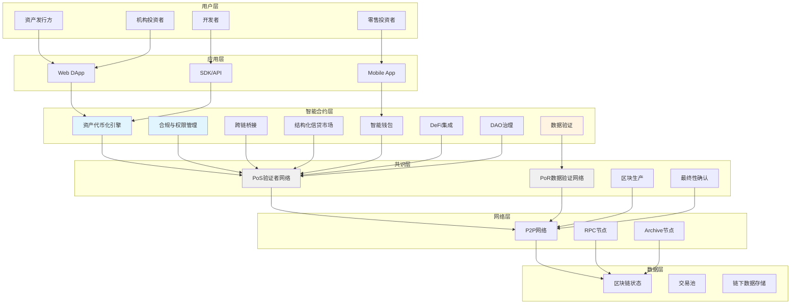

# USDable Chain 开发需求文档 - 第 2 章: 技术架构

**文档编号**: [004-2]  
**文档版本**: v2.0  
**创建时间**: 2025-10-15 13:32 CST  
**更新时间**: 2025-10-15 15:30 CST  
**文档类型**: Product Requirements Document (PRD)  
**所属项目**: USDable Chain 全栈公链开发

---

## 2.1 整体架构设计

### 2.1.1 架构原则

-   ✅ **模块化**: 7 个核心模块,松耦合设计
-   ✅ **可扩展**: 支持水平扩展,TPS≥2000
-   ✅ **安全优先**: 多层安全设计,通过 SlowMist、CertiK 等顶级机构审计
-   ✅ **合规内置**: XRWA 标准 (基于 ERC-3643 扩展)、Compliance Guard、SBT 身份凭证
-   ✅ **开发者友好**: EVM 兼容,Solidity 开发
-   ✅ **节点生态**: 4 类业务节点 (资产、合规、服务、推广),质押要求 + 业务激励

### 2.1.2 系统架构图



---

## 2.2 共识机制 (混合 PoS + BFT + PoR)

### 2.2.1 设计目标

-   ✅ **快速确认**: ≤ 2 秒区块时间
-   ✅ **高吞吐**: ≥ 2000 TPS
-   ✅ **拜占庭容错**: BFT 算法确保 2/3+1 节点容错
-   ✅ **数据验证**: PoR 验证真实世界数据的准确性
-   ✅ **经济安全**: 通过质押和削减机制确保安全

### 2.2.2 PoS (Proof of Stake) 层

**职责**: 验证链上交易,生产区块

**核心组件**:

1. **核心节点网络**:

    - 最少质押: 100,000 ABLE 代币
    - 核心节点数量: 初期 21 个
    - 选举机制: 基于质押量的加权随机选举

2. **区块生产**:

    - 区块时间: ≤ 2 秒
    - 区块大小: 最大 30MB
    - Gas 限制: 30,000,000 gas

3. **BFT 最终性确认**:

    - 使用 BFT (Byzantine Fault Tolerance) 算法
    - 2/3+1 核心节点确认后达到最终性
    - 最终性时间: ≤ 6 秒 (3 个区块)
    - 超时时间: 1 秒
    - 最大重试次数: 3

4. **奖励与惩罚**:
    - 区块奖励: 每区块 10 ABLE 代币
    - 质押年化收益: 5-8%
    - 削减比例: 恶意行为削减 10-100%质押

**伪代码示例**:

```solidity
contract PoSConsensus {
    struct Validator {
        address addr;
        uint256 stake;
        uint256 totalRewards;
        bool isActive;
    }

    mapping(address => Validator) public validators;
    address[] public validatorList;

    uint256 public constant MIN_STAKE = 10000 ether; // 10,000 RWA
    uint256 public constant BLOCK_REWARD = 10 ether; // 10 RWA

    // 注册验证者
    function registerValidator() external payable {
        require(msg.value >= MIN_STAKE, "Insufficient stake");
        require(!validators[msg.sender].isActive, "Already registered");

        validators[msg.sender] = Validator({
            addr: msg.sender,
            stake: msg.value,
            totalRewards: 0,
            isActive: true
        });

        validatorList.push(msg.sender);
    }

    // 选举区块生产者
    function electBlockProducer(uint256 blockNumber) public view returns (address) {
        // 基于质押量的加权随机选举
        uint256 totalStake = getTotalStake();
        uint256 randomSeed = uint256(keccak256(abi.encodePacked(blockNumber)));
        uint256 target = randomSeed % totalStake;

        uint256 cumulative = 0;
        for (uint i = 0; i < validatorList.length; i++) {
            address validator = validatorList[i];
            if (validators[validator].isActive) {
                cumulative += validators[validator].stake;
                if (cumulative >= target) {
                    return validator;
                }
            }
        }

        revert("No validator found");
    }

    // 分发区块奖励
    function distributeBlockReward(address producer) external {
        require(validators[producer].isActive, "Invalid producer");

        validators[producer].totalRewards += BLOCK_REWARD;
        payable(producer).transfer(BLOCK_REWARD);
    }
}
```

### 2.2.3 PoR (Proof of Representation) 层

**职责**: 验证真实世界数据的准确性

**参考**: Plume Network 的 Proof of Representation 机制

**核心组件**:

1. **数据提供者网络**:

    - 最少质押: 5,000 ABLE 代币
    - 数据提供者数量: 初期 10 个,逐步扩展到 50+
    - 数据源: 房地产评估、艺术品鉴定、碳信用验证等

2. **数据验证流程**:

    - 数据提供者提交数据 + zkTLS 证明
    - 至少 3 个独立数据源确认
    - 数据一致性检查
    - 链上记录验证结果

3. **奖励与惩罚**:
    - 数据验证奖励: 每次验证 1 ABLE 代币
    - 质押年化收益: 10-15%
    - 削减比例: 提供错误数据削减 20-100%质押

**伪代码示例**:

```solidity
contract PoRConsensus {
    struct DataProvider {
        address addr;
        uint256 stake;
        uint256 totalVerifications;
        uint256 successfulVerifications;
        bool isActive;
    }

    struct DataProof {
        bytes32 dataHash;
        bytes zkProof;
        address[] providers;
        uint256 confirmations;
        bool verified;
    }

    mapping(address => DataProvider) public dataProviders;
    mapping(bytes32 => DataProof) public dataProofs;

    uint256 public constant MIN_STAKE = 5000 ether; // 5,000 RWA
    uint256 public constant VERIFICATION_REWARD = 1 ether; // 1 RWA
    uint256 public constant MIN_CONFIRMATIONS = 3;

    // 注册数据提供者
    function registerDataProvider() external payable {
        require(msg.value >= MIN_STAKE, "Insufficient stake");
        require(!dataProviders[msg.sender].isActive, "Already registered");

        dataProviders[msg.sender] = DataProvider({
            addr: msg.sender,
            stake: msg.value,
            totalVerifications: 0,
            successfulVerifications: 0,
            isActive: true
        });
    }

    // 提交数据验证
    function submitDataProof(
        bytes32 dataHash,
        bytes memory zkProof
    ) external {
        require(dataProviders[msg.sender].isActive, "Not a data provider");

        DataProof storage proof = dataProofs[dataHash];

        // 首次提交
        if (proof.confirmations == 0) {
            proof.dataHash = dataHash;
            proof.zkProof = zkProof;
        }

        // 记录确认
        proof.providers.push(msg.sender);
        proof.confirmations++;

        dataProviders[msg.sender].totalVerifications++;

        // 达到最小确认数
        if (proof.confirmations >= MIN_CONFIRMATIONS) {
            proof.verified = true;

            // 分发奖励
            for (uint i = 0; i < proof.providers.length; i++) {
                address provider = proof.providers[i];
                dataProviders[provider].successfulVerifications++;
                payable(provider).transfer(VERIFICATION_REWARD);
            }
        }
    }
}
```

---

## 2.3 网络拓扑

### 2.3.1 节点类型

#### 1. 验证者节点 (Validator Nodes)

-   **数量**: 初期 21 个,逐步扩展到 100+
-   **职责**: 验证交易、生产区块、参与共识
-   **硬件要求**: 8 核 CPU、32GB RAM、1TB SSD、100Mbps 网络

#### 2. 全节点 (Full Nodes)

-   **数量**: 无限制
-   **职责**: 同步完整区块链数据、验证交易、提供 RPC 服务
-   **硬件要求**: 4 核 CPU、16GB RAM、500GB SSD、50Mbps 网络

#### 3. 轻节点 (Light Nodes)

-   **数量**: 无限制
-   **职责**: 同步区块头、验证交易、提供轻量级 RPC 服务
-   **硬件要求**: 2 核 CPU、4GB RAM、50GB SSD、10Mbps 网络

#### 4. Archive 节点 (Archive Nodes)

-   **数量**: 5-10 个
-   **职责**: 存储完整历史数据、提供历史查询服务
-   **硬件要求**: 16 核 CPU、64GB RAM、10TB SSD、1Gbps 网络

### 2.3.2 网络通信

-   **P2P 协议**: libp2p
-   **共识协议**: BFT (Byzantine Fault Tolerance)
-   **数据同步**: 区块同步 + 状态同步
-   **网络加密**: TLS 1.3

---

## 2.4 技术栈选择

### 2.4.1 核心技术栈

| 层级             | 技术选择                       | 说明           |
| ---------------- | ------------------------------ | -------------- |
| **虚拟机**       | EVM (Ethereum Virtual Machine) | 兼容以太坊生态 |
| **智能合约语言** | Solidity 0.8.x                 | 成熟稳定       |
| **共识机制**     | 混合 PoS + PoR                 | 专为 RWA 设计  |
| **P2P 网络**     | libp2p                         | 成熟的 P2P 库  |
| **数据库**       | LevelDB / RocksDB              | 高性能 KV 存储 |
| **RPC 接口**     | JSON-RPC 2.0                   | 兼容以太坊工具 |

### 2.4.2 开发工具

| 工具类型         | 工具选择                 | 说明             |
| ---------------- | ------------------------ | ---------------- |
| **智能合约开发** | Hardhat / Foundry        | 成熟的开发框架   |
| **测试框架**     | Hardhat Test / Forge     | 完整的测试工具   |
| **安全审计**     | Slither / Mythril        | 自动化安全分析   |
| **前端框架**     | React + ethers.js        | 成熟的 Web3 前端 |
| **钱包集成**     | MetaMask / WalletConnect | 广泛支持         |

---

**文档结束**

**上一章节**: [004-1]项目概述.md  
**下一章节**: [004-3]核心功能模块.md  
**返回主索引**: [004]RWA 公链开发需求文档-主索引.md

**版权声明**: 本文档仅供内部使用,未经授权不得外传。
