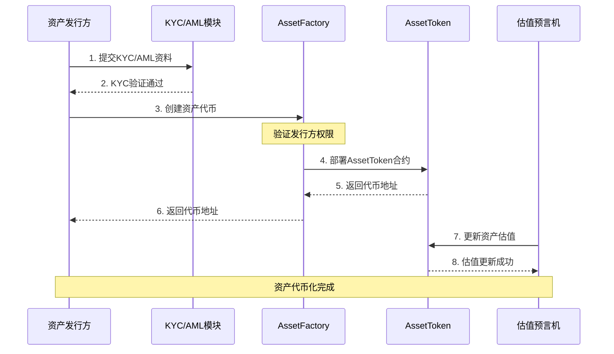
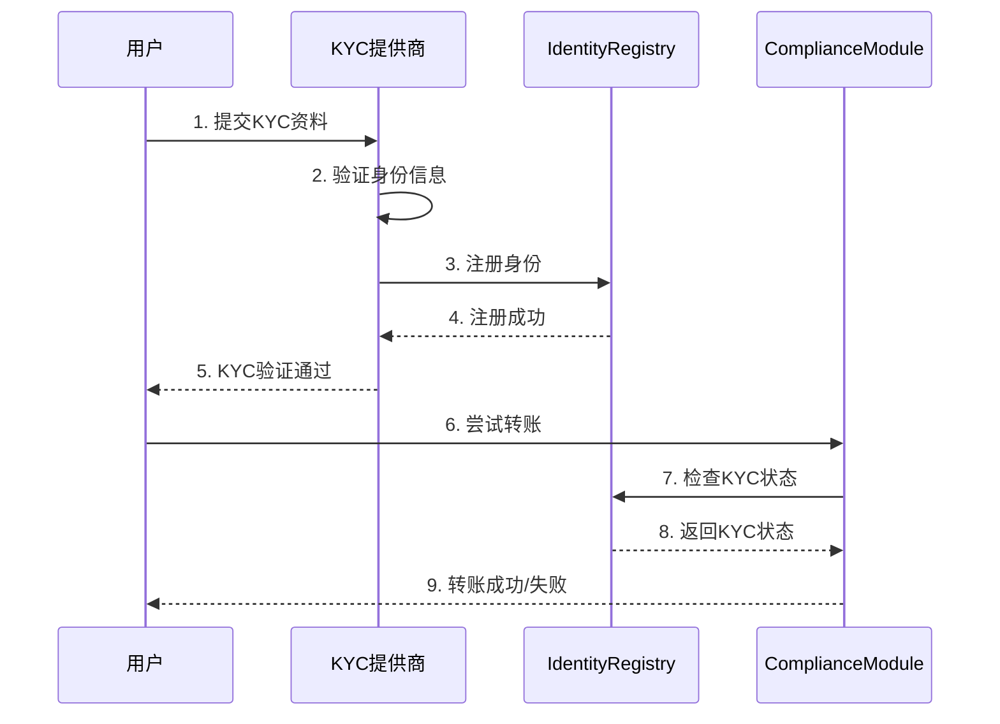

# RWA 公链开发需求文档 - 第 3 章: 核心功能模块

**文档编号**: [004-3]  
**文档版本**: v1.0  
**创建时间**: 2025-10-15 13:32 CST  
**文档类型**: Product Requirements Document (PRD)  
**所属项目**: RWA 全栈公链开发

---

## 模块概览

本章详细描述 8 个核心功能模块的设计和实现:

1. **资产代币化引擎** (Asset Tokenization Engine)
2. **合规与权限管理** (Compliance & Permission)
3. **真实世界数据验证** (Real-World Data Verification)
4. **跨链互操作** (Cross-Chain Interoperability)
5. **结构化信贷市场** (Structured Credit Market)
6. **智能钱包与身份** (Smart Wallet & Identity)
7. **DeFi 集成** (DeFi Integration)
8. **DAO 治理** (DAO Governance)

---

## 3.1 资产代币化引擎 (Asset Tokenization Engine)

### 3.1.1 模块概述

**参考**: Plume Network Arc + Centrifuge Pool System

**核心功能**:

-   ✅ 资产上链 (Asset Onboarding)
-   ✅ 代币发行 (Token Issuance)
-   ✅ 元数据管理 (Metadata Management)
-   ✅ 资产估值 (Asset Valuation)

### 3.1.2 核心合约

#### AssetFactory (资产工厂)

**职责**: 创建和管理资产代币

**核心接口**:

```solidity
interface IAssetFactory {
    // 创建资产代币
    function createAsset(
        string memory name,
        string memory symbol,
        uint256 totalSupply,
        AssetMetadata memory metadata
    ) external returns (address assetToken);

    // 获取资产代币地址
    function getAsset(bytes32 assetId) external view returns (address);

    // 获取所有资产代币
    function getAllAssets() external view returns (address[] memory);
}

struct AssetMetadata {
    string assetType;        // 资产类型: "RealEstate", "Art", "Carbon", etc.
    string description;      // 资产描述
    string location;         // 资产位置
    uint256 valuation;       // 资产估值 (USD)
    string documentHash;     // 资产文档IPFS哈希
    address issuer;          // 发行方地址
    uint256 issuanceDate;    // 发行日期
}
```

**实现示例**:

```solidity
contract AssetFactory is IAssetFactory {
    mapping(bytes32 => address) public assets;
    address[] public assetList;

    event AssetCreated(
        bytes32 indexed assetId,
        address indexed assetToken,
        address indexed issuer,
        string assetType
    );

    function createAsset(
        string memory name,
        string memory symbol,
        uint256 totalSupply,
        AssetMetadata memory metadata
    ) external override returns (address assetToken) {
        // 1. 验证发行方权限
        require(
            complianceModule.isVerified(msg.sender),
            "Issuer not verified"
        );

        // 2. 生成资产ID
        bytes32 assetId = keccak256(
            abi.encodePacked(name, symbol, block.timestamp)
        );

        // 3. 部署资产代币合约
        assetToken = address(new AssetToken(
            name,
            symbol,
            totalSupply,
            metadata,
            msg.sender
        ));

        // 4. 记录资产
        assets[assetId] = assetToken;
        assetList.push(assetToken);

        // 5. 触发事件
        emit AssetCreated(assetId, assetToken, msg.sender, metadata.assetType);

        return assetToken;
    }

    function getAsset(bytes32 assetId) external view override returns (address) {
        return assets[assetId];
    }

    function getAllAssets() external view override returns (address[] memory) {
        return assetList;
    }
}
```

#### AssetToken (资产代币)

**职责**: ERC-20 代币 + 资产元数据

**核心接口**:

```solidity
interface IAssetToken is IERC20 {
    // 获取资产元数据
    function getMetadata() external view returns (AssetMetadata memory);

    // 更新资产估值
    function updateValuation(uint256 newValuation) external;

    // 获取当前估值
    function getCurrentValuation() external view returns (uint256);

    // 获取历史估值
    function getValuationHistory() external view returns (ValuationRecord[] memory);
}

struct ValuationRecord {
    uint256 valuation;
    uint256 timestamp;
    address oracle;
}
```

**实现示例**:

```solidity
contract AssetToken is ERC20, IAssetToken {
    AssetMetadata public metadata;
    ValuationRecord[] public valuationHistory;

    constructor(
        string memory name,
        string memory symbol,
        uint256 totalSupply,
        AssetMetadata memory _metadata,
        address issuer
    ) ERC20(name, symbol) {
        metadata = _metadata;
        _mint(issuer, totalSupply);

        // 记录初始估值
        valuationHistory.push(ValuationRecord({
            valuation: _metadata.valuation,
            timestamp: block.timestamp,
            oracle: address(0)
        }));
    }

    function getMetadata() external view override returns (AssetMetadata memory) {
        return metadata;
    }

    function updateValuation(uint256 newValuation) external override {
        // 只有授权的预言机可以更新估值
        require(
            oracleRegistry.isAuthorized(msg.sender),
            "Not authorized oracle"
        );

        metadata.valuation = newValuation;

        valuationHistory.push(ValuationRecord({
            valuation: newValuation,
            timestamp: block.timestamp,
            oracle: msg.sender
        }));

        emit ValuationUpdated(newValuation, msg.sender);
    }

    function getCurrentValuation() external view override returns (uint256) {
        return metadata.valuation;
    }

    function getValuationHistory() external view override returns (ValuationRecord[] memory) {
        return valuationHistory;
    }
}
```

### 3.1.3 业务流程

#### 资产代币化流程



### 3.1.4 验收标准

✅ **功能验收**:

-   支持至少 5 种资产类型 (房地产、艺术品、碳信用、私募信贷、其他)
-   7 天内完成资产代币化
-   支持元数据更新和版本控制

✅ **性能验收**:

-   创建资产代币: <10 秒
-   查询资产元数据: <1 秒
-   更新资产估值: <5 秒

✅ **安全验收**:

-   通过 3+次独立安全审计
-   只有授权预言机可以更新估值
-   元数据不可篡改 (使用 IPFS 存储)

---

## 3.2 合规与权限管理 (Compliance & Permission)

### 3.2.1 模块概述

**参考**: ERC-3643 标准 + Centrifuge Permissions

**核心功能**:

-   ✅ KYC/AML 验证
-   ✅ 白名单管理
-   ✅ 转账前合规检查
-   ✅ 强制转账 (监管要求)
-   ✅ 资产冻结

### 3.2.2 核心合约

#### IdentityRegistry (身份注册表)

**职责**: 管理用户身份和 KYC 状态

**核心接口**:

```solidity
interface IIdentityRegistry {
    // 注册身份
    function registerIdentity(
        address investor,
        uint256 kycLevel,
        uint256 country,
        bytes32 identityHash
    ) external;

    // 验证身份
    function isVerified(address investor) external view returns (bool);

    // 获取身份信息
    function getIdentity(address investor) external view returns (Identity memory);

    // 撤销身份
    function revokeIdentity(address investor) external;
}

struct Identity {
    bool verified;
    uint256 kycLevel;      // 1: Basic, 2: Advanced, 3: Institutional
    uint256 country;       // 国家代码 (ISO 3166-1)
    bytes32 identityHash;  // 身份哈希 (隐私保护)
    uint256 expiryDate;    // KYC过期时间
    address kycProvider;   // KYC提供商
}
```

**实现示例**:

```solidity
contract IdentityRegistry is IIdentityRegistry {
    mapping(address => Identity) public identities;
    mapping(address => bool) public kycProviders;

    event IdentityRegistered(
        address indexed investor,
        uint256 kycLevel,
        uint256 country
    );

    event IdentityRevoked(address indexed investor);

    modifier onlyKYCProvider() {
        require(kycProviders[msg.sender], "Not a KYC provider");
        _;
    }

    function registerIdentity(
        address investor,
        uint256 kycLevel,
        uint256 country,
        bytes32 identityHash
    ) external override onlyKYCProvider {
        require(kycLevel >= 1 && kycLevel <= 3, "Invalid KYC level");

        identities[investor] = Identity({
            verified: true,
            kycLevel: kycLevel,
            country: country,
            identityHash: identityHash,
            expiryDate: block.timestamp + 365 days,
            kycProvider: msg.sender
        });

        emit IdentityRegistered(investor, kycLevel, country);
    }

    function isVerified(address investor) external view override returns (bool) {
        Identity memory identity = identities[investor];
        return identity.verified && identity.expiryDate > block.timestamp;
    }

    function getIdentity(address investor) external view override returns (Identity memory) {
        return identities[investor];
    }

    function revokeIdentity(address investor) external override onlyKYCProvider {
        identities[investor].verified = false;
        emit IdentityRevoked(investor);
    }
}
```

#### ComplianceModule (合规模块)

**职责**: 转账前合规检查

**核心接口**:

```solidity
interface IComplianceModule {
    // 转账前检查
    function canTransfer(
        address from,
        address to,
        uint256 amount
    ) external view returns (bool, string memory);

    // 强制转账 (监管要求)
    function forcedTransfer(
        address token,
        address from,
        address to,
        uint256 amount
    ) external;

    // 冻结资产
    function freezeAsset(address token, address investor) external;

    // 解冻资产
    function unfreezeAsset(address token, address investor) external;
}
```

**实现示例**:

```solidity
contract ComplianceModule is IComplianceModule {
    IIdentityRegistry public identityRegistry;

    mapping(address => mapping(address => bool)) public frozenAssets;
    mapping(uint256 => bool) public blockedCountries;
    mapping(address => uint256) public maxHoldings;

    function canTransfer(
        address from,
        address to,
        uint256 amount
    ) external view override returns (bool, string memory) {
        // 1. 检查发送方和接收方的KYC状态
        if (!identityRegistry.isVerified(from)) {
            return (false, "Sender not verified");
        }
        if (!identityRegistry.isVerified(to)) {
            return (false, "Receiver not verified");
        }

        // 2. 检查资产是否被冻结
        if (frozenAssets[msg.sender][from]) {
            return (false, "Sender assets frozen");
        }
        if (frozenAssets[msg.sender][to]) {
            return (false, "Receiver assets frozen");
        }

        // 3. 检查国家限制
        Identity memory toIdentity = identityRegistry.getIdentity(to);
        if (blockedCountries[toIdentity.country]) {
            return (false, "Country blocked");
        }

        // 4. 检查持有量限制
        uint256 maxHolding = maxHoldings[msg.sender];
        if (maxHolding > 0) {
            uint256 currentBalance = IERC20(msg.sender).balanceOf(to);
            if (currentBalance + amount > maxHolding) {
                return (false, "Exceeds max holding");
            }
        }

        return (true, "");
    }

    function forcedTransfer(
        address token,
        address from,
        address to,
        uint256 amount
    ) external override onlyRegulator {
        // 监管机构可以强制转账
        IAssetToken(token).transferFrom(from, to, amount);

        emit ForcedTransfer(token, from, to, amount, msg.sender);
    }

    function freezeAsset(address token, address investor) external override onlyRegulator {
        frozenAssets[token][investor] = true;
        emit AssetFrozen(token, investor);
    }

    function unfreezeAsset(address token, address investor) external override onlyRegulator {
        frozenAssets[token][investor] = false;
        emit AssetUnfrozen(token, investor);
    }
}
```

### 3.2.3 业务流程

#### KYC/AML 验证流程



### 3.2.4 验收标准

✅ **功能验收**:

-   支持 3 级 KYC (Basic, Advanced, Institutional)
-   支持至少 10 个国家/地区的合规要求
-   支持强制转账和资产冻结

✅ **性能验收**:

-   KYC 验证: <5 秒
-   转账前合规检查: <1 秒
-   强制转账: <10 秒

✅ **安全验收**:

-   通过 3+次独立安全审计
-   身份数据加密存储
-   只有授权的 KYC 提供商可以注册身份

---

## 3.3 真实世界数据验证 (Real-World Data Verification)

### 3.3.1 模块概述

**参考**: Plume Network Nexus + zkTLS 技术

**核心功能**:

-   ✅ zkTLS 数据验证
-   ✅ 多数据源验证
-   ✅ 预言机网络
-   ✅ 数据质押和奖励

### 3.3.2 核心合约

#### DataVerifier (数据验证器)

**职责**: 验证真实世界数据的准确性

**核心接口**:

```solidity
interface IDataVerifier {
    // 提交数据验证请求
    function submitDataProof(
        bytes32 dataHash,
        bytes memory zkProof,
        string memory dataSource
    ) external;

    // 验证数据
    function verifyData(bytes32 dataHash) external view returns (bool);

    // 获取数据验证记录
    function getDataProof(bytes32 dataHash) external view returns (DataProof memory);
}

struct DataProof {
    bytes32 dataHash;
    bytes zkProof;
    address[] providers;
    uint256 confirmations;
    bool verified;
    uint256 timestamp;
}
```

**实现示例**:

```solidity
contract DataVerifier is IDataVerifier {
    mapping(bytes32 => DataProof) public dataProofs;
    mapping(address => bool) public authorizedProviders;

    uint256 public constant MIN_CONFIRMATIONS = 3;
    uint256 public constant VERIFICATION_REWARD = 1 ether;

    event DataProofSubmitted(
        bytes32 indexed dataHash,
        address indexed provider,
        uint256 confirmations
    );

    event DataVerified(
        bytes32 indexed dataHash,
        uint256 confirmations,
        uint256 timestamp
    );

    function submitDataProof(
        bytes32 dataHash,
        bytes memory zkProof,
        string memory dataSource
    ) external override {
        require(authorizedProviders[msg.sender], "Not authorized provider");

        DataProof storage proof = dataProofs[dataHash];

        // 首次提交
        if (proof.confirmations == 0) {
            proof.dataHash = dataHash;
            proof.zkProof = zkProof;
            proof.timestamp = block.timestamp;
        }

        // 验证zkTLS证明
        require(verifyZkTLSProof(zkProof, dataHash), "Invalid zkTLS proof");

        // 记录确认
        proof.providers.push(msg.sender);
        proof.confirmations++;

        emit DataProofSubmitted(dataHash, msg.sender, proof.confirmations);

        // 达到最小确认数
        if (proof.confirmations >= MIN_CONFIRMATIONS) {
            proof.verified = true;

            // 分发奖励
            for (uint i = 0; i < proof.providers.length; i++) {
                payable(proof.providers[i]).transfer(VERIFICATION_REWARD);
            }

            emit DataVerified(dataHash, proof.confirmations, block.timestamp);
        }
    }

    function verifyData(bytes32 dataHash) external view override returns (bool) {
        return dataProofs[dataHash].verified;
    }

    function getDataProof(bytes32 dataHash) external view override returns (DataProof memory) {
        return dataProofs[dataHash];
    }

    // 验证zkTLS证明 (简化版)
    function verifyZkTLSProof(bytes memory zkProof, bytes32 dataHash) internal pure returns (bool) {
        // 实际实现需要使用zkTLS库
        // 这里仅作示例
        return keccak256(zkProof) != bytes32(0);
    }
}
```

### 3.3.3 验收标准

✅ **功能验收**:

-   支持 zkTLS 数据验证
-   至少 3 个独立数据源确认
-   支持数据提供者质押和奖励

✅ **性能验收**:

-   数据验证: <30 秒
-   查询验证结果: <1 秒

✅ **安全验收**:

-   通过 3+次独立安全审计
-   zkTLS 证明不可伪造
-   数据提供者质押机制防止恶意行为

---

## 3.4 跨链互操作 (Cross-Chain Interoperability)

### 3.4.1 模块概述

**参考**: Centrifuge Axelar + Plume Bridge

**核心功能**:

-   ✅ 跨链资产桥接
-   ✅ 跨链消息传递
-   ✅ 多链流动性管理
-   ✅ 跨链合规验证

### 3.4.2 核心合约

#### CrossChainBridge (跨链桥)

**职责**: 实现跨链资产桥接

**核心接口**:

```solidity
interface ICrossChainBridge {
    // 锁定资产并桥接到目标链
    function bridgeAsset(
        address token,
        uint256 amount,
        uint256 targetChainId,
        address recipient
    ) external;

    // 从目标链接收资产
    function receiveAsset(
        address token,
        uint256 amount,
        address recipient,
        bytes memory proof
    ) external;

    // 获取桥接记录
    function getBridgeRecord(bytes32 bridgeId) external view returns (BridgeRecord memory);
}

struct BridgeRecord {
    address token;
    uint256 amount;
    uint256 sourceChainId;
    uint256 targetChainId;
    address sender;
    address recipient;
    uint256 timestamp;
    bool completed;
}
```

**实现示例**:

```solidity
contract CrossChainBridge is ICrossChainBridge {
    mapping(bytes32 => BridgeRecord) public bridgeRecords;
    mapping(address => uint256) public lockedAssets;

    event AssetBridged(
        bytes32 indexed bridgeId,
        address indexed token,
        uint256 amount,
        uint256 targetChainId,
        address recipient
    );

    event AssetReceived(
        bytes32 indexed bridgeId,
        address indexed token,
        uint256 amount,
        address recipient
    );

    function bridgeAsset(
        address token,
        uint256 amount,
        uint256 targetChainId,
        address recipient
    ) external override {
        // 1. 验证合规
        require(
            complianceModule.canTransfer(msg.sender, address(this), amount),
            "Compliance check failed"
        );

        // 2. 锁定资产
        IERC20(token).transferFrom(msg.sender, address(this), amount);
        lockedAssets[token] += amount;

        // 3. 生成桥接ID
        bytes32 bridgeId = keccak256(
            abi.encodePacked(token, amount, targetChainId, recipient, block.timestamp)
        );

        // 4. 记录桥接
        bridgeRecords[bridgeId] = BridgeRecord({
            token: token,
            amount: amount,
            sourceChainId: block.chainid,
            targetChainId: targetChainId,
            sender: msg.sender,
            recipient: recipient,
            timestamp: block.timestamp,
            completed: false
        });

        // 5. 触发事件 (由跨链中继器监听)
        emit AssetBridged(bridgeId, token, amount, targetChainId, recipient);
    }

    function receiveAsset(
        address token,
        uint256 amount,
        address recipient,
        bytes memory proof
    ) external override {
        // 1. 验证跨链证明
        require(verifyBridgeProof(proof), "Invalid bridge proof");

        // 2. 验证合规
        require(
            complianceModule.canTransfer(address(this), recipient, amount),
            "Compliance check failed"
        );

        // 3. 解锁资产
        require(lockedAssets[token] >= amount, "Insufficient locked assets");
        lockedAssets[token] -= amount;

        // 4. 转账给接收方
        IERC20(token).transfer(recipient, amount);

        // 5. 生成桥接ID
        bytes32 bridgeId = keccak256(proof);

        // 6. 更新桥接记录
        bridgeRecords[bridgeId].completed = true;

        // 7. 触发事件
        emit AssetReceived(bridgeId, token, amount, recipient);
    }

    function getBridgeRecord(bytes32 bridgeId) external view override returns (BridgeRecord memory) {
        return bridgeRecords[bridgeId];
    }

    // 验证跨链证明 (简化版)
    function verifyBridgeProof(bytes memory proof) internal pure returns (bool) {
        // 实际实现需要使用Axelar或LayerZero的验证逻辑
        return proof.length > 0;
    }
}
```

### 3.4.3 验收标准

✅ **功能验收**:

-   支持至少 3 条目标链 (Ethereum, BSC, Polygon)
-   支持跨链资产桥接和消息传递
-   支持跨链合规验证

✅ **性能验收**:

-   跨链桥接: <5 分钟
-   跨链消息传递: <2 分钟

✅ **安全验收**:

-   通过 3+次独立安全审计
-   跨链证明不可伪造
-   资产锁定机制防止双花

---

## 3.5 结构化信贷市场 (Structured Credit Market)

### 3.5.1 模块概述

**参考**: Centrifuge Pool System

**核心功能**:

-   ✅ 多层级投资池 (Tranches)
-   ✅ 收益分配
-   ✅ 风险分层
-   ✅ NAV 计算

### 3.5.2 核心合约

#### PoolFactory (池工厂)

**职责**: 创建和管理投资池

**核心接口**:

```solidity
interface IPoolFactory {
    // 创建投资池
    function createPool(
        string memory name,
        address[] memory assets,
        TrancheConfig[] memory tranches
    ) external returns (address pool);

    // 获取投资池
    function getPool(bytes32 poolId) external view returns (address);

    // 获取所有投资池
    function getAllPools() external view returns (address[] memory);
}

struct TrancheConfig {
    string name;           // 分片名称: "Senior", "Junior"
    uint256 targetAPY;     // 目标年化收益率 (basis points)
    uint256 minInvestment; // 最小投资额
    uint256 maxInvestment; // 最大投资额
}
```

### 3.5.3 验收标准

✅ **功能验收**:

-   支持至少 2 层分片 (Senior, Junior)
-   支持投资、赎回、收益分配
-   支持 NAV 自动计算

✅ **性能验收**:

-   投资: <10 秒
-   赎回: <10 秒
-   NAV 计算: <5 秒

✅ **安全验收**:

-   通过 3+次独立安全审计
-   收益分配算法准确无误
-   防止重入攻击

---

## 3.6 智能钱包与身份 (Smart Wallet & Identity)

### 3.6.1 模块概述

**参考**: Plume Network Passport

**核心功能**:

-   ✅ 智能合约钱包
-   ✅ 社交恢复
-   ✅ 多签管理
-   ✅ Gas 代付

### 3.6.2 核心合约

#### SmartWallet (智能钱包)

**职责**: 提供智能合约钱包功能

**核心接口**:

```solidity
interface ISmartWallet {
    // 执行交易
    function execute(
        address to,
        uint256 value,
        bytes memory data
    ) external returns (bytes memory);

    // 批量执行交易
    function executeBatch(
        address[] memory to,
        uint256[] memory value,
        bytes[] memory data
    ) external returns (bytes[] memory);

    // 添加恢复地址
    function addRecoveryAddress(address recovery) external;

    // 恢复钱包
    function recoverWallet(address newOwner) external;

    // 获取所有者
    function getOwner() external view returns (address);
}
```

### 3.6.3 验收标准

✅ **功能验收**:

-   支持智能合约钱包
-   支持社交恢复 (至少 2 个恢复地址)
-   支持批量交易

✅ **性能验收**:

-   执行交易: <5 秒
-   批量执行: <10 秒

✅ **安全验收**:

-   通过 3+次独立安全审计
-   防止重入攻击
-   社交恢复机制安全可靠

---

## 3.7 DeFi 集成 (DeFi Integration)

### 3.7.1 模块概述

**核心功能**:

-   ✅ DEX 交易
-   ✅ 借贷协议
-   ✅ 质押挖矿
-   ✅ 流动性池

### 3.7.2 验收标准

✅ **功能验收**:

-   支持 DEX 交易 (Uniswap V3 兼容)
-   支持借贷协议 (Aave 兼容)
-   支持质押挖矿

✅ **性能验收**:

-   DEX 交易: <5 秒
-   借贷操作: <10 秒

---

## 3.8 DAO 治理 (DAO Governance)

### 3.8.1 模块概述

**核心功能**:

-   ✅ 提案创建
-   ✅ 投票机制
-   ✅ 执行队列
-   ✅ 时间锁

### 3.8.2 验收标准

✅ **功能验收**:

-   支持提案创建和投票
-   支持时间锁执行
-   支持委托投票

✅ **性能验收**:

-   创建提案: <10 秒
-   投票: <5 秒

---

**文档完成**

**上一章节**: [004-2]技术架构.md
**下一章节**: [004-4]技术规格.md
**返回主索引**: [004]RWA 公链开发需求文档-主索引.md

**版权声明**: 本文档仅供内部使用,未经授权不得外传。
