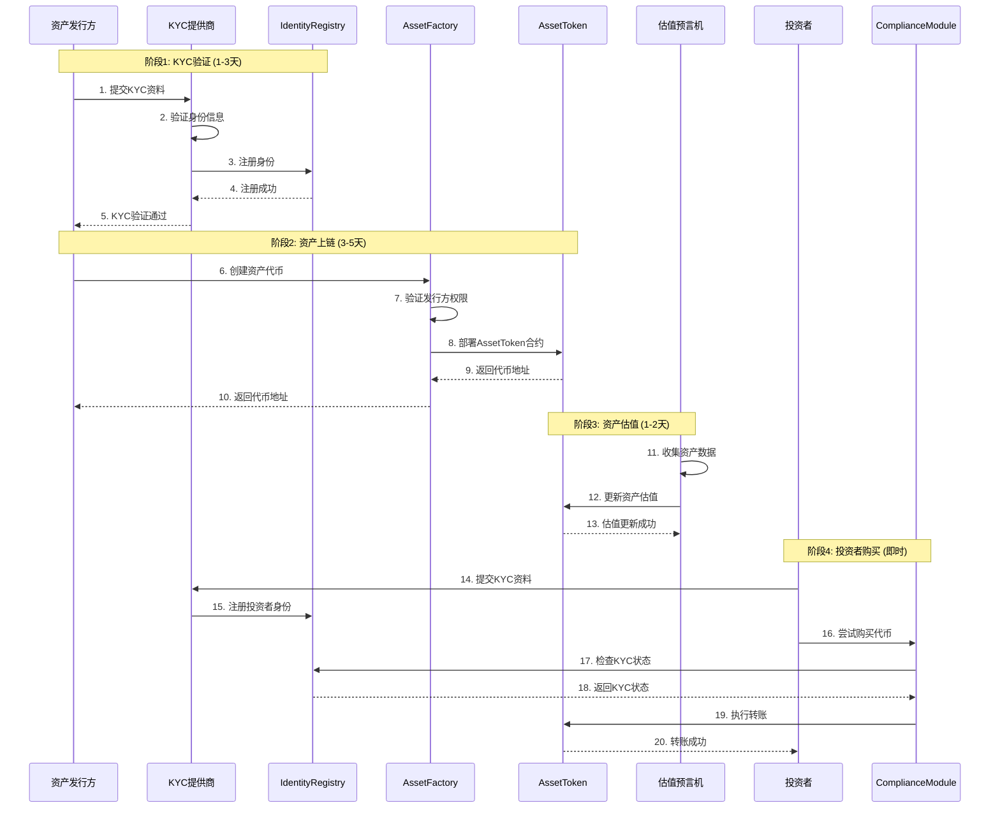
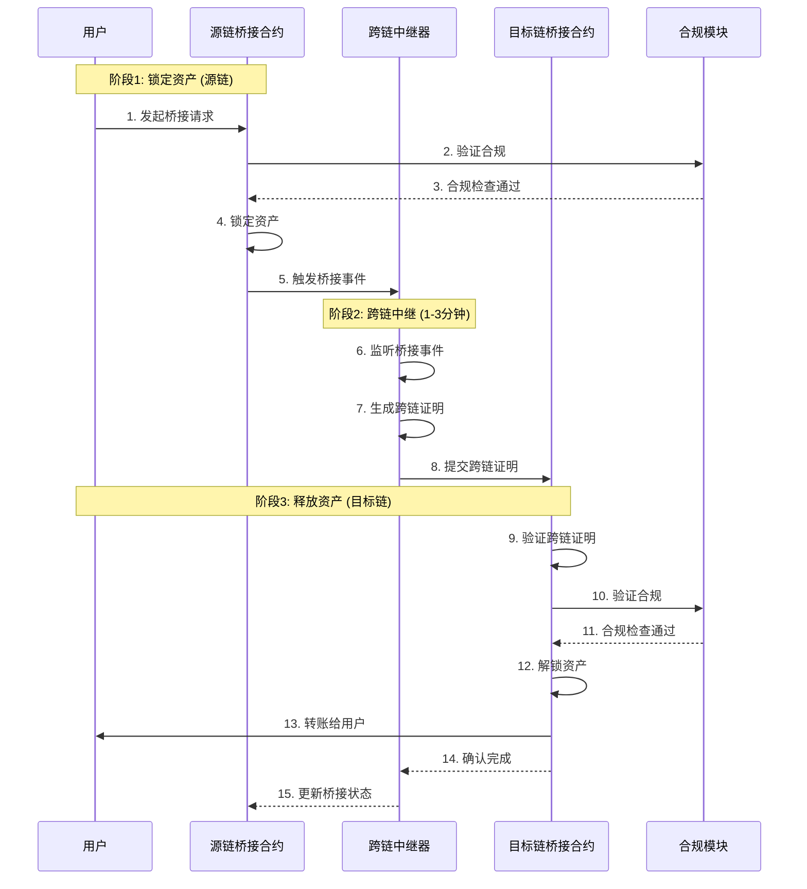
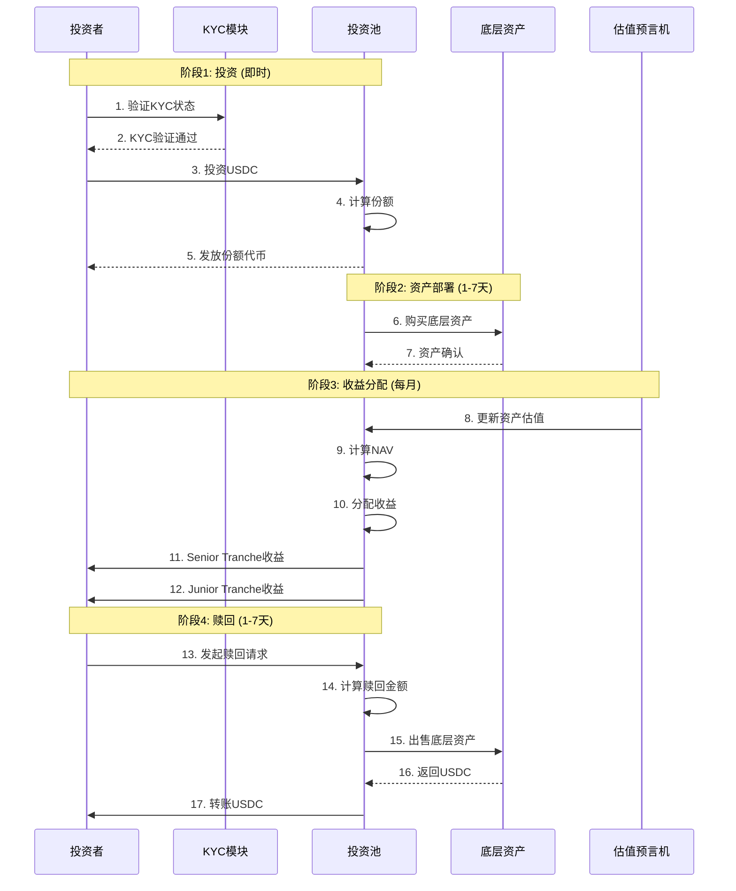
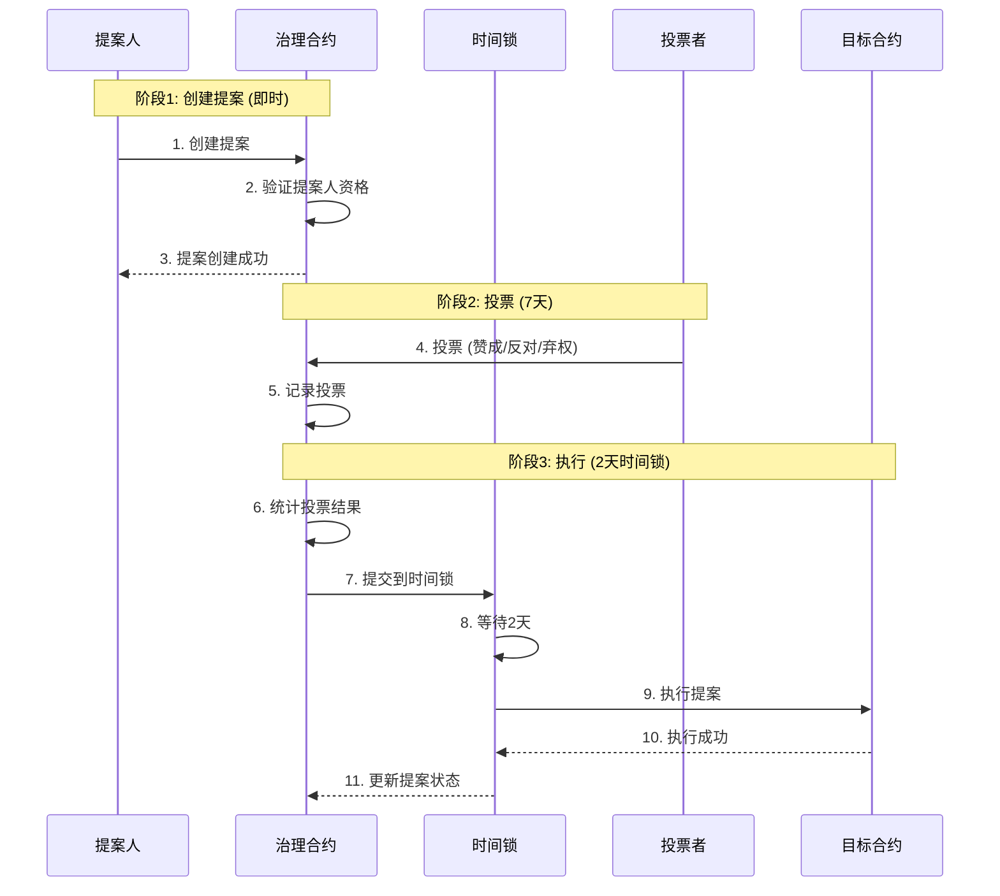
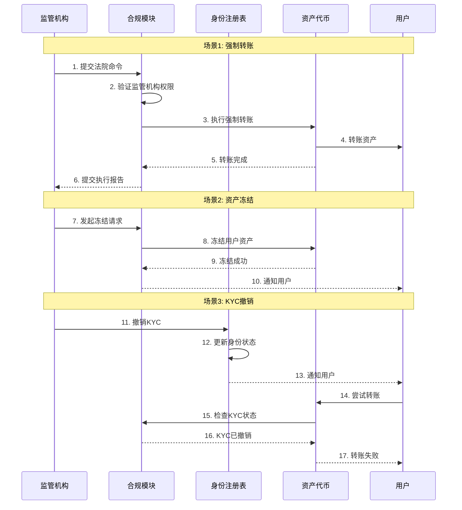
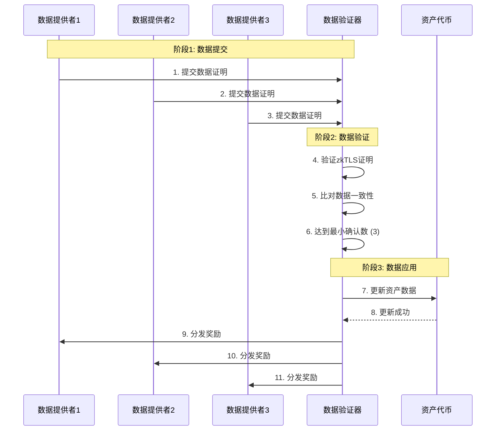

# USDable Chain 开发需求文档 - 第 5 章: 业务流程

**文档编号**: [004-5]  
**文档版本**: v2.0  
**创建时间**: 2025-10-15 14:42 CST  
**更新时间**: 2025-10-15 15:55 CST  
**文档类型**: Product Requirements Document (PRD)  
**所属项目**: USDable Chain 全栈公链开发  

---

## 5.1 房东上链流程

### 5.1.1 流程概述

**参与方**:

-   房东 (Landlord)
-   资产节点 (Asset Node)
-   合规节点 (Compliance Node)
-   服务节点 (Service Node)
-   RWA Registry (资产注册表)
-   Compliance Guard (合规模块)

### 5.1.2 详细流程图



### 5.1.3 时间线

| 阶段       | 活动       | 预计时间 | 负责方     |
| ---------- | ---------- | -------- | ---------- |
| **阶段 1** | KYC 验证   | 1-3 天   | KYC 提供商 |
| **阶段 2** | 资产上链   | 3-5 天   | 资产发行方 |
| **阶段 3** | 资产估值   | 1-2 天   | 估值预言机 |
| **阶段 4** | 投资者购买 | 即时     | 投资者     |
| **总计**   | -          | 5-10 天  | -          |

---

## 5.2 跨链资产桥接流程

### 5.2.1 流程概述

**支持的目标链**:

-   Ethereum (Mainnet)
-   Binance Smart Chain (BSC)
-   Polygon (Matic)

### 5.2.2 详细流程图



### 5.2.3 时间线

| 阶段       | 活动     | 预计时间 | 说明           |
| ---------- | -------- | -------- | -------------- |
| **阶段 1** | 锁定资产 | 2-6 秒   | 源链交易确认   |
| **阶段 2** | 跨链中继 | 1-3 分钟 | 中继器处理     |
| **阶段 3** | 释放资产 | 2-6 秒   | 目标链交易确认 |
| **总计**   | -        | 2-5 分钟 | -              |

---

## 5.3 结构化信贷投资流程

### 5.3.1 流程概述

**投资池结构**:

-   Senior Tranche (优先级): 目标 APY 8%
-   Junior Tranche (次级): 目标 APY 15%

### 5.3.2 详细流程图



### 5.3.3 收益分配规则

**分配顺序**:

1. **Senior Tranche**: 优先获得目标收益 (8% APY)
2. **Junior Tranche**: 获得剩余收益

**示例计算**:

```
假设:
- Senior Tranche投资: $1,000,000
- Junior Tranche投资: $500,000
- 总收益: $150,000 (年化10%)

分配:
1. Senior Tranche: $1,000,000 × 8% = $80,000
2. Junior Tranche: $150,000 - $80,000 = $70,000
   实际APY: $70,000 / $500,000 = 14%
```

---

## 5.4 DAO 治理流程

### 5.4.1 流程概述

**治理范围**:

-   协议参数调整 (Gas 费用、区块奖励等)
-   新功能提案
-   资金分配
-   紧急暂停

### 5.4.2 详细流程图



### 5.4.3 投票规则

| 参数         | 数值        | 说明                     |
| ------------ | ----------- | ------------------------ |
| **提案门槛** | 100,000 RWA | 创建提案所需的最小代币数 |
| **投票周期** | 7 天        | 投票持续时间             |
| **法定人数** | 10%         | 最小投票参与率           |
| **通过阈值** | 51%         | 提案通过所需的赞成票比例 |
| **时间锁**   | 2 天        | 提案执行前的等待时间     |

---

## 5.5 合规监管流程

### 5.5.1 流程概述

**监管场景**:

-   强制转账 (法院命令)
-   资产冻结 (反洗钱)
-   KYC 撤销 (身份欺诈)

### 5.5.2 详细流程图



### 5.5.3 监管权限

| 监管机构          | 权限               | 说明         |
| ----------------- | ------------------ | ------------ |
| **SEC (美国)**    | 强制转账、资产冻结 | 证券监管     |
| **FinCEN (美国)** | 资产冻结、KYC 撤销 | 反洗钱监管   |
| **MAS (新加坡)**  | 强制转账、资产冻结 | 金融监管     |
| **FCA (英国)**    | 强制转账、资产冻结 | 金融行为监管 |

---

## 5.6 数据验证流程

### 5.6.1 流程概述

**验证方式**: zkTLS + 多数据源验证

**数据类型**:

-   资产估值数据
-   财务报表数据
-   合规证明数据

### 5.6.2 详细流程图



### 5.6.3 验证标准

| 标准           | 要求   | 说明                      |
| -------------- | ------ | ------------------------- |
| **最小确认数** | 3      | 至少 3 个独立数据源       |
| **数据一致性** | 95%+   | 数据源间的一致性阈值      |
| **验证超时**   | 5 分钟 | 数据验证的超时时间        |
| **zkTLS 证明** | 必须   | 所有数据必须有 zkTLS 证明 |

---

**文档完成**

**上一章节**: [004-4]技术规格.md  
**下一章节**: [004-6]合规与安全.md  
**返回主索引**: [004]RWA 公链开发需求文档-主索引.md

**版权声明**: 本文档仅供内部使用,未经授权不得外传。
