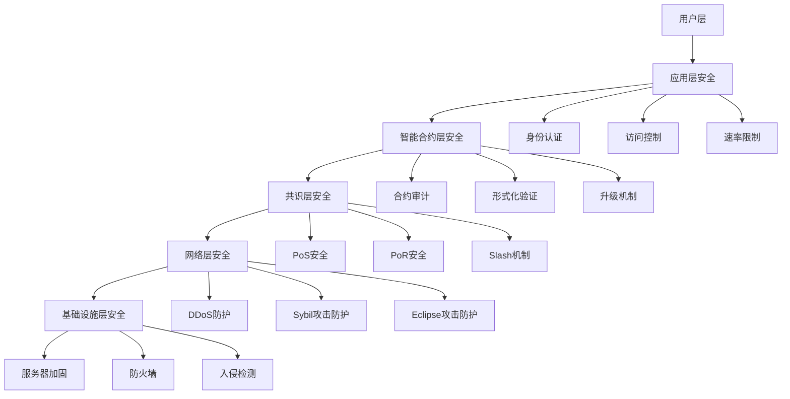
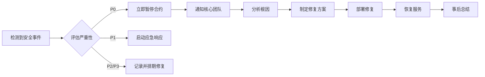

# USDable Chain 开发需求文档 - 第 6 章: 合规与安全

**文档编号**: [004-6]
**文档版本**: v2.0
**创建时间**: 2025-10-15 14:42 CST
**更新时间**: 2025-10-15 15:35 CST
**文档类型**: Product Requirements Document (PRD)
**所属项目**: USDable Chain 全栈公链开发

---

## 6.1 合规框架

### 6.1.1 监管合规

**目标司法管辖区**:

| 司法管辖区 | 监管机构    | 合规要求              | 优先级 |
| ---------- | ----------- | --------------------- | ------ |
| **美国**   | SEC, FinCEN | Reg D, Reg S, AML/KYC | P0     |
| **新加坡** | MAS         | Payment Services Act  | P0     |
| **英国**   | FCA         | FCA Handbook          | P1     |
| **欧盟**   | ESMA        | MiFID II, GDPR        | P1     |
| **香港**   | SFC         | SFO, AMLO             | P2     |

### 6.1.2 XRWA 合规标准 (基于 ERC-3643 扩展)

**参考**: T-REX (Token for Regulated EXchanges) + USDable 扩展

**核心组件**:

```solidity
// 1. Identity Registry (身份注册表)
interface IIdentityRegistry {
    function isVerified(address investor) external view returns (bool);
    function investorCountry(address investor) external view returns (uint16);
    function issuersRegistry() external view returns (address);
}

// 2. Compliance Module (合规模块)
interface ICompliance {
    function canTransfer(
        address from,
        address to,
        uint256 value
    ) external view returns (bool);

    function transferred(
        address from,
        address to,
        uint256 value
    ) external;
}

// 3. Token Contract (代币合约)
interface IERC3643 {
    function transfer(address to, uint256 value) external returns (bool);
    function forcedTransfer(address from, address to, uint256 value) external;
    function pause() external;
    function unpause() external;
}
```

### 6.1.3 KYC/AML 要求

**KYC 等级**:

| 等级        | 名称              | 要求               | 投资限额 |
| ----------- | ----------------- | ------------------ | -------- |
| **Level 1** | Basic KYC         | 姓名、邮箱、电话   | $1,000   |
| **Level 2** | Advanced KYC      | 身份证、地址证明   | $50,000  |
| **Level 3** | Institutional KYC | 公司注册、财务报表 | 无限制   |

**AML 检查**:

-   ✅ OFAC 制裁名单检查
-   ✅ PEP (政治公众人物) 检查
-   ✅ 资金来源验证
-   ✅ 交易监控 (异常交易检测)

**KYC 提供商集成**:

```solidity
// 集成第三方KYC提供商
interface IKYCProvider {
    // 提交KYC申请
    function submitKYC(
        address investor,
        bytes memory kycData
    ) external returns (bytes32 applicationId);

    // 查询KYC状态
    function getKYCStatus(bytes32 applicationId) external view returns (
        bool approved,
        uint256 kycLevel,
        uint256 expiryDate
    );

    // 撤销KYC
    function revokeKYC(address investor) external;
}
```

**推荐 KYC 提供商**:

1. **Chainalysis KYT** - 交易监控
2. **iDenfy** - 身份验证
3. **Sumsub** - KYC/AML
4. **Onfido** - 身份验证
5. **Jumio** - 身份验证

---

## 6.2 数据隐私

### 6.2.1 GDPR 合规

**数据保护原则**:

-   ✅ 数据最小化 (Data Minimization)
-   ✅ 目的限制 (Purpose Limitation)
-   ✅ 存储限制 (Storage Limitation)
-   ✅ 数据准确性 (Accuracy)
-   ✅ 完整性和保密性 (Integrity and Confidentiality)

**用户权利**:

-   ✅ 访问权 (Right to Access)
-   ✅ 更正权 (Right to Rectification)
-   ✅ 删除权 (Right to Erasure)
-   ✅ 限制处理权 (Right to Restriction)
-   ✅ 数据可携权 (Right to Data Portability)

### 6.2.2 隐私保护技术

**零知识证明 (ZKP)**:

```solidity
// 使用ZKP验证KYC状态,不泄露具体信息
interface IZKPVerifier {
    // 验证KYC证明
    function verifyKYCProof(
        bytes memory proof,
        bytes32 publicInput
    ) external view returns (bool);

    // 验证年龄证明 (不泄露具体年龄)
    function verifyAgeProof(
        bytes memory proof,
        uint256 minAge
    ) external view returns (bool);

    // 验证国籍证明 (不泄露具体国籍)
    function verifyCountryProof(
        bytes memory proof,
        uint256[] memory allowedCountries
    ) external view returns (bool);
}
```

**数据加密**:

-   ✅ 传输加密: TLS 1.3
-   ✅ 存储加密: AES-256
-   ✅ 密钥管理: AWS KMS / HashiCorp Vault

---

## 6.3 安全架构

### 6.3.1 多层安全防护



### 6.3.2 智能合约安全

**安全检查清单**:

| 检查项         | 说明                           | 工具               |
| -------------- | ------------------------------ | ------------------ |
| **重入攻击**   | 检查所有外部调用               | Slither, Mythril   |
| **整数溢出**   | 使用 SafeMath 或 Solidity 0.8+ | Slither            |
| **访问控制**   | 验证所有权限检查               | Slither, Manticore |
| **前端运行**   | 检查交易顺序依赖               | 人工审计           |
| **时间戳依赖** | 避免依赖 block.timestamp       | Slither            |
| **Gas 限制**   | 检查循环和递归                 | Slither            |
| **随机数**     | 使用 Chainlink VRF             | 人工审计           |

**安全模式**:

```solidity
// 紧急暂停机制
contract EmergencyPausable {
    bool public paused;
    address public guardian;

    modifier whenNotPaused() {
        require(!paused, "Contract is paused");
        _;
    }

    modifier onlyGuardian() {
        require(msg.sender == guardian, "Not guardian");
        _;
    }

    function pause() external onlyGuardian {
        paused = true;
        emit Paused(msg.sender);
    }

    function unpause() external onlyGuardian {
        paused = false;
        emit Unpaused(msg.sender);
    }
}

// 升级机制 (透明代理模式)
contract TransparentUpgradeableProxy {
    address public implementation;
    address public admin;

    modifier onlyAdmin() {
        require(msg.sender == admin, "Not admin");
        _;
    }

    function upgradeTo(address newImplementation) external onlyAdmin {
        implementation = newImplementation;
        emit Upgraded(newImplementation);
    }
}
```

### 6.3.3 共识层安全

**PoS 安全措施**:

| 措施           | 说明            | 参数          |
| -------------- | --------------- | ------------- |
| **Slash 惩罚** | 双签、离线惩罚  | 10%质押       |
| **最小质押**   | 防止 Sybil 攻击 | 10,000 RWA    |
| **验证者轮换** | 防止长期控制    | 每 100 个区块 |
| **最终确认**   | 防止长程攻击    | 3 个区块      |

**PoR 安全措施**:

| 措施           | 说明         | 参数       |
| -------------- | ------------ | ---------- |
| **Slash 惩罚** | 虚假数据惩罚 | 20%质押    |
| **最小确认数** | 防止单点故障 | 3 个数据源 |
| **数据质押**   | 经济激励     | 5,000 RWA  |
| **zkTLS 验证** | 密码学证明   | 必须       |

---

## 6.4 网络安全

### 6.4.1 DDoS 防护

**防护措施**:

-   ✅ Cloudflare DDoS 防护
-   ✅ 速率限制 (Rate Limiting)
-   ✅ IP 白名单/黑名单
-   ✅ 流量清洗 (Traffic Scrubbing)

**速率限制配置**:

```yaml
# RPC速率限制
rate_limits:
    free_tier:
        requests_per_minute: 100
        burst: 20

    paid_tier:
        requests_per_minute: 1000
        burst: 200

    enterprise_tier:
        requests_per_minute: 10000
        burst: 2000
```

### 6.4.2 Sybil 攻击防护

**防护措施**:

-   ✅ 最小质押要求 (10,000 RWA)
-   ✅ 身份验证 (KYC)
-   ✅ 信誉系统 (Reputation System)
-   ✅ 网络拓扑分析

### 6.4.3 Eclipse 攻击防护

**防护措施**:

-   ✅ 多个 Bootstrap 节点
-   ✅ DNS 种子节点
-   ✅ 节点多样性检查
-   ✅ 出站连接限制

---

## 6.5 运营安全

### 6.5.1 密钥管理

**多签钱包**:

```solidity
// 3-of-5多签钱包
contract MultiSigWallet {
    address[] public owners;
    uint256 public required = 3;

    mapping(uint256 => Transaction) public transactions;
    mapping(uint256 => mapping(address => bool)) public confirmations;

    struct Transaction {
        address to;
        uint256 value;
        bytes data;
        bool executed;
    }

    function submitTransaction(
        address to,
        uint256 value,
        bytes memory data
    ) external returns (uint256 txId) {
        // 提交交易
    }

    function confirmTransaction(uint256 txId) external {
        // 确认交易
    }

    function executeTransaction(uint256 txId) external {
        // 执行交易 (需要3个签名)
    }
}
```

**密钥分级**:

| 密钥类型     | 用途     | 存储方式 | 签名要求    |
| ------------ | -------- | -------- | ----------- |
| **冷钱包**   | 资金存储 | 硬件钱包 | 3-of-5 多签 |
| **热钱包**   | 日常运营 | AWS KMS  | 2-of-3 多签 |
| **部署密钥** | 合约部署 | AWS KMS  | 2-of-3 多签 |
| **监控密钥** | 只读访问 | 环境变量 | 单签        |

### 6.5.2 事件响应

**安全事件分级**:

| 级别              | 说明         | 响应时间 | 示例               |
| ----------------- | ------------ | -------- | ------------------ |
| **P0 (Critical)** | 资金损失风险 | 15 分钟  | 合约漏洞、私钥泄露 |
| **P1 (High)**     | 服务中断     | 1 小时   | RPC 宕机、节点故障 |
| **P2 (Medium)**   | 性能下降     | 4 小时   | 高延迟、低 TPS     |
| **P3 (Low)**      | 一般问题     | 24 小时  | 文档错误、UI 问题  |

**应急预案**:



---

## 6.6 审计与认证

### 6.6.1 安全审计

**审计范围**:

-   ✅ 智能合约审计 (所有核心合约)
-   ✅ 共识机制审计 (PoS + PoR)
-   ✅ 网络层审计 (P2P 协议)
-   ✅ 基础设施审计 (服务器、数据库)

**审计时间表**:

| 阶段        | 审计内容 | 审计公司      | 预计时间 |
| ----------- | -------- | ------------- | -------- |
| **MVP**     | 核心合约 | Trail of Bits | 4 周     |
| **Beta**    | 全部合约 | OpenZeppelin  | 6 周     |
| **Mainnet** | 完整系统 | Certik        | 8 周     |

### 6.6.2 合规认证

**目标认证**:

| 认证              | 颁发机构 | 适用范围 | 优先级 |
| ----------------- | -------- | -------- | ------ |
| **SOC 2 Type II** | AICPA    | 数据安全 | P0     |
| **ISO 27001**     | ISO      | 信息安全 | P1     |
| **PCI DSS**       | PCI SSC  | 支付安全 | P2     |
| **GDPR 合规**     | EU       | 数据隐私 | P0     |

---

## 6.7 持续监控

### 6.7.1 监控指标

**安全监控**:

| 指标             | 阈值        | 告警级别 |
| ---------------- | ----------- | -------- |
| **异常交易**     | >$100K 单笔 | P1       |
| **Gas 价格异常** | >10x 平均值 | P2       |
| **验证者离线**   | >10%验证者  | P0       |
| **数据验证失败** | >20%失败率  | P1       |
| **RPC 错误率**   | >5%         | P2       |

**监控工具**:

-   ✅ Prometheus + Grafana (指标监控)
-   ✅ ELK Stack (日志分析)
-   ✅ PagerDuty (告警通知)
-   ✅ Chainalysis (链上监控)

### 6.7.2 日志审计

**日志类型**:

-   ✅ 交易日志 (所有链上交易)
-   ✅ 访问日志 (RPC 访问记录)
-   ✅ 管理日志 (管理员操作)
-   ✅ 安全日志 (安全事件)

**日志保留**:

-   **热数据**: 30 天 (快速查询)
-   **温数据**: 1 年 (归档存储)
-   **冷数据**: 7 年 (合规要求)

---

**文档完成**

**上一章节**: [004-5]业务流程.md  
**下一章节**: [004-7]实施计划.md  
**返回主索引**: [004]RWA 公链开发需求文档-主索引.md

**版权声明**: 本文档仅供内部使用,未经授权不得外传。
