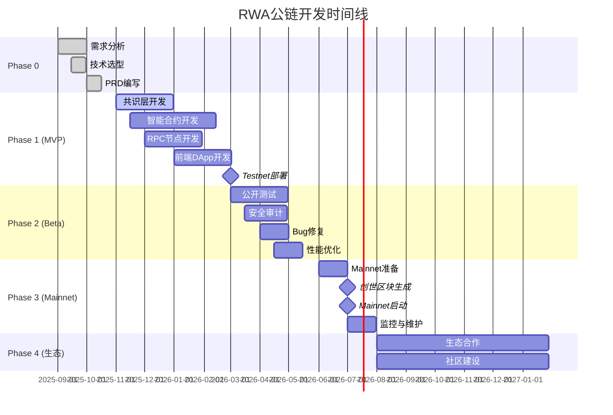
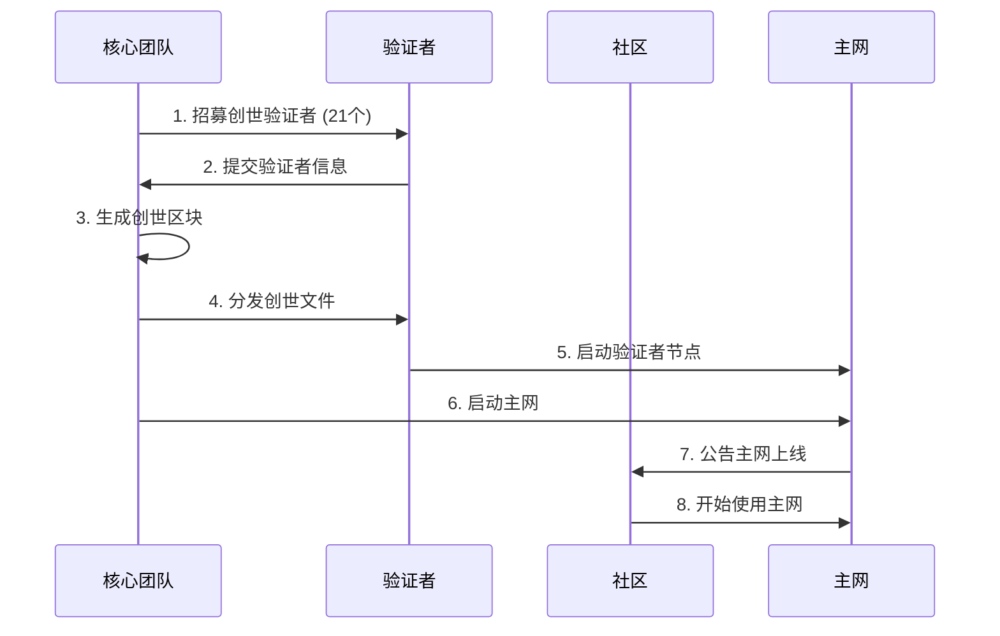

# RWA公链开发需求文档 - 第7章: 实施计划

**文档编号**: [004-7]  
**文档版本**: v1.0  
**创建时间**: 2025-10-15 14:42 CST  
**文档类型**: Product Requirements Document (PRD)  
**所属项目**: RWA全栈公链开发  

---

## 7.1 项目阶段划分

### 7.1.1 整体时间线

| 阶段 | 名称 | 时间 | 里程碑 | 状态 |
|------|------|------|--------|------|
| **Phase 0** | 需求分析 | 1个月 | PRD完成 | ✅ 完成 |
| **Phase 1** | MVP开发 | 6个月 | Testnet上线 | ⏳ 待开始 |
| **Phase 2** | Beta测试 | 3个月 | 公开测试 | ⏳ 待开始 |
| **Phase 3** | Mainnet上线 | 3个月 | 主网启动 | ⏳ 待开始 |
| **Phase 4** | 生态扩展 | 持续 | 生态繁荣 | ⏳ 待开始 |

### 7.1.2 甘特图



---

## 7.2 Phase 1: MVP开发 (6个月)

### 7.2.1 Sprint规划

**Sprint周期**: 2周/Sprint, 共12个Sprint

| Sprint | 时间 | 目标 | 交付物 |
|--------|------|------|--------|
| **Sprint 1-2** | M1-M2 | 共识层基础 | PoS共识实现 |
| **Sprint 3-4** | M2-M3 | PoR共识 | PoR数据验证 |
| **Sprint 5-6** | M3-M4 | 核心合约 | 资产代币化+合规 |
| **Sprint 7-8** | M4-M5 | 跨链+DeFi | 跨链桥+DEX |
| **Sprint 9-10** | M5-M6 | 前端DApp | Web DApp |
| **Sprint 11-12** | M6 | 集成测试 | Testnet上线 |

### 7.2.2 技术栈选择

**区块链核心**:
- ✅ **共识引擎**: 自研 (基于Tendermint改造)
- ✅ **EVM**: go-ethereum (Geth)
- ✅ **P2P网络**: libp2p
- ✅ **存储**: LevelDB + IPFS

**智能合约**:
- ✅ **开发语言**: Solidity 0.8.20+
- ✅ **开发框架**: Hardhat + Foundry
- ✅ **测试框架**: Hardhat + Chai
- ✅ **安全工具**: Slither + Mythril

**前端DApp**:
- ✅ **框架**: Next.js 14 + React 18
- ✅ **Web3库**: ethers.js v6
- ✅ **UI库**: Tailwind CSS + shadcn/ui
- ✅ **状态管理**: Zustand

**基础设施**:
- ✅ **云服务**: AWS (EC2, S3, RDS)
- ✅ **容器化**: Docker + Kubernetes
- ✅ **CI/CD**: GitHub Actions
- ✅ **监控**: Prometheus + Grafana

### 7.2.3 团队配置

| 角色 | 人数 | 职责 | 技能要求 |
|------|------|------|---------|
| **技术负责人** | 1 | 技术架构、团队管理 | 10年+区块链经验 |
| **共识工程师** | 2 | PoS/PoR共识开发 | Go, Tendermint |
| **智能合约工程师** | 3 | 核心合约开发 | Solidity, Hardhat |
| **后端工程师** | 2 | RPC节点、API开发 | Go, Node.js |
| **前端工程师** | 2 | DApp开发 | React, ethers.js |
| **测试工程师** | 1 | 测试、QA | 自动化测试 |
| **DevOps工程师** | 1 | 基础设施、CI/CD | AWS, K8s |
| **产品经理** | 1 | 需求管理、协调 | 区块链产品经验 |
| **总计** | 13人 | - | - |

---

## 7.3 Phase 2: Beta测试 (3个月)

### 7.3.1 测试计划

**测试类型**:

| 测试类型 | 时间 | 目标 | 工具 |
|---------|------|------|------|
| **功能测试** | 2周 | 验证所有功能 | Hardhat, Postman |
| **性能测试** | 2周 | 验证TPS、延迟 | Locust, k6 |
| **安全测试** | 4周 | 发现安全漏洞 | Slither, Mythril |
| **压力测试** | 1周 | 验证极限性能 | Locust |
| **兼容性测试** | 1周 | 验证钱包兼容 | MetaMask, WalletConnect |
| **用户测试** | 4周 | 收集用户反馈 | 公开测试网 |

### 7.3.2 安全审计

**审计时间表**:

| 阶段 | 审计公司 | 审计范围 | 时间 | 费用 |
|------|---------|---------|------|------|
| **第一轮** | Trail of Bits | 核心合约 | 4周 | $150K |
| **第二轮** | OpenZeppelin | 全部合约 | 6周 | $200K |
| **第三轮** | Certik | 完整系统 | 8周 | $300K |
| **总计** | - | - | 18周 | $650K |

### 7.3.3 Bug赏金计划

**赏金等级**:

| 严重性 | 赏金金额 | 示例 |
|--------|---------|------|
| **Critical** | $50,000 | 资金损失、私钥泄露 |
| **High** | $10,000 | 合约漏洞、权限绕过 |
| **Medium** | $2,000 | 逻辑错误、性能问题 |
| **Low** | $500 | UI问题、文档错误 |

**赏金池**: $500,000

---

## 7.4 Phase 3: Mainnet上线 (3个月)

### 7.4.1 上线准备

**检查清单**:

| 检查项 | 负责人 | 状态 | 截止日期 |
|--------|--------|------|---------|
| ✅ 所有安全审计通过 | 技术负责人 | ⏳ | M+11 |
| ✅ 性能测试达标 | 测试工程师 | ⏳ | M+11 |
| ✅ 文档完善 | 产品经理 | ⏳ | M+11.5 |
| ✅ 创世验证者招募 | 运营负责人 | ⏳ | M+11.5 |
| ✅ 监控系统部署 | DevOps工程师 | ⏳ | M+11.5 |
| ✅ 应急预案制定 | 技术负责人 | ⏳ | M+11.5 |
| ✅ 法律合规审查 | 法务顾问 | ⏳ | M+12 |

### 7.4.2 创世区块配置

**创世参数**:

```json
{
  "chainId": 8888,
  "homesteadBlock": 0,
  "eip150Block": 0,
  "eip155Block": 0,
  "eip158Block": 0,
  "byzantiumBlock": 0,
  "constantinopleBlock": 0,
  "petersburgBlock": 0,
  "istanbulBlock": 0,
  "berlinBlock": 0,
  "londonBlock": 0,
  "shanghaiBlock": 0,
  "consensus": {
    "type": "pos-por",
    "validators": [
      "0x1234...",
      "0x5678...",
      "..."
    ],
    "minStake": "10000000000000000000000",
    "blockReward": "10000000000000000000"
  },
  "alloc": {
    "0xFoundation": {
      "balance": "100000000000000000000000000"
    },
    "0xTeam": {
      "balance": "50000000000000000000000000"
    },
    "0xEcosystem": {
      "balance": "150000000000000000000000000"
    }
  }
}
```

### 7.4.3 上线流程



---

## 7.5 Phase 4: 生态扩展 (持续)

### 7.5.1 生态合作

**合作方向**:

| 方向 | 目标 | 合作伙伴类型 | KPI |
|------|------|-------------|-----|
| **资产发行方** | 10+ | 房地产、艺术品、碳信用 | TVL $100M+ |
| **DeFi协议** | 5+ | DEX、借贷、稳定币 | 日交易量 $10M+ |
| **钱包** | 10+ | MetaMask、Trust Wallet | 用户数 100K+ |
| **交易所** | 3+ | Binance、Coinbase | 上币 |
| **KYC提供商** | 3+ | Chainalysis、iDenfy | KYC用户 50K+ |

### 7.5.2 社区建设

**社区渠道**:

| 渠道 | 目标 | 负责人 | KPI |
|------|------|--------|-----|
| **Discord** | 10,000+ | 社区经理 | 日活 1,000+ |
| **Twitter** | 50,000+ | 市场经理 | 互动率 5%+ |
| **Telegram** | 20,000+ | 社区经理 | 日活 2,000+ |
| **Medium** | 10,000+ | 内容经理 | 月阅读 50K+ |
| **GitHub** | 1,000+ | 技术负责人 | Star 1,000+ |

### 7.5.3 开发者激励

**Grant计划**:

| 类别 | 金额 | 数量 | 总预算 |
|------|------|------|--------|
| **小型项目** | $5K-$20K | 20个 | $300K |
| **中型项目** | $20K-$100K | 10个 | $600K |
| **大型项目** | $100K-$500K | 5个 | $1.5M |
| **总计** | - | 35个 | $2.4M |

---

## 7.6 风险管理

### 7.6.1 技术风险

| 风险 | 概率 | 影响 | 缓解措施 |
|------|------|------|---------|
| **共识漏洞** | 中 | 高 | 多轮安全审计、形式化验证 |
| **智能合约漏洞** | 中 | 高 | 3家审计公司、Bug赏金 |
| **性能不达标** | 低 | 中 | 压力测试、性能优化 |
| **兼容性问题** | 低 | 低 | 兼容性测试、社区反馈 |

### 7.6.2 市场风险

| 风险 | 概率 | 影响 | 缓解措施 |
|------|------|------|---------|
| **监管政策变化** | 中 | 高 | 多司法管辖区、法律顾问 |
| **竞争对手** | 高 | 中 | 差异化定位、快速迭代 |
| **市场需求不足** | 低 | 高 | 市场调研、MVP验证 |
| **代币价格波动** | 高 | 中 | 稳定币支持、锁仓机制 |

### 7.6.3 运营风险

| 风险 | 概率 | 影响 | 缓解措施 |
|------|------|------|---------|
| **团队流失** | 中 | 中 | 股权激励、团队文化 |
| **资金不足** | 低 | 高 | 融资计划、成本控制 |
| **安全事件** | 低 | 高 | 应急预案、保险 |
| **社区分裂** | 低 | 中 | 透明治理、社区沟通 |

---

## 7.7 预算估算

### 7.7.1 开发成本

| 类别 | 金额 | 说明 |
|------|------|------|
| **人力成本** | $2.5M | 13人 × 12个月 × $16K/月 |
| **安全审计** | $650K | 3家审计公司 |
| **基础设施** | $200K | AWS、服务器 |
| **法律合规** | $150K | 法律顾问、合规审查 |
| **市场推广** | $500K | 社区建设、营销 |
| **总计** | $4M | Phase 1-3 |

### 7.7.2 运营成本 (年)

| 类别 | 金额 | 说明 |
|------|------|------|
| **团队工资** | $2M | 持续运营 |
| **基础设施** | $300K | 服务器、带宽 |
| **生态激励** | $2.4M | Grant计划 |
| **市场推广** | $1M | 持续营销 |
| **总计** | $5.7M | 每年 |

---

**文档完成**

**上一章节**: [004-6]合规与安全.md  
**下一章节**: [004-8]验收标准.md  
**返回主索引**: [004]RWA公链开发需求文档-主索引.md  

**版权声明**: 本文档仅供内部使用,未经授权不得外传。

