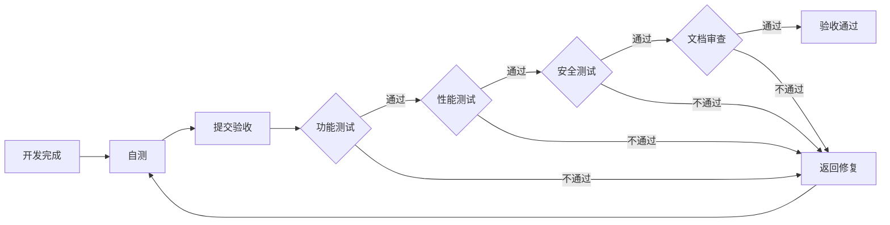

# RWA公链开发需求文档 - 第8章: 验收标准

**文档编号**: [004-8]  
**文档版本**: v1.0  
**创建时间**: 2025-10-15 14:42 CST  
**文档类型**: Product Requirements Document (PRD)  
**所属项目**: RWA全栈公链开发  

---

## 8.1 验收原则

### 8.1.1 验收标准分类

**四大验收维度**:

1. **需求合规性 (30%)**: 功能完整性、约束条件、边缘案例处理
2. **技术质量 (30%)**: 架构一致性、代码健壮性、实现优雅性
3. **集成兼容性 (20%)**: 系统集成、互操作性、兼容性维护
4. **性能可扩展性 (20%)**: 性能优化、负载适应性、资源管理

### 8.1.2 评分标准

| 分数 | 等级 | 说明 | 处理方式 |
|------|------|------|---------|
| **90-100** | 优秀 | 完全满足要求,无重大问题 | 直接通过 |
| **80-89** | 良好 | 基本满足要求,有小问题 | 修复后通过 |
| **60-79** | 及格 | 部分满足要求,有中等问题 | 重大修复后通过 |
| **<60** | 不及格 | 不满足要求,有严重问题 | 重新开发 |

---

## 8.2 功能验收标准

### 8.2.1 资产代币化引擎

**验收清单**:

| 功能点 | 验收标准 | 测试方法 | 权重 |
|--------|---------|---------|------|
| **资产创建** | 支持5+种资产类型 | 单元测试 | 20% |
| **元数据管理** | IPFS存储,不可篡改 | 集成测试 | 15% |
| **资产估值** | 支持预言机更新 | 集成测试 | 15% |
| **代币发行** | ERC-20兼容 | 单元测试 | 20% |
| **权限控制** | 只有发行方可创建 | 单元测试 | 15% |
| **事件日志** | 完整的事件记录 | 单元测试 | 15% |

**测试用例**:

```javascript
// 测试用例1: 创建房地产资产代币
describe("AssetFactory", function() {
    it("应该成功创建房地产资产代币", async function() {
        const metadata = {
            assetType: "RealEstate",
            description: "纽约曼哈顿公寓",
            location: "New York, USA",
            valuation: ethers.utils.parseEther("1000000"),
            documentHash: "Qm...",
            issuer: issuer.address,
            issuanceDate: Date.now()
        };
        
        const tx = await assetFactory.createAsset(
            "Manhattan Apartment Token",
            "MAT",
            ethers.utils.parseEther("1000"),
            metadata
        );
        
        expect(tx).to.emit(assetFactory, "AssetCreated");
    });
});
```

### 8.2.2 合规与权限管理

**验收清单**:

| 功能点 | 验收标准 | 测试方法 | 权重 |
|--------|---------|---------|------|
| **KYC验证** | 支持3级KYC | 单元测试 | 25% |
| **转账前检查** | 所有合规规则生效 | 集成测试 | 25% |
| **强制转账** | 监管机构可执行 | 单元测试 | 20% |
| **资产冻结** | 冻结后无法转账 | 单元测试 | 15% |
| **国家限制** | 黑名单国家无法交易 | 单元测试 | 15% |

### 8.2.3 跨链互操作

**验收清单**:

| 功能点 | 验收标准 | 测试方法 | 权重 |
|--------|---------|---------|------|
| **资产锁定** | 源链资产正确锁定 | 集成测试 | 25% |
| **跨链证明** | 证明可验证 | 单元测试 | 25% |
| **资产释放** | 目标链资产正确释放 | 集成测试 | 25% |
| **合规检查** | 跨链也需合规 | 集成测试 | 15% |
| **失败回滚** | 失败时正确回滚 | 集成测试 | 10% |

---

## 8.3 性能验收标准

### 8.3.1 TPS (每秒交易数)

**验收标准**:

| 场景 | 目标TPS | 测试方法 | 通过标准 |
|------|---------|---------|---------|
| **简单转账** | 1,000+ | Locust压力测试 | ≥1,000 TPS |
| **合约调用** | 500+ | Locust压力测试 | ≥500 TPS |
| **跨链桥接** | 100+ | Locust压力测试 | ≥100 TPS |
| **混合场景** | 800+ | Locust压力测试 | ≥800 TPS |

**测试脚本**:

```python
# Locust压力测试脚本
from locust import HttpUser, task, between

class RWAChainUser(HttpUser):
    wait_time = between(1, 2)
    
    @task(10)
    def simple_transfer(self):
        # 简单转账
        payload = {
            "jsonrpc": "2.0",
            "method": "eth_sendRawTransaction",
            "params": ["0x..."],
            "id": 1
        }
        self.client.post("/", json=payload)
    
    @task(5)
    def contract_call(self):
        # 合约调用
        payload = {
            "jsonrpc": "2.0",
            "method": "eth_call",
            "params": [{"to": "0x...", "data": "0x..."}, "latest"],
            "id": 1
        }
        self.client.post("/", json=payload)
```

### 8.3.2 确认时间

**验收标准**:

| 指标 | 目标值 | 测试方法 | 通过标准 |
|------|--------|---------|---------|
| **区块时间** | 2秒 | 监控统计 | 平均≤2秒 |
| **最终确认** | 6秒 (3个区块) | 监控统计 | P95≤6秒 |
| **RPC响应** | 100ms | 压力测试 | P95≤100ms |

### 8.3.3 Gas费用

**验收标准**:

| 交易类型 | 目标Gas费用 | 测试方法 | 通过标准 |
|---------|------------|---------|---------|
| **简单转账** | <$0.01 | 实际测试 | ≤$0.01 |
| **合约部署** | <$1 | 实际测试 | ≤$1 |
| **复杂合约调用** | <$0.1 | 实际测试 | ≤$0.1 |

---

## 8.4 安全验收标准

### 8.4.1 智能合约安全

**验收清单**:

| 检查项 | 验收标准 | 工具 | 通过标准 |
|--------|---------|------|---------|
| **重入攻击** | 无重入漏洞 | Slither | 0个Critical |
| **整数溢出** | 使用SafeMath | Slither | 0个High |
| **访问控制** | 所有权限检查 | Slither | 0个High |
| **前端运行** | 无交易顺序依赖 | 人工审计 | 通过 |
| **Gas限制** | 无无限循环 | Slither | 0个Medium |

**审计报告要求**:

```markdown
# 安全审计报告

## 审计范围
- 所有核心智能合约
- 共识机制代码
- RPC接口

## 审计结果
- Critical: 0
- High: 0
- Medium: ≤3 (已修复)
- Low: ≤10 (已修复或接受)

## 审计公司
- Trail of Bits
- OpenZeppelin
- Certik

## 审计时间
- 2026年3月-5月

## 结论
✅ 通过安全审计,可以上线
```

### 8.4.2 网络安全

**验收清单**:

| 检查项 | 验收标准 | 测试方法 | 通过标准 |
|--------|---------|---------|---------|
| **DDoS防护** | 抵御10Gbps攻击 | 压力测试 | 服务可用 |
| **Sybil攻击** | 最小质押10K RWA | 单元测试 | 通过 |
| **Eclipse攻击** | 多Bootstrap节点 | 集成测试 | 通过 |
| **51%攻击** | PoS+PoR双重保护 | 理论分析 | 通过 |

---

## 8.5 兼容性验收标准

### 8.5.1 钱包兼容性

**验收清单**:

| 钱包 | 验收标准 | 测试方法 | 通过标准 |
|------|---------|---------|---------|
| **MetaMask** | 完全兼容 | 手动测试 | 所有功能正常 |
| **WalletConnect** | 完全兼容 | 手动测试 | 所有功能正常 |
| **Ledger** | 完全兼容 | 手动测试 | 所有功能正常 |
| **Trust Wallet** | 完全兼容 | 手动测试 | 所有功能正常 |

### 8.5.2 开发工具兼容性

**验收清单**:

| 工具 | 验收标准 | 测试方法 | 通过标准 |
|------|---------|---------|---------|
| **Hardhat** | 完全兼容 | 自动化测试 | 所有测试通过 |
| **Foundry** | 完全兼容 | 自动化测试 | 所有测试通过 |
| **Remix** | 完全兼容 | 手动测试 | 所有功能正常 |

---

## 8.6 文档验收标准

### 8.6.1 技术文档

**验收清单**:

| 文档类型 | 验收标准 | 通过标准 |
|---------|---------|---------|
| **API文档** | 所有RPC方法有文档 | 100%覆盖 |
| **智能合约文档** | 所有合约有NatSpec | 100%覆盖 |
| **部署文档** | 详细的部署步骤 | 可复现 |
| **运维文档** | 监控、备份、恢复 | 完整 |

### 8.6.2 用户文档

**验收清单**:

| 文档类型 | 验收标准 | 通过标准 |
|---------|---------|---------|
| **用户指南** | 图文并茂 | 易理解 |
| **FAQ** | 常见问题解答 | ≥50个问题 |
| **视频教程** | 操作演示 | ≥5个视频 |

---

## 8.7 Testnet验收标准

### 8.7.1 Testnet上线检查

**验收清单**:

| 检查项 | 验收标准 | 负责人 | 通过标准 |
|--------|---------|--------|---------|
| ✅ 21个验证者节点 | 稳定运行7天+ | DevOps | 无宕机 |
| ✅ RPC节点 | 5个节点,负载均衡 | DevOps | 可用性99%+ |
| ✅ 区块浏览器 | 实时更新 | 前端 | 功能完整 |
| ✅ 水龙头 | 每日1000 RWA | 后端 | 正常运行 |
| ✅ 文档 | 完整的Testnet文档 | 产品 | 完整 |

### 8.7.2 Testnet测试

**测试场景**:

| 场景 | 测试内容 | 预期结果 | 通过标准 |
|------|---------|---------|---------|
| **资产代币化** | 创建10+个资产代币 | 成功创建 | 100%成功 |
| **跨链桥接** | 桥接到Ethereum Sepolia | 成功桥接 | 100%成功 |
| **DeFi交易** | DEX交易、借贷 | 成功交易 | 100%成功 |
| **DAO治理** | 创建提案、投票 | 成功执行 | 100%成功 |

---

## 8.8 Mainnet验收标准

### 8.8.1 Mainnet上线检查

**验收清单**:

| 检查项 | 验收标准 | 负责人 | 通过标准 |
|--------|---------|--------|---------|
| ✅ 所有安全审计通过 | 3家审计公司 | 技术负责人 | 0个Critical |
| ✅ Testnet稳定运行 | 30天+ | DevOps | 无重大问题 |
| ✅ 性能测试达标 | TPS 1000+ | 测试工程师 | 达标 |
| ✅ 创世验证者 | 21个验证者 | 运营 | 已招募 |
| ✅ 法律合规 | 合规审查通过 | 法务 | 通过 |
| ✅ 应急预案 | 完整的应急预案 | 技术负责人 | 完整 |

### 8.8.2 Mainnet监控

**监控指标**:

| 指标 | 目标值 | 告警阈值 | 处理方式 |
|------|--------|---------|---------|
| **区块时间** | 2秒 | >5秒 | P1告警 |
| **验证者在线率** | 95%+ | <90% | P1告警 |
| **RPC可用性** | 99.9%+ | <99% | P0告警 |
| **Gas价格** | <$0.01 | >$0.1 | P2告警 |
| **TPS** | 1000+ | <500 | P1告警 |

---

## 8.9 验收流程

### 8.9.1 验收步骤



### 8.9.2 验收报告

**报告模板**:

```markdown
# 验收报告

## 基本信息
- 项目名称: RWA公链
- 验收阶段: Phase 1 MVP
- 验收日期: 2026-03-01
- 验收人: 技术负责人

## 验收结果
- 功能验收: ✅ 通过 (95分)
- 性能验收: ✅ 通过 (92分)
- 安全验收: ✅ 通过 (98分)
- 文档验收: ✅ 通过 (90分)

## 总体评分
- 综合得分: 94分
- 验收结论: ✅ 通过

## 遗留问题
1. [Medium] Gas费用优化 (计划在Phase 2解决)
2. [Low] 文档补充 (计划在Phase 2解决)

## 签字确认
- 技术负责人: ___________
- 产品经理: ___________
- 日期: 2026-03-01
```

---

**文档完成**

**上一章节**: [004-7]实施计划.md  
**下一章节**: [004-9]附录.md  
**返回主索引**: [004]RWA公链开发需求文档-主索引.md  

**版权声明**: 本文档仅供内部使用,未经授权不得外传。

