# RealChain 架构图集

**版本**: 1.1
**创建日期**: 2025 年 10 月 9 日
**最后更新**: 2025 年 10 月 14 日

> ⚠️ **重要声明**: 本文档为概念设计示例,用于学习和参考目的。
>
> -   **RealChain 不是一个真实存在的区块链项目**
> -   文档基于真实的技术栈(Cosmos SDK, Tendermint)进行概念设计
> -   所有"官方"联系方式和网站链接均为示例,不可访问
> -   文档创建时间: 2025-10-09
> -   文档用途: 展示如何设计 RWA 专用区块链的学习材料

---

## 🏗️ 系统整体架构

### 1. 核心架构图

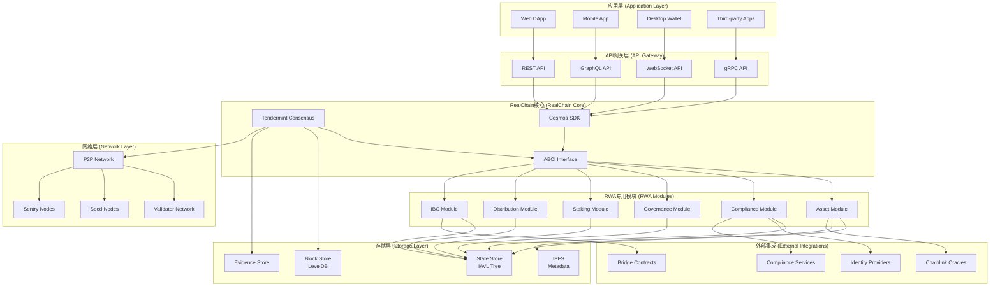

### 2. RWA 资产模块架构

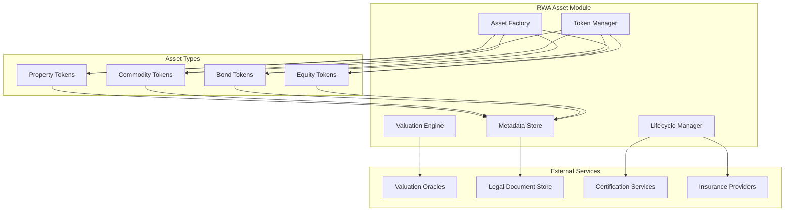

### 3. 合规模块架构

```mermaid
graph TB
    subgraph "Compliance Module"
        A[KYC Engine]
        B[AML Monitor]
        C[Regulatory Reporter]
        D[Risk Assessor]
        E[Jurisdiction Manager]
    end

    subgraph "KYC Levels"
        F[Basic KYC]
        G[Enhanced KYC]
        H[Premium KYC]
    end

    subgraph "Regulatory Frameworks"
        I[US SEC/CFTC]
        J[EU MiCA]
        K[Singapore MAS]
        L[Other Jurisdictions]
    end

    subgraph "External Providers"
        M[Identity Verification]
        N[Document Verification]
        O[Biometric Services]
        P[Sanction Lists]
    end

    A --> F
    A --> G
    A --> H

    E --> I
    E --> J
    E --> K
    E --> L

    A --> M
    A --> N
    A --> O
    B --> P

    B --> C
    D --> C
```

### 4. 跨链架构

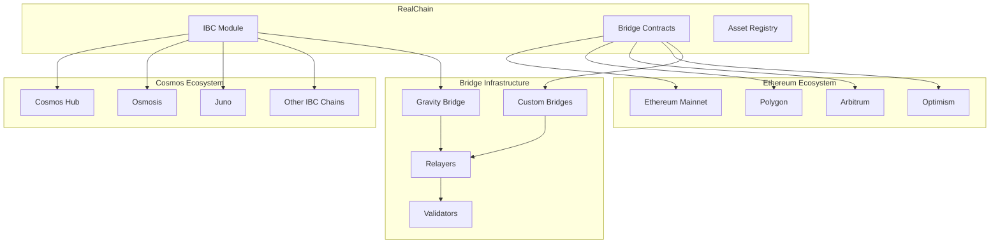

---

## 💰 经济模型流程图

### 1. 代币流转图

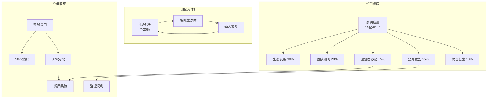

### 2. 质押奖励分配

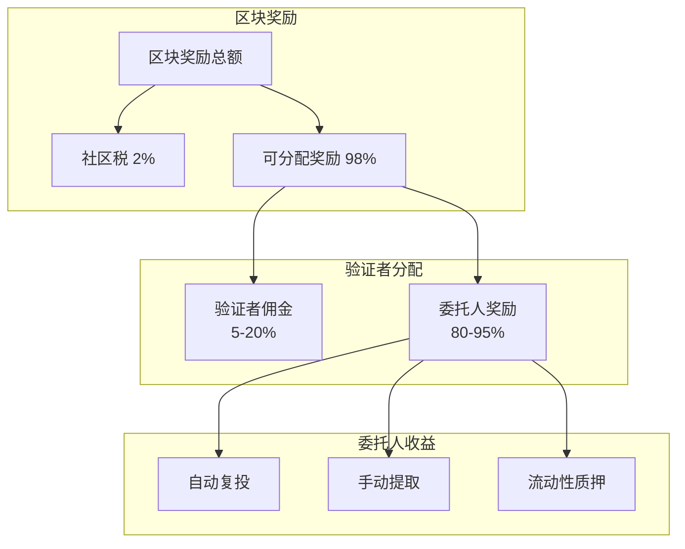

---

## 🔒 合规流程图

### 1. KYC 验证流程

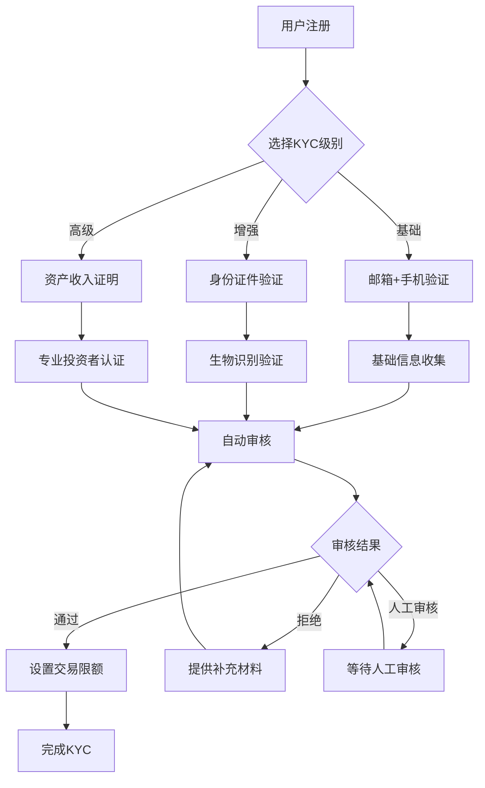

### 2. AML 监控流程

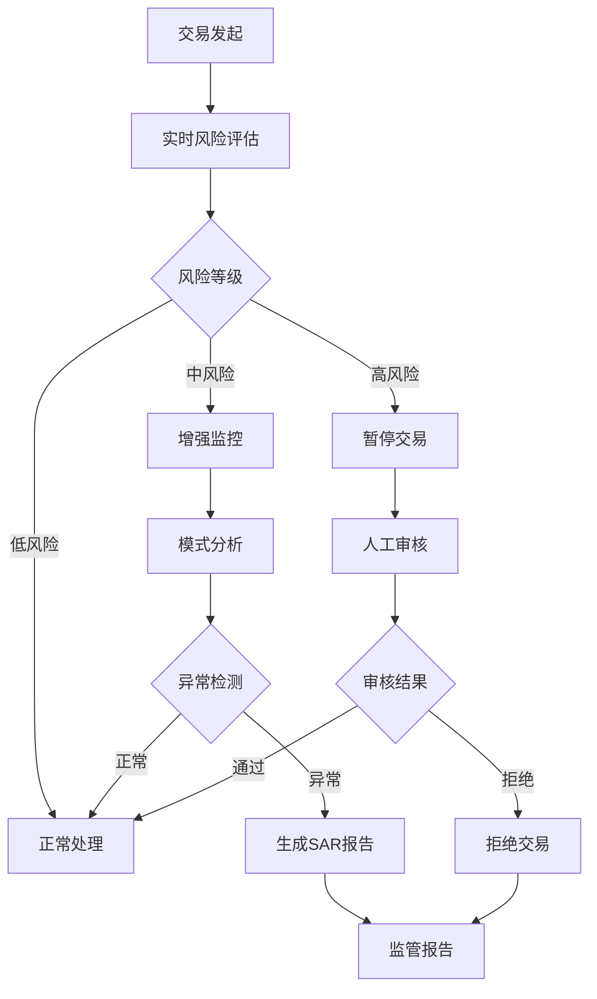

---

## 🌐 网络拓扑图

### 1. 验证者网络结构

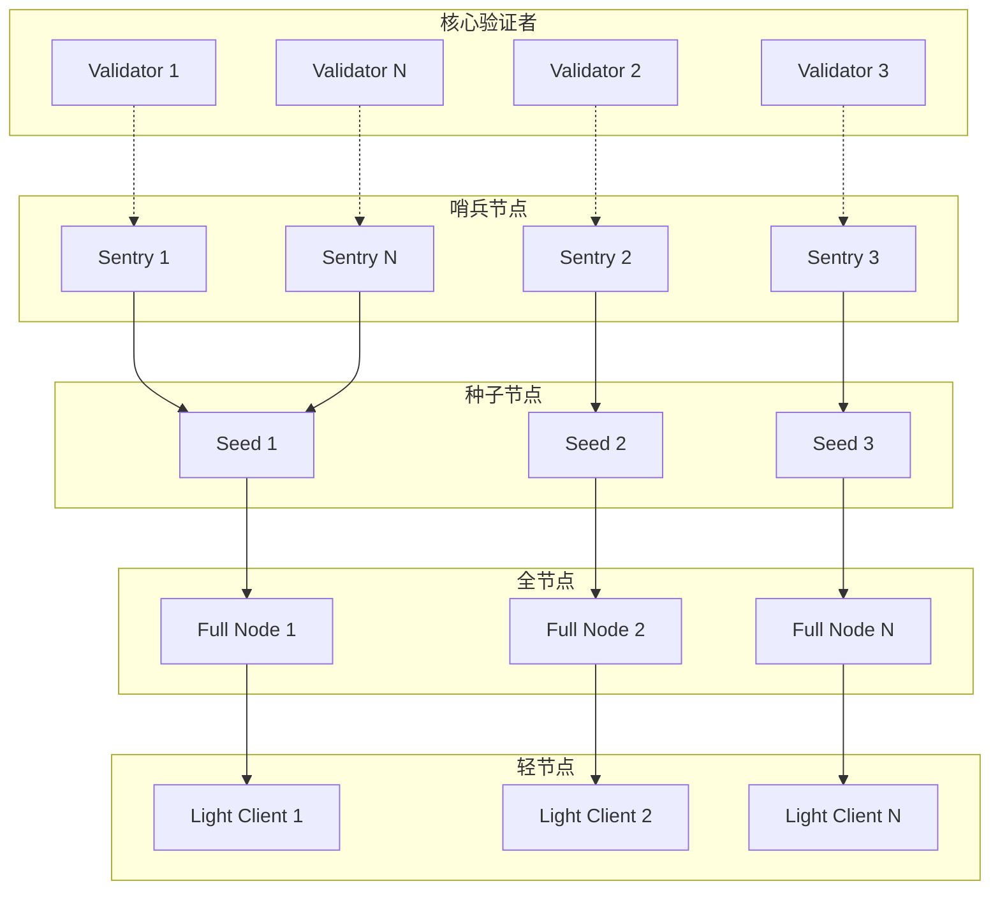

### 2. 跨链网络拓扑

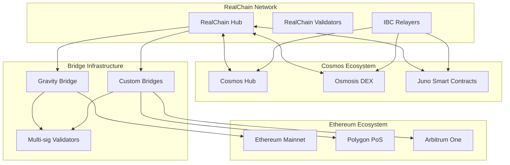

---

## 📊 数据流图

### 1. 交易处理流程

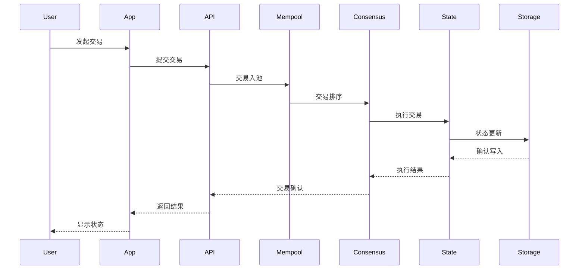

### 2. 资产上链流程

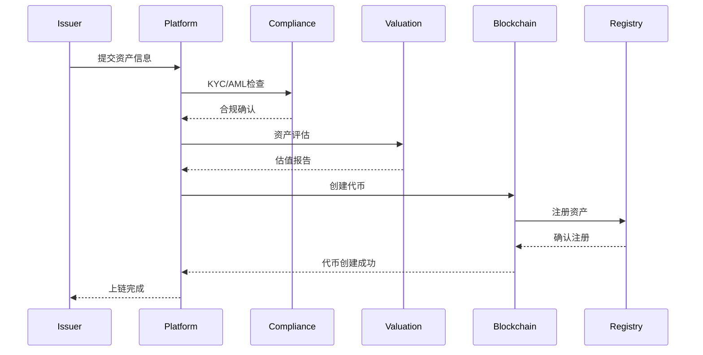

---

## 🔧 部署架构图

### 1. 生产环境部署

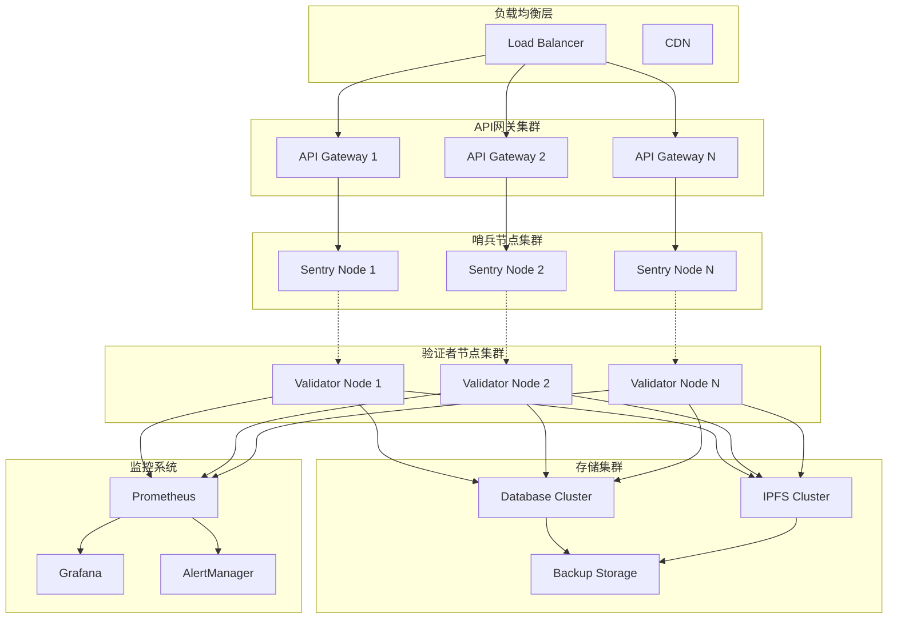

### 2. 开发测试环境

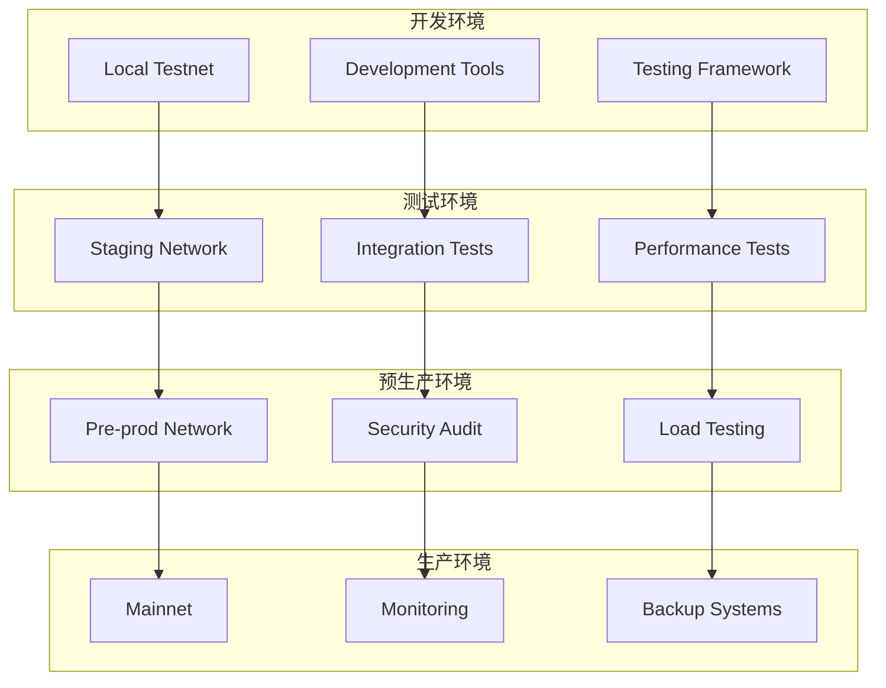

---

## 📈 性能监控架构

### 1. 监控指标体系

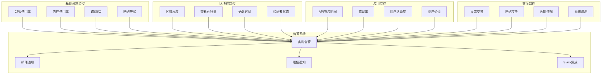

---

_架构图集结束_
