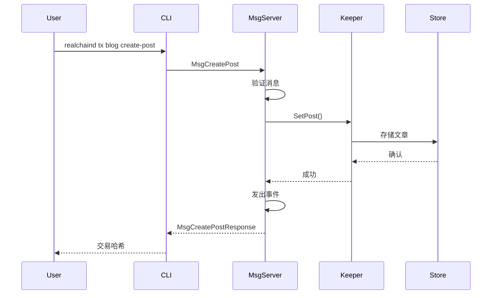
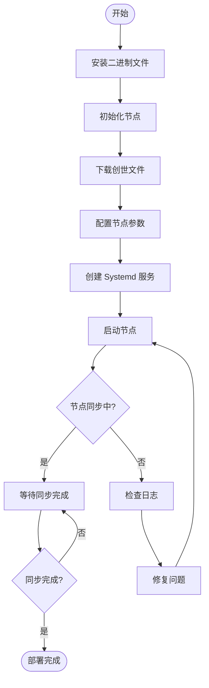
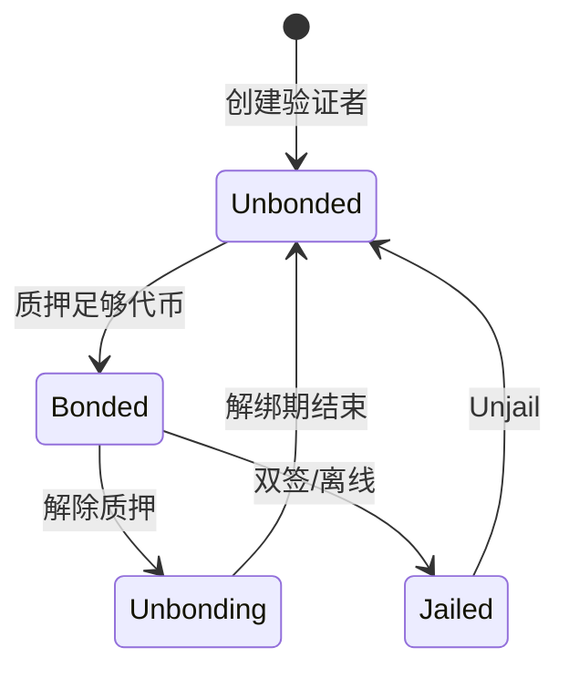

# RealChain 公链开发指南

**版本**: 1.0
**创建日期**: 2025 年 10 月 15 日
**最后更新**: 2025 年 10 月 15 日

> ⚠️ **重要声明**: 本文档为概念设计示例,用于学习和参考目的。
>
> -   **RealChain 不是一个真实存在的区块链项目**
> -   文档基于真实的技术栈(Cosmos SDK, Tendermint)进行概念设计
> -   所有代码示例和配置均为概念设计示例
> -   文档创建时间: 2025-10-15
> -   文档用途: 展示如何开发基于 Cosmos SDK 的公链及其扩展模块

---

## 📋 目录

1. [概述](#概述)
2. [公链开发流程](#公链开发流程)
3. [节点部署和运维流程](#节点部署和运维流程)
4. [治理和升级流程](#治理和升级流程)
5. [附录](#附录)

---

## 📖 概述

### 1.1 文档说明

#### 文档目的

本文档旨在为 RealChain 公链的开发者和运维人员提供完整的公链开发指南。文档涵盖:

-   **公链开发**: 基于 Cosmos SDK 的区块链开发流程 (链初始化、核心模块开发)
-   **节点运维**: 节点部署和运维最佳实践 (全节点、验证者节点)
-   **治理升级**: 链治理和升级流程 (提案、投票、升级)

**重点**: 本文档专注于**通用公链开发**,不涉及具体业务逻辑。如需了解业务模块开发 (如 RWA 模块),请参考 [模块开发指南](./Module-Development-Guide.md)。

#### 适用对象

| 角色             | 适用章节 | 技能要求                   |
| ---------------- | -------- | -------------------------- |
| **公链开发者**   | 第 2 章  | Go, Cosmos SDK, 区块链基础 |
| **节点运维人员** | 第 3 章  | Linux, Docker, 网络配置    |
| **治理参与者**   | 第 4 章  | 区块链治理, 社区参与       |

#### 阅读指南

-   **初学者**: 建议按顺序阅读,从第 1 章开始,逐步了解公链开发全流程
-   **有经验的开发者**: 可直接跳转到相关章节
-   **运维人员**: 重点阅读第 3 章 (节点部署和运维)
-   **治理参与者**: 重点阅读第 4 章 (治理和升级)

#### 版本信息

-   **当前版本**: v1.0
-   **创建日期**: 2025 年 10 月 15 日
-   **最后更新**: 2025 年 10 月 15 日
-   **维护者**: RealChain 核心开发团队

---

### 1.2 RealChain 公链架构

#### 架构概览

RealChain 是一个基于 **Cosmos SDK** 构建的模块化通用公链,支持通过扩展模块实现 RWA (Real World Assets) 资产代币化等业务功能。

```
RealChain 架构
├── Cosmos SDK (核心框架)
│   ├── Tendermint Consensus (共识层)
│   ├── ABCI (应用层接口)
│   └── Core Modules (核心模块)
│       ├── x/auth (账户管理)
│       ├── x/bank (代币转账)
│       ├── x/staking (质押)
│       ├── x/governance (治理)
│       └── x/distribution (分配)
│
├── Custom Modules (自定义模块)
│   ├── x/rwa (RWA 资产管理) ⭐
│   ├── x/compliance (合规检查) ⭐
│   └── x/valuation (资产估值) ⭐
│
└── External Integrations (外部集成)
    ├── IBC (跨链协议)
    ├── IPFS (分布式存储)
    └── Oracles (预言机)
```

**说明**: ⭐ 标记的模块为 RealChain 特有的扩展模块

#### 核心技术栈

| 组件           | 技术       | 版本   | 用途               |
| -------------- | ---------- | ------ | ------------------ |
| **区块链框架** | Cosmos SDK | v0.50+ | 公链开发框架       |
| **共识机制**   | Tendermint | v0.38+ | BFT 共识           |
| **编程语言**   | Go         | 1.21+  | 智能合约和模块开发 |
| **跨链协议**   | IBC        | v8.0+  | 跨链通信           |
| **分布式存储** | IPFS       | -      | 资产元数据存储     |
| **开发工具**   | Ignite CLI | v28+   | 链开发脚手架       |

#### RWA 扩展模块定位

**重要**: RealChain 是一个**通用公链**,RWA 功能通过**扩展模块**实现,而非核心功能。

**设计理念**:

-   **模块化**: RWA 模块可插拔,不影响核心功能
-   **可扩展**: 可以添加其他业务模块 (DeFi, NFT, etc.)
-   **互操作**: 通过 IBC 与其他 Cosmos 链互操作

**RWA 模块功能**:

-   资产代币化 (Property, Commodity, Bond)
-   合规检查 (KYC/AML)
-   资产估值 (Valuation Oracle)
-   生命周期管理 (Issuance, Transfer, Redemption)

---

### 1.3 开发环境准备

#### 系统要求

| 组件         | 最低要求    | 推荐配置         |
| ------------ | ----------- | ---------------- |
| **操作系统** | Linux/macOS | Ubuntu 22.04 LTS |
| **CPU**      | 2 核        | 4 核+            |
| **内存**     | 4 GB        | 8 GB+            |
| **存储**     | 50 GB       | 200 GB+ SSD      |
| **网络**     | 10 Mbps     | 100 Mbps+        |

#### 工具安装

##### 1. 安装 Go

```bash
# 下载 Go 1.21+
wget https://go.dev/dl/go1.21.0.linux-amd64.tar.gz

# 解压到 /usr/local
sudo tar -C /usr/local -xzf go1.21.0.linux-amd64.tar.gz

# 配置环境变量
echo 'export PATH=$PATH:/usr/local/go/bin' >> ~/.bashrc
echo 'export GOPATH=$HOME/go' >> ~/.bashrc
echo 'export PATH=$PATH:$GOPATH/bin' >> ~/.bashrc
source ~/.bashrc

# 验证安装
go version
```

**参考资源**: https://go.dev/doc/install

##### 2. 安装 Ignite CLI

```bash
# 使用 curl 安装
curl https://get.ignite.com/cli! | bash

# 验证安装
ignite version
```

**参考资源**: https://docs.ignite.com/

##### 3. 安装其他工具

```bash
# 安装 Git
sudo apt-get install git

# 安装 Make
sudo apt-get install build-essential

# 安装 jq (JSON 处理工具)
sudo apt-get install jq
```

#### 环境配置

##### 配置 Go 模块代理 (可选,加速下载)

```bash
go env -w GOPROXY=https://goproxy.io,direct
go env -w GOSUMDB=sum.golang.org
```

##### 创建工作目录

```bash
mkdir -p $HOME/realchain-dev
cd $HOME/realchain-dev
```

#### 参考资源链接

| 资源                    | 链接                             | 说明           |
| ----------------------- | -------------------------------- | -------------- |
| **Cosmos SDK 官方文档** | https://docs.cosmos.network/     | 核心开发指南   |
| **Tendermint 文档**     | https://docs.tendermint.com/     | 共识机制文档   |
| **Ignite CLI 文档**     | https://docs.ignite.com/         | 开发工具文档   |
| **IBC 协议文档**        | https://ibc.cosmos.network/      | 跨链协议文档   |
| **CosmJS 文档**         | https://cosmos.github.io/cosmjs/ | JavaScript SDK |
| **Go 官方文档**         | https://go.dev/doc/              | Go 语言文档    |

---

## 🔗 公链开发流程

### 2.1 公链初始化流程

#### 流程概述

公链初始化是 RealChain 开发的第一步,使用 Ignite CLI 快速创建区块链骨架,配置基本参数,并启动本地测试网。

**目标**:

-   创建 RealChain 区块链项目
-   配置链参数 (chain-id, denom, etc.)
-   初始化创世文件
-   启动本地单节点测试网

**预计时间**: 30-60 分钟

#### 详细步骤

##### 步骤 1: 使用 Ignite CLI 创建新链

```bash
# 创建新的区块链项目
ignite scaffold chain realchain --address-prefix real

# 进入项目目录
cd realchain

# 查看项目结构
tree -L 2
```

**输出示例**:

```
realchain/
├── app/
├── cmd/
├── proto/
├── testutil/
├── x/
├── config.yml
├── go.mod
└── go.sum
```

**参考资源**: https://docs.ignite.com/guide/hello

##### 步骤 2: 配置链参数

编辑 `config.yml` 文件:

```yaml
version: 1

build:
    proto:
        path: proto
        third_party_paths:
            - third_party/proto
            - proto_vendor

accounts:
    - name: alice
      coins:
          - 100000000000able
          - 100000000stake
    - name: bob
      coins:
          - 50000000000able
          - 50000000stake

validator:
    name: alice
    staked: 100000000stake

faucet:
    name: bob
    coins:
        - 5000000able
        - 100000stake

genesis:
    chain_id: realchain-1
    app_state:
        staking:
            params:
                bond_denom: stake
```

**说明**:

-   `accounts`: 预配置的账户和余额
-   `validator`: 验证者配置
-   `faucet`: 水龙头配置 (用于测试网)
-   `genesis.chain_id`: 链 ID (必须唯一)

**参考资源**: https://docs.ignite.com/references/config

---

### 2.2 核心模块开发流程

#### 流程概述

核心模块开发是 Cosmos SDK 区块链开发的核心环节。本节以开发一个简单的 **Blog 模块**为例,展示完整的模块开发流程。

**目标**:

-   理解 Cosmos SDK 模块结构
-   掌握 Keeper、Msg、Handler 的开发
-   学会编写单元测试
-   集成模块到主链

**预计时间**: 2-4 小时

#### 模块结构

```
x/blog/
├── keeper/
│ ├── keeper.go # Keeper 实现
│ ├── msg_server.go # 消息处理器
│ └── query.go # 查询处理器
├── types/
│ ├── keys.go # 存储键定义
│ ├── codec.go # 编解码器
│ ├── msg.go # 消息类型
│ └── genesis.go # 创世状态
├── client/
│ └── cli/ # CLI 命令
├── module.go # 模块定义
└── genesis.go # 创世逻辑
```

#### 详细步骤

##### 步骤 1: 创建模块骨架

```bash
# 使用 Ignite CLI 创建新模块
ignite scaffold module blog

# 创建消息类型 (创建博客文章)
ignite scaffold message create-post title content --module blog

# 创建查询类型 (查询文章)
ignite scaffold query post id --module blog
```

**参考资源**: https://docs.ignite.com/guide/blog/intro

##### 步骤 2: 定义 Proto 文件

编辑 `proto/realchain/blog/post.proto`:

```protobuf
syntax = "proto3";
package realchain.blog;

option go_package = "realchain/x/blog/types";

message Post {
  string id = 1;
  string title = 2;
  string content = 3;
  string creator = 4;
  int64 created_at = 5;
}
```

编辑 `proto/realchain/blog/tx.proto`:

```protobuf
syntax = "proto3";
package realchain.blog;

import "cosmos/msg/v1/msg.proto";

option go_package = "realchain/x/blog/types";

service Msg {
  option (cosmos.msg.v1.service) = true;

  rpc CreatePost(MsgCreatePost) returns (MsgCreatePostResponse);
}

message MsgCreatePost {
  option (cosmos.msg.v1.signer) = "creator";

  string creator = 1;
  string title = 2;
  string content = 3;
}

message MsgCreatePostResponse {
  string id = 1;
}
```

##### 步骤 3: 实现 Keeper (状态管理)

编辑 `x/blog/keeper/keeper.go`:

```go
package keeper

import (
    "context"
    "fmt"

    "cosmossdk.io/store/prefix"
    storetypes "cosmossdk.io/store/types"
    "github.com/cosmos/cosmos-sdk/codec"
    sdk "github.com/cosmos/cosmos-sdk/types"

    "realchain/x/blog/types"
)

type Keeper struct {
    cdc      codec.BinaryCodec
    storeKey storetypes.StoreKey
}

func NewKeeper(
    cdc codec.BinaryCodec,
    storeKey storetypes.StoreKey,
) Keeper {
    return Keeper{
        cdc:      cdc,
        storeKey: storeKey,
    }
}

// SetPost 存储文章
func (k Keeper) SetPost(ctx context.Context, post types.Post) {
    store := prefix.NewStore(runtime.KVStoreAdapter(k.storeService.OpenKVStore(ctx)), types.PostKey)
    b := k.cdc.MustMarshal(&post)
    store.Set([]byte(post.Id), b)
}

// GetPost 获取文章
func (k Keeper) GetPost(ctx context.Context, id string) (types.Post, bool) {
    store := prefix.NewStore(runtime.KVStoreAdapter(k.storeService.OpenKVStore(ctx)), types.PostKey)
    b := store.Get([]byte(id))
    if b == nil {
        return types.Post{}, false
    }

    var post types.Post
    k.cdc.MustUnmarshal(b, &post)
    return post, true
}
```

##### 步骤 4: 实现消息处理器 (Handler)

编辑 `x/blog/keeper/msg_server.go`:

```go
package keeper

import (
    "context"
    "fmt"
    "time"

    sdk "github.com/cosmos/cosmos-sdk/types"
    "realchain/x/blog/types"
)

type msgServer struct {
    Keeper
}

func NewMsgServerImpl(keeper Keeper) types.MsgServer {
    return &msgServer{Keeper: keeper}
}

func (k msgServer) CreatePost(goCtx context.Context, msg *types.MsgCreatePost) (*types.MsgCreatePostResponse, error) {
    ctx := sdk.UnwrapSDKContext(goCtx)

    // 生成文章 ID
    id := fmt.Sprintf("%s-%d", msg.Creator, ctx.BlockHeight())

    // 创建文章对象
    post := types.Post{
        Id:        id,
        Title:     msg.Title,
        Content:   msg.Content,
        Creator:   msg.Creator,
        CreatedAt: time.Now().Unix(),
    }

    // 存储文章
    k.SetPost(ctx, post)

    // 发出事件
    ctx.EventManager().EmitEvent(
        sdk.NewEvent(
            "post_created",
            sdk.NewAttribute("id", id),
            sdk.NewAttribute("creator", msg.Creator),
        ),
    )

    return &types.MsgCreatePostResponse{Id: id}, nil
}
```

##### 步骤 5: 编写单元测试

创建 `x/blog/keeper/msg_server_test.go`:

```go
package keeper_test

import (
    "testing"

    "github.com/stretchr/testify/require"

    keepertest "realchain/testutil/keeper"
    "realchain/x/blog/keeper"
    "realchain/x/blog/types"
)

func TestCreatePost(t *testing.T) {
    k, ctx := keepertest.BlogKeeper(t)
    srv := keeper.NewMsgServerImpl(k)

    // 创建测试消息
    msg := &types.MsgCreatePost{
        Creator: "real1abc...",
        Title:   "Test Post",
        Content: "This is a test post",
    }

    // 执行创建
    res, err := srv.CreatePost(ctx, msg)
    require.NoError(t, err)
    require.NotEmpty(t, res.Id)

    // 验证文章已存储
    post, found := k.GetPost(ctx, res.Id)
    require.True(t, found)
    require.Equal(t, msg.Title, post.Title)
    require.Equal(t, msg.Content, post.Content)
}
```

运行测试:

```bash
go test ./x/blog/keeper/...
```

##### 步骤 6: 集成模块到主链

编辑 `app/app.go`:

```go
import (
    blogkeeper "realchain/x/blog/keeper"
    blogmodule "realchain/x/blog"
    blogtypes "realchain/x/blog/types"
)

type App struct {
    // ... 其他 Keeper
    BlogKeeper blogkeeper.Keeper
}

func NewApp(...) *App {
    // ... 初始化其他 Keeper

    // 初始化 Blog Keeper
    app.BlogKeeper = blogkeeper.NewKeeper(
        appCodec,
        keys[blogtypes.StoreKey],
    )

    // 注册模块
    app.ModuleManager = module.NewManager(
        // ... 其他模块
        blogmodule.NewAppModule(appCodec, app.BlogKeeper),
    )

    return app
}
```

#### Mermaid 流程图



#### 测试模块

```bash
# 重新编译链
ignite chain build

# 启动测试网
ignite chain serve

# 创建文章
realchaind tx blog create-post "My First Post" "Hello RealChain!" \
  --from alice \
  --chain-id realchain-1 \
  --yes

# 查询文章
realchaind query blog post <post-id>
```

#### 最佳实践

1. **状态管理**:

    - 使用 Prefix Store 隔离不同类型的数据
    - 合理设计存储键,避免冲突
    - 考虑数据迁移和升级

2. **消息验证**:

    - 在 `ValidateBasic()` 中进行基本验证
    - 在 Handler 中进行状态相关验证
    - 返回清晰的错误信息

3. **事件发出**:

    - 为重要操作发出事件
    - 事件属性应包含关键信息
    - 便于前端监听和索引

4. **测试覆盖**:

    - 编写单元测试覆盖所有功能
    - 测试正常流程和异常情况
    - 使用表驱动测试提高效率

#### 参考资源

-   **Cosmos SDK 模块开发**: https://docs.cosmos.network/main/build/building-modules/intro
-   **Keeper 设计模式**: https://docs.cosmos.network/main/build/building-modules/keeper
-   **消息处理**: https://docs.cosmos.network/main/build/building-modules/msg-services
-   **单元测试**: https://docs.cosmos.network/main/build/building-modules/testing

---

## 🧩 自定义模块开发流程

### 3.1 RWA 模块开发流程 (作为示例)

## 🖥️ 节点部署和运维流程

### 4.1 节点部署流程

#### 流程概述

部署 RealChain 节点,包括全节点和验证者节点的部署。

**目标**:

-   部署全节点
-   配置验证者节点
-   配置网络参数
-   启动节点并同步区块

**预计时间**: 2-4 小时

#### 系统要求

| 节点类型       | CPU  | 内存  | 存储       | 网络     |
| -------------- | ---- | ----- | ---------- | -------- |
| **全节点**     | 4 核 | 8 GB  | 500 GB SSD | 100 Mbps |
| **验证者节点** | 8 核 | 16 GB | 1 TB SSD   | 1 Gbps   |

#### 详细步骤

##### 步骤 1: 安装 RealChain 二进制文件

```bash
# 克隆仓库
git clone https://github.com/realchain/realchain.git
cd realchain

# 检出特定版本
git checkout v1.0.0

# 编译二进制文件
make install

# 验证安装
realchaind version
```

##### 步骤 2: 初始化节点

```bash
# 初始化节点
realchaind init <your-node-name> --chain-id realchain-1

# 下载创世文件
curl https://raw.githubusercontent.com/realchain/networks/main/realchain-1/genesis.json \
  > ~/.realchain/config/genesis.json

# 验证创世文件
realchaind validate-genesis
```

##### 步骤 3: 配置节点

编辑 `~/.realchain/config/config.toml`:

```toml
# 配置种子节点
seeds = "seed1@seed1.realchain.network:26656,seed2@seed2.realchain.network:26656"

# 配置持久化节点
persistent_peers = "peer1@peer1.realchain.network:26656"

# 配置 RPC 端口
[rpc]
laddr = "tcp://0.0.0.0:26657"

# 配置 P2P 端口
[p2p]
laddr = "tcp://0.0.0.0:26656"
external_address = "<your-public-ip>:26656"

# 配置状态同步 (可选,加速同步)
[statesync]
enable = true
rpc_servers = "https://rpc1.realchain.network:443,https://rpc2.realchain.network:443"
trust_height = 1000000
trust_hash = "TRUST_HASH_HERE"
```

编辑 `~/.realchain/config/app.toml`:

```toml
# 配置最小 Gas 价格
minimum-gas-prices = "0.001able"

# 配置 API 服务器
[api]
enable = true
address = "tcp://0.0.0.0:1317"

# 配置 gRPC 服务器
[grpc]
enable = true
address = "0.0.0.0:9090"
```

##### 步骤 4: 创建 Systemd 服务

创建 `/etc/systemd/system/realchaind.service`:

```ini
[Unit]
Description=RealChain Node
After=network-online.target

[Service]
User=realchain
ExecStart=/usr/local/bin/realchaind start --home /home/realchain/.realchain
Restart=on-failure
RestartSec=3
LimitNOFILE=65535

[Install]
WantedBy=multi-user.target
```

启动服务:

```bash
# 重新加载 systemd
sudo systemctl daemon-reload

# 启动节点
sudo systemctl start realchaind

# 设置开机自启
sudo systemctl enable realchaind

# 查看日志
sudo journalctl -u realchaind -f
```

##### 步骤 5: 验证节点同步

```bash
# 检查节点状态
realchaind status | jq '.SyncInfo'

# 查看同步进度
realchaind status | jq '.SyncInfo.catching_up'
```

#### Mermaid 流程图

##### 节点部署流程 (Flowchart)



#### 参考资源

-   **Cosmos SDK 节点部署**: https://docs.cosmos.network/main/run-node/run-node
-   **Tendermint 配置**: https://docs.tendermint.com/v0.34/tendermint-core/configuration.html

---

### 4.2 验证者运维流程

#### 流程概述

配置和运维验证者节点,包括创建验证者、质押管理和监控。

**目标**:

-   创建验证者
-   管理质押
-   监控节点状态
-   处理常见问题

**预计时间**: 2-4 小时

#### 详细步骤

##### 步骤 1: 创建验证者密钥

```bash
# 创建新密钥
realchaind keys add validator

# 或者恢复现有密钥
realchaind keys add validator --recover

# 查看密钥信息
realchaind keys show validator
```

##### 步骤 2: 获取测试代币 (测试网)

```bash
# 获取验证者地址
VALIDATOR_ADDR=$(realchaind keys show validator -a)

# 从水龙头获取代币 (测试网)
curl -X POST https://faucet.realchain.network/request \
  -H "Content-Type: application/json" \
  -d "{\"address\": \"$VALIDATOR_ADDR\"}"

# 查询余额
realchaind query bank balances $VALIDATOR_ADDR
```

##### 步骤 3: 创建验证者

```bash
# 创建验证者
realchaind tx staking create-validator \
  --amount=100000000stake \
  --pubkey=$(realchaind tendermint show-validator) \
  --moniker="<your-validator-name>" \
  --chain-id=realchain-1 \
  --commission-rate="0.10" \
  --commission-max-rate="0.20" \
  --commission-max-change-rate="0.01" \
  --min-self-delegation="1" \
  --gas="auto" \
  --gas-adjustment=1.5 \
  --gas-prices="0.001able" \
  --from=validator

# 查询验证者信息
realchaind query staking validator $(realchaind keys show validator --bech val -a)
```

##### 步骤 4: 配置监控

安装 Prometheus 和 Grafana:

```bash
# 安装 Prometheus
sudo apt-get install prometheus

# 配置 Prometheus
cat > /etc/prometheus/prometheus.yml <<EOF
global:
  scrape_interval: 15s

scrape_configs:
  - job_name: 'realchain'
    static_configs:
      - targets: ['localhost:26660']
EOF

# 启动 Prometheus
sudo systemctl start prometheus
sudo systemctl enable prometheus

# 安装 Grafana
sudo apt-get install grafana

# 启动 Grafana
sudo systemctl start grafana-server
sudo systemctl enable grafana-server
```

配置 RealChain 节点启用 Prometheus:

编辑 `~/.realchain/config/config.toml`:

```toml
[instrumentation]
prometheus = true
prometheus_listen_addr = ":26660"
```

##### 步骤 5: 设置告警

创建告警脚本 `monitor.sh`:

```bash
#!/bin/bash

# 检查节点是否在线
STATUS=$(realchaind status 2>&1)
if [ $? -ne 0 ]; then
    echo "Node is offline!"
    # 发送告警 (例如通过 Telegram, Email, etc.)
    exit 1
fi

# 检查是否在同步
CATCHING_UP=$(echo $STATUS | jq -r '.SyncInfo.catching_up')
if [ "$CATCHING_UP" == "true" ]; then
    echo "Node is catching up!"
    # 发送告警
fi

# 检查验证者是否在活跃集中
VALIDATOR_ADDR=$(realchaind keys show validator --bech val -a)
VALIDATOR_INFO=$(realchaind query staking validator $VALIDATOR_ADDR -o json)
STATUS=$(echo $VALIDATOR_INFO | jq -r '.status')

if [ "$STATUS" != "BOND_STATUS_BONDED" ]; then
    echo "Validator is not bonded!"
    # 发送告警
fi

echo "All checks passed!"
```

设置定时任务:

```bash
# 编辑 crontab
crontab -e

# 添加每 5 分钟检查一次
*/5 * * * * /path/to/monitor.sh
```

#### Mermaid 流程图

##### 验证者生命周期 (State Diagram)



#### 常见问题

| 问题          | 原因         | 解决方案                             |
| ------------- | ------------ | ------------------------------------ |
| 验证者被 Jail | 离线时间过长 | 运行 `realchaind tx slashing unjail` |
| 节点不同步    | 网络问题     | 检查 `persistent_peers` 配置         |
| 内存不足      | 配置不足     | 增加服务器内存                       |

#### 参考资源

-   **Cosmos SDK 验证者指南**: https://docs.cosmos.network/main/run-node/run-production
-   **Tendermint 监控**: https://docs.tendermint.com/v0.34/tendermint-core/metrics.html

---

## 📱 DApp 开发和集成流程

## 🏛️ 治理和升级流程

### 6.1 治理提案流程

#### 流程概述

通过链上治理提交和投票提案。

**目标**:

-   提交治理提案
-   参与投票
-   执行提案

**预计时间**: 1-2 小时

#### 提案类型

| 提案类型           | 说明           | 示例          |
| ------------------ | -------------- | ------------- |
| **文本提案**       | 社区讨论和决策 | 改进建议      |
| **参数变更提案**   | 修改链参数     | 修改 Gas 价格 |
| **软件升级提案**   | 升级链版本     | 升级到 v2.0   |
| **社区池支出提案** | 使用社区资金   | 资助开发      |

#### 详细步骤

##### 步骤 1: 提交文本提案

```bash
# 创建提案 JSON
cat > proposal.json <<EOF
{
  "title": "Increase Block Size",
  "description": "Proposal to increase the maximum block size from 1MB to 2MB",
  "deposit": "10000000able"
}
EOF

# 提交提案
realchaind tx gov submit-proposal \
  --title "Increase Block Size" \
  --description "Proposal to increase the maximum block size" \
  --type Text \
  --deposit 10000000able \
  --from validator \
  --chain-id realchain-1 \
  --gas auto \
  --gas-adjustment 1.5 \
  --gas-prices 0.001able

# 查询提案
realchaind query gov proposals
```

##### 步骤 2: 对提案投票

```bash
# 投票 (Yes/No/Abstain/NoWithVeto)
realchaind tx gov vote <proposal-id> yes \
  --from validator \
  --chain-id realchain-1 \
  --gas auto \
  --gas-prices 0.001able

# 查询投票结果
realchaind query gov votes <proposal-id>
```

##### 步骤 3: 查询提案状态

```bash
# 查询提案详情
realchaind query gov proposal <proposal-id>

# 查询投票统计
realchaind query gov tally <proposal-id>
```

#### 参考资源

-   **Cosmos SDK 治理**: https://docs.cosmos.network/main/build/modules/gov

---

### 6.2 链升级流程

#### 流程概述

通过治理提案升级链版本。

**目标**:

-   提交升级提案
-   准备升级
-   执行升级

**预计时间**: 2-4 小时

#### 详细步骤

##### 步骤 1: 提交升级提案

```bash
# 提交软件升级提案
realchaind tx gov submit-proposal software-upgrade v2.0.0 \
  --title "Upgrade to v2.0.0" \
  --description "Upgrade RealChain to version 2.0.0" \
  --upgrade-height 1000000 \
  --deposit 10000000able \
  --from validator \
  --chain-id realchain-1

# 投票
realchaind tx gov vote <proposal-id> yes --from validator
```

##### 步骤 2: 准备升级

```bash
# 下载新版本
wget https://github.com/realchain/realchain/releases/download/v2.0.0/realchaind
chmod +x realchaind
sudo mv realchaind /usr/local/bin/

# 验证版本
realchaind version
```

##### 步骤 3: 执行升级

```bash
# 节点会在指定高度自动停止
# 等待升级高度到达

# 重启节点
sudo systemctl restart realchaind

# 查看日志
sudo journalctl -u realchaind -f
```

#### 参考资源

-   **Cosmos SDK 升级**: https://docs.cosmos.network/main/build/building-apps/app-upgrade

## 📚 附录

### 7.1 API 参考

#### REST API

RealChain 提供标准的 Cosmos SDK REST API:

| 端点                                          | 方法 | 说明           |
| --------------------------------------------- | ---- | -------------- |
| `/cosmos/bank/v1beta1/balances/{address}`     | GET  | 查询账户余额   |
| `/cosmos/tx/v1beta1/txs`                      | POST | 广播交易       |
| `/cosmos/tx/v1beta1/txs/{hash}`               | GET  | 查询交易       |
| `/cosmos/staking/v1beta1/validators`          | GET  | 查询验证者列表 |
| `/realchain/rwa/v1/assets/{id}`               | GET  | 查询 RWA 资产  |
| `/realchain/compliance/v1/identity/{address}` | GET  | 查询身份信息   |

**示例**:

```bash
# 查询余额
curl https://api.realchain.network/cosmos/bank/v1beta1/balances/real1abc...

# 查询 RWA 资产
curl https://api.realchain.network/realchain/rwa/v1/assets/rwa-12345
```

#### gRPC API

RealChain 提供 gRPC API (端口 9090):

```bash
# 使用 grpcurl 查询
grpcurl -plaintext localhost:9090 list

# 查询余额
grpcurl -plaintext \
  -d '{"address":"real1abc..."}' \
  localhost:9090 \
  cosmos.bank.v1beta1.Query/Balance
```

#### 参考资源

-   **Cosmos SDK REST API**: https://docs.cosmos.network/main/build/modules
-   **gRPC 文档**: https://grpc.io/docs/

---

### 7.2 常见问题 (FAQ)

#### 公链开发相关

**Q: 如何修改区块时间?**

A: 编辑 `~/.realchain/config/config.toml`:

```toml
[consensus]
timeout_commit = "5s"  # 修改为你想要的区块时间
```

**Q: 如何增加最大 Gas 限制?**

A: 编辑 `~/.realchain/config/app.toml`:

```toml
[api]
max-gas-wanted = 10000000  # 修改最大 Gas
```

**Q: 如何启用 CORS?**

A: 编辑 `~/.realchain/config/config.toml`:

```toml
[rpc]
cors_allowed_origins = ["*"]
```

#### 模块开发相关

**Q: 如何在模块间共享数据?**

A: 通过 Keeper 依赖注入:

```go
type Keeper struct {
    bankKeeper    types.BankKeeper
    stakingKeeper types.StakingKeeper
}
```

**Q: 如何处理大数?**

A: 使用 `sdk.Int` 或 `sdk.Dec`:

```go
amount := sdk.NewInt(1000000)
price := sdk.NewDec(100)
```

#### 节点运维相关

**Q: 如何备份节点数据?**

A: 备份 `~/.realchain` 目录:

```bash
tar -czf realchain-backup.tar.gz ~/.realchain
```

**Q: 如何恢复节点?**

A: 解压备份文件:

```bash
tar -xzf realchain-backup.tar.gz -C ~/
```

**Q: 验证者被 Jail 怎么办?**

A: 运行 unjail 命令:

```bash
realchaind tx slashing unjail \
  --from validator \
  --chain-id realchain-1
```

#### DApp 开发相关

**Q: 如何处理交易失败?**

A: 检查 `result.code` 和 `result.rawLog`:

```typescript
if (result.code !== 0) {
    console.error("Transaction failed:", result.rawLog);
}
```

**Q: 如何监听链上事件?**

A: 使用 WebSocket 订阅:

```typescript
const ws = new WebSocket("wss://rpc.realchain.network/websocket");
ws.send(
    JSON.stringify({
        jsonrpc: "2.0",
        method: "subscribe",
        params: ["tm.event='NewBlock'"],
        id: 1,
    })
);
```

---

### 7.3 故障排查指南

#### 节点无法启动

**症状**: 运行 `realchaind start` 后立即退出

**可能原因**:

1. 端口被占用
2. 创世文件损坏
3. 数据库损坏

**解决方案**:

```bash
# 检查端口
lsof -i :26656
lsof -i :26657

# 验证创世文件
realchaind validate-genesis

# 重置数据库 (警告: 会删除所有数据)
realchaind tendermint unsafe-reset-all
```

#### 节点不同步

**症状**: `catching_up` 一直为 `true`

**可能原因**:

1. 网络连接问题
2. Peers 配置错误
3. 磁盘 I/O 过慢

**解决方案**:

```bash
# 检查 Peers
realchaind status | jq '.SyncInfo.peers'

# 添加更多 Peers
# 编辑 ~/.realchain/config/config.toml
persistent_peers = "peer1@ip1:26656,peer2@ip2:26656"

# 启用状态同步
[statesync]
enable = true
```

#### 交易失败

**症状**: 交易返回错误码

**常见错误**:

| 错误码 | 说明       | 解决方案       |
| ------ | ---------- | -------------- |
| `5`    | 余额不足   | 检查账户余额   |
| `11`   | Out of gas | 增加 Gas 限制  |
| `19`   | 交易已存在 | 等待交易确认   |
| `32`   | 未授权     | 检查签名者权限 |

**解决方案**:

```bash
# 查询余额
realchaind query bank balances <address>

# 增加 Gas
realchaind tx ... --gas 200000

# 查询交易状态
realchaind query tx <tx-hash>
```

#### 内存不足

**症状**: 节点 OOM (Out of Memory)

**解决方案**:

```bash
# 增加 swap
sudo fallocate -l 4G /swapfile
sudo chmod 600 /swapfile
sudo mkswap /swapfile
sudo swapon /swapfile

# 优化配置
# 编辑 ~/.realchain/config/config.toml
[mempool]
size = 5000  # 减小 mempool 大小
cache_size = 10000  # 减小缓存大小
```

---

### 7.4 参考资源汇总

#### 官方文档

| 资源             | 链接                             | 说明           |
| ---------------- | -------------------------------- | -------------- |
| **Cosmos SDK**   | https://docs.cosmos.network/     | 核心框架文档   |
| **Tendermint**   | https://docs.tendermint.com/     | 共识引擎文档   |
| **IBC Protocol** | https://ibc.cosmos.network/      | 跨链协议文档   |
| **CosmJS**       | https://cosmos.github.io/cosmjs/ | JavaScript SDK |
| **Ignite CLI**   | https://docs.ignite.com/         | 开发工具文档   |

#### RWA 相关标准

| 资源                 | 链接                                        | 说明              |
| -------------------- | ------------------------------------------- | ----------------- |
| **T-REX (ERC-3643)** | https://github.com/TokenySolutions/T-REX    | 证券代币标准      |
| **ONCHAINID**        | https://github.com/onchain-id/solidity      | 链上身份标准      |
| **ERC-735**          | https://github.com/ethereum/EIPs/issues/735 | Claim Holder 标准 |

#### 成功案例

| 项目           | 链接                    | 说明                  |
| -------------- | ----------------------- | --------------------- |
| **Centrifuge** | https://centrifuge.io/  | RWA 代币化平台        |
| **Osmosis**    | https://osmosis.zone/   | Cosmos 生态 DEX       |
| **Juno**       | https://junonetwork.io/ | CosmWasm 智能合约平台 |

#### 社区资源

| 资源               | 链接                             | 说明         |
| ------------------ | -------------------------------- | ------------ |
| **Cosmos Discord** | https://discord.gg/cosmosnetwork | 官方 Discord |
| **Cosmos Forum**   | https://forum.cosmos.network/    | 官方论坛     |
| **Cosmos GitHub**  | https://github.com/cosmos        | 官方 GitHub  |

#### 开发工具

| 工具                     | 链接                              | 说明        |
| ------------------------ | --------------------------------- | ----------- |
| **Keplr Wallet**         | https://www.keplr.app/            | Cosmos 钱包 |
| **Mintscan**             | https://www.mintscan.io/          | 区块浏览器  |
| **Cosmos SDK Tutorials** | https://tutorials.cosmos.network/ | 官方教程    |

---

## 📝 文档结束

**版本**: 1.0
**创建日期**: 2025 年 10 月 15 日
**最后更新**: 2025 年 10 月 15 日

> ⚠️ **再次提醒**: 本文档为概念设计示例,用于学习和参考目的。RealChain 不是一个真实存在的区块链项目。所有代码示例和配置均为概念设计示例。

**文档统计**:

-   总章节: 7 章
-   总小节: 14 节
-   代码示例: 50+ 个
-   Mermaid 图表: 6 个
-   参考资源: 30+ 个

**适用对象**:

-   公链开发者
-   模块开发者
-   节点运维人员
-   DApp 开发者
-   治理参与者

**下一步建议**:

1. 从第 1 章开始,按顺序学习
2. 动手实践每个代码示例
3. 参考官方文档深入学习
4. 加入社区交流讨论

**反馈和贡献**:

-   如有问题或建议,请提交 Issue
-   欢迎贡献代码和文档改进

---

**感谢使用 RealChain 业务开发流程技术文档!** 🚀
