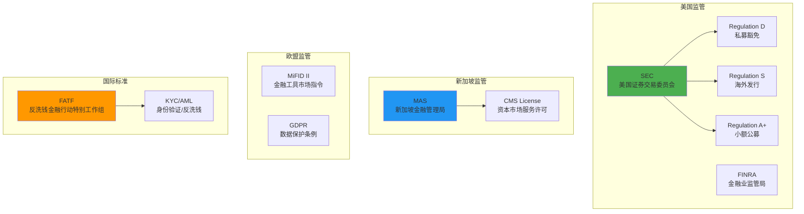
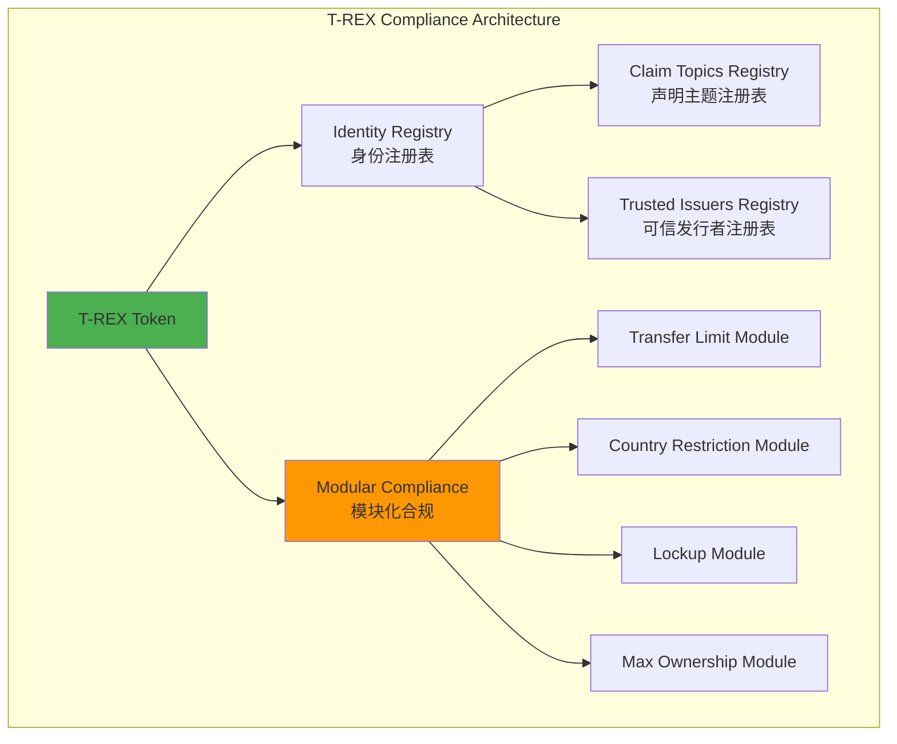
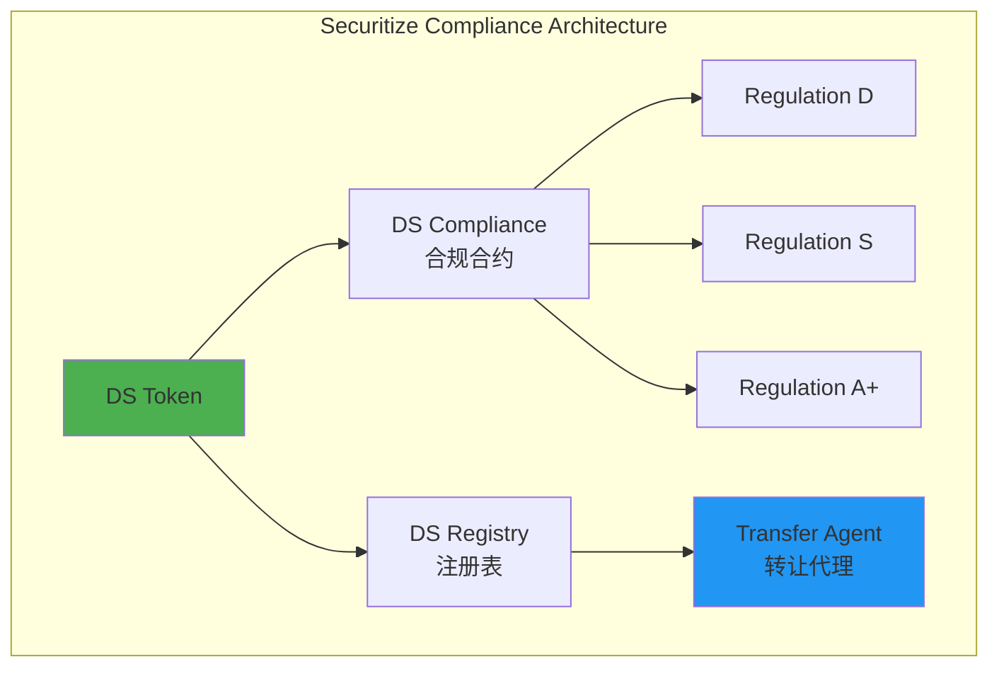
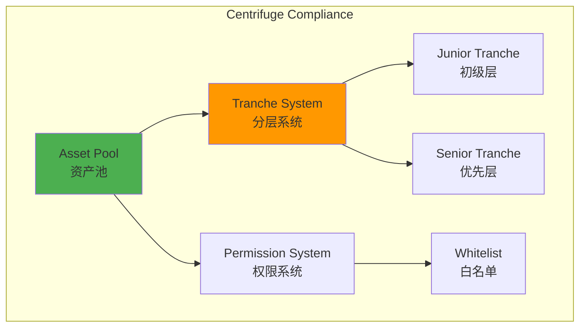
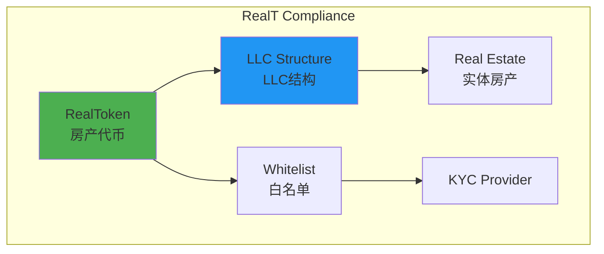
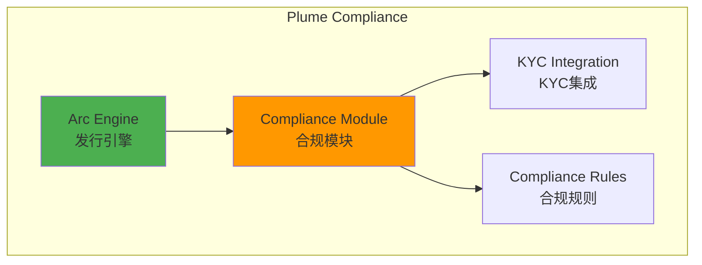
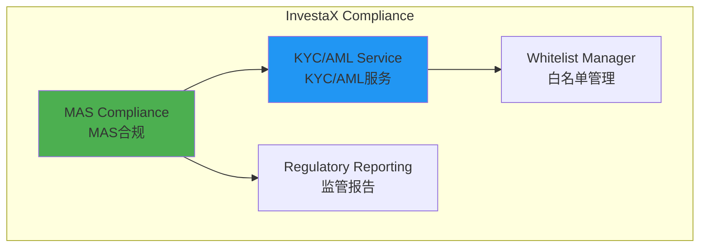
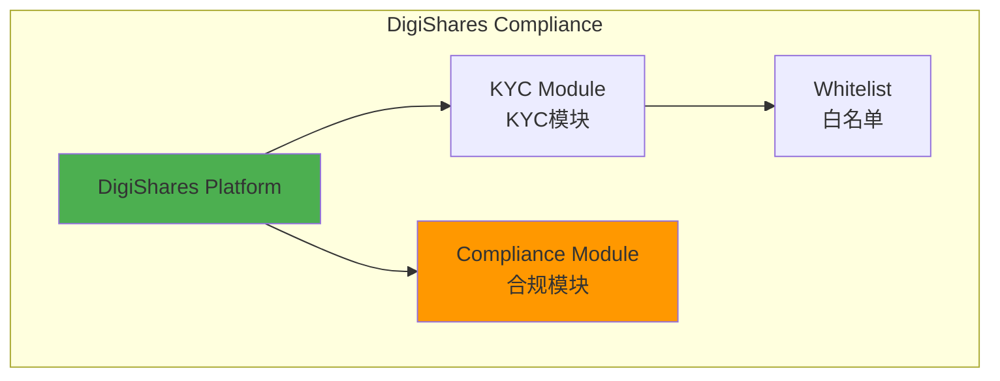

# RWA产品合规性对比分析

**文档版本**: v1.0  
**创建时间**: 2025-10-09 11:25:00 CST  
**文档类型**: 合规性对比分析  
**覆盖产品**: 7个RWA产品

---

## 📑 目录

1. [合规框架总览](#1-合规框架总览)
2. [协议层产品合规性](#2-协议层产品合规性)
3. [平台层产品合规性](#3-平台层产品合规性)
4. [合规性对比矩阵](#4-合规性对比矩阵)
5. [最佳实践总结](#5-最佳实践总结)

---

## 1. 合规框架总览

### 1.1 全球主要监管框架



### 1.2 合规性核心要素

| 要素 | 说明 | 重要性 |
|------|------|--------|
| **KYC/AML** | 身份验证和反洗钱 | ⭐⭐⭐⭐⭐ |
| **投资者分类** | 合格/非合格投资者 | ⭐⭐⭐⭐⭐ |
| **转账限制** | 锁定期、转账上限 | ⭐⭐⭐⭐ |
| **地域限制** | 国家/地区白名单 | ⭐⭐⭐⭐ |
| **监管报告** | 定期向监管机构报告 | ⭐⭐⭐⭐⭐ |
| **审计追踪** | 完整的操作记录 | ⭐⭐⭐⭐ |

---

## 2. 协议层产品合规性

### 2.1 Tokeny T-REX（ERC3643标准）

#### 合规架构



#### 核心特点

**1. 模块化合规系统**
- ✅ **可插拔设计**: 每个合规规则是独立模块
- ✅ **动态配置**: 可以实时添加/移除合规模块
- ✅ **可组合**: 多个模块可以组合使用
- ✅ **可升级**: 模块可以独立升级

**2. 身份管理**
- ✅ **强制KYC/AML**: 所有投资者必须通过身份验证
- ✅ **声明系统**: 支持多种声明类型（KYC、AML、合格投资者、国家）
- ✅ **可信发行者**: 只有授权的KYC提供商可以发行声明
- ✅ **链上身份**: 身份信息存储在链上，不可篡改

**3. 合规模块类型**

| 模块类型 | 功能 | 实现方式 |
|---------|------|---------|
| **Transfer Limits** | 转账限制 | 每日/单笔转账上限 |
| **Country Restrictions** | 地域限制 | 国家白名单/黑名单 |
| **Lockup Period** | 锁定期 | 时间锁定 |
| **Max Ownership** | 最大持有量 | 持有比例限制 |
| **Investor Count** | 投资者数量 | 最大投资者数限制 |

**4. 合规检查流程**

```solidity
// 转账时的合规检查（简化）
function transfer(address to, uint256 amount) public returns (bool) {
    // 1. 身份验证
    require(identityRegistry.isVerified(msg.sender), "Sender not verified");
    require(identityRegistry.isVerified(to), "Receiver not verified");
    
    // 2. 合规模块检查
    require(compliance.canTransfer(msg.sender, to, amount), "Compliance check failed");
    
    // 3. 执行转账
    _transfer(msg.sender, to, amount);
    return true;
}
```

#### 优势与劣势

**优势**：
- ✅ 标准化：ERC3643是行业标准
- ✅ 灵活性：模块化设计易于定制
- ✅ 互操作性：所有ERC3643代币可以互操作
- ✅ 全球认可：被多个监管机构认可

**劣势**：
- ⚠️ 复杂性：需要部署多个合约
- ⚠️ Gas成本：合规检查增加Gas费用
- ⚠️ 学习曲线：开发者需要理解ERC3643标准

---

### 2.2 Securitize（DS Protocol）

#### 合规架构



#### 核心特点

**1. SEC合规框架**
- ✅ **Regulation D**: 私募豁免（506b/506c）
- ✅ **Regulation S**: 海外发行
- ✅ **Regulation A+**: 小额公募（最高$75M）
- ✅ **Regulation CF**: 众筹（最高$5M）

**2. Transfer Agent服务**
- ✅ **SEC注册**: 作为SEC注册的Transfer Agent
- ✅ **股东名册**: 维护完整的股东名册
- ✅ **合规报告**: 自动生成SEC报告（Form D、Form 1-A等）
- ✅ **公司行动**: 处理分红、赎回、投票等

**3. Regulation D实现**

```solidity
// Regulation D 506(c) 合规检查（简化）
contract RegulationD {
    uint256 public constant MAX_NON_ACCREDITED = 35;  // 506(b)
    bool public onlyAccredited;  // 506(c)
    uint256 public constant LOCKUP_PERIOD = 365 days;
    
    function checkCompliance(address investor, uint256 amount) 
        external view returns (bool, string memory) {
        // 检查合格投资者状态
        if (onlyAccredited && !isAccredited(investor)) {
            return (false, "Only accredited investors allowed");
        }
        
        // 检查锁定期
        if (block.timestamp < investorLockupEnd[investor]) {
            return (false, "Tokens are locked");
        }
        
        return (true, "");
    }
}
```

**4. Regulation S实现**

```solidity
// Regulation S 合规检查（简化）
contract RegulationS {
    mapping(address => bool) public isUSPerson;
    uint256 public constant DISTRIBUTION_COMPLIANCE_PERIOD = 40 days;
    
    function checkCompliance(address investor, uint256 amount) 
        external view returns (bool, string memory) {
        // 禁止美国投资者
        if (isUSPerson[investor]) {
            return (false, "US persons not allowed");
        }
        
        // 检查分销合规期（40天）
        if (block.timestamp < issuanceDate + DISTRIBUTION_COMPLIANCE_PERIOD) {
            return (false, "Distribution compliance period not ended");
        }
        
        return (true, "");
    }
}
```

#### 优势与劣势

**优势**：
- ✅ 机构级：SEC注册的Transfer Agent
- ✅ 合规性强：深度集成SEC规则
- ✅ 全流程：从发行到二级市场的完整解决方案
- ✅ 品牌信任：Securitize是行业领导者

**劣势**：
- ⚠️ 美国中心：主要针对美国市场
- ⚠️ 成本高：机构级服务成本较高
- ⚠️ 灵活性低：合规规则相对固定

---

### 2.3 Centrifuge（Polkadot生态）

#### 合规架构



#### 核心特点

**1. 权限系统**
- ✅ **白名单机制**: 只有白名单投资者可以投资
- ✅ **角色管理**: Pool Admin、Asset Originator、Investor
- ✅ **链上权限**: 权限存储在Substrate Pallet中

**2. 分层合规**
- ✅ **Junior Tranche**: 高风险，高收益，通常面向专业投资者
- ✅ **Senior Tranche**: 低风险，低收益，可面向零售投资者
- ✅ **风险隔离**: 不同层级有不同的合规要求

**3. KYC集成**
- ✅ **第三方KYC**: 集成Fractal、Civic等KYC提供商
- ✅ **链下验证**: KYC在链下完成，结果上链
- ✅ **隐私保护**: 不存储敏感个人信息

#### 优势与劣势

**优势**：
- ✅ 灵活性：基于Substrate，高度可定制
- ✅ 跨链：通过XCM支持跨链资产
- ✅ 低成本：Polkadot生态Gas费用低

**劣势**：
- ⚠️ 生态小：Polkadot生态相对较小
- ⚠️ 复杂性：需要理解Substrate和Polkadot
- ⚠️ 合规性弱：相比Tokeny和Securitize，合规功能较弱

---

### 2.4 RealT（房地产代币化）

#### 合规架构



#### 核心特点

**1. LLC结构**
- ✅ **资产隔离**: 每个房产对应一个LLC
- ✅ **法律保护**: 投资者通过LLC持有房产权益
- ✅ **合规性**: 符合美国房地产法规

**2. 白名单机制**
- ✅ **KYC验证**: 所有投资者必须通过KYC
- ✅ **合格投资者**: 部分房产仅限合格投资者
- ✅ **地域限制**: 某些房产限制特定国家投资者

**3. 每日分红**
- ✅ **自动化**: 租金收入自动分配
- ✅ **透明**: 所有分红记录上链
- ✅ **合规**: 符合税务和会计要求

#### 优势与劣势

**优势**：
- ✅ 简单：合规机制相对简单
- ✅ 零售友好：面向零售投资者
- ✅ 流动性：通过RMM提供流动性

**劣势**：
- ⚠️ 美国中心：主要针对美国房地产
- ⚠️ 合规性弱：相比Tokeny和Securitize，合规功能较弱
- ⚠️ 扩展性差：难以扩展到其他资产类型

---

### 2.5 Plume Network（Cosmos SDK）

#### 合规架构



#### 核心特点

**1. Arc Engine**
- ✅ **5分钟发行**: 快速部署代币
- ✅ **预设合规**: 内置常见合规规则
- ✅ **多链支持**: Ethereum、Polygon、BASE等

**2. 合规配置**
- ✅ **KYC要求**: 可选择是否需要KYC
- ✅ **投资者类型**: 合格/非合格投资者
- ✅ **地域限制**: 国家白名单
- ✅ **锁定期**: 可配置锁定期

**3. 跨链合规**
- ✅ **统一规则**: 跨链资产使用统一合规规则
- ✅ **IBC支持**: 通过IBC实现跨链合规验证

#### 优势与劣势

**优势**：
- ✅ 快速：5分钟发行代币
- ✅ 多链：支持多条区块链
- ✅ 灵活：高度可配置

**劣势**：
- ⚠️ 新项目：相对较新，生态尚未成熟
- ⚠️ 合规性弱：合规功能相对简单
- ⚠️ 监管认可：尚未获得主流监管机构认可

---

## 3. 平台层产品合规性

### 3.1 InvestaX（MAS持牌）

#### 合规架构



#### 核心特点

**1. MAS许可证**
- ✅ **CMS100635**: 资本市场服务许可
- ✅ **受监管**: 受MAS监管和审计
- ✅ **合规运营**: 符合新加坡金融法规

**2. KYC/AML流程**
- ✅ **多提供商**: 集成Jumio、Onfido、Sumsub
- ✅ **自动化**: 自动化KYC流程
- ✅ **AML筛查**: 实时AML筛查

**3. 投资者分类**
- ✅ **合格投资者**: Accredited Investor
- ✅ **机构投资者**: Institutional Investor
- ✅ **零售投资者**: Retail Investor（有限额）

**4. 监管报告**
- ✅ **月度报告**: 向MAS提交月度报告
- ✅ **审计追踪**: 完整的操作记录
- ✅ **合规检查**: 定期合规审查

#### 优势与劣势

**优势**：
- ✅ 持牌运营：MAS持牌，合规性强
- ✅ 多链支持：支持6条区块链
- ✅ 全流程：从发行到交易的完整解决方案

**劣势**：
- ⚠️ 地域限制：主要针对亚太市场
- ⚠️ 成本高：持牌运营成本较高

---

### 3.2 DigiShares（端到端平台）

#### 合规架构



#### 核心特点

**1. 白标解决方案**
- ✅ **可定制**: 客户可以定制合规规则
- ✅ **多司法管辖区**: 支持多个国家的合规要求
- ✅ **灵活配置**: 根据客户需求配置

**2. KYC集成**
- ✅ **第三方KYC**: 集成多个KYC提供商
- ✅ **自动化**: 自动化KYC流程
- ✅ **合规检查**: 实时合规检查

**3. 合规模块**
- ✅ **转账限制**: 可配置转账限制
- ✅ **锁定期**: 可配置锁定期
- ✅ **投资者限制**: 可配置投资者数量和类型

#### 优势与劣势

**优势**：
- ✅ 灵活性：高度可定制
- ✅ 全球化：支持多个司法管辖区
- ✅ 端到端：完整的解决方案

**劣势**：
- ⚠️ 合规性弱：相比持牌平台，合规性较弱
- ⚠️ 依赖客户：合规责任主要在客户

---

## 4. 合规性对比矩阵

### 4.1 核心合规功能对比

| 功能 | Tokeny T-REX | Securitize | Centrifuge | RealT | Plume | InvestaX | DigiShares |
|------|-------------|-----------|-----------|-------|-------|----------|-----------|
| **KYC/AML** | ✅ 强制 | ✅ 强制 | ✅ 强制 | ✅ 强制 | ⚙️ 可选 | ✅ 强制 | ✅ 强制 |
| **投资者分类** | ✅ 支持 | ✅ 支持 | ✅ 支持 | ✅ 支持 | ✅ 支持 | ✅ 支持 | ✅ 支持 |
| **转账限制** | ✅ 模块化 | ✅ 内置 | ⚙️ 基础 | ⚙️ 基础 | ✅ 可配置 | ✅ 可配置 | ✅ 可配置 |
| **地域限制** | ✅ 模块化 | ✅ 内置 | ⚙️ 基础 | ⚙️ 基础 | ✅ 可配置 | ✅ 可配置 | ✅ 可配置 |
| **锁定期** | ✅ 模块化 | ✅ 内置 | ⚙️ 基础 | ⚙️ 基础 | ✅ 可配置 | ✅ 可配置 | ✅ 可配置 |
| **监管报告** | ⚙️ 需自建 | ✅ 自动 | ⚙️ 需自建 | ⚙️ 需自建 | ⚙️ 需自建 | ✅ 自动 | ⚙️ 需自建 |
| **审计追踪** | ✅ 链上 | ✅ 链上+链下 | ✅ 链上 | ✅ 链上 | ✅ 链上 | ✅ 链上+链下 | ✅ 链上 |

**图例**：
- ✅ 完全支持
- ⚙️ 部分支持/需要额外配置
- ❌ 不支持

### 4.2 监管合规对比

| 监管框架 | Tokeny T-REX | Securitize | Centrifuge | RealT | Plume | InvestaX | DigiShares |
|---------|-------------|-----------|-----------|-------|-------|----------|-----------|
| **SEC (美国)** | ⚙️ 可配置 | ✅ 深度集成 | ❌ | ✅ 部分 | ⚙️ 可配置 | ❌ | ⚙️ 可配置 |
| **MAS (新加坡)** | ⚙️ 可配置 | ❌ | ❌ | ❌ | ⚙️ 可配置 | ✅ 持牌 | ⚙️ 可配置 |
| **MiFID II (欧盟)** | ✅ 支持 | ⚙️ 部分 | ❌ | ❌ | ⚙️ 可配置 | ❌ | ⚙️ 可配置 |
| **FATF (国际)** | ✅ 支持 | ✅ 支持 | ✅ 支持 | ✅ 支持 | ✅ 支持 | ✅ 支持 | ✅ 支持 |

---

## 5. 最佳实践总结

### 5.1 选择建议

**如果您需要**：
- **全球化合规**: 选择 **Tokeny T-REX**（ERC3643标准，全球认可）
- **美国市场**: 选择 **Securitize**（SEC注册Transfer Agent）
- **亚太市场**: 选择 **InvestaX**（MAS持牌）
- **快速发行**: 选择 **Plume Network**（5分钟发行）
- **房地产**: 选择 **RealT**（专注房地产）
- **DeFi集成**: 选择 **Centrifuge**（Polkadot生态）
- **白标解决方案**: 选择 **DigiShares**（高度可定制）

### 5.2 合规性最佳实践

1. **强制KYC/AML**: 所有投资者必须通过身份验证
2. **模块化设计**: 合规规则应该是可插拔的
3. **链上+链下**: 结合链上和链下合规机制
4. **自动化报告**: 自动生成监管报告
5. **审计追踪**: 保留完整的操作记录
6. **隐私保护**: 不在链上存储敏感个人信息
7. **多司法管辖区**: 支持多个国家的合规要求

---

**文档维护**: RWA-HUSD技术团队  
**最后更新**: 2025-10-09 11:25:00 CST
