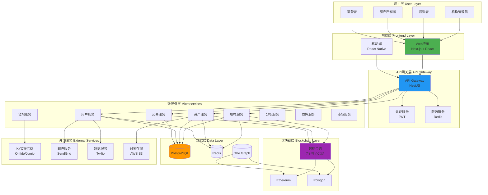
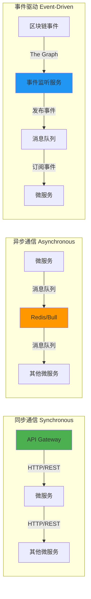
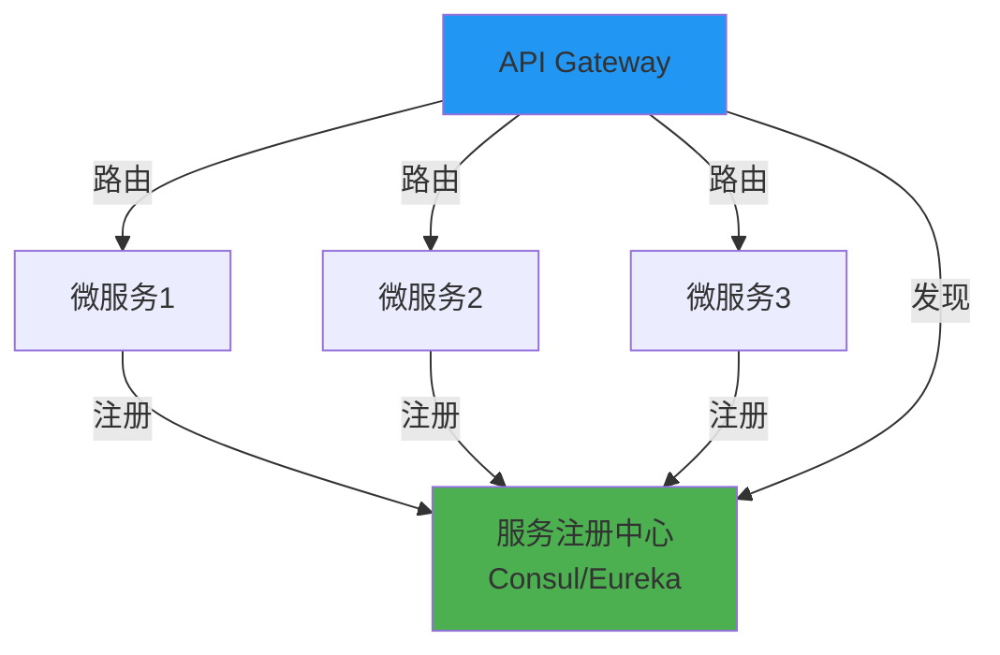
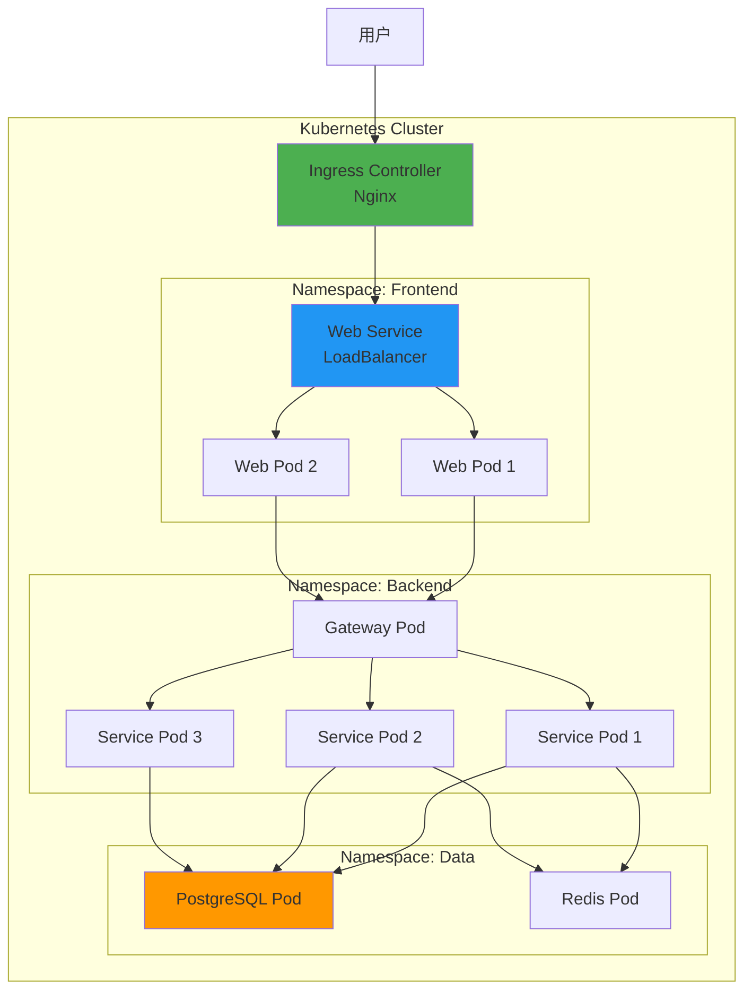
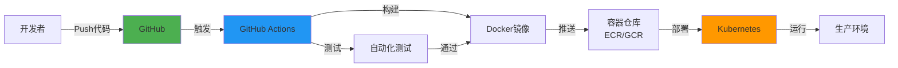

# RWA-HUSD SaaS平台架构

**文档版本**: v1.0  
**创建时间**: 2025-10-11 08:55:00 CST  
**文档类型**: 平台架构设计  

---

## 📑 目录

1. [整体系统架构](#1-整体系统架构)
2. [微服务架构设计](#2-微服务架构设计)
3. [技术栈选型](#3-技术栈选型)
4. [部署架构](#4-部署架构)

---

## 1. 整体系统架构

### 1.1 系统架构图

### 1.2 架构分层说明

#### 用户层（User Layer）
- **机构管理员**: 管理机构、质押ABLE代币、创建资产
- **投资者**: 购买代币、查看持仓、领取分红
- **房产所有者**: 充值租金、查看分红记录
- **运营者**: 审核资产、管理系统配置

#### 前端层（Frontend Layer）
- **Web应用**: 基于Next.js 14的SSR应用，提供完整的管理界面
- **移动端**: 基于React Native的移动应用（P2功能）

#### API网关层（API Gateway）
- **API Gateway**: 统一入口，路由请求到各个微服务
- **认证服务**: JWT认证，Refresh Token刷新
- **限流服务**: 基于Redis的分布式限流

#### 微服务层（Microservices）
- **机构服务**: 机构注册、KYC、质押管理
- **资产服务**: 资产创建、上链、状态管理
- **用户服务**: 用户注册、KYC、钱包管理
- **交易服务**: 购买、转账、分红、赎回
- **合规服务**: KYC/AML验证、审计日志
- **分析服务**: 数据统计、报表生成
- **质押服务**: ABLE代币质押、授权额度管理
- **市场服务**: 二级市场订单簿、撮合引擎

#### 数据层（Data Layer）
- **PostgreSQL**: 主数据库，存储业务数据
- **Redis**: 缓存、会话、消息队列
- **The Graph**: 区块链事件索引

#### 区块链层（Blockchain Layer）
- **Ethereum**: 主网，安全性高
- **Polygon**: 侧链，Gas费低、TPS高
- **智能合约**: 7个核心合约 + 3个支持合约

#### 外部服务（External Services）
- **KYC提供商**: Onfido、Jumio
- **邮件服务**: SendGrid
- **短信服务**: Twilio
- **对象存储**: AWS S3

---

## 2. 微服务架构设计

### 2.1 微服务拆分原则

1. **按业务领域拆分**: 每个微服务负责一个独立的业务领域
2. **高内聚低耦合**: 服务内部高内聚，服务间低耦合
3. **独立部署**: 每个服务可以独立部署和扩展
4. **数据隔离**: 每个服务拥有独立的数据库schema

### 2.2 微服务通信

**通信方式**:
- **同步通信**: HTTP/REST，用于实时查询和操作
- **异步通信**: 消息队列（Redis + Bull），用于耗时操作
- **事件驱动**: 区块链事件监听，用于链上数据同步

### 2.3 服务注册与发现

**服务注册中心**:
- **Consul**: 服务注册、健康检查、配置管理
- **Eureka**: Netflix开源的服务注册中心（备选）

---

## 3. 技术栈选型

### 3.1 前端技术栈

| 技术 | 版本 | 用途 | 选型理由 |
|------|------|------|---------|
| **React** | 18.x | UI框架 | 生态丰富、社区活跃、性能优秀 |
| **Next.js** | 14.x | SSR框架 | SEO优化、服务端渲染、API路由 |
| **TypeScript** | 5.x | 类型系统 | 类型安全、代码提示、减少错误 |
| **TailwindCSS** | 3.x | CSS框架 | 快速开发、响应式设计、可定制 |
| **shadcn/ui** | Latest | UI组件库 | 现代设计、可访问性、可定制 |
| **Wagmi** | 2.x | Web3 Hooks | React Hooks、类型安全、易用 |
| **Viem** | 2.x | Web3库 | 轻量级、类型安全、性能优秀 |
| **Zustand** | 4.x | 状态管理 | 轻量级、简单易用、性能优秀 |
| **React Query** | 5.x | 数据获取 | 缓存管理、自动重试、乐观更新 |

**替代方案**:
- **UI框架**: Vue 3 + Nuxt 3（更简单，但生态不如React）
- **Web3库**: Ethers.js（更成熟，但体积较大）
- **状态管理**: Redux Toolkit（功能更强，但复杂度高）

### 3.2 后端技术栈

| 技术 | 版本 | 用途 | 选型理由 |
|------|------|------|---------|
| **NestJS** | 10.x | 后端框架 | 企业级、模块化、依赖注入、TypeScript |
| **PostgreSQL** | 15.x | 关系型数据库 | ACID保证、JSON支持、性能优秀 |
| **Prisma** | 5.x | ORM | 类型安全、迁移管理、查询优化 |
| **Redis** | 7.x | 缓存/队列 | 高性能、数据结构丰富、持久化 |
| **Bull** | 4.x | 任务队列 | 可靠性高、支持延迟任务、监控友好 |
| **node-cron** | 3.x | 定时任务 | 简单易用、Cron表达式支持 |
| **Passport** | 0.7.x | 认证中间件 | 策略丰富、社区活跃 |
| **class-validator** | 0.14.x | 数据验证 | 装饰器语法、类型安全 |

**替代方案**:
- **后端框架**: Express.js（更简单，但缺少企业级特性）
- **数据库**: MySQL（更流行，但JSON支持不如PostgreSQL）
- **ORM**: TypeORM（功能更强，但性能不如Prisma）

### 3.3 区块链集成

| 技术 | 版本 | 用途 | 选型理由 |
|------|------|------|---------|
| **Ethers.js** | 6.x | 合约交互 | 成熟稳定、文档完善、社区活跃 |
| **Hardhat** | 2.x | 合约开发 | 插件丰富、测试友好、调试方便 |
| **The Graph** | Latest | 事件索引 | 高性能、GraphQL查询、实时更新 |
| **Alchemy** | Latest | 节点服务 | 可靠性高、API丰富、监控友好 |
| **Infura** | Latest | 节点服务 | 备选方案、全球节点、高可用 |

**支持的区块链**:
- **Ethereum**: 主网，安全性高，Gas费高
- **Polygon**: 侧链，Gas费低，TPS高（推荐用于高频交易）

---

## 4. 部署架构

### 4.1 容器化部署

**容器化方案**:
- **Docker**: 容器化应用
- **Kubernetes**: 容器编排
- **Helm**: 包管理
- **Nginx Ingress**: 入口控制器

### 4.2 云服务部署

**推荐方案**: AWS（Amazon Web Services）

| 服务 | AWS服务 | 用途 |
|------|---------|------|
| **计算** | EKS（Kubernetes） | 容器编排 |
| **数据库** | RDS（PostgreSQL） | 托管数据库 |
| **缓存** | ElastiCache（Redis） | 托管缓存 |
| **存储** | S3 | 对象存储 |
| **CDN** | CloudFront | 内容分发 |
| **负载均衡** | ALB | 应用负载均衡 |
| **监控** | CloudWatch | 日志和监控 |
| **安全** | WAF + Shield | 防火墙和DDoS防护 |

**备选方案**: GCP（Google Cloud Platform）

| 服务 | GCP服务 | 用途 |
|------|---------|------|
| **计算** | GKE（Kubernetes） | 容器编排 |
| **数据库** | Cloud SQL（PostgreSQL） | 托管数据库 |
| **缓存** | Memorystore（Redis） | 托管缓存 |
| **存储** | Cloud Storage | 对象存储 |
| **CDN** | Cloud CDN | 内容分发 |
| **负载均衡** | Cloud Load Balancing | 负载均衡 |
| **监控** | Cloud Monitoring | 日志和监控 |

### 4.3 CI/CD流程

**CI/CD工具**:
- **GitHub Actions**: 自动化构建和部署
- **Docker**: 容器化
- **Kubernetes**: 容器编排
- **Helm**: 包管理

**部署流程**:
1. 开发者Push代码到GitHub
2. GitHub Actions触发自动化流程
3. 运行单元测试和集成测试
4. 构建Docker镜像
5. 推送镜像到容器仓库（ECR/GCR）
6. 使用Helm部署到Kubernetes
7. 健康检查和烟雾测试
8. 完成部署

### 4.4 监控和告警

**监控方案**:
- **Prometheus**: 指标收集
- **Grafana**: 可视化仪表板
- **Loki**: 日志聚合
- **Jaeger**: 分布式追踪

**告警方案**:
- **Alertmanager**: 告警管理
- **PagerDuty**: 值班通知
- **Slack**: 团队通知

---

**文档维护**: RWA-HUSD 技术团队  
**联系方式**: tech@rwa-husd.com  
**最后更新**: 2025-10-11 08:55:00 CST

