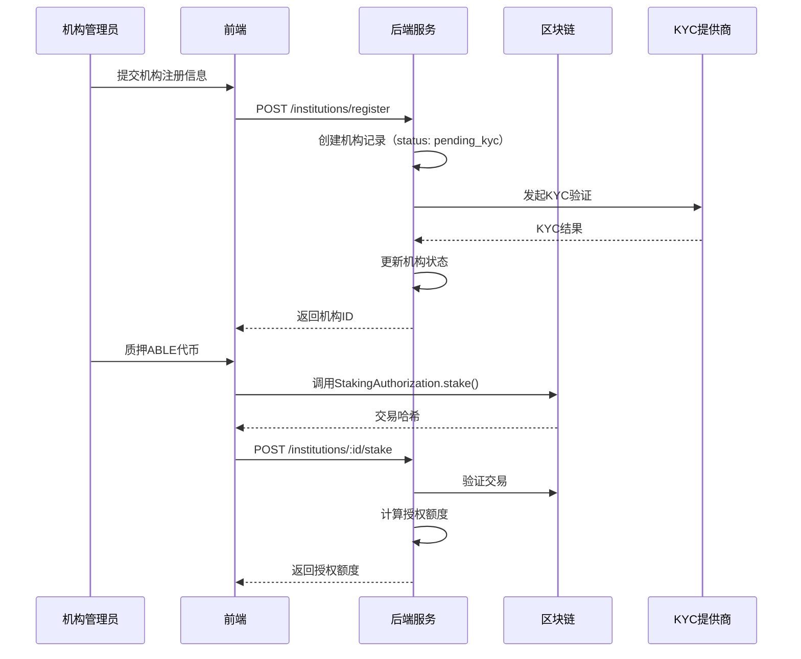

# RWA-HUSD SaaS 平台核心功能模块

**文档版本**: v1.0  
**创建时间**: 2025-10-11 09:05:00 CST  
**文档类型**: 核心功能模块设计

---

## 📑 目录

1. [机构管理模块](#1-机构管理模块)
2. [资产管理模块](#2-资产管理模块)
3. [用户管理模块](#3-用户管理模块)
4. [交易管理模块](#4-交易管理模块)
5. [合规管理模块](#5-合规管理模块)
6. [数据分析模块](#6-数据分析模块)
7. [ABLE 质押系统](#7-able质押系统)
8. [二级市场模块](#8-二级市场模块)

---

## 1. 机构管理模块

### 1.1 功能清单

-   ✅ 机构注册和基础信息管理
-   ✅ 机构 KYC 验证（企业资质审核）
-   ✅ ABLE 代币质押管理
-   ✅ 授权额度监控和预警
-   ✅ 机构权限管理（RBAC）
-   ✅ 机构仪表板（资产、交易、收益统计）
-   ✅ 机构成员管理
-   ✅ 机构审核流程

### 1.2 API 接口设计

```typescript
// 机构注册
POST /api/institutions/register
Request: {
  name: string;
  country: string;
  registrationNumber: string;
  legalRepresentative: string;
  email: string;
  phone: string;
}
Response: {
  institutionId: string;
  status: 'pending_kyc' | 'approved' | 'rejected';
}

// 质押ABLE代币
POST /api/institutions/:id/stake
Request: {
  amount: string; // ABLE代币数量
  txHash: string; // 区块链交易哈希
}
Response: {
  stakeId: string;
  authorizedQuota: string; // 授权额度（USD）
  expiresAt: Date;
}

// 查询授权额度
GET /api/institutions/:id/quota
Response: {
  totalStaked: string; // 总质押量
  authorizedQuota: string; // 总授权额度
  usedQuota: string; // 已使用额度
  availableQuota: string; // 可用额度
  assets: Array<{
    assetId: string;
    assetName: string;
    quotaUsed: string;
  }>;
}
```

### 1.3 数据流图



---

## 2. 资产管理模块

### 2.1 功能清单

-   ✅ 资产创建和编辑
-   ✅ 资产上链（调用 PropertyTokenFactory）
-   ✅ 资产状态跟踪（0-7 状态）
-   ✅ 批量操作（批量创建、批量上链）
-   ✅ 资产审核流程
-   ✅ 资产文档管理（上传、下载、预览）
-   ✅ 资产估值管理
-   ✅ 资产分类和标签

### 2.2 API 接口设计

```typescript
// 创建资产
POST /api/assets/create
Request: {
  institutionId: string;
  name: string;
  symbol: string;
  totalSupply: string;
  price: string;
  propertyType: 'residential' | 'commercial' | 'industrial';
  location: {
    country: string;
    city: string;
    address: string;
  };
  documents: Array<{
    type: 'title_deed' | 'valuation_report' | 'legal_opinion';
    url: string;
  }>;
}
Response: {
  assetId: string;
  status: 'draft' | 'pending_review' | 'approved';
}

// 资产上链
POST /api/assets/:id/deploy
Request: {
  assetId: string;
}
Response: {
  txHash: string;
  contractAddress: string;
  status: 'deploying' | 'deployed' | 'failed';
}

// 查询资产详情
GET /api/assets/:id
Response: {
  assetId: string;
  name: string;
  symbol: string;
  contractAddress: string;
  status: 0 | 1 | 2 | 3 | 4 | 5 | 6 | 7; // 区块链状态
  totalSupply: string;
  price: string;
  holders: number;
  totalValue: string;
  createdAt: Date;
  deployedAt: Date;
}
```

---

## 3. 用户管理模块

### 3.1 功能清单

-   ✅ 投资者注册和登录
-   ✅ KYC/AML 验证
-   ✅ 钱包集成（MetaMask、WalletConnect）
-   ✅ 用户权限控制
-   ✅ 白名单管理
-   ✅ 用户分级（合格投资者、普通投资者）
-   ✅ 用户资料管理
-   ✅ 用户持仓查询

### 3.2 API 接口设计

```typescript
// 用户注册
POST /api/users/register
Request: {
  email: string;
  password: string;
  walletAddress: string;
}
Response: {
  userId: string;
  accessToken: string;
  refreshToken: string;
}

// KYC验证
POST /api/users/:id/kyc
Request: {
  firstName: string;
  lastName: string;
  dateOfBirth: Date;
  nationality: string;
  idType: 'passport' | 'id_card' | 'drivers_license';
  idNumber: string;
  idDocument: File;
  selfie: File;
}
Response: {
  kycId: string;
  status: 'pending' | 'approved' | 'rejected';
}

// 查询用户持仓
GET /api/users/:id/holdings
Response: {
  holdings: Array<{
    assetId: string;
    assetName: string;
    balance: string;
    value: string;
    purchasePrice: string;
    currentPrice: string;
    profit: string;
    profitRate: string;
  }>;
  totalValue: string;
  totalProfit: string;
}
```

---

## 4. 交易管理模块

### 4.1 功能清单

-   ✅ 首发购买（PropertyToken.buyTokens）
-   ✅ 二级市场交易（TradeContract）
-   ✅ 租金分红（RentCustodyContract）
-   ✅ 代币赎回（RedemptionManager）
-   ✅ 交易历史查询
-   ✅ 交易对账
-   ✅ 交易手续费管理
-   ✅ 交易通知（邮件、短信）

### 4.2 API 接口设计

```typescript
// 首发购买
POST /api/trades/buy
Request: {
  assetId: string;
  amount: string;
  paymentToken: string;
}
Response: {
  tradeId: string;
  txHash: string;
  status: 'pending' | 'confirmed' | 'failed';
}

// 查询交易历史
GET /api/trades/history
Query: {
  userId?: string;
  assetId?: string;
  type?: 'buy' | 'sell' | 'dividend' | 'redeem';
  startDate?: Date;
  endDate?: Date;
  page: number;
  limit: number;
}
Response: {
  trades: Array<{
    tradeId: string;
    type: 'buy' | 'sell' | 'dividend' | 'redeem';
    assetId: string;
    assetName: string;
    amount: string;
    price: string;
    totalValue: string;
    fee: string;
    txHash: string;
    status: 'pending' | 'confirmed' | 'failed';
    createdAt: Date;
  }>;
  total: number;
  page: number;
  limit: number;
}
```

---

## 5. 合规管理模块

### 5.1 功能清单

-   ✅ 多国监管规则配置（SEC、MAS、MiFID II）
-   ✅ KYC 提供商集成（Onfido、Jumio）
-   ✅ 审计追踪（所有操作日志）
-   ✅ 合规报告生成
-   ✅ 地域限制
-   ✅ 投资者分类
-   ✅ 交易限额管理
-   ✅ 反洗钱（AML）监控

### 5.2 API 接口设计

```typescript
// 配置监管规则
POST / api / compliance / rules;
Request: {
    country: string;
    regulation: "SEC" | "MAS" | "MiFID_II";
    rules: {
        minInvestment: string;
        maxInvestment: string;
        accreditedInvestorOnly: boolean;
        kycRequired: boolean;
        amlRequired: boolean;
    }
}

// 生成合规报告
POST / api / compliance / reports;
Request: {
    type: "kyc" | "aml" | "transaction" | "audit";
    startDate: Date;
    endDate: Date;
    format: "pdf" | "excel";
}
Response: {
    reportId: string;
    downloadUrl: string;
}
```

---

## 6. 数据分析模块

### 6.1 功能清单

-   ✅ 机构仪表板（授权额度、资产数量、交易量）
-   ✅ 资产仪表板（代币价格、交易量、持有者分布）
-   ✅ 投资者仪表板（持仓、收益、交易历史）
-   ✅ 实时监控（区块链事件监听）
-   ✅ 报表导出（PDF、Excel）
-   ✅ 数据可视化（图表、趋势分析）
-   ✅ 自定义报表
-   ✅ 数据 API

---

## 7. ABLE 质押系统

### 7.1 功能清单

-   ✅ 质押 ABLE 代币
-   ✅ 解除质押
-   ✅ 授权额度计算（1 ABLE = 1 USD）
-   ✅ 授权额度消耗追踪
-   ✅ 质押奖励（可选）
-   ✅ 质押历史查询
-   ✅ 质押到期提醒
-   ✅ 自动续期

---

## 8. 二级市场模块

### 8.1 功能清单

-   ✅ 订单簿（买单、卖单）
-   ✅ 订单撮合引擎
-   ✅ 价格发现
-   ✅ 交易结算
-   ✅ 手续费管理
-   ✅ 订单历史查询
-   ✅ 市场深度图
-   ✅ 实时价格推送

### 8.2 API 接口设计

```typescript
// 创建卖单
POST /api/market/orders/sell
Request: {
  assetId: string;
  amount: string;
  price: string;
}
Response: {
  orderId: string;
  txHash: string;
  status: 'pending' | 'active' | 'filled' | 'cancelled';
}

// 撮合买单
POST /api/market/orders/:id/buy
Request: {
  orderId: string;
}
Response: {
  tradeId: string;
  txHash: string;
  status: 'pending' | 'confirmed' | 'failed';
}

// 查询订单簿
GET /api/market/orderbook/:assetId
Response: {
  buyOrders: Array<{
    orderId: string;
    price: string;
    amount: string;
    total: string;
  }>;
  sellOrders: Array<{
    orderId: string;
    price: string;
    amount: string;
    total: string;
  }>;
}
```

---

**文档维护**: RWA-HUSD 技术团队  
**联系方式**: tech@rwa-husd.com  
**最后更新**: 2025-10-11 09:05:00 CST
