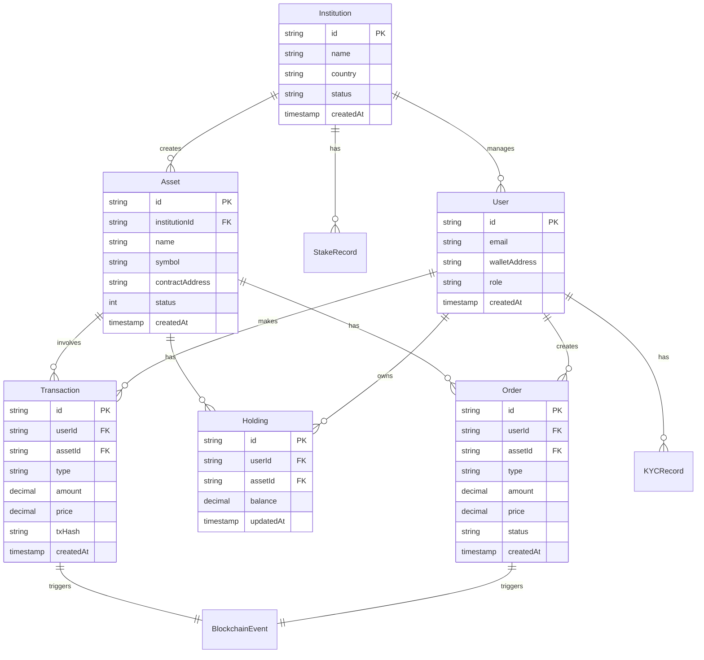
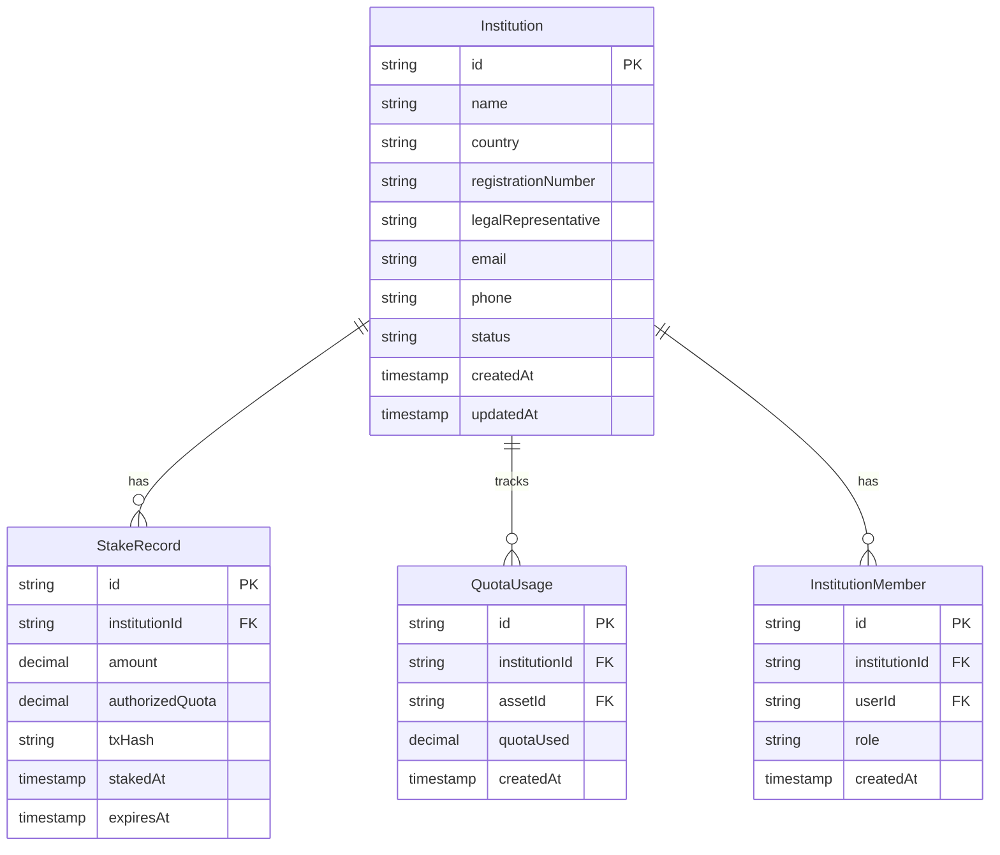
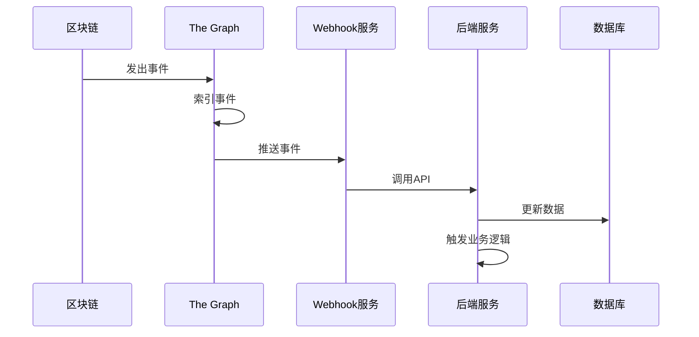
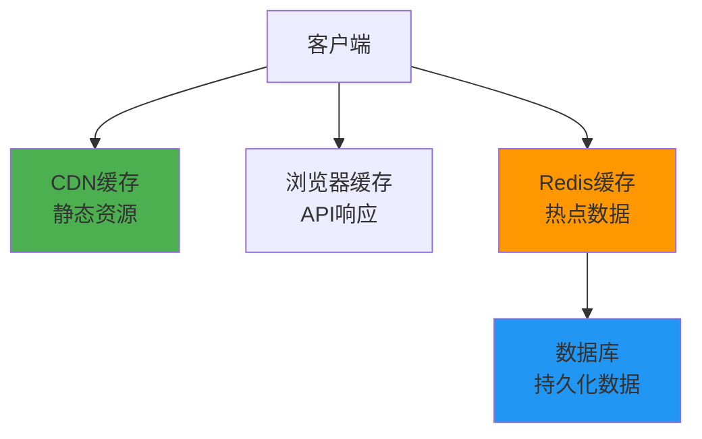

# RWA-HUSD SaaS 平台数据模型

**文档版本**: v1.0  
**创建时间**: 2025-10-11 09:15:00 CST  
**文档类型**: 数据模型设计

---

## 📑 目录

1. [核心实体关系图](#1-核心实体关系图)
2. [数据库表结构](#2-数据库表结构)
3. [区块链数据同步](#3-区块链数据同步)
4. [缓存策略](#4-缓存策略)

---

## 1. 核心实体关系图

### 1.1 整体 ER 图



### 1.2 机构相关实体



---

## 2. 数据库表结构

### 2.1 机构表（institutions）

```sql
CREATE TABLE institutions (
  id UUID PRIMARY KEY DEFAULT gen_random_uuid(),
  name VARCHAR(255) NOT NULL,
  country VARCHAR(2) NOT NULL, -- ISO 3166-1 alpha-2
  registration_number VARCHAR(100) NOT NULL,
  legal_representative VARCHAR(255) NOT NULL,
  email VARCHAR(255) NOT NULL UNIQUE,
  phone VARCHAR(50) NOT NULL,
  status VARCHAR(50) NOT NULL DEFAULT 'pending_kyc', -- pending_kyc, approved, rejected, suspended
  kyc_provider VARCHAR(50), -- onfido, jumio
  kyc_reference_id VARCHAR(255),
  created_at TIMESTAMP NOT NULL DEFAULT NOW(),
  updated_at TIMESTAMP NOT NULL DEFAULT NOW(),

  INDEX idx_status (status),
  INDEX idx_country (country),
  INDEX idx_created_at (created_at)
);
```

### 2.2 质押记录表（stake_records）

```sql
CREATE TABLE stake_records (
  id UUID PRIMARY KEY DEFAULT gen_random_uuid(),
  institution_id UUID NOT NULL REFERENCES institutions(id),
  amount DECIMAL(36, 18) NOT NULL, -- ABLE代币数量
  authorized_quota DECIMAL(36, 2) NOT NULL, -- 授权额度（USD）
  tx_hash VARCHAR(66) NOT NULL UNIQUE, -- 区块链交易哈希
  staked_at TIMESTAMP NOT NULL,
  expires_at TIMESTAMP NOT NULL,
  status VARCHAR(50) NOT NULL DEFAULT 'active', -- active, expired, unstaked
  created_at TIMESTAMP NOT NULL DEFAULT NOW(),

  INDEX idx_institution_id (institution_id),
  INDEX idx_status (status),
  INDEX idx_expires_at (expires_at)
);
```

### 2.3 资产表（assets）

```sql
CREATE TABLE assets (
  id UUID PRIMARY KEY DEFAULT gen_random_uuid(),
  institution_id UUID NOT NULL REFERENCES institutions(id),
  name VARCHAR(255) NOT NULL,
  symbol VARCHAR(20) NOT NULL,
  contract_address VARCHAR(42) UNIQUE, -- 部署后填充
  total_supply DECIMAL(36, 18) NOT NULL,
  price DECIMAL(36, 2) NOT NULL,
  property_type VARCHAR(50) NOT NULL, -- residential, commercial, industrial
  location_country VARCHAR(2) NOT NULL,
  location_city VARCHAR(100) NOT NULL,
  location_address TEXT NOT NULL,
  status INT NOT NULL DEFAULT 0, -- 0-7，对应区块链状态
  platform_status VARCHAR(50) NOT NULL DEFAULT 'draft', -- draft, pending_review, approved, deployed
  created_at TIMESTAMP NOT NULL DEFAULT NOW(),
  updated_at TIMESTAMP NOT NULL DEFAULT NOW(),
  deployed_at TIMESTAMP,

  INDEX idx_institution_id (institution_id),
  INDEX idx_status (status),
  INDEX idx_platform_status (platform_status),
  INDEX idx_contract_address (contract_address)
);
```

### 2.4 用户表（users）

```sql
CREATE TABLE users (
  id UUID PRIMARY KEY DEFAULT gen_random_uuid(),
  email VARCHAR(255) NOT NULL UNIQUE,
  password_hash VARCHAR(255) NOT NULL,
  wallet_address VARCHAR(42) NOT NULL UNIQUE,
  role VARCHAR(50) NOT NULL DEFAULT 'investor', -- admin, institution_admin, institution_operator, investor, property_owner
  status VARCHAR(50) NOT NULL DEFAULT 'active', -- active, suspended, deleted
  kyc_status VARCHAR(50) NOT NULL DEFAULT 'pending', -- pending, approved, rejected
  kyc_provider VARCHAR(50),
  kyc_reference_id VARCHAR(255),
  created_at TIMESTAMP NOT NULL DEFAULT NOW(),
  updated_at TIMESTAMP NOT NULL DEFAULT NOW(),
  last_login_at TIMESTAMP,

  INDEX idx_email (email),
  INDEX idx_wallet_address (wallet_address),
  INDEX idx_role (role),
  INDEX idx_kyc_status (kyc_status)
);
```

### 2.5 交易表（transactions）

```sql
CREATE TABLE transactions (
  id UUID PRIMARY KEY DEFAULT gen_random_uuid(),
  user_id UUID NOT NULL REFERENCES users(id),
  asset_id UUID NOT NULL REFERENCES assets(id),
  type VARCHAR(50) NOT NULL, -- buy, sell, dividend, redeem
  amount DECIMAL(36, 18) NOT NULL,
  price DECIMAL(36, 2) NOT NULL,
  total_value DECIMAL(36, 2) NOT NULL,
  fee DECIMAL(36, 2) NOT NULL DEFAULT 0,
  tx_hash VARCHAR(66) NOT NULL UNIQUE,
  status VARCHAR(50) NOT NULL DEFAULT 'pending', -- pending, confirmed, failed
  created_at TIMESTAMP NOT NULL DEFAULT NOW(),
  confirmed_at TIMESTAMP,

  INDEX idx_user_id (user_id),
  INDEX idx_asset_id (asset_id),
  INDEX idx_type (type),
  INDEX idx_status (status),
  INDEX idx_created_at (created_at)
);
```

### 2.6 持仓表（holdings）

```sql
CREATE TABLE holdings (
  id UUID PRIMARY KEY DEFAULT gen_random_uuid(),
  user_id UUID NOT NULL REFERENCES users(id),
  asset_id UUID NOT NULL REFERENCES assets(id),
  balance DECIMAL(36, 18) NOT NULL DEFAULT 0,
  updated_at TIMESTAMP NOT NULL DEFAULT NOW(),

  UNIQUE (user_id, asset_id),
  INDEX idx_user_id (user_id),
  INDEX idx_asset_id (asset_id)
);
```

### 2.7 订单表（orders）

```sql
CREATE TABLE orders (
  id UUID PRIMARY KEY DEFAULT gen_random_uuid(),
  user_id UUID NOT NULL REFERENCES users(id),
  asset_id UUID NOT NULL REFERENCES assets(id),
  type VARCHAR(50) NOT NULL, -- buy, sell
  amount DECIMAL(36, 18) NOT NULL,
  price DECIMAL(36, 2) NOT NULL,
  filled_amount DECIMAL(36, 18) NOT NULL DEFAULT 0,
  status VARCHAR(50) NOT NULL DEFAULT 'pending', -- pending, active, filled, cancelled
  tx_hash VARCHAR(66) UNIQUE,
  created_at TIMESTAMP NOT NULL DEFAULT NOW(),
  updated_at TIMESTAMP NOT NULL DEFAULT NOW(),

  INDEX idx_user_id (user_id),
  INDEX idx_asset_id (asset_id),
  INDEX idx_type (type),
  INDEX idx_status (status),
  INDEX idx_created_at (created_at)
);
```

---

## 3. 区块链数据同步

### 3.1 同步机制



### 3.2 事件监听

**监听的事件**:

-   `PropertyTokenCreated`: 资产创建
-   `TokensPurchased`: 代币购买
-   `DividendDistributed`: 分红分配
-   `TokensRedeemed`: 代币赎回
-   `OrderCreated`: 订单创建
-   `OrderFilled`: 订单成交
-   `OrderCancelled`: 订单取消

**事件处理**:

```typescript
// 监听PropertyTokenCreated事件
async handlePropertyTokenCreated(event: PropertyTokenCreatedEvent) {
  await this.assetService.update(event.assetId, {
    contractAddress: event.contractAddress,
    status: 1, // 已部署
    deployedAt: new Date(event.timestamp * 1000),
  });
}

// 监听TokensPurchased事件
async handleTokensPurchased(event: TokensPurchasedEvent) {
  // 创建交易记录
  await this.transactionService.create({
    userId: event.buyer,
    assetId: event.assetId,
    type: 'buy',
    amount: event.amount,
    price: event.price,
    txHash: event.txHash,
    status: 'confirmed',
  });

  // 更新持仓
  await this.holdingService.updateBalance(
    event.buyer,
    event.assetId,
    event.amount
  );
}
```

### 3.3 数据一致性

**双写策略**:

1. 用户发起交易 → 写入数据库（status: pending）
2. 交易上链 → 监听事件 → 更新数据库（status: confirmed）
3. 如果事件未收到 → 定时任务查询区块链 → 更新数据库

**冲突解决**:

-   以区块链数据为准
-   定期对账（每小时）
-   发现不一致 → 告警 → 人工介入

---

## 4. 缓存策略

### 4.1 缓存层级



### 4.2 缓存策略

**缓存内容**:

-   用户信息: 30 分钟
-   资产列表: 5 分钟
-   资产详情: 1 分钟
-   订单簿: 10 秒
-   交易历史: 1 小时

**缓存更新**:

```typescript
// 写入缓存
await redis.setex(
    `asset:${assetId}`,
    60, // 1分钟
    JSON.stringify(asset)
);

// 读取缓存
const cached = await redis.get(`asset:${assetId}`);
if (cached) {
    return JSON.parse(cached);
}

// 缓存失效
await redis.del(`asset:${assetId}`);
```

**缓存穿透防护**:

```typescript
// 布隆过滤器
const bloomFilter = new BloomFilter();

// 查询前检查
if (!bloomFilter.has(assetId)) {
    return null; // 数据不存在
}

// 查询数据库
const asset = await database.findAsset(assetId);
```

---

**文档维护**: RWA-HUSD 技术团队  
**联系方式**: tech@rwa-husd.com  
**最后更新**: 2025-10-11 09:15:00 CST
