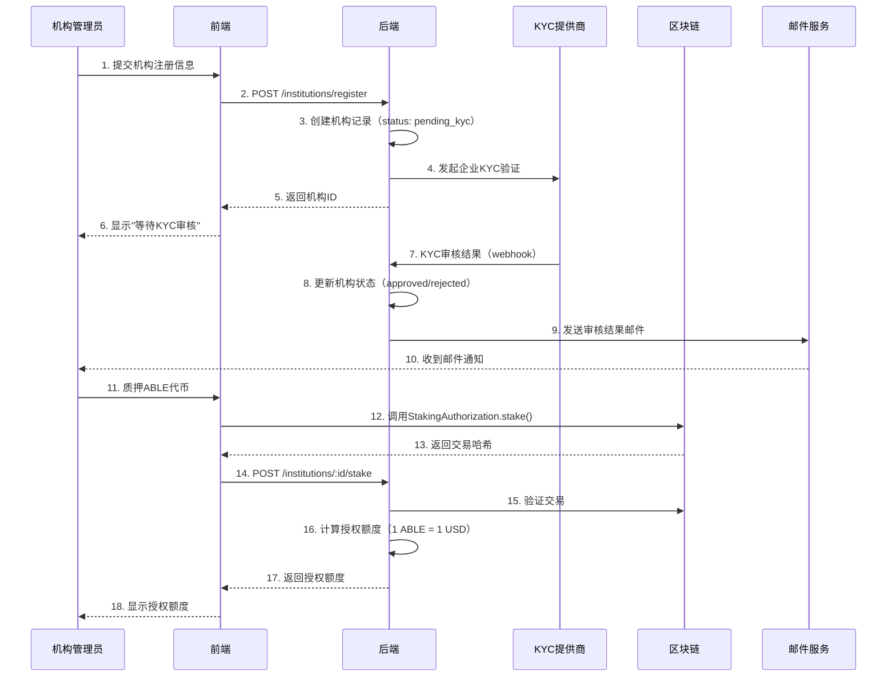
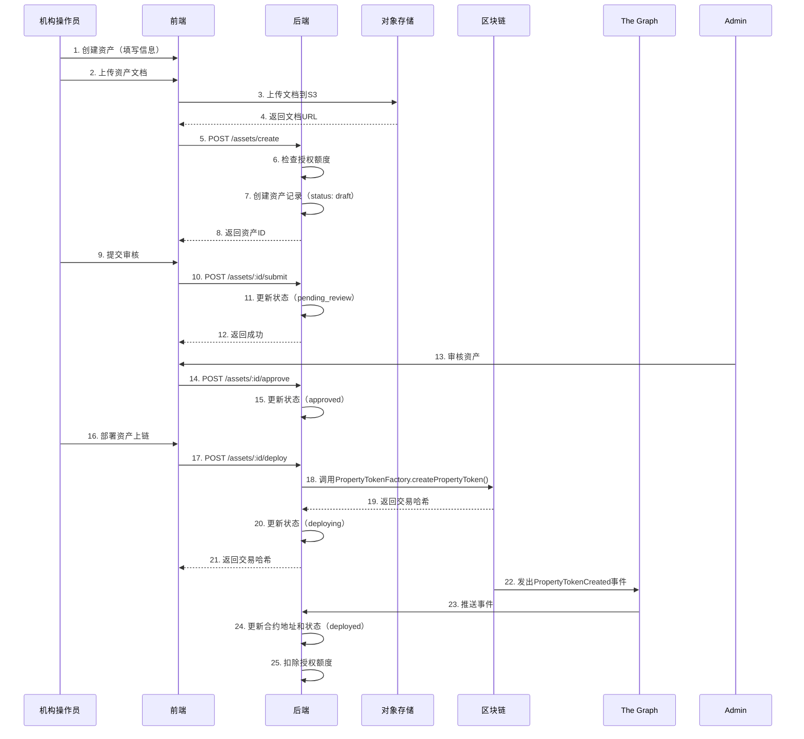
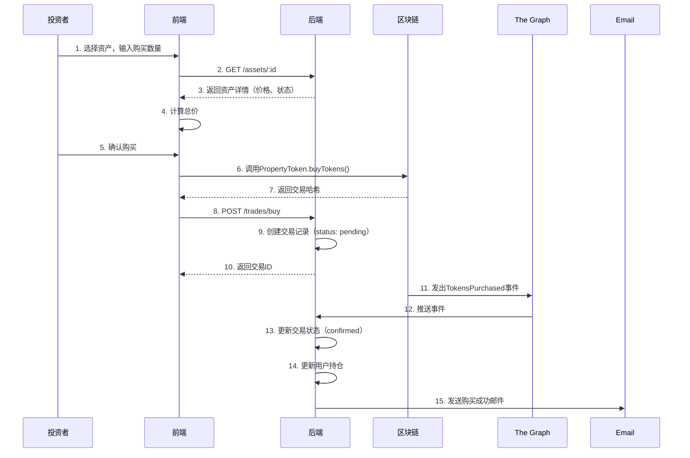
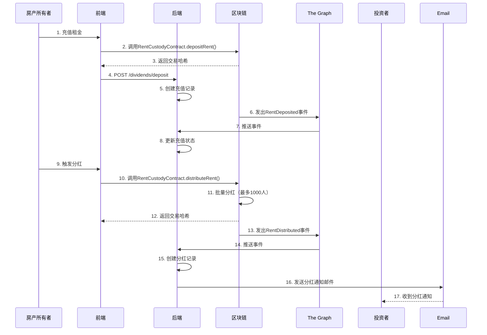
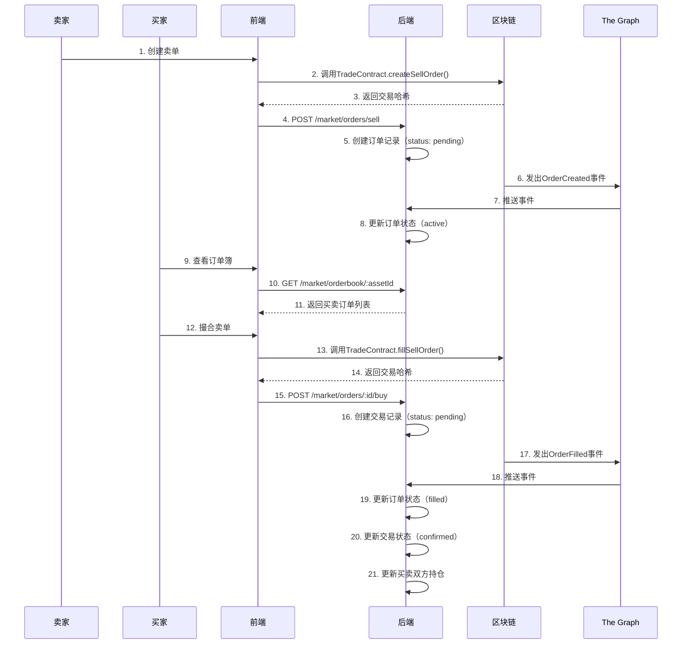
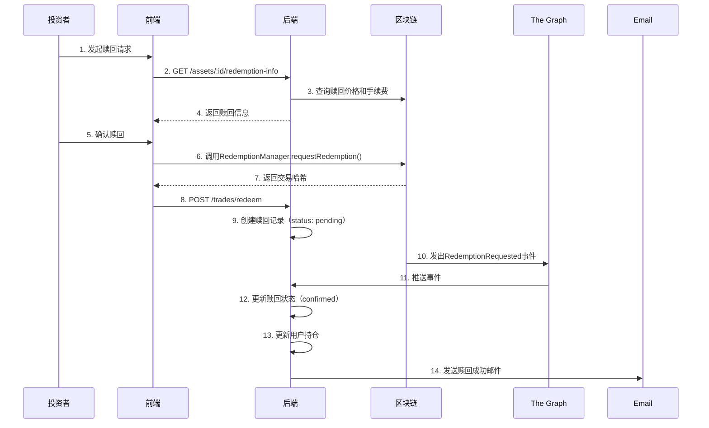

# RWA-HUSD SaaS 平台业务流程

**文档版本**: v1.0
**创建时间**: 2025-10-11 09:20:00 CST
**文档类型**: 业务流程设计

---

## 📑 目录

1. [机构入驻流程](#1-机构入驻流程)
2. [资产上链流程](#2-资产上链流程)
3. [投资者购买流程](#3-投资者购买流程)
4. [租金分红流程](#4-租金分红流程)
5. [二级市场交易流程](#5-二级市场交易流程)
6. [代币赎回流程](#6-代币赎回流程)

---

## 1. 机构入驻流程

### 1.1 流程图

### 1.2 关键步骤

1. **机构注册**: 提交企业信息（名称、注册号、法人代表等）
2. **KYC 验证**: 集成 Onfido/Jumio 进行企业资质审核
3. **质押 ABLE**: 质押 ABLE 代币获得资产上链授权
4. **授权额度**: 1 ABLE = 1 USD 授权额度
5. **邮件通知**: 审核结果通过邮件通知

---

## 2. 资产上链流程

### 2.1 流程图

### 2.2 关键步骤

1. **创建资产**: 填写资产信息（名称、符号、总量、价格等）
2. **上传文档**: 上传产权证明、估值报告、法律意见书
3. **检查额度**: 验证机构是否有足够的授权额度
4. **审核流程**: 平台审核资产信息和文档
5. **部署上链**: 调用 PropertyTokenFactory 创建代币
6. **扣除额度**: 扣除对应的授权额度

---

## 3. 投资者购买流程

### 3.1 首发购买流程

### 3.2 二级市场购买流程

见 [5. 二级市场交易流程](#5-二级市场交易流程)

---

## 4. 租金分红流程

### 4.1 流程图

### 4.2 关键步骤

1. **充值租金**: 房产所有者充值租金到 RentCustodyContract
2. **批量分红**: 调用 distributeRent()批量分红（最多 1000 人）
3. **事件监听**: 监听 RentDistributed 事件，更新数据库
4. **邮件通知**: 发送分红通知邮件给所有投资者

---

## 5. 二级市场交易流程

### 5.1 流程图

### 5.2 关键步骤

1. **创建卖单**: 卖家创建卖单，锁定代币
2. **订单簿**: 买家查看订单簿，选择合适的卖单
3. **撮合交易**: 买家撮合卖单，完成交易
4. **手续费**: 平台收取 0.1%手续费
5. **更新持仓**: 更新买卖双方的持仓

---

## 6. 代币赎回流程

### 6.1 流程图

### 6.2 关键步骤

1. **查询信息**: 查询赎回价格和手续费（0.1%）
2. **发起赎回**: 调用 RedemptionManager.requestRedemption()
3. **公平机制**: 使用全局快照确保公平赎回
4. **更新持仓**: 扣除用户持仓，返还资金
5. **邮件通知**: 发送赎回成功邮件

---

**文档维护**: RWA-HUSD 技术团队
**联系方式**: tech@rwa-husd.com
**最后更新**: 2025-10-11 09:20:00 CST
