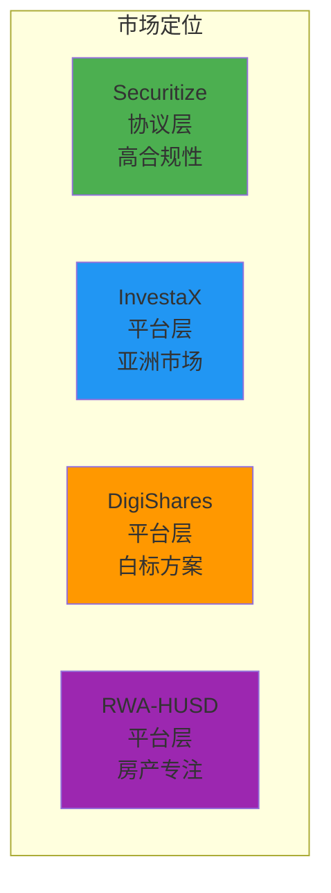

# RWA-HUSD SaaS平台竞品分析

**文档版本**: v1.0  
**创建时间**: 2025-10-11 09:30:00 CST  
**文档类型**: 竞品分析  

---

## 📑 目录

1. [竞品概览](#1-竞品概览)
2. [Securitize分析](#2-securitize分析)
3. [InvestaX分析](#3-investax分析)
4. [DigiShares分析](#4-digishares分析)
5. [功能对比矩阵](#5-功能对比矩阵)
6. [差异化竞争优势](#6-差异化竞争优势)

---

## 1. 竞品概览

### 1.1 竞品选择理由

| 竞品 | 类型 | 选择理由 |
|------|------|---------|
| **Securitize** | RWA协议 | 行业领导者，DS Protocol标准制定者，合规性强 |
| **InvestaX** | SaaS平台 | MAS持牌平台，亚洲市场领先，多资产类型支持 |
| **DigiShares** | SaaS平台 | 白标解决方案，全球部署，功能全面 |

### 1.2 竞品定位

---

## 2. Securitize分析

### 2.1 核心特点

**优势**:
- ✅ DS Protocol标准，行业认可度高
- ✅ 合规性强，支持SEC Reg D/Reg S/Reg A+
- ✅ 机构级客户，品牌影响力大
- ✅ 技术成熟，经过大量实战验证

**劣势**:
- ❌ 主要面向机构，个人投资者门槛高
- ❌ 费用较高，不适合小型项目
- ❌ 定制化程度低，灵活性不足
- ❌ 主要服务美国市场，国际化程度有限

### 2.2 技术架构

**核心组件**:
- **DS Protocol**: 数字证券协议
- **Transfer Agent**: 转账代理
- **Compliance Service**: 合规服务
- **Investor Portal**: 投资者门户

**技术栈**:
- 智能合约: Solidity + ERC-1400
- 后端: 未公开（推测为Java/Spring）
- 前端: React
- 区块链: Ethereum

### 2.3 业务模式

**收费模式**:
- 初始设置费: $50,000 - $100,000
- 年度维护费: $20,000 - $50,000
- 交易手续费: 0.5% - 1%

**目标客户**:
- 房地产开发商
- 私募基金
- 艺术品收藏机构
- 大型企业

---

## 3. InvestaX分析

### 3.1 核心特点

**优势**:
- ✅ MAS持牌，合规性强
- ✅ 多资产类型支持（房产、股票、私募基金）
- ✅ 亚洲市场领先，本地化程度高
- ✅ 用户体验好，界面友好

**劣势**:
- ❌ 主要服务亚洲市场，全球化程度有限
- ❌ 技术栈相对保守
- ❌ 二级市场流动性不足
- ❌ 费用较高

### 3.2 技术架构

**核心组件**:
- **Asset Tokenization**: 资产代币化
- **KYC/AML Service**: KYC/AML服务
- **Trading Platform**: 交易平台
- **Custody Service**: 托管服务

**技术栈**:
- 智能合约: Solidity + ERC-20
- 后端: Node.js + PostgreSQL
- 前端: React + Redux
- 区块链: Ethereum + Polygon

### 3.3 业务模式

**收费模式**:
- 初始设置费: $30,000 - $50,000
- 年度维护费: $10,000 - $20,000
- 交易手续费: 0.3% - 0.5%

**目标客户**:
- 中小型房地产开发商
- 私募基金
- 个人投资者（合格投资者）

---

## 4. DigiShares分析

### 4.1 核心特点

**优势**:
- ✅ 白标解决方案，可定制性强
- ✅ 全球部署，支持多国监管
- ✅ 功能全面，覆盖全生命周期
- ✅ 价格相对合理

**劣势**:
- ❌ 品牌影响力不如Securitize
- ❌ 技术创新性不足
- ❌ 客户支持响应慢
- ❌ 二级市场功能较弱

### 4.2 技术架构

**核心组件**:
- **Tokenization Engine**: 代币化引擎
- **Compliance Module**: 合规模块
- **Investor Portal**: 投资者门户
- **Admin Dashboard**: 管理后台

**技术栈**:
- 智能合约: Solidity + ERC-20
- 后端: PHP + MySQL
- 前端: Vue.js
- 区块链: Ethereum + BSC

### 4.3 业务模式

**收费模式**:
- 初始设置费: $20,000 - $40,000
- 年度维护费: $5,000 - $15,000
- 交易手续费: 0.2% - 0.4%

**目标客户**:
- 中小型企业
- 创业公司
- 个人投资者

---

## 5. 功能对比矩阵

### 5.1 核心功能对比

| 功能 | Securitize | InvestaX | DigiShares | RWA-HUSD |
|------|-----------|----------|-----------|----------|
| **资产代币化** | ⭐⭐⭐⭐⭐ | ⭐⭐⭐⭐ | ⭐⭐⭐⭐ | ⭐⭐⭐⭐⭐ |
| **KYC/AML** | ⭐⭐⭐⭐⭐ | ⭐⭐⭐⭐⭐ | ⭐⭐⭐⭐ | ⭐⭐⭐⭐ |
| **合规管理** | ⭐⭐⭐⭐⭐ | ⭐⭐⭐⭐⭐ | ⭐⭐⭐⭐ | ⭐⭐⭐⭐ |
| **二级市场** | ⭐⭐⭐ | ⭐⭐⭐ | ⭐⭐ | ⭐⭐⭐⭐⭐ |
| **分红管理** | ⭐⭐⭐⭐ | ⭐⭐⭐ | ⭐⭐⭐ | ⭐⭐⭐⭐⭐ |
| **赎回机制** | ⭐⭐⭐ | ⭐⭐⭐ | ⭐⭐ | ⭐⭐⭐⭐⭐ |
| **质押授权** | ❌ | ❌ | ❌ | ⭐⭐⭐⭐⭐ |
| **多链支持** | ⭐⭐ | ⭐⭐⭐ | ⭐⭐⭐ | ⭐⭐⭐ |
| **用户体验** | ⭐⭐⭐ | ⭐⭐⭐⭐ | ⭐⭐⭐ | ⭐⭐⭐⭐⭐ |
| **定制化** | ⭐⭐ | ⭐⭐⭐ | ⭐⭐⭐⭐⭐ | ⭐⭐⭐⭐ |

### 5.2 技术对比

| 技术 | Securitize | InvestaX | DigiShares | RWA-HUSD |
|------|-----------|----------|-----------|----------|
| **智能合约标准** | ERC-1400 | ERC-20 | ERC-20 | ERC-20 + UUPS |
| **后端框架** | Java/Spring | Node.js | PHP | NestJS |
| **前端框架** | React | React | Vue.js | Next.js + React |
| **数据库** | 未公开 | PostgreSQL | MySQL | PostgreSQL |
| **区块链** | Ethereum | Ethereum + Polygon | Ethereum + BSC | Ethereum + Polygon |
| **事件索引** | 自建 | The Graph | 自建 | The Graph |

### 5.3 价格对比

| 费用 | Securitize | InvestaX | DigiShares | RWA-HUSD |
|------|-----------|----------|-----------|----------|
| **初始设置费** | $50K - $100K | $30K - $50K | $20K - $40K | **$10K - $20K** |
| **年度维护费** | $20K - $50K | $10K - $20K | $5K - $15K | **$3K - $10K** |
| **交易手续费** | 0.5% - 1% | 0.3% - 0.5% | 0.2% - 0.4% | **0.1%** |

---

## 6. 差异化竞争优势

### 6.1 RWA-HUSD的核心优势

#### 1. 质押授权机制（独有）
**创新点**:
- 机构需质押ABLE代币才能上链资产
- 1 ABLE = 1 USD授权额度
- 确保机构资质和平台资产质量

**竞争优势**:
- 降低平台风险
- 提高资产质量
- 增加ABLE代币价值

#### 2. 强大的二级市场
**创新点**:
- 链上订单簿，透明度高
- 订单撮合引擎，效率高
- 手续费低（0.1%）

**竞争优势**:
- 提高流动性
- 降低交易成本
- 提升用户体验

#### 3. 公平的赎回机制
**创新点**:
- 全局快照，确保公平
- 手续费低（0.1%）
- 赎回流程简单

**竞争优势**:
- 保护投资者权益
- 提高平台信任度
- 降低赎回成本

#### 4. 优秀的用户体验
**创新点**:
- Next.js SSR，加载速度快
- shadcn/ui，界面现代
- Wagmi + Viem，Web3集成简单

**竞争优势**:
- 降低学习成本
- 提高转化率
- 增加用户粘性

#### 5. 合理的价格
**创新点**:
- 初始设置费低（$10K - $20K）
- 年度维护费低（$3K - $10K）
- 交易手续费低（0.1%）

**竞争优势**:
- 吸引中小型机构
- 降低进入门槛
- 提高市场份额

### 6.2 市场定位

**目标市场**:
- **主要市场**: 亚洲（中国、新加坡、香港）
- **次要市场**: 美国、欧洲

**目标客户**:
- **机构**: 中小型房地产开发商、私募基金
- **投资者**: 合格投资者、普通投资者（符合监管要求）

**差异化策略**:
- **专注房产**: 深耕房产代币化领域
- **质押授权**: 独有的质押授权机制
- **低成本**: 比竞品低30%-50%的费用
- **高流动性**: 强大的二级市场

### 6.3 可借鉴的功能

#### 从Securitize借鉴
- ✅ 合规框架（DS Protocol）
- ✅ 转账限制机制
- ✅ 投资者分类

#### 从InvestaX借鉴
- ✅ 多资产类型支持
- ✅ 用户体验设计
- ✅ 本地化策略

#### 从DigiShares借鉴
- ✅ 白标解决方案
- ✅ 全球部署经验
- ✅ 定制化能力

---

**文档维护**: RWA-HUSD 技术团队  
**联系方式**: tech@rwa-husd.com  
**最后更新**: 2025-10-11 09:30:00 CST

