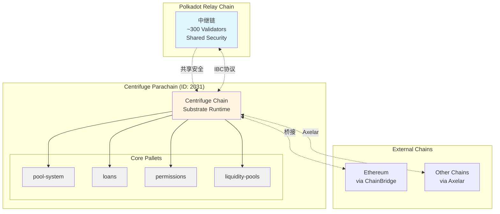
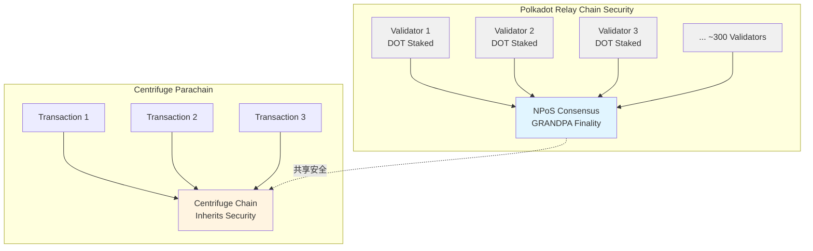
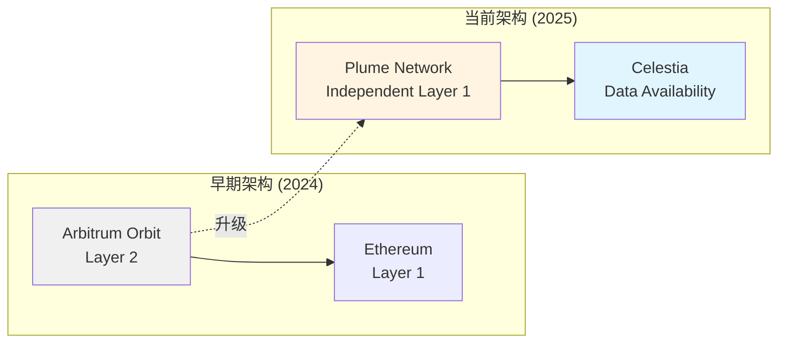
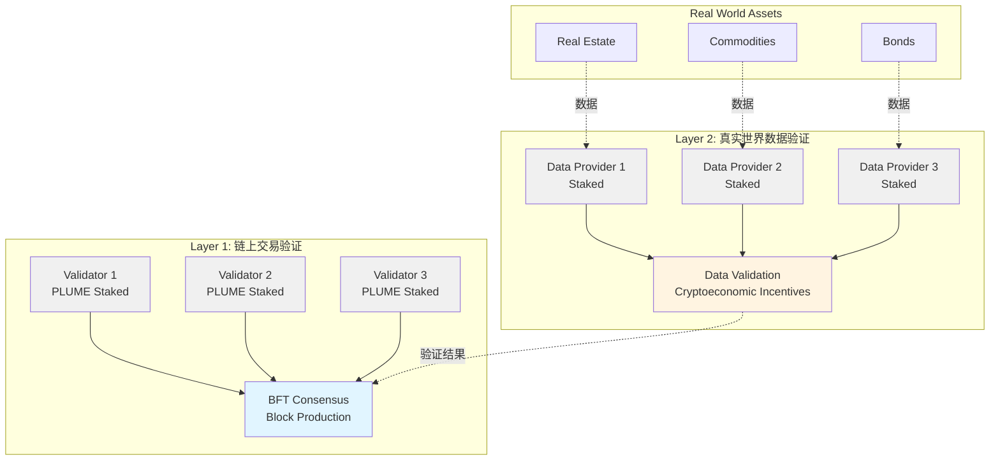
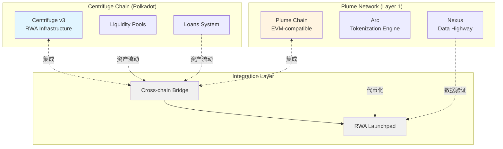

# Centrifuge vs Plume Network: RWA 公链技术深度对比分析

**文档版本**: v1.0  
**创建时间**: 2025-10-15 13:01 CST  
**作者**: RWA 技术研究团队  
**文档类型**: 技术分析报告

---

## 目录

-   [第 1 章: 执行摘要](#第1章-执行摘要)
-   [第 2 章: Centrifuge Chain 深度分析](#第2章-centrifuge-chain-深度分析)
-   [第 3 章: Plume Network 深度分析](#第3章-plume-network-深度分析)
-   [第 4 章: 技术对比分析](#第4章-技术对比分析)
-   [第 5 章: 相同点与不同点](#第5章-相同点与不同点)
-   [第 6 章: 适用场景分析](#第6章-适用场景分析)
-   [第 7 章: 合作关系分析](#第7章-合作关系分析)
-   [第 8 章: 技术选型建议](#第8章-技术选型建议)
-   [第 9 章: 未来展望](#第9章-未来展望)
-   [第 10 章: 附录](#第10章-附录)

---

## 第 1 章: 执行摘要

### 1.1 研究背景

Real World Assets (RWA) 代币化是区块链技术最具潜力的应用场景之一。随着传统金融资产上链需求的增长,市场对专用 RWA 公链的需求日益迫切。本报告深入分析两个代表性的 RWA 公链项目:

-   **Centrifuge Chain**: 基于 Polkadot 生态的成熟 RWA 基础设施
-   **Plume Network**: 基于 EVM 的创新 RWA 专用 Layer 1

### 1.2 研究目标

本研究旨在回答以下核心问题:

1. **是否有自己的公链?**

    - ✅ Centrifuge: 是,Polkadot Parachain (Parachain ID: 2031)
    - ✅ Plume Network: 是,独立 Layer 1 (2025 年 6 月 5 日主网上线)

2. **使用什么技术实现?**

    - Centrifuge: Substrate FRAME + Polkadot NPoS 共识
    - Plume Network: EVM-compatible + Proof of Representation 共识

3. **是否适用于 RWA 产品?**

    - ✅ Centrifuge: 专为 RWA 设计,30+自定义 Pallets
    - ✅ Plume Network: 专为 RWA 设计,全栈 RWA 解决方案

4. **有什么相同和不同?**
    - 相同: RWA 专用、合规内置、跨链互操作
    - 不同: 技术栈、架构设计、开发者体验、生态定位

### 1.3 核心发现

#### 关键结论

1. **技术成熟度**

    - Centrifuge: 成熟稳定,多年运行经验,大量成功案例
    - Plume Network: 新兴项目,创新技术,快速发展

2. **开发者体验**

    - Centrifuge: 学习曲线陡峭 (Rust + Substrate),高度定制化
    - Plume Network: 学习曲线平缓 (Solidity + Web3),快速上手

3. **安全模型**

    - Centrifuge: 继承 Polkadot 共享安全,约 300 个验证者
    - Plume Network: 创新的 Proof of Representation,专为 RWA 设计

4. **生态定位**

    - Centrifuge: 专注于结构化信贷市场
    - Plume Network: 专注于全栈 RWA 解决方案

5. **合作关系**
    - ✅ 2025 年 1 月 31 日,Plume 成为首个集成 Centrifuge v3 的区块链
    - ✅ 两者优势互补,共同推动 RWA 发展

### 1.4 适用场景

#### 选择 Centrifuge 的场景

-   ✅ 需要高度定制化的 RWA 解决方案
-   ✅ 需要 Polkadot 生态资源和跨链能力
-   ✅ 专注于结构化信贷市场
-   ✅ 长期稳定性要求高

#### 选择 Plume Network 的场景

-   ✅ 需要快速开发和部署
-   ✅ 需要以太坊生态集成
-   ✅ 创新的 RWA 用例 (预测市场、数据验证)
-   ✅ 熟悉 Solidity 和 Web3 工具

#### 混合方案

-   ✅ 利用 Centrifuge + Plume 集成,实现跨生态 RWA 流动
-   ✅ 在 Centrifuge 上构建核心 RWA 基础设施
-   ✅ 在 Plume 上构建面向用户的 DApp

---

## 第 2 章: Centrifuge Chain 深度分析

### 2.1 技术架构

#### 2.1.1 基础框架

**Substrate FRAME**

Centrifuge Chain 基于 Parity Technologies 开发的 Substrate 框架构建:

-   **编程语言**: Rust
-   **框架**: FRAME (Framework for Runtime Aggregation of Modularized Entities)
-   **模块化**: 通过 Pallets 实现功能模块化
-   **可升级**: 支持无分叉升级 (Forkless Upgrade)

**技术优势**:

-   ✅ 高性能: Rust 语言的内存安全和性能优势
-   ✅ 模块化: 30+自定义 Pallets,灵活组合
-   ✅ 可升级: 通过治理实现无缝升级
-   ✅ 互操作: 原生支持 Polkadot 生态

#### 2.1.2 Polkadot Parachain 定位

**网络信息**:

-   **Parachain ID**: 2031 (主网), 2088 (测试网)
-   **EVM Chain ID**: 2031 (主网), 2088 (测试网)
-   **区块时间**: 6 秒 (继承 Polkadot)
-   **最终性**: 即时最终性 (Instant Finality)

**Parachain 优势**:

-   ✅ **共享安全**: 继承 Polkadot 中继链的安全性
-   ✅ **跨链互操作**: 通过 IBC 协议与其他 Parachains 通信
-   ✅ **低成本**: 无需独立维护验证者网络
-   ✅ **可扩展**: 利用 Polkadot 的可扩展性

**架构图**:



#### 2.1.3 30+自定义 Pallets

Centrifuge Chain 包含 30+自定义 Pallets,覆盖 RWA 全生命周期:

**分类统计**:

-   RWA 专用模块: 10+ pallets
-   合规模块: 5+ pallets
-   跨链模块: 5+ pallets
-   数据和预言机模块: 5+ pallets
-   治理和工具模块: 5+ pallets

### 2.2 核心模块

#### 2.2.1 RWA 专用模块

**1. pool-system Pallet**

**功能**: 创建和管理投资池

**核心能力**:

-   ✅ 创建多层级投资池 (Tranches)
-   ✅ 管理投资周期和赎回
-   ✅ 计算 NAV (Net Asset Value)
-   ✅ 分配收益和损失

**技术实现**:

```rust
// pool-system pallet核心接口 (伪代码)
pub trait PoolSystem {
    // 创建新池
    fn create_pool(
        admin: AccountId,
        pool_id: PoolId,
        tranches: Vec<TrancheInput>,
    ) -> DispatchResult;

    // 投资到池
    fn invest(
        investor: AccountId,
        pool_id: PoolId,
        tranche_id: TrancheId,
        amount: Balance,
    ) -> DispatchResult;

    // 从池赎回
    fn redeem(
        investor: AccountId,
        pool_id: PoolId,
        tranche_id: TrancheId,
        amount: Balance,
    ) -> DispatchResult;
}
```

**官方文档**: https://reference.centrifuge.io/pallet_pool_system/

**2. loans Pallet**

**功能**: 管理资产抵押和借款

**核心能力**:

-   ✅ 锁定抵押品 NFT 到池中
-   ✅ 允许从池中借款
-   ✅ 记账贷款价值和未偿债务
-   ✅ 计算利息和还款

**技术实现**:

```rust
// loans pallet核心接口 (伪代码)
pub trait Loans {
    // 创建贷款
    fn create_loan(
        borrower: AccountId,
        pool_id: PoolId,
        collateral_nft: AssetId,
        loan_amount: Balance,
    ) -> DispatchResult;

    // 借款
    fn borrow(
        borrower: AccountId,
        loan_id: LoanId,
        amount: Balance,
    ) -> DispatchResult;

    // 还款
    fn repay(
        borrower: AccountId,
        loan_id: LoanId,
        amount: Balance,
    ) -> DispatchResult;
}
```

**官方文档**: https://reference.centrifuge.io/pallet_loans/

**3. pool-registry Pallet**

**功能**: 管理池的元数据

**核心能力**:

-   ✅ 创建池的元数据
-   ✅ 更新池的元数据
-   ✅ 设置池的参数

**官方文档**: https://reference.centrifuge.io/pallet_pool_registry/

**4. pool-fees Pallet**

**功能**: 管理池的费用

**核心能力**:

-   ✅ 存储池相关的所有费用
-   ✅ 允许收取这些费用
-   ✅ 分配费用给不同角色

**官方文档**: https://reference.centrifuge.io/pallet_pool_fees/

#### 2.2.2 合规模块

**1. permissions Pallet**

**功能**: 基于角色的权限管理

**核心能力**:

-   ✅ 将角色链接到账户
-   ✅ 添加和删除角色与账户之间的关系
-   ✅ 检查账户是否具有特定权限

**技术实现**:

```rust
// permissions pallet核心接口 (伪代码)
pub trait Permissions {
    // 添加角色
    fn add_role(
        account: AccountId,
        role: Role,
    ) -> DispatchResult;

    // 移除角色
    fn remove_role(
        account: AccountId,
        role: Role,
    ) -> DispatchResult;

    // 检查权限
    fn has_permission(
        account: AccountId,
        permission: Permission,
    ) -> bool;
}
```

**官方文档**: https://reference.centrifuge.io/pallet_permissions/

**2. transfer-allowlist Pallet**

**功能**: 转账白名单管理

**核心能力**:

-   ✅ 检查账户是否应被允许使用特定货币向接收位置进行转账
-   ✅ 管理转账白名单
-   ✅ 支持多种货币的白名单

**官方文档**: https://reference.centrifuge.io/pallet_transfer_allowlist/

**3. restricted-tokens Pallet**

**功能**: 受限代币转账

**核心能力**:

-   ✅ 转账代币和设置余额
-   ✅ 包装 orml-tokens 并添加权限检查
-   ✅ 支持合规限制

**官方文档**: https://reference.centrifuge.io/pallet_restricted_tokens/

**4. restricted-xtokens Pallet**

**功能**: 受限跨链代币转账

**核心能力**:

-   ✅ 包装 orml-xtokens
-   ✅ 允许运行时为跨链转账创建任意过滤器
-   ✅ 支持跨链合规检查

**官方文档**: https://reference.centrifuge.io/pallet_restricted_xtokens/

#### 2.2.3 跨链模块

**1. liquidity-pools Pallet**

**功能**: 跨链流动性池管理

**核心能力**:

-   ✅ 提供工具集以在外部域上启用外币投资
-   ✅ 支持跨链投资和赎回
-   ✅ 管理跨链流动性

**官方文档**: https://reference.centrifuge.io/pallet_liquidity_pools/

**2. liquidity-pools-gateway Pallet**

**功能**: 流动性池消息处理

**核心能力**:

-   ✅ 处理流动性池消息的主要处理器
-   ✅ 路由跨链消息
-   ✅ 验证跨链交易

**官方文档**: https://reference.centrifuge.io/pallet_liquidity_pools_gateway/

**3. axelar-router Pallet**

**功能**: Axelar 跨链路由

**核心能力**:

-   ✅ 通过 Axelar 与其他链通信
-   ✅ 支持多链互操作
-   ✅ 安全的跨链消息传递

**官方文档**: https://reference.centrifuge.io/pallet_axelar_router/

#### 2.2.4 数据和预言机模块

**1. oracle-collection Pallet**

**功能**: 预言机数据收集

**核心能力**:

-   ✅ 收集和聚合预言机值
-   ✅ 支持多个预言机源
-   ✅ 数据验证和聚合

**官方文档**: https://reference.centrifuge.io/pallet_oracle_collection/

**2. oracle-feed Pallet**

**功能**: 预言机数据提供

**核心能力**:

-   ✅ 提供预言机值
-   ✅ 支持多种数据类型
-   ✅ 实时数据更新

**官方文档**: https://reference.centrifuge.io/pallet_oracle_feed/

**3. anchors Pallet**

**功能**: 文档哈希存储 (POD 网络)

**核心能力**:

-   ✅ 在链上存储文档哈希
-   ✅ 验证文档真实性
-   ✅ 支持文档版本控制

**官方文档**: https://reference.centrifuge.io/pallet_anchors/

**4. anchors-v2 Pallet**

**功能**: 第二版文档哈希存储

**核心能力**:

-   ✅ 改进的文档哈希存储
-   ✅ 更高效的验证机制
-   ✅ 向后兼容

**官方文档**: https://reference.centrifuge.io/pallet_anchors_v2/

### 2.3 安全模型

#### 2.3.1 Polkadot 共享安全

**核心概念**:

Centrifuge Chain 作为 Polkadot Parachain,继承了 Polkadot 中继链的共享安全模型:

-   **验证者数量**: 约 300 个验证者保护整个 Polkadot 网络
-   **质押要求**: 通过 DOT 质押获得安全保障
-   **共识机制**: Nominated Proof of Stake (NPoS)
-   **最终性**: GRANDPA 最终性工具,提供即时最终性

**安全优势**:

-   ✅ **高安全性**: 300 个验证者提供强大的安全保障
-   ✅ **低成本**: 无需独立维护验证者网络
-   ✅ **即时最终性**: 交易一旦确认即不可逆
-   ✅ **抗攻击**: 需要攻击整个 Polkadot 网络才能攻击 Centrifuge

**安全架构图**:



#### 2.3.2 验证者网络

**Polkadot 验证者职责**:

1. **区块生产**: 生成 Parachain 区块
2. **区块验证**: 验证其他 Parachain 的区块
3. **最终性**: 参与 GRANDPA 最终性投票
4. **跨链通信**: 处理跨链消息

**质押和奖励**:

-   **最低质押**: 约 350 万 DOT (动态调整)
-   **奖励分配**: 验证者和提名者共享奖励
-   **惩罚机制**: 恶意行为会被削减质押

#### 2.3.3 即时最终性

**GRANDPA 最终性工具**:

-   **确认时间**: 6 秒 (一个区块)
-   **最终性**: 即时最终性,交易一旦确认即不可逆
-   **安全性**: 需要 2/3+验证者同意才能最终确认

**优势**:

-   ✅ 快速确认: 6 秒即可获得最终性
-   ✅ 不可逆: 交易一旦确认即不可回滚
-   ✅ 高安全: 需要 2/3+验证者同意

### 2.4 开发者生态

#### 2.4.1 Rust 开发环境

**技术栈**:

-   **编程语言**: Rust
-   **框架**: Substrate FRAME
-   **工具链**: Cargo, rustc, rustfmt

**学习曲线**:

-   ⚠️ **陡峭**: 需要学习 Rust 语言和 Substrate 框架
-   ⚠️ **专业**: 适合有系统编程经验的开发者
-   ✅ **高质量**: Rust 的内存安全和性能优势

**开发示例**:

```rust
// 创建自定义Pallet (伪代码)
#[frame_support::pallet]
pub mod pallet {
    use frame_support::pallet_prelude::*;
    use frame_system::pallet_prelude::*;

    #[pallet::config]
    pub trait Config: frame_system::Config {
        type RuntimeEvent: From<Event<Self>> + IsType<<Self as frame_system::Config>::RuntimeEvent>;
    }

    #[pallet::pallet]
    pub struct Pallet<T>(_);

    #[pallet::storage]
    pub type MyStorage<T: Config> = StorageValue<_, u32, ValueQuery>;

    #[pallet::call]
    impl<T: Config> Pallet<T> {
        #[pallet::weight(10_000)]
        pub fn do_something(origin: OriginFor<T>, value: u32) -> DispatchResult {
            let who = ensure_signed(origin)?;
            MyStorage::<T>::put(value);
            Self::deposit_event(Event::SomethingStored { value, who });
            Ok(())
        }
    }

    #[pallet::event]
    #[pallet::generate_deposit(pub(super) fn deposit_event)]
    pub enum Event<T: Config> {
        SomethingStored { value: u32, who: T::AccountId },
    }
}
```

#### 2.4.2 Substrate 工具链

**核心工具**:

1. **Substrate CLI**: 区块链开发和部署工具
2. **Polkadot.js**: JavaScript 库和 UI 工具
3. **Cargo Contract**: 智能合约开发工具
4. **Substrate Playground**: 在线开发环境

**官方资源**:

-   文档: https://docs.substrate.io/
-   GitHub: https://github.com/paritytech/substrate
-   教程: https://docs.substrate.io/tutorials/

#### 2.4.3 Polkadot 生态集成

**生态优势**:

1. **跨链互操作**: 通过 IBC 协议与其他 Parachains 通信
2. **共享安全**: 继承 Polkadot 中继链的安全性
3. **生态资源**: 访问 Polkadot 生态的 DeFi、NFT 等资源
4. **社区支持**: 活跃的 Polkadot 开发者社区

**集成案例**:

-   ✅ Acala: DeFi 集成
-   ✅ Moonbeam: EVM 兼容性
-   ✅ Astar: 智能合约平台
-   ✅ Phala: 隐私计算

---

## 第 3 章: Plume Network 深度分析

### 3.1 技术架构

#### 3.1.1 EVM-compatible Layer 1

**基础架构**:

Plume Network 是一个 EVM 兼容的 Layer 1 区块链,专为 RWA 设计:

-   **编程语言**: Solidity (智能合约), Go/Rust (节点)
-   **虚拟机**: EVM (Ethereum Virtual Machine)
-   **兼容性**: 完全兼容以太坊工具链
-   **主网上线**: 2025 年 6 月 5 日

**技术优势**:

-   ✅ **EVM 兼容**: 无缝集成以太坊生态
-   ✅ **开发者友好**: 熟悉的 Solidity 和 Web3 工具
-   ✅ **快速部署**: 利用现有以太坊工具和库
-   ✅ **生态丰富**: 访问以太坊 DeFi、NFT 等资源

**架构演进**:



**官方资源**:

-   网站: https://plume.org/
-   文档: https://docs.plume.org/
-   GitHub: https://github.com/plumenetwork

#### 3.1.2 Proof of Representation 共识

**核心概念**:

Proof of Representation (PoR) 是 Plume Network 创新的两层共识机制,专为 RWA 设计:

**两层架构**:

1. **第一层: 链上交易验证**

    - 功能: 验证链上交易 (类似传统 PoS)
    - 验证者: PLUME 代币质押者
    - 共识: 拜占庭容错 (BFT)

2. **第二层: 真实世界数据验证**
    - 功能: 验证真实世界数据和资产状态
    - 验证者: 专业数据提供者
    - 激励: 加密经济激励

**核心创新**:

-   ✅ **加密经济激励**: 利用代币激励委托责任
-   ✅ **自治系统**: 创建自治的数据验证系统
-   ✅ **可削减质押**: 验证者恶意行为会被削减质押
-   ✅ **解决单点故障**: 多个验证者提供冗余

**PoR 架构图**:



**官方文档**: https://docs.plume.org/plume/plume-security/architecture

#### 3.1.3 Celestia 数据可用性

**核心概念**:

Plume Network 使用 Celestia 作为数据可用性层:

-   **功能**: 存储交易数据,确保数据可用性
-   **优势**: 降低成本,提高可扩展性
-   **安全**: 数据可用性采样 (DAS)

**官方文档**: https://celestia.org/

### 3.2 核心组件

#### 3.2.1 Arc (代币化引擎)

**功能**: 高效资产代币化

**核心能力**:

-   ✅ 简化创建、上线和管理代币化 RWA
-   ✅ 集成合规和数据系统
-   ✅ 自动化合规检查
-   ✅ 支持物理和数字资产

**技术实现**:

```solidity
// Arc代币化引擎核心接口 (伪代码)
interface IArc {
    // 创建代币化资产
    function tokenizeAsset(
        string memory assetName,
        string memory assetSymbol,
        uint256 totalSupply,
        bytes memory metadata
    ) external returns (address tokenAddress);

    // 更新资产元数据
    function updateMetadata(
        address tokenAddress,
        bytes memory newMetadata
    ) external;

    // 设置合规规则
    function setComplianceRules(
        address tokenAddress,
        address[] memory allowedInvestors
    ) external;
}
```

**官方文档**: https://docs.plume.org/ (Arc 相关章节)

#### 3.2.2 Passport (智能钱包) - 即将推出

**功能**: 嵌入托管和合规的智能钱包

**核心能力**:

-   ✅ 直接在钱包中存储合约代码
-   ✅ 支持收益生成和流动性管理
-   ✅ 账户抽象功能
-   ✅ 可定制控制

**技术实现**:

```solidity
// Passport智能钱包核心接口 (伪代码)
interface IPassport {
    // 创建智能钱包
    function createWallet(
        address owner,
        bytes memory config
    ) external returns (address walletAddress);

    // 执行交易
    function execute(
        address to,
        uint256 value,
        bytes memory data
    ) external returns (bool success);

    // 设置收益策略
    function setYieldStrategy(
        address strategy
    ) external;
}
```

**官方文档**: https://docs.plume.org/ (Passport 相关章节)

#### 3.2.3 Nexus (数据高速公路)

**功能**: 将真实世界数据带到链上

**核心能力**:

-   ✅ 使用 zkTLS 等前沿技术
-   ✅ 集成可靠的链下数据
-   ✅ 实时、可操作的洞察
-   ✅ 支持预测市场、DeFi 应用

**技术实现**:

```solidity
// Nexus数据高速公路核心接口 (伪代码)
interface INexus {
    // 提交真实世界数据
    function submitData(
        bytes32 dataId,
        bytes memory data,
        bytes memory proof
    ) external;

    // 验证数据
    function verifyData(
        bytes32 dataId,
        bytes memory proof
    ) external view returns (bool isValid);

    // 获取数据
    function getData(
        bytes32 dataId
    ) external view returns (bytes memory data);
}
```

**官方文档**: https://docs.plume.org/ (Nexus 相关章节)

#### 3.2.4 pUSD (生态稳定币)

**功能**: Plume 生态系统的原生稳定币

**核心能力**:

-   ✅ 与美元挂钩
-   ✅ 用于 RWA 交易
-   ✅ 支持 DeFi 集成
-   ✅ 低滑点交易

**官方文档**: https://docs.plume.org/ (pUSD 相关章节)

#### 3.2.5 pETH (原生 ETH LST)

**功能**: Plume 的原生以太坊流动性质押代币

**核心能力**:

-   ✅ 支持 DeFi 集成
-   ✅ 流动性质押
-   ✅ 收益生成

**官方文档**: https://docs.plume.org/ (pETH 相关章节)

### 3.3 安全模型

#### 3.3.1 加密经济安全

**核心概念**:

Plume Network 通过 PLUME 代币质押实现加密经济安全:

-   **质押要求**: 验证者需要质押 PLUME 代币
-   **奖励机制**: 验证者获得区块奖励和交易费用
-   **惩罚机制**: 恶意行为会被削减质押

**安全优势**:

-   ✅ **经济激励**: 验证者有经济动机保持诚实
-   ✅ **可削减质押**: 恶意行为会被惩罚
-   ✅ **去中心化**: 多个验证者提供安全保障

#### 3.3.2 可削减质押

**削减条件**:

1. **双重签名**: 验证者在同一高度签署两个不同的区块
2. **数据造假**: 数据提供者提供虚假的真实世界数据
3. **离线**: 验证者长时间离线

**削减比例**:

-   轻微违规: 削减 5-10%质押
-   严重违规: 削减 50-100%质押

#### 3.3.3 真实世界数据验证

**验证机制**:

1. **多源验证**: 多个数据提供者提供相同数据
2. **加密证明**: 使用 zkTLS 等技术提供加密证明
3. **经济激励**: 数据提供者有经济动机提供准确数据
4. **惩罚机制**: 虚假数据会被削减质押

**技术实现**:

```solidity
// 真实世界数据验证 (伪代码)
contract DataVerification {
    struct DataSubmission {
        address provider;
        bytes32 dataHash;
        bytes proof;
        uint256 timestamp;
    }

    mapping(bytes32 => DataSubmission[]) public submissions;

    // 提交数据
    function submitData(
        bytes32 dataId,
        bytes memory data,
        bytes memory proof
    ) external {
        require(isStaked(msg.sender), "Not staked");
        bytes32 dataHash = keccak256(data);
        submissions[dataId].push(DataSubmission({
            provider: msg.sender,
            dataHash: dataHash,
            proof: proof,
            timestamp: block.timestamp
        }));
    }

    // 验证数据一致性
    function verifyConsensus(bytes32 dataId) external view returns (bool) {
        DataSubmission[] memory subs = submissions[dataId];
        require(subs.length >= 3, "Not enough submissions");

        // 检查是否有2/3+的数据提供者提交相同的数据哈希
        uint256 count = 0;
        bytes32 consensusHash = subs[0].dataHash;
        for (uint256 i = 0; i < subs.length; i++) {
            if (subs[i].dataHash == consensusHash) {
                count++;
            }
        }

        return count >= (subs.length * 2 / 3);
    }
}
```

### 3.4 开发者生态

#### 3.4.1 Solidity 开发环境

**技术栈**:

-   **编程语言**: Solidity
-   **框架**: Hardhat, Foundry
-   **工具链**: npm, yarn, pnpm

**学习曲线**:

-   ✅ **平缓**: 熟悉的 Solidity 和 Web3 工具
-   ✅ **友好**: 适合有以太坊开发经验的开发者
-   ✅ **快速**: 快速原型开发和部署

**开发示例**:

```solidity
// 创建RWA代币 (伪代码)
pragma solidity ^0.8.0;

import "@openzeppelin/contracts/token/ERC20/ERC20.sol";
import "@openzeppelin/contracts/access/AccessControl.sol";

contract RWAToken is ERC20, AccessControl {
    bytes32 public constant MINTER_ROLE = keccak256("MINTER_ROLE");
    bytes32 public constant COMPLIANCE_ROLE = keccak256("COMPLIANCE_ROLE");

    mapping(address => bool) public allowlist;

    constructor(
        string memory name,
        string memory symbol
    ) ERC20(name, symbol) {
        _grantRole(DEFAULT_ADMIN_ROLE, msg.sender);
        _grantRole(MINTER_ROLE, msg.sender);
        _grantRole(COMPLIANCE_ROLE, msg.sender);
    }

    // 铸造代币
    function mint(address to, uint256 amount) external onlyRole(MINTER_ROLE) {
        require(allowlist[to], "Not in allowlist");
        _mint(to, amount);
    }

    // 添加到白名单
    function addToAllowlist(address account) external onlyRole(COMPLIANCE_ROLE) {
        allowlist[account] = true;
    }

    // 转账前检查
    function _beforeTokenTransfer(
        address from,
        address to,
        uint256 amount
    ) internal virtual override {
        super._beforeTokenTransfer(from, to, amount);
        if (from != address(0) && to != address(0)) {
            require(allowlist[to], "Recipient not in allowlist");
        }
    }
}
```

#### 3.4.2 以太坊工具链

**核心工具**:

1. **Hardhat**: 以太坊开发环境
2. **Foundry**: 快速、可移植的以太坊开发工具
3. **Remix**: 在线 Solidity IDE
4. **MetaMask**: 浏览器钱包

**官方资源**:

-   Hardhat: https://hardhat.org/
-   Foundry: https://getfoundry.sh/
-   Remix: https://remix.ethereum.org/

#### 3.4.3 EVM 生态集成

**生态优势**:

1. **DeFi 集成**: 无缝集成 Uniswap、Aave 等 DeFi 协议
2. **NFT 支持**: 支持 ERC-721、ERC-1155 等 NFT 标准
3. **钱包支持**: MetaMask、WalletConnect 等钱包原生支持
4. **工具丰富**: Etherscan、The Graph 等工具可直接使用

**集成案例**:

-   ✅ Uniswap: DEX 集成
-   ✅ Aave: 借贷协议集成
-   ✅ Chainlink: 预言机集成
-   ✅ The Graph: 数据索引

---

## 第 4 章: 技术对比分析

### 4.1 架构设计对比

#### 4.1.1 基础框架对比

| 维度         | Centrifuge Chain   | Plume Network                   |
| ------------ | ------------------ | ------------------------------- |
| **基础框架** | Substrate FRAME    | EVM-compatible                  |
| **编程语言** | Rust               | Solidity (合约), Go/Rust (节点) |
| **虚拟机**   | Substrate Runtime  | EVM                             |
| **网络类型** | Polkadot Parachain | Independent Layer 1             |
| **主网上线** | 2021 年            | 2025 年 6 月 5 日               |

**分析**:

-   ✅ Centrifuge: 成熟稳定,多年运行经验
-   ✅ Plume: 新兴项目,创新技术,快速发展

#### 4.1.2 共识机制对比

| 维度           | Centrifuge Chain                | Plume Network                 |
| -------------- | ------------------------------- | ----------------------------- |
| **共识机制**   | Nominated Proof of Stake (NPoS) | Proof of Representation (PoR) |
| **验证者数量** | 约 300 个 (Polkadot)            | 未公开                        |
| **区块时间**   | 6 秒                            | 未公开 (预计 2-6 秒)          |
| **最终性**     | 即时最终性 (GRANDPA)            | 未公开                        |
| **质押代币**   | DOT                             | PLUME                         |

**分析**:

-   ✅ Centrifuge: 继承 Polkadot 共享安全,成熟稳定
-   ✅ Plume: 创新的 PoR 共识,专为 RWA 设计

#### 4.1.3 安全模型对比

| 维度         | Centrifuge Chain  | Plume Network             |
| ------------ | ----------------- | ------------------------- |
| **安全模型** | Polkadot 共享安全 | 加密经济安全              |
| **验证者**   | Polkadot 验证者   | PLUME 质押者 + 数据提供者 |
| **惩罚机制** | Polkadot 削减机制 | 可削减质押                |
| **数据验证** | 预言机模块        | Proof of Representation   |

**分析**:

-   ✅ Centrifuge: 继承 Polkadot 的强大安全性
-   ✅ Plume: 创新的两层验证机制,专为 RWA 设计

### 4.2 性能指标对比

#### 4.2.1 吞吐量和延迟

| 维度         | Centrifuge Chain   | Plume Network        |
| ------------ | ------------------ | -------------------- |
| **TPS**      | 约 1000-2000       | 未公开 (预计 5000+)  |
| **确认时间** | 6 秒               | 未公开 (预计 2-6 秒) |
| **最终性**   | 即时最终性         | 未公开               |
| **Gas 费用** | 低 (Polkadot 生态) | 低 (Layer 1 优化)    |

**分析**:

-   ✅ Centrifuge: 受 Polkadot 限制,但足够 RWA 应用
-   ✅ Plume: 独立 Layer 1,理论上可以更高性能

#### 4.2.2 可扩展性

| 维度         | Centrifuge Chain    | Plume Network       |
| ------------ | ------------------- | ------------------- |
| **水平扩展** | Polkadot Parachains | Celestia 数据可用性 |
| **垂直扩展** | Substrate 模块化    | EVM 优化            |
| **跨链能力** | IBC 协议 + Axelar   | 标准桥接            |

**分析**:

-   ✅ Centrifuge: 利用 Polkadot 的可扩展性
-   ✅ Plume: 利用 Celestia 的数据可用性

### 4.3 开发者体验对比

#### 4.3.1 学习曲线

| 维度         | Centrifuge Chain       | Plume Network          |
| ------------ | ---------------------- | ---------------------- |
| **编程语言** | Rust (陡峭)            | Solidity (平缓)        |
| **框架**     | Substrate FRAME (专业) | Hardhat/Foundry (友好) |
| **文档**     | Substrate 文档         | 以太坊文档             |
| **社区**     | Polkadot 社区          | 以太坊社区             |

**分析**:

-   ⚠️ Centrifuge: 学习曲线陡峭,适合专业开发者
-   ✅ Plume: 学习曲线平缓,适合以太坊开发者

#### 4.3.2 开发工具

| 维度     | Centrifuge Chain   | Plume Network    |
| -------- | ------------------ | ---------------- |
| **IDE**  | VSCode + Rust 插件 | Remix, VSCode    |
| **框架** | Substrate CLI      | Hardhat, Foundry |
| **调试** | Substrate 调试工具 | 以太坊调试工具   |
| **测试** | Rust 测试框架      | Hardhat, Foundry |

**分析**:

-   ✅ Centrifuge: 专业的 Substrate 工具链
-   ✅ Plume: 丰富的以太坊工具链

#### 4.3.3 社区支持

| 维度           | Centrifuge Chain     | Plume Network     |
| -------------- | -------------------- | ----------------- |
| **开发者数量** | Polkadot 生态 (中等) | 以太坊生态 (大量) |
| **教程资源**   | Substrate 教程       | 以太坊教程        |
| **开源项目**   | Polkadot 生态项目    | 以太坊生态项目    |
| **技术支持**   | Polkadot 社区        | 以太坊社区        |

**分析**:

-   ✅ Centrifuge: 活跃的 Polkadot 社区
-   ✅ Plume: 庞大的以太坊社区

### 4.4 跨链能力对比

#### 4.4.1 跨链协议

| 维度         | Centrifuge Chain     | Plume Network |
| ------------ | -------------------- | ------------- |
| **原生跨链** | IBC 协议 (Polkadot)  | 无            |
| **桥接**     | ChainBridge (以太坊) | 标准桥接      |
| **第三方**   | Axelar               | 未公开        |

**分析**:

-   ✅ Centrifuge: 原生支持 Polkadot 生态跨链
-   ✅ Plume: 通过桥接连接其他链

#### 4.4.2 生态集成

| 维度          | Centrifuge Chain | Plume Network |
| ------------- | ---------------- | ------------- |
| **DeFi 集成** | Polkadot DeFi    | 以太坊 DeFi   |
| **NFT 支持**  | Polkadot NFT     | 以太坊 NFT    |
| **钱包支持**  | Polkadot.js      | MetaMask      |
| **工具支持**  | Polkadot 工具    | 以太坊工具    |

**分析**:

-   ✅ Centrifuge: 深度集成 Polkadot 生态
-   ✅ Plume: 深度集成以太坊生态

#### 4.4.3 互操作性

| 维度         | Centrifuge Chain  | Plume Network  |
| ------------ | ----------------- | -------------- |
| **跨链资产** | Polkadot 生态资产 | 以太坊生态资产 |
| **跨链消息** | IBC 协议          | 标准桥接       |
| **跨链合约** | Polkadot XCM      | 未公开         |

**分析**:

-   ✅ Centrifuge: 强大的 Polkadot 跨链能力
-   ✅ Plume: 标准的以太坊桥接能力

---

## 第 5 章: 相同点与不同点

### 5.1 相同点

#### 5.1.1 RWA 专用设计

**Centrifuge Chain**:

-   ✅ 30+自定义 Pallets 专为 RWA 设计
-   ✅ pool-system, loans 等核心 RWA 模块
-   ✅ 多年 RWA 运营经验

**Plume Network**:

-   ✅ Arc 代币化引擎专为 RWA 设计
-   ✅ Proof of Representation 专为 RWA 设计
-   ✅ Nexus 数据高速公路专为 RWA 设计

**共同点**:

-   ✅ 两者都是专为 RWA 设计的公链
-   ✅ 两者都提供全栈 RWA 解决方案
-   ✅ 两者都内置合规功能

#### 5.1.2 合规内置

**Centrifuge Chain**:

-   ✅ permissions pallet (权限管理)
-   ✅ transfer-allowlist pallet (转账白名单)
-   ✅ restricted-tokens pallet (受限代币)
-   ✅ restricted-xtokens pallet (受限跨链代币)

**Plume Network**:

-   ✅ Arc 集成合规系统
-   ✅ Passport 智能钱包内置合规
-   ✅ 自动化合规检查

**共同点**:

-   ✅ 两者都内置合规功能
-   ✅ 两者都支持 KYC/AML
-   ✅ 两者都支持转账限制

#### 5.1.3 跨链互操作

**Centrifuge Chain**:

-   ✅ IBC 协议 (Polkadot 生态)
-   ✅ ChainBridge (以太坊)
-   ✅ Axelar (多链)

**Plume Network**:

-   ✅ 标准桥接 (以太坊生态)
-   ✅ Celestia 数据可用性
-   ✅ 集成 Centrifuge v3

**共同点**:

-   ✅ 两者都支持跨链互操作
-   ✅ 两者都可以连接多个区块链
-   ✅ 两者都支持资产跨链流动

#### 5.1.4 全栈解决方案

**Centrifuge Chain**:

-   ✅ 资产代币化 (pool-system)
-   ✅ 贷款管理 (loans)
-   ✅ 流动性池 (liquidity-pools)
-   ✅ 预言机 (oracle-collection, oracle-feed)

**Plume Network**:

-   ✅ 资产代币化 (Arc)
-   ✅ 智能钱包 (Passport)
-   ✅ 数据验证 (Nexus)
-   ✅ 生态代币 (pUSD, pETH)

**共同点**:

-   ✅ 两者都提供全栈 RWA 解决方案
-   ✅ 两者都覆盖 RWA 全生命周期
-   ✅ 两者都提供开发者工具和 SDK

### 5.2 不同点

#### 5.2.1 技术栈

| 维度         | Centrifuge Chain   | Plume Network       |
| ------------ | ------------------ | ------------------- |
| **基础框架** | Substrate FRAME    | EVM-compatible      |
| **编程语言** | Rust               | Solidity            |
| **虚拟机**   | Substrate Runtime  | EVM                 |
| **网络类型** | Polkadot Parachain | Independent Layer 1 |

**分析**:

-   Centrifuge: 基于 Substrate 的 Polkadot Parachain
-   Plume: 基于 EVM 的独立 Layer 1

#### 5.2.2 架构设计

| 维度           | Centrifuge Chain | Plume Network           |
| -------------- | ---------------- | ----------------------- |
| **模块化**     | Pallets (30+)    | 智能合约                |
| **共识机制**   | NPoS (Polkadot)  | Proof of Representation |
| **安全模型**   | 共享安全         | 加密经济安全            |
| **数据可用性** | Polkadot         | Celestia                |

**分析**:

-   Centrifuge: 模块化 Pallets 架构,继承 Polkadot 安全
-   Plume: 智能合约架构,创新 PoR 共识

#### 5.2.3 开发者体验

| 维度         | Centrifuge Chain        | Plume Network          |
| ------------ | ----------------------- | ---------------------- |
| **学习曲线** | 陡峭 (Rust + Substrate) | 平缓 (Solidity + Web3) |
| **开发工具** | Substrate 工具链        | 以太坊工具链           |
| **社区规模** | Polkadot 社区 (中等)    | 以太坊社区 (大量)      |
| **开发速度** | 慢 (需要学习 Rust)      | 快 (熟悉的 Solidity)   |

**分析**:

-   Centrifuge: 适合专业开发者,高度定制化
-   Plume: 适合以太坊开发者,快速上手

#### 5.2.4 生态定位

| 维度         | Centrifuge Chain | Plume Network     |
| ------------ | ---------------- | ----------------- |
| **核心市场** | 结构化信贷市场   | 全栈 RWA 解决方案 |
| **目标用户** | 机构投资者       | 机构 + 零售投资者 |
| **生态集成** | Polkadot DeFi    | 以太坊 DeFi       |
| **创新方向** | 深化 RWA 金融    | 扩展 RWA 应用场景 |

**分析**:

-   Centrifuge: 专注于结构化信贷市场,深化 RWA 金融
-   Plume: 专注于全栈 RWA 解决方案,扩展 RWA 应用场景

---

## 第 6 章: 适用场景分析

### 6.1 Centrifuge 适用场景

#### 6.1.1 结构化信贷市场

**适用原因**:

-   ✅ **成熟的池系统**: pool-system pallet 提供多层级投资池
-   ✅ **完善的贷款管理**: loans pallet 支持抵押品管理和借款
-   ✅ **多年运营经验**: 大量成功案例和最佳实践

**典型案例**:

-   房地产抵押贷款池
-   应收账款融资池
-   供应链金融池
-   中小企业贷款池

**技术优势**:

-   多层级分片 (Tranches) 支持不同风险偏好
-   自动化 NAV 计算和收益分配
-   完善的合规和权限管理

#### 6.1.2 Polkadot 生态集成

**适用原因**:

-   ✅ **原生跨链**: IBC 协议支持 Polkadot 生态跨链
-   ✅ **共享安全**: 继承 Polkadot 中继链的安全性
-   ✅ **生态资源**: 访问 Polkadot 生态的 DeFi、NFT 等资源

**典型案例**:

-   与 Acala 集成的 DeFi 应用
-   与 Moonbeam 集成的 EVM 应用
-   与 Astar 集成的智能合约平台
-   与 Phala 集成的隐私计算

**技术优势**:

-   无缝跨链资产流动
-   共享 Polkadot 的安全性和可扩展性
-   访问 Polkadot 生态的丰富资源

#### 6.1.3 高度定制化需求

**适用原因**:

-   ✅ **Substrate 模块化**: 30+自定义 Pallets,灵活组合
-   ✅ **Rust 开发**: 高性能、内存安全
-   ✅ **无分叉升级**: 通过治理实现无缝升级

**典型案例**:

-   定制化的 RWA 金融产品
-   复杂的合规要求
-   特殊的资产类型
-   创新的金融模型

**技术优势**:

-   高度灵活的模块化架构
-   强大的定制化能力
-   专业的开发者支持

#### 6.1.4 长期稳定性要求

**适用原因**:

-   ✅ **成熟技术栈**: Substrate 和 Polkadot 多年运行经验
-   ✅ **大量成功案例**: 多个 RWA 项目成功运行
-   ✅ **强大安全性**: 继承 Polkadot 的共享安全

**典型案例**:

-   长期债券代币化
-   大型资产池管理
-   机构级 RWA 平台
-   监管合规要求高的项目

**技术优势**:

-   成熟稳定的技术栈
-   强大的安全保障
-   长期的技术支持

### 6.2 Plume Network 适用场景

#### 6.2.1 快速开发和部署

**适用原因**:

-   ✅ **EVM 兼容**: 熟悉的 Solidity 和 Web3 工具
-   ✅ **丰富工具链**: Hardhat、Foundry、Remix 等
-   ✅ **快速上手**: 以太坊开发者可以快速上手

**典型案例**:

-   快速原型开发
-   MVP 验证
-   创业项目
-   时间敏感的项目

**技术优势**:

-   熟悉的开发环境
-   丰富的开发工具
-   快速的开发周期

#### 6.2.2 以太坊生态集成

**适用原因**:

-   ✅ **EVM 兼容**: 无缝集成以太坊 DeFi
-   ✅ **钱包支持**: MetaMask、WalletConnect 等原生支持
-   ✅ **工具丰富**: Etherscan、The Graph 等工具可直接使用

**典型案例**:

-   与 Uniswap 集成的 DEX
-   与 Aave 集成的借贷协议
-   与 Chainlink 集成的预言机
-   与 The Graph 集成的数据索引

**技术优势**:

-   无缝集成以太坊生态
-   访问庞大的以太坊用户群
-   利用成熟的以太坊基础设施

#### 6.2.3 创新 RWA 用例

**适用原因**:

-   ✅ **Arc 代币化引擎**: 高效资产代币化
-   ✅ **Nexus 数据高速公路**: 真实世界数据验证
-   ✅ **Proof of Representation**: 创新的共识机制

**典型案例**:

-   预测市场 (基于真实世界数据)
-   动态 NFT (基于真实世界数据)
-   数据驱动的 DeFi
-   创新的 RWA 金融产品

**技术优势**:

-   创新的技术架构
-   强大的数据验证能力
-   支持新型 RWA 应用场景

#### 6.2.4 真实世界数据验证

**适用原因**:

-   ✅ **Proof of Representation**: 两层验证机制
-   ✅ **zkTLS 技术**: 加密证明
-   ✅ **经济激励**: 数据提供者有经济动机提供准确数据

**典型案例**:

-   基于真实世界数据的预测市场
-   动态定价的 RWA 代币
-   实时数据驱动的 DeFi
-   供应链数据验证

**技术优势**:

-   创新的数据验证机制
-   强大的加密证明能力
-   经济激励确保数据准确性

---

## 第 7 章: 合作关系分析

### 7.1 Centrifuge + Plume 集成

#### 7.1.1 集成内容

**官方公告** (2025 年 1 月 31 日):

-   **标题**: "Centrifuge and Plume Network Partner to Pioneer Next-Generation RWA Innovation in DeFi"
-   **来源**: https://centrifuge.io/blog/centrifuge-plume-rwa-innovation

**核心内容**:

1. **Centrifuge v3 集成**: Plume 完全托管 Centrifuge v3
2. **RWA Launchpad**: Plume 集成 Centrifuge 的 RWA Launchpad
3. **跨链互操作**: 两个生态系统之间的无缝资产流动

#### 7.1.2 技术实现

**集成架构**:



**技术细节**:

1. **跨链桥接**: 通过桥接实现 Centrifuge 和 Plume 之间的资产流动
2. **RWA Launchpad**: 统一的 RWA 资产发行平台
3. **数据同步**: 两个链之间的数据同步和验证

#### 7.1.3 生态意义

**对 Centrifuge 的意义**:

-   ✅ **扩展到 EVM 生态**: 访问以太坊生态的庞大用户群
-   ✅ **增加流动性**: 通过 Plume 吸引更多投资者
-   ✅ **技术互补**: 利用 Plume 的创新技术

**对 Plume 的意义**:

-   ✅ **获得成熟 RWA 基础设施**: 利用 Centrifuge 的多年经验
-   ✅ **快速启动**: 无需从零开始构建 RWA 基础设施
-   ✅ **技术互补**: 利用 Centrifuge 的 Polkadot 生态资源

**对 RWA 生态的意义**:

-   ✅ **跨生态互操作**: Polkadot 和以太坊生态的 RWA 资产可以互通
-   ✅ **技术创新**: 两者的技术优势互补,推动 RWA 创新
-   ✅ **用户体验**: 用户可以在两个生态之间无缝切换

### 7.2 跨生态 RWA 流动

#### 7.2.1 资产互通

**流动路径**:

1. **Centrifuge → Plume**: Centrifuge 上的 RWA 资产可以桥接到 Plume
2. **Plume → Centrifuge**: Plume 上的 RWA 资产可以桥接到 Centrifuge
3. **双向流动**: 资产可以在两个生态之间自由流动

**技术实现**:

-   跨链桥接协议
-   资产锁定和铸造机制
-   合规检查和验证

#### 7.2.2 流动性共享

**流动性池**:

-   Centrifuge 的流动性池可以在 Plume 上访问
-   Plume 的流动性池可以在 Centrifuge 上访问
-   两个生态的流动性可以共享

**收益机会**:

-   投资者可以在两个生态之间寻找最佳收益机会
-   套利机会促进价格发现
-   流动性提供者可以获得更高收益

#### 7.2.3 用户体验

**统一界面**:

-   RWA Launchpad 提供统一的用户界面
-   用户无需关心底层链的差异
-   一键切换两个生态

**无缝体验**:

-   自动化的跨链桥接
-   统一的钱包管理
-   一致的用户体验

---

## 第 8 章: 技术选型建议

### 8.1 选择 Centrifuge 的理由

#### 8.1.1 技术成熟度

**优势**:

-   ✅ **多年运行经验**: 2021 年主网上线,多年稳定运行
-   ✅ **大量成功案例**: 多个 RWA 项目成功运行
-   ✅ **成熟技术栈**: Substrate 和 Polkadot 经过充分验证

**适用场景**:

-   需要稳定可靠的 RWA 基础设施
-   机构级 RWA 平台
-   长期运营的项目

#### 8.1.2 Polkadot 生态

**优势**:

-   ✅ **共享安全**: 继承 Polkadot 中继链的安全性
-   ✅ **跨链互操作**: IBC 协议支持 Polkadot 生态跨链
-   ✅ **生态资源**: 访问 Polkadot 生态的 DeFi、NFT 等资源

**适用场景**:

-   需要 Polkadot 生态资源
-   需要跨链互操作
-   需要强大的安全保障

#### 8.1.3 定制化能力

**优势**:

-   ✅ **Substrate 模块化**: 30+自定义 Pallets,灵活组合
-   ✅ **Rust 开发**: 高性能、内存安全
-   ✅ **无分叉升级**: 通过治理实现无缝升级

**适用场景**:

-   需要高度定制化的 RWA 解决方案
-   复杂的合规要求
-   创新的金融模型

### 8.2 选择 Plume 的理由

#### 8.2.1 开发效率

**优势**:

-   ✅ **EVM 兼容**: 熟悉的 Solidity 和 Web3 工具
-   ✅ **丰富工具链**: Hardhat、Foundry、Remix 等
-   ✅ **快速上手**: 以太坊开发者可以快速上手

**适用场景**:

-   快速原型开发
-   MVP 验证
-   时间敏感的项目

#### 8.2.2 以太坊生态

**优势**:

-   ✅ **EVM 兼容**: 无缝集成以太坊 DeFi
-   ✅ **钱包支持**: MetaMask、WalletConnect 等原生支持
-   ✅ **工具丰富**: Etherscan、The Graph 等工具可直接使用

**适用场景**:

-   需要以太坊生态集成
-   需要访问庞大的以太坊用户群
-   需要利用成熟的以太坊基础设施

#### 8.2.3 创新能力

**优势**:

-   ✅ **Proof of Representation**: 创新的共识机制
-   ✅ **Nexus 数据高速公路**: 真实世界数据验证
-   ✅ **Arc 代币化引擎**: 高效资产代币化

**适用场景**:

-   创新的 RWA 用例
-   需要真实世界数据验证
-   预测市场、动态 NFT 等新型应用

### 8.3 混合方案

#### 8.3.1 跨链集成

**策略**:

-   ✅ 在 Centrifuge 上构建核心 RWA 基础设施
-   ✅ 在 Plume 上构建面向用户的 DApp
-   ✅ 通过桥接实现两个生态的资产流动

**优势**:

-   利用 Centrifuge 的成熟 RWA 基础设施
-   利用 Plume 的快速开发和以太坊生态
-   两者优势互补

#### 8.3.2 优势互补

**Centrifuge 负责**:

-   核心 RWA 资产管理
-   结构化信贷市场
-   Polkadot 生态集成

**Plume 负责**:

-   用户界面和体验
-   以太坊生态集成
-   创新 RWA 应用

#### 8.3.3 最佳实践

**建议**:

1. **评估需求**: 明确项目的核心需求和目标用户
2. **技术选型**: 根据需求选择合适的技术栈
3. **混合方案**: 考虑跨链集成,利用两者优势
4. **持续优化**: 根据实际运营情况持续优化

---

## 第 9 章: 未来展望

### 9.1 技术演进方向

#### 9.1.1 Centrifuge 路线图

**短期 (2025-2026)**:

-   ✅ 增强跨链能力 (更多桥接)
-   ✅ 优化性能 (提高 TPS)
-   ✅ 扩展 RWA 资产类型

**中期 (2026-2027)**:

-   ✅ 深化 Polkadot 生态集成
-   ✅ 增强合规功能
-   ✅ 扩展全球市场

**长期 (2027+)**:

-   ✅ 成为 RWA 基础设施标准
-   ✅ 支持更多资产类型
-   ✅ 全球监管合规

#### 9.1.2 Plume 路线图

**短期 (2025-2026)**:

-   ✅ 完善核心组件 (Passport、Nexus)
-   ✅ 扩展 RWA 应用场景
-   ✅ 增强数据验证能力

**中期 (2026-2027)**:

-   ✅ 深化以太坊生态集成
-   ✅ 扩展全球市场
-   ✅ 增强安全性

**长期 (2027+)**:

-   ✅ 成为 RWA 创新平台
-   ✅ 支持更多创新用例
-   ✅ 全球监管合规

#### 9.1.3 行业趋势

**RWA 代币化**:

-   ✅ 更多传统资产上链
-   ✅ 监管框架逐步完善
-   ✅ 机构采用率提高

**技术创新**:

-   ✅ 更高效的共识机制
-   ✅ 更强大的数据验证
-   ✅ 更好的用户体验

**生态融合**:

-   ✅ Polkadot 和以太坊生态融合
-   ✅ 跨链互操作成为标准
-   ✅ 统一的 RWA 生态

### 9.2 生态发展预测

#### 9.2.1 开发者增长

**Centrifuge**:

-   预计 2025-2027 年开发者数量增长 50-100%
-   Polkadot 生态的增长带动 Centrifuge 发展
-   更多 RWA 项目选择 Centrifuge

**Plume**:

-   预计 2025-2027 年开发者数量增长 100-200%
-   以太坊生态的庞大开发者群体
-   创新的技术吸引更多开发者

#### 9.2.2 资产规模

**Centrifuge**:

-   预计 2025-2027 年 TVL 增长 200-500%
-   更多机构采用 Centrifuge
-   结构化信贷市场持续增长

**Plume**:

-   预计 2025-2027 年 TVL 增长 500-1000%
-   新兴平台,增长潜力巨大
-   创新用例吸引更多资产

#### 9.2.3 市场份额

**Centrifuge**:

-   预计在结构化信贷市场保持领先地位
-   Polkadot 生态的 RWA 首选平台
-   机构级 RWA 平台的标准

**Plume**:

-   预计在创新 RWA 应用场景领先
-   以太坊生态的 RWA 重要平台
-   零售投资者的首选平台

---

## 第 10 章: 附录

### 10.1 技术术语表

| 术语          | 解释                                                      |
| ------------- | --------------------------------------------------------- |
| **RWA**       | Real World Assets,真实世界资产                            |
| **Substrate** | Parity Technologies 开发的区块链开发框架                  |
| **FRAME**     | Framework for Runtime Aggregation of Modularized Entities |
| **Pallet**    | Substrate 的模块化组件                                    |
| **Parachain** | Polkadot 的平行链                                         |
| **NPoS**      | Nominated Proof of Stake,提名权益证明                     |
| **GRANDPA**   | GHOST-based Recursive Ancestor Deriving Prefix Agreement  |
| **IBC**       | Inter-Blockchain Communication,跨链通信协议               |
| **EVM**       | Ethereum Virtual Machine,以太坊虚拟机                     |
| **PoR**       | Proof of Representation,表示证明                          |
| **zkTLS**     | Zero-Knowledge Transport Layer Security                   |
| **DAS**       | Data Availability Sampling,数据可用性采样                 |
| **TVL**       | Total Value Locked,总锁定价值                             |
| **NAV**       | Net Asset Value,净资产价值                                |
| **Tranche**   | 分片,投资池的不同风险等级                                 |

### 10.2 参考资源

#### Centrifuge 官方资源

-   **官网**: https://centrifuge.io/
-   **文档**: https://docs.centrifuge.io/
-   **GitHub**: https://github.com/centrifuge/centrifuge-chain
-   **API 参考**: https://reference.centrifuge.io/
-   **Polkadot 生态**: https://parachains.info/details/centrifuge

#### Plume Network 官方资源

-   **官网**: https://plume.org/
-   **文档**: https://docs.plume.org/
-   **GitHub**: https://github.com/plumenetwork
-   **博客**: https://plume.org/blog/
-   **L2BEAT**: https://l2beat.com/scaling/projects/plumenetwork

#### 合作公告

-   **Centrifuge 博客**: https://centrifuge.io/blog/centrifuge-plume-rwa-innovation

### 10.3 官方链接

#### Substrate 和 Polkadot

-   **Substrate 文档**: https://docs.substrate.io/
-   **Polkadot 官网**: https://polkadot.network/
-   **Polkadot.js**: https://polkadot.js.org/

#### 以太坊生态

-   **以太坊官网**: https://ethereum.org/
-   **Hardhat**: https://hardhat.org/
-   **Foundry**: https://getfoundry.sh/
-   **Remix**: https://remix.ethereum.org/

#### 其他资源

-   **Celestia**: https://celestia.org/
-   **Axelar**: https://axelar.network/

### 10.4 社区资源

#### Centrifuge 社区

-   **Discord**: https://discord.gg/centrifuge
-   **Telegram**: https://t.me/centrifuge_chat
-   **Twitter**: https://twitter.com/centrifuge

#### Plume Network 社区

-   **Discord**: https://discord.gg/plumenetwork
-   **Telegram**: https://t.me/plumenetwork
-   **Twitter**: https://twitter.com/plumenetwork

---

**文档结束**

**版本**: v1.0
**最后更新**: 2025-10-15 13:01 CST
**作者**: RWA 技术研究团队
**联系方式**: research@rwa-tech.com

**版权声明**: 本文档仅供技术研究和学习使用,所有信息来源于官方公开资料。

#### 5.2.4 生态定位

| 维度         | Centrifuge Chain | Plume Network     |
| ------------ | ---------------- | ----------------- |
| **核心市场** | 结构化信贷市场   | 全栈 RWA 解决方案 |
| **目标用户** | 机构投资者       | 机构 + 零售投资者 |
| **生态集成** | Polkadot DeFi    | 以太坊 DeFi       |
| **创新方向** | 深化 RWA 金融    | 扩展 RWA 应用场景 |

**分析**:

-   Centrifuge: 专注于结构化信贷市场,深化 RWA 金融
-   Plume: 专注于全栈 RWA 解决方案,扩展 RWA 应用场景

---

        DP1 --> DV
        DP2 --> DV
        DP3 --> DV
    end

    subgraph "Real World Assets"
        RWA1[Real Estate]
        RWA2[Commodities]
        RWA3[Bonds]
    end

    RWA1 -.数据.-> DP1
    RWA2 -.数据.-> DP2
    RWA3 -.数据.-> DP3

    DV -.验证结果.-> BFT

    style BFT fill:#e1f5ff
    style DV fill:#fff4e1
    style V1 fill:#f0f0f0
    style V2 fill:#f0f0f0
    style V3 fill:#f0f0f0
    style DP1 fill:#f0f0f0
    style DP2 fill:#f0f0f0
    style DP3 fill:#f0f0f0

```

**官方文档**: https://docs.plume.org/plume/plume-security/architecture
```
