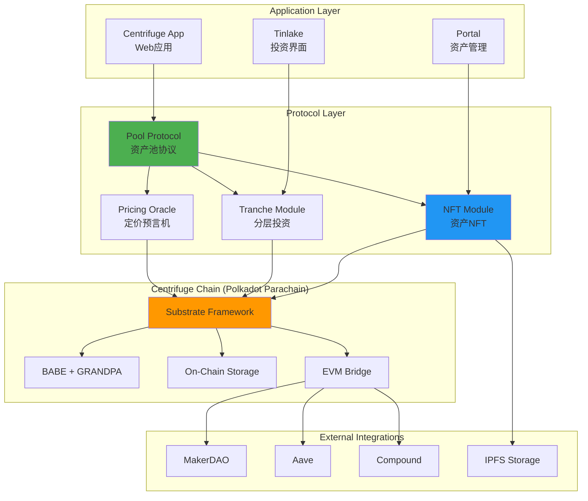
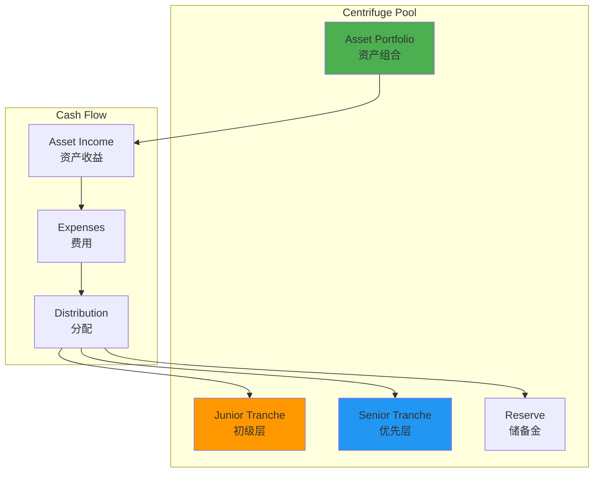
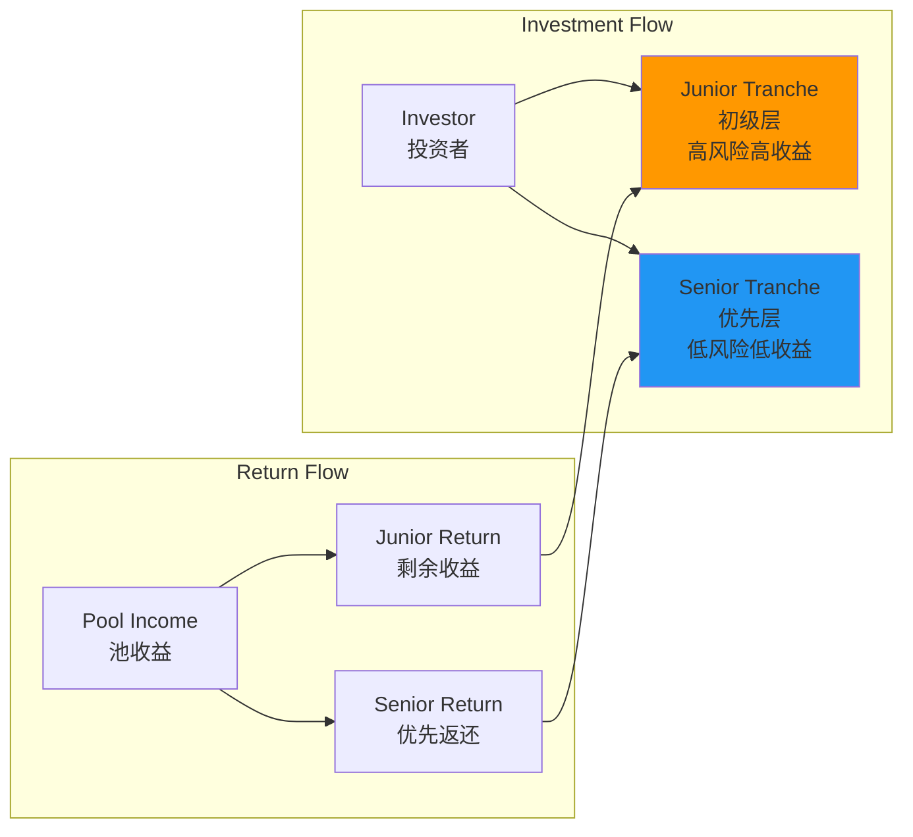
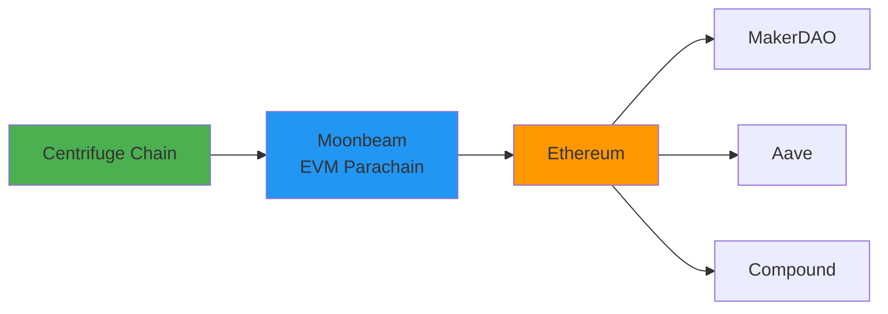
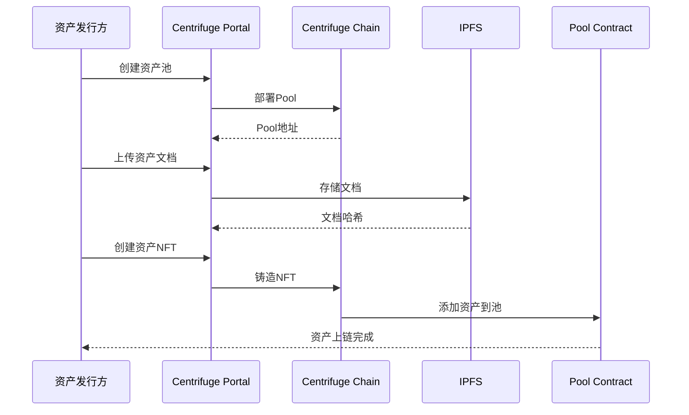
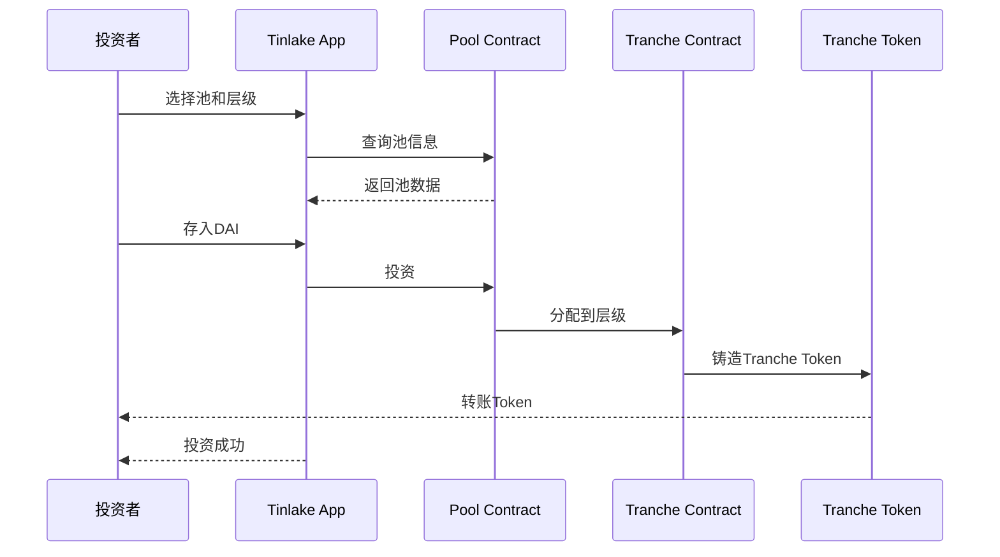
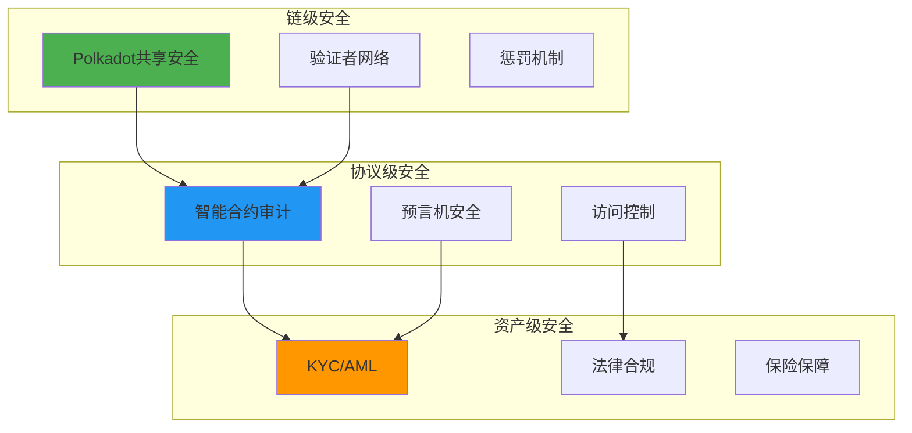

# Centrifuge 技术架构分析

**文档版本**: v1.0  
**创建时间**: 2025-10-09 09:41:35 CST  
**文档类型**: 技术架构分析  
**定位**: DeFi原生RWA协议

---

## 📑 目录

1. [系统整体架构](#1-系统整体架构)
2. [核心模块详解](#2-核心模块详解)
3. [技术选型分析](#3-技术选型分析)
4. [数据流程](#4-数据流程)
5. [安全架构](#5-安全架构)

---

## 1. 系统整体架构

### 1.1 Centrifuge 整体架构



### 1.2 核心组件说明

| 组件 | 职责 | 关键功能 |
|------|------|----------|
| **Pool Protocol** | 资产池管理 | 创建池、管理资产、收益分配 |
| **NFT Module** | 资产代币化 | 将RWA转换为NFT |
| **Tranche Module** | 分层投资 | Junior/Senior分层、风险分级 |
| **Pricing Oracle** | 资产定价 | NAV计算、实时估值 |
| **Substrate Framework** | 区块链基础 | Polkadot Parachain |

### 1.3 技术栈

**区块链层**：
- Substrate Framework（Polkadot生态）
- BABE + GRANDPA共识
- Polkadot中继链
- EVM桥接（Moonbeam）

**智能合约层**：
- Rust（Substrate Pallets）
- Solidity（EVM合约）
- Ink!（WASM合约）

**应用层**：
- React + TypeScript
- Polkadot.js API
- Ethers.js
- IPFS Client

---

## 2. 核心模块详解

### 2.1 Pool Protocol（资产池协议）

**池结构**：


**池参数**：
- **最低投资额**：通常$100-$1000
- **锁定期**：30-90天
- **目标收益率**：8%-12%
- **风险等级**：根据资产类型

**池类型**：

| 池类型 | 资产类别 | 目标收益 | 风险等级 |
|--------|---------|---------|---------|
| **Invoice Financing** | 应收账款 | 8-10% | 低-中 |
| **Real Estate** | 房地产 | 10-12% | 中 |
| **Trade Finance** | 贸易融资 | 9-11% | 中 |
| **Consumer Loans** | 消费贷款 | 12-15% | 中-高 |

### 2.2 NFT Module（资产NFT化）

**NFT结构**：
```solidity
// Centrifuge NFT结构（简化）
struct AssetNFT {
    uint256 tokenId;           // NFT ID
    bytes32 assetId;           // 资产ID
    address pool;              // 所属池
    uint256 value;             // 资产价值
    uint256 maturityDate;      // 到期日
    AssetStatus status;        // 资产状态
    bytes32 documentHash;      // 文档哈希（IPFS）
    AssetMetadata metadata;    // 元数据
}

struct AssetMetadata {
    string assetType;          // 资产类型
    string borrower;           // 借款人
    uint256 interestRate;      // 利率
    uint256 advanceRate;       // 预付率
    bytes32[] documents;       // 文档列表
}

enum AssetStatus {
    Active,        // 活跃
    Repaid,        // 已还款
    Defaulted,     // 违约
    Written Off    // 核销
}
```

**NFT生命周期**：
1. **创建**：资产发行方创建NFT
2. **融资**：NFT作为抵押品获得融资
3. **收益**：资产产生收益
4. **还款**：借款人还款
5. **赎回**：NFT被赎回或核销

### 2.3 Tranche Module（分层投资）

**分层结构**：


**分层特点**：

| 特性 | Junior Tranche | Senior Tranche |
|------|---------------|----------------|
| **风险** | 高 | 低 |
| **收益** | 高（15-20%） | 低（8-10%） |
| **优先级** | 后 | 先 |
| **损失承担** | 先承担 | 后承担 |
| **流动性** | 较低 | 较高 |

**收益分配顺序**：
1. 支付费用（管理费、服务费）
2. 支付Senior Tranche本金和利息
3. 支付Junior Tranche本金
4. 剩余收益归Junior Tranche

### 2.4 Pricing Oracle（定价预言机）

**NAV计算**：
```
NAV (Net Asset Value) = 资产总价值 - 负债总额

资产总价值 = Σ(单个资产价值)
单个资产价值 = 本金 + 应计利息 - 减值准备
```

**定价方法**：
- **Mark-to-Model**：基于模型定价
- **Mark-to-Market**：基于市场定价
- **Discounted Cash Flow**：现金流折现

**更新频率**：
- 每日更新NAV
- 实时更新资产状态
- 每周更新风险评级

---

## 3. 技术选型分析

### 3.1 为什么选择Polkadot Parachain

**优势**：
- ✅ **独立主权**：完全控制链的治理和升级
- ✅ **高性能**：1000+ TPS，满足RWA需求
- ✅ **互操作性**：通过XCM与其他Parachain通信
- ✅ **共享安全**：继承Polkadot中继链的安全性
- ✅ **定制化**：可以添加自定义Pallets

**Polkadot vs 其他方案**：

| 特性 | Polkadot Parachain | Ethereum L2 | Cosmos Chain |
|------|-------------------|-------------|--------------|
| 主权性 | ⭐⭐⭐⭐⭐ | ⭐⭐⭐ | ⭐⭐⭐⭐⭐ |
| 安全性 | ⭐⭐⭐⭐⭐ | ⭐⭐⭐⭐ | ⭐⭐⭐⭐ |
| 互操作性 | ⭐⭐⭐⭐⭐ | ⭐⭐⭐ | ⭐⭐⭐⭐ |
| 定制性 | ⭐⭐⭐⭐⭐ | ⭐⭐⭐ | ⭐⭐⭐⭐⭐ |
| 生态成熟度 | ⭐⭐⭐⭐ | ⭐⭐⭐⭐⭐ | ⭐⭐⭐⭐ |

### 3.2 Substrate Framework优势

**模块化设计**：
```
Substrate = Runtime + Pallets + Consensus + Networking

Runtime: 业务逻辑层
Pallets: 可插拔模块（如NFT、Pool、Tranche）
Consensus: 共识机制（BABE + GRANDPA）
Networking: P2P网络层
```

**自定义Pallets**：
- `pallet-pool`: 资产池管理
- `pallet-nft`: 资产NFT
- `pallet-tranche`: 分层投资
- `pallet-pricing`: 定价预言机

### 3.3 DeFi集成策略

**跨链桥接**：


**集成协议**：
- **MakerDAO**：RWA作为Maker抵押品
- **Aave**：流动性挖矿
- **Compound**：借贷集成

---

## 4. 数据流程

### 4.1 资产上链流程



### 4.2 投资流程



---

## 5. 安全架构

### 5.1 多层安全防护



### 5.2 风险管理

**风险类型**：
1. **信用风险**：借款人违约
2. **流动性风险**：无法及时赎回
3. **市场风险**：资产价值波动
4. **操作风险**：系统故障

**风险缓释措施**：
- ✅ 分层结构（Junior承担首损）
- ✅ 超额抵押
- ✅ 储备金机制
- ✅ 保险覆盖

---

## 📚 参考资源

- [Centrifuge官网](https://centrifuge.io)
- [Centrifuge文档](https://docs.centrifuge.io)
- [Substrate文档](https://docs.substrate.io)
- [Polkadot文档](https://wiki.polkadot.network)

---

**文档维护**: RWA-HUSD技术团队  
**最后更新**: 2025-10-09 09:41:35 CST
