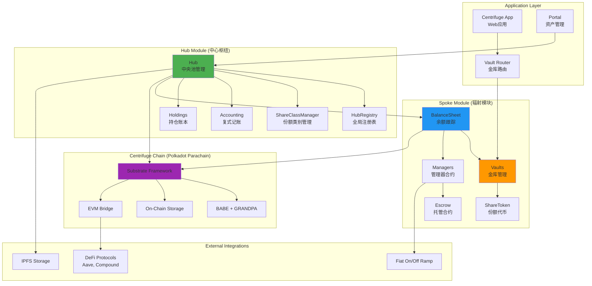
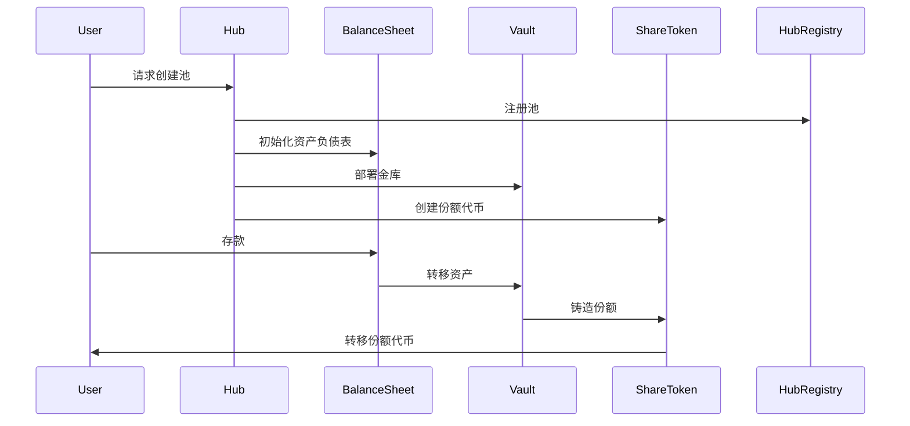
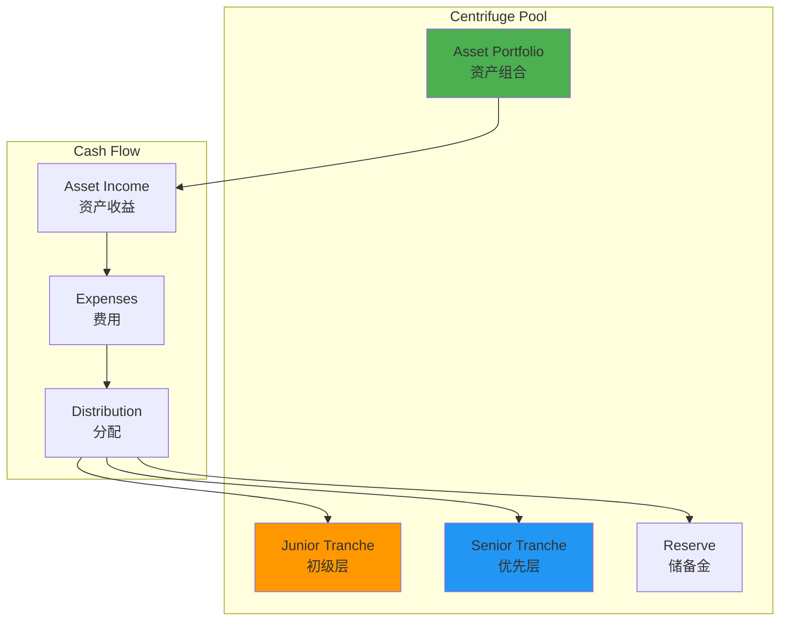
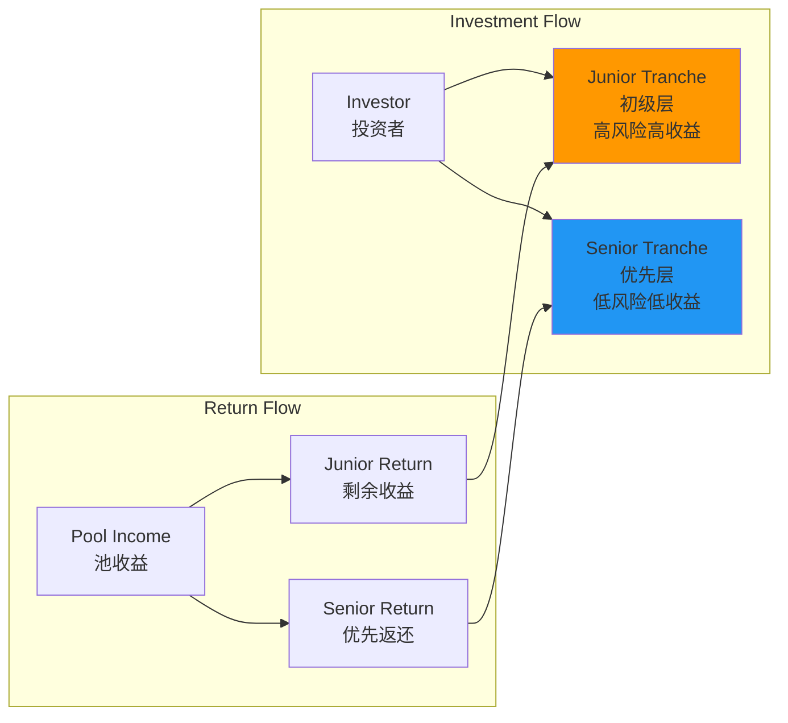
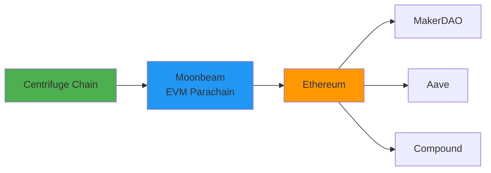
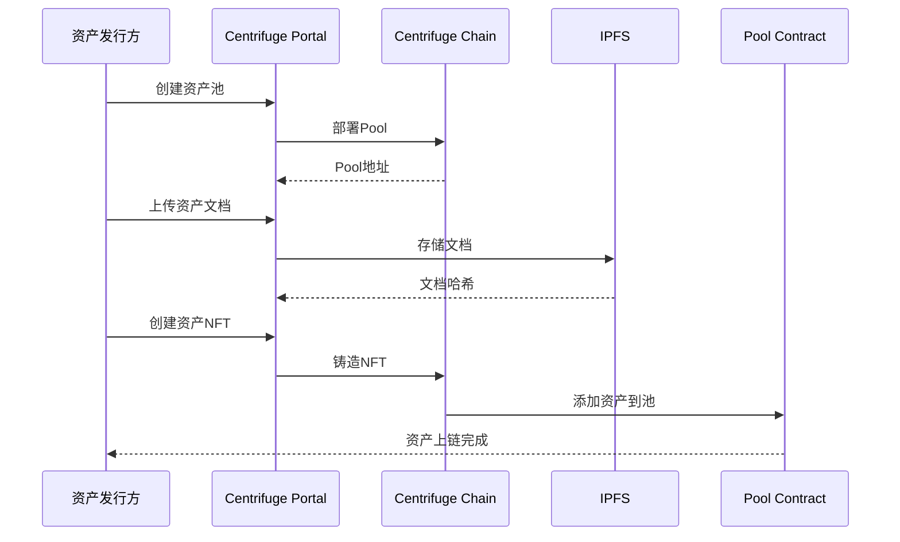
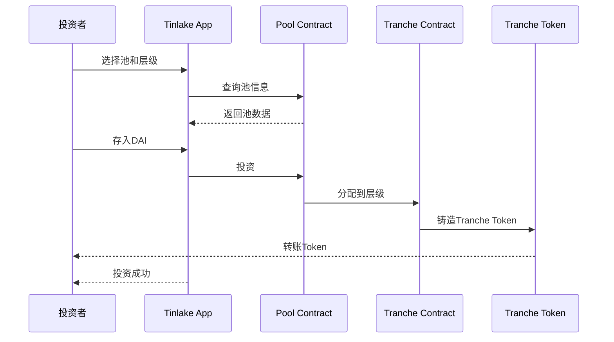
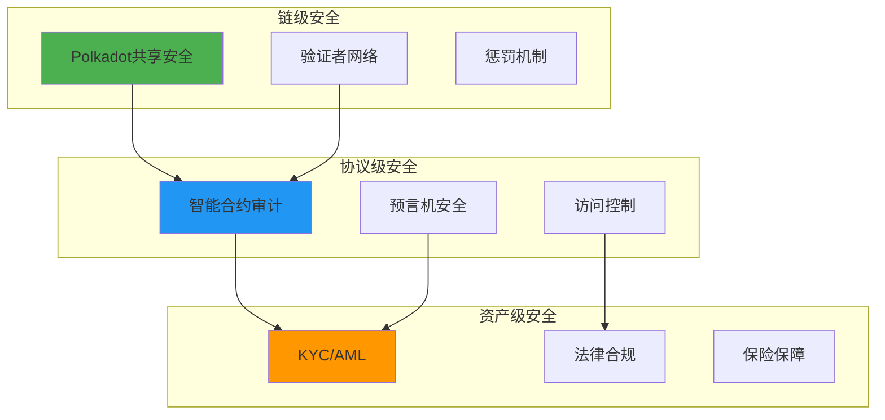

# Centrifuge 技术架构分析

**文档版本**: v2.0
**创建时间**: 2025-10-09 09:41:35 CST
**最后更新**: 2025-10-13 10:00:00 CST
**文档类型**: 技术架构分析
**定位**: DeFi 原生 RWA 协议

---

## 📑 目录

1. [系统整体架构](#1-系统整体架构)
2. [Hub/Spoke 双层架构](#2-hubspoke双层架构)
3. [核心模块详解](#3-核心模块详解)
4. [技术选型分析](#4-技术选型分析)
5. [数据流程](#5-数据流程)
6. [安全架构](#6-安全架构)

---

## 1. 系统整体架构

### 1.1 Centrifuge 整体架构(最新版)



### 1.2 核心组件说明(最新版)

| 组件                    | 职责         | 关键功能                         |
| ----------------------- | ------------ | -------------------------------- |
| **Hub**                 | 中央池管理   | 池创建、份额类别设置、元数据更新 |
| **HubRegistry**         | 全局注册表   | 池/资产/货币注册、唯一性保证     |
| **ShareClassManager**   | 份额类别管理 | Epoch 工作流、跨链状态管理       |
| **Accounting**          | 复式记账系统 | 借贷管理、账本平衡、审计追踪     |
| **Holdings**            | 持仓账本     | 余额跟踪、头寸管理、可追溯性     |
| **BalanceSheet**        | 余额跟踪     | 资产/份额余额、管理器授权        |
| **Vaults**              | 金库管理     | 资本分配、同步/异步操作          |
| **Managers**            | 管理器合约   | SyncManager、AsyncRequestManager |
| **Escrow**              | 托管合约     | 安全结算、池资产负债表           |
| **ShareToken**          | 份额代币     | ERC20+ERC1404、转账限制          |
| **Substrate Framework** | 区块链基础   | Polkadot Parachain               |

### 1.3 技术栈(最新版)

**区块链层**：

-   Substrate Framework（Polkadot 生态）
-   BABE + GRANDPA 共识
-   Polkadot 中继链
-   EVM 桥接（Moonbeam）

**智能合约层**：

-   Rust（Substrate Pallets）
-   Solidity（Hub/Spoke 合约）
-   Ink!（WASM 合约）

**标准支持**：

-   ERC-4626（同步金库）
-   ERC-7540（异步金库）
-   ERC-7575（多代币金库）
-   ERC-1404（转账限制）

**应用层**：

-   React + TypeScript
-   Polkadot.js API
-   ethers.js / viem
-   Ethers.js
-   IPFS Client

---

## 2. Hub/Spoke 双层架构

### 2.1 架构概述

Centrifuge 采用**Hub/Spoke 双层架构**,将系统分为两个主要层次:

-   **Hub 模块(中心枢纽)**: 负责中央管理、协调、会计和跨链状态管理
-   **Spoke 模块(辐射模块)**: 负责资产管理、金库操作和具体的业务逻辑

这种架构设计实现了:

-   **职责分离**: Hub 负责管理,Spoke 负责执行
-   **模块化**: 各模块独立,易于维护和升级
-   **可扩展性**: 支持跨链部署和多资产类型
-   **安全性**: 通过分层设计降低单点故障风险

---

### 2.2 Hub 模块(中心枢纽)

Hub 模块由**6 个核心智能合约**组成:

#### 2.2.1 Hub 合约

-   **职责**: 中央池管理合约
-   **功能**:
    -   聚合并暴露所有核心池功能
    -   管理 hub 管理员权限
    -   协调池创建、份额类别设置、元数据更新

#### 2.2.2 HubHelpers 合约

-   **职责**: Hub 合约的扩展
-   **功能**: 提供额外的辅助功能

#### 2.2.3 HubRegistry 合约

-   **职责**: 全局注册表
-   **功能**:
    -   存储所有池、资产和货币的注册信息
    -   提供规范查找接口
    -   确保系统范围内的唯一性和完整性

#### 2.2.4 Holdings 合约

-   **职责**: 持仓账本
-   **功能**:
    -   跟踪每个池的内部余额和头寸
    -   将每个持仓与唯一的会计 ID 关联

#### 2.2.5 Accounting 合约

-   **职责**: 复式记账系统
-   **功能**:
    -   管理会计 ID 之间的借方和贷方
    -   确保每个操作保持平衡的账本
    -   提供审计追踪和财务报告

#### 2.2.6 ShareClassManager 合约

-   **职责**: 份额类别管理
-   **功能**:
    -   处理基于 Epoch 的工作流
    -   生成份额类别 ID
    -   管理跨链状态

---

### 2.3 Spoke 模块(辐射模块)

Spoke 模块由**5 个核心组件**组成:

#### 2.3.1 BalanceSheet 合约

-   **职责**: 余额跟踪器
-   **功能**:
    -   跟踪资产和份额类别余额
    -   授权管理器合约与份额代币和金库交互
    -   协调链下证明验证和流动性桥接

#### 2.3.2 Vaults(金库)

-   **职责**: 资本分配策略管理
-   **类型**:
    -   **AsyncVault**: 完全异步金库(ERC-7540)
    -   **SyncDepositVault**: 混合金库(同步存款+异步赎回)

#### 2.3.3 Manager 合约

-   **职责**: 特殊管理器合约
-   **类型**:
    -   **SyncManager**: 处理同步操作(ERC-4626)
    -   **AsyncRequestManager**: 处理异步操作(ERC-7540)
    -   **OnOfframpManager**: 限制 on-offramp 交易
    -   **MerkleProofManager**: 与外部 DeFi 协议集成

#### 2.3.4 Escrow 合约

-   **职责**: 托管机制
-   **类型**:
    -   **Global Escrow**: 持有待处理请求
    -   **PoolEscrow**: 持有池的资产负债表

#### 2.3.5 ShareToken 合约

-   **职责**: 份额代币
-   **特性**:
    -   ERC20 标准实现
    -   ERC1404 兼容性(转账限制)
    -   支持多种限制类型

---

### 2.4 Hub/Spoke 交互流程



---

## 3. 核心模块详解

### 3.1 Pool Protocol（资产池协议）

**池结构**：



**池参数**：

-   **最低投资额**：通常$100-$1000
-   **锁定期**：30-90 天
-   **目标收益率**：8%-12%
-   **风险等级**：根据资产类型

**池类型**：

| 池类型                | 资产类别 | 目标收益 | 风险等级 |
| --------------------- | -------- | -------- | -------- |
| **Invoice Financing** | 应收账款 | 8-10%    | 低-中    |
| **Real Estate**       | 房地产   | 10-12%   | 中       |
| **Trade Finance**     | 贸易融资 | 9-11%    | 中       |
| **Consumer Loans**    | 消费贷款 | 12-15%   | 中-高    |

### 2.2 NFT Module（资产 NFT 化）

**NFT 结构**：

```solidity
// Centrifuge NFT结构（简化）
struct AssetNFT {
    uint256 tokenId;           // NFT ID
    bytes32 assetId;           // 资产ID
    address pool;              // 所属池
    uint256 value;             // 资产价值
    uint256 maturityDate;      // 到期日
    AssetStatus status;        // 资产状态
    bytes32 documentHash;      // 文档哈希（IPFS）
    AssetMetadata metadata;    // 元数据
}

struct AssetMetadata {
    string assetType;          // 资产类型
    string borrower;           // 借款人
    uint256 interestRate;      // 利率
    uint256 advanceRate;       // 预付率
    bytes32[] documents;       // 文档列表
}

enum AssetStatus {
    Active,        // 活跃
    Repaid,        // 已还款
    Defaulted,     // 违约
    Written Off    // 核销
}
```

**NFT 生命周期**：

1. **创建**：资产发行方创建 NFT
2. **融资**：NFT 作为抵押品获得融资
3. **收益**：资产产生收益
4. **还款**：借款人还款
5. **赎回**：NFT 被赎回或核销

### 2.3 Tranche Module（分层投资）

**分层结构**：



**分层特点**：

| 特性         | Junior Tranche | Senior Tranche |
| ------------ | -------------- | -------------- |
| **风险**     | 高             | 低             |
| **收益**     | 高（15-20%）   | 低（8-10%）    |
| **优先级**   | 后             | 先             |
| **损失承担** | 先承担         | 后承担         |
| **流动性**   | 较低           | 较高           |

**收益分配顺序**：

1. 支付费用（管理费、服务费）
2. 支付 Senior Tranche 本金和利息
3. 支付 Junior Tranche 本金
4. 剩余收益归 Junior Tranche

### 2.4 Pricing Oracle（定价预言机）

**NAV 计算**：

```
NAV (Net Asset Value) = 资产总价值 - 负债总额

资产总价值 = Σ(单个资产价值)
单个资产价值 = 本金 + 应计利息 - 减值准备
```

**定价方法**：

-   **Mark-to-Model**：基于模型定价
-   **Mark-to-Market**：基于市场定价
-   **Discounted Cash Flow**：现金流折现

**更新频率**：

-   每日更新 NAV
-   实时更新资产状态
-   每周更新风险评级

---

## 3. 技术选型分析

### 3.1 为什么选择 Polkadot Parachain

**优势**：

-   ✅ **独立主权**：完全控制链的治理和升级
-   ✅ **高性能**：1000+ TPS，满足 RWA 需求
-   ✅ **互操作性**：通过 XCM 与其他 Parachain 通信
-   ✅ **共享安全**：继承 Polkadot 中继链的安全性
-   ✅ **定制化**：可以添加自定义 Pallets

**Polkadot vs 其他方案**：

| 特性       | Polkadot Parachain | Ethereum L2 | Cosmos Chain |
| ---------- | ------------------ | ----------- | ------------ |
| 主权性     | ⭐⭐⭐⭐⭐         | ⭐⭐⭐      | ⭐⭐⭐⭐⭐   |
| 安全性     | ⭐⭐⭐⭐⭐         | ⭐⭐⭐⭐    | ⭐⭐⭐⭐     |
| 互操作性   | ⭐⭐⭐⭐⭐         | ⭐⭐⭐      | ⭐⭐⭐⭐     |
| 定制性     | ⭐⭐⭐⭐⭐         | ⭐⭐⭐      | ⭐⭐⭐⭐⭐   |
| 生态成熟度 | ⭐⭐⭐⭐           | ⭐⭐⭐⭐⭐  | ⭐⭐⭐⭐     |

### 3.2 Substrate Framework 优势

**模块化设计**：

```
Substrate = Runtime + Pallets + Consensus + Networking

Runtime: 业务逻辑层
Pallets: 可插拔模块（如NFT、Pool、Tranche）
Consensus: 共识机制（BABE + GRANDPA）
Networking: P2P网络层
```

**自定义 Pallets**：

-   `pallet-pool`: 资产池管理
-   `pallet-nft`: 资产 NFT
-   `pallet-tranche`: 分层投资
-   `pallet-pricing`: 定价预言机

### 3.3 DeFi 集成策略

**跨链桥接**：



**集成协议**：

-   **MakerDAO**：RWA 作为 Maker 抵押品
-   **Aave**：流动性挖矿
-   **Compound**：借贷集成

---

## 4. 数据流程

### 4.1 资产上链流程



### 4.2 投资流程



---

## 5. 安全架构

### 5.1 多层安全防护



### 5.2 风险管理

**风险类型**：

1. **信用风险**：借款人违约
2. **流动性风险**：无法及时赎回
3. **市场风险**：资产价值波动
4. **操作风险**：系统故障

**风险缓释措施**：

-   ✅ 分层结构（Junior 承担首损）
-   ✅ 超额抵押
-   ✅ 储备金机制
-   ✅ 保险覆盖

---

## 📚 参考资源

-   [Centrifuge 官网](https://centrifuge.io)
-   [Centrifuge 文档](https://docs.centrifuge.io)
-   [Substrate 文档](https://docs.substrate.io)
-   [Polkadot 文档](https://wiki.polkadot.network)

---

**文档维护**: RWA-HUSD 技术团队  
**最后更新**: 2025-10-09 09:41:35 CST
