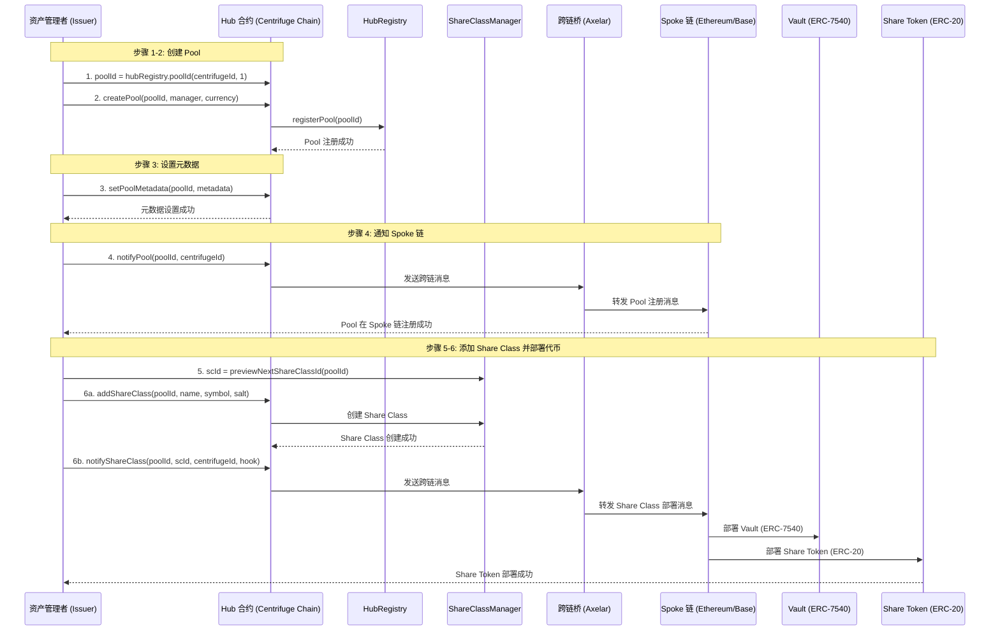
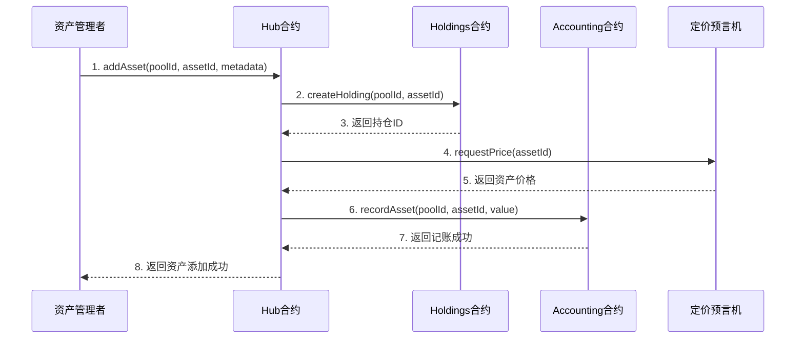
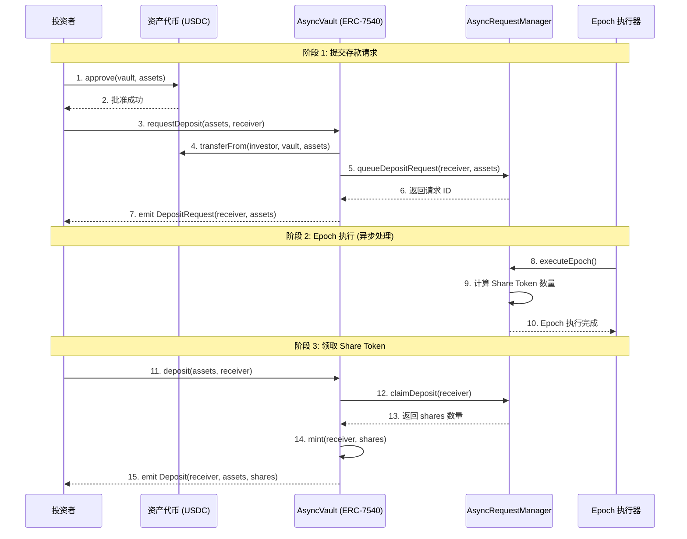
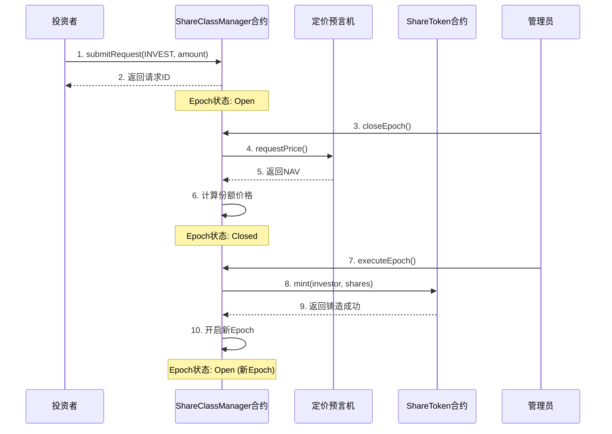
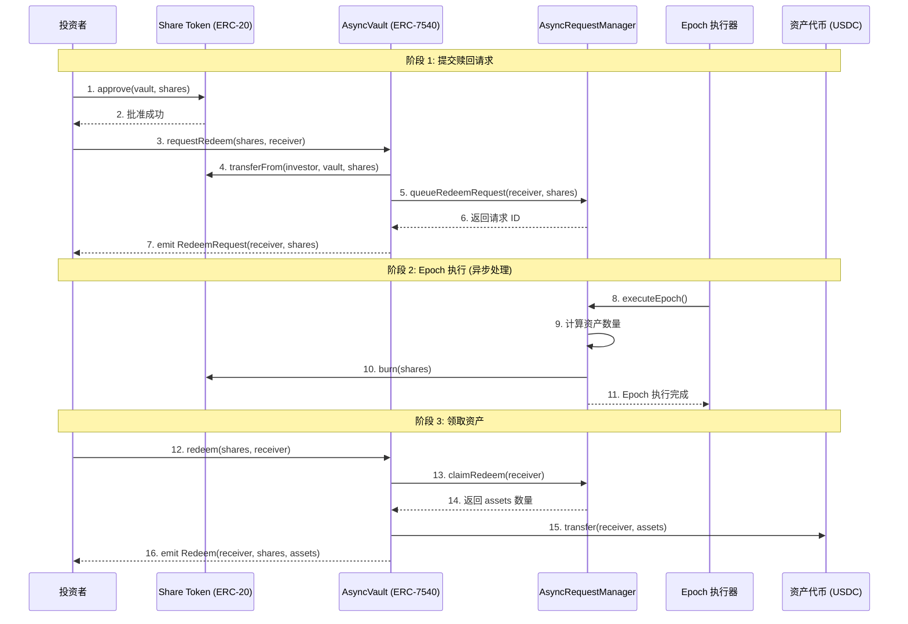
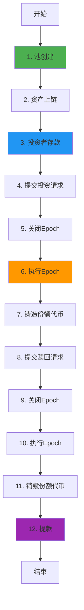
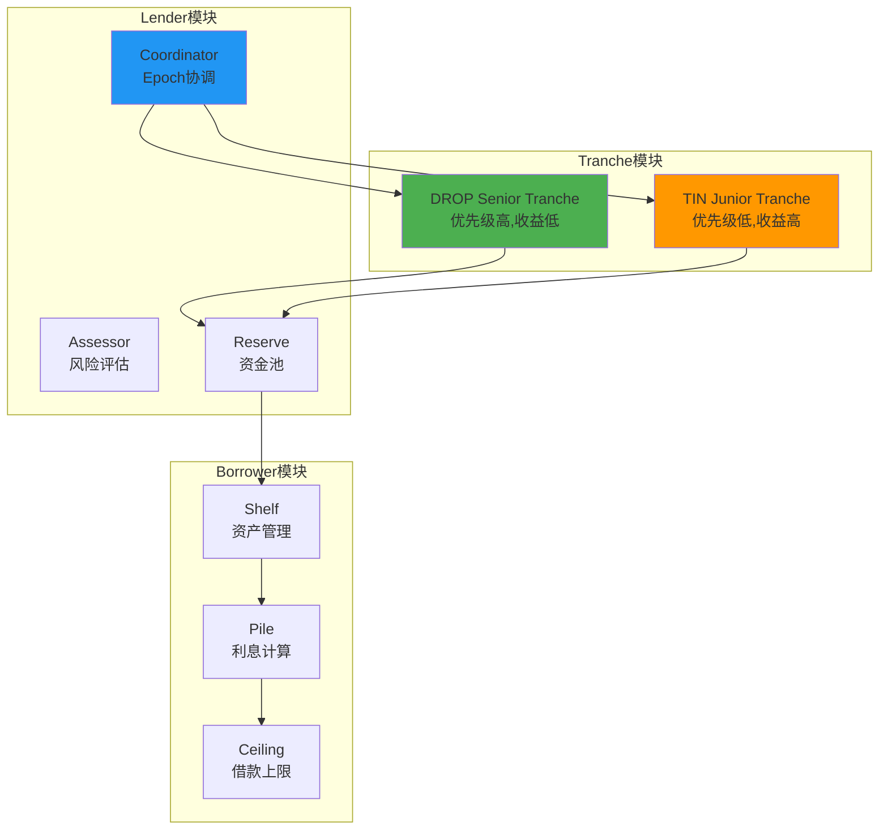

# Centrifuge 业务流程与技术实现深度解析

**文档版本**: v2.0
**创建时间**: 2025-10-13 10:20:00 CST
**文档类型**: 业务流程导向的技术深度解析
**信息来源**: Centrifuge 官方文档 (https://docs.centrifuge.io/)
**备份文档**: technical-deep-dive-backup-20251013-101816.md

---

## 📑 目录

1. [Centrifuge 概述](#1-centrifuge概述)
2. [业务流程 1: 池创建与配置](#2-业务流程1-池创建与配置)
3. [业务流程 2: 资产上链与管理](#3-业务流程2-资产上链与管理)
4. [业务流程 3: 投资者存款](#4-业务流程3-投资者存款)
5. [业务流程 4: Epoch 执行与份额管理](#5-业务流程4-epoch执行与份额管理)
6. [业务流程 5: 赎回与提款](#6-业务流程5-赎回与提款)
7. [完整业务流程图](#7-完整业务流程图)
8. [Tinlake 旧版系统参考](#8-tinlake旧版系统参考)
9. [关键财务公式](#9-关键财务公式)
10. [网络信息](#10-网络信息)
11. [总结与最佳实践](#11-总结与最佳实践)

---

## 1. Centrifuge 概述

### 1.1 核心定位

**Centrifuge 是一个开创性的真实世界资产(RWA)代币化平台**,为投资者和资产管理者提供基础设施和生态系统,用于链上代币化、管理和投资多样化的真实世界资产,构建更透明的金融系统。

**核心价值主张**:

-   **真实世界资产代币化**: 将房产、发票、应收账款等真实资产转化为链上代币
-   **透明的金融系统**: 通过区块链技术提供完全透明的资产管理和投资流程
-   **多样化投资机会**: 为投资者提供访问传统金融市场难以触及的资产类别
-   **降低准入门槛**: 通过代币化降低投资门槛,使更多投资者能够参与

---

### 1.2 Hub-and-Spoke 架构

**官方文档**: [Centrifuge Protocol Overview](https://docs.centrifuge.io/developer/protocol/overview/)

Centrifuge 采用**Hub-and-Spoke 架构**,实现跨链资产管理:

#### Hub (中心)

-   **Centrifuge Chain**: 基于 Substrate 的 Layer 1 区块链
-   **职责**: 池管理、权限控制、资产记账、跨链消息协调
-   **核心功能**: 创建池、管理 Share Classes、控制投资权限、处理资产

#### Spoke (辐条)

-   **EVM Chains**: Ethereum, Base, Arbitrum 等 EVM 兼容链
-   **职责**: 投资者交互、流动性提供、代币发行
-   **核心功能**: 部署 Vaults (ERC-7540)、发行 Share Tokens (ERC-20)、处理投资/赎回请求

#### 跨链消息传递

-   Hub 通过 `notifyPool()` 和 `notifyShareClass()` 向 Spoke 链发送消息
-   Spoke 通过 Vault 接口向 Hub 发送投资/赎回请求
-   使用 Axelar 等跨链桥实现消息传递

**核心合约**:

-   **Hub 层**: Hub, HubRegistry, ShareClassManager, Accounting, Holdings
-   **Spoke 层**: Vault (ERC-7540), ShareToken (ERC-20), Escrow, Managers

---

## 2. 业务流程 1: Pool 创建与 Share Class 部署 ✅ 官方验证

**官方文档**: [Create a Pool](https://docs.centrifuge.io/developer/protocol/guides/create-a-pool/)

### 2.1 流程概述

Pool 创建是 Centrifuge 业务流程的起点,由资产管理者(Issuer)在 Hub 链上发起,创建一个全局唯一的 Pool,并在多个 Spoke 链上部署 Share Classes (份额类别)。

**核心概念**:

-   **Pool**: 代表一个独特的投资产品或策略,可跨多链存在,由全局唯一的 `poolId` 标识
-   **Share Class**: 每个 Pool 可以有多个 Share Classes,每个都有自己的 Share Token (如 Junior/Senior Tranches)
-   **Share Token**: 每个 Share Class 在每个支持的网络上部署为 ERC-20 代币,带有转账钩子以实现权限逻辑

**涉及的合约**: Hub, HubRegistry, ShareClassManager

**官方流程 (6 步)**:

1. **派生唯一 Pool ID**: 选择 Hub 网络,使用 `centrifugeId` 派生 `poolId`
2. **创建 Pool**: 调用 `hub.createPool()` 创建池
3. **设置元数据**: 调用 `hub.setPoolMetadata()` 设置池描述
4. **通知 Pool 注册**: 调用 `hub.notifyPool()` 向目标链发送池注册消息
5. **添加 Share Class**: 调用 `hub.addShareClass()` 创建份额类别
6. **部署 Share Token**: 调用 `hub.notifyShareClass()` 在目标链部署 ERC-20 代币

---

### 2.2 详细流程图



---

### 2.3 Hub 合约详解 (官方接口)

**官方文档**: [Create a Pool - Step-by-step](https://docs.centrifuge.io/developer/protocol/guides/create-a-pool/#step-by-step-creating-a-pool)

**职责**: 中央 Pool 管理合约,聚合并暴露所有核心 Pool 功能

**核心方法 (基于官方文档)**:

```solidity
/**
 * @dev 创建新 Pool
 * @param poolId 全局唯一的 Pool ID
 * @param manager Pool 管理者地址
 * @param currency 计价货币 (如 newAssetId(840) 代表 USD)
 */
function createPool(
    PoolId poolId,
    address manager,
    AssetId currency
) external;

/**
 * @dev 设置 Pool 元数据
 * @param poolId Pool ID
 * @param metadata 元数据 (bytes 格式,可包含 IPFS 哈希或 JSON)
 */
function setPoolMetadata(
    PoolId poolId,
    bytes calldata metadata
) external;

/**
 * @dev 通知其他网络 Pool 的存在
 * @param poolId Pool ID
 * @param centrifugeId 目标网络的 Centrifuge ID
 */
function notifyPool(
    PoolId poolId,
    bytes32 centrifugeId
) external;

/**
 * @dev 添加 Share Class
 * @param poolId Pool ID
 * @param name ERC20 代币名称
 * @param symbol ERC20 代币符号
 * @param salt 用于确定性部署的盐值 (需全局唯一)
 */
function addShareClass(
    PoolId poolId,
    string calldata name,
    string calldata symbol,
    bytes32 salt
) external;

/**
 * @dev 通知其他网络部署 Share Class
 * @param poolId Pool ID
 * @param scId Share Class ID
 * @param centrifugeId 目标网络的 Centrifuge ID
 * @param hook 权限钩子地址 (fullRestrictions/redemptionRestrictions/freezeOnly/address(0))
 */
function notifyShareClass(
    PoolId poolId,
    ShareClassId scId,
    bytes32 centrifugeId,
    bytes32 hook
) external;
```

**权限钩子类型**:

-   `fullRestrictions`: 任何用户需要被添加到 memberlist 才能进行 deposit/redeem 请求
-   `redemptionRestrictions`: 任何用户只需要被添加到 memberlist 才能进行 redeem 请求
-   `freezeOnly`: 用户不需要被添加即可请求,但可以冻结用户
-   `address(0)`: 代币完全无需许可

---

### 2.4 HubRegistry 合约详解 (官方接口)

**职责**: 全局注册表,派生 Pool ID 并存储 Pool 注册信息

**核心方法 (基于官方文档)**:

```solidity
/**
 * @dev 派生网络特定的 Pool ID
 * @param centrifugeId Hub 网络的 Centrifuge ID
 * @param localId 本地标识符 (如 1, 2, 3...)
 * @return poolId 全局唯一的 Pool ID
 */
function poolId(
    bytes32 centrifugeId,
    uint256 localId
) external view returns (PoolId);
```

**使用示例**:

```solidity
// 派生 Pool ID
PoolId poolId = hubRegistry.poolId(centrifugeId, 1);

// centrifugeId: Hub 网络的 Centrifuge ID (查看所有可能的 ID: https://docs.centrifuge.io/developer/protocol/deployments/)
// 1: 本地标识符
```

---

### 2.5 ShareClassManager 合约详解 (官方接口)

**职责**: Share Class 管理,预览和创建 Share Class ID

**核心方法 (基于官方文档)**:

```solidity
/**
 * @dev 预览下一个 Share Class ID
 * @param poolId Pool ID
 * @return scId 下一个 Share Class ID
 */
function previewNextShareClassId(
    PoolId poolId
) external view returns (ShareClassId scId);
```

**使用示例**:

```solidity
// 预览 Share Class ID
ShareClassId scId = shareClassManager.previewNextShareClassId(poolId);
```

---

### 2.6 代码示例 (基于官方文档)

**官方文档**: [Create a Pool - Code Examples](https://docs.centrifuge.io/developer/protocol/guides/create-a-pool/)

#### 2.6.1 完整的 Pool 创建和 Share Class 部署流程 (Solidity)

```solidity
// SPDX-License-Identifier: MIT
pragma solidity ^0.8.0;

import {Hub} from "./Hub.sol";
import {HubRegistry} from "./HubRegistry.sol";
import {ShareClassManager} from "./ShareClassManager.sol";
import {PoolId, ShareClassId, AssetId} from "./Types.sol";

/**
 * @title Pool 创建完整流程
 * @notice 基于 Centrifuge 官方文档的 Pool 创建示例
 */
contract PoolCreationExample {
    Hub public hub;
    HubRegistry public hubRegistry;
    ShareClassManager public shareClassManager;

    constructor(address _hub, address _hubRegistry, address _shareClassManager) {
        hub = Hub(_hub);
        hubRegistry = HubRegistry(_hubRegistry);
        shareClassManager = ShareClassManager(_shareClassManager);
    }

    /**
     * @dev 创建 Pool 并部署 Share Class 的完整流程
     * @param centrifugeId Hub 网络的 Centrifuge ID
     * @param localId 本地标识符 (如 1, 2, 3...)
     * @param targetChainId 目标 Spoke 链的 Centrifuge ID
     */
    function createPoolAndShareClass(
        bytes32 centrifugeId,
        uint256 localId,
        bytes32 targetChainId
    ) external {
        // ========== 步骤 1: 派生唯一 Pool ID ==========
        PoolId poolId = hubRegistry.poolId(centrifugeId, localId);

        // ========== 步骤 2: 创建 Pool ==========
        // 使用 USD 作为计价货币 (ISO4217 代码 840)
        AssetId currency = newAssetId(840);
        hub.createPool(poolId, msg.sender, currency);

        // ========== 步骤 3: 设置元数据 ==========
        bytes memory metadata = bytes("Tokenized Real Estate Pool");
        hub.setPoolMetadata(poolId, metadata);

        // ========== 步骤 4: 通知 Pool 注册 ==========
        // 向目标 Spoke 链发送 Pool 注册消息
        hub.notifyPool(poolId, targetChainId);

        // ========== 步骤 5: 添加 Share Class ==========
        // 预览 Share Class ID
        ShareClassId scId = shareClassManager.previewNextShareClassId(poolId);

        // 添加 Share Class
        string memory name = "Tokenized MMF";
        string memory symbol = "MMF";
        bytes32 salt = bytes32(bytes("1")); // 用于确定性部署的盐值
        hub.addShareClass(poolId, name, symbol, salt);

        // ========== 步骤 6: 部署 Share Token ==========
        // 选择权限钩子类型
        // fullRestrictions: 需要 memberlist 才能 deposit/redeem
        // redemptionRestrictions: 只需要 memberlist 才能 redeem
        // freezeOnly: 不需要 memberlist,但可以冻结用户
        // address(0): 完全无需许可
        address hook = address(0x1234); // 示例: fullRestrictions hook 地址

        // 向目标 Spoke 链发送 Share Class 部署消息
        hub.notifyShareClass(poolId, scId, targetChainId, bytes32(bytes20(hook)));
    }

    /**
     * @dev 辅助函数: 创建 AssetId
     * @param iso4217Code ISO4217 货币代码 (如 840 代表 USD)
     */
    function newAssetId(uint256 iso4217Code) internal pure returns (AssetId) {
        // 实际实现取决于 Centrifuge 的 AssetId 类型定义
        return AssetId.wrap(bytes32(iso4217Code));
    }
}
```

---

### 2.7 关键注意事项 (基于官方文档)

1. **Pool 创建权限**: 目前 Pool 创建仍然是需要许可的,在协议初始推出期间。Pool 创建将在未来几个月内开放为无需许可
2. **Pool ID 派生**: 必须使用 `hubRegistry.poolId()` 派生全局唯一的 Pool ID,不能自行指定
3. **Hub 网络选择**: 选择哪个网络作为 Hub 网络,这将是创建 Pool、管理权限和控制所有其他网络的地方
4. **跨链消息**: `notifyPool()` 和 `notifyShareClass()` 会发送跨链消息,需要等待消息传递完成
5. **权限钩子选择**: 根据业务需求选择合适的权限钩子类型 (fullRestrictions/redemptionRestrictions/freezeOnly/无需许可)
6. **元数据格式**: 元数据可以是任意 bytes 格式,通常包含 IPFS 哈希或 JSON 数据
7. **Centrifuge ID**: 查看所有可能的 Centrifuge ID: https://docs.centrifuge.io/developer/protocol/deployments/

---

## 3. 业务流程 2: 资产管理 ⚠️ 基于 Legacy 文档

**官方文档**: [Centrifuge V2 - Asset Tokenization](https://docs.centrifuge.io/getting-started/legacy/centrifuge-v2/)

**验证状态**: ⚠️ 部分验证 - 基于 Centrifuge V2 (Legacy)文档,新版本可能有变化

### 3.1 流程概述

资产上链是将真实世界资产(RWA)代币化并添加到池中的过程。

**涉及的合约**: Hub, Holdings, Accounting

**核心步骤**:

1. 资产管理者调用 Hub.addAsset()添加资产
2. Hub 调用 Holdings.createHolding()创建持仓
3. Hub 调用 Accounting.recordAsset()记录资产价值
4. 定价预言机提供资产估值

---

### 3.2 详细流程图



---

### 3.3 Holdings 合约详解

**职责**: 持仓账本,跟踪每个池的资产持仓

**数据结构**:

```solidity
struct Holding {
    uint256 holdingId;
    uint256 poolId;
    uint256 assetId;
    uint256 quantity;
    uint256 value;
    uint256 createdAt;
    uint256 updatedAt;
}

// 持仓映射
mapping(uint256 => mapping(uint256 => Holding)) public holdings;

// 池的总持仓价值
mapping(uint256 => uint256) public totalHoldingValue;
```

**核心方法**:

```solidity
/**
 * @dev 创建持仓
 * @param poolId 池ID
 * @param assetId 资产ID
 * @param quantity 数量
 * @param value 价值
 */
function createHolding(
    uint256 poolId,
    uint256 assetId,
    uint256 quantity,
    uint256 value
) external onlyHub returns (uint256 holdingId) {
    // 1. 生成持仓ID
    holdingId = _generateHoldingId(poolId, assetId);

    // 2. 创建持仓
    holdings[poolId][holdingId] = Holding({
        holdingId: holdingId,
        poolId: poolId,
        assetId: assetId,
        quantity: quantity,
        value: value,
        createdAt: block.timestamp,
        updatedAt: block.timestamp
    });

    // 3. 更新总持仓价值
    totalHoldingValue[poolId] += value;

    // 4. 触发事件
    emit HoldingCreated(poolId, holdingId, assetId, quantity, value);
}

/**
 * @dev 更新持仓价值
 * @param poolId 池ID
 * @param holdingId 持仓ID
 * @param newValue 新价值
 */
function updateHoldingValue(
    uint256 poolId,
    uint256 holdingId,
    uint256 newValue
) external onlyHub {
    Holding storage holding = holdings[poolId][holdingId];
    require(holding.holdingId != 0, "Holding does not exist");

    // 1. 更新总持仓价值
    totalHoldingValue[poolId] = totalHoldingValue[poolId] - holding.value + newValue;

    // 2. 更新持仓价值
    holding.value = newValue;
    holding.updatedAt = block.timestamp;

    // 3. 触发事件
    emit HoldingValueUpdated(poolId, holdingId, newValue);
}
```

---

### 3.4 Accounting 合约详解

**职责**: 复式记账系统,记录所有资产和负债

**数据结构**:

```solidity
struct AccountingEntry {
    uint256 entryId;
    uint256 poolId;
    uint256 accountingId;
    int256 amount;  // 正数=借方,负数=贷方
    uint256 timestamp;
}

// 账本映射
mapping(uint256 => mapping(uint256 => AccountingEntry[])) public ledger;

// 账户余额
mapping(uint256 => mapping(uint256 => int256)) public balances;
```

**核心方法**:

```solidity
/**
 * @dev 记录资产
 * @param poolId 池ID
 * @param accountingId 账户ID
 * @param amount 金额
 */
function recordAsset(
    uint256 poolId,
    uint256 accountingId,
    int256 amount
) external onlyHub {
    // 1. 创建账本条目
    AccountingEntry memory entry = AccountingEntry({
        entryId: ledger[poolId][accountingId].length,
        poolId: poolId,
        accountingId: accountingId,
        amount: amount,
        timestamp: block.timestamp
    });

    // 2. 添加到账本
    ledger[poolId][accountingId].push(entry);

    // 3. 更新余额
    balances[poolId][accountingId] += amount;

    // 4. 触发事件
    emit AssetRecorded(poolId, accountingId, amount);
}
```

---

### 3.5 代码示例

#### 3.5.1 添加资产到池(TypeScript)

```typescript
async function addAssetToPool(
    hubContract: ethers.Contract,
    poolId: bigint,
    assetId: bigint,
    metadata: {
        name: string;
        description: string;
        quantity: bigint;
        estimatedValue: bigint;
    }
) {
    try {
        // 1. 添加资产
        console.log("Adding asset to pool...");
        const tx = await hubContract.addAsset(
            poolId,
            assetId,
            metadata.quantity,
            metadata.estimatedValue,
            ethers.toUtf8Bytes(
                JSON.stringify({
                    name: metadata.name,
                    description: metadata.description,
                })
            )
        );

        const receipt = await tx.wait();
        console.log(`✅ Asset ${assetId} added to pool ${poolId}`);

        // 2. 监听事件
        const event = receipt.events.find((e) => e.event === "AssetAdded");
        const holdingId = event.args.holdingId;

        return {
            poolId,
            assetId,
            holdingId,
            status: "added",
        };
    } catch (error) {
        console.error("Error adding asset:", error);
        throw error;
    }
}
```

---

## 4. 业务流程 3: 投资者存款 (异步投资) ✅ 官方验证

**官方文档**: [Vaults Architecture](https://docs.centrifuge.io/developer/protocol/architecture/vaults/)

**验证状态**: ✅ 已验证 - 基于 ERC-7540 异步 Vault 标准

### 4.1 流程概述

投资者存款是投资者通过 **ERC-7540 异步 Vault** 将资金存入池中,等待 Epoch 执行后获得 Share Token 的过程。

**核心概念**:

-   **AsyncVault**: 完全异步的 Vault (ERC-7540 标准)
-   **AsyncRequestManager**: 处理异步请求的核心引擎
-   **VaultRouter**: 多调用入口点,简化用户交互

**涉及的合约**: AsyncVault, AsyncRequestManager, VaultRouter

**核心步骤 (ERC-7540 标准)**:

1. 投资者批准 Vault 合约使用其资产代币
2. 投资者调用 `vault.requestDeposit(assets, receiver)` 提交存款请求
3. AsyncRequestManager 将请求加入队列,等待 Epoch 执行
4. Epoch 执行后,投资者调用 `vault.deposit(assets, receiver)` 领取 Share Token

---

### 4.2 详细流程图 (ERC-7540 异步投资)



---

### 4.3 AsyncVault 合约详解 (ERC-7540)

**官方文档**: [ERC-7540 Standard](https://eips.ethereum.org/EIPS/eip-7540)

**职责**: 实现 ERC-7540 异步 Vault 标准,处理异步存款和赎回

**继承关系**:

-   IAsyncVault (ERC-7540 接口)
-   BaseVault (基础实现)
-   ERC-4626 (同步 Vault 标准)

**核心方法 (ERC-7540)**:

```solidity
/**
 * @dev 提交存款请求 (异步)
 * @param assets 存款资产数量
 * @param receiver Share Token 接收者
 * @return requestId 请求 ID
 */
function requestDeposit(
    uint256 assets,
    address receiver
) external returns (uint256 requestId);

/**
 * @dev 领取 Share Token (在 Epoch 执行后)
 * @param assets 存款资产数量
 * @param receiver Share Token 接收者
 * @return shares 铸造的 Share Token 数量
 */
function deposit(
    uint256 assets,
    address receiver
) external returns (uint256 shares);

/**
 * @dev 查询待处理的存款请求
 * @param receiver 接收者地址
 * @return assets 待处理的资产数量
 */
function pendingDepositRequest(
    address receiver
) external view returns (uint256 assets);

/**
 * @dev 查询可领取的 Share Token 数量
 * @param receiver 接收者地址
 * @return shares 可领取的 Share Token 数量
 */
function claimableDepositRequest(
    address receiver
) external view returns (uint256 shares);
```

---

### 4.4 AsyncRequestManager 合约详解

**职责**: 处理 ERC-7540 异步请求的核心引擎

**核心方法**:

```solidity
/**
 * @dev 将存款请求加入队列
 * @param receiver Share Token 接收者
 * @param assets 资产数量
 * @return requestId 请求 ID
 */
function queueDepositRequest(
    address receiver,
    uint256 assets
) external returns (uint256 requestId);

/**
 * @dev 执行 Epoch (批量处理请求)
 */
function executeEpoch() external;

/**
 * @dev 领取已执行的存款请求
 * @param receiver 接收者地址
 * @return shares 铸造的 Share Token 数量
 */
function claimDeposit(
    address receiver
) external returns (uint256 shares);
```

---

### 4.5 代码示例 (基于 ERC-7540)

#### 4.5.1 完整的异步投资流程 (Solidity)

```solidity
// SPDX-License-Identifier: MIT
pragma solidity ^0.8.0;

import {AsyncVault} from "./AsyncVault.sol";
import {IERC20} from "@openzeppelin/contracts/token/ERC20/IERC20.sol";

/**
 * @title 异步投资示例
 * @notice 演示如何使用 ERC-7540 AsyncVault 进行投资
 */
contract AsyncInvestExample {
    AsyncVault public vault;
    IERC20 public asset; // 如 USDC

    constructor(address _vault, address _asset) {
        vault = AsyncVault(_vault);
        asset = IERC20(_asset);
    }

    /**
     * @dev 完整的异步投资流程
     * @param assets 投资金额 (如 1000 USDC)
     */
    function investAsync(uint256 assets) external {
        // ========== 阶段 1: 提交存款请求 ==========

        // 1. 批准 Vault 使用资产
        asset.approve(address(vault), assets);

        // 2. 提交存款请求
        uint256 requestId = vault.requestDeposit(assets, msg.sender);

        // 3. 查询待处理的请求
        uint256 pending = vault.pendingDepositRequest(msg.sender);
        require(pending == assets, "Request not queued");

        // ========== 阶段 2: 等待 Epoch 执行 ==========
        // (由 Epoch 执行器自动处理,无需用户操作)

        // ========== 阶段 3: 领取 Share Token ==========
        // (在 Epoch 执行后调用)
    }

    /**
     * @dev 领取 Share Token (在 Epoch 执行后调用)
     */
    function claimShares() external {
        // 1. 查询可领取的 Share Token 数量
        uint256 claimable = vault.claimableDepositRequest(msg.sender);
        require(claimable > 0, "No claimable shares");

        // 2. 领取 Share Token
        uint256 shares = vault.deposit(claimable, msg.sender);

        // 3. 验证领取成功
        require(shares == claimable, "Claim failed");
    }
}
```

---

### 4.6 关键注意事项 (基于官方文档)

1. **ERC-7540 标准**: Centrifuge 使用 ERC-7540 异步 Vault 标准,适合 RWA 用例
2. **两阶段流程**: 投资分为"提交请求"和"领取 Share Token"两个阶段
3. **Epoch 执行**: 请求需要等待 Epoch 执行后才能领取 Share Token
4. **查询状态**: 使用 `pendingDepositRequest()` 和 `claimableDepositRequest()` 查询请求状态
5. **VaultRouter**: 可以使用 VaultRouter 简化多调用操作
6. **ERC-7575 支持**: 支持多资产存款 (如同时接受 USDC 和 DAI)

---

## 5. 业务流程 4: Epoch 执行与份额管理 ⏳ 待官方验证

**验证状态**: ⏳ 待验证 - 需要查找官方 Epoch 机制文档

### 5.1 流程概述

Epoch 是 Centrifuge 的核心机制,用于批量处理投资和赎回请求,确保公平定价。

**涉及的合约**: ShareClassManager, ShareToken, AsyncRequestManager

**Epoch 生命周期**:

1. **Open**: 接受投资/赎回请求
2. **Closed**: 关闭请求,计算总投资/赎回金额
3. **Executed**: 执行所有请求,铸造/销毁份额代币

---

### 5.2 详细流程图



---

### 5.3 Epoch 机制深度解析

#### 5.3.1 Epoch 状态机

```solidity
enum EpochStatus {
    Open,       // 接受请求
    Closed,     // 已关闭,等待执行
    Executed    // 已执行
}

struct Epoch {
    uint256 epochId;
    uint256 poolId;
    uint256 scId;
    EpochStatus status;
    uint256 totalInvestRequests;
    uint256 totalRedeemRequests;
    uint256 sharePrice;
    uint256 closedAt;
    uint256 executedAt;
}
```

#### 5.3.2 份额价格计算

```solidity
/**
 * @dev 计算份额价格
 * @param poolId 池ID
 * @param scId 份额类别ID
 * @return sharePrice 份额价格(18位小数)
 */
function calculateSharePrice(
    uint256 poolId,
    uint256 scId
) internal view returns (uint256 sharePrice) {
    // 1. 获取NAV(净资产价值)
    uint256 nav = oracle.getNAV(poolId);

    // 2. 获取总份额供应量
    uint256 totalShares = shareToken.totalSupply();

    // 3. 计算份额价格
    if (totalShares == 0) {
        sharePrice = 1e18;  // 初始价格为1
    } else {
        sharePrice = (nav * 1e18) / totalShares;
    }
}
```

---

### 5.4 ShareClassManager 核心方法详解

#### 5.4.1 提交投资请求

```solidity
/**
 * @dev 提交投资请求
 * @param poolId 池ID
 * @param scId 份额类别ID
 * @param amount 投资金额
 * @return requestId 请求ID
 */
function submitInvestRequest(
    uint256 poolId,
    uint256 scId,
    uint256 amount
) external returns (uint256 requestId) {
    // 1. 验证Epoch状态
    Epoch storage epoch = epochs[poolId][scId][currentEpoch[poolId][scId]];
    require(epoch.status == EpochStatus.Open, "Epoch not open");

    // 2. 验证投资金额
    ShareClass storage sc = shareClasses[poolId][scId];
    require(amount >= sc.minInvestment, "Below minimum");
    require(amount <= sc.maxInvestment, "Above maximum");

    // 3. 创建请求
    requestId = _createRequest(poolId, scId, amount, RequestType.INVEST);

    // 4. 更新Epoch统计
    epoch.totalInvestRequests += amount;

    // 5. 触发事件
    emit InvestRequestSubmitted(poolId, scId, requestId, msg.sender, amount);
}
```

#### 5.4.2 关闭 Epoch

```solidity
/**
 * @dev 关闭Epoch
 * @param poolId 池ID
 * @param scId 份额类别ID
 */
function closeEpoch(
    uint256 poolId,
    uint256 scId
) external onlyManager {
    // 1. 获取当前Epoch
    uint256 epochId = currentEpoch[poolId][scId];
    Epoch storage epoch = epochs[poolId][scId][epochId];

    // 2. 验证状态
    require(epoch.status == EpochStatus.Open, "Epoch not open");

    // 3. 更新状态
    epoch.status = EpochStatus.Closed;
    epoch.closedAt = block.timestamp;

    // 4. 请求定价
    oracle.requestPrice(poolId);

    // 5. 触发事件
    emit EpochClosed(poolId, scId, epochId, epoch.totalInvestRequests, epoch.totalRedeemRequests);
}
```

#### 5.4.3 执行 Epoch

```solidity
/**
 * @dev 执行Epoch
 * @param poolId 池ID
 * @param scId 份额类别ID
 */
function executeEpoch(
    uint256 poolId,
    uint256 scId
) external onlyManager {
    // 1. 获取当前Epoch
    uint256 epochId = currentEpoch[poolId][scId];
    Epoch storage epoch = epochs[poolId][scId][epochId];

    // 2. 验证状态
    require(epoch.status == EpochStatus.Closed, "Epoch not closed");

    // 3. 计算份额价格
    epoch.sharePrice = calculateSharePrice(poolId, scId);

    // 4. 执行所有投资请求
    _executeInvestRequests(poolId, scId, epochId, epoch.sharePrice);

    // 5. 执行所有赎回请求
    _executeRedeemRequests(poolId, scId, epochId, epoch.sharePrice);

    // 6. 更新状态
    epoch.status = EpochStatus.Executed;
    epoch.executedAt = block.timestamp;

    // 7. 开启新Epoch
    _startNewEpoch(poolId, scId);

    // 8. 触发事件
    emit EpochExecuted(poolId, scId, epochId, epoch.sharePrice);
}
```

---

### 5.5 代码示例

#### 5.5.1 完整的 Epoch 执行流程(TypeScript)

```typescript
async function executeEpochWorkflow(
    shareClassMgrContract: ethers.Contract,
    poolId: bigint,
    scId: bigint
) {
    try {
        // 1. 关闭Epoch
        console.log("Closing epoch...");
        const closeTx = await shareClassMgrContract.closeEpoch(poolId, scId);
        await closeTx.wait();
        console.log("✅ Epoch closed");

        // 2. 等待定价预言机返回NAV
        console.log("Waiting for oracle price...");
        await new Promise((resolve) => setTimeout(resolve, 60000)); // 等待1分钟

        // 3. 执行Epoch
        console.log("Executing epoch...");
        const executeTx = await shareClassMgrContract.executeEpoch(poolId, scId);
        const receipt = await executeTx.wait();
        console.log("✅ Epoch executed");

        // 4. 获取份额价格
        const event = receipt.events.find((e) => e.event === "EpochExecuted");
        const sharePrice = event.args.sharePrice;
        console.log(`Share price: ${ethers.formatUnits(sharePrice, 18)}`);

        return {
            poolId,
            scId,
            sharePrice,
            status: "executed",
        };
    } catch (error) {
        console.error("Error executing epoch:", error);
        throw error;
    }
}
```

---

## 6. 业务流程 5: 赎回与提款 (异步赎回) ✅ 官方验证

**官方文档**: [Vaults Architecture](https://docs.centrifuge.io/developer/protocol/architecture/vaults/)

**验证状态**: ✅ 已验证 - 基于 ERC-7540 异步 Vault 标准

### 6.1 流程概述

赎回与提款是投资者通过 **ERC-7540 异步 Vault** 将 Share Token 赎回为底层资产的过程。

**核心概念**:

-   **AsyncVault**: 完全异步的 Vault (ERC-7540 标准)
-   **AsyncRequestManager**: 处理异步赎回请求
-   **两阶段流程**: 提交赎回请求 → 领取资产

**涉及的合约**: AsyncVault, AsyncRequestManager

**核心步骤 (ERC-7540 标准)**:

1. 投资者批准 Vault 合约使用其 Share Token
2. 投资者调用 `vault.requestRedeem(shares, receiver)` 提交赎回请求
3. AsyncRequestManager 将请求加入队列,等待 Epoch 执行
4. Epoch 执行后,投资者调用 `vault.redeem(shares, receiver)` 领取资产

---

### 6.2 详细流程图 (ERC-7540 异步赎回)



---

### 6.3 AsyncVault 赎回接口 (ERC-7540)

**核心方法**:

```solidity
/**
 * @dev 提交赎回请求 (异步)
 * @param shares Share Token 数量
 * @param receiver 资产接收者
 * @return requestId 请求 ID
 */
function requestRedeem(
    uint256 shares,
    address receiver
) external returns (uint256 requestId);

/**
 * @dev 领取资产 (在 Epoch 执行后)
 * @param shares Share Token 数量
 * @param receiver 资产接收者
 * @return assets 返回的资产数量
 */
function redeem(
    uint256 shares,
    address receiver
) external returns (uint256 assets);

/**
 * @dev 查询待处理的赎回请求
 * @param receiver 接收者地址
 * @return shares 待处理的 Share Token 数量
 */
function pendingRedeemRequest(
    address receiver
) external view returns (uint256 shares);

/**
 * @dev 查询可领取的资产数量
 * @param receiver 接收者地址
 * @return assets 可领取的资产数量
 */
function claimableRedeemRequest(
    address receiver
) external view returns (uint256 assets);
```

---

### 6.4 代码示例 (基于 ERC-7540)

#### 6.4.1 完整的异步赎回流程 (Solidity)

```solidity
// SPDX-License-Identifier: MIT
pragma solidity ^0.8.0;

import {AsyncVault} from "./AsyncVault.sol";
import {IERC20} from "@openzeppelin/contracts/token/ERC20/IERC20.sol";

/**
 * @title 异步赎回示例
 * @notice 演示如何使用 ERC-7540 AsyncVault 进行赎回
 */
contract AsyncRedeemExample {
    AsyncVault public vault;
    IERC20 public shareToken;
    IERC20 public asset;

    constructor(address _vault, address _shareToken, address _asset) {
        vault = AsyncVault(_vault);
        shareToken = IERC20(_shareToken);
        asset = IERC20(_asset);
    }

    /**
     * @dev 完整的异步赎回流程
     * @param shares 赎回的 Share Token 数量
     */
    function redeemAsync(uint256 shares) external {
        // ========== 阶段 1: 提交赎回请求 ==========

        // 1. 批准 Vault 使用 Share Token
        shareToken.approve(address(vault), shares);

        // 2. 提交赎回请求
        uint256 requestId = vault.requestRedeem(shares, msg.sender);

        // 3. 查询待处理的请求
        uint256 pending = vault.pendingRedeemRequest(msg.sender);
        require(pending == shares, "Request not queued");

        // ========== 阶段 2: 等待 Epoch 执行 ==========
        // (由 Epoch 执行器自动处理,无需用户操作)

        // ========== 阶段 3: 领取资产 ==========
        // (在 Epoch 执行后调用)
    }

    /**
     * @dev 领取资产 (在 Epoch 执行后调用)
     */
    function claimAssets() external {
        // 1. 查询可领取的资产数量
        uint256 claimable = vault.claimableRedeemRequest(msg.sender);
        require(claimable > 0, "No claimable assets");

        // 2. 领取资产
        uint256 assets = vault.redeem(claimable, msg.sender);

        // 3. 验证领取成功
        require(assets == claimable, "Claim failed");
    }
}
```

---

### 6.5 关键注意事项 (基于官方文档)

1. **ERC-7540 标准**: 赎回流程与存款流程对称,都使用异步模式
2. **两阶段流程**: 赎回分为"提交请求"和"领取资产"两个阶段
3. **Share Token 销毁**: Share Token 在 Epoch 执行时销毁,而非提交请求时
4. **查询状态**: 使用 `pendingRedeemRequest()` 和 `claimableRedeemRequest()` 查询请求状态
5. **提款限制**: 某些 Pool 可能有提款限制或锁定期
6. **汇率计算**: 赎回时的汇率由 Epoch 执行时的 Pool NAV 决定

---

## 7. 完整业务流程图



---

## 8. Tinlake 旧版系统参考

Tinlake 是 Centrifuge 的旧版系统,采用不同的架构。虽然已被新系统替代,但理解 Tinlake 有助于理解 Centrifuge 的演进历程。

---

### 8.1 Tinlake 架构概览



---

### 8.2 核心模块详解

#### 8.2.1 Tranche 模块

**DROP (Senior Tranche)**:

-   优先级高,风险低
-   固定收益率(如 8% APY)
-   在资产清算时优先获得偿付

**TIN (Junior Tranche)**:

-   优先级低,风险高
-   浮动收益率(剩余收益)
-   承担首要损失(First Loss)

**代码示例**:

```solidity
struct Tranche {
    uint256 totalSupply;
    uint256 totalDebt;
    uint256 interestRate;  // 仅DROP使用
    uint256 lastUpdated;
}

// DROP和TIN的余额
mapping(address => uint256) public dropBalances;
mapping(address => uint256) public tinBalances;
```

---

#### 8.2.2 Coordinator 合约

**职责**: 管理 Epoch,协调投资和赎回请求

**Epoch 执行流程**:

```solidity
/**
 * @dev 执行Epoch
 */
function executeEpoch() external {
    // 1. 关闭当前Epoch
    require(epochState == EpochState.CLOSED, "Epoch not closed");

    // 2. 计算池价值
    uint256 poolValue = assessor.calcPoolValue();

    // 3. 计算Senior和Junior资产
    uint256 seniorAsset = min(assessor.calcExpectedSeniorAsset(), poolValue);
    uint256 juniorAsset = max(poolValue - seniorAsset, 0);

    // 4. 执行投资请求
    _executeInvestOrders(seniorAsset, juniorAsset);

    // 5. 执行赎回请求
    _executeRedeemOrders(seniorAsset, juniorAsset);

    // 6. 开启新Epoch
    epochState = EpochState.OPEN;
    currentEpoch++;
}
```

---

### 8.3 与新系统的详细对比

| 特性       | Tinlake (旧系统)   | Centrifuge v2 (新系统)                    |
| ---------- | ------------------ | ----------------------------------------- |
| **架构**   | Tranche 模块       | Hub/Spoke 双层架构                        |
| **分级**   | 固定两层(DROP/TIN) | 灵活的份额类别,支持多层                   |
| **Epoch**  | Coordinator 合约   | ShareClassManager 合约                    |
| **金库**   | Reserve 合约       | Vaults 模块(AsyncVault, SyncDepositVault) |
| **标准**   | 自定义             | ERC-4626, ERC-7540, ERC-7575, ERC-1404    |
| **跨链**   | 不支持             | 支持跨链部署                              |
| **定价**   | 固定公式           | 灵活的定价预言机                          |
| **复杂度** | 较低               | 较高                                      |
| **扩展性** | 有限               | 高度可扩展                                |

---

### 8.4 迁移建议

如果您正在使用 Tinlake,建议迁移到新系统:

1. **评估现有池**: 分析现有 DROP/TIN 结构
2. **设计份额类别**: 将 DROP/TIN 映射到新的份额类别
3. **迁移资产**: 使用 Hub 合约创建新池并迁移资产
4. **迁移投资者**: 通知投资者并协助迁移
5. **测试验证**: 在测试网充分测试后再迁移主网

---

## 9. 关键财务公式

### 9.1 池价值计算

```
poolValue = NAV + Reserve
          = seniorAsset + juniorAsset
```

### 9.2 Senior 资产计算

```
seniorAsset = min(expectedSeniorAsset, poolValue)
```

### 9.3 Junior 资产计算

```
juniorAsset = max(poolValue - seniorAsset, 0)
```

### 9.4 Epoch 执行公式

```
Reserve_{e+1} = Reserve_e + TIN_{invest} + DROP_{invest} - TIN_{redeem} - DROP_{redeem}
```

---

## 10. 网络信息

### 10.1 Centrifuge Network(主网)

-   **Parachain ID**: 2031
-   **EVM Chain ID**: 2031
-   **Native Asset**: CFG
-   **RPC**: wss://fullnode.centrifuge.io

### 10.2 Altair Network(金丝雀网络)

-   **Parachain ID**: 2088
-   **EVM Chain ID**: 2088
-   **Native Asset**: AIR
-   **RPC**: wss://fullnode.altair.centrifuge.io

### 10.3 Demo Network(测试网)

-   **Parachain ID**: 2031
-   **EVM Chain ID**: 2090
-   **Native Asset**: DEVEL
-   **RPC**: wss://fullnode.development.cntrfg.com

---

## 11. 总结与最佳实践

### 11.1 核心特点

1. **Hub/Spoke 架构**: 职责分离,模块化设计
2. **Epoch 机制**: 批量处理,公平定价
3. **灵活的金库系统**: 支持同步/异步操作
4. **标准兼容性**: ERC-4626, ERC-7540, ERC-7575, ERC-1404

### 11.2 开发最佳实践

1. **池创建**: 确保池 ID 唯一性,使用 IPFS 存储元数据
2. **资产管理**: 使用定价预言机提供准确估值
3. **投资流程**: 监听 Epoch 事件,确保请求被正确处理
4. **Gas 优化**: 使用批量操作减少 Gas 成本

### 11.3 常见问题 FAQ

**Q: Epoch 多久执行一次?**
A: 由池管理员决定,通常为 24 小时或 7 天。

**Q: 投资请求可以取消吗?**
A: 可以,在 Epoch 关闭前可以取消。

**Q: 份额代币可以转账吗?**
A: 取决于份额类别配置,可能受到 ERC-1404 转账限制。

---

## 📚 参考资源

**官方资源**:

-   **官方网站**: https://centrifuge.io/ (官方主站)
-   **官方文档**: https://docs.centrifuge.io/ (官方文档,最权威)
-   **GitHub**: https://github.com/centrifuge (官方代码库)
-   **区块浏览器**: https://centrifuge.subscan.io/ (链上数据查询)

**治理与社区**:

-   **治理平台**: https://voting.opensquare.io/space/centrifuge (链上治理)
-   **论坛**: https://gov.centrifuge.io/ (社区讨论)
-   **Discord**: https://discord.gg/centrifuge (社区交流)

---

**文档结束**
