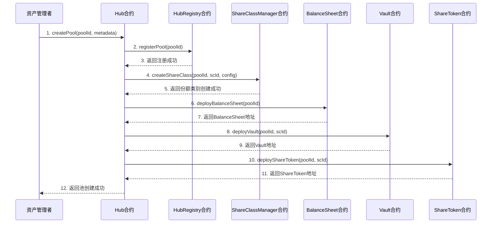
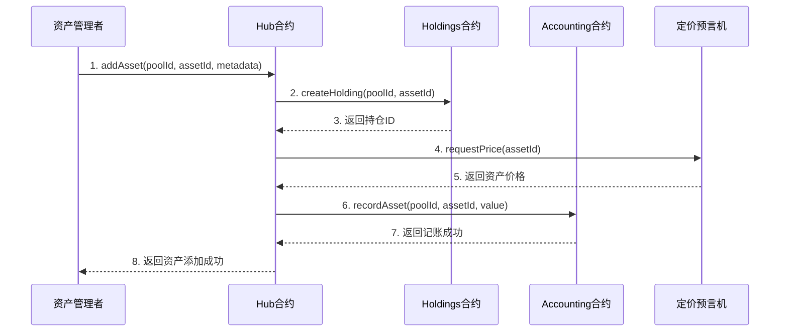
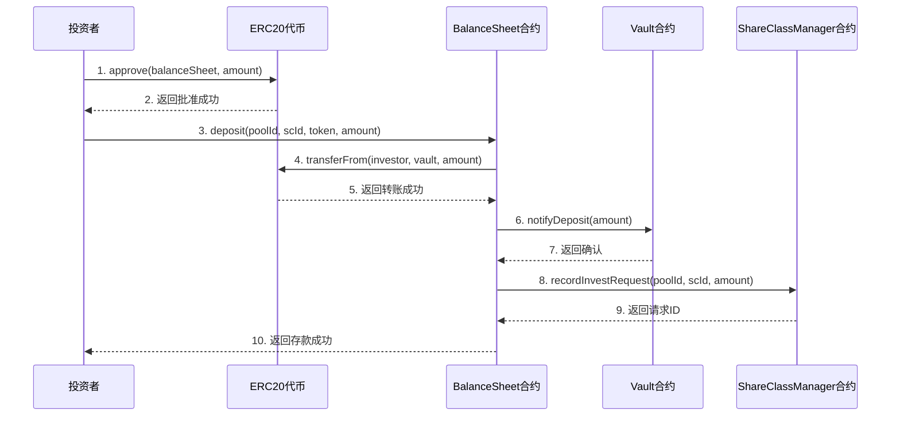
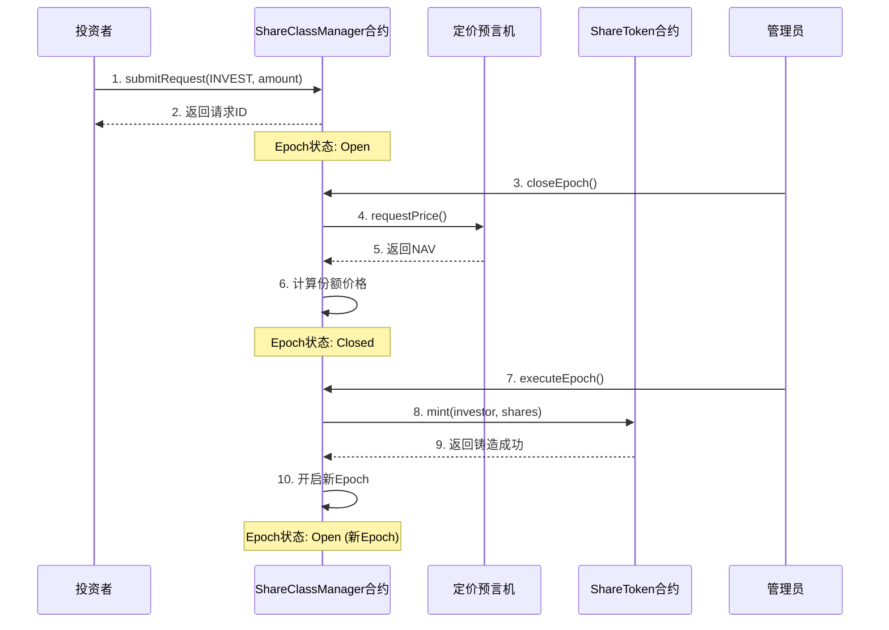
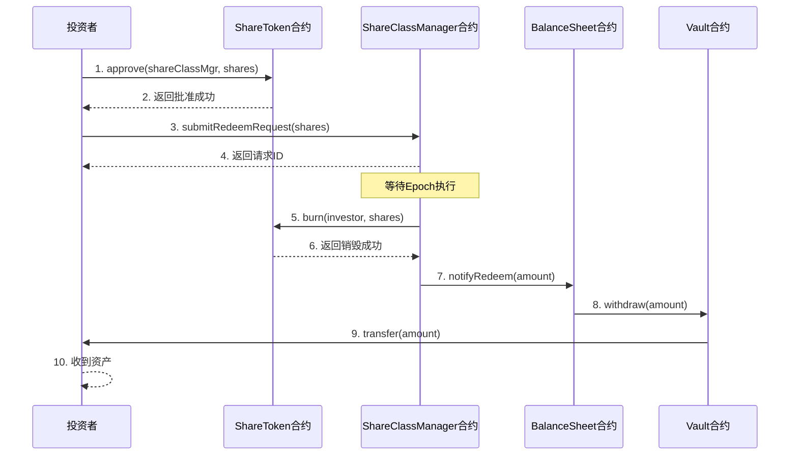
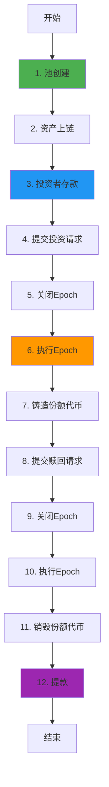
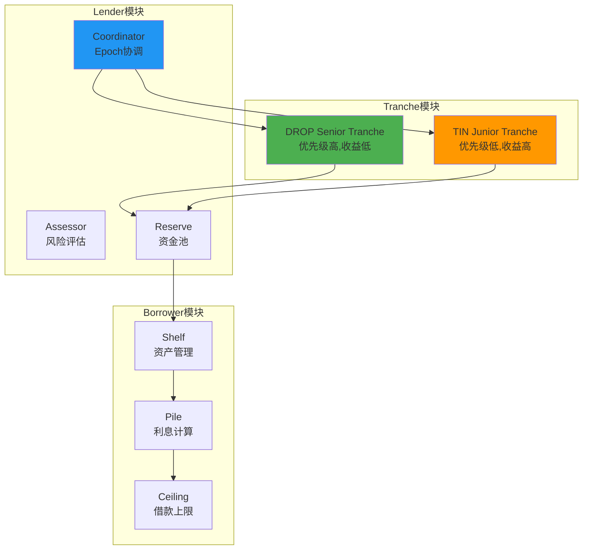

# Centrifuge 业务流程与技术实现深度解析

**文档版本**: v2.0  
**创建时间**: 2025-10-13 10:20:00 CST  
**文档类型**: 业务流程导向的技术深度解析  
**信息来源**: Centrifuge 官方文档 (https://updated-docs.documentation-569.pages.dev/)  
**备份文档**: technical-deep-dive-backup-20251013-101816.md

---

## 📑 目录

1. [Centrifuge 概述](#1-centrifuge概述)
2. [业务流程 1: 池创建与配置](#2-业务流程1-池创建与配置)
3. [业务流程 2: 资产上链与管理](#3-业务流程2-资产上链与管理)
4. [业务流程 3: 投资者存款](#4-业务流程3-投资者存款)
5. [业务流程 4: Epoch 执行与份额管理](#5-业务流程4-epoch执行与份额管理)
6. [业务流程 5: 赎回与提款](#6-业务流程5-赎回与提款)
7. [完整业务流程图](#7-完整业务流程图)
8. [Tinlake 旧版系统参考](#8-tinlake旧版系统参考)
9. [关键财务公式](#9-关键财务公式)
10. [网络信息](#10-网络信息)
11. [总结与最佳实践](#11-总结与最佳实践)

---

## 1. Centrifuge 概述

### 1.1 核心定位

**Centrifuge 是一个开创性的真实世界资产(RWA)代币化平台**,为投资者和资产管理者提供基础设施和生态系统,用于链上代币化、管理和投资多样化的真实世界资产,构建更透明的金融系统。

**核心价值主张**:

-   **真实世界资产代币化**: 将房产、发票、应收账款等真实资产转化为链上代币
-   **透明的金融系统**: 通过区块链技术提供完全透明的资产管理和投资流程
-   **多样化投资机会**: 为投资者提供访问传统金融市场难以触及的资产类别
-   **降低准入门槛**: 通过代币化降低投资门槛,使更多投资者能够参与

---

### 1.2 Hub/Spoke 双层架构

Centrifuge 采用**Hub/Spoke 双层架构**:

-   **Hub 模块**: 中央管理和协调层(6 个核心合约)
-   **Spoke 模块**: 资产管理和金库操作层(5 个核心组件)

**核心合约**:

-   Hub, HubRegistry, ShareClassManager, Accounting, Holdings, HubHelpers
-   BalanceSheet, Vaults, Managers, Escrow, ShareToken

---

## 2. 业务流程 1: 池创建与配置

### 2.1 流程概述

池创建是 Centrifuge 业务流程的起点,由资产管理者(Issuer)发起,通过 Hub 合约创建一个新的资产池,并配置相关参数。

**涉及的合约**: Hub, HubRegistry, ShareClassManager

**核心步骤**:

1. 资产管理者调用 Hub.createPool()创建池
2. Hub 调用 HubRegistry.registerPool()注册池
3. Hub 调用 ShareClassManager.createShareClass()创建份额类别
4. 部署 BalanceSheet、Vault、ShareToken 合约

---

### 2.2 详细流程图



---

### 2.3 Hub 合约详解

**职责**: 中央池管理合约,聚合并暴露所有核心池功能

**核心方法**:

```solidity
/**
 * @dev 创建新池
 * @param poolId 池ID
 * @param metadata 池元数据(IPFS哈希)
 */
function createPool(
    uint256 poolId,
    bytes32 metadata
) external onlyHubAdmin {
    // 1. 验证池ID唯一性
    require(!hubRegistry.poolExists(poolId), "Pool already exists");

    // 2. 注册池
    hubRegistry.registerPool(poolId, metadata);

    // 3. 初始化池配置
    poolConfigs[poolId] = PoolConfig({
        admin: msg.sender,
        metadata: metadata,
        status: PoolStatus.Active,
        createdAt: block.timestamp
    });

    // 4. 触发事件
    emit PoolCreated(poolId, msg.sender, metadata);
}

/**
 * @dev 设置BalanceSheet管理器
 * @param centrifugeId Centrifuge链上的ID
 * @param poolId 池ID
 * @param manager 管理器地址(bytes32格式)
 * @param addManager true=添加, false=移除
 */
function updateBalanceSheetManager(
    bytes32 centrifugeId,
    uint256 poolId,
    bytes32 manager,
    bool addManager
) external onlyHubAdmin {
    // 1. 验证池存在
    require(hubRegistry.poolExists(poolId), "Pool does not exist");

    // 2. 获取BalanceSheet合约
    address balanceSheet = hubRegistry.getBalanceSheet(poolId);

    // 3. 更新管理器
    if (addManager) {
        IBalanceSheet(balanceSheet).addManager(centrifugeId, manager);
        emit ManagerAdded(poolId, manager);
    } else {
        IBalanceSheet(balanceSheet).removeManager(centrifugeId, manager);
        emit ManagerRemoved(poolId, manager);
    }
}
```

---

### 2.4 HubRegistry 合约详解

**职责**: 全局注册表,存储所有池、资产和货币的注册信息

**数据结构**:

```solidity
// 池注册信息
struct PoolInfo {
    uint256 poolId;
    address admin;
    bytes32 metadata;
    uint256 createdAt;
    bool exists;
}

// 池ID映射
mapping(uint256 => PoolInfo) public pools;

// 份额类别映射
mapping(uint256 => mapping(uint256 => ShareClassInfo)) public shareClasses;

// BalanceSheet映射
mapping(uint256 => address) public balanceSheets;

// Vault映射
mapping(uint256 => mapping(uint256 => address)) public vaults;
```

**核心方法**:

```solidity
/**
 * @dev 注册新池
 * @param poolId 池ID
 * @param metadata 池元数据
 */
function registerPool(
    uint256 poolId,
    bytes32 metadata
) external onlyHub {
    require(!pools[poolId].exists, "Pool already registered");

    pools[poolId] = PoolInfo({
        poolId: poolId,
        admin: tx.origin,
        metadata: metadata,
        createdAt: block.timestamp,
        exists: true
    });

    emit PoolRegistered(poolId, metadata);
}

/**
 * @dev 获取池信息
 * @param poolId 池ID
 * @return PoolInfo 池信息
 */
function getPoolInfo(uint256 poolId) external view returns (PoolInfo memory) {
    require(pools[poolId].exists, "Pool does not exist");
    return pools[poolId];
}
```

---

### 2.5 ShareClassManager 合约详解

**职责**: 份额类别管理,处理基于 Epoch 的工作流

**数据结构**:

```solidity
struct ShareClass {
    uint256 scId;
    string name;
    string symbol;
    uint256 minInvestment;
    uint256 maxInvestment;
    ShareClassStatus status;
    uint256 createdAt;
}

enum ShareClassStatus {
    Active,
    Paused,
    Closed
}

// 份额类别映射
mapping(uint256 => mapping(uint256 => ShareClass)) public shareClasses;

// Epoch映射
mapping(uint256 => mapping(uint256 => uint256)) public currentEpoch;
```

**核心方法**:

```solidity
/**
 * @dev 创建份额类别
 * @param poolId 池ID
 * @param scId 份额类别ID
 * @param config 份额类别配置
 */
function createShareClass(
    uint256 poolId,
    uint256 scId,
    ShareClassConfig memory config
) external onlyHub {
    // 1. 验证池存在
    require(hubRegistry.poolExists(poolId), "Pool does not exist");

    // 2. 验证份额类别ID唯一性
    require(!scExists(poolId, scId), "Share class already exists");

    // 3. 创建份额类别
    shareClasses[poolId][scId] = ShareClass({
        scId: scId,
        name: config.name,
        symbol: config.symbol,
        minInvestment: config.minInvestment,
        maxInvestment: config.maxInvestment,
        status: ShareClassStatus.Active,
        createdAt: block.timestamp
    });

    // 4. 初始化第一个Epoch
    _startNewEpoch(poolId, scId);

    // 5. 触发事件
    emit ShareClassCreated(poolId, scId, config.name);
}
```

---

### 2.6 代码示例

#### 2.6.1 完整的池创建流程(TypeScript)

```typescript
import { ethers } from "ethers";

interface ShareClassConfig {
    name: string;
    symbol: string;
    minInvestment: bigint;
    maxInvestment: bigint;
    targetAPY: bigint;
    restrictedTransfer: boolean;
}

async function createCentrifugePool(
    hubContract: ethers.Contract,
    poolId: bigint,
    metadata: string,
    shareClassConfig: ShareClassConfig
) {
    try {
        // 1. 创建池
        console.log("Creating pool...");
        const tx1 = await hubContract.createPool(poolId, metadata);
        await tx1.wait();
        console.log(`✅ Pool ${poolId} created`);

        // 2. 创建份额类别
        console.log("Creating share class...");
        const tx2 = await hubContract.createShareClass(
            poolId,
            1n, // scId
            shareClassConfig
        );
        await tx2.wait();
        console.log(`✅ Share class created for pool ${poolId}`);

        // 3. 部署BalanceSheet
        console.log("Deploying BalanceSheet...");
        const tx3 = await hubContract.deployBalanceSheet(poolId);
        const receipt3 = await tx3.wait();
        const balanceSheetAddress = receipt3.events[0].args.balanceSheet;
        console.log(`✅ BalanceSheet deployed at ${balanceSheetAddress}`);

        // 4. 部署Vault
        console.log("Deploying Vault...");
        const tx4 = await hubContract.deployVault(poolId, 1n);
        const receipt4 = await tx4.wait();
        const vaultAddress = receipt4.events[0].args.vault;
        console.log(`✅ Vault deployed at ${vaultAddress}`);

        return {
            poolId,
            shareClassId: 1n,
            balanceSheetAddress,
            vaultAddress,
            status: "created",
        };
    } catch (error) {
        console.error("Error creating pool:", error);
        throw error;
    }
}

// 使用示例
const config: ShareClassConfig = {
    name: "Senior Tranche",
    symbol: "SEN",
    minInvestment: ethers.parseUnits("1000", 6), // 1000 USDC
    maxInvestment: ethers.parseUnits("1000000", 6), // 1M USDC
    targetAPY: 800n, // 8% (基点)
    restrictedTransfer: true,
};

const result = await createCentrifugePool(
    hubContract,
    12345n,
    "0x1234...", // IPFS hash
    config
);
```

---

### 2.7 注意事项

1. **池 ID 唯一性**: 必须确保池 ID 在全局范围内唯一,通常由 Centrifuge 链生成
2. **权限管理**: 只有 Hub 管理员可以创建池,需要严格的权限控制
3. **元数据存储**: 池元数据通常存储在 IPFS 上,合约只存储 IPFS 哈希
4. **Gas 优化**: 池创建涉及多个合约部署,Gas 成本较高,建议使用批量操作
5. **事件监听**: 应监听 PoolCreated 事件以确认池创建成功
6. **错误处理**: 需要处理各种可能的错误情况,如池 ID 重复、权限不足等

---

## 3. 业务流程 2: 资产上链与管理

### 3.1 流程概述

资产上链是将真实世界资产(RWA)代币化并添加到池中的过程。

**涉及的合约**: Hub, Holdings, Accounting

**核心步骤**:

1. 资产管理者调用 Hub.addAsset()添加资产
2. Hub 调用 Holdings.createHolding()创建持仓
3. Hub 调用 Accounting.recordAsset()记录资产价值
4. 定价预言机提供资产估值

---

### 3.2 详细流程图



---

### 3.3 Holdings 合约详解

**职责**: 持仓账本,跟踪每个池的资产持仓

**数据结构**:

```solidity
struct Holding {
    uint256 holdingId;
    uint256 poolId;
    uint256 assetId;
    uint256 quantity;
    uint256 value;
    uint256 createdAt;
    uint256 updatedAt;
}

// 持仓映射
mapping(uint256 => mapping(uint256 => Holding)) public holdings;

// 池的总持仓价值
mapping(uint256 => uint256) public totalHoldingValue;
```

**核心方法**:

```solidity
/**
 * @dev 创建持仓
 * @param poolId 池ID
 * @param assetId 资产ID
 * @param quantity 数量
 * @param value 价值
 */
function createHolding(
    uint256 poolId,
    uint256 assetId,
    uint256 quantity,
    uint256 value
) external onlyHub returns (uint256 holdingId) {
    // 1. 生成持仓ID
    holdingId = _generateHoldingId(poolId, assetId);

    // 2. 创建持仓
    holdings[poolId][holdingId] = Holding({
        holdingId: holdingId,
        poolId: poolId,
        assetId: assetId,
        quantity: quantity,
        value: value,
        createdAt: block.timestamp,
        updatedAt: block.timestamp
    });

    // 3. 更新总持仓价值
    totalHoldingValue[poolId] += value;

    // 4. 触发事件
    emit HoldingCreated(poolId, holdingId, assetId, quantity, value);
}

/**
 * @dev 更新持仓价值
 * @param poolId 池ID
 * @param holdingId 持仓ID
 * @param newValue 新价值
 */
function updateHoldingValue(
    uint256 poolId,
    uint256 holdingId,
    uint256 newValue
) external onlyHub {
    Holding storage holding = holdings[poolId][holdingId];
    require(holding.holdingId != 0, "Holding does not exist");

    // 1. 更新总持仓价值
    totalHoldingValue[poolId] = totalHoldingValue[poolId] - holding.value + newValue;

    // 2. 更新持仓价值
    holding.value = newValue;
    holding.updatedAt = block.timestamp;

    // 3. 触发事件
    emit HoldingValueUpdated(poolId, holdingId, newValue);
}
```

---

### 3.4 Accounting 合约详解

**职责**: 复式记账系统,记录所有资产和负债

**数据结构**:

```solidity
struct AccountingEntry {
    uint256 entryId;
    uint256 poolId;
    uint256 accountingId;
    int256 amount;  // 正数=借方,负数=贷方
    uint256 timestamp;
}

// 账本映射
mapping(uint256 => mapping(uint256 => AccountingEntry[])) public ledger;

// 账户余额
mapping(uint256 => mapping(uint256 => int256)) public balances;
```

**核心方法**:

```solidity
/**
 * @dev 记录资产
 * @param poolId 池ID
 * @param accountingId 账户ID
 * @param amount 金额
 */
function recordAsset(
    uint256 poolId,
    uint256 accountingId,
    int256 amount
) external onlyHub {
    // 1. 创建账本条目
    AccountingEntry memory entry = AccountingEntry({
        entryId: ledger[poolId][accountingId].length,
        poolId: poolId,
        accountingId: accountingId,
        amount: amount,
        timestamp: block.timestamp
    });

    // 2. 添加到账本
    ledger[poolId][accountingId].push(entry);

    // 3. 更新余额
    balances[poolId][accountingId] += amount;

    // 4. 触发事件
    emit AssetRecorded(poolId, accountingId, amount);
}
```

---

### 3.5 代码示例

#### 3.5.1 添加资产到池(TypeScript)

```typescript
async function addAssetToPool(
    hubContract: ethers.Contract,
    poolId: bigint,
    assetId: bigint,
    metadata: {
        name: string;
        description: string;
        quantity: bigint;
        estimatedValue: bigint;
    }
) {
    try {
        // 1. 添加资产
        console.log("Adding asset to pool...");
        const tx = await hubContract.addAsset(
            poolId,
            assetId,
            metadata.quantity,
            metadata.estimatedValue,
            ethers.toUtf8Bytes(
                JSON.stringify({
                    name: metadata.name,
                    description: metadata.description,
                })
            )
        );

        const receipt = await tx.wait();
        console.log(`✅ Asset ${assetId} added to pool ${poolId}`);

        // 2. 监听事件
        const event = receipt.events.find((e) => e.event === "AssetAdded");
        const holdingId = event.args.holdingId;

        return {
            poolId,
            assetId,
            holdingId,
            status: "added",
        };
    } catch (error) {
        console.error("Error adding asset:", error);
        throw error;
    }
}
```

---

## 4. 业务流程 3: 投资者存款

### 4.1 流程概述

投资者存款是投资者将资金存入池中,等待 Epoch 执行后获得份额代币的过程。

**涉及的合约**: BalanceSheet, Vaults, ShareClassManager

**核心步骤**:

1. 投资者批准 BalanceSheet 合约使用其代币
2. 投资者调用 BalanceSheet.deposit()存款
3. BalanceSheet 将资产转入 Vault
4. ShareClassManager 记录投资请求,等待 Epoch 执行

---

### 4.2 详细流程图



---

### 4.3 BalanceSheet 合约详解

**职责**: 余额跟踪器,跟踪资产和份额类别的余额

**数据结构**:

```solidity
struct Balance {
    uint256 poolId;
    uint256 scId;
    address tokenAddress;
    uint256 tokenType;  // 0=ERC20, 1=ERC721, 2=ERC1155
    uint256 balance;
}

// 余额映射
mapping(uint256 => mapping(uint256 => mapping(address => Balance))) public balances;

// 授权管理器
mapping(uint256 => mapping(bytes32 => bool)) public authorizedManagers;
```

**核心方法**:

```solidity
/**
 * @dev 存款
 * @param poolId 池ID
 * @param scId 份额类别ID
 * @param tokenAddress 代币地址
 * @param tokenType 代币类型
 * @param amount 存款金额
 */
function deposit(
    uint256 poolId,
    uint256 scId,
    address tokenAddress,
    uint256 tokenType,
    uint256 amount
) external {
    require(amount > 0, "Amount must be positive");
    require(isAuthorizedManager(poolId, msg.sender), "Not authorized");

    // 1. 转账代币到Vault
    address vault = hubRegistry.getVault(poolId, scId);
    IERC20(tokenAddress).transferFrom(msg.sender, vault, amount);

    // 2. 更新余额
    balances[poolId][scId][tokenAddress].balance += amount;

    // 3. 通知Hub
    IHub(hub).notifyDeposit(poolId, scId, tokenAddress, amount);

    // 4. 触发事件
    emit Deposit(poolId, scId, tokenAddress, amount, msg.sender);
}
```

---

### 4.4 Vaults 模块详解

Centrifuge 支持三种类型的 Vault:

#### 4.4.1 AsyncVault (异步金库)

**特点**: 完全异步,符合 ERC-7540 标准,适合 RWA 用例

**核心方法**:

```solidity
/**
 * @dev 请求存款
 * @param assets 资产数量
 * @param receiver 接收者地址
 * @return requestId 请求ID
 */
function requestDeposit(
    uint256 assets,
    address receiver
) external returns (uint256 requestId) {
    // 1. 验证金额
    require(assets > 0, "Assets must be positive");

    // 2. 创建请求
    requestId = _createRequest(RequestType.DEPOSIT, assets, receiver);

    // 3. 触发事件
    emit DepositRequest(requestId, receiver, assets);
}

/**
 * @dev 执行存款请求
 * @param requestId 请求ID
 */
function executeDepositRequest(uint256 requestId) external onlyManager {
    Request storage request = requests[requestId];
    require(request.status == RequestStatus.PENDING, "Invalid status");

    // 1. 计算份额
    uint256 shares = convertToShares(request.assets);

    // 2. 铸造份额代币
    _mint(request.receiver, shares);

    // 3. 更新请求状态
    request.status = RequestStatus.EXECUTED;
    request.shares = shares;

    // 4. 触发事件
    emit DepositExecuted(requestId, request.receiver, request.assets, shares);
}
```

#### 4.4.2 SyncDepositVault (同步存款金库)

**特点**: 同步存款,异步赎回,混合模式

**核心方法**:

```solidity
/**
 * @dev 同步存款
 * @param assets 资产数量
 * @param receiver 接收者地址
 * @return shares 份额数量
 */
function deposit(
    uint256 assets,
    address receiver
) external returns (uint256 shares) {
    // 1. 转账资产
    asset.transferFrom(msg.sender, address(this), assets);

    // 2. 计算份额
    shares = convertToShares(assets);

    // 3. 铸造份额代币
    _mint(receiver, shares);

    // 4. 触发事件
    emit Deposit(msg.sender, receiver, assets, shares);
}
```

---

### 4.5 代码示例

#### 4.5.1 投资者存款流程(TypeScript)

```typescript
async function investInPool(
    balanceSheetContract: ethers.Contract,
    usdcContract: ethers.Contract,
    poolId: bigint,
    scId: bigint,
    amount: bigint
) {
    try {
        // 1. 批准BalanceSheet使用USDC
        console.log("Approving USDC...");
        const approveTx = await usdcContract.approve(balanceSheetContract.address, amount);
        await approveTx.wait();
        console.log("✅ USDC approved");

        // 2. 存款
        console.log("Depositing...");
        const depositTx = await balanceSheetContract.deposit(
            poolId,
            scId,
            usdcContract.address,
            0, // ERC20
            amount
        );
        const receipt = await depositTx.wait();
        console.log("✅ Deposit successful");

        // 3. 获取请求ID
        const event = receipt.events.find((e) => e.event === "Deposit");
        const requestId = event.args.requestId;

        return {
            poolId,
            scId,
            amount,
            requestId,
            status: "pending",
        };
    } catch (error) {
        console.error("Error investing:", error);
        throw error;
    }
}
```

---

## 5. 业务流程 4: Epoch 执行与份额管理

### 5.1 流程概述

Epoch 是 Centrifuge 的核心机制,用于批量处理投资和赎回请求,确保公平定价。

**涉及的合约**: ShareClassManager, ShareToken, AsyncRequestManager

**Epoch 生命周期**:

1. **Open**: 接受投资/赎回请求
2. **Closed**: 关闭请求,计算总投资/赎回金额
3. **Executed**: 执行所有请求,铸造/销毁份额代币

---

### 5.2 详细流程图



---

### 5.3 Epoch 机制深度解析

#### 5.3.1 Epoch 状态机

```solidity
enum EpochStatus {
    Open,       // 接受请求
    Closed,     // 已关闭,等待执行
    Executed    // 已执行
}

struct Epoch {
    uint256 epochId;
    uint256 poolId;
    uint256 scId;
    EpochStatus status;
    uint256 totalInvestRequests;
    uint256 totalRedeemRequests;
    uint256 sharePrice;
    uint256 closedAt;
    uint256 executedAt;
}
```

#### 5.3.2 份额价格计算

```solidity
/**
 * @dev 计算份额价格
 * @param poolId 池ID
 * @param scId 份额类别ID
 * @return sharePrice 份额价格(18位小数)
 */
function calculateSharePrice(
    uint256 poolId,
    uint256 scId
) internal view returns (uint256 sharePrice) {
    // 1. 获取NAV(净资产价值)
    uint256 nav = oracle.getNAV(poolId);

    // 2. 获取总份额供应量
    uint256 totalShares = shareToken.totalSupply();

    // 3. 计算份额价格
    if (totalShares == 0) {
        sharePrice = 1e18;  // 初始价格为1
    } else {
        sharePrice = (nav * 1e18) / totalShares;
    }
}
```

---

### 5.4 ShareClassManager 核心方法详解

#### 5.4.1 提交投资请求

```solidity
/**
 * @dev 提交投资请求
 * @param poolId 池ID
 * @param scId 份额类别ID
 * @param amount 投资金额
 * @return requestId 请求ID
 */
function submitInvestRequest(
    uint256 poolId,
    uint256 scId,
    uint256 amount
) external returns (uint256 requestId) {
    // 1. 验证Epoch状态
    Epoch storage epoch = epochs[poolId][scId][currentEpoch[poolId][scId]];
    require(epoch.status == EpochStatus.Open, "Epoch not open");

    // 2. 验证投资金额
    ShareClass storage sc = shareClasses[poolId][scId];
    require(amount >= sc.minInvestment, "Below minimum");
    require(amount <= sc.maxInvestment, "Above maximum");

    // 3. 创建请求
    requestId = _createRequest(poolId, scId, amount, RequestType.INVEST);

    // 4. 更新Epoch统计
    epoch.totalInvestRequests += amount;

    // 5. 触发事件
    emit InvestRequestSubmitted(poolId, scId, requestId, msg.sender, amount);
}
```

#### 5.4.2 关闭 Epoch

```solidity
/**
 * @dev 关闭Epoch
 * @param poolId 池ID
 * @param scId 份额类别ID
 */
function closeEpoch(
    uint256 poolId,
    uint256 scId
) external onlyManager {
    // 1. 获取当前Epoch
    uint256 epochId = currentEpoch[poolId][scId];
    Epoch storage epoch = epochs[poolId][scId][epochId];

    // 2. 验证状态
    require(epoch.status == EpochStatus.Open, "Epoch not open");

    // 3. 更新状态
    epoch.status = EpochStatus.Closed;
    epoch.closedAt = block.timestamp;

    // 4. 请求定价
    oracle.requestPrice(poolId);

    // 5. 触发事件
    emit EpochClosed(poolId, scId, epochId, epoch.totalInvestRequests, epoch.totalRedeemRequests);
}
```

#### 5.4.3 执行 Epoch

```solidity
/**
 * @dev 执行Epoch
 * @param poolId 池ID
 * @param scId 份额类别ID
 */
function executeEpoch(
    uint256 poolId,
    uint256 scId
) external onlyManager {
    // 1. 获取当前Epoch
    uint256 epochId = currentEpoch[poolId][scId];
    Epoch storage epoch = epochs[poolId][scId][epochId];

    // 2. 验证状态
    require(epoch.status == EpochStatus.Closed, "Epoch not closed");

    // 3. 计算份额价格
    epoch.sharePrice = calculateSharePrice(poolId, scId);

    // 4. 执行所有投资请求
    _executeInvestRequests(poolId, scId, epochId, epoch.sharePrice);

    // 5. 执行所有赎回请求
    _executeRedeemRequests(poolId, scId, epochId, epoch.sharePrice);

    // 6. 更新状态
    epoch.status = EpochStatus.Executed;
    epoch.executedAt = block.timestamp;

    // 7. 开启新Epoch
    _startNewEpoch(poolId, scId);

    // 8. 触发事件
    emit EpochExecuted(poolId, scId, epochId, epoch.sharePrice);
}
```

---

### 5.5 代码示例

#### 5.5.1 完整的 Epoch 执行流程(TypeScript)

```typescript
async function executeEpochWorkflow(
    shareClassMgrContract: ethers.Contract,
    poolId: bigint,
    scId: bigint
) {
    try {
        // 1. 关闭Epoch
        console.log("Closing epoch...");
        const closeTx = await shareClassMgrContract.closeEpoch(poolId, scId);
        await closeTx.wait();
        console.log("✅ Epoch closed");

        // 2. 等待定价预言机返回NAV
        console.log("Waiting for oracle price...");
        await new Promise((resolve) => setTimeout(resolve, 60000)); // 等待1分钟

        // 3. 执行Epoch
        console.log("Executing epoch...");
        const executeTx = await shareClassMgrContract.executeEpoch(poolId, scId);
        const receipt = await executeTx.wait();
        console.log("✅ Epoch executed");

        // 4. 获取份额价格
        const event = receipt.events.find((e) => e.event === "EpochExecuted");
        const sharePrice = event.args.sharePrice;
        console.log(`Share price: ${ethers.formatUnits(sharePrice, 18)}`);

        return {
            poolId,
            scId,
            sharePrice,
            status: "executed",
        };
    } catch (error) {
        console.error("Error executing epoch:", error);
        throw error;
    }
}
```

---

## 6. 业务流程 5: 赎回与提款

### 6.1 流程概述

赎回与提款是投资者将份额代币赎回为底层资产的过程。

**涉及的合约**: ShareClassManager, ShareToken, BalanceSheet

**核心步骤**:

1. 投资者调用 ShareClassManager.submitRequest()提交赎回请求
2. 等待 Epoch 执行
3. 系统销毁份额代币
4. BalanceSheet 将资产转给投资者

---

### 6.2 详细流程图



---

### 6.3 代码示例

#### 6.3.1 赎回流程(TypeScript)

```typescript
async function redeemFromPool(
    shareClassMgrContract: ethers.Contract,
    shareTokenContract: ethers.Contract,
    poolId: bigint,
    scId: bigint,
    shares: bigint
) {
    try {
        // 1. 批准ShareClassManager使用份额代币
        console.log("Approving shares...");
        const approveTx = await shareTokenContract.approve(shareClassMgrContract.address, shares);
        await approveTx.wait();
        console.log("✅ Shares approved");

        // 2. 提交赎回请求
        console.log("Submitting redeem request...");
        const redeemTx = await shareClassMgrContract.submitRedeemRequest(poolId, scId, shares);
        const receipt = await redeemTx.wait();
        console.log("✅ Redeem request submitted");

        // 3. 获取请求ID
        const event = receipt.events.find((e) => e.event === "RedeemRequestSubmitted");
        const requestId = event.args.requestId;

        // 4. 等待Epoch执行
        console.log("Waiting for epoch execution...");
        // 监听EpochExecuted事件

        return {
            poolId,
            scId,
            shares,
            requestId,
            status: "pending",
        };
    } catch (error) {
        console.error("Error redeeming:", error);
        throw error;
    }
}
```

---

## 7. 完整业务流程图



---

## 8. Tinlake 旧版系统参考

Tinlake 是 Centrifuge 的旧版系统,采用不同的架构。虽然已被新系统替代,但理解 Tinlake 有助于理解 Centrifuge 的演进历程。

---

### 8.1 Tinlake 架构概览



---

### 8.2 核心模块详解

#### 8.2.1 Tranche 模块

**DROP (Senior Tranche)**:

-   优先级高,风险低
-   固定收益率(如 8% APY)
-   在资产清算时优先获得偿付

**TIN (Junior Tranche)**:

-   优先级低,风险高
-   浮动收益率(剩余收益)
-   承担首要损失(First Loss)

**代码示例**:

```solidity
struct Tranche {
    uint256 totalSupply;
    uint256 totalDebt;
    uint256 interestRate;  // 仅DROP使用
    uint256 lastUpdated;
}

// DROP和TIN的余额
mapping(address => uint256) public dropBalances;
mapping(address => uint256) public tinBalances;
```

---

#### 8.2.2 Coordinator 合约

**职责**: 管理 Epoch,协调投资和赎回请求

**Epoch 执行流程**:

```solidity
/**
 * @dev 执行Epoch
 */
function executeEpoch() external {
    // 1. 关闭当前Epoch
    require(epochState == EpochState.CLOSED, "Epoch not closed");

    // 2. 计算池价值
    uint256 poolValue = assessor.calcPoolValue();

    // 3. 计算Senior和Junior资产
    uint256 seniorAsset = min(assessor.calcExpectedSeniorAsset(), poolValue);
    uint256 juniorAsset = max(poolValue - seniorAsset, 0);

    // 4. 执行投资请求
    _executeInvestOrders(seniorAsset, juniorAsset);

    // 5. 执行赎回请求
    _executeRedeemOrders(seniorAsset, juniorAsset);

    // 6. 开启新Epoch
    epochState = EpochState.OPEN;
    currentEpoch++;
}
```

---

### 8.3 与新系统的详细对比

| 特性       | Tinlake (旧系统)   | Centrifuge v2 (新系统)                    |
| ---------- | ------------------ | ----------------------------------------- |
| **架构**   | Tranche 模块       | Hub/Spoke 双层架构                        |
| **分级**   | 固定两层(DROP/TIN) | 灵活的份额类别,支持多层                   |
| **Epoch**  | Coordinator 合约   | ShareClassManager 合约                    |
| **金库**   | Reserve 合约       | Vaults 模块(AsyncVault, SyncDepositVault) |
| **标准**   | 自定义             | ERC-4626, ERC-7540, ERC-7575, ERC-1404    |
| **跨链**   | 不支持             | 支持跨链部署                              |
| **定价**   | 固定公式           | 灵活的定价预言机                          |
| **复杂度** | 较低               | 较高                                      |
| **扩展性** | 有限               | 高度可扩展                                |

---

### 8.4 迁移建议

如果您正在使用 Tinlake,建议迁移到新系统:

1. **评估现有池**: 分析现有 DROP/TIN 结构
2. **设计份额类别**: 将 DROP/TIN 映射到新的份额类别
3. **迁移资产**: 使用 Hub 合约创建新池并迁移资产
4. **迁移投资者**: 通知投资者并协助迁移
5. **测试验证**: 在测试网充分测试后再迁移主网

---

## 9. 关键财务公式

### 9.1 池价值计算

```
poolValue = NAV + Reserve
          = seniorAsset + juniorAsset
```

### 9.2 Senior 资产计算

```
seniorAsset = min(expectedSeniorAsset, poolValue)
```

### 9.3 Junior 资产计算

```
juniorAsset = max(poolValue - seniorAsset, 0)
```

### 9.4 Epoch 执行公式

```
Reserve_{e+1} = Reserve_e + TIN_{invest} + DROP_{invest} - TIN_{redeem} - DROP_{redeem}
```

---

## 10. 网络信息

### 10.1 Centrifuge Network(主网)

-   **Parachain ID**: 2031
-   **EVM Chain ID**: 2031
-   **Native Asset**: CFG
-   **RPC**: wss://fullnode.centrifuge.io

### 10.2 Altair Network(金丝雀网络)

-   **Parachain ID**: 2088
-   **EVM Chain ID**: 2088
-   **Native Asset**: AIR
-   **RPC**: wss://fullnode.altair.centrifuge.io

### 10.3 Demo Network(测试网)

-   **Parachain ID**: 2031
-   **EVM Chain ID**: 2090
-   **Native Asset**: DEVEL
-   **RPC**: wss://fullnode.development.cntrfg.com

---

## 11. 总结与最佳实践

### 11.1 核心特点

1. **Hub/Spoke 架构**: 职责分离,模块化设计
2. **Epoch 机制**: 批量处理,公平定价
3. **灵活的金库系统**: 支持同步/异步操作
4. **标准兼容性**: ERC-4626, ERC-7540, ERC-7575, ERC-1404

### 11.2 开发最佳实践

1. **池创建**: 确保池 ID 唯一性,使用 IPFS 存储元数据
2. **资产管理**: 使用定价预言机提供准确估值
3. **投资流程**: 监听 Epoch 事件,确保请求被正确处理
4. **Gas 优化**: 使用批量操作减少 Gas 成本

### 11.3 常见问题 FAQ

**Q: Epoch 多久执行一次?**
A: 由池管理员决定,通常为 24 小时或 7 天。

**Q: 投资请求可以取消吗?**
A: 可以,在 Epoch 关闭前可以取消。

**Q: 份额代币可以转账吗?**
A: 取决于份额类别配置,可能受到 ERC-1404 转账限制。

---

## 📚 参考资源

-   **官方文档**: https://updated-docs.documentation-569.pages.dev/
-   **区块浏览器**: https://centrifuge.subscan.io/
-   **治理**: https://voting.opensquare.io/space/centrifuge
-   **GitHub**: https://github.com/centrifuge

---

**文档结束**
