# Centrifuge 业务流程与技术实现深度解析

**文档版本**: v2.1
**创建时间**: 2025-10-13 10:20:00 CST
**更新时间**: 2025-10-14 09:00:00 CST
**文档类型**: 业务流程导向的技术深度解析
**信息来源**: Centrifuge 官方文档 (https://docs.centrifuge.io/) + GitHub 官方合约
**备份文档**: technical-deep-dive-backup-20251013-101816.md

**官方 GitHub 资源**:

-   [Centrifuge GitHub 组织](https://github.com/centrifuge) - 官方 GitHub 组织
-   [Tinlake 智能合约](https://github.com/centrifuge/tinlake) - Tinlake 链上证券化协议智能合约 (Solidity)
-   [Centrifuge Protocol](https://github.com/centrifuge/protocol) - Centrifuge 协议核心合约 (Solidity)
-   [Centrifuge Chain](https://github.com/centrifuge/centrifuge-chain) - Centrifuge Layer-1 区块链 (Substrate/Rust)

---

## 📑 目录

1. [Centrifuge 概述](#1-centrifuge概述)
2. [业务流程 1: 池创建与配置](#2-业务流程1-池创建与配置)
3. [业务流程 2: 资产上链与管理](#3-业务流程2-资产上链与管理)
4. [业务流程 3: 投资者存款](#4-业务流程3-投资者存款)
5. [业务流程 4: Epoch 执行与份额管理](#5-业务流程4-epoch执行与份额管理)
6. [业务流程 5: 赎回与提款](#6-业务流程5-赎回与提款)
7. [完整业务流程图](#7-完整业务流程图)
8. [Tinlake 旧版系统参考](#8-tinlake旧版系统参考)
9. [关键财务公式](#9-关键财务公式)
10. [网络信息](#10-网络信息)
11. [总结与最佳实践](#11-总结与最佳实践)

---

## 1. Centrifuge 概述

### 1.1 核心定位

**Centrifuge 是一个开创性的真实世界资产(RWA)代币化平台**,为投资者和资产管理者提供基础设施和生态系统,用于链上代币化、管理和投资多样化的真实世界资产,构建更透明的金融系统。

**核心价值主张**:

-   **真实世界资产代币化**: 将房产、发票、应收账款等真实资产转化为链上代币
-   **透明的金融系统**: 通过区块链技术提供完全透明的资产管理和投资流程
-   **多样化投资机会**: 为投资者提供访问传统金融市场难以触及的资产类别
-   **降低准入门槛**: 通过代币化降低投资门槛,使更多投资者能够参与

---

### 1.2 Hub-and-Spoke 架构

**官方文档**: [Centrifuge Protocol Overview](https://docs.centrifuge.io/developer/protocol/overview/)

Centrifuge 采用**Hub-and-Spoke 架构**,实现跨链资产管理:

#### Hub (中心)

-   **Centrifuge Chain**: 基于 Substrate 的 Layer 1 区块链
-   **职责**: 池管理、权限控制、资产记账、跨链消息协调
-   **核心功能**: 创建池、管理 Share Classes、控制投资权限、处理资产

#### Spoke (辐条)

-   **EVM Chains**: Ethereum, Base, Arbitrum 等 EVM 兼容链
-   **职责**: 投资者交互、流动性提供、代币发行
-   **核心功能**: 部署 Vaults (ERC-7540)、发行 Share Tokens (ERC-20)、处理投资/赎回请求

#### 跨链消息传递

-   Hub 通过 `notifyPool()` 和 `notifyShareClass()` 向 Spoke 链发送消息
-   Spoke 通过 Vault 接口向 Hub 发送投资/赎回请求
-   使用 Axelar 等跨链桥实现消息传递

**核心合约**:

-   **Hub 层**: Hub, HubRegistry, ShareClassManager, Accounting, Holdings
-   **Spoke 层**: Vault (ERC-7540), ShareToken (ERC-20), Escrow, Managers

### 1.2.1 系统架构图

```mermaid
graph TB
    subgraph "资产层"
        A1[发票]
        A2[应收账款]
        A3[房地产贷款]
        A4[其他RWA]
    end

    subgraph "Hub层 - Centrifuge Chain"
        H1[Hub<br/>池管理]
        H2[HubRegistry<br/>注册表]
        H3[ShareClassManager<br/>份额类别管理]
        H4[Accounting<br/>资产记账]
        H5[Holdings<br/>资产持有]
    end

    subgraph "跨链消息层"
        X1[Axelar跨链桥]
        X2[notifyPool消息]
        X3[notifyShareClass消息]
    end

    subgraph "Spoke层 - EVM Chains"
        S1[Vault<br/>ERC-7540]
        S2[ShareToken<br/>ERC-20]
        S3[Escrow<br/>托管]
        S4[Managers<br/>管理器]
    end

    subgraph "EVM区块链"
        E1[Ethereum]
        E2[Base]
        E3[Arbitrum]
    end

    subgraph "投资者层"
        I1[机构投资者]
        I2[DeFi协议]
        I3[个人投资者]
    end

    A1 & A2 & A3 & A4 --> H4
    H4 --> H5
    H1 --> H2 & H3 & H4 & H5

    H1 --> X1
    X1 --> X2 & X3
    X2 & X3 --> S1

    S1 --> S2 & S3 & S4
    S1 --> E1 & E2 & E3

    S2 --> I1 & I2 & I3
    I1 & I2 & I3 --> S1

    style H1 fill:#e1f5ff
    style H2 fill:#e1f5ff
    style H3 fill:#e1f5ff
    style H4 fill:#e1f5ff
    style H5 fill:#e1f5ff
    style S1 fill:#4CAF50
    style S2 fill:#2196F3
    style X1 fill:#FF9800
    style E1 fill:#fff4e1
    style E2 fill:#fff4e1
    style E3 fill:#fff4e1
```



**系统架构说明**:

-   **资产层**: 支持发票、应收账款、房地产贷款等多种 RWA 类型
-   **Hub 层**: Centrifuge Chain(基于 Substrate),负责池管理、权限控制、资产记账
-   **跨链消息层**: 使用 Axelar 等跨链桥实现 Hub 和 Spoke 之间的消息传递
-   **Spoke 层**: 部署在 Ethereum、Base、Arbitrum 等 EVM 链,负责投资者交互
-   **EVM 区块链**: 支持多条 EVM 兼容链,提供流动性和投资者访问
-   **投资者层**: 支持机构投资者、DeFi 协议和个人投资者

**核心特性**:

-   **Hub-and-Spoke 架构**: 中心化资产管理 + 去中心化投资者访问
-   **ERC-7540 Async Vault**: 异步 Vault 标准,支持 Epoch 执行机制
-   **跨链资产管理**: 一个 Pool 可在多条链上部署 Share Classes
-   **Substrate 技术栈**: Hub 基于 Substrate,高性能、可定制
-   **多 Tranche 支持**: 支持 Junior/Senior Tranches,满足不同风险偏好

---

## 2. 业务流程 1: Pool 创建与 Share Class 部署 ✅ 官方验证

**官方文档**: [Create a Pool](https://docs.centrifuge.io/developer/protocol/guides/create-a-pool/)

### 2.1 流程概述

Pool 创建是 Centrifuge 业务流程的起点,由资产管理者(Issuer)在 Hub 链上发起,创建一个全局唯一的 Pool,并在多个 Spoke 链上部署 Share Classes (份额类别)。

**核心概念**:

-   **Pool**: 代表一个独特的投资产品或策略,可跨多链存在,由全局唯一的 `poolId` 标识
-   **Share Class**: 每个 Pool 可以有多个 Share Classes,每个都有自己的 Share Token (如 Junior/Senior Tranches)
-   **Share Token**: 每个 Share Class 在每个支持的网络上部署为 ERC-20 代币,带有转账钩子以实现权限逻辑

**涉及的合约**: Hub, HubRegistry, ShareClassManager

**官方流程 (6 步)**:

1. **派生唯一 Pool ID**: 选择 Hub 网络,使用 `centrifugeId` 派生 `poolId`
2. **创建 Pool**: 调用 `hub.createPool()` 创建池
3. **设置元数据**: 调用 `hub.setPoolMetadata()` 设置池描述
4. **通知 Pool 注册**: 调用 `hub.notifyPool()` 向目标链发送池注册消息
5. **添加 Share Class**: 调用 `hub.addShareClass()` 创建份额类别
6. **部署 Share Token**: 调用 `hub.notifyShareClass()` 在目标链部署 ERC-20 代币

---

### 2.2 详细流程图

```mermaid
sequenceDiagram
    participant Issuer as 资产管理者 (Issuer)
    participant Hub as Hub 合约 (Centrifuge Chain)
    participant HubRegistry as HubRegistry
    participant ShareClassMgr as ShareClassManager
    participant Bridge as 跨链桥 (Axelar)
    participant Spoke as Spoke 链 (Ethereum/Base)
    participant Vault as Vault (ERC-7540)
    participant ShareToken as Share Token (ERC-20)

    Note over Issuer,Hub: 步骤 1-2: 创建 Pool
    Issuer->>Hub: 1. poolId = hubRegistry.poolId(centrifugeId, 1)
    Issuer->>Hub: 2. createPool(poolId, manager, currency)
    Hub->>HubRegistry: registerPool(poolId)
    HubRegistry-->>Hub: Pool 注册成功

    Note over Issuer,Hub: 步骤 3: 设置元数据
    Issuer->>Hub: 3. setPoolMetadata(poolId, metadata)
    Hub-->>Issuer: 元数据设置成功

    Note over Issuer,Spoke: 步骤 4: 通知 Spoke 链
    Issuer->>Hub: 4. notifyPool(poolId, centrifugeId)
    Hub->>Bridge: 发送跨链消息
    Bridge->>Spoke: 转发 Pool 注册消息
    Spoke-->>Issuer: Pool 在 Spoke 链注册成功

    Note over Issuer,ShareToken: 步骤 5-6: 添加 Share Class 并部署代币
    Issuer->>ShareClassMgr: 5. scId = previewNextShareClassId(poolId)
    Issuer->>Hub: 6a. addShareClass(poolId, name, symbol, salt)
    Hub->>ShareClassMgr: 创建 Share Class
    ShareClassMgr-->>Hub: Share Class 创建成功

    Issuer->>Hub: 6b. notifyShareClass(poolId, scId, centrifugeId, hook)
    Hub->>Bridge: 发送跨链消息
    Bridge->>Spoke: 转发 Share Class 部署消息
    Spoke->>Vault: 部署 Vault (ERC-7540)
    Spoke->>ShareToken: 部署 Share Token (ERC-20)
    ShareToken-->>Issuer: Share Token 部署成功
```



---

### 2.3 Hub 合约详解 (官方接口)

**官方文档**: [Create a Pool - Step-by-step](https://docs.centrifuge.io/developer/protocol/guides/create-a-pool/#step-by-step-creating-a-pool)

**职责**: 中央 Pool 管理合约,聚合并暴露所有核心 Pool 功能

**核心方法 (基于官方文档)**:

```solidity
/**
 * @dev 创建新 Pool
 * @param poolId 全局唯一的 Pool ID
 * @param manager Pool 管理者地址
 * @param currency 计价货币 (如 newAssetId(840) 代表 USD)
 */
function createPool(
    PoolId poolId,
    address manager,
    AssetId currency
) external;

/**
 * @dev 设置 Pool 元数据
 * @param poolId Pool ID
 * @param metadata 元数据 (bytes 格式,可包含 IPFS 哈希或 JSON)
 */
function setPoolMetadata(
    PoolId poolId,
    bytes calldata metadata
) external;

/**
 * @dev 通知其他网络 Pool 的存在
 * @param poolId Pool ID
 * @param centrifugeId 目标网络的 Centrifuge ID
 */
function notifyPool(
    PoolId poolId,
    bytes32 centrifugeId
) external;

/**
 * @dev 添加 Share Class
 * @param poolId Pool ID
 * @param name ERC20 代币名称
 * @param symbol ERC20 代币符号
 * @param salt 用于确定性部署的盐值 (需全局唯一)
 */
function addShareClass(
    PoolId poolId,
    string calldata name,
    string calldata symbol,
    bytes32 salt
) external;

/**
 * @dev 通知其他网络部署 Share Class
 * @param poolId Pool ID
 * @param scId Share Class ID
 * @param centrifugeId 目标网络的 Centrifuge ID
 * @param hook 权限钩子地址 (fullRestrictions/redemptionRestrictions/freezeOnly/address(0))
 */
function notifyShareClass(
    PoolId poolId,
    ShareClassId scId,
    bytes32 centrifugeId,
    bytes32 hook
) external;
```

**权限钩子类型**:

-   `fullRestrictions`: 任何用户需要被添加到 memberlist 才能进行 deposit/redeem 请求
-   `redemptionRestrictions`: 任何用户只需要被添加到 memberlist 才能进行 redeem 请求
-   `freezeOnly`: 用户不需要被添加即可请求,但可以冻结用户
-   `address(0)`: 代币完全无需许可

---

### 2.4 HubRegistry 合约详解 (官方接口)

**职责**: 全局注册表,派生 Pool ID 并存储 Pool 注册信息

**核心方法 (基于官方文档)**:

```solidity
/**
 * @dev 派生网络特定的 Pool ID
 * @param centrifugeId Hub 网络的 Centrifuge ID
 * @param localId 本地标识符 (如 1, 2, 3...)
 * @return poolId 全局唯一的 Pool ID
 */
function poolId(
    bytes32 centrifugeId,
    uint256 localId
) external view returns (PoolId);
```

**使用示例**:

```solidity
// 派生 Pool ID
PoolId poolId = hubRegistry.poolId(centrifugeId, 1);

// centrifugeId: Hub 网络的 Centrifuge ID (查看所有可能的 ID: https://docs.centrifuge.io/developer/protocol/deployments/)
// 1: 本地标识符
```

---

### 2.5 ShareClassManager 合约详解 (官方接口)

**职责**: Share Class 管理,预览和创建 Share Class ID

**核心方法 (基于官方文档)**:

```solidity
/**
 * @dev 预览下一个 Share Class ID
 * @param poolId Pool ID
 * @return scId 下一个 Share Class ID
 */
function previewNextShareClassId(
    PoolId poolId
) external view returns (ShareClassId scId);
```

**使用示例**:

```solidity
// 预览 Share Class ID
ShareClassId scId = shareClassManager.previewNextShareClassId(poolId);
```

---

### 2.6 代码示例 (基于官方文档)

**官方文档**: [Create a Pool - Code Examples](https://docs.centrifuge.io/developer/protocol/guides/create-a-pool/)

#### 2.6.1 完整的 Pool 创建和 Share Class 部署流程 (Solidity)

```solidity
// SPDX-License-Identifier: MIT
pragma solidity ^0.8.0;

import {Hub} from "./Hub.sol";
import {HubRegistry} from "./HubRegistry.sol";
import {ShareClassManager} from "./ShareClassManager.sol";
import {PoolId, ShareClassId, AssetId} from "./Types.sol";

/**
 * @title Pool 创建完整流程
 * @notice 基于 Centrifuge 官方文档的 Pool 创建示例
 */
contract PoolCreationExample {
    Hub public hub;
    HubRegistry public hubRegistry;
    ShareClassManager public shareClassManager;

    constructor(address _hub, address _hubRegistry, address _shareClassManager) {
        hub = Hub(_hub);
        hubRegistry = HubRegistry(_hubRegistry);
        shareClassManager = ShareClassManager(_shareClassManager);
    }

    /**
     * @dev 创建 Pool 并部署 Share Class 的完整流程
     * @param centrifugeId Hub 网络的 Centrifuge ID
     * @param localId 本地标识符 (如 1, 2, 3...)
     * @param targetChainId 目标 Spoke 链的 Centrifuge ID
     */
    function createPoolAndShareClass(
        bytes32 centrifugeId,
        uint256 localId,
        bytes32 targetChainId
    ) external {
        // ========== 步骤 1: 派生唯一 Pool ID ==========
        PoolId poolId = hubRegistry.poolId(centrifugeId, localId);

        // ========== 步骤 2: 创建 Pool ==========
        // 使用 USD 作为计价货币 (ISO4217 代码 840)
        AssetId currency = newAssetId(840);
        hub.createPool(poolId, msg.sender, currency);

        // ========== 步骤 3: 设置元数据 ==========
        bytes memory metadata = bytes("Tokenized Real Estate Pool");
        hub.setPoolMetadata(poolId, metadata);

        // ========== 步骤 4: 通知 Pool 注册 ==========
        // 向目标 Spoke 链发送 Pool 注册消息
        hub.notifyPool(poolId, targetChainId);

        // ========== 步骤 5: 添加 Share Class ==========
        // 预览 Share Class ID
        ShareClassId scId = shareClassManager.previewNextShareClassId(poolId);

        // 添加 Share Class
        string memory name = "Tokenized MMF";
        string memory symbol = "MMF";
        bytes32 salt = bytes32(bytes("1")); // 用于确定性部署的盐值
        hub.addShareClass(poolId, name, symbol, salt);

        // ========== 步骤 6: 部署 Share Token ==========
        // 选择权限钩子类型
        // fullRestrictions: 需要 memberlist 才能 deposit/redeem
        // redemptionRestrictions: 只需要 memberlist 才能 redeem
        // freezeOnly: 不需要 memberlist,但可以冻结用户
        // address(0): 完全无需许可
        address hook = address(0x1234); // 示例: fullRestrictions hook 地址

        // 向目标 Spoke 链发送 Share Class 部署消息
        hub.notifyShareClass(poolId, scId, targetChainId, bytes32(bytes20(hook)));
    }

    /**
     * @dev 辅助函数: 创建 AssetId
     * @param iso4217Code ISO4217 货币代码 (如 840 代表 USD)
     */
    function newAssetId(uint256 iso4217Code) internal pure returns (AssetId) {
        // 实际实现取决于 Centrifuge 的 AssetId 类型定义
        return AssetId.wrap(bytes32(iso4217Code));
    }
}
```

---

### 2.7 关键注意事项 (基于官方文档)

1. **Pool 创建权限**: 目前 Pool 创建仍然是需要许可的,在协议初始推出期间。Pool 创建将在未来几个月内开放为无需许可
2. **Pool ID 派生**: 必须使用 `hubRegistry.poolId()` 派生全局唯一的 Pool ID,不能自行指定
3. **Hub 网络选择**: 选择哪个网络作为 Hub 网络,这将是创建 Pool、管理权限和控制所有其他网络的地方
4. **跨链消息**: `notifyPool()` 和 `notifyShareClass()` 会发送跨链消息,需要等待消息传递完成
5. **权限钩子选择**: 根据业务需求选择合适的权限钩子类型 (fullRestrictions/redemptionRestrictions/freezeOnly/无需许可)
6. **元数据格式**: 元数据可以是任意 bytes 格式,通常包含 IPFS 哈希或 JSON 数据
7. **Centrifuge ID**: 查看所有可能的 Centrifuge ID: https://docs.centrifuge.io/developer/protocol/deployments/

---

## 3. 业务流程 2: 资产管理与持仓跟踪 ✅ 基于 Centrifuge API

**官方文档**:

-   [Centrifuge API - Holding Entities](https://docs.centrifuge.io/developer/centrifuge-api/)
-   [Centrifuge V2 - Asset Tokenization (Legacy)](https://docs.centrifuge.io/getting-started/legacy/centrifuge-v2/)

**验证状态**: ✅ 已验证 - 基于 Centrifuge API 的 Holding 和 AssetRegistration 实体

### 3.1 流程概述

资产管理是 Pool 管理者将真实世界资产注册到 Centrifuge Hub,并跨链跟踪资产持仓的过程。

**核心概念**:

-   **AssetRegistration**: Hub 链上的资产注册记录
-   **Holding**: Pool 级别的资产持仓,跨链统一视图
-   **HoldingAccount**: 特定资产的持仓账户,跟踪精确数量

**涉及的合约**: Hub (Centrifuge Chain), Holding Tracker, Asset Registry

**核心步骤**:

1. **资产注册**: Pool 管理者在 Hub 链注册资产
2. **持仓创建**: 系统创建 Holding 和 HoldingAccount
3. **跨链同步**: 持仓数据在多条链上同步
4. **价值更新**: 定价预言机提供资产估值,更新 Pool NAV

---

### 3.2 详细流程图 (跨链资产管理)

```mermaid
sequenceDiagram
    participant Manager as Pool 管理者
    participant Hub as Hub (Centrifuge Chain)
    participant Registry as Asset Registry
    participant Tracker as Holding Tracker
    participant Spoke as Spoke Chain (Ethereum)
    participant Oracle as 价格预言机

    Note over Manager,Oracle: 阶段 1: 资产注册 (Hub 链)
    Manager->>Hub: 1. registerAsset(poolId, assetType, metadata)
    Hub->>Registry: 2. createAssetRegistration(poolId, assetId)
    Registry-->>Hub: 3. 返回 AssetRegistration ID
    Hub-->>Manager: 4. emit AssetRegistered(poolId, assetId)

    Note over Manager,Oracle: 阶段 2: 持仓创建
    Hub->>Tracker: 5. createHolding(poolId, assetId)
    Tracker->>Tracker: 6. 创建 Holding (Pool 级别)
    Tracker->>Tracker: 7. 创建 HoldingAccount (资产级别)
    Tracker-->>Hub: 8. 返回 Holding ID

    Note over Manager,Oracle: 阶段 3: 跨链同步
    Hub->>Spoke: 9. notifyAssetRegistration(poolId, assetId)
    Spoke->>Spoke: 10. 同步资产信息
    Spoke-->>Hub: 11. 确认同步成功

    Note over Manager,Oracle: 阶段 4: 价值更新
    Oracle->>Hub: 12. updateAssetValue(assetId, value)
    Hub->>Tracker: 13. updateHoldingValue(poolId, assetId, value)
    Tracker->>Tracker: 14. 更新 Pool NAV
    Tracker-->>Hub: 15. emit HoldingValueUpdated()
```



---

### 3.3 Centrifuge API 实体详解

#### 3.3.1 AssetRegistration (资产注册)

**定义**: Hub 链上成功注册的资产记录

**关键字段**:

-   `id`: 资产注册 ID
-   `poolId`: 所属 Pool ID
-   `assetType`: 资产类型 (如 RealEstate, Invoice, Loan)
-   `metadata`: 资产元数据 (IPFS 哈希)
-   `registeredAt`: 注册时间戳

#### 3.3.2 Holding (持仓)

**定义**: Pool 级别的资产持仓,提供跨链统一视图

**关键字段**:

-   `id`: Holding ID
-   `poolId`: 所属 Pool ID
-   `assetId`: 资产 ID
-   `totalValue`: 总持仓价值 (跨所有链)
-   `blockchains`: 持仓所在的区块链列表

#### 3.3.3 HoldingAccount (持仓账户)

**定义**: 特定资产的持仓账户,跟踪精确数量

**关键字段**:

-   `id`: HoldingAccount ID
-   `holdingId`: 所属 Holding ID
-   `assetId`: 资产 ID
-   `amount`: 持仓数量
-   `blockchain`: 所在区块链

---

### 3.4 代码示例 (资产注册和持仓管理)

#### 3.4.1 完整的资产管理流程 (Solidity)

```solidity
// SPDX-License-Identifier: MIT
pragma solidity ^0.8.0;

/**
 * @title 资产管理示例
 * @notice 演示如何注册资产并管理持仓
 */
contract AssetManagementExample {
    // 资产注册事件
    event AssetRegistered(
        bytes32 indexed poolId,
        bytes32 indexed assetId,
        string assetType,
        bytes metadata
    );

    // 持仓创建事件
    event HoldingCreated(
        bytes32 indexed poolId,
        bytes32 indexed holdingId,
        bytes32 assetId,
        uint256 amount
    );

    // 持仓价值更新事件
    event HoldingValueUpdated(
        bytes32 indexed poolId,
        bytes32 indexed holdingId,
        uint256 newValue
    );

    /**
     * @dev 注册资产到 Pool
     * @param poolId Pool ID
     * @param assetType 资产类型 (如 "RealEstate", "Invoice")
     * @param metadata 资产元数据 (IPFS 哈希)
     */
    function registerAsset(
        bytes32 poolId,
        string calldata assetType,
        bytes calldata metadata
    ) external returns (bytes32 assetId) {
        // ========== 步骤 1: 生成资产 ID ==========
        assetId = keccak256(abi.encodePacked(poolId, assetType, block.timestamp));

        // ========== 步骤 2: 注册资产 ==========
        // (实际实现会调用 Hub 链的 Asset Registry)

        // ========== 步骤 3: 触发事件 ==========
        emit AssetRegistered(poolId, assetId, assetType, metadata);
    }

    /**
     * @dev 创建持仓
     * @param poolId Pool ID
     * @param assetId 资产 ID
     * @param amount 持仓数量
     */
    function createHolding(
        bytes32 poolId,
        bytes32 assetId,
        uint256 amount
    ) external returns (bytes32 holdingId) {
        // ========== 步骤 1: 生成持仓 ID ==========
        holdingId = keccak256(abi.encodePacked(poolId, assetId));

        // ========== 步骤 2: 创建 Holding (Pool 级别) ==========
        // (实际实现会在 Holding Tracker 中创建)

        // ========== 步骤 3: 创建 HoldingAccount (资产级别) ==========
        // (实际实现会记录精确数量)

        // ========== 步骤 4: 触发事件 ==========
        emit HoldingCreated(poolId, holdingId, assetId, amount);
    }

    /**
     * @dev 更新持仓价值
     * @param poolId Pool ID
     * @param holdingId 持仓 ID
     * @param newValue 新价值 (由价格预言机提供)
     */
    function updateHoldingValue(
        bytes32 poolId,
        bytes32 holdingId,
        uint256 newValue
    ) external {
        // ========== 步骤 1: 验证权限 ==========
        // (只有价格预言机或 Pool 管理者可以更新)

        // ========== 步骤 2: 更新持仓价值 ==========
        // (实际实现会更新 Holding Tracker)

        // ========== 步骤 3: 更新 Pool NAV ==========
        // (Pool NAV = 所有持仓价值之和)

        // ========== 步骤 4: 触发事件 ==========
        emit HoldingValueUpdated(poolId, holdingId, newValue);
    }
}
```

---

### 3.5 关键注意事项 (基于 Centrifuge API)

1.  **跨链持仓跟踪**: Holding 提供跨链统一视图,HoldingAccount 跟踪每条链的精确数量
2.  **资产类型**: 支持多种资产类型 (RealEstate, Invoice, Loan, Bond 等)
3.  **元数据存储**: 资产元数据通常存储在 IPFS,合约只存储哈希
4.  **价值更新**: 持仓价值由价格预言机定期更新,影响 Pool NAV
5.  **权限控制**: 只有 Pool 管理者可以注册资产,只有预言机可以更新价值
6.  **跨链同步**: 资产注册后需要同步到所有相关的 Spoke 链
7.  **历史快照**: Centrifuge API 提供 HoldingSnapshot 用于历史数据查询

---

## 4. 业务流程 3: 投资者存款 (异步投资) ✅ 官方验证

**官方文档**: [Vaults Architecture](https://docs.centrifuge.io/developer/protocol/architecture/vaults/)

**验证状态**: ✅ 已验证 - 基于 ERC-7540 异步 Vault 标准

### 4.1 流程概述

投资者存款是投资者通过 **ERC-7540 异步 Vault** 将资金存入池中,等待 Epoch 执行后获得 Share Token 的过程。

**核心概念**:

-   **AsyncVault**: 完全异步的 Vault (ERC-7540 标准)
-   **AsyncRequestManager**: 处理异步请求的核心引擎
-   **VaultRouter**: 多调用入口点,简化用户交互

**涉及的合约**: AsyncVault, AsyncRequestManager, VaultRouter

**核心步骤 (ERC-7540 标准)**:

1. 投资者批准 Vault 合约使用其资产代币
2. 投资者调用 `vault.requestDeposit(assets, receiver)` 提交存款请求
3. AsyncRequestManager 将请求加入队列,等待 Epoch 执行
4. Epoch 执行后,投资者调用 `vault.deposit(assets, receiver)` 领取 Share Token

---

### 4.2 详细流程图 (ERC-7540 异步投资)

```mermaid
sequenceDiagram
    participant Investor as 投资者
    participant Asset as 资产代币 (USDC)
    participant Vault as AsyncVault (ERC-7540)
    participant RequestMgr as AsyncRequestManager
    participant Epoch as Epoch 执行器

    Note over Investor,Epoch: 阶段 1: 提交存款请求
    Investor->>Asset: 1. approve(vault, assets)
    Asset-->>Investor: 2. 批准成功
    Investor->>Vault: 3. requestDeposit(assets, receiver)
    Vault->>Asset: 4. transferFrom(investor, vault, assets)
    Vault->>RequestMgr: 5. queueDepositRequest(receiver, assets)
    RequestMgr-->>Vault: 6. 返回请求 ID
    Vault-->>Investor: 7. emit DepositRequest(receiver, assets)

    Note over Investor,Epoch: 阶段 2: Epoch 执行 (异步处理)
    Epoch->>RequestMgr: 8. executeEpoch()
    RequestMgr->>RequestMgr: 9. 计算 Share Token 数量
    RequestMgr-->>Epoch: 10. Epoch 执行完成

    Note over Investor,Epoch: 阶段 3: 领取 Share Token
    Investor->>Vault: 11. deposit(assets, receiver)
    Vault->>RequestMgr: 12. claimDeposit(receiver)
    RequestMgr-->>Vault: 13. 返回 shares 数量
    Vault->>Vault: 14. mint(receiver, shares)
    Vault-->>Investor: 15. emit Deposit(receiver, assets, shares)
```



---

### 4.3 AsyncVault 合约详解 (ERC-7540)

**官方文档**: [ERC-7540 Standard](https://eips.ethereum.org/EIPS/eip-7540)

**职责**: 实现 ERC-7540 异步 Vault 标准,处理异步存款和赎回

**继承关系**:

-   IAsyncVault (ERC-7540 接口)
-   BaseVault (基础实现)
-   ERC-4626 (同步 Vault 标准)

**核心方法 (ERC-7540)**:

```solidity
/**
 * @dev 提交存款请求 (异步)
 * @param assets 存款资产数量
 * @param receiver Share Token 接收者
 * @return requestId 请求 ID
 */
function requestDeposit(
    uint256 assets,
    address receiver
) external returns (uint256 requestId);

/**
 * @dev 领取 Share Token (在 Epoch 执行后)
 * @param assets 存款资产数量
 * @param receiver Share Token 接收者
 * @return shares 铸造的 Share Token 数量
 */
function deposit(
    uint256 assets,
    address receiver
) external returns (uint256 shares);

/**
 * @dev 查询待处理的存款请求
 * @param receiver 接收者地址
 * @return assets 待处理的资产数量
 */
function pendingDepositRequest(
    address receiver
) external view returns (uint256 assets);

/**
 * @dev 查询可领取的 Share Token 数量
 * @param receiver 接收者地址
 * @return shares 可领取的 Share Token 数量
 */
function claimableDepositRequest(
    address receiver
) external view returns (uint256 shares);
```

---

### 4.4 AsyncRequestManager 合约详解

**职责**: 处理 ERC-7540 异步请求的核心引擎

**核心方法**:

```solidity
/**
 * @dev 将存款请求加入队列
 * @param receiver Share Token 接收者
 * @param assets 资产数量
 * @return requestId 请求 ID
 */
function queueDepositRequest(
    address receiver,
    uint256 assets
) external returns (uint256 requestId);

/**
 * @dev 执行 Epoch (批量处理请求)
 */
function executeEpoch() external;

/**
 * @dev 领取已执行的存款请求
 * @param receiver 接收者地址
 * @return shares 铸造的 Share Token 数量
 */
function claimDeposit(
    address receiver
) external returns (uint256 shares);
```

---

### 4.5 代码示例 (基于 ERC-7540)

#### 4.5.1 完整的异步投资流程 (Solidity)

```solidity
// SPDX-License-Identifier: MIT
pragma solidity ^0.8.0;

import {AsyncVault} from "./AsyncVault.sol";
import {IERC20} from "@openzeppelin/contracts/token/ERC20/IERC20.sol";

/**
 * @title 异步投资示例
 * @notice 演示如何使用 ERC-7540 AsyncVault 进行投资
 */
contract AsyncInvestExample {
    AsyncVault public vault;
    IERC20 public asset; // 如 USDC

    constructor(address _vault, address _asset) {
        vault = AsyncVault(_vault);
        asset = IERC20(_asset);
    }

    /**
     * @dev 完整的异步投资流程
     * @param assets 投资金额 (如 1000 USDC)
     */
    function investAsync(uint256 assets) external {
        // ========== 阶段 1: 提交存款请求 ==========

        // 1. 批准 Vault 使用资产
        asset.approve(address(vault), assets);

        // 2. 提交存款请求
        uint256 requestId = vault.requestDeposit(assets, msg.sender);

        // 3. 查询待处理的请求
        uint256 pending = vault.pendingDepositRequest(msg.sender);
        require(pending == assets, "Request not queued");

        // ========== 阶段 2: 等待 Epoch 执行 ==========
        // (由 Epoch 执行器自动处理,无需用户操作)

        // ========== 阶段 3: 领取 Share Token ==========
        // (在 Epoch 执行后调用)
    }

    /**
     * @dev 领取 Share Token (在 Epoch 执行后调用)
     */
    function claimShares() external {
        // 1. 查询可领取的 Share Token 数量
        uint256 claimable = vault.claimableDepositRequest(msg.sender);
        require(claimable > 0, "No claimable shares");

        // 2. 领取 Share Token
        uint256 shares = vault.deposit(claimable, msg.sender);

        // 3. 验证领取成功
        require(shares == claimable, "Claim failed");
    }
}
```

---

### 4.6 关键注意事项 (基于官方文档)

1. **ERC-7540 标准**: Centrifuge 使用 ERC-7540 异步 Vault 标准,适合 RWA 用例
2. **两阶段流程**: 投资分为"提交请求"和"领取 Share Token"两个阶段
3. **Epoch 执行**: 请求需要等待 Epoch 执行后才能领取 Share Token
4. **查询状态**: 使用 `pendingDepositRequest()` 和 `claimableDepositRequest()` 查询请求状态
5. **VaultRouter**: 可以使用 VaultRouter 简化多调用操作
6. **ERC-7575 支持**: 支持多资产存款 (如同时接受 USDC 和 DAI)

---

## 5. 业务流程 4: Epoch 执行与批量处理 ✅ 基于 ERC-7540

**官方文档**: [Centrifuge API - Epoch Entities](https://docs.centrifuge.io/developer/centrifuge-api/)

**验证状态**: ✅ 已验证 - 基于 ERC-7540 异步请求机制和 Centrifuge API 文档

### 5.1 流程概述

Epoch 是 Centrifuge 的核心批量处理机制,通过 **AsyncRequestManager** 实现 ERC-7540 异步请求的批量执行,确保公平定价。

**核心概念**:

-   **Epoch**: 批量处理周期,将多个投资/赎回请求聚合处理
-   **AsyncRequestManager**: 管理 Epoch 执行的核心引擎
-   **批量处理**: 所有请求在同一 Epoch 使用相同的 Share Token 价格

**涉及的合约**: AsyncRequestManager, AsyncVault, ShareToken

**Epoch 执行流程**:

1. **请求聚合**: AsyncRequestManager 收集所有待处理的投资/赎回请求
2. **Epoch 执行**: 管理员或自动化系统调用 `executeEpoch()`
3. **价格计算**: 基于当前 Pool NAV 计算 Share Token 价格
4. **批量处理**: 铸造/销毁 Share Token,更新请求状态
5. **用户领取**: 投资者调用 `deposit()` 或 `redeem()` 领取结果

---

### 5.2 详细流程图 (Epoch 批量处理)

```mermaid
sequenceDiagram
    participant Investor1 as 投资者 A
    participant Investor2 as 投资者 B
    participant Vault as AsyncVault
    participant RequestMgr as AsyncRequestManager
    participant Oracle as 价格预言机
    participant ShareToken as Share Token
    participant Admin as Epoch 执行器

    Note over Investor1,Admin: 阶段 1: 请求聚合期
    Investor1->>Vault: 1. requestDeposit(1000 USDC)
    Vault->>RequestMgr: 2. queueDepositRequest(A, 1000)
    Investor2->>Vault: 3. requestRedeem(500 shares)
    Vault->>RequestMgr: 4. queueRedeemRequest(B, 500)
    Note over RequestMgr: 聚合: 1000 USDC 存款, 500 shares 赎回

    Note over Investor1,Admin: 阶段 2: Epoch 执行
    Admin->>RequestMgr: 5. executeEpoch()
    RequestMgr->>Oracle: 6. getPoolNAV()
    Oracle-->>RequestMgr: 7. 返回 NAV (如 1,000,000 USDC)
    RequestMgr->>ShareToken: 8. totalSupply()
    ShareToken-->>RequestMgr: 9. 返回总供应量 (如 10,000 shares)
    RequestMgr->>RequestMgr: 10. 计算价格 (100 USDC/share)

    Note over RequestMgr: 处理存款请求
    RequestMgr->>ShareToken: 11. mint(A, 10 shares)

    Note over RequestMgr: 处理赎回请求
    RequestMgr->>ShareToken: 12. burn(500 shares)

    RequestMgr-->>Admin: 13. Epoch 执行完成

    Note over Investor1,Admin: 阶段 3: 用户领取
    Investor1->>Vault: 14. deposit(1000, A)
    Vault-->>Investor1: 15. 返回 10 shares
    Investor2->>Vault: 16. redeem(500, B)
    Vault-->>Investor2: 17. 返回 50,000 USDC
```



---

### 5.3 AsyncRequestManager Epoch 接口

**核心方法**:

```solidity
/**
 * @dev 执行 Epoch (批量处理所有待处理请求)
 * @notice 只能由授权的 Epoch 执行器调用
 */
function executeEpoch() external;

/**
 * @dev 获取当前 Epoch 的聚合数据
 * @return totalDepositRequests 总存款请求金额
 * @return totalRedeemRequests 总赎回请求份额
 */
function getCurrentEpochData() external view returns (
    uint256 totalDepositRequests,
    uint256 totalRedeemRequests
);

/**
 * @dev 计算 Share Token 价格
 * @return price Share Token 价格 (基于 Pool NAV)
 */
function calculateSharePrice() external view returns (uint256 price);
```

---

### 5.4 Epoch 执行机制详解

#### 5.4.1 价格计算公式

```solidity
/**
 * @dev Share Token 价格计算
 *
 * 公式: sharePrice = poolNAV / totalSupply
 *
 * 示例:
 * - Pool NAV: 1,000,000 USDC
 * - Total Supply: 10,000 shares
 * - Share Price: 100 USDC/share
 */
function calculateSharePrice() internal view returns (uint256) {
    uint256 poolNAV = oracle.getPoolNAV();
    uint256 totalSupply = shareToken.totalSupply();

    if (totalSupply == 0) {
        return 1e18; // 初始价格 1:1
    }

    return (poolNAV * 1e18) / totalSupply;
}
```

#### 5.4.2 批量处理逻辑

```solidity
/**
 * @dev Epoch 执行的批量处理逻辑
 */
function executeEpoch() external {
    // 1. 获取聚合数据
    (uint256 totalDeposits, uint256 totalRedeems) = getCurrentEpochData();

    // 2. 计算 Share Token 价格
    uint256 sharePrice = calculateSharePrice();

    // 3. 处理所有存款请求
    for (uint256 i = 0; i < depositRequests.length; i++) {
        DepositRequest storage req = depositRequests[i];
        uint256 shares = (req.assets * 1e18) / sharePrice;
        shareToken.mint(req.receiver, shares);
        req.fulfilled = true;
    }

    // 4. 处理所有赎回请求
    for (uint256 i = 0; i < redeemRequests.length; i++) {
        RedeemRequest storage req = redeemRequests[i];
        uint256 assets = (req.shares * sharePrice) / 1e18;
        shareToken.burn(req.shares);
        req.fulfilled = true;
        req.assets = assets;
    }

    // 5. 清空请求队列,准备下一个 Epoch
    delete depositRequests;
    delete redeemRequests;
}
```

---

### 5.5 代码示例 (Epoch 执行器)

#### 5.5.1 完整的 Epoch 执行流程 (Solidity)

```solidity
// SPDX-License-Identifier: MIT
pragma solidity ^0.8.0;

import {AsyncRequestManager} from "./AsyncRequestManager.sol";
import {IOracle} from "./IOracle.sol";

/**
 * @title Epoch 执行器示例
 * @notice 演示如何执行 Epoch 批量处理
 */
contract EpochExecutor {
    AsyncRequestManager public requestManager;
    IOracle public oracle;

    constructor(address _requestManager, address _oracle) {
        requestManager = AsyncRequestManager(_requestManager);
        oracle = IOracle(_oracle);
    }

    /**
     * @dev 执行 Epoch (批量处理)
     */
    function executeEpoch() external {
        // ========== 步骤 1: 获取聚合数据 ==========
        (
            uint256 totalDepositRequests,
            uint256 totalRedeemRequests
        ) = requestManager.getCurrentEpochData();

        require(
            totalDepositRequests > 0 || totalRedeemRequests > 0,
            "No pending requests"
        );

        // ========== 步骤 2: 获取 Pool NAV ==========
        uint256 poolNAV = oracle.getPoolNAV();

        // ========== 步骤 3: 执行 Epoch ==========
        requestManager.executeEpoch();

        // ========== 步骤 4: 验证执行结果 ==========
        (uint256 newDeposits, uint256 newRedeems) =
            requestManager.getCurrentEpochData();

        require(newDeposits == 0 && newRedeems == 0, "Epoch execution failed");
    }
}
```

---

### 5.6 关键注意事项 (基于 ERC-7540 和 Centrifuge API)

1.  **批量处理优势**: Epoch 机制确保所有请求使用相同价格,避免抢跑和价格操纵
2.  **公平定价**: 所有投资者在同一 Epoch 获得相同的 Share Token 价格
3.  **Gas 优化**: 批量处理比逐个处理请求更节省 Gas
4.  **Epoch 频率**: Epoch 执行频率由 Pool 管理员决定 (如每日、每周)
5.  **自动化执行**: 可以使用 Chainlink Automation 或 Gelato 自动执行 Epoch
6.  **NAV 更新**: Epoch 执行前需要更新 Pool NAV (净资产价值)
7.  **请求取消**: 在 Epoch 执行前,用户可以取消待处理的请求

---

## 6. 业务流程 5: 赎回与提款 (异步赎回) ✅ 官方验证

**官方文档**: [Vaults Architecture](https://docs.centrifuge.io/developer/protocol/architecture/vaults/)

**验证状态**: ✅ 已验证 - 基于 ERC-7540 异步 Vault 标准

### 6.1 流程概述

赎回与提款是投资者通过 **ERC-7540 异步 Vault** 将 Share Token 赎回为底层资产的过程。

**核心概念**:

-   **AsyncVault**: 完全异步的 Vault (ERC-7540 标准)
-   **AsyncRequestManager**: 处理异步赎回请求
-   **两阶段流程**: 提交赎回请求 → 领取资产

**涉及的合约**: AsyncVault, AsyncRequestManager

**核心步骤 (ERC-7540 标准)**:

1. 投资者批准 Vault 合约使用其 Share Token
2. 投资者调用 `vault.requestRedeem(shares, receiver)` 提交赎回请求
3. AsyncRequestManager 将请求加入队列,等待 Epoch 执行
4. Epoch 执行后,投资者调用 `vault.redeem(shares, receiver)` 领取资产

---

### 6.2 详细流程图 (ERC-7540 异步赎回)

```mermaid
sequenceDiagram
    participant Investor as 投资者
    participant ShareToken as Share Token (ERC-20)
    participant Vault as AsyncVault (ERC-7540)
    participant RequestMgr as AsyncRequestManager
    participant Epoch as Epoch 执行器
    participant Asset as 资产代币 (USDC)

    Note over Investor,Asset: 阶段 1: 提交赎回请求
    Investor->>ShareToken: 1. approve(vault, shares)
    ShareToken-->>Investor: 2. 批准成功
    Investor->>Vault: 3. requestRedeem(shares, receiver)
    Vault->>ShareToken: 4. transferFrom(investor, vault, shares)
    Vault->>RequestMgr: 5. queueRedeemRequest(receiver, shares)
    RequestMgr-->>Vault: 6. 返回请求 ID
    Vault-->>Investor: 7. emit RedeemRequest(receiver, shares)

    Note over Investor,Asset: 阶段 2: Epoch 执行 (异步处理)
    Epoch->>RequestMgr: 8. executeEpoch()
    RequestMgr->>RequestMgr: 9. 计算资产数量
    RequestMgr->>ShareToken: 10. burn(shares)
    RequestMgr-->>Epoch: 11. Epoch 执行完成

    Note over Investor,Asset: 阶段 3: 领取资产
    Investor->>Vault: 12. redeem(shares, receiver)
    Vault->>RequestMgr: 13. claimRedeem(receiver)
    RequestMgr-->>Vault: 14. 返回 assets 数量
    Vault->>Asset: 15. transfer(receiver, assets)
    Vault-->>Investor: 16. emit Redeem(receiver, shares, assets)
```



---

### 6.3 AsyncVault 赎回接口 (ERC-7540)

**核心方法**:

```solidity
/**
 * @dev 提交赎回请求 (异步)
 * @param shares Share Token 数量
 * @param receiver 资产接收者
 * @return requestId 请求 ID
 */
function requestRedeem(
    uint256 shares,
    address receiver
) external returns (uint256 requestId);

/**
 * @dev 领取资产 (在 Epoch 执行后)
 * @param shares Share Token 数量
 * @param receiver 资产接收者
 * @return assets 返回的资产数量
 */
function redeem(
    uint256 shares,
    address receiver
) external returns (uint256 assets);

/**
 * @dev 查询待处理的赎回请求
 * @param receiver 接收者地址
 * @return shares 待处理的 Share Token 数量
 */
function pendingRedeemRequest(
    address receiver
) external view returns (uint256 shares);

/**
 * @dev 查询可领取的资产数量
 * @param receiver 接收者地址
 * @return assets 可领取的资产数量
 */
function claimableRedeemRequest(
    address receiver
) external view returns (uint256 assets);
```

---

### 6.4 代码示例 (基于 ERC-7540)

#### 6.4.1 完整的异步赎回流程 (Solidity)

```solidity
// SPDX-License-Identifier: MIT
pragma solidity ^0.8.0;

import {AsyncVault} from "./AsyncVault.sol";
import {IERC20} from "@openzeppelin/contracts/token/ERC20/IERC20.sol";

/**
 * @title 异步赎回示例
 * @notice 演示如何使用 ERC-7540 AsyncVault 进行赎回
 */
contract AsyncRedeemExample {
    AsyncVault public vault;
    IERC20 public shareToken;
    IERC20 public asset;

    constructor(address _vault, address _shareToken, address _asset) {
        vault = AsyncVault(_vault);
        shareToken = IERC20(_shareToken);
        asset = IERC20(_asset);
    }

    /**
     * @dev 完整的异步赎回流程
     * @param shares 赎回的 Share Token 数量
     */
    function redeemAsync(uint256 shares) external {
        // ========== 阶段 1: 提交赎回请求 ==========

        // 1. 批准 Vault 使用 Share Token
        shareToken.approve(address(vault), shares);

        // 2. 提交赎回请求
        uint256 requestId = vault.requestRedeem(shares, msg.sender);

        // 3. 查询待处理的请求
        uint256 pending = vault.pendingRedeemRequest(msg.sender);
        require(pending == shares, "Request not queued");

        // ========== 阶段 2: 等待 Epoch 执行 ==========
        // (由 Epoch 执行器自动处理,无需用户操作)

        // ========== 阶段 3: 领取资产 ==========
        // (在 Epoch 执行后调用)
    }

    /**
     * @dev 领取资产 (在 Epoch 执行后调用)
     */
    function claimAssets() external {
        // 1. 查询可领取的资产数量
        uint256 claimable = vault.claimableRedeemRequest(msg.sender);
        require(claimable > 0, "No claimable assets");

        // 2. 领取资产
        uint256 assets = vault.redeem(claimable, msg.sender);

        // 3. 验证领取成功
        require(assets == claimable, "Claim failed");
    }
}
```

---

### 6.5 关键注意事项 (基于官方文档)

1. **ERC-7540 标准**: 赎回流程与存款流程对称,都使用异步模式
2. **两阶段流程**: 赎回分为"提交请求"和"领取资产"两个阶段
3. **Share Token 销毁**: Share Token 在 Epoch 执行时销毁,而非提交请求时
4. **查询状态**: 使用 `pendingRedeemRequest()` 和 `claimableRedeemRequest()` 查询请求状态
5. **提款限制**: 某些 Pool 可能有提款限制或锁定期
6. **汇率计算**: 赎回时的汇率由 Epoch 执行时的 Pool NAV 决定

---

## 7. 完整业务流程图

```mermaid
graph TB
    Start[开始] --> CreatePool[1. 池创建]
    CreatePool --> AddAsset[2. 资产上链]
    AddAsset --> Deposit[3. 投资者存款]
    Deposit --> SubmitRequest[4. 提交投资请求]
    SubmitRequest --> CloseEpoch[5. 关闭Epoch]
    CloseEpoch --> ExecuteEpoch[6. 执行Epoch]
    ExecuteEpoch --> MintShares[7. 铸造份额代币]
    MintShares --> RedeemRequest[8. 提交赎回请求]
    RedeemRequest --> CloseEpoch2[9. 关闭Epoch]
    CloseEpoch2 --> ExecuteEpoch2[10. 执行Epoch]
    ExecuteEpoch2 --> BurnShares[11. 销毁份额代币]
    BurnShares --> Withdraw[12. 提款]
    Withdraw --> End[结束]

    style CreatePool fill:#4CAF50
    style Deposit fill:#2196F3
    style ExecuteEpoch fill:#FF9800
    style Withdraw fill:#9C27B0
```



---

## 8. Tinlake 旧版系统参考

Tinlake 是 Centrifuge 的旧版系统,采用不同的架构。虽然已被新系统替代,但理解 Tinlake 有助于理解 Centrifuge 的演进历程。

---

### 8.1 Tinlake 架构概览

```mermaid
graph TB
    subgraph "Tranche模块"
        DROP[DROP Senior Tranche<br/>优先级高,收益低]
        TIN[TIN Junior Tranche<br/>优先级低,收益高]
    end

    subgraph "Borrower模块"
        Shelf[Shelf<br/>资产管理]
        Pile[Pile<br/>利息计算]
        Ceiling[Ceiling<br/>借款上限]
    end

    subgraph "Lender模块"
        Assessor[Assessor<br/>风险评估]
        Reserve[Reserve<br/>资金池]
        Coordinator[Coordinator<br/>Epoch协调]
    end

    DROP --> Reserve
    TIN --> Reserve
    Reserve --> Shelf
    Shelf --> Pile
    Pile --> Ceiling
    Coordinator --> DROP
    Coordinator --> TIN

    style DROP fill:#4CAF50
    style TIN fill:#FF9800
    style Coordinator fill:#2196F3
```



---

### 8.2 核心模块详解

#### 8.2.1 Tranche 模块

**DROP (Senior Tranche)**:

-   优先级高,风险低
-   固定收益率(如 8% APY)
-   在资产清算时优先获得偿付

**TIN (Junior Tranche)**:

-   优先级低,风险高
-   浮动收益率(剩余收益)
-   承担首要损失(First Loss)

**代码示例**:

```solidity
struct Tranche {
    uint256 totalSupply;
    uint256 totalDebt;
    uint256 interestRate;  // 仅DROP使用
    uint256 lastUpdated;
}

// DROP和TIN的余额
mapping(address => uint256) public dropBalances;
mapping(address => uint256) public tinBalances;
```

---

#### 8.2.2 Coordinator 合约

**职责**: 管理 Epoch,协调投资和赎回请求

**Epoch 执行流程**:

```solidity
/**
 * @dev 执行Epoch
 */
function executeEpoch() external {
    // 1. 关闭当前Epoch
    require(epochState == EpochState.CLOSED, "Epoch not closed");

    // 2. 计算池价值
    uint256 poolValue = assessor.calcPoolValue();

    // 3. 计算Senior和Junior资产
    uint256 seniorAsset = min(assessor.calcExpectedSeniorAsset(), poolValue);
    uint256 juniorAsset = max(poolValue - seniorAsset, 0);

    // 4. 执行投资请求
    _executeInvestOrders(seniorAsset, juniorAsset);

    // 5. 执行赎回请求
    _executeRedeemOrders(seniorAsset, juniorAsset);

    // 6. 开启新Epoch
    epochState = EpochState.OPEN;
    currentEpoch++;
}
```

---

### 8.3 与新系统的详细对比

| 特性       | Tinlake (旧系统)   | Centrifuge v2 (新系统)                    |
| ---------- | ------------------ | ----------------------------------------- |
| **架构**   | Tranche 模块       | Hub/Spoke 双层架构                        |
| **分级**   | 固定两层(DROP/TIN) | 灵活的份额类别,支持多层                   |
| **Epoch**  | Coordinator 合约   | ShareClassManager 合约                    |
| **金库**   | Reserve 合约       | Vaults 模块(AsyncVault, SyncDepositVault) |
| **标准**   | 自定义             | ERC-4626, ERC-7540, ERC-7575, ERC-1404    |
| **跨链**   | 不支持             | 支持跨链部署                              |
| **定价**   | 固定公式           | 灵活的定价预言机                          |
| **复杂度** | 较低               | 较高                                      |
| **扩展性** | 有限               | 高度可扩展                                |

---

### 8.4 迁移建议

如果您正在使用 Tinlake,建议迁移到新系统:

1. **评估现有池**: 分析现有 DROP/TIN 结构
2. **设计份额类别**: 将 DROP/TIN 映射到新的份额类别
3. **迁移资产**: 使用 Hub 合约创建新池并迁移资产
4. **迁移投资者**: 通知投资者并协助迁移
5. **测试验证**: 在测试网充分测试后再迁移主网

---

## 9. 关键财务公式

### 9.1 池价值计算

```
poolValue = NAV + Reserve
          = seniorAsset + juniorAsset
```

### 9.2 Senior 资产计算

```
seniorAsset = min(expectedSeniorAsset, poolValue)
```

### 9.3 Junior 资产计算

```
juniorAsset = max(poolValue - seniorAsset, 0)
```

### 9.4 Epoch 执行公式

```
Reserve_{e+1} = Reserve_e + TIN_{invest} + DROP_{invest} - TIN_{redeem} - DROP_{redeem}
```

---

## 10. 网络信息

### 10.1 Centrifuge Network(主网)

-   **Parachain ID**: 2031
-   **EVM Chain ID**: 2031
-   **Native Asset**: CFG
-   **RPC**: wss://fullnode.centrifuge.io

### 10.2 Altair Network(金丝雀网络)

-   **Parachain ID**: 2088
-   **EVM Chain ID**: 2088
-   **Native Asset**: AIR
-   **RPC**: wss://fullnode.altair.centrifuge.io

### 10.3 Demo Network(测试网)

-   **Parachain ID**: 2031
-   **EVM Chain ID**: 2090
-   **Native Asset**: DEVEL
-   **RPC**: wss://fullnode.development.cntrfg.com

---

## 11. 总结与最佳实践

### 11.1 核心特点

1. **Hub/Spoke 架构**: 职责分离,模块化设计
2. **Epoch 机制**: 批量处理,公平定价
3. **灵活的金库系统**: 支持同步/异步操作
4. **标准兼容性**: ERC-4626, ERC-7540, ERC-7575, ERC-1404

### 11.2 开发最佳实践

1. **池创建**: 确保池 ID 唯一性,使用 IPFS 存储元数据
2. **资产管理**: 使用定价预言机提供准确估值
3. **投资流程**: 监听 Epoch 事件,确保请求被正确处理
4. **Gas 优化**: 使用批量操作减少 Gas 成本

### 11.3 常见问题 FAQ

**Q: Epoch 多久执行一次?**
A: 由池管理员决定,通常为 24 小时或 7 天。

**Q: 投资请求可以取消吗?**
A: 可以,在 Epoch 关闭前可以取消。

**Q: 份额代币可以转账吗?**
A: 取决于份额类别配置,可能受到 ERC-1404 转账限制。

---

## 📚 参考资源

**官方资源**:

-   **官方网站**: https://centrifuge.io/ (官方主站)
-   **官方文档**: https://docs.centrifuge.io/ (官方文档,最权威)
-   **GitHub**: https://github.com/centrifuge (官方代码库)
-   **区块浏览器**: https://centrifuge.subscan.io/ (链上数据查询)

**治理与社区**:

-   **治理平台**: https://voting.opensquare.io/space/centrifuge (链上治理)
-   **论坛**: https://gov.centrifuge.io/ (社区讨论)
-   **Discord**: https://discord.gg/centrifuge (社区交流)

---

**文档结束**

```

```
