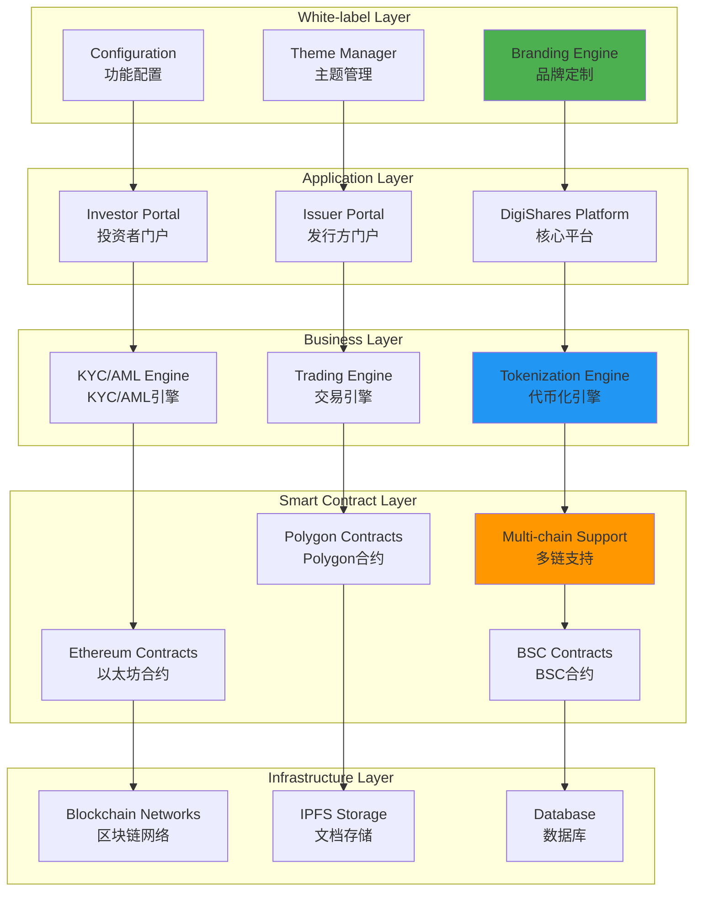
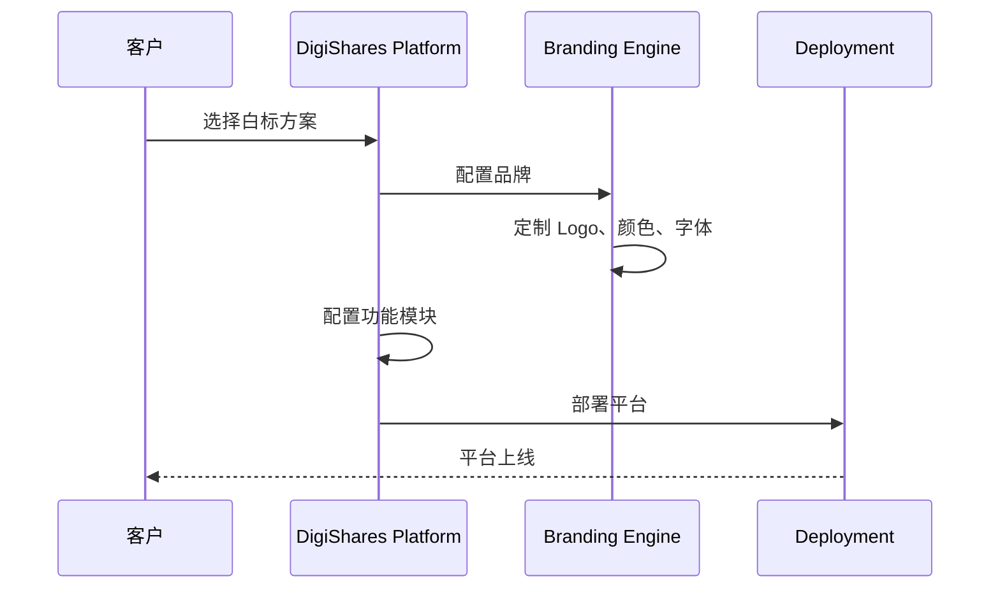
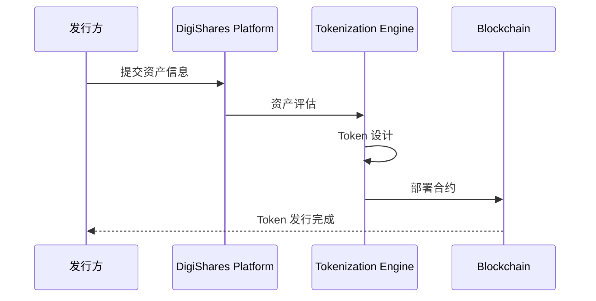
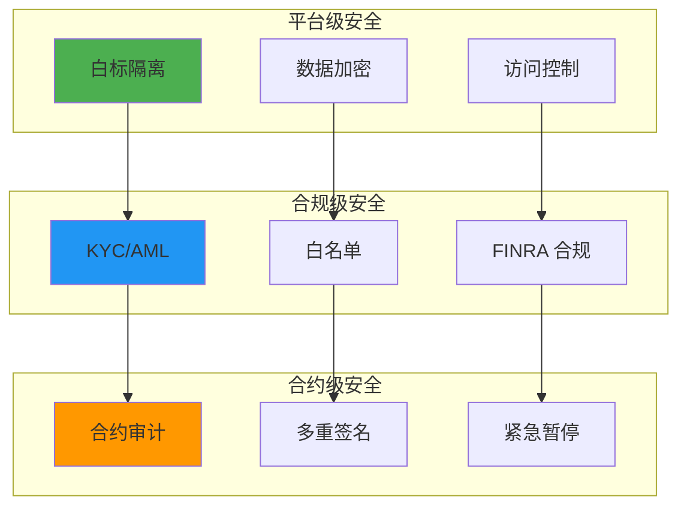

# DigiShares 技术架构分析

**文档版本**: v2.1
**创建时间**: 2025-10-14 09:38:00 CST
**文档类型**: 技术架构分析
**定位**: White-label Tokenization Platform
**信息来源**: DigiShares 官方网站 + 官方文档 + FINRA 监管要求

---

## 📑 目录

1. [系统整体架构](#1-系统整体架构)
2. [核心模块详解](#2-核心模块详解)
3. [技术选型分析](#3-技术选型分析)
4. [数据流程](#4-数据流程)
5. [安全架构](#5-安全架构)

---

## 1. 系统整体架构

### 1.1 DigiShares 整体架构



### 1.2 核心组件说明

| 组件                  | 职责           | 关键功能                       |
| --------------------- | -------------- | ------------------------------ |
| **Branding Engine**   | 品牌定制       | Logo、颜色、字体、布局         |
| **Tokenization Engine** | 资产代币化   | 资产评估、Token 发行、合规     |
| **KYC/AML Engine**    | KYC/AML        | 身份验证、反洗钱、风险评估     |
| **Trading Engine**    | 交易管理       | 订单匹配、结算、流动性管理     |
| **Multi-chain Support** | 多链支持     | Ethereum、Polygon、BSC         |

---

## 2. 核心模块详解

### 2.1 White-label Engine (白标引擎)

**核心功能**:
- 品牌定制(Logo、颜色、字体)
- 功能配置(模块开关、权限管理)
- 多语言支持(20+ 语言)
- 响应式设计(PC、移动端)

**定制选项**:
```
品牌定制:
- Logo 上传
- 主题颜色
- 字体选择
- 布局配置

功能配置:
- KYC 模块
- 交易模块
- 分红模块
- 治理模块
```

### 2.2 Tokenization Engine (代币化引擎)

**核心功能**:
- 资产评估
- Token 参数配置
- 智能合约部署
- 多链支持

**工作流程**:
```
资产评估 → Token 设计 → 合约部署 → 合规审核 → Token 发行
```

### 2.3 Multi-chain Support (多链支持)

**支持的区块链**:
- **Ethereum**: 主网和测试网
- **Polygon**: 低 Gas 费
- **BSC**: 高性能
- **其他链**: 可定制集成

**多链优势**:
- 降低 Gas 费
- 提高性能
- 扩大用户群
- 灵活选择

---

## 3. 技术选型分析

### 3.1 为什么选择多链架构

**优势**：
- ✅ **成本优化**：根据需求选择合适的链
- ✅ **性能提升**：高性能链提高用户体验
- ✅ **风险分散**：不依赖单一区块链
- ✅ **用户选择**：满足不同用户需求

**多链对比**：

| 特性       | Ethereum | Polygon | BSC |
| ---------- | -------- | ------- | --- |
| Gas 费     | ⭐⭐ | ⭐⭐⭐⭐⭐ | ⭐⭐⭐⭐ |
| 安全性     | ⭐⭐⭐⭐⭐ | ⭐⭐⭐⭐ | ⭐⭐⭐ |
| 生态成熟度 | ⭐⭐⭐⭐⭐ | ⭐⭐⭐⭐ | ⭐⭐⭐⭐ |
| 性能       | ⭐⭐⭐ | ⭐⭐⭐⭐⭐ | ⭐⭐⭐⭐⭐ |

---

## 4. 数据流程

### 4.1 白标平台部署流程



### 4.2 资产代币化流程



---

## 5. 安全架构

### 5.1 多层安全防护



---

## 📚 参考资源

- [DigiShares 官网](https://digishares.io)
- [DigiShares 文档](https://docs.digishares.io)
- [Ethereum 文档](https://ethereum.org/developers)
- [Polygon 文档](https://docs.polygon.technology)

---

**文档维护**: RWA-HUSD 技术团队  
**最后更新**: 2025-10-14 09:38:00 CST

