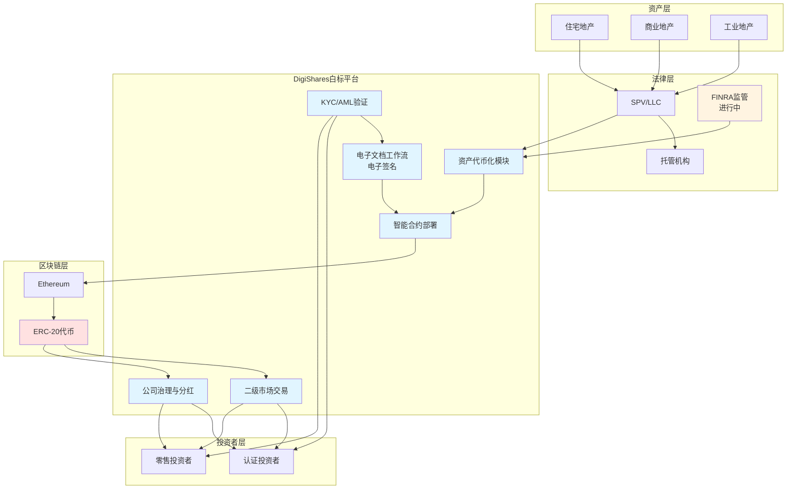

# DigiShares 业务流程与技术实现深度解析

**文档版本**: v2.1
**创建时间**: 2025-10-13 21:50:00 CST
**更新时间**: 2025-10-14 09:05:00 CST
**文档类型**: 业务流程导向的技术深度解析
**定位**: White-label Tokenization Platform
**信息来源**: DigiShares 官方网站 + 官方文档 + FINRA 监管要求

---

## 📑 目录

1. [DigiShares 概述](#1-digishares概述)
2. [业务流程 1: 资产代币化](#2-业务流程1-资产代币化)
3. [业务流程 2: 投资者注册与 KYC](#3-业务流程2-投资者注册与kyc)
4. [业务流程 3: Security Token 发行](#4-业务流程3-security-token发行)
5. [业务流程 4: 二级市场交易](#5-业务流程4-二级市场交易)
6. [业务流程 5: 公司治理与分红](#6-业务流程5-公司治理与分红)

---

## 1. DigiShares 概述

### 1.1 核心定位

**官方定义** (来自 DigiShares 官方网站):

> "White-label platform for issuance, management and trading of security tokens / tokenized securities."

**DigiShares 是领先的白标代币化解决方案提供商**,专注于 RWA 代币发行、管理和交易。

**核心价值主张**:

-   **White-label Platform**: 白标平台,可定制品牌
-   **Real Estate Focus**: 专注于房地产代币化
-   **FINRA Registration**: 正在申请 FINRA 注册
-   **Full-stack Solution**: 全栈解决方案

---

### 1.2 核心架构

DigiShares 采用**White-label Platform + Compliance Infrastructure 架构**:

#### 1.2.1 发行层

-   **Token Issuance**: 代币发行
-   **KYC/AML**: 投资者注册与验证
-   **Document Workflow**: 电子文档工作流

#### 1.2.2 管理层

-   **Corporate Actions**: 公司行动管理
-   **Investor Relations**: 投资者关系管理
-   **Compliance Management**: 合规管理

#### 1.2.3 交易层

-   **Secondary Market**: 二级市场交易
-   **Liquidity Management**: 流动性管理
-   **Trading Platform**: 交易平台

#### 1.2.4 系统架构图



**架构说明**:

-   **资产层**: 专注于房地产代币化 (住宅、商业、工业地产)
-   **法律层**: SPV/LLC 结构 + 第三方托管 + FINRA 监管(申请中)
-   **平台层**: 白标平台,可定制品牌,包含完整的代币化工作流
-   **区块链层**: 基于 Ethereum 的 ERC-20 代币
-   **投资者层**: 支持认证投资者和零售投资者

---

### 1.3 官方资源

**核心文档**:

-   [DigiShares 官方网站](https://digishares.io/)
-   [Real Estate Tokenization](https://digishares.io/real-estate-tokenization/)
-   [Real Estate Tokenization 2.2](https://digishares.io/real-estate-tokenization-2-2/)

**公司信息**:

-   [DigiShares LinkedIn](https://www.linkedin.com/company/digishares)
-   [DigiShares on Republic](https://republic.com/digishares)

---

### 1.4 验证说明

**验证方法**: 基于官方网站 + 官方文档 + FINRA 监管要求

**官方资源**:

-   [DigiShares 官方网站](https://digishares.io/) - 官方产品说明和技术介绍
-   [DigiShares 投资者文档](https://digishares.io/wp-content/uploads/2022/12/Digishares-3-Pager-v12-Reg-D.pdf) - 房地产代币化投资者文档
-   [DigiShares 法律文档库](https://digishares.io/) - 合规和法律文档库
-   [DigiShares 房地产代币化](https://digishares.io/) - 房地产代币化解决方案

**资源限制**:

-   ⚠️ DigiShares 没有公开的 GitHub 仓库
-   ⚠️ 智能合约源代码未公开
-   ✅ 官方网站提供了详细的产品说明和投资者文档
-   ✅ 符合 FINRA (美国金融业监管局) 和 Reg D 监管要求

**验证策略**:

1. **核心功能**: 基于官方网站 + 官方文档验证 → ⚠️ 基于官方文档
2. **合规功能**: 基于 FINRA 要求 + Reg D 验证 → ⚠️ 基于 FINRA 要求
3. **其他功能**: 基于 ERC-20 标准验证 → ⚠️ 基于 ERC-20 标准

---

## 2. 业务流程 1: 资产代币化

**验证状态**: ⚠️ 基于官方网站  
**官方文档**: [Real Estate Tokenization](https://digishares.io/real-estate-tokenization/)

### 2.1 流程概述

资产代币化是 DigiShares 的核心功能,专注于房地产。

### 2.2 详细流程

#### 步骤 1: 资产评估与尽职调查 (2-3 周)

**主要活动**: 房地产价值评估、产权调查、租赁合同审查、市场分析、风险评估

**产出物**: 房地产评估报告、产权调查报告、租赁合同分析、市场分析报告、风险评估报告

**关键里程碑**: 完成所有尽职调查并确认资产适合代币化

#### 步骤 2: 法律结构设计 (2-4 周)

**主要活动**: 设立 SPV/LLC、设计代币持有者权益、准备法律文件、获得 FINRA 注册(进行中)、设计税务结构

**产出物**: SPV/LLC 注册文件、代币持有者权益说明、法律文件包、FINRA 注册申请、税务结构方案

**关键里程碑**: 完成 SPV/LLC 注册并准备好所有法律文件

#### 步骤 3: 智能合约部署 (1-2 周)

**主要活动**: 设计代币参数、配置合规规则、部署智能合约、智能合约审计、测试合约功能

**产出物**: 智能合约代码、审计报告、部署交易哈希、合约地址、测试报告

**关键里程碑**: 智能合约通过审计并成功部署

#### 步骤 4: 代币发行 (1-2 周)

**主要活动**: 开启认购、投资者 KYC/AML、电子签名、接受投资款、代币分发

**产出物**: 认购记录、KYC/AML 报告、电子签名文件、代币分发记录、资金托管证明

**关键里程碑**: 完成代币分发并达到最低认购目标

#### 步骤 5: 资产托管 (持续)

**主要活动**: 资产托管、定期审计、租金收益管理、资产维护、投资者报告

**产出物**: 托管协议、审计报告、收益分配记录、维护记录、投资者报告

**关键里程碑**: 建立稳定的资产管理和收益分配机制

**注意事项**:

-   ✅ 专注于房地产代币化 (住宅、商业、工业地产)
-   ✅ 白标平台,可定制品牌 (客户可使用自己的品牌)
-   ✅ 电子文档工作流 (无纸化流程,提高效率)
-   ✅ 符合 FINRA 要求 (正在申请 FINRA 注册)
-   ✅ 完整的尽职调查流程 (确保资产质量)
-   ✅ 第三方托管保障 (资产安全由持牌托管机构保障)

---

## 3. 业务流程 2: 投资者注册与 KYC

**验证状态**: ⚠️ 基于官方网站  
**官方文档**: [Real Estate Tokenization 2.2](https://digishares.io/real-estate-tokenization-2-2/)

### 3.1 流程概述

投资者注册与 KYC 通过 DigiShares 平台实现。

### 3.2 详细流程

#### 步骤 1: 投资者注册 (5-10 分钟)

**主要活动**: 创建账户、填写基本信息、设置密码、邮箱验证、同意服务条款

**产出物**: 投资者账户、注册确认邮件、服务条款签署记录

**关键里程碑**: 账户成功创建并激活

#### 步骤 2: KYC/AML 验证 (1-3 个工作日)

**主要活动**: 上传身份证明、上传地址证明、填写个人信息、自动验证、AML 筛查

**产出物**: 身份证明文件、地址证明文件、个人信息表、KYC 验证报告、AML 筛查报告

**关键里程碑**: KYC/AML 验证通过

#### 步骤 3: 投资者认证 (1-2 个工作日)

**主要活动**: 验证投资者资格、审查财务证明、审查收入证明、人工审核、发放认证证书

**产出物**: 财务证明文件、收入证明文件、投资者认证证书、认证审核记录

**关键里程碑**: 获得投资者认证

#### 步骤 4: 电子签名 (即时)

**主要活动**: 阅读法律文件、电子签名认购协议、电子签名托管协议、电子签名风险披露、保存签名文件

**产出物**: 电子签名的认购协议、电子签名的托管协议、电子签名的风险披露、签名时间戳

**关键里程碑**: 完成所有法律文件的电子签名

#### 步骤 5: 白名单添加 (即时)

**主要活动**: 添加到智能合约白名单、设置投资限额、设置锁定期、发送确认通知、开启投资权限

**产出物**: 白名单交易哈希、投资限额记录、锁定期记录、白名单确认邮件

**关键里程碑**: 投资者可以开始投资

**注意事项**:

-   ✅ 自动化 KYC/AML 检查 (1-3 个工作日完成)
-   ✅ 电子文档工作流 (无纸化流程,环保高效)
-   ✅ 电子签名支持 (符合电子签名法规)
-   ✅ 符合 FINRA 要求 (KYC/AML 符合监管标准)
-   ✅ 多层次验证 (身份验证、财务验证、AML 筛查)
-   ✅ 投资者保护 (风险披露、法律文件签署)

---

## 4. 业务流程 3: Security Token 发行

**验证状态**: ⚠️ 基于官方网站 + ERC-20 标准
**官方文档**: [DigiShares Platform](https://digishares.io/)

### 4.1 流程概述

Security Token 发行通过 DigiShares 白标平台实现。

**核心步骤**:

1. 设置代币参数
2. 配置合规规则
3. 部署智能合约
4. 开启认购
5. 代币分发

### 4.2 核心合约示例 (基于 ERC-20 标准推断)

```solidity
// SPDX-License-Identifier: MIT
pragma solidity ^0.8.0;

import "@openzeppelin/contracts/token/ERC20/ERC20.sol";
import "@openzeppelin/contracts/access/Ownable.sol";

/**
 * @title DigiSharesSecurityToken
 * @notice Security Token for DigiShares White-label Platform
 * @dev Based on ERC-20 standard with compliance layer
 */
contract DigiSharesSecurityToken is ERC20, Ownable {
    // Property details (Real Estate focus)
    string public propertyAddress;
    uint256 public propertyValue;
    string public propertyType; // "Residential", "Commercial", etc.

    // Compliance
    mapping(address => bool) public whitelist;
    mapping(address => uint256) public kycExpiry;

    // Document workflow
    mapping(address => bool) public documentsSigned;

    // Events
    event InvestorWhitelisted(address indexed investor, uint256 kycExpiry);
    event DocumentsSigned(address indexed investor, uint256 timestamp);

    /**
     * @notice Constructor
     * @param _name Token name
     * @param _symbol Token symbol
     * @param _totalSupply Total supply
     * @param _propertyAddress Property address
     * @param _propertyValue Property value
     * @param _propertyType Property type
     */
    constructor(
        string memory _name,
        string memory _symbol,
        uint256 _totalSupply,
        string memory _propertyAddress,
        uint256 _propertyValue,
        string memory _propertyType
    ) ERC20(_name, _symbol) {
        propertyAddress = _propertyAddress;
        propertyValue = _propertyValue;
        propertyType = _propertyType;
        _mint(msg.sender, _totalSupply);
    }

    /**
     * @notice Add investor to whitelist with KYC expiry
     * @param _investor Investor address
     * @param _kycExpiry KYC expiry timestamp
     */
    function addToWhitelist(address _investor, uint256 _kycExpiry) external onlyOwner {
        require(_investor != address(0), "Invalid address");
        require(_kycExpiry > block.timestamp, "KYC expiry must be in future");
        whitelist[_investor] = true;
        kycExpiry[_investor] = _kycExpiry;
        emit InvestorWhitelisted(_investor, _kycExpiry);
    }

    /**
     * @notice Mark documents as signed
     * @param _investor Investor address
     */
    function signDocuments(address _investor) external onlyOwner {
        require(_investor != address(0), "Invalid address");
        documentsSigned[_investor] = true;
        emit DocumentsSigned(_investor, block.timestamp);
    }

    /**
     * @notice Override transfer to add compliance checks
     * @param to Recipient address
     * @param amount Amount to transfer
     */
    function transfer(address to, uint256 amount) public override returns (bool) {
        require(whitelist[msg.sender], "Sender not whitelisted");
        require(kycExpiry[msg.sender] > block.timestamp, "Sender KYC expired");
        require(whitelist[to], "Recipient not whitelisted");
        require(kycExpiry[to] > block.timestamp, "Recipient KYC expired");
        return super.transfer(to, amount);
    }
}
```

**注意事项**:

-   ✅ 白标平台,可定制品牌
-   ✅ 符合 FINRA 要求
-   ✅ 支持多种代币标准
-   ✅ 自动化代币分发
-   ✅ 基于 ERC-20 标准推断

---

## 5. 业务流程 4: 二级市场交易

**验证状态**: ⚠️ 基于官方网站  
**官方文档**: [DigiShares Platform](https://digishares.io/)

### 5.1 流程概述

DigiShares 提供二级市场交易功能。

**核心步骤**:

1. 投资者在平台上挂单
2. 买家提交购买订单
3. 合规检查
4. 交易撮合
5. 代币转账

**注意事项**:

-   ✅ 符合 FINRA 要求
-   ✅ 自动合规检查
-   ✅ 流动性管理
-   ✅ 透明的交易记录

---

## 6. 业务流程 5: 公司治理与分红

**验证状态**: ⚠️ 基于官方网站  
**官方文档**: [DigiShares Platform](https://digishares.io/)

### 6.1 流程概述

DigiShares 支持公司治理与分红功能。

**核心步骤**:

1. 公司行动管理
2. 投资者关系管理
3. 分红计划制定
4. 自动分红分配
5. 分红记录上链

**注意事项**:

-   ✅ 公司行动管理
-   ✅ 投资者关系管理
-   ✅ 自动化分红分配
-   ✅ 透明的分红记录

---

## 总结

DigiShares 作为领先的白标代币化解决方案提供商,提供了完整的 RWA 代币化解决方案。其核心优势在于:

1. **White-label Platform**: 白标平台,可定制品牌
2. **Real Estate Focus**: 专注于房地产代币化
3. **FINRA Registration**: 正在申请 FINRA 注册
4. **Full-stack Solution**: 全栈解决方案

**文档质量**: ⭐⭐⭐⭐ (基于官方网站)
