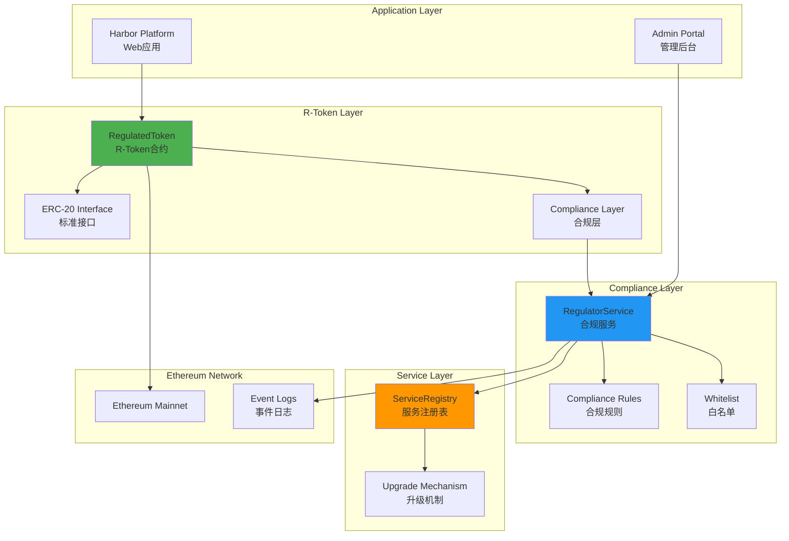
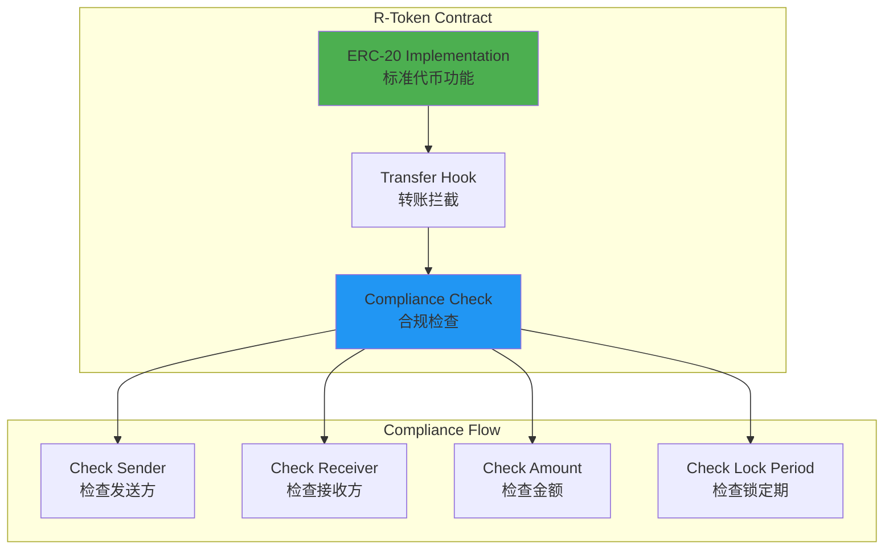
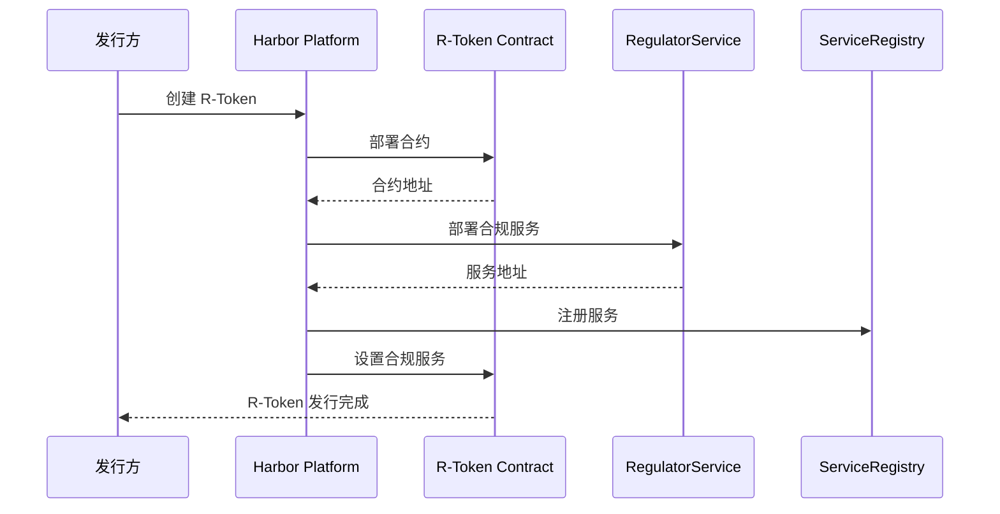
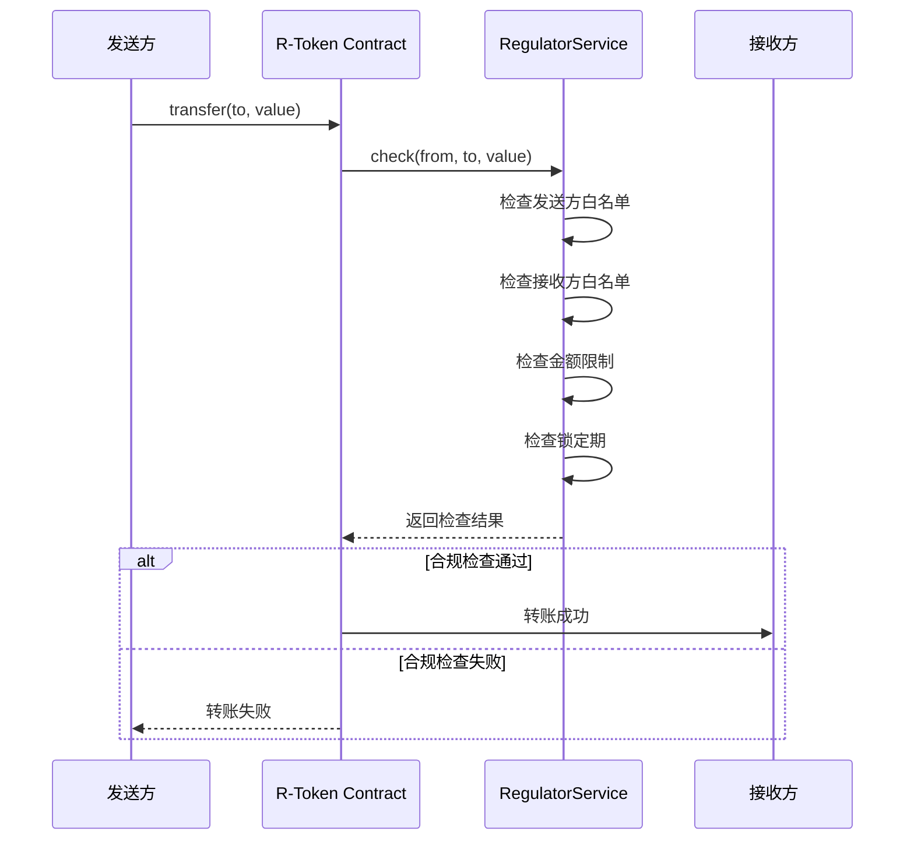
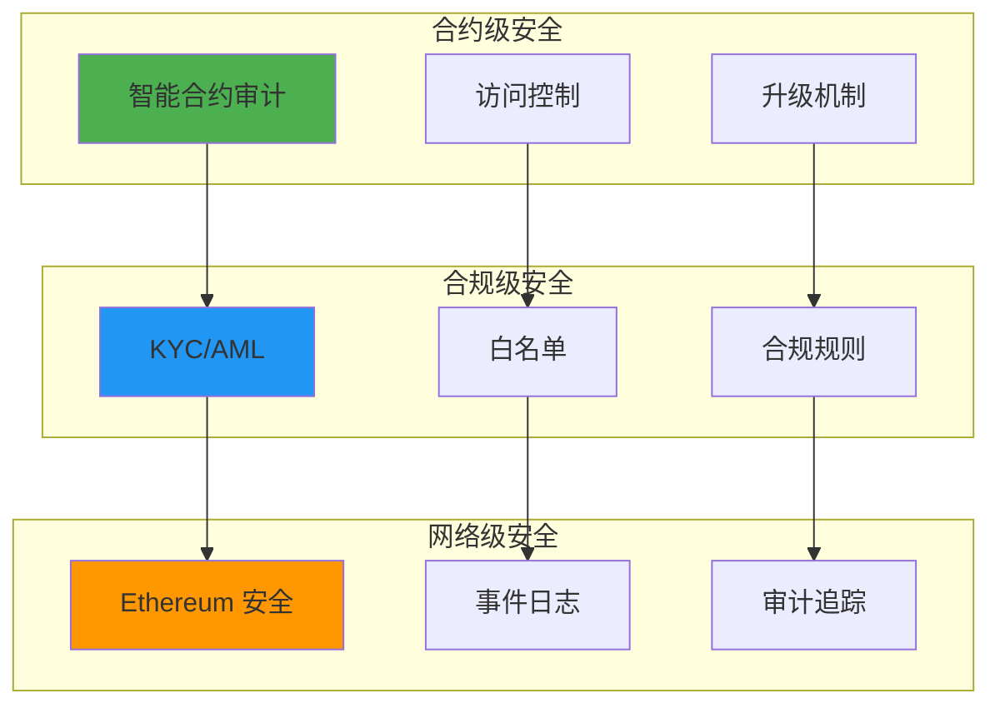

# Harbor 技术架构分析

**文档版本**: v2.1
**创建时间**: 2025-10-14 09:33:00 CST
**文档类型**: 技术架构分析
**定位**: R-Token Standard Compliance Platform
**信息来源**: GitHub 官方合约 + R-Token 标准

---

## 📑 目录

1. [系统整体架构](#1-系统整体架构)
2. [R-Token 架构](#2-r-token架构)
3. [核心模块详解](#3-核心模块详解)
4. [技术选型分析](#4-技术选型分析)
5. [数据流程](#5-数据流程)
6. [安全架构](#6-安全架构)

---

## 1. 系统整体架构

### 1.1 Harbor 整体架构



### 1.2 核心组件说明

| 组件                  | 职责           | 关键功能                       |
| --------------------- | -------------- | ------------------------------ |
| **RegulatedToken**    | R-Token 合约   | ERC-20 + 合规层                |
| **RegulatorService**  | 合规服务       | 合规规则检查、白名单管理       |
| **ServiceRegistry**   | 服务注册表     | 服务发现、版本管理、升级机制   |
| **Compliance Rules**  | 合规规则引擎   | 多维度规则检查、灵活配置       |
| **Whitelist**         | 白名单管理     | 投资者白名单、KYC/AML 验证     |
| **Event Logs**        | 事件日志       | 审计追踪、合规记录             |

### 1.3 技术栈

**区块链层**：
- Ethereum Mainnet
- Solidity ^0.4.18
- ERC-20 标准

**智能合约层**：
- RegulatedToken.sol
- RegulatorService.sol
- ServiceRegistry.sol

**应用层**：
- React + TypeScript
- Web3.js / ethers.js
- IPFS (文档存储)

---

## 2. R-Token 架构

### 2.1 R-Token 结构



### 2.2 R-Token 核心特性

**ERC-20 兼容性**：
- `transfer()`: 转账(带合规检查)
- `transferFrom()`: 授权转账(带合规检查)
- `approve()`: 授权
- `balanceOf()`: 查询余额
- `totalSupply()`: 查询总供应量

**合规层扩展**：
- `check()`: 合规检查接口
- `setRegulatorService()`: 设置合规服务
- `mint()`: 铸造(仅发行方)
- `burn()`: 销毁(仅发行方)

---

## 3. 核心模块详解

### 3.1 RegulatedToken 合约

**职责**: R-Token 核心合约

**核心方法**:

```solidity
// 转账(带合规检查)
function transfer(address to, uint256 value) public returns (bool) {
    require(_check(msg.sender, to, value), "Transfer not allowed");
    return super.transfer(to, value);
}

// 合规检查
function _check(address from, address to, uint256 value) private returns (bool) {
    return regulatorService.check(this, from, to, value);
}

// 设置合规服务
function setRegulatorService(address _service) public onlyOwner {
    regulatorService = RegulatorService(_service);
}
```

### 3.2 RegulatorService 合约

**职责**: 合规规则引擎

**核心方法**:

```solidity
// 合规检查
function check(
    address token,
    address from,
    address to,
    uint256 value
) public returns (bool) {
    // 检查发送方
    if (!isWhitelisted(from)) return false;
    
    // 检查接收方
    if (!isWhitelisted(to)) return false;
    
    // 检查金额限制
    if (value > maxTransferAmount) return false;
    
    // 检查锁定期
    if (isLocked(from)) return false;
    
    return true;
}

// 白名单管理
function addToWhitelist(address investor) public onlyOwner {
    whitelist[investor] = true;
}
```

### 3.3 ServiceRegistry 合约

**职责**: 服务注册表

**核心方法**:

```solidity
// 注册服务
function registerService(string name, address service) public onlyOwner {
    services[name] = service;
}

// 获取服务
function getService(string name) public view returns (address) {
    return services[name];
}

// 升级服务
function upgradeService(string name, address newService) public onlyOwner {
    services[name] = newService;
}
```

---

## 4. 技术选型分析

### 4.1 为什么选择 Ethereum

**优势**：
- ✅ **成熟生态**：最大的智能合约平台
- ✅ **ERC-20 标准**：广泛支持
- ✅ **安全性**：经过验证的网络
- ✅ **流动性**：最大的 DeFi 生态

**Ethereum vs 其他方案**：

| 特性       | Ethereum | BSC | Polygon |
| ---------- | -------- | --- | ------- |
| 安全性     | ⭐⭐⭐⭐⭐ | ⭐⭐⭐ | ⭐⭐⭐⭐ |
| 生态成熟度 | ⭐⭐⭐⭐⭐ | ⭐⭐⭐⭐ | ⭐⭐⭐⭐ |
| Gas 费     | ⭐⭐ | ⭐⭐⭐⭐⭐ | ⭐⭐⭐⭐ |
| 合规性     | ⭐⭐⭐⭐⭐ | ⭐⭐⭐ | ⭐⭐⭐⭐ |

### 4.2 R-Token 标准优势

**设计理念**：
- ERC-20 兼容性
- 合规层分离
- 灵活的规则配置
- 可升级的服务

**vs 其他标准**：

| 特性       | R-Token | ERC-1400 | ERC-3643 |
| ---------- | ------- | -------- | -------- |
| ERC-20 兼容 | ✅ | ✅ | ✅ |
| 合规检查   | ✅ | ✅ | ✅ |
| 可升级     | ✅ | ❌ | ✅ |
| 简洁性     | ⭐⭐⭐⭐⭐ | ⭐⭐⭐ | ⭐⭐⭐⭐ |

---

## 5. 数据流程

### 5.1 R-Token 发行流程



### 5.2 转账流程



---

## 6. 安全架构

### 6.1 多层安全防护



### 6.2 风险管理

**风险类型**：
1. **合规风险**：违反 SEC 规定
2. **技术风险**：智能合约漏洞
3. **操作风险**：人为错误

**风险缓释措施**：
- ✅ 智能合约审计
- ✅ 多重签名
- ✅ 时间锁定
- ✅ 紧急暂停

---

## 📚 参考资源

- [Harbor GitHub](https://github.com/harborhq/r-token)
- [R-Token 标准](https://harbor.com/r-token)
- [Ethereum 文档](https://ethereum.org/developers)
- [ERC-20 标准](https://eips.ethereum.org/EIPS/eip-20)

---

**文档维护**: RWA-HUSD 技术团队  
**最后更新**: 2025-10-14 09:33:00 CST

