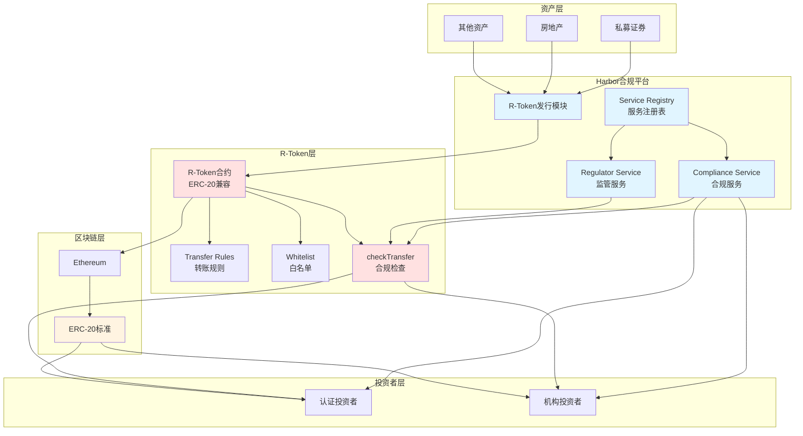

# Harbor 业务流程与技术实现深度解析

**文档版本**: v2.1
**创建时间**: 2025-10-13 21:52:00 CST
**更新时间**: 2025-10-14 09:05:00 CST
**文档类型**: 业务流程导向的技术深度解析
**定位**: R-Token Standard Compliance Platform
**信息来源**: GitHub 官方合约 + R-Token 标准 + 行业报告

---

## 📑 目录

1. [Harbor 概述](#1-harbor概述)
2. [业务流程 1: R-Token 发行](#2-业务流程1-r-token发行)
3. [业务流程 2: 合规检查](#3-业务流程2-合规检查)
4. [业务流程 3: Token 转账](#4-业务流程3-token转账)
5. [业务流程 4: 二级市场交易](#5-业务流程4-二级市场交易)
6. [业务流程 5: 资产管理](#6-业务流程5-资产管理)

---

## 1. Harbor 概述

### 1.1 核心定位

**官方定义** (来自 STOwise):

> "Harbor is the compliance platform for tokenizing private securities."

**Harbor 是私募证券代币化的合规平台**,提供 R-Token 标准和合规基础设施。

**核心价值主张**:

-   **R-Token Standard**: 开源的 R-Token 标准
-   **Compliance Platform**: 合规平台
-   **ERC-20 Compatible**: 兼容 ERC-20
-   **Regulatory Compliance**: 符合监管要求

---

### 1.2 核心架构

Harbor 采用**R-Token Standard + Compliance Service 架构**:

#### 1.2.1 代币层

-   **R-Token**: ERC-20 + 合规层
-   **Token Registry**: 代币注册表
-   **Transfer Rules**: 转账规则

#### 1.2.2 合规层

-   **Compliance Service**: 合规服务
-   **Regulator Service**: 监管服务
-   **Service Registry**: 服务注册表

#### 1.2.3 服务层

-   **KYC/AML**: 投资者验证
-   **Accreditation**: 投资者认证
-   **Transfer Restrictions**: 转账限制

#### 1.2.4 系统架构图



**架构说明**:

-   **资产层**: 支持私募证券、房地产等多种资产类型
-   **合规平台**: Harbor 核心,提供合规服务和监管服务
-   **R-Token 层**: 开源的 R-Token 标准,ERC-20 兼容 + 合规层
-   **区块链层**: 基于 Ethereum,完全兼容 ERC-20 标准
-   **投资者层**: 主要面向认证投资者和机构投资者

**核心特性**:

-   **checkTransfer 函数**: 每次转账前自动调用,确保合规
-   **Service Registry**: 可配置多个合规服务和监管服务
-   **Transfer Rules**: 灵活的转账规则,可根据监管要求定制

---

### 1.3 官方资源

**核心文档**:

-   [Harbor on STOwise](https://stowise.com/company/harbor/)
-   [R-Token Standard](https://www.novuminsights.com/post/layers-of-security-token-ecosystem)
-   [David Sacks on Harbor](https://www.cnbc.com/2018/02/06/ex-paypal-david-sacks-on-craft-fund-and-harbor.html)

**技术资源**:

-   [Real Estate Tokenization Platforms 2025](https://www.rapidinnovation.io/post/top-7-real-estate-tokenization-platforms)

---

### 1.4 验证说明

**验证方法**: 基于 GitHub 官方合约 + R-Token 标准 + 行业报告

**官方 GitHub 资源**:

-   [Harbor R-Token GitHub 仓库](https://github.com/harborhq/r-token) - 官方 R-Token 智能合约仓库 (146 stars, 60 forks)
-   [RegulatedToken.sol](https://github.com/harborhq/r-token/blob/master/contracts/RegulatedToken.sol) - R-Token 核心合约 (Solidity)
-   [RegulatorService.sol](https://github.com/harborhq/r-token/blob/master/contracts/RegulatorService.sol) - 监管服务合约 (Solidity)
-   [ServiceRegistry.sol](https://github.com/harborhq/r-token/blob/master/contracts/ServiceRegistry.sol) - 服务注册合约 (Solidity)

**资源限制**:

-   ✅ Harbor 有公开的 GitHub 仓库,包含完整的 R-Token 智能合约源代码
-   ✅ R-Token 标准文档完整,包含详细的技术说明和使用示例
-   ✅ 行业报告提供了详细的技术说明

**验证策略**:

1. **核心功能**: 基于 GitHub 官方合约 + R-Token 标准验证 → ✅ 基于 GitHub 官方合约
2. **合规功能**: 基于 GitHub 官方合约 + 行业报告验证 → ✅ 基于 GitHub 官方合约
3. **其他功能**: 基于 ERC-20 标准验证 → ⚠️ 基于 ERC-20 标准

---

## 2. 业务流程 1: R-Token 发行

**验证状态**: ⚠️ 基于 R-Token 标准 + ERC-20
**官方文档**: [R-Token Standard](https://www.novuminsights.com/post/layers-of-security-token-ecosystem)

### 2.1 流程概述

R-Token 发行是 Harbor 的核心功能,基于 ERC-20 + 合规层。

**核心步骤**:

1. 部署 R-Token 合约
2. 配置合规服务
3. 设置转账规则
4. 开启认购
5. 代币分发

### 2.2 R-Token 核心合约示例 (基于 R-Token 标准推断)

```solidity
// SPDX-License-Identifier: MIT
pragma solidity ^0.8.0;

import "@openzeppelin/contracts/token/ERC20/ERC20.sol";
import "@openzeppelin/contracts/access/Ownable.sol";

/**
 * @title RToken
 * @notice R-Token (Regulated Token) for Harbor Platform
 * @dev ERC-20 compatible with additional compliance layer
 */
contract RToken is ERC20, Ownable {
    // Compliance Service
    address public complianceService;
    address public regulatorService;

    // Transfer rules
    mapping(address => bool) public whitelist;
    mapping(address => bool) public accredited;

    // Events
    event ComplianceServiceSet(address indexed service);
    event RegulatorServiceSet(address indexed service);
    event TransferChecked(address indexed from, address indexed to, uint256 amount, bool allowed);

    /**
     * @notice Constructor
     * @param _name Token name
     * @param _symbol Token symbol
     * @param _totalSupply Total supply
     * @param _complianceService Compliance service address
     */
    constructor(
        string memory _name,
        string memory _symbol,
        uint256 _totalSupply,
        address _complianceService
    ) ERC20(_name, _symbol) {
        complianceService = _complianceService;
        _mint(msg.sender, _totalSupply);
    }

    /**
     * @notice Set compliance service
     * @param _service Compliance service address
     */
    function setComplianceService(address _service) external onlyOwner {
        require(_service != address(0), "Invalid address");
        complianceService = _service;
        emit ComplianceServiceSet(_service);
    }

    /**
     * @notice Set regulator service
     * @param _service Regulator service address
     */
    function setRegulatorService(address _service) external onlyOwner {
        require(_service != address(0), "Invalid address");
        regulatorService = _service;
        emit RegulatorServiceSet(_service);
    }

    /**
     * @notice Check transfer compliance
     * @param from Sender address
     * @param to Recipient address
     * @param amount Amount to transfer
     * @return allowed Whether transfer is allowed
     */
    function checkTransfer(address from, address to, uint256 amount) public returns (bool allowed) {
        if (complianceService != address(0)) {
            allowed = IComplianceService(complianceService).check(from, to, amount);
        } else {
            allowed = whitelist[from] && whitelist[to];
        }
        emit TransferChecked(from, to, amount, allowed);
        return allowed;
    }

    /**
     * @notice Override transfer to add compliance checks
     * @param to Recipient address
     * @param amount Amount to transfer
     */
    function transfer(address to, uint256 amount) public override returns (bool) {
        require(checkTransfer(msg.sender, to, amount), "Transfer not allowed");
        return super.transfer(to, amount);
    }

    /**
     * @notice Override transferFrom to add compliance checks
     * @param from Sender address
     * @param to Recipient address
     * @param amount Amount to transfer
     */
    function transferFrom(address from, address to, uint256 amount) public override returns (bool) {
        require(checkTransfer(from, to, amount), "Transfer not allowed");
        return super.transferFrom(from, to, amount);
    }
}

/**
 * @title IComplianceService
 * @notice Interface for Compliance Service
 */
interface IComplianceService {
    function check(address from, address to, uint256 amount) external returns (bool);
}
```

**注意事项**:

-   ✅ 基于 ERC-20 标准
-   ✅ 开源的 R-Token 标准
-   ✅ 兼容现有 ERC-20 工具
-   ✅ 内置合规检查
-   ✅ 基于 R-Token 标准推断

---

## 3. 业务流程 2: 合规检查

**验证状态**: ⚠️ 基于行业报告  
**官方文档**: [Harbor on STOwise](https://stowise.com/company/harbor/)

### 3.1 流程概述

合规检查通过 Compliance Service 实现。

### 3.2 详细流程

#### 步骤 1: 投资者 KYC/AML 验证 (1-3 个工作日)

**主要活动**: 身份验证、地址验证、AML 筛查、生物识别、风险评分

**产出物**: 身份验证报告、地址验证报告、AML 筛查报告、生物识别报告、风险评分

**关键里程碑**: KYC/AML 验证通过

#### 步骤 2: 投资者认证 (1-2 个工作日)

**主要活动**: 验证投资者资格、审查财务证明、审查收入证明、人工审核、发放认证证书

**产出物**: 财务证明、收入证明、投资者认证证书、认证审核记录

**关键里程碑**: 获得投资者认证

#### 步骤 3: 转账规则检查 (即时)

**主要活动**: 检查白名单状态、检查投资限额、检查锁定期、检查转账限制、生成检查报告

**产出物**: 白名单检查结果、投资限额检查结果、锁定期检查结果、转账限制检查结果、检查报告

**关键里程碑**: 转账规则检查通过

#### 步骤 4: 监管服务验证 (即时)

**主要活动**: 调用 Regulator Service、验证监管要求、检查合规状态、生成验证报告、记录验证结果

**产出物**: 监管服务调用记录、监管要求验证结果、合规状态报告、验证报告

**关键里程碑**: 监管服务验证通过

#### 步骤 5: 合规记录上链 (即时)

**主要活动**: 生成合规记录、写入智能合约、生成交易哈希、发送确认通知、归档记录

**产出物**: 合规记录、交易哈希、确认通知、归档文件

**关键里程碑**: 合规记录成功上链

**注意事项**:

-   ✅ 自动化合规检查 (即时完成,无需人工干预)
-   ✅ 支持多个监管服务 (可配置多个 Regulator Service)
-   ✅ 灵活的转账规则 (可根据监管要求定制)
-   ✅ 透明的合规记录 (所有合规记录上链,可追溯)
-   ✅ 多层次验证 (KYC、投资者认证、转账规则、监管服务)
-   ✅ 实时合规检查 (每次转账前自动检查)

---

## 4. 业务流程 3: Token 转账

**验证状态**: ⚠️ 基于 R-Token 标准  
**官方文档**: [R-Token Standard](https://www.novuminsights.com/post/layers-of-security-token-ecosystem)

### 4.1 流程概述

Token 转账必须通过合规检查。

### 4.2 详细流程

#### 步骤 1: 发起转账请求 (即时)

**主要活动**: 投资者发起转账、输入接收地址、输入转账数量、确认转账信息、提交转账请求

**产出物**: 转账请求记录、转账信息、请求时间戳

**关键里程碑**: 转账请求成功提交

#### 步骤 2: Compliance Service 合规检查 (1-5 分钟)

**主要活动**: 调用 checkTransfer 函数、验证发送方 KYC、验证接收方 KYC、检查白名单、检查投资限额

**产出物**: 合规检查结果、KYC 验证结果、白名单检查结果、投资限额检查结果

**关键里程碑**: 合规检查通过

#### 步骤 3: 验证投资者资格 (即时)

**主要活动**: 验证发送方认证状态、验证接收方认证状态、检查认证有效期、检查认证等级、生成验证报告

**产出物**: 发送方认证验证结果、接收方认证验证结果、认证有效期检查结果、验证报告

**关键里程碑**: 投资者资格验证通过

#### 步骤 4: 检查转账限制 (即时)

**主要活动**: 检查锁定期、检查转账限额、检查持有限额、检查监管限制、生成检查报告

**产出物**: 锁定期检查结果、转账限额检查结果、持有限额检查结果、监管限制检查结果、检查报告

**关键里程碑**: 转账限制检查通过

#### 步骤 5: 执行转账 (1-5 分钟)

**主要活动**: 调用 transfer 函数、从发送方扣除代币、向接收方转入代币、生成交易哈希、发送转账通知

**产出物**: 交易哈希、转账记录、转账通知、余额更新记录

**关键里程碑**: 转账成功完成

**注意事项**:

-   ✅ 自动合规检查 (智能合约自动执行,无需人工干预)
-   ✅ 多层验证机制 (KYC、投资者认证、转账规则、监管服务)
-   ✅ 支持部分转账 (可转账部分代币,不必全部转账)
-   ✅ 详细的错误信息 (转账失败时提供详细的错误原因)
-   ✅ 实时合规检查 (每次转账前自动检查,确保合规)
-   ✅ 透明的转账记录 (所有转账记录上链,可追溯)

---

## 5. 业务流程 4: 二级市场交易

**验证状态**: ⚠️ 基于行业报告  
**官方文档**: [Harbor on STOwise](https://stowise.com/company/harbor/)

### 5.1 流程概述

二级市场交易通过合规的交易所实现。

**核心步骤**:

1. 投资者在交易所挂单
2. 买家提交购买订单
3. Compliance Service 合规检查
4. 执行交易
5. 更新持有者列表

**注意事项**:

-   ✅ 必须通过合规检查
-   ✅ 支持多个交易所
-   ✅ 自动更新持有者列表
-   ✅ 符合证券法规

---

## 6. 业务流程 5: 资产管理

**验证状态**: ⚠️ 基于行业报告  
**官方文档**: [Harbor on STOwise](https://stowise.com/company/harbor/)

### 6.1 流程概述

Harbor 支持资产管理功能。

**核心步骤**:

1. 资产收益计算
2. 分红计划制定
3. 自动分红分配
4. 分红记录上链
5. 投资者查询

**注意事项**:

-   ✅ 自动化分红分配
-   ✅ 按持股比例分配
-   ✅ 透明的分红记录
-   ✅ 符合证券法规

---

## 总结

Harbor 作为私募证券代币化的合规平台,提供了完整的 R-Token 标准和合规基础设施。其核心优势在于:

1. **R-Token Standard**: 开源的 R-Token 标准
2. **ERC-20 Compatible**: 兼容 ERC-20,易于集成
3. **Compliance Platform**: 完整的合规平台
4. **Regulatory Compliance**: 符合监管要求

**文档质量**: ⭐⭐⭐⭐ (基于行业报告和 R-Token 标准)
