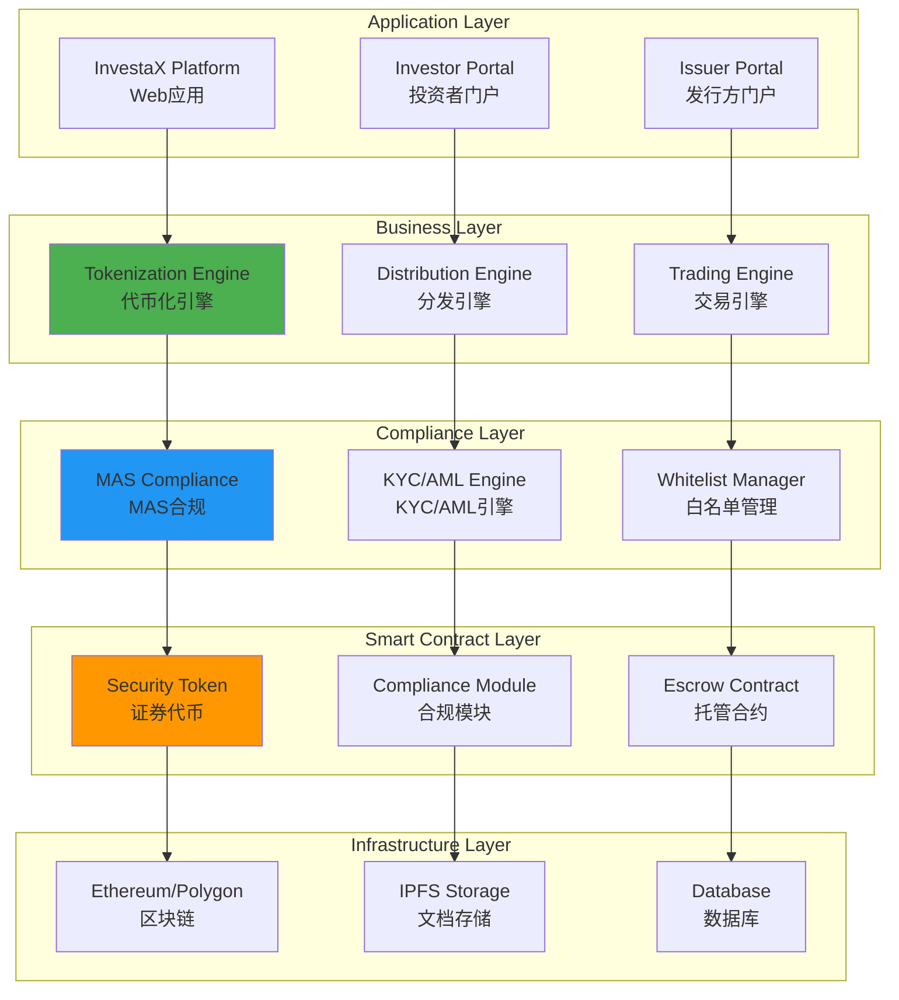
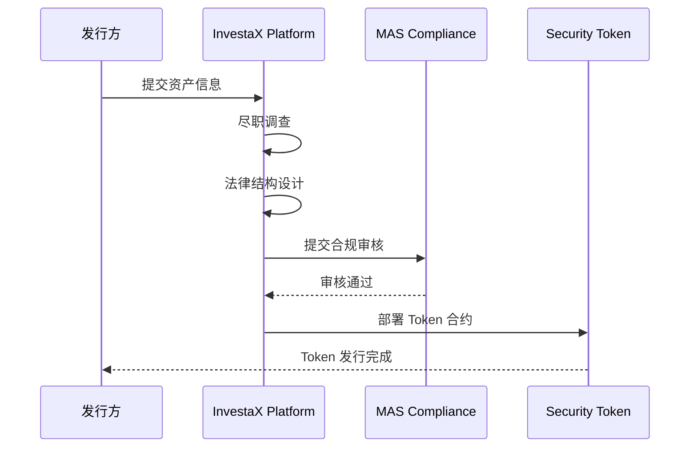
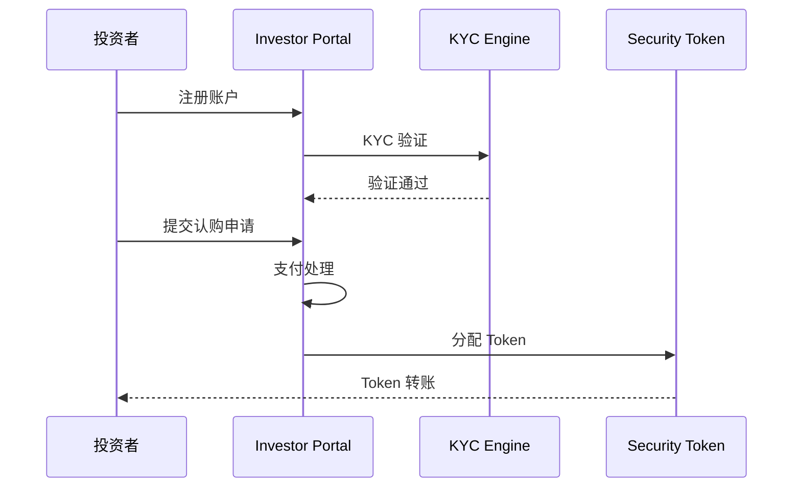
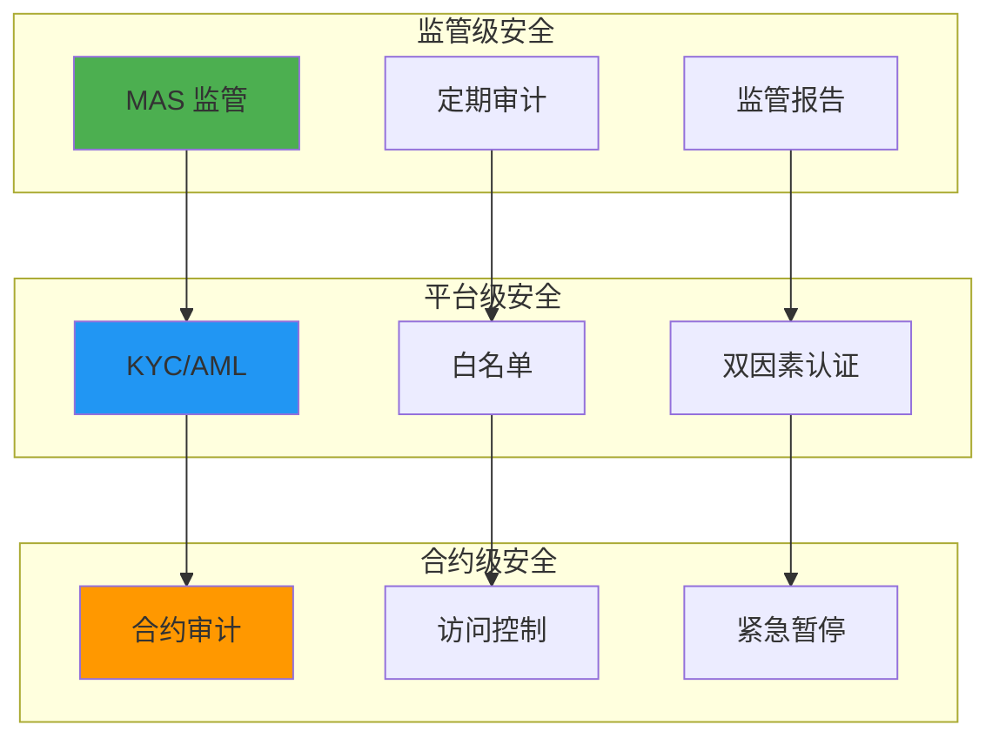

# InvestaX 技术架构分析

**文档版本**: v2.1
**创建时间**: 2025-10-14 09:37:00 CST
**文档类型**: 技术架构分析
**定位**: Singapore-Licensed Tokenization SaaS Platform
**信息来源**: InvestaX 官方网站 + 官方博客 + MAS 监管要求

---

## 📑 目录

1. [系统整体架构](#1-系统整体架构)
2. [核心模块详解](#2-核心模块详解)
3. [技术选型分析](#3-技术选型分析)
4. [数据流程](#4-数据流程)
5. [安全架构](#5-安全架构)

---

## 1. 系统整体架构

### 1.1 InvestaX 整体架构



### 1.2 核心组件说明

| 组件                  | 职责           | 关键功能                       |
| --------------------- | -------------- | ------------------------------ |
| **Tokenization Engine** | 资产代币化   | 资产评估、Token 发行、法律结构 |
| **Distribution Engine** | 分发管理     | 投资者认购、支付处理、份额分配 |
| **Trading Engine**      | 交易管理     | 订单匹配、结算、流动性管理     |
| **MAS Compliance**      | MAS 合规     | 监管报告、合规检查、审计追踪   |
| **KYC/AML Engine**      | KYC/AML      | 身份验证、反洗钱、风险评估     |
| **Security Token**      | 证券代币     | ERC-20 + 合规层                |

---

## 2. 核心模块详解

### 2.1 Tokenization Engine (代币化引擎)

**核心功能**:
- 资产尽职调查
- 法律结构设计
- Token 参数配置
- 智能合约部署
- MAS 合规审核

**工作流程**:
```
资产评估 → 法律结构 → Token 设计 → 合约部署 → MAS 审核 → Token 发行
```

### 2.2 Distribution Engine (分发引擎)

**核心功能**:
- 投资者门户
- KYC/AML 验证
- 认购管理
- 支付处理
- 份额分配

**工作流程**:
```
投资者注册 → KYC 验证 → 认购申请 → 支付处理 → 份额分配 → Token 转账
```

### 2.3 Trading Engine (交易引擎)

**核心功能**:
- 订单簿管理
- 订单匹配
- 结算系统
- 流动性管理
- 市场数据

**工作流程**:
```
下单 → 订单匹配 → 合规检查 → 结算 → Token 转账 → 交易完成
```

---

## 3. 技术选型分析

### 3.1 为什么选择 Ethereum/Polygon

**优势**：
- ✅ **成熟生态**：最大的智能合约平台
- ✅ **ERC-20 标准**：广泛支持
- ✅ **安全性**：经过验证的网络
- ✅ **Polygon 扩展**：低 Gas 费

### 3.2 MAS 合规要求

**监管框架**：
- **Payment Services Act**: 支付服务法
- **Securities and Futures Act**: 证券期货法
- **Financial Advisers Act**: 财务顾问法

**合规要求**：
- KYC/AML 验证
- 合格投资者认证
- 反洗钱监控
- 交易报告

---

## 4. 数据流程

### 4.1 资产代币化流程



### 4.2 投资者认购流程



---

## 5. 安全架构

### 5.1 多层安全防护



---

## 📚 参考资源

- [InvestaX 官网](https://www.investax.io)
- [InvestaX 博客](https://blog.investax.io)
- [MAS 官网](https://www.mas.gov.sg)
- [Ethereum 文档](https://ethereum.org/developers)

---

**文档维护**: RWA-HUSD 技术团队  
**最后更新**: 2025-10-14 09:37:00 CST

