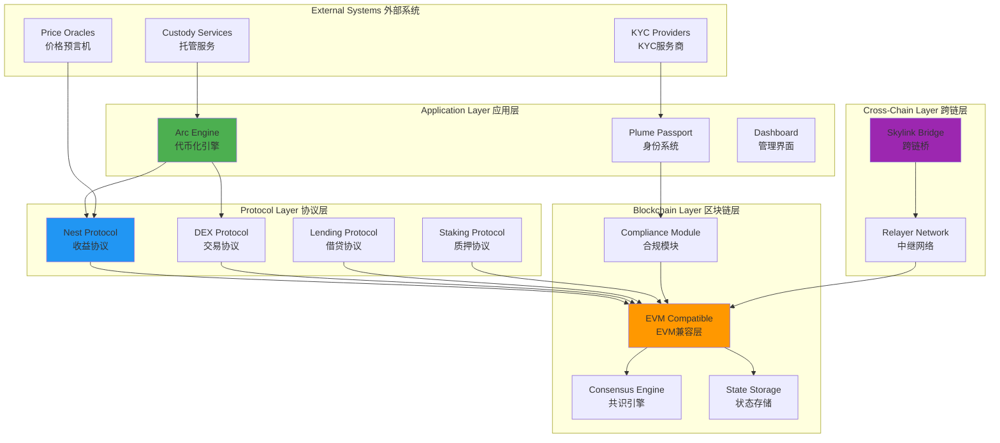
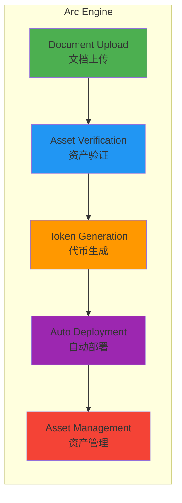
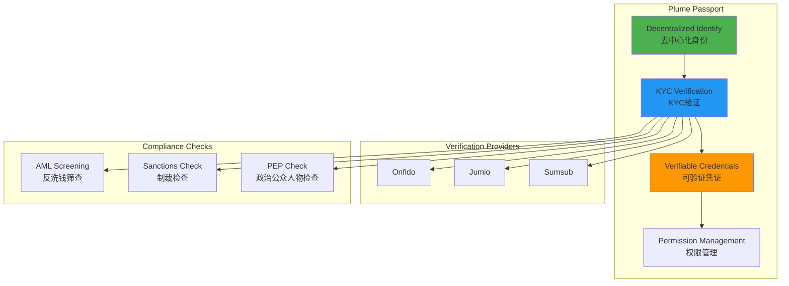
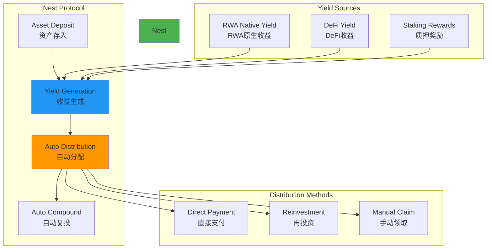
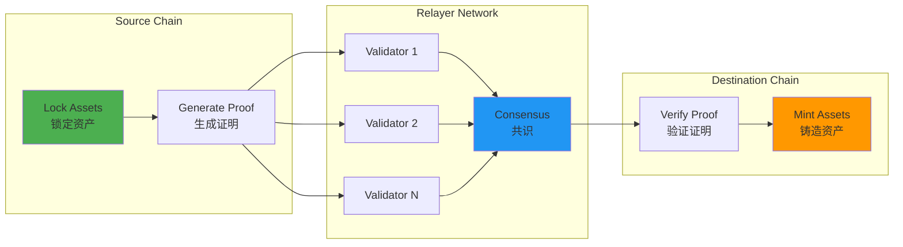
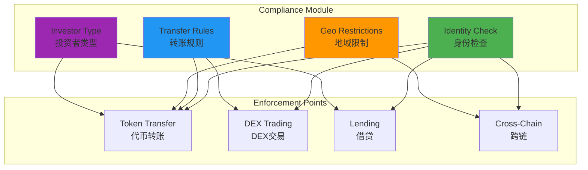
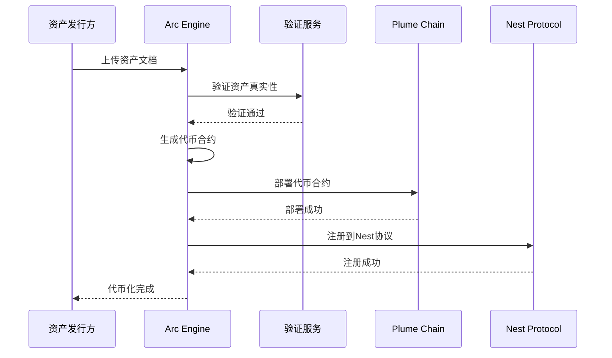
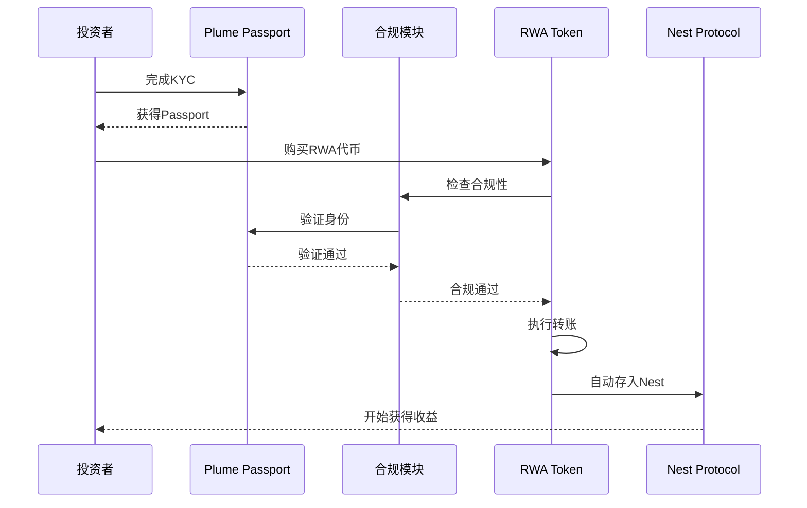
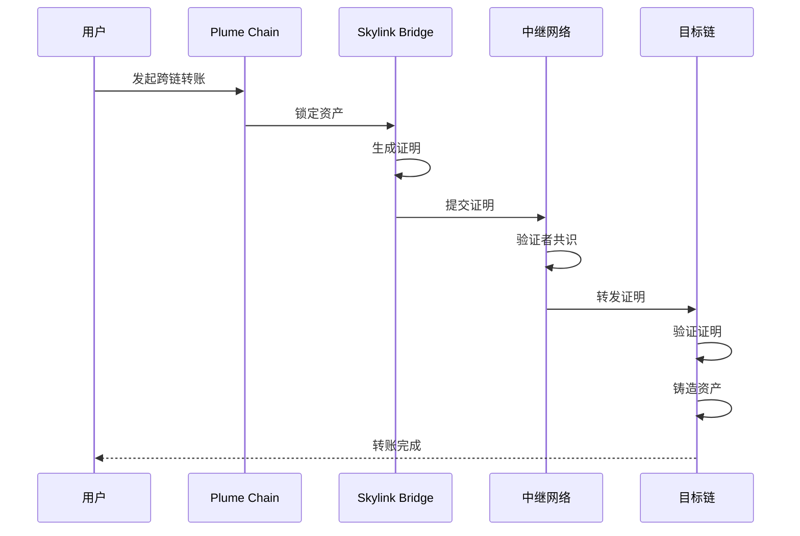
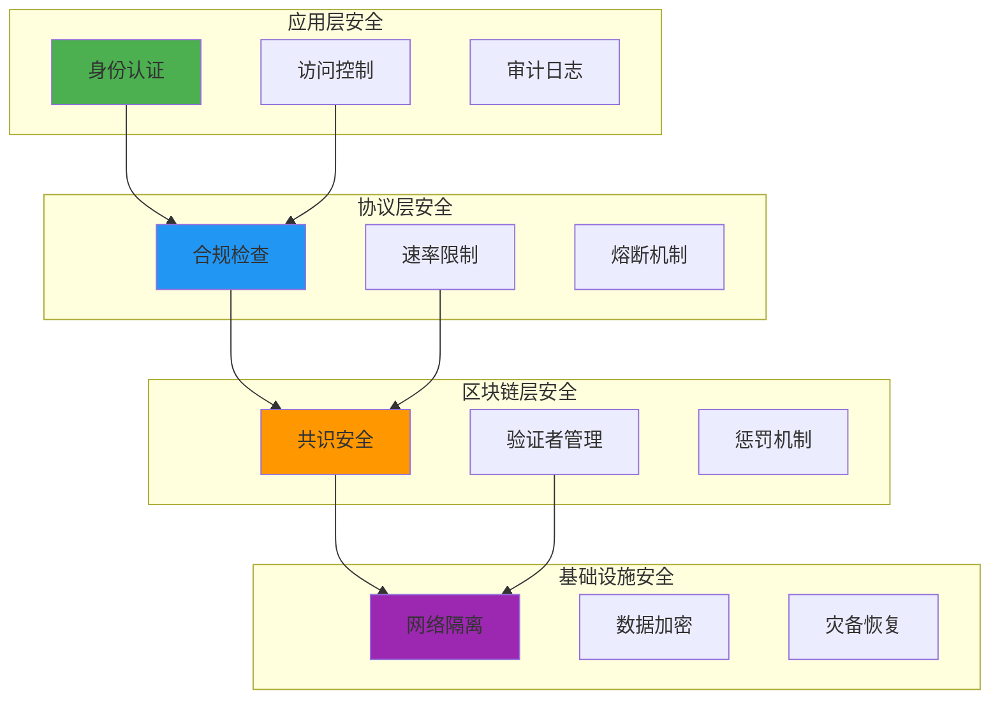

# Plume Network 技术架构分析

**文档版本**: v1.0  
**创建时间**: 2025-10-09 09:33:30 CST  
**文档类型**: 技术架构分析  
**定位**: 首个模块化RWAfi区块链

---

## 📑 目录

1. [系统整体架构](#1-系统整体架构)
2. [核心模块详解](#2-核心模块详解)
3. [技术选型分析](#3-技术选型分析)
4. [数据流程](#4-数据流程)
5. [安全架构](#5-安全架构)

---

## 1. 系统整体架构

### 1.1 Plume Network 整体架构



### 1.2 核心组件说明

| 组件 | 职责 | 关键功能 |
|------|------|----------|
| **Arc Engine** | 端到端代币化引擎 | 资产验证、代币生成、自动部署 |
| **Plume Passport** | 去中心化身份系统 | KYC/AML、合规验证、权限管理 |
| **Nest Protocol** | 原生收益协议 | 自动收益分配、流动性挖矿 |
| **Skylink Bridge** | 跨链桥接协议 | 跨链资产转移、流动性聚合 |
| **Compliance Module** | 链级合规模块 | 转账限制、地域限制、投资者分类 |

### 1.3 技术栈

**区块链层**：
- Cosmos SDK（模块化区块链框架）
- Tendermint Core（BFT共识）
- EVM兼容层（Ethermint）
- CosmWasm（智能合约）

**应用层**：
- React 18.x + TypeScript
- Next.js 14.x
- Ethers.js 6.x
- TailwindCSS

**后端层**：
- Go 1.21+（区块链节点）
- Node.js 20.x（API服务）
- PostgreSQL（数据索引）
- Redis（缓存层）

**基础设施**：
- Kubernetes（容器编排）
- Prometheus（监控）
- Grafana（可视化）
- IPFS（文档存储）

---

## 2. 核心模块详解

### 2.1 Arc Engine（代币化引擎）

**功能架构**：


**关键特性**：
- ✅ **5分钟部署**：从上传文档到代币发行
- ✅ **零代码**：无需编写智能合约
- ✅ **自动化**：资产验证、合规检查、代币生成全自动
- ✅ **模板化**：支持多种资产类型（房产、黄金、私募信贷等）

**支持的资产类型**：

| 资产类型 | 验证要求 | 代币标准 | 合规要求 |
|---------|---------|---------|---------|
| **房地产** | 产权证明、评估报告 | ERC20 + 合规模块 | SEC Reg D |
| **黄金** | 托管证明、纯度证明 | ERC20 + 实物锚定 | LBMA标准 |
| **私募信贷** | 贷款协议、信用评级 | ERC20 + 收益分配 | SEC Reg D |
| **艺术品** | 鉴定证书、保险证明 | ERC721 + 分数化 | 无特殊要求 |
| **碳信用** | 认证证书、项目文档 | ERC20 + 销毁机制 | VCS/Gold Standard |

**Arc Engine工作流程**：
```solidity
// Arc Engine核心接口（伪代码）
interface IArcEngine {
    // 1. 创建资产项目
    function createAssetProject(
        AssetType assetType,
        string memory assetName,
        uint256 totalValue,
        bytes memory documents
    ) external returns (uint256 projectId);
    
    // 2. 验证资产
    function verifyAsset(
        uint256 projectId,
        bytes memory verificationProof
    ) external returns (bool);
    
    // 3. 生成代币
    function generateToken(
        uint256 projectId,
        TokenConfig memory config
    ) external returns (address tokenAddress);
    
    // 4. 部署代币
    function deployToken(
        uint256 projectId
    ) external returns (address deployedAddress);
}

// 代币配置结构
struct TokenConfig {
    string name;
    string symbol;
    uint8 decimals;
    uint256 totalSupply;
    ComplianceRules compliance;
    YieldConfig yield;
}
```

### 2.2 Plume Passport（身份系统）

**身份架构**：


**身份验证流程**：
1. **用户注册**
   - 创建去中心化身份（DID）
   - 生成密钥对
   - 绑定钱包地址

2. **KYC验证**
   - 上传身份文档
   - 人脸识别验证
   - 地址证明验证

3. **合规检查**
   - AML筛查
   - 制裁名单检查
   - PEP检查

4. **凭证发行**
   - 生成可验证凭证（VC）
   - 链上存储凭证哈希
   - 链下存储凭证详情

**Passport数据结构**：
```solidity
// Plume Passport核心结构
struct PassportData {
    bytes32 did;                    // 去中心化身份ID
    address walletAddress;          // 钱包地址
    uint256 kycLevel;              // KYC等级（1-3）
    uint256 verificationTimestamp; // 验证时间戳
    uint16 countryCode;            // 国家代码
    bool isAccredited;             // 是否合格投资者
    bytes32[] credentials;         // 凭证列表
}

// 可验证凭证结构
struct VerifiableCredential {
    bytes32 credentialId;
    string credentialType;         // "KYC", "AML", "Accredited"
    address issuer;                // 发行者地址
    uint256 issuanceDate;
    uint256 expirationDate;
    bytes32 credentialHash;        // 凭证数据哈希
    bytes signature;               // 发行者签名
}
```

### 2.3 Nest Protocol（收益协议）

**收益机制架构**：


**收益类型**：

| 收益来源 | 年化收益率 | 分配频率 | 风险等级 |
|---------|-----------|---------|---------|
| **房地产租金** | 5-8% | 月度 | 低 |
| **私募信贷利息** | 8-12% | 季度 | 中 |
| **DeFi流动性挖矿** | 10-20% | 实时 | 中高 |
| **质押奖励** | 5-10% | 每区块 | 低 |

**Nest Protocol核心功能**：
```solidity
// Nest Protocol接口
interface INestProtocol {
    // 存入RWA代币
    function deposit(
        address rwaToken,
        uint256 amount
    ) external returns (uint256 shares);
    
    // 提取RWA代币
    function withdraw(
        address rwaToken,
        uint256 shares
    ) external returns (uint256 amount);
    
    // 领取收益
    function claimYield(
        address rwaToken
    ) external returns (uint256 yieldAmount);
    
    // 自动复投
    function autoCompound(
        address rwaToken
    ) external returns (bool);
    
    // 查询收益
    function getYield(
        address user,
        address rwaToken
    ) external view returns (uint256);
}

// 收益池结构
struct YieldPool {
    address rwaToken;              // RWA代币地址
    uint256 totalDeposited;        // 总存入量
    uint256 totalShares;           // 总份额
    uint256 yieldRate;             // 年化收益率（基点）
    uint256 lastUpdateTime;        // 最后更新时间
    uint256 accumulatedYield;      // 累计收益
    mapping(address => uint256) userShares;  // 用户份额
    mapping(address => uint256) userYield;   // 用户收益
}
```

### 2.4 Skylink Bridge（跨链桥）

**跨链架构**：


**支持的链**：
- Ethereum
- Polygon
- Arbitrum
- Optimism
- Avalanche
- BNB Chain

**跨链流程**：
1. **锁定阶段**
   - 用户在源链锁定资产
   - 生成锁定证明
   - 触发跨链事件

2. **中继阶段**
   - 验证者监听事件
   - 验证锁定证明
   - 达成共识

3. **铸造阶段**
   - 在目标链验证证明
   - 铸造等量资产
   - 转账给用户

**Skylink核心接口**：
```solidity
// Skylink Bridge接口
interface ISkylinkBridge {
    // 跨链转账
    function bridgeTransfer(
        address token,
        uint256 amount,
        uint256 destinationChainId,
        address recipient
    ) external payable returns (bytes32 transferId);
    
    // 领取跨链资产
    function claimBridgedAssets(
        bytes32 transferId,
        bytes memory proof
    ) external returns (bool);
    
    // 查询跨链状态
    function getBridgeStatus(
        bytes32 transferId
    ) external view returns (BridgeStatus);
}

// 跨链状态枚举
enum BridgeStatus {
    Pending,      // 待处理
    Locked,       // 已锁定
    Validated,    // 已验证
    Minted,       // 已铸造
    Completed,    // 已完成
    Failed        // 失败
}
```

### 2.5 Compliance Module（合规模块）

**链级合规架构**：


**合规规则类型**：

| 规则类型 | 检查内容 | 执行时机 | 可配置性 |
|---------|---------|---------|---------|
| **身份验证** | KYC状态、Passport等级 | 每次转账 | 否（强制） |
| **转账限额** | 单笔/每日限额 | 每次转账 | 是 |
| **地域限制** | 国家白名单/黑名单 | 每次转账 | 是 |
| **投资者类型** | 合格投资者、机构投资者 | 购买时 | 是 |
| **锁定期** | 代币锁定时间 | 转账时 | 是 |

---

## 3. 技术选型分析

### 3.1 为什么选择Cosmos SDK

**优势**：
- ✅ **模块化设计**：易于添加自定义模块（如合规模块）
- ✅ **高性能**：Tendermint共识，7000+ TPS
- ✅ **互操作性**：IBC协议，原生跨链支持
- ✅ **主权性**：独立的应用链，完全控制

**Cosmos SDK vs 其他方案**：

| 特性 | Cosmos SDK | Ethereum L2 | Polkadot Parachain |
|------|-----------|-------------|-------------------|
| TPS | 7000+ | 2000-4000 | 1000-2000 |
| 定制性 | ⭐⭐⭐⭐⭐ | ⭐⭐⭐ | ⭐⭐⭐⭐ |
| 跨链 | IBC（原生） | 桥接 | XCMP |
| 开发难度 | 中 | 低 | 高 |
| 生态成熟度 | ⭐⭐⭐⭐ | ⭐⭐⭐⭐⭐ | ⭐⭐⭐ |

### 3.2 为什么需要EVM兼容

**原因**：
1. **生态兼容**：直接使用现有的EVM工具和DApp
2. **开发者友好**：Solidity开发者可以无缝迁移
3. **流动性导入**：可以桥接以太坊生态的资产
4. **降低门槛**：用户可以使用MetaMask等熟悉的钱包

**Ethermint实现**：
- 在Cosmos SDK上运行EVM
- 支持Solidity智能合约
- 兼容以太坊JSON-RPC
- 保持Cosmos SDK的模块化优势

### 3.3 模块化设计的优势

**传统单体链 vs 模块化链**：

**传统单体链**：
```
[共识层 + 执行层 + 数据可用性层 + 结算层]
↓
难以定制、性能受限、升级困难
```

**Plume模块化链**：
```
[共识层: Tendermint]
[执行层: EVM + CosmWasm]
[数据可用性层: Celestia]
[结算层: Cosmos Hub]
[自定义层: Compliance Module + Arc Engine]
↓
高度定制、性能优化、灵活升级
```

---

## 4. 数据流程

### 4.1 资产代币化流程



### 4.2 投资者购买流程



### 4.3 跨链转移流程



---

## 5. 安全架构

### 5.1 多层安全防护



### 5.2 智能合约安全

**安全措施**：
- ✅ 多次安全审计（Certik、OpenZeppelin、Trail of Bits）
- ✅ 形式化验证
- ✅ Bug赏金计划
- ✅ 时间锁升级
- ✅ 多签治理

### 5.3 跨链安全

**Skylink安全机制**：
1. **多签验证**：需要2/3验证者签名
2. **欺诈证明**：7天挑战期
3. **资产上限**：单笔转账限额
4. **紧急暂停**：可暂停跨链功能

---

## 📚 参考资源

- [Plume Network官网](https://plumenetwork.xyz)
- [Plume文档](https://docs.plumenetwork.xyz)
- [Cosmos SDK文档](https://docs.cosmos.network)
- [Tendermint文档](https://docs.tendermint.com)

---

**文档维护**: RWA-HUSD技术团队  
**最后更新**: 2025-10-09 09:33:30 CST
