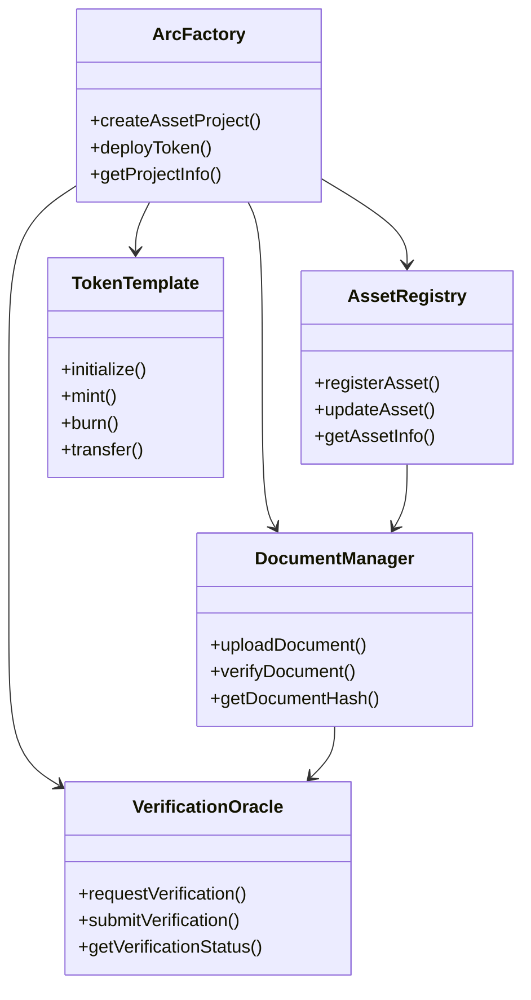
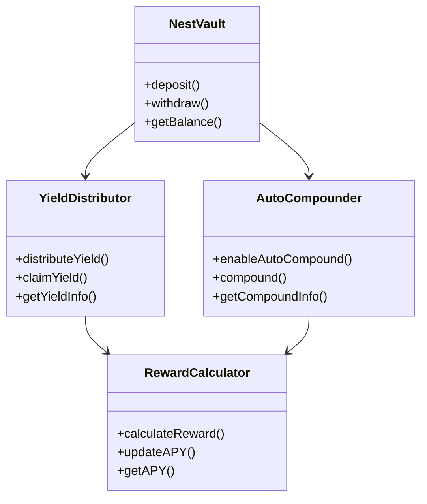
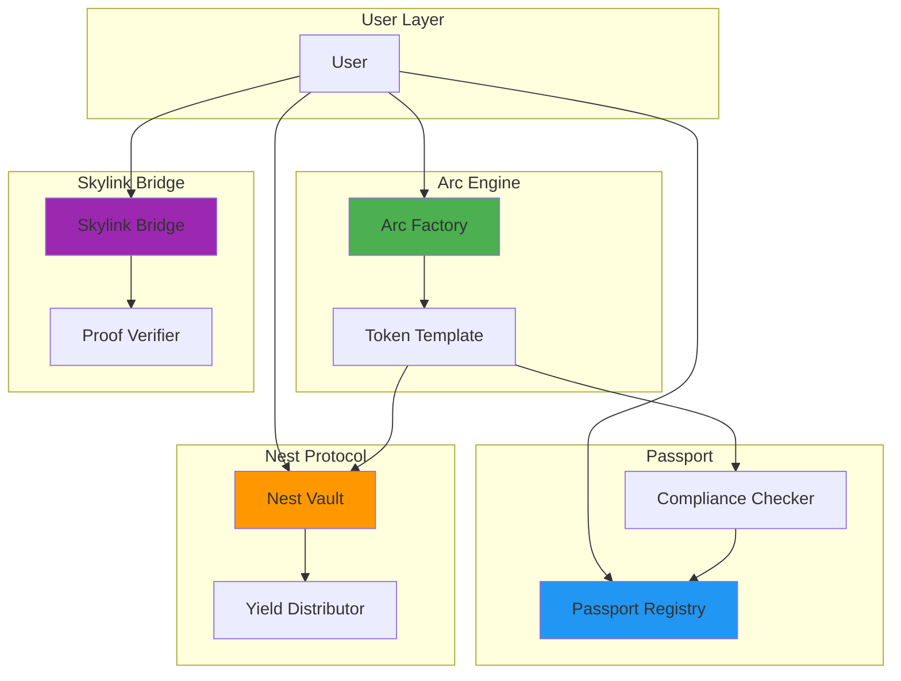

# Plume Network 核心合约分析

**文档版本**: v1.0  
**创建时间**: 2025-10-09 09:35:00 CST  
**Solidity版本**: 0.8.20+  
**框架**: Cosmos SDK + Ethermint

---

## 📑 目录

1. [合约列表](#1-合约列表)
2. [合约架构](#2-合约架构)
3. [关键数据结构](#3-关键数据结构)
4. [主要接口](#4-主要接口)

---

## 1. 合约列表

### 1.1 Arc Engine 合约

| 合约名称 | 职责 | 代码行数 |
|---------|------|---------|
| **ArcFactory.sol** | 代币工厂合约 | ~600行 |
| **AssetRegistry.sol** | 资产注册表 | ~400行 |
| **DocumentManager.sol** | 文档管理合约 | ~350行 |
| **VerificationOracle.sol** | 验证预言机 | ~300行 |
| **TokenTemplate.sol** | 代币模板合约 | ~500行 |

### 1.2 Plume Passport 合约

| 合约名称 | 职责 | 代码行数 |
|---------|------|---------|
| **PassportRegistry.sol** | Passport注册表 | ~450行 |
| **CredentialIssuer.sol** | 凭证发行合约 | ~400行 |
| **KYCVerifier.sol** | KYC验证合约 | ~350行 |
| **ComplianceChecker.sol** | 合规检查合约 | ~500行 |

### 1.3 Nest Protocol 合约

| 合约名称 | 职责 | 代码行数 |
|---------|------|---------|
| **NestVault.sol** | 收益金库合约 | ~700行 |
| **YieldDistributor.sol** | 收益分配合约 | ~500行 |
| **AutoCompounder.sol** | 自动复投合约 | ~400行 |
| **RewardCalculator.sol** | 奖励计算合约 | ~350行 |

### 1.4 Skylink Bridge 合约

| 合约名称 | 职责 | 代码行数 |
|---------|------|---------|
| **SkylinkBridge.sol** | 跨链桥主合约 | ~800行 |
| **RelayerManager.sol** | 中继者管理 | ~400行 |
| **ProofVerifier.sol** | 证明验证合约 | ~500行 |
| **AssetLocker.sol** | 资产锁定合约 | ~350行 |

### 1.5 Compliance Module 合约

| 合约名称 | 职责 | 代码行数 |
|---------|------|---------|
| **ComplianceModule.sol** | 合规模块主合约 | ~600行 |
| **TransferRestrictor.sol** | 转账限制合约 | ~400行 |
| **GeoRestrictor.sol** | 地域限制合约 | ~300行 |
| **InvestorClassifier.sol** | 投资者分类合约 | ~350行 |

---

## 2. 合约架构

### 2.1 Arc Engine 架构



### 2.2 Nest Protocol 架构



### 2.3 合约交互关系



---

## 3. 关键数据结构

### 3.1 Arc Engine 数据结构

```solidity
// 资产项目结构
struct AssetProject {
    uint256 projectId;              // 项目ID
    address creator;                // 创建者地址
    AssetType assetType;           // 资产类型
    string assetName;              // 资产名称
    uint256 totalValue;            // 总价值（USD）
    uint256 tokenSupply;           // 代币总供应量
    address tokenAddress;          // 代币合约地址
    ProjectStatus status;          // 项目状态
    uint256 createdAt;             // 创建时间
    uint256 deployedAt;            // 部署时间
    bytes32[] documentHashes;      // 文档哈希列表
    VerificationStatus verification; // 验证状态
}

// 资产类型枚举
enum AssetType {
    RealEstate,      // 房地产
    Gold,            // 黄金
    PrivateCredit,   // 私募信贷
    Art,             // 艺术品
    CarbonCredit,    // 碳信用
    Other            // 其他
}

// 项目状态枚举
enum ProjectStatus {
    Draft,           // 草稿
    Submitted,       // 已提交
    Verifying,       // 验证中
    Verified,        // 已验证
    Deploying,       // 部署中
    Deployed,        // 已部署
    Active,          // 活跃
    Paused,          // 暂停
    Closed           // 关闭
}

// 验证状态结构
struct VerificationStatus {
    bool documentVerified;      // 文档已验证
    bool assetVerified;         // 资产已验证
    bool complianceVerified;    // 合规已验证
    address verifier;           // 验证者地址
    uint256 verifiedAt;         // 验证时间
    string verificationReport;  // 验证报告URI
}

// 代币配置结构
struct TokenConfig {
    string name;                // 代币名称
    string symbol;              // 代币符号
    uint8 decimals;             // 精度
    uint256 totalSupply;        // 总供应量
    bool transferable;          // 是否可转账
    bool burnable;              // 是否可销毁
    ComplianceRules compliance; // 合规规则
    YieldConfig yield;          // 收益配置
}

// 合规规则结构
struct ComplianceRules {
    bool requireKYC;            // 是否需要KYC
    uint256 minKYCLevel;        // 最低KYC等级
    bool requireAccredited;     // 是否需要合格投资者
    uint16[] allowedCountries;  // 允许的国家列表
    uint16[] blockedCountries;  // 禁止的国家列表
    uint256 maxHoldingPercent;  // 最大持有百分比
    uint256 lockupPeriod;       // 锁定期（秒）
}

// 收益配置结构
struct YieldConfig {
    bool enableYield;           // 是否启用收益
    uint256 yieldRate;          // 年化收益率（基点）
    YieldType yieldType;        // 收益类型
    uint256 distributionFrequency; // 分配频率（秒）
    bool autoCompound;          // 是否自动复投
}

// 收益类型枚举
enum YieldType {
    Fixed,          // 固定收益
    Variable,       // 浮动收益
    Hybrid          // 混合收益
}
```

### 3.2 Plume Passport 数据结构

```solidity
// Passport数据结构
struct Passport {
    bytes32 passportId;         // Passport ID
    address owner;              // 所有者地址
    uint256 kycLevel;          // KYC等级（1-3）
    uint16 countryCode;        // 国家代码
    bool isAccredited;         // 是否合格投资者
    bool isInstitutional;      // 是否机构投资者
    uint256 issuedAt;          // 发行时间
    uint256 expiresAt;         // 过期时间
    bytes32[] credentials;     // 凭证列表
    PassportStatus status;     // Passport状态
}

// Passport状态枚举
enum PassportStatus {
    Pending,        // 待审核
    Active,         // 活跃
    Suspended,      // 暂停
    Revoked,        // 撤销
    Expired         // 过期
}

// 可验证凭证结构
struct VerifiableCredential {
    bytes32 credentialId;       // 凭证ID
    bytes32 passportId;         // 关联的Passport ID
    CredentialType credType;    // 凭证类型
    address issuer;             // 发行者地址
    uint256 issuedAt;           // 发行时间
    uint256 expiresAt;          // 过期时间
    bytes32 dataHash;           // 数据哈希
    bytes signature;            // 发行者签名
    CredentialStatus status;    // 凭证状态
}

// 凭证类型枚举
enum CredentialType {
    KYC,            // KYC凭证
    AML,            // AML凭证
    Accredited,     // 合格投资者凭证
    Institutional,  // 机构投资者凭证
    Custom          // 自定义凭证
}

// 凭证状态枚举
enum CredentialStatus {
    Valid,          // 有效
    Expired,        // 过期
    Revoked         // 撤销
}

// KYC数据结构
struct KYCData {
    bytes32 passportId;         // Passport ID
    string fullName;            // 全名（加密）
    string dateOfBirth;         // 出生日期（加密）
    string nationality;         // 国籍
    string documentType;        // 文档类型
    string documentNumber;      // 文档编号（加密）
    bytes32 documentHash;       // 文档哈希
    address verifier;           // 验证者地址
    uint256 verifiedAt;         // 验证时间
}
```

### 3.3 Nest Protocol 数据结构

```solidity
// 收益池结构
struct YieldPool {
    address rwaToken;           // RWA代币地址
    uint256 totalDeposited;     // 总存入量
    uint256 totalShares;        // 总份额
    uint256 baseYieldRate;      // 基础年化收益率（基点）
    uint256 bonusYieldRate;     // 奖励年化收益率（基点）
    uint256 lastUpdateTime;     // 最后更新时间
    uint256 accumulatedYield;   // 累计收益
    uint256 totalYieldPaid;     // 已支付收益
    PoolStatus status;          // 池状态
}

// 池状态枚举
enum PoolStatus {
    Active,         // 活跃
    Paused,         // 暂停
    Closed          // 关闭
}

// 用户存款结构
struct UserDeposit {
    address user;               // 用户地址
    address rwaToken;           // RWA代币地址
    uint256 amount;             // 存入数量
    uint256 shares;             // 份额
    uint256 depositedAt;        // 存入时间
    uint256 lastClaimAt;        // 最后领取时间
    uint256 accumulatedYield;   // 累计收益
    uint256 claimedYield;       // 已领取收益
    bool autoCompound;          // 是否自动复投
}

// 收益分配记录
struct YieldDistribution {
    uint256 distributionId;     // 分配ID
    address rwaToken;           // RWA代币地址
    uint256 totalYield;         // 总收益
    uint256 distributedAt;      // 分配时间
    uint256 recipientCount;     // 接收者数量
    mapping(address => uint256) userYields; // 用户收益
}

// 自动复投配置
struct AutoCompoundConfig {
    bool enabled;               // 是否启用
    uint256 minAmount;          // 最小复投金额
    uint256 frequency;          // 复投频率（秒）
    uint256 lastCompoundAt;     // 最后复投时间
    uint256 totalCompounded;    // 总复投金额
}
```

### 3.4 Skylink Bridge 数据结构

```solidity
// 跨链转账结构
struct BridgeTransfer {
    bytes32 transferId;         // 转账ID
    address sender;             // 发送者地址
    address recipient;          // 接收者地址
    address token;              // 代币地址
    uint256 amount;             // 转账数量
    uint256 sourceChainId;      // 源链ID
    uint256 destChainId;        // 目标链ID
    uint256 initiatedAt;        // 发起时间
    uint256 completedAt;        // 完成时间
    BridgeStatus status;        // 转账状态
    bytes32 proofHash;          // 证明哈希
    uint256 validatorSignatures; // 验证者签名数量
}

// 跨链状态枚举
enum BridgeStatus {
    Initiated,      // 已发起
    Locked,         // 已锁定
    Validated,      // 已验证
    Minted,         // 已铸造
    Completed,      // 已完成
    Failed,         // 失败
    Refunded        // 已退款
}

// 验证者结构
struct Validator {
    address validatorAddress;   // 验证者地址
    uint256 stake;              // 质押数量
    uint256 reputation;         // 信誉分数
    bool isActive;              // 是否活跃
    uint256 totalValidations;   // 总验证次数
    uint256 successfulValidations; // 成功验证次数
}

// 跨链证明结构
struct BridgeProof {
    bytes32 transferId;         // 转账ID
    bytes32 blockHash;          // 区块哈希
    uint256 blockNumber;        // 区块号
    bytes32 txHash;             // 交易哈希
    bytes32 receiptHash;        // 收据哈希
    bytes[] signatures;         // 验证者签名列表
    uint256 timestamp;          // 时间戳
}
```

---

## 4. 主要接口

### 4.1 IArcFactory 接口

```solidity
interface IArcFactory {
    // ========== 项目管理 ==========
    
    /**
     * @dev 创建资产项目
     * @param assetType 资产类型
     * @param assetName 资产名称
     * @param totalValue 总价值
     * @param documents 文档哈希列表
     * @return projectId 项目ID
     */
    function createAssetProject(
        AssetType assetType,
        string memory assetName,
        uint256 totalValue,
        bytes32[] memory documents
    ) external returns (uint256 projectId);
    
    /**
     * @dev 部署代币
     * @param projectId 项目ID
     * @param config 代币配置
     * @return tokenAddress 代币合约地址
     */
    function deployToken(
        uint256 projectId,
        TokenConfig memory config
    ) external returns (address tokenAddress);
    
    /**
     * @dev 获取项目信息
     * @param projectId 项目ID
     * @return project 项目信息
     */
    function getProjectInfo(uint256 projectId) 
        external view returns (AssetProject memory project);
    
    // ========== 验证管理 ==========
    
    /**
     * @dev 提交验证
     * @param projectId 项目ID
     */
    function submitForVerification(uint256 projectId) external;
    
    /**
     * @dev 验证项目
     * @param projectId 项目ID
     * @param approved 是否批准
     * @param report 验证报告URI
     */
    function verifyProject(
        uint256 projectId,
        bool approved,
        string memory report
    ) external;
}
```

### 4.2 IPassportRegistry 接口

```solidity
interface IPassportRegistry {
    // ========== Passport管理 ==========
    
    /**
     * @dev 创建Passport
     * @param owner 所有者地址
     * @param kycLevel KYC等级
     * @param countryCode 国家代码
     * @return passportId Passport ID
     */
    function createPassport(
        address owner,
        uint256 kycLevel,
        uint16 countryCode
    ) external returns (bytes32 passportId);
    
    /**
     * @dev 更新Passport
     * @param passportId Passport ID
     * @param kycLevel 新KYC等级
     */
    function updatePassport(
        bytes32 passportId,
        uint256 kycLevel
    ) external;
    
    /**
     * @dev 获取Passport
     * @param owner 所有者地址
     * @return passport Passport数据
     */
    function getPassport(address owner) 
        external view returns (Passport memory passport);
    
    // ========== 凭证管理 ==========
    
    /**
     * @dev 发行凭证
     * @param passportId Passport ID
     * @param credType 凭证类型
     * @param dataHash 数据哈希
     * @param expiresAt 过期时间
     * @return credentialId 凭证ID
     */
    function issueCredential(
        bytes32 passportId,
        CredentialType credType,
        bytes32 dataHash,
        uint256 expiresAt
    ) external returns (bytes32 credentialId);
    
    /**
     * @dev 验证凭证
     * @param credentialId 凭证ID
     * @return isValid 是否有效
     */
    function verifyCredential(bytes32 credentialId) 
        external view returns (bool isValid);
}
```

### 4.3 INestVault 接口

```solidity
interface INestVault {
    // ========== 存取款 ==========
    
    /**
     * @dev 存入RWA代币
     * @param rwaToken RWA代币地址
     * @param amount 存入数量
     * @return shares 获得的份额
     */
    function deposit(address rwaToken, uint256 amount) 
        external returns (uint256 shares);
    
    /**
     * @dev 提取RWA代币
     * @param rwaToken RWA代币地址
     * @param shares 提取的份额
     * @return amount 获得的代币数量
     */
    function withdraw(address rwaToken, uint256 shares) 
        external returns (uint256 amount);
    
    // ========== 收益管理 ==========
    
    /**
     * @dev 领取收益
     * @param rwaToken RWA代币地址
     * @return yieldAmount 收益数量
     */
    function claimYield(address rwaToken) 
        external returns (uint256 yieldAmount);
    
    /**
     * @dev 启用自动复投
     * @param rwaToken RWA代币地址
     * @param enabled 是否启用
     */
    function setAutoCompound(address rwaToken, bool enabled) external;
    
    /**
     * @dev 获取用户收益
     * @param user 用户地址
     * @param rwaToken RWA代币地址
     * @return yieldAmount 收益数量
     */
    function getUserYield(address user, address rwaToken) 
        external view returns (uint256 yieldAmount);
}
```

### 4.4 ISkylinkBridge 接口

```solidity
interface ISkylinkBridge {
    // ========== 跨链转账 ==========
    
    /**
     * @dev 发起跨链转账
     * @param token 代币地址
     * @param amount 转账数量
     * @param destChainId 目标链ID
     * @param recipient 接收者地址
     * @return transferId 转账ID
     */
    function initiateBridgeTransfer(
        address token,
        uint256 amount,
        uint256 destChainId,
        address recipient
    ) external payable returns (bytes32 transferId);
    
    /**
     * @dev 完成跨链转账
     * @param transferId 转账ID
     * @param proof 跨链证明
     */
    function completeBridgeTransfer(
        bytes32 transferId,
        BridgeProof memory proof
    ) external;
    
    /**
     * @dev 获取转账状态
     * @param transferId 转账ID
     * @return transfer 转账信息
     */
    function getBridgeTransfer(bytes32 transferId) 
        external view returns (BridgeTransfer memory transfer);
    
    // ========== 验证者管理 ==========
    
    /**
     * @dev 添加验证者
     * @param validator 验证者地址
     * @param stake 质押数量
     */
    function addValidator(address validator, uint256 stake) external;
    
    /**
     * @dev 提交验证签名
     * @param transferId 转账ID
     * @param signature 签名
     */
    function submitValidation(
        bytes32 transferId,
        bytes memory signature
    ) external;
}
```

### 4.5 事件定义

```solidity
// Arc Engine 事件
event AssetProjectCreated(uint256 indexed projectId, address indexed creator, AssetType assetType);
event TokenDeployed(uint256 indexed projectId, address indexed tokenAddress);
event ProjectVerified(uint256 indexed projectId, bool approved);

// Passport 事件
event PassportCreated(bytes32 indexed passportId, address indexed owner);
event CredentialIssued(bytes32 indexed credentialId, bytes32 indexed passportId, CredentialType credType);
event PassportUpdated(bytes32 indexed passportId, uint256 newKYCLevel);

// Nest Protocol 事件
event Deposited(address indexed user, address indexed rwaToken, uint256 amount, uint256 shares);
event Withdrawn(address indexed user, address indexed rwaToken, uint256 shares, uint256 amount);
event YieldClaimed(address indexed user, address indexed rwaToken, uint256 yieldAmount);
event YieldDistributed(address indexed rwaToken, uint256 totalYield, uint256 recipientCount);

// Skylink Bridge 事件
event BridgeTransferInitiated(bytes32 indexed transferId, address indexed sender, uint256 destChainId);
event BridgeTransferCompleted(bytes32 indexed transferId, address indexed recipient);
event ValidatorAdded(address indexed validator, uint256 stake);
event ValidationSubmitted(bytes32 indexed transferId, address indexed validator);
```

---

## 📚 参考资源

- [Plume Network GitHub](https://github.com/plumenetwork)
- [Cosmos SDK文档](https://docs.cosmos.network)
- [Ethermint文档](https://docs.ethermint.zone)
- [OpenZeppelin Contracts](https://docs.openzeppelin.com/contracts)

---

**文档维护**: RWA-HUSD技术团队  
**最后更新**: 2025-10-09 09:35:00 CST
