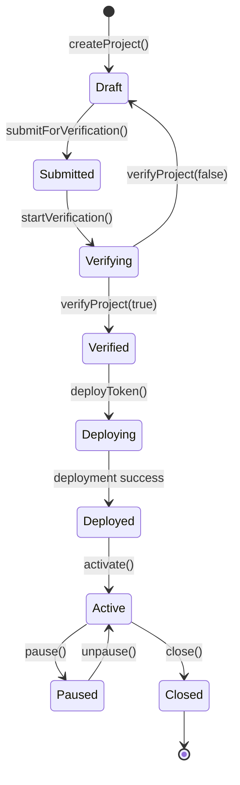
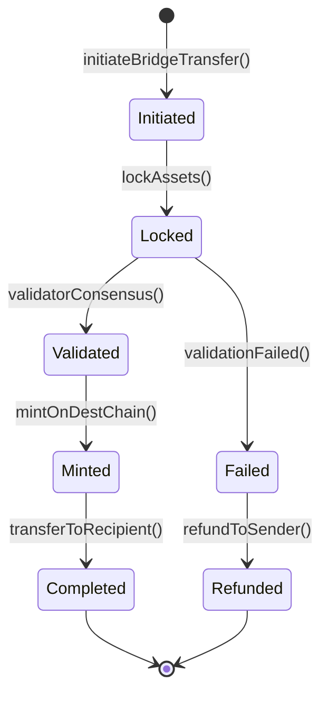

# Plume Network 实现细节分析

**文档版本**: v1.0  
**创建时间**: 2025-10-09 09:36:30 CST  
**Solidity版本**: 0.8.20+  
**框架**: Cosmos SDK + Ethermint

---

## 📑 目录

1. [关键函数实现](#1-关键函数实现)
2. [状态管理](#2-状态管理)
3. [事件和错误处理](#3-事件和错误处理)
4. [权限控制](#4-权限控制)
5. [Gas优化策略](#5-gas优化策略)

---

## 1. 关键函数实现

### 1.1 Arc Engine - 代币部署

```solidity
/**
 * @dev 部署RWA代币（Arc Engine核心功能）
 * @param projectId 项目ID
 * @param config 代币配置
 * @return tokenAddress 部署的代币地址
 */
function deployToken(
    uint256 projectId,
    TokenConfig memory config
) external returns (address tokenAddress) {
    // 1. 验证项目状态
    AssetProject storage project = projects[projectId];
    require(project.status == ProjectStatus.Verified, "Project not verified");
    require(project.creator == msg.sender, "Not project creator");
    
    // 2. 克隆代币模板
    tokenAddress = Clones.clone(tokenTemplate);
    
    // 3. 初始化代币
    IRWAToken(tokenAddress).initialize(
        config.name,
        config.symbol,
        config.decimals,
        config.totalSupply,
        address(this)
    );
    
    // 4. 配置合规规则
    _setupCompliance(tokenAddress, config.compliance);
    
    // 5. 配置收益机制
    if (config.yield.enableYield) {
        _setupYield(tokenAddress, config.yield);
    }
    
    // 6. 铸造初始供应量给创建者
    IRWAToken(tokenAddress).mint(project.creator, config.totalSupply);
    
    // 7. 更新项目状态
    project.tokenAddress = tokenAddress;
    project.status = ProjectStatus.Deployed;
    project.deployedAt = block.timestamp;
    
    // 8. 注册到Nest协议
    INestVault(nestVault).registerToken(tokenAddress, config.yield);
    
    // 9. 触发事件
    emit TokenDeployed(projectId, tokenAddress);
    
    return tokenAddress;
}

/**
 * @dev 配置合规规则
 * @param token 代币地址
 * @param rules 合规规则
 */
function _setupCompliance(
    address token,
    ComplianceRules memory rules
) private {
    IComplianceModule compliance = IComplianceModule(complianceModule);
    
    // 设置KYC要求
    if (rules.requireKYC) {
        compliance.setKYCRequirement(token, true, rules.minKYCLevel);
    }
    
    // 设置合格投资者要求
    if (rules.requireAccredited) {
        compliance.setAccreditedRequirement(token, true);
    }
    
    // 设置地域限制
    if (rules.allowedCountries.length > 0) {
        compliance.setCountryWhitelist(token, rules.allowedCountries);
    }
    if (rules.blockedCountries.length > 0) {
        compliance.setCountryBlacklist(token, rules.blockedCountries);
    }
    
    // 设置持有量限制
    if (rules.maxHoldingPercent > 0) {
        compliance.setMaxHolding(token, rules.maxHoldingPercent);
    }
    
    // 设置锁定期
    if (rules.lockupPeriod > 0) {
        compliance.setLockupPeriod(token, rules.lockupPeriod);
    }
}
```

### 1.2 Nest Protocol - 存款和收益

```solidity
/**
 * @dev 存入RWA代币到Nest金库
 * @param rwaToken RWA代币地址
 * @param amount 存入数量
 * @return shares 获得的份额
 */
function deposit(address rwaToken, uint256 amount) 
    external 
    returns (uint256 shares) 
{
    // 1. 验证代币是否已注册
    require(isRegisteredToken[rwaToken], "Token not registered");
    
    // 2. 验证用户Passport
    require(
        IPassportRegistry(passportRegistry).hasValidPassport(msg.sender),
        "Invalid passport"
    );
    
    // 3. 转入代币
    IERC20(rwaToken).transferFrom(msg.sender, address(this), amount);
    
    // 4. 计算份额
    YieldPool storage pool = yieldPools[rwaToken];
    if (pool.totalShares == 0) {
        shares = amount;
    } else {
        shares = (amount * pool.totalShares) / pool.totalDeposited;
    }
    
    // 5. 更新池状态
    pool.totalDeposited += amount;
    pool.totalShares += shares;
    
    // 6. 更新用户存款
    UserDeposit storage userDeposit = userDeposits[msg.sender][rwaToken];
    userDeposit.amount += amount;
    userDeposit.shares += shares;
    userDeposit.depositedAt = block.timestamp;
    
    // 7. 触发收益计算
    _updateUserYield(msg.sender, rwaToken);
    
    // 8. 触发事件
    emit Deposited(msg.sender, rwaToken, amount, shares);
    
    return shares;
}

/**
 * @dev 更新用户收益
 * @param user 用户地址
 * @param rwaToken RWA代币地址
 */
function _updateUserYield(address user, address rwaToken) private {
    UserDeposit storage userDeposit = userDeposits[user][rwaToken];
    YieldPool storage pool = yieldPools[rwaToken];
    
    // 计算时间差
    uint256 timeDelta = block.timestamp - userDeposit.lastClaimAt;
    if (timeDelta == 0) return;
    
    // 计算收益
    uint256 yieldAmount = _calculateYield(
        userDeposit.amount,
        pool.baseYieldRate + pool.bonusYieldRate,
        timeDelta
    );
    
    // 更新累计收益
    userDeposit.accumulatedYield += yieldAmount;
    userDeposit.lastClaimAt = block.timestamp;
    
    // 如果启用自动复投
    if (userDeposit.autoCompound && yieldAmount >= autoCompoundConfig.minAmount) {
        _autoCompound(user, rwaToken, yieldAmount);
    }
}

/**
 * @dev 计算收益
 * @param principal 本金
 * @param annualRate 年化收益率（基点）
 * @param duration 持续时间（秒）
 * @return yieldAmount 收益数量
 */
function _calculateYield(
    uint256 principal,
    uint256 annualRate,
    uint256 duration
) private pure returns (uint256 yieldAmount) {
    // 年化收益率转换为秒收益率
    // annualRate是基点（1基点 = 0.01%）
    // 1年 = 365.25天 = 31557600秒
    uint256 secondRate = (annualRate * 1e18) / (10000 * 31557600);
    
    // 计算收益：本金 * 秒收益率 * 持续时间
    yieldAmount = (principal * secondRate * duration) / 1e18;
    
    return yieldAmount;
}

/**
 * @dev 自动复投
 * @param user 用户地址
 * @param rwaToken RWA代币地址
 * @param yieldAmount 收益数量
 */
function _autoCompound(
    address user,
    address rwaToken,
    uint256 yieldAmount
) private {
    UserDeposit storage userDeposit = userDeposits[user][rwaToken];
    YieldPool storage pool = yieldPools[rwaToken];
    
    // 计算新增份额
    uint256 newShares = (yieldAmount * pool.totalShares) / pool.totalDeposited;
    
    // 更新用户存款
    userDeposit.amount += yieldAmount;
    userDeposit.shares += newShares;
    userDeposit.accumulatedYield -= yieldAmount;
    
    // 更新池状态
    pool.totalDeposited += yieldAmount;
    pool.totalShares += newShares;
    
    // 更新自动复投配置
    AutoCompoundConfig storage config = autoCompoundConfigs[user][rwaToken];
    config.lastCompoundAt = block.timestamp;
    config.totalCompounded += yieldAmount;
    
    emit AutoCompounded(user, rwaToken, yieldAmount, newShares);
}
```

### 1.3 Skylink Bridge - 跨链转账

```solidity
/**
 * @dev 发起跨链转账
 * @param token 代币地址
 * @param amount 转账数量
 * @param destChainId 目标链ID
 * @param recipient 接收者地址
 * @return transferId 转账ID
 */
function initiateBridgeTransfer(
    address token,
    uint256 amount,
    uint256 destChainId,
    address recipient
) external payable returns (bytes32 transferId) {
    // 1. 验证参数
    require(amount > 0, "Amount must be positive");
    require(recipient != address(0), "Invalid recipient");
    require(supportedChains[destChainId], "Chain not supported");
    
    // 2. 验证用户Passport
    require(
        IPassportRegistry(passportRegistry).hasValidPassport(msg.sender),
        "Invalid passport"
    );
    
    // 3. 检查转账限额
    require(amount <= maxBridgeAmount, "Exceeds max amount");
    
    // 4. 收取手续费
    require(msg.value >= bridgeFee, "Insufficient fee");
    
    // 5. 锁定代币
    IERC20(token).transferFrom(msg.sender, address(this), amount);
    
    // 6. 生成转账ID
    transferId = keccak256(
        abi.encodePacked(
            msg.sender,
            recipient,
            token,
            amount,
            destChainId,
            block.timestamp,
            block.number
        )
    );
    
    // 7. 创建转账记录
    BridgeTransfer storage transfer = bridgeTransfers[transferId];
    transfer.transferId = transferId;
    transfer.sender = msg.sender;
    transfer.recipient = recipient;
    transfer.token = token;
    transfer.amount = amount;
    transfer.sourceChainId = block.chainid;
    transfer.destChainId = destChainId;
    transfer.initiatedAt = block.timestamp;
    transfer.status = BridgeStatus.Initiated;
    
    // 8. 生成锁定证明
    bytes32 proofHash = _generateLockProof(transferId);
    transfer.proofHash = proofHash;
    transfer.status = BridgeStatus.Locked;
    
    // 9. 通知中继者
    emit BridgeTransferInitiated(
        transferId,
        msg.sender,
        recipient,
        token,
        amount,
        destChainId
    );
    
    return transferId;
}

/**
 * @dev 完成跨链转账
 * @param transferId 转账ID
 * @param proof 跨链证明
 */
function completeBridgeTransfer(
    bytes32 transferId,
    BridgeProof memory proof
) external {
    // 1. 验证转账存在
    BridgeTransfer storage transfer = bridgeTransfers[transferId];
    require(transfer.status == BridgeStatus.Validated, "Invalid status");
    
    // 2. 验证证明
    require(_verifyBridgeProof(transferId, proof), "Invalid proof");
    
    // 3. 验证签名数量
    require(
        proof.signatures.length >= minValidatorSignatures,
        "Insufficient signatures"
    );
    
    // 4. 验证每个签名
    uint256 validSignatures = 0;
    for (uint256 i = 0; i < proof.signatures.length; i++) {
        address signer = _recoverSigner(proof, proof.signatures[i]);
        if (validators[signer].isActive) {
            validSignatures++;
        }
    }
    require(
        validSignatures >= minValidatorSignatures,
        "Insufficient valid signatures"
    );
    
    // 5. 铸造代币给接收者
    IRWAToken(transfer.token).mint(transfer.recipient, transfer.amount);
    
    // 6. 更新转账状态
    transfer.status = BridgeStatus.Completed;
    transfer.completedAt = block.timestamp;
    
    // 7. 触发事件
    emit BridgeTransferCompleted(transferId, transfer.recipient, transfer.amount);
}

/**
 * @dev 生成锁定证明
 * @param transferId 转账ID
 * @return proofHash 证明哈希
 */
function _generateLockProof(bytes32 transferId) 
    private 
    view 
    returns (bytes32 proofHash) 
{
    BridgeTransfer storage transfer = bridgeTransfers[transferId];
    
    proofHash = keccak256(
        abi.encodePacked(
            transferId,
            transfer.sender,
            transfer.recipient,
            transfer.token,
            transfer.amount,
            transfer.sourceChainId,
            transfer.destChainId,
            block.number,
            blockhash(block.number - 1)
        )
    );
    
    return proofHash;
}
```

### 1.4 Passport - 身份验证

```solidity
/**
 * @dev 创建Plume Passport
 * @param owner 所有者地址
 * @param kycLevel KYC等级
 * @param countryCode 国家代码
 * @return passportId Passport ID
 */
function createPassport(
    address owner,
    uint256 kycLevel,
    uint16 countryCode
) external returns (bytes32 passportId) {
    // 1. 验证调用者权限
    require(hasRole(ISSUER_ROLE, msg.sender), "Not authorized issuer");
    
    // 2. 检查是否已有Passport
    require(ownerToPassport[owner] == bytes32(0), "Passport already exists");
    
    // 3. 验证KYC等级
    require(kycLevel >= 1 && kycLevel <= 3, "Invalid KYC level");
    
    // 4. 生成Passport ID
    passportId = keccak256(
        abi.encodePacked(
            owner,
            kycLevel,
            countryCode,
            block.timestamp,
            passportCounter++
        )
    );
    
    // 5. 创建Passport
    Passport storage passport = passports[passportId];
    passport.passportId = passportId;
    passport.owner = owner;
    passport.kycLevel = kycLevel;
    passport.countryCode = countryCode;
    passport.issuedAt = block.timestamp;
    passport.expiresAt = block.timestamp + 365 days;
    passport.status = PassportStatus.Active;
    
    // 6. 建立映射
    ownerToPassport[owner] = passportId;
    
    // 7. 触发事件
    emit PassportCreated(passportId, owner, kycLevel, countryCode);
    
    return passportId;
}

/**
 * @dev 验证Passport是否有效
 * @param owner 所有者地址
 * @return isValid 是否有效
 */
function hasValidPassport(address owner) 
    external 
    view 
    returns (bool isValid) 
{
    bytes32 passportId = ownerToPassport[owner];
    if (passportId == bytes32(0)) return false;
    
    Passport storage passport = passports[passportId];
    
    // 检查状态
    if (passport.status != PassportStatus.Active) return false;
    
    // 检查是否过期
    if (block.timestamp > passport.expiresAt) return false;
    
    // 检查KYC等级
    if (passport.kycLevel < 1) return false;
    
    return true;
}

/**
 * @dev 发行可验证凭证
 * @param passportId Passport ID
 * @param credType 凭证类型
 * @param dataHash 数据哈希
 * @param expiresAt 过期时间
 * @return credentialId 凭证ID
 */
function issueCredential(
    bytes32 passportId,
    CredentialType credType,
    bytes32 dataHash,
    uint256 expiresAt
) external returns (bytes32 credentialId) {
    // 1. 验证Passport存在
    require(passports[passportId].passportId != bytes32(0), "Passport not found");
    
    // 2. 验证发行者权限
    require(hasRole(ISSUER_ROLE, msg.sender), "Not authorized issuer");
    
    // 3. 生成凭证ID
    credentialId = keccak256(
        abi.encodePacked(
            passportId,
            credType,
            dataHash,
            block.timestamp,
            credentialCounter++
        )
    );
    
    // 4. 创建凭证
    VerifiableCredential storage credential = credentials[credentialId];
    credential.credentialId = credentialId;
    credential.passportId = passportId;
    credential.credType = credType;
    credential.issuer = msg.sender;
    credential.issuedAt = block.timestamp;
    credential.expiresAt = expiresAt;
    credential.dataHash = dataHash;
    credential.status = CredentialStatus.Valid;
    
    // 5. 生成签名
    credential.signature = _signCredential(credentialId, dataHash);
    
    // 6. 添加到Passport
    passports[passportId].credentials.push(credentialId);
    
    // 7. 触发事件
    emit CredentialIssued(credentialId, passportId, credType);
    
    return credentialId;
}
```

---

## 2. 状态管理

### 2.1 项目状态转换



### 2.2 跨链转账状态



---

## 3. 事件和错误处理

### 3.1 自定义错误

```solidity
// Arc Engine错误
error ProjectNotVerified(uint256 projectId);
error TokenAlreadyDeployed(uint256 projectId);
error InvalidAssetType(AssetType assetType);

// Passport错误
error PassportNotFound(address owner);
error PassportExpired(bytes32 passportId);
error InvalidKYCLevel(uint256 level);

// Nest Protocol错误
error TokenNotRegistered(address token);
error InsufficientShares(uint256 requested, uint256 available);
error YieldNotAvailable(address user, address token);

// Skylink Bridge错误
error ChainNotSupported(uint256 chainId);
error InsufficientValidatorSignatures(uint256 provided, uint256 required);
error BridgeTransferFailed(bytes32 transferId);
```

---

## 4. 权限控制

### 4.1 角色定义

```solidity
// 角色常量
bytes32 public constant ADMIN_ROLE = keccak256("ADMIN_ROLE");
bytes32 public constant ISSUER_ROLE = keccak256("ISSUER_ROLE");
bytes32 public constant VERIFIER_ROLE = keccak256("VERIFIER_ROLE");
bytes32 public constant VALIDATOR_ROLE = keccak256("VALIDATOR_ROLE");
bytes32 public constant OPERATOR_ROLE = keccak256("OPERATOR_ROLE");

// 权限矩阵
mapping(bytes32 => mapping(bytes4 => bool)) public rolePermissions;

constructor() {
    // 配置Admin权限
    _setupRole(ADMIN_ROLE, msg.sender);
    _setRoleAdmin(ISSUER_ROLE, ADMIN_ROLE);
    _setRoleAdmin(VERIFIER_ROLE, ADMIN_ROLE);
    _setRoleAdmin(VALIDATOR_ROLE, ADMIN_ROLE);
    _setRoleAdmin(OPERATOR_ROLE, ADMIN_ROLE);
}
```

---

## 5. Gas优化策略

### 5.1 批量操作

```solidity
/**
 * @dev 批量发行凭证
 * @param passportIds Passport ID列表
 * @param credTypes 凭证类型列表
 * @param dataHashes 数据哈希列表
 * @return credentialIds 凭证ID列表
 */
function batchIssueCredentials(
    bytes32[] calldata passportIds,
    CredentialType[] calldata credTypes,
    bytes32[] calldata dataHashes
) external returns (bytes32[] memory credentialIds) {
    uint256 length = passportIds.length;
    require(
        length == credTypes.length && length == dataHashes.length,
        "Length mismatch"
    );
    
    credentialIds = new bytes32[](length);
    
    for (uint256 i = 0; i < length;) {
        credentialIds[i] = _issueCredential(
            passportIds[i],
            credTypes[i],
            dataHashes[i]
        );
        unchecked { i++; }
    }
    
    return credentialIds;
}
```

### 5.2 存储优化

```solidity
// ❌ 不优化的写法
struct BadExample {
    bool flag1;      // 1 byte, 占用1个slot
    uint256 value1;  // 32 bytes, 占用1个slot
    bool flag2;      // 1 byte, 占用1个slot
    uint256 value2;  // 32 bytes, 占用1个slot
}

// ✅ 优化的写法
struct GoodExample {
    uint256 value1;  // 32 bytes, slot 0
    uint256 value2;  // 32 bytes, slot 1
    bool flag1;      // 1 byte, slot 2 (前1字节)
    bool flag2;      // 1 byte, slot 2 (第2字节)
}
```

---

## 📚 参考资源

- [Plume Network GitHub](https://github.com/plumenetwork)
- [Cosmos SDK文档](https://docs.cosmos.network)
- [Solidity Gas Optimization](https://github.com/iskdrews/awesome-solidity-gas-optimization)

---

**文档维护**: RWA-HUSD技术团队  
**最后更新**: 2025-10-09 09:36:30 CST
