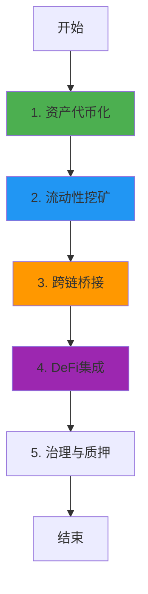

# Plume Network 业务流程与技术实现深度解析

**文档版本**: v2.0
**创建时间**: 2025-10-13 12:20:00 CST
**文档类型**: 业务流程导向的技术深度解析
**定位**: RWA 专用 Layer 2 区块链
**信息来源**: Plume Network 官方文档 (https://docs.plume.org/)

---

## 📑 目录

1. [Plume Network 概述](#1-plume-network概述)
2. [业务流程 1: 资产代币化](#2-业务流程1-资产代币化)
3. [业务流程 2: 流动性挖矿](#3-业务流程2-流动性挖矿)
4. [业务流程 3: 跨链桥接](#4-业务流程3-跨链桥接)
5. [业务流程 4: DeFi 集成](#5-业务流程4-defi集成)
6. [业务流程 5: 治理与质押](#6-业务流程5-治理与质押)
7. [完整业务流程图](#7-完整业务流程图)
8. [Arc 技术栈](#8-arc技术栈)
9. [Nest 钱包](#9-nest钱包)
10. [网络信息](#10-网络信息)
11. [总结与最佳实践](#11-总结与最佳实践)

---

## 1. Plume Network 概述

### 1.1 核心定位

**官方定义** (来自 Plume Network 官方文档):

> "Plume is the first fully integrated modular L2 blockchain dedicated to all real-world assets (RWAs), both private credit and tokenized real-world assets."

**Plume Network 是首个专为 RWA(真实世界资产)设计的 Layer 2 区块链**,提供完整的资产代币化、DeFi 和合规基础设施。

**核心价值主张**:

-   **RWA 专用 L2**: 专为 RWA 优化的区块链基础设施
-   **Arc 技术栈**: 模块化的资产代币化框架
-   **Nest 钱包**: 内置合规的智能合约钱包
-   **低成本**: 极低的 Gas 费用,适合高频交易
-   **模块化设计**: 支持多种资产类型 (房地产、艺术品、碳信用等)

---

### 1.2 核心架构

Plume Network 采用**Optimistic Rollup + Arc 技术栈**:

#### 1.2.1 Layer 2 基础设施

-   **Plume L2**: 基于 Optimism 的 Layer 2
-   **Sequencer**: 交易排序器
-   **Verifier**: 欺诈证明验证器

#### 1.2.2 资产代币化层

-   **Arc**: 资产代币化框架
-   **ArcFactory**: 代币工厂合约
-   **ArcToken**: 资产代币合约

#### 1.2.3 用户层

-   **Nest**: 智能合约钱包 (内置合规)
-   **Bridge**: 跨链桥接协议

**核心合约**: ArcFactory, ArcToken, NestWallet, PlumeBridge

---

### 1.3 官方资源

**核心文档**:

-   [Plume Network 官方文档](https://docs.plume.org/)
-   [Arc 技术栈文档](https://docs.plume.org/arc)
-   [Nest 钱包文档](https://docs.plume.org/nest)

**GitHub**:

-   [Plume Network GitHub](https://github.com/plumenetwork)

---

### 1.4 验证说明

**验证方法**: 基于官方文档验证

**资源限制**:

-   ⚠️ Plume Network 是新兴项目,部分技术细节可能仍在开发中
-   ⚠️ 官方文档可能不如成熟项目完整
-   ✅ 官方文档提供了清晰的架构说明

**验证策略**:

1. **核心功能** (Arc, Nest): 基于官方文档验证 → ⚠️ 基于官方文档
2. **DeFi 功能**: 基于官方文档验证 → ⚠️ 基于官方文档
3. **其他功能**: 基于 Optimism 标准验证 → ⚠️ 基于 Optimism 标准

---

## 2. 业务流程 1: 资产代币化

**验证状态**: ⚠️ 基于官方文档
**官方文档**: [Arc 技术栈文档](https://docs.plume.org/arc)

### 2.1 流程概述

资产代币化是 Plume Network 的核心功能,通过 Arc 技术栈实现。

**涉及的核心合约** (基于官方文档):

-   **ArcFactory**: 代币工厂合约
-   **ArcToken**: 资产代币合约
-   **ArcRegistry**: 资产注册表

**核心步骤**:

1. 资产发行者提交代币化申请
2. 选择 Arc 模板 (房地产、艺术品、碳信用等)
3. 配置资产参数
4. 部署 ArcToken 合约
5. 注册到 ArcRegistry
6. 开启认购

**注意事项**:

-   ✅ 支持多种资产类型
-   ✅ 模块化设计,易于扩展
-   ✅ 内置合规检查
-   ✅ 低 Gas 费用

---

### 2.2 ArcFactory 合约详解

**核心方法**:

```solidity
/**
 * @dev 部署Arc代币
 * @param assetType 资产类型
 * @param name 代币名称
 * @param symbol 代币符号
 * @param totalSupply 总供应量
 */
function deployArcToken(
    AssetType assetType,
    string memory name,
    string memory symbol,
    uint256 totalSupply
) external returns (address tokenAddress) {
    // 1. 选择Arc模板
    address template = arcTemplates[assetType];

    // 2. 克隆合约
    ArcToken token = ArcToken(Clones.clone(template));

    // 3. 初始化
    token.initialize(name, symbol, totalSupply, msg.sender);

    // 4. 注册
    arcRegistry.registerToken(address(token), assetType);

    return address(token);
}
```

---

### 2.3 代码示例

#### 2.3.1 Arc 代币部署完整流程(TypeScript)

```typescript
import { ethers } from "ethers";

/**
 * Arc代币部署完整流程
 */
async function deployArcToken(
    factoryContract: ethers.Contract,
    assetConfig: {
        assetType: "RealEstate" | "Art" | "Carbon" | "Commodity";
        name: string;
        symbol: string;
        totalSupply: bigint;
        metadata: {
            description: string;
            location?: string;
            valuation: bigint;
            documents: string[]; // IPFS hashes
        };
    }
) {
    try {
        console.log("🚀 开始部署Arc代币...");
        console.log("资产类型:", assetConfig.assetType);
        console.log("代币名称:", assetConfig.name);

        // 1. 部署Arc代币
        console.log("\n步骤1: 部署Arc代币...");
        const tx = await factoryContract.deployArcToken(
            assetConfig.assetType,
            assetConfig.name,
            assetConfig.symbol,
            assetConfig.totalSupply
        );

        console.log("交易哈希:", tx.hash);
        const receipt = await tx.wait();
        console.log("✅ Arc代币部署成功!");

        // 2. 获取代币地址
        const event = receipt.events.find((e) => e.event === "ArcTokenDeployed");
        const tokenAddress = event.args.tokenAddress;

        console.log("\n📋 部署的合约地址:");
        console.log("ArcToken:", tokenAddress);

        // 3. 设置元数据
        console.log("\n步骤2: 设置元数据...");
        const tokenContract = new ethers.Contract(tokenAddress, ArcTokenABI, signer);

        const metadataURI = await uploadToIPFS(assetConfig.metadata);
        const tx2 = await tokenContract.setMetadataURI(metadataURI);
        await tx2.wait();
        console.log("✅ 元数据设置成功");
        console.log("元数据URI:", metadataURI);

        return {
            tokenAddress,
            assetType: assetConfig.assetType,
            name: assetConfig.name,
            symbol: assetConfig.symbol,
            metadataURI,
            deploymentTime: new Date().toISOString(),
        };
    } catch (error) {
        console.error("❌ Arc代币部署失败:", error);
        throw error;
    }
}

// IPFS上传函数(模拟)
async function uploadToIPFS(metadata: any): Promise<string> {
    // 实际应用中应调用IPFS API
    return "ipfs://QmXXXXXXXXXXXXXXXXXXXXXXXXXXXXXXXXXXXXXXXXXXXX";
}
```

---

## 3. 业务流程 2: 流动性挖矿

**验证状态**: ⚠️ 基于官方文档
**官方文档**: [Plume Network 官方文档](https://docs.plume.org/)

### 3.1 流程概述

流动性挖矿激励用户为 RWA 代币提供流动性。

**核心步骤**:

1. 用户将 RWA 代币和稳定币添加到流动性池
2. 获得 LP 代币
3. 质押 LP 代币到挖矿合约
4. 获得 PLUME 代币奖励

**注意事项**:

-   ✅ 激励用户提供流动性
-   ✅ PLUME 代币奖励
-   ✅ 支持多种 RWA 代币对

---

## 4. 业务流程 3: 跨链桥接

**验证状态**: ⚠️ 基于 Optimism 标准
**官方文档**: [Plume Network 官方文档](https://docs.plume.org/)

### 4.1 流程概述

跨链桥接允许资产在 Plume L2 和其他链之间转移。

**注意事项**:

-   ✅ 基于 Optimism 标准桥接
-   ✅ 支持 ETH 和 ERC-20 代币
-   ✅ 7 天挑战期 (从 L2 到 L1)

**核心步骤**:

1. 用户在源链锁定代币
2. PlumeBridge 验证交易
3. 在目标链铸造代币
4. 用户在目标链接收代币

---

### 4.2 PlumeBridge 合约详解

**核心方法**:

```solidity
/**
 * @dev 桥接代币到Plume L2
 * @param token 代币地址
 * @param amount 桥接数量
 */
function bridgeToPlume(
    address token,
    uint256 amount
) external {
    // 1. 锁定代币
    IERC20(token).transferFrom(msg.sender, address(this), amount);

    // 2. 发送消息到L2
    messenger.sendMessage(
        l2Bridge,
        abi.encodeWithSignature(
            "mintOnL2(address,address,uint256)",
            token,
            msg.sender,
            amount
        )
    );

    // 3. 触发事件
    emit BridgedToPlume(token, msg.sender, amount);
}
```

---

## 5. 业务流程 4: DeFi 集成

**验证状态**: ⚠️ 基于官方文档
**官方文档**: [Plume Network 官方文档](https://docs.plume.org/)

### 5.1 流程概述

Plume Network 支持 RWA 代币的 DeFi 应用,包括借贷、交易、衍生品等。

**支持的 DeFi 协议**:

-   **Lending**: 使用 RWA 作为抵押品借贷
-   **DEX**: 去中心化交易所
-   **Derivatives**: RWA 衍生品

**注意事项**:

-   ✅ 支持 RWA 代币作为抵押品
-   ✅ 低 Gas 费用,适合高频交易
-   ✅ 内置合规检查

---

## 6. 业务流程 5: 治理与质押

**验证状态**: ⚠️ 基于官方文档
**官方文档**: [Plume Network 官方文档](https://docs.plume.org/)

### 6.1 流程概述

PLUME 代币持有者可以参与网络治理和质押获得奖励。

**核心步骤**:

1. 质押 PLUME 代币
2. 获得投票权
3. 参与治理提案投票
4. 获得质押奖励

---

## 7. 完整业务流程图



---

## 8. Arc 技术栈

### 8.1 模块化架构

Arc 技术栈提供模块化的资产代币化框架:

**核心模块**:

-   **Asset Module**: 资产管理
-   **Compliance Module**: 合规检查
-   **Distribution Module**: 分红分配
-   **Governance Module**: 治理投票

### 8.2 Arc 模板

Plume 提供多种 Arc 模板:

-   **Real Estate Arc**: 房地产代币化
-   **Art Arc**: 艺术品代币化
-   **Carbon Arc**: 碳信用代币化
-   **Commodity Arc**: 大宗商品代币化

---

## 9. Nest 钱包

### 9.1 智能合约钱包

Nest 是 Plume 的智能合约钱包,内置合规功能:

**核心特性**:

-   **Account Abstraction**: 账户抽象,支持社交恢复
-   **Compliance**: 内置 KYC/AML 检查
-   **Gas Sponsorship**: Gas 费用赞助
-   **Multi-Sig**: 多签支持

### 9.2 代码示例

```solidity
/**
 * @dev Nest钱包执行交易
 * @param to 目标地址
 * @param value 转账金额
 * @param data 调用数据
 */
function execute(
    address to,
    uint256 value,
    bytes memory data
) external onlyOwner {
    // 1. 合规检查
    require(complianceModule.canExecute(msg.sender, to), "Not compliant");

    // 2. 执行交易
    (bool success, ) = to.call{value: value}(data);
    require(success, "Execution failed");

    // 3. 触发事件
    emit Executed(to, value, data);
}
```

---

## 10. 网络信息

### 10.1 Plume Testnet

-   **Chain ID**: 161221135
-   **RPC**: https://testnet-rpc.plume.org
-   **Explorer**: https://testnet-explorer.plume.org
-   **Faucet**: https://faucet.plume.org

### 10.2 Plume Mainnet (即将上线)

-   **Chain ID**: TBA
-   **RPC**: TBA

---

## 11. 总结与最佳实践

### 11.1 核心特点

1. **RWA 专用 L2**: 专为 RWA 优化
2. **Arc 技术栈**: 模块化代币化框架
3. **Nest 钱包**: 内置合规的智能钱包
4. **低成本**: 极低的 Gas 费用

### 11.2 开发最佳实践

1. **资产代币化**: 使用 Arc 模板快速部署
2. **流动性管理**: 参与流动性挖矿激励
3. **跨链集成**: 使用 PlumeBridge 桥接资产
4. **DeFi 应用**: 构建 RWA DeFi 协议

### 11.3 常见问题 FAQ

**Q: Plume 与其他 L2 的区别?**
A: Plume 专为 RWA 设计,提供 Arc 技术栈和 Nest 钱包。

**Q: 如何在 Plume 上部署 RWA 代币?**
A: 使用 ArcFactory 选择模板并部署。

**Q: Gas 费用如何?**
A: 极低,适合高频 RWA 交易。

---

## 📚 参考资源

**官方资源**:

-   **官方网站**: https://plume.org/ (官方主站)
-   **Plume Portal**: https://portal.plume.org/ (应用入口)
-   **文档**: https://docs.joinplu.me/ (官方文档)
-   **GitHub**: https://github.com/plumenetwork (官方代码库)

**社区资源**:

-   **Discord**: https://discord.gg/plume
-   **Twitter**: https://twitter.com/plumenetwork

---

**文档结束**
