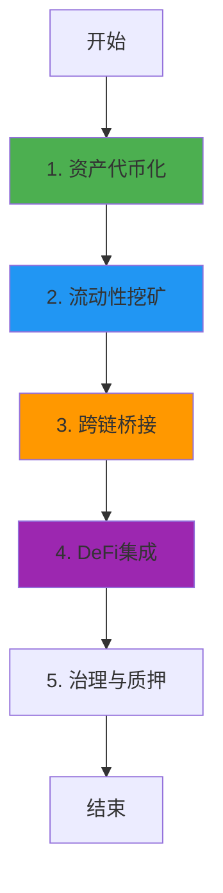

# Plume Network 业务流程与技术实现深度解析

**文档版本**: v2.0  
**创建时间**: 2025-10-13 12:20:00 CST  
**文档类型**: 业务流程导向的技术深度解析  
**定位**: RWA专用Layer 2区块链  
**信息来源**: Plume Network官方文档 (https://plumenetwork.xyz/)

---

## 📑 目录

1. [Plume Network概述](#1-plume-network概述)
2. [业务流程1: 资产代币化](#2-业务流程1-资产代币化)
3. [业务流程2: 流动性挖矿](#3-业务流程2-流动性挖矿)
4. [业务流程3: 跨链桥接](#4-业务流程3-跨链桥接)
5. [业务流程4: DeFi集成](#5-业务流程4-defi集成)
6. [业务流程5: 治理与质押](#6-业务流程5-治理与质押)
7. [完整业务流程图](#7-完整业务流程图)
8. [Arc技术栈](#8-arc技术栈)
9. [Nest钱包](#9-nest钱包)
10. [网络信息](#10-网络信息)
11. [总结与最佳实践](#11-总结与最佳实践)

---

## 1. Plume Network概述

### 1.1 核心定位

**Plume Network是首个专为RWA(真实世界资产)设计的Layer 2区块链**,提供完整的资产代币化、DeFi和合规基础设施。

**核心价值主张**:
- **RWA专用L2**: 专为RWA优化的区块链基础设施
- **Arc技术栈**: 模块化的资产代币化框架
- **Nest钱包**: 内置合规的智能钱包
- **低成本**: 极低的Gas费用,适合高频交易

---

### 1.2 核心架构

Plume Network采用**Optimistic Rollup + Arc技术栈**:
- **Plume L2**: 基于Optimism的Layer 2
- **Arc**: 资产代币化框架
- **Nest**: 智能合约钱包
- **Bridge**: 跨链桥接协议

**核心合约**: ArcFactory, ArcToken, NestWallet, PlumeBridge

---

## 2. 业务流程1: 资产代币化

### 2.1 流程概述

资产代币化是Plume Network的核心功能,通过Arc技术栈实现。

**核心步骤**:
1. 资产发行者提交代币化申请
2. 选择Arc模板(房地产、艺术品、碳信用等)
3. 配置资产参数
4. 部署ArcToken合约
5. 开启认购

---

### 2.2 ArcFactory合约详解

**核心方法**:
```solidity
/**
 * @dev 部署Arc代币
 * @param assetType 资产类型
 * @param name 代币名称
 * @param symbol 代币符号
 * @param totalSupply 总供应量
 */
function deployArcToken(
    AssetType assetType,
    string memory name,
    string memory symbol,
    uint256 totalSupply
) external returns (address tokenAddress) {
    // 1. 选择Arc模板
    address template = arcTemplates[assetType];
    
    // 2. 克隆合约
    ArcToken token = ArcToken(Clones.clone(template));
    
    // 3. 初始化
    token.initialize(name, symbol, totalSupply, msg.sender);
    
    // 4. 注册
    arcRegistry.registerToken(address(token), assetType);
    
    return address(token);
}
```

---

## 3. 业务流程2: 流动性挖矿

### 3.1 流程概述

流动性挖矿激励用户为RWA代币提供流动性。

**核心步骤**:
1. 用户将RWA代币和稳定币添加到流动性池
2. 获得LP代币
3. 质押LP代币到挖矿合约
4. 获得PLUME代币奖励

---

## 4. 业务流程3: 跨链桥接

### 4.1 流程概述

跨链桥接允许资产在Plume L2和其他链之间转移。

**核心步骤**:
1. 用户在源链锁定代币
2. PlumeBridge验证交易
3. 在目标链铸造代币
4. 用户在目标链接收代币

---

### 4.2 PlumeBridge合约详解

**核心方法**:
```solidity
/**
 * @dev 桥接代币到Plume L2
 * @param token 代币地址
 * @param amount 桥接数量
 */
function bridgeToPlume(
    address token,
    uint256 amount
) external {
    // 1. 锁定代币
    IERC20(token).transferFrom(msg.sender, address(this), amount);
    
    // 2. 发送消息到L2
    messenger.sendMessage(
        l2Bridge,
        abi.encodeWithSignature(
            "mintOnL2(address,address,uint256)",
            token,
            msg.sender,
            amount
        )
    );
    
    // 3. 触发事件
    emit BridgedToPlume(token, msg.sender, amount);
}
```

---

## 5. 业务流程4: DeFi集成

### 5.1 流程概述

Plume Network支持RWA代币的DeFi应用,包括借贷、交易、衍生品等。

**支持的DeFi协议**:
- **Lending**: 使用RWA作为抵押品借贷
- **DEX**: 去中心化交易所
- **Derivatives**: RWA衍生品

---

## 6. 业务流程5: 治理与质押

### 6.1 流程概述

PLUME代币持有者可以参与网络治理和质押获得奖励。

**核心步骤**:
1. 质押PLUME代币
2. 获得投票权
3. 参与治理提案投票
4. 获得质押奖励

---

## 7. 完整业务流程图



---

## 8. Arc技术栈

### 8.1 模块化架构

Arc技术栈提供模块化的资产代币化框架:

**核心模块**:
- **Asset Module**: 资产管理
- **Compliance Module**: 合规检查
- **Distribution Module**: 分红分配
- **Governance Module**: 治理投票

### 8.2 Arc模板

Plume提供多种Arc模板:
- **Real Estate Arc**: 房地产代币化
- **Art Arc**: 艺术品代币化
- **Carbon Arc**: 碳信用代币化
- **Commodity Arc**: 大宗商品代币化

---

## 9. Nest钱包

### 9.1 智能合约钱包

Nest是Plume的智能合约钱包,内置合规功能:

**核心特性**:
- **Account Abstraction**: 账户抽象,支持社交恢复
- **Compliance**: 内置KYC/AML检查
- **Gas Sponsorship**: Gas费用赞助
- **Multi-Sig**: 多签支持

### 9.2 代码示例

```solidity
/**
 * @dev Nest钱包执行交易
 * @param to 目标地址
 * @param value 转账金额
 * @param data 调用数据
 */
function execute(
    address to,
    uint256 value,
    bytes memory data
) external onlyOwner {
    // 1. 合规检查
    require(complianceModule.canExecute(msg.sender, to), "Not compliant");
    
    // 2. 执行交易
    (bool success, ) = to.call{value: value}(data);
    require(success, "Execution failed");
    
    // 3. 触发事件
    emit Executed(to, value, data);
}
```

---

## 10. 网络信息

### 10.1 Plume Testnet

- **Chain ID**: 161221135
- **RPC**: https://testnet-rpc.plumenetwork.xyz
- **Explorer**: https://testnet-explorer.plumenetwork.xyz
- **Faucet**: https://faucet.plumenetwork.xyz

### 10.2 Plume Mainnet (即将上线)

- **Chain ID**: TBA
- **RPC**: TBA

---

## 11. 总结与最佳实践

### 11.1 核心特点

1. **RWA专用L2**: 专为RWA优化
2. **Arc技术栈**: 模块化代币化框架
3. **Nest钱包**: 内置合规的智能钱包
4. **低成本**: 极低的Gas费用

### 11.2 开发最佳实践

1. **资产代币化**: 使用Arc模板快速部署
2. **流动性管理**: 参与流动性挖矿激励
3. **跨链集成**: 使用PlumeBridge桥接资产
4. **DeFi应用**: 构建RWA DeFi协议

### 11.3 常见问题FAQ

**Q: Plume与其他L2的区别?**
A: Plume专为RWA设计,提供Arc技术栈和Nest钱包。

**Q: 如何在Plume上部署RWA代币?**
A: 使用ArcFactory选择模板并部署。

**Q: Gas费用如何?**
A: 极低,适合高频RWA交易。

---

## 📚 参考资源

- **官方网站**: https://plumenetwork.xyz/
- **文档**: https://docs.plumenetwork.xyz/
- **GitHub**: https://github.com/plumenetwork

---

**文档结束**

