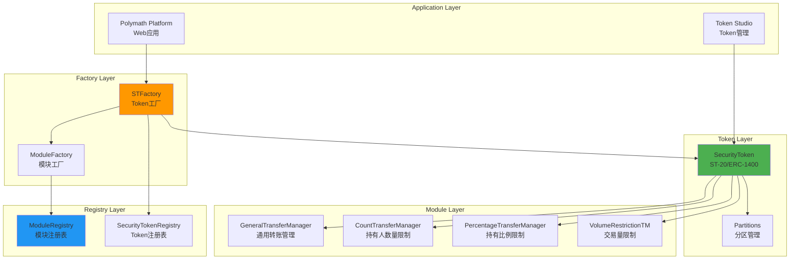
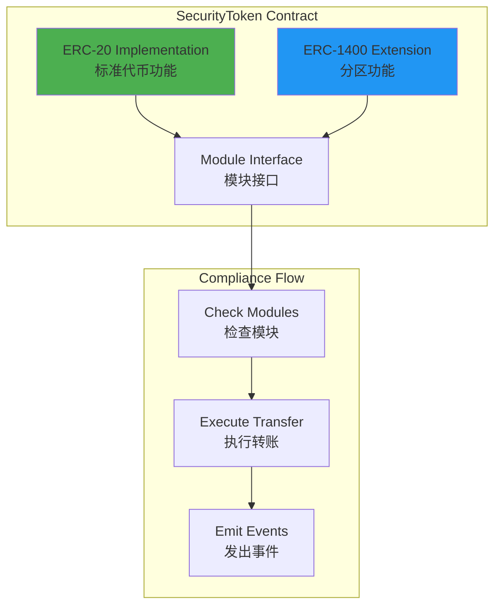
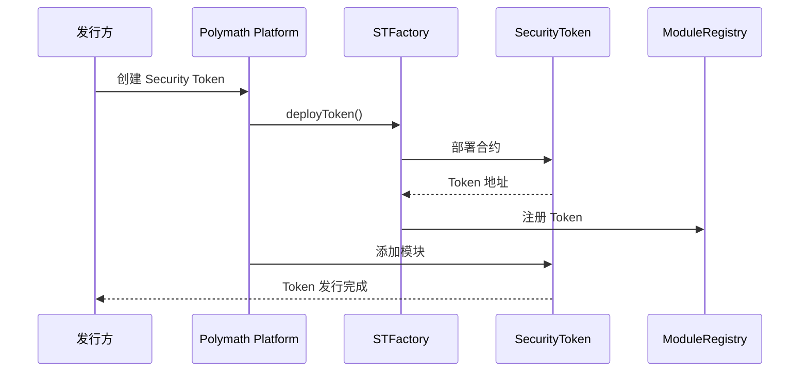
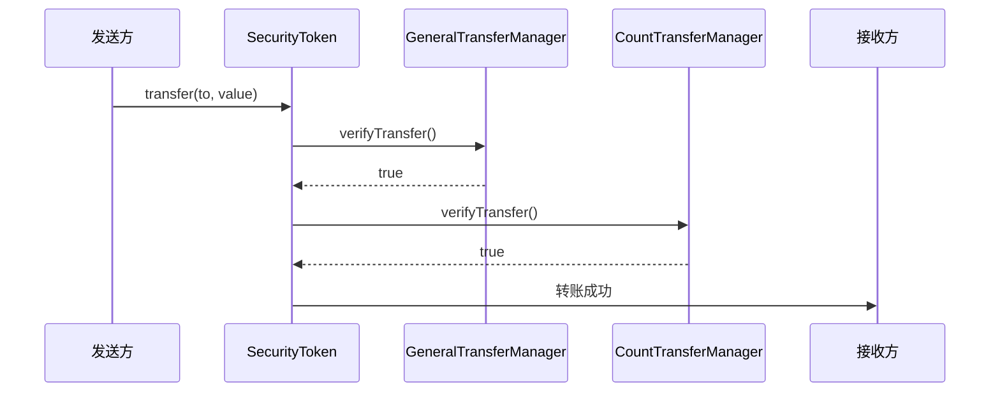
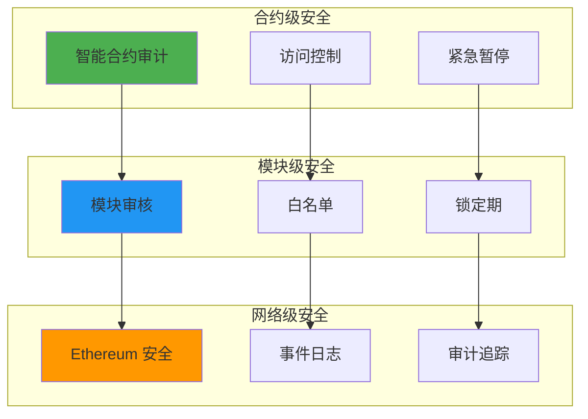

# Polymath 技术架构分析

**文档版本**: v2.1
**创建时间**: 2025-10-14 09:35:00 CST
**文档类型**: 技术架构分析
**定位**: Security Token Standard (ST-20/ERC-1400)
**信息来源**: GitHub 官方合约 + ERC-1400 标准

---

## 📑 目录

1. [系统整体架构](#1-系统整体架构)
2. [ST-20/ERC-1400 架构](#2-st-20erc-1400架构)
3. [核心模块详解](#3-核心模块详解)
4. [技术选型分析](#4-技术选型分析)
5. [数据流程](#5-数据流程)
6. [安全架构](#6-安全架构)

---

## 1. 系统整体架构

### 1.1 Polymath 整体架构



### 1.2 核心组件说明

| 组件                       | 职责           | 关键功能                       |
| -------------------------- | -------------- | ------------------------------ |
| **SecurityToken**          | ST-20/ERC-1400 | ERC-20 + 合规 + 分区           |
| **STFactory**              | Token 工厂     | 标准化部署、版本管理           |
| **ModuleRegistry**         | 模块注册表     | 模块发现、版本管理、审核       |
| **GeneralTransferManager** | 通用转账管理   | 白名单、KYC/AML、锁定期        |
| **CountTransferManager**   | 持有人数量限制 | 最大持有人数量限制             |
| **PercentageTransferManager** | 持有比例限制 | 单个投资者最大持有比例限制     |
| **VolumeRestrictionTM**    | 交易量限制     | 24小时交易量限制               |

---

## 2. ST-20/ERC-1400 架构

### 2.1 SecurityToken 结构



### 2.2 ERC-1400 分区功能

**分区(Partitions)**：
- 允许将 Token 分成不同的"分区"
- 每个分区可以有不同的转账限制
- 支持部分转账和部分赎回

**分区类型**：
- **Locked Partition**: 锁定分区(不可转账)
- **Unlocked Partition**: 解锁分区(可转账)
- **Reserved Partition**: 预留分区(特殊用途)

---

## 3. 核心模块详解

### 3.1 SecurityToken 合约

**核心方法**:

```solidity
// 转账(带模块检查)
function transfer(address to, uint256 value) public returns (bool) {
    require(_verifyTransfer(msg.sender, to, value), "Transfer not allowed");
    return super.transfer(to, value);
}

// 模块检查
function _verifyTransfer(address from, address to, uint256 value) internal returns (bool) {
    for (uint i = 0; i < modules.length; i++) {
        if (!modules[i].verifyTransfer(from, to, value)) {
            return false;
        }
    }
    return true;
}

// 添加模块
function addModule(address module) public onlyOwner {
    modules.push(IModule(module));
}
```

### 3.2 GeneralTransferManager (GTM)

**核心功能**:
- 白名单管理
- KYC/AML 验证
- 锁定期管理
- 投资者类型管理

**核心方法**:

```solidity
// 验证转账
function verifyTransfer(address from, address to, uint256 value) public returns (bool) {
    // 检查发送方白名单
    if (!whitelist[from]) return false;
    
    // 检查接收方白名单
    if (!whitelist[to]) return false;
    
    // 检查锁定期
    if (block.timestamp < lockupTime[from]) return false;
    
    return true;
}

// 添加到白名单
function modifyWhitelist(address investor, uint256 fromTime, uint256 toTime) public onlyOwner {
    whitelist[investor] = true;
    fromTime[investor] = fromTime;
    toTime[investor] = toTime;
}
```

### 3.3 CountTransferManager (CTM)

**核心功能**:
- 限制最大持有人数量
- 符合 Reg D 506(c) 要求(最多 2000 人)

**核心方法**:

```solidity
// 验证转账
function verifyTransfer(address from, address to, uint256 value) public returns (bool) {
    // 如果接收方已经持有,直接允许
    if (balanceOf(to) > 0) return true;
    
    // 检查是否超过最大持有人数量
    if (holderCount >= maxHolderCount) return false;
    
    return true;
}
```

---

## 4. 技术选型分析

### 4.1 为什么选择 ERC-1400

**优势**：
- ✅ **行业标准**：广泛认可的 Security Token 标准
- ✅ **分区功能**：支持复杂的合规需求
- ✅ **ERC-20 兼容**：与现有 DeFi 生态兼容
- ✅ **可扩展**：支持自定义模块

**ERC-1400 vs 其他标准**：

| 特性       | ERC-1400 | R-Token | ERC-3643 |
| ---------- | -------- | ------- | -------- |
| ERC-20 兼容 | ✅ | ✅ | ✅ |
| 分区功能   | ✅ | ❌ | ❌ |
| 模块化     | ✅ | ✅ | ✅ |
| 行业采用   | ⭐⭐⭐⭐⭐ | ⭐⭐⭐ | ⭐⭐⭐⭐ |

---

## 5. 数据流程

### 5.1 Security Token 发行流程



### 5.2 转账流程



---

## 6. 安全架构

### 6.1 多层安全防护



---

## 📚 参考资源

- [Polymath GitHub](https://github.com/PolymathNetwork/polymath-core)
- [ERC-1400 标准](https://github.com/ethereum/EIPs/issues/1400)
- [Polymath 文档](https://docs.polymath.network)
- [ST-20 标准](https://github.com/PolymathNetwork/polymath-core/blob/master/docs/ST20.md)

---

**文档维护**: RWA-HUSD 技术团队  
**最后更新**: 2025-10-14 09:35:00 CST

