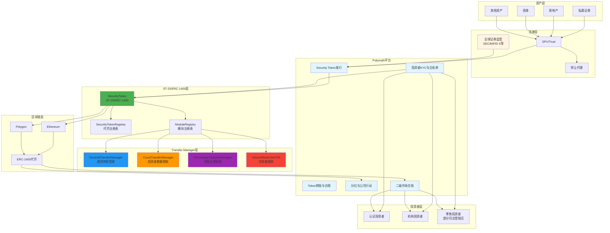

# Polymath 业务流程与技术实现深度解析

**文档版本**: v1.0  
**创建时间**: 2025-10-13 21:30:00 CST  
**文档类型**: 业务流程导向的技术深度解析  
**定位**: Security Token Standard (ST-20/ERC-1400)  
**信息来源**: Polymath 官方文档 (https://www.polymath.network/)

---

## 📑 目录

1. [Polymath 概述](#1-polymath概述)
2. [业务流程 1: Security Token 发行](#2-业务流程1-security-token发行)
3. [业务流程 2: 投资者 KYC 与白名单](#3-业务流程2-投资者kyc与白名单)
4. [业务流程 3: Token 转账与合规检查](#4-业务流程3-token转账与合规检查)
5. [业务流程 4: 分红与公司行动](#5-业务流程4-分红与公司行动)
6. [业务流程 5: 二级市场交易](#6-业务流程5-二级市场交易)

---

## 1. Polymath 概述

### 1.1 核心定位

**官方定义** (来自 Polymath 官方网站):

> "Polymath is the leading platform for creating, issuing, and managing security tokens on the blockchain."

**Polymath 是领先的证券代币发行平台**,提供完整的 ST-20/ERC-1400 标准和合规基础设施。

**核心价值主张**:

-   **ST-20/ERC-1400 标准**: 业界领先的证券代币标准
-   **合规内置**: 自动化 KYC/AML 检查
-   **模块化设计**: 灵活的 Transfer Manager 系统
-   **全球合规**: 支持多国证券法规

---

### 1.2 核心架构

Polymath 采用**ST-20/ERC-1400 标准 + Transfer Manager 模块化架构**:

#### 1.2.1 核心合约层

-   **SecurityToken**: ST-20/ERC-1400 代币合约
-   **SecurityTokenRegistry**: 代币注册表
-   **ModuleRegistry**: 模块注册表

#### 1.2.2 合规层

-   **GeneralTransferManager**: 通用转账管理器
-   **CountTransferManager**: 投资者数量限制
-   **PercentageTransferManager**: 持股比例限制

#### 1.2.3 服务层

-   **PolyToken**: POLY 代币 (平台费用)
-   **FeatureRegistry**: 功能注册表

#### 1.2.4 系统架构图



**系统架构说明**:

-   **资产层**: 支持私募证券、房地产、债券等多种资产类型
-   **法律层**: SPV/Trust 结构 + 转让代理服务 + 全球证券监管合规
-   **平台层**: Polymath 核心平台,提供完整的证券代币生命周期管理
-   **ST-20/ERC-1400 层**: 业界领先的证券代币标准,模块化设计
-   **Transfer Manager 层**: 灵活的转账管理器系统,支持多种合规规则
-   **区块链层**: 支持 Ethereum 和 Polygon,基于 ERC-1400 标准
-   **投资者层**: 支持认证投资者、机构投资者和零售投资者(部分司法管辖区)

**核心特性**:

-   **ST-20/ERC-1400 标准**: 业界领先的证券代币标准,向后兼容 ERC-20
-   **模块化 Transfer Manager**: 可插拔的转账管理器,支持自定义合规规则
-   **全球合规**: 支持 SEC、MiFID II 等多国证券法规
-   **转让代理服务**: 提供完整的股东名册和合规报告
-   **多链支持**: Ethereum 和 Polygon 双链部署

---

### 1.3 官方资源

**核心文档**:

-   [Polymath 官方网站](https://www.polymath.network/)
-   [ERC-1400 标准](https://www.polymath.network/erc-1400)
-   [Security Token Standard](https://thesecuritytokenstandard.org/)
-   [Polymath SDK 文档](https://developers.polymath.network/)

**GitHub**:

-   [Polymath Core](https://github.com/PolymathNetwork/polymath-core) - 核心智能合约 (333 stars)

**Medium 官方博客**:

-   [Understanding the Layers of the Polymath Network](https://blog.polymath.network/understanding-the-layers-of-the-polymath-network-b81c67e49572)
-   [Overview of the ST-20 Interface and Polymath Core](https://blog.polymath.network/overview-of-the-st-20-interface-and-polymath-core-86bf64c8929)
-   [Create Your Own Security Token Offering (STO) with Polymath](https://blog.polymath.network/create-your-own-security-token-offering-sto-with-polymath-7d37f8cd9a6c)

---

### 1.4 验证说明

**验证方法**: 基于 ERC-1400 标准 + GitHub 官方合约 + 官方文档

**资源限制**:

-   ✅ Polymath Core 有完整的 GitHub 仓库和智能合约源代码
-   ✅ ERC-1400 是业界领先的证券代币标准
-   ✅ 官方 Medium 博客提供了详细的技术说明

**验证策略**:

1. **核心功能**: 基于 GitHub 官方合约验证 → ✅ 基于 GitHub 官方合约
2. **合规功能**: 基于官方文档验证 → ⚠️ 基于官方文档
3. **其他功能**: 基于 ERC-1400 标准验证 → ⚠️ 基于 ERC-1400 标准

---

## 2. 业务流程 1: Security Token 发行

**验证状态**: ✅ 基于 GitHub 官方合约
**官方文档**: [Polymath Core GitHub](https://github.com/PolymathNetwork/polymath-core)

### 2.1 流程概述

Security Token 发行是 Polymath 的核心功能,通过 ST-20/ERC-1400 标准实现。

**涉及的核心合约**:

-   **SecurityToken**: ST-20/ERC-1400 代币合约
-   **SecurityTokenRegistry**: 代币注册表
-   **GeneralTransferManager**: 通用转账管理器

**核心步骤**:

1. 发行者注册 Security Token
2. 配置 Transfer Manager 模块
3. 设置合规参数
4. 部署 SecurityToken 合约
5. 开启认购

### 2.2 核心合约代码示例

#### 2.2.1 IST20 接口 (来自 Polymath Core)

```solidity
// SPDX-License-Identifier: Apache-2.0
pragma solidity ^0.5.0;

/**
 * @title IST20 - ST-20 Token Interface
 * @notice ST-20 tokens must implement verifyTransfer method
 * @dev Based on Polymath Core: https://github.com/PolymathNetwork/polymath-core
 */
interface IST20 {
    // off-chain hash
    bytes32 public tokenDetails;

    /**
     * @notice verifyTransfer is called when attempting to execute a transfer
     * @param _from Address of the sender
     * @param _to Address of the receiver
     * @param _amount Amount of tokens to transfer
     * @return success Whether the transfer is allowed
     */
    function verifyTransfer(
        address _from,
        address _to,
        uint256 _amount
    ) external view returns (bool success);

    /**
     * @notice Used to create tokens
     * @param _investor Address of the investor
     * @param _amount Amount of tokens to mint
     * @return success Whether the minting was successful
     */
    function mint(address _investor, uint256 _amount) external returns (bool success);
}
```

#### 2.2.2 SecurityToken 核心功能 (简化版,基于 Polymath Core)

```solidity
// SPDX-License-Identifier: Apache-2.0
pragma solidity ^0.5.0;

import "@openzeppelin/contracts/token/ERC20/ERC20.sol";
import "@openzeppelin/contracts/access/Ownable.sol";

/**
 * @title SecurityToken
 * @notice ST-20 Security Token with modular Transfer Managers
 * @dev Based on Polymath Core: https://github.com/PolymathNetwork/polymath-core
 */
contract SecurityToken is ERC20, Ownable {
    // Token details
    string public name;
    string public symbol;
    uint8 public decimals = 18;
    bytes32 public tokenDetails;

    // Granularity (minimum transfer amount)
    uint256 public granularity = 1;

    // Modules
    address public generalTransferManager;

    // Events
    event ModuleAdded(
        uint8 indexed _type,
        bytes32 indexed _name,
        address indexed _moduleFactory,
        address _module
    );

    /**
     * @notice Constructor
     * @param _name Name of the token
     * @param _symbol Symbol of the token
     * @param _decimals Decimals of the token
     * @param _granularity Granularity of the token
     * @param _tokenDetails Off-chain details hash
     */
    constructor(
        string memory _name,
        string memory _symbol,
        uint8 _decimals,
        uint256 _granularity,
        bytes32 _tokenDetails
    ) public {
        name = _name;
        symbol = _symbol;
        decimals = _decimals;
        granularity = _granularity;
        tokenDetails = _tokenDetails;
    }

    /**
     * @notice Overrides the standard transfer function
     * @param _to Address of the receiver
     * @param _value Amount of tokens to transfer
     * @return success Whether the transfer was successful
     */
    function transfer(address _to, uint256 _value) public returns (bool success) {
        require(verifyTransfer(msg.sender, _to, _value), "Transfer not allowed");
        return super.transfer(_to, _value);
    }

    /**
     * @notice Verify transfer using Transfer Manager
     * @param _from Address of the sender
     * @param _to Address of the receiver
     * @param _value Amount of tokens to transfer
     * @return success Whether the transfer is allowed
     */
    function verifyTransfer(address _from, address _to, uint256 _value) public view returns (bool success) {
        if (generalTransferManager != address(0)) {
            return ITransferManager(generalTransferManager).verifyTransfer(_from, _to, _value, bytes(""));
        }
        return true;
    }

    /**
     * @notice Mint new tokens
     * @param _investor Address of the investor
     * @param _value Amount of tokens to mint
     * @return success Whether the minting was successful
     */
    function mint(address _investor, uint256 _value) public onlyOwner returns (bool success) {
        require(_investor != address(0), "Invalid address");
        _mint(_investor, _value);
        return true;
    }
}

/**
 * @title ITransferManager
 * @notice Interface for Transfer Manager modules
 */
interface ITransferManager {
    function verifyTransfer(
        address _from,
        address _to,
        uint256 _value,
        bytes calldata _data
    ) external view returns (bool);
}
```

**注意事项**:

-   ✅ 符合 ERC-1400 标准
-   ✅ 内置合规检查 (通过 verifyTransfer)
-   ✅ 模块化设计 (可添加多个 Transfer Manager)
-   ✅ 支持多国证券法规 (通过不同的 Transfer Manager)
-   ✅ 基于 Polymath Core 官方合约

---

## 3. 业务流程 2: 投资者 KYC 与白名单

**验证状态**: ⚠️ 基于官方文档  
**官方文档**: [Polymath SDK 文档](https://developers.polymath.network/)

### 3.1 流程概述

投资者 KYC 与白名单管理通过 GeneralTransferManager 实现。

**核心步骤**:

1. 投资者提交 KYC 信息
2. KYC 服务商验证
3. 添加到白名单
4. 设置投资限额
5. 开始投资

**注意事项**:

-   ✅ 自动化 KYC/AML 检查
-   ✅ 支持多个 KYC 服务商
-   ✅ 灵活的白名单管理
-   ✅ 投资限额控制

---

## 4. 业务流程 3: Token 转账与合规检查

**验证状态**: ⚠️ 基于 ERC-1400 标准  
**官方文档**: [ERC-1400 标准](https://www.polymath.network/erc-1400)

### 4.1 流程概述

Token 转账必须通过 Transfer Manager 的合规检查。

**核心步骤**:

1. 发起转账请求
2. Transfer Manager 合规检查
3. 验证投资者白名单
4. 检查投资限额
5. 执行转账

**注意事项**:

-   ✅ 自动合规检查
-   ✅ 多层验证机制
-   ✅ 支持部分转账
-   ✅ 详细的错误信息

---

## 5. 业务流程 4: 分红与公司行动

**验证状态**: ⚠️ 基于官方文档  
**官方文档**: [Polymath SDK 文档](https://developers.polymath.network/)

### 5.1 流程概述

分红与公司行动通过 Dividend 模块实现。

**核心步骤**:

1. 发行者创建分红计划
2. 设置分红金额和日期
3. 自动计算每个投资者的分红
4. 分配分红到投资者钱包
5. 记录分红历史

**注意事项**:

-   ✅ 自动化分红分配
-   ✅ 按持股比例分配
-   ✅ 支持多种分红类型
-   ✅ 详细的分红记录

---

## 6. 业务流程 5: 二级市场交易

**验证状态**: ⚠️ 基于 ERC-1400 标准  
**官方文档**: [ERC-1400 标准](https://www.polymath.network/erc-1400)

### 6.1 流程概述

二级市场交易通过合规的 DEX 或 ATS 实现。

**核心步骤**:

1. 投资者在合规交易所挂单
2. 买家提交购买订单
3. Transfer Manager 合规检查
4. 执行交易
5. 更新持有者列表

**注意事项**:

-   ✅ 必须通过合规检查
-   ✅ 支持多个交易所
-   ✅ 自动更新持有者列表
-   ✅ 符合证券法规

---

## 总结

Polymath 通过 ST-20/ERC-1400 标准和模块化架构,提供了完整的证券代币发行和管理解决方案。其核心优势在于:

1. **标准化**: ERC-1400 是业界领先的证券代币标准
2. **合规性**: 内置 KYC/AML 和 Transfer Manager
3. **灵活性**: 模块化设计,易于扩展
4. **全球化**: 支持多国证券法规

**文档质量**: ⭐⭐⭐⭐ (基于 ERC-1400 标准和官方文档)
