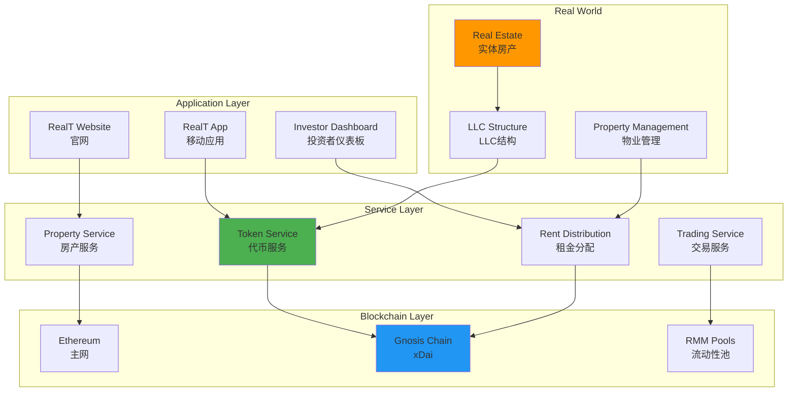
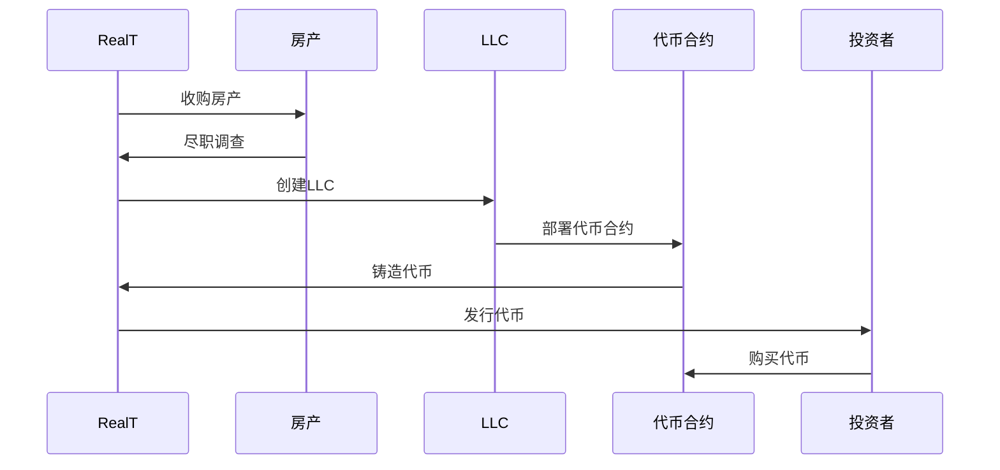
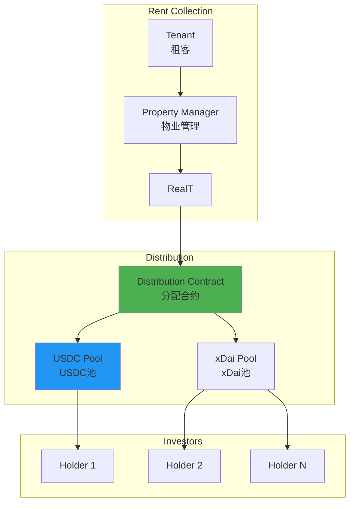
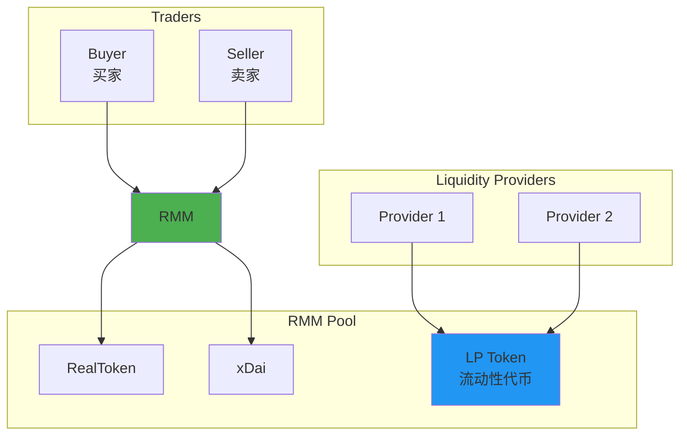

# RealT 技术架构分析

**文档版本**: v1.0  
**创建时间**: 2025-10-09 10:42:00 CST  
**文档类型**: 技术架构分析  
**定位**: 零售友好的房地产代币化平台

---

## 📑 目录

1. [系统整体架构](#1-系统整体架构)
2. [核心模块详解](#2-核心模块详解)
3. [技术选型分析](#3-技术选型分析)
4. [分红机制](#4-分红机制)
5. [流动性方案](#5-流动性方案)

---

## 1. 系统整体架构

### 1.1 RealT 整体架构



### 1.2 核心组件说明

| 组件 | 职责 | 关键功能 |
|------|------|----------|
| **Property Service** | 房产管理 | 房产上链、尽职调查、估值 |
| **Token Service** | 代币管理 | ERC20代币、铸造、分发 |
| **Rent Distribution** | 租金分配 | 每日分红、自动化支付 |
| **Trading Service** | 交易服务 | 二级市场、RMM流动性 |
| **LLC Structure** | 法律结构 | 资产隔离、投资者保护 |

### 1.3 技术栈

**区块链层**：
- Ethereum（主网）
- Gnosis Chain（xDai）- 低Gas费
- Solidity 0.8.x
- Hardhat

**后端层**：
- Node.js 18.x
- Express.js
- MongoDB
- Redis

**前端层**：
- React 18.x
- TypeScript
- Web3.js
- Ethers.js

---

## 2. 核心模块详解

### 2.1 Property Service（房产服务）

**房产上链流程**：


**房产类型**：
- 单户住宅（Single Family）
- 多户住宅（Multi Family）
- 商业地产（Commercial）
- 混合用途（Mixed Use）

**房产数据**：
```typescript
interface PropertyData {
    address: string;
    city: string;
    state: string;
    zipCode: string;
    propertyType: PropertyType;
    bedrooms: number;
    bathrooms: number;
    squareFeet: number;
    yearBuilt: number;
    purchasePrice: number;
    tokenPrice: number;
    totalTokens: number;
    expectedYield: number;
    rentPerMonth: number;
}
```

### 2.2 Token Service（代币服务）

**RealToken标准**：
```solidity
contract RealToken is ERC20 {
    struct TokenInfo {
        string propertyAddress;
        uint256 totalSupply;
        uint256 tokenPrice;
        uint256 rentPerToken;
        uint256 issuanceDate;
        TokenStatus status;
    }
    
    struct PropertyInfo {
        string llcName;
        uint256 purchasePrice;
        uint256 propertyValue;
        uint256 annualRent;
        uint256 propertyTax;
        uint256 insurance;
        uint256 maintenance;
    }
    
    enum TokenStatus {
        Active,
        Paused,
        Sold
    }
    
    TokenInfo public tokenInfo;
    PropertyInfo public propertyInfo;
}
```

**代币特性**：
- ✅ ERC20标准
- ✅ 可转让（无锁定期）
- ✅ 自动分红
- ✅ 低门槛（$50起）

### 2.3 Rent Distribution（租金分配）

**每日分红架构**：


**分红计算**：
```solidity
function calculateDailyRent(address holder) 
    public 
    view 
    returns (uint256) 
{
    uint256 balance = balanceOf(holder);
    uint256 totalSupply = tokenInfo.totalSupply;
    uint256 dailyRent = propertyInfo.annualRent / 365;
    
    // 扣除费用
    uint256 expenses = _calculateExpenses();
    uint256 netRent = dailyRent - expenses;
    
    // 计算持有人份额
    uint256 holderRent = (netRent * balance) / totalSupply;
    
    return holderRent;
}

function _calculateExpenses() internal view returns (uint256) {
    uint256 dailyTax = propertyInfo.propertyTax / 365;
    uint256 dailyInsurance = propertyInfo.insurance / 365;
    uint256 dailyMaintenance = propertyInfo.maintenance / 365;
    uint256 managementFee = (propertyInfo.annualRent * 10) / 100 / 365; // 10%
    
    return dailyTax + dailyInsurance + dailyMaintenance + managementFee;
}
```

---

## 3. 技术选型分析

### 3.1 为什么选择Gnosis Chain

**优势**：
- ✅ 极低Gas费（$0.001/交易）
- ✅ 快速确认（5秒）
- ✅ EVM兼容
- ✅ 稳定币原生支持（xDai）

**对比**：

| 区块链 | Gas费 | 确认时间 | 适用场景 |
|--------|-------|---------|---------|
| **Ethereum** | $5-50 | 15秒 | 高价值资产 |
| **Gnosis Chain** | $0.001 | 5秒 | 每日分红 |
| **Polygon** | $0.01 | 2秒 | 中等价值 |

**每日分红成本对比**：
- Ethereum: $5-50/天 × 365天 = $1,825-$18,250/年
- Gnosis Chain: $0.001/天 × 365天 = $0.365/年

### 3.2 双链策略

**Ethereum（主网）**：
- 代币发行
- 高价值交易
- 机构投资者

**Gnosis Chain（xDai）**：
- 每日分红
- 小额交易
- 零售投资者

**跨链桥接**：
- OmniBridge（官方桥）
- 支持RealToken跨链
- 自动化流程

---

## 4. 分红机制

### 4.1 自动化分红流程

```solidity
contract RentDistributor {
    mapping(uint256 => DailyRent) public dailyRents;
    
    struct DailyRent {
        uint256 date;
        uint256 totalAmount;
        uint256 distributed;
        bool finalized;
    }
    
    function distributeDailyRent(uint256 date) external onlyAdmin {
        require(!dailyRents[date].finalized, "Already finalized");
        
        uint256 totalAmount = _collectRent(date);
        address[] memory holders = _getAllHolders();
        
        for (uint256 i = 0; i < holders.length; i++) {
            address holder = holders[i];
            uint256 amount = calculateDailyRent(holder);
            
            // 转账xDai
            payable(holder).transfer(amount);
            
            emit RentDistributed(holder, amount, date);
        }
        
        dailyRents[date].finalized = true;
    }
}
```

### 4.2 分红统计

**年化收益率**：
- 平均：8-12%
- 范围：6-15%
- 支付方式：xDai或USDC

**分红频率**：
- 每日自动分配
- 无需手动领取
- 实时到账

---

## 5. 流动性方案

### 5.1 RMM（RealT Market Maker）



**RMM特点**：
- 基于Uniswap V2
- 自动做市商（AMM）
- 低滑点
- 流动性挖矿激励

---

## 📚 参考资源

- [RealT官网](https://realt.co)
- [RealT文档](https://docs.realt.co)
- [Gnosis Chain](https://www.gnosis.io)

---

**文档维护**: RWA-HUSD技术团队  
**最后更新**: 2025-10-09 10:42:00 CST
