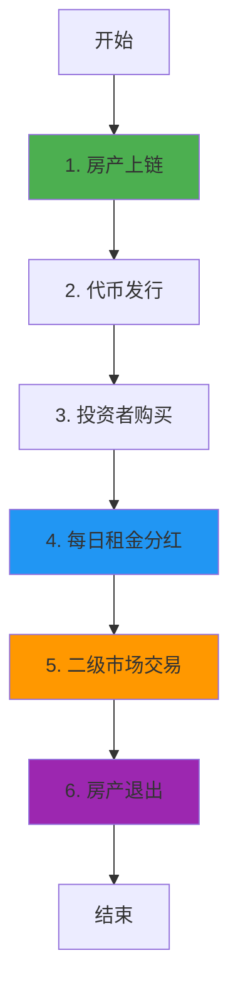

# RealT 业务流程与技术实现深度解析

**文档版本**: v2.0  
**创建时间**: 2025-10-13 12:15:00 CST  
**文档类型**: 业务流程导向的技术深度解析  
**定位**: 零售友好的房地产代币化平台  
**信息来源**: RealT官方文档 (https://realt.co/)

---

## 📑 目录

1. [RealT概述](#1-realt概述)
2. [业务流程1: 房产上链](#2-业务流程1-房产上链)
3. [业务流程2: 代币发行与购买](#3-业务流程2-代币发行与购买)
4. [业务流程3: 每日租金分红](#4-业务流程3-每日租金分红)
5. [业务流程4: 二级市场交易](#5-业务流程4-二级市场交易)
6. [业务流程5: 房产管理与退出](#6-业务流程5-房产管理与退出)
7. [完整业务流程图](#7-完整业务流程图)
8. [RMM流动性机制](#8-rmm流动性机制)
9. [LLC法律结构](#9-llc法律结构)
10. [网络信息](#10-网络信息)
11. [总结与最佳实践](#11-总结与最佳实践)

---

## 1. RealT概述

### 1.1 核心定位

**RealT是一个零售友好的房地产代币化平台**,允许投资者以低门槛(最低$50)投资美国房地产,并每日获得租金分红。

**核心价值主张**:
- **低门槛**: 最低$50即可投资房地产
- **每日分红**: 租金每日自动分配到投资者钱包
- **流动性**: 通过RMM(RealT Market Maker)提供二级市场流动性
- **透明性**: 所有房产信息和租金收入完全透明

---

### 1.2 核心架构

RealT采用**ERC20代币 + LLC法律结构**:
- **RealToken**: 每个房产对应一个ERC20代币
- **LLC**: 每个房产由独立的LLC持有
- **Rent Distribution**: 自动化租金分配合约
- **RMM**: 自动做市商提供流动性

**核心合约**: RealToken, RentDistribution, RMM, PropertyRegistry

---

## 2. 业务流程1: 房产上链

### 2.1 流程概述

房产上链是RealT业务流程的起点,由RealT团队负责房产筛选、尽职调查和代币化。

**核心步骤**:
1. 房产筛选(位置、租金收益率、状态)
2. 尽职调查(产权、租约、维修记录)
3. 成立LLC并购买房产
4. 部署RealToken合约
5. 开启认购

---

### 2.2 RealToken合约详解

**核心方法**:
```solidity
/**
 * @dev 部署房产代币
 * @param name 房产名称
 * @param symbol 代币符号
 * @param totalSupply 总供应量
 * @param propertyAddress 房产地址
 */
function deployRealToken(
    string memory name,
    string memory symbol,
    uint256 totalSupply,
    string memory propertyAddress
) external onlyAdmin returns (address tokenAddress) {
    // 1. 部署ERC20代币
    RealToken token = new RealToken(name, symbol, totalSupply);
    
    // 2. 注册房产信息
    propertyRegistry.registerProperty(
        address(token),
        propertyAddress,
        totalSupply
    );
    
    // 3. 配置租金分配
    rentDistribution.addProperty(address(token));
    
    return address(token);
}
```

---

## 3. 业务流程2: 代币发行与购买

### 3.1 流程概述

代币发行与购买是投资者参与的主要方式,支持信用卡、加密货币等多种支付方式。

**核心步骤**:
1. 投资者完成KYC
2. 选择房产并提交购买订单
3. 支付(信用卡/USDC/ETH)
4. 铸造代币到投资者钱包
5. 开始获得租金分红

---

## 4. 业务流程3: 每日租金分红

### 4.1 流程概述

每日租金分红是RealT的核心特色,租金每日自动分配到所有代币持有者。

**涉及的合约**: RentDistribution, RealToken

**核心步骤**:
1. 物业管理公司收取租金
2. RealT将租金转换为USDC
3. RentDistribution合约计算每个持有者的分红
4. 自动分配USDC到持有者钱包

---

### 4.2 RentDistribution合约详解

**核心方法**:
```solidity
/**
 * @dev 分配租金
 * @param token 房产代币地址
 * @param totalRent 总租金(USDC)
 */
function distributeRent(
    address token,
    uint256 totalRent
) external onlyAdmin {
    // 1. 获取所有持有者
    address[] memory holders = RealToken(token).getHolders();
    
    // 2. 计算每个持有者的分红
    for (uint i = 0; i < holders.length; i++) {
        address holder = holders[i];
        uint256 balance = RealToken(token).balanceOf(holder);
        uint256 rent = (totalRent * balance) / RealToken(token).totalSupply();
        
        // 3. 转账USDC
        usdc.transfer(holder, rent);
        
        // 4. 触发事件
        emit RentDistributed(token, holder, rent);
    }
}
```

---

## 5. 业务流程4: 二级市场交易

### 5.1 流程概述

二级市场交易通过RMM(RealT Market Maker)提供流动性,投资者可以随时买卖代币。

**核心步骤**:
1. 投资者在RealT平台挂单
2. RMM自动匹配订单
3. 执行交易
4. 更新持有者列表

---

### 5.2 RMM机制详解

**RMM(RealT Market Maker)**:
- 自动做市商,为每个房产代币提供流动性
- 使用恒定乘积公式(x * y = k)
- 支持即时买卖,无需等待对手方

**代码示例**:
```solidity
/**
 * @dev 通过RMM购买代币
 * @param token 房产代币地址
 * @param amount 购买数量
 */
function buyFromRMM(
    address token,
    uint256 amount
) external payable {
    // 1. 计算价格
    uint256 price = calculatePrice(token, amount);
    require(msg.value >= price, "Insufficient payment");
    
    // 2. 转账代币
    RealToken(token).transfer(msg.sender, amount);
    
    // 3. 更新流动性池
    updatePool(token, amount, msg.value);
}
```

---

## 6. 业务流程5: 房产管理与退出

### 6.1 流程概述

房产管理包括日常维护、租客管理等,退出机制包括房产出售和代币回购。

**核心步骤**:
1. 物业管理公司负责日常管理
2. 重大决策由代币持有者投票
3. 房产出售时,收益分配给所有持有者
4. 代币销毁

---

## 7. 完整业务流程图



---

## 8. RMM流动性机制

### 8.1 恒定乘积公式

RMM使用恒定乘积公式(Constant Product Formula):

```
x * y = k
```

其中:
- x = 代币储备量
- y = USDC储备量
- k = 常数

### 8.2 价格计算

```solidity
function calculatePrice(uint256 tokenAmount) public view returns (uint256) {
    uint256 newTokenReserve = tokenReserve - tokenAmount;
    uint256 newUsdcReserve = k / newTokenReserve;
    return newUsdcReserve - usdcReserve;
}
```

---

## 9. LLC法律结构

### 9.1 资产隔离

每个房产由独立的LLC持有,实现资产隔离:
- 房产A → LLC A → RealToken A
- 房产B → LLC B → RealToken B

### 9.2 投资者权益

代币持有者享有LLC的成员权益:
- 租金收益权
- 房产增值权
- 重大决策投票权

---

## 10. 网络信息

### 10.1 支持的网络

- **Ethereum Mainnet**: Chain ID 1 (主要代币)
- **Gnosis Chain (xDai)**: Chain ID 100 (租金分配)

---

## 11. 总结与最佳实践

### 11.1 核心特点

1. **低门槛**: 最低$50投资房地产
2. **每日分红**: 租金每日自动分配
3. **高流动性**: RMM提供即时买卖
4. **透明性**: 所有信息链上可查

### 11.2 开发最佳实践

1. **房产筛选**: 选择高租金收益率的房产
2. **租金分配**: 使用自动化合约每日分配
3. **流动性管理**: 通过RMM提供充足流动性
4. **法律合规**: 使用LLC结构保护投资者

### 11.3 常见问题FAQ

**Q: 租金如何分配?**
A: 每日自动分配USDC到持有者钱包。

**Q: 如何退出投资?**
A: 通过RMM二级市场即时卖出代币。

**Q: 房产维护费用如何支付?**
A: 从租金收入中扣除后再分配。

---

## 📚 参考资源

- **官方网站**: https://realt.co/
- **文档**: https://docs.realt.co/
- **RMM**: https://rmm.realtoken.network/

---

**文档结束**

