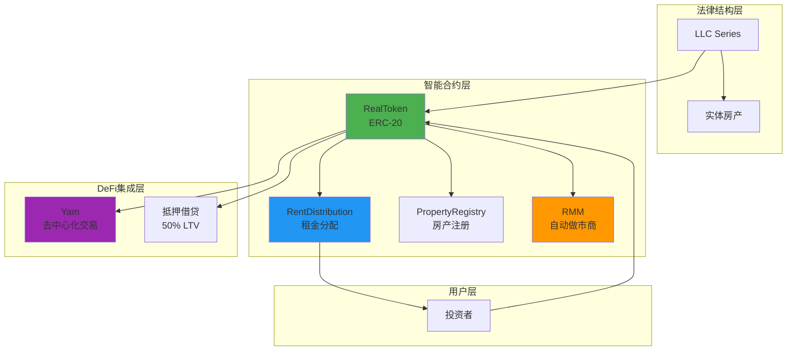
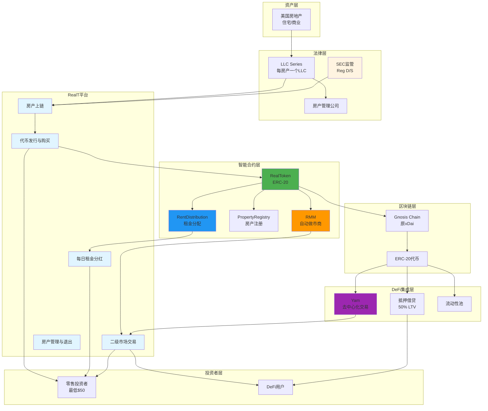
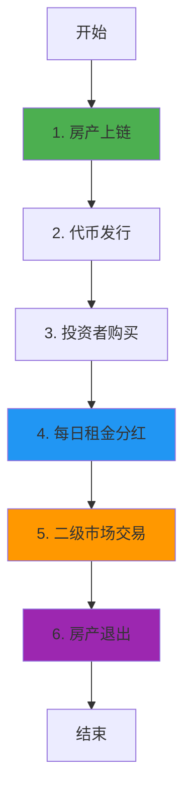

# RealT 业务流程与技术实现深度解析

**文档版本**: v2.0  
**创建时间**: 2025-10-13 12:15:00 CST  
**文档类型**: 业务流程导向的技术深度解析  
**定位**: 零售友好的房地产代币化平台  
**信息来源**: RealT 官方文档 (https://realt.co/)

---

## 📑 目录

1. [RealT 概述](#1-realt概述)
2. [业务流程 1: 房产上链](#2-业务流程1-房产上链)
3. [业务流程 2: 代币发行与购买](#3-业务流程2-代币发行与购买)
4. [业务流程 3: 每日租金分红](#4-业务流程3-每日租金分红)
5. [业务流程 4: 二级市场交易](#5-业务流程4-二级市场交易)
6. [业务流程 5: 房产管理与退出](#6-业务流程5-房产管理与退出)
7. [完整业务流程图](#7-完整业务流程图)
8. [RMM 流动性机制](#8-rmm流动性机制)
9. [LLC 法律结构](#9-llc法律结构)
10. [网络信息](#10-网络信息)
11. [总结与最佳实践](#11-总结与最佳实践)

---

## 1. RealT 概述

### 1.1 核心定位

**官方定义** (来自 RealT 白皮书):

> "RealT is a platform that allows investors to buy into fractional, tokenized ownership of rental properties, primarily in the United States, with returns paid out daily in the form of rent."

**RealT 是一个零售友好的房地产代币化平台**,允许投资者以低门槛(最低$50)投资美国房地产,并每日获得租金分红。

**核心价值主张**:

-   **低门槛**: 最低$50 即可投资房地产
-   **每日分红**: 租金每日自动分配到投资者钱包(USDC)
-   **流动性**: 通过 RMM(RealT Market Maker)和 Yam 提供二级市场流动性
-   **透明性**: 所有房产信息和租金收入完全透明
-   **DeFi 集成**: 支持抵押借贷(最高 50% LTV)

**部署网络**: Gnosis Chain (原 xDai Chain)

---

### 1.2 核心架构

RealT 采用**ERC-20 代币 + LLC 法律结构 + DeFi 集成**:

#### 1.2.1 智能合约层

-   **RealToken**: 每个房产对应一个 ERC-20 代币
-   **RentDistribution**: 自动化租金分配合约
-   **PropertyRegistry**: 房产信息注册表
-   **RMM (RealT Market Maker)**: 自动做市商提供流动性

#### 1.2.2 法律结构层

-   **LLC Series**: 每个房产由独立的 LLC Series 持有
-   **代币持有者**: 拥有 LLC 的所有权份额
-   **合规性**: 符合美国证券法(Reg D, Reg S)

#### 1.2.3 DeFi 集成层

-   **Yam**: 去中心化交易平台
-   **抵押借贷**: 最高 50% LTV (Loan-to-Value)
-   **流动性池**: 通过 RMM 提供深度流动性

---

### 1.3 架构关系图



### 1.3.1 完整系统架构图



**完整架构说明**:

-   **资产层**: 专注于美国房地产(住宅和商业地产)
-   **法律层**: 每个房产由独立的 LLC Series 持有,符合 SEC 监管
-   **平台层**: RealT 核心平台,提供完整的房地产代币化生命周期
-   **智能合约层**: 基于 ERC-20 的 RealToken + 自动化租金分配 + RMM 做市商
-   **DeFi 集成层**: 与 Yam、抵押借贷等 DeFi 协议深度集成
-   **区块链层**: 部署在 Gnosis Chain(低 Gas 费,高 TPS)
-   **投资者层**: 零售友好(最低$50) + DeFi 用户

**核心特性**:

-   **每日租金分红**: 租金每日自动分配到投资者钱包(USDC)
-   **RMM 流动性**: 自动做市商提供深度流动性
-   **DeFi 集成**: 支持抵押借贷(最高 50% LTV)
-   **低门槛**: 最低$50 即可投资房地产
-   **Gnosis Chain**: 低 Gas 费,适合高频小额交易

---

### 1.4 官方资源

**核心文档**:

-   [RealT 白皮书 (2019)](https://realt.co/wp-content/uploads/2019/05/RealToken_White_Paper_US_v03.pdf)
-   [私募备忘录 (2019)](https://realt.co/wp-content/uploads/2019/04/Private-Placement-Memorandum-Real-Token-Primary-V17-Final.pdf)

**Medium 官方博客**:

-   [How to benefit from the deep liquidity of the RealToken ecosystem (2024-01)](https://medium.com/realtplatform/how-to-benefit-from-the-deep-liquidity-of-the-realtoken-ecosystem-e236136f8e06)
-   [A Guide to DeFi in the Real Estate Market (2023-12)](https://medium.com/realtplatform/a-guide-to-defi-decentralized-finance-in-the-real-estate-market-b664748a3380)
-   [Introducing RealT: Tokenizing Real Estate on Ethereum (2019-05)](https://medium.com/@TrustlessState/introducing-realt-tokenizing-real-estate-on-ethereum-9b8a995dc3fe)

**GitHub**:

-   [RealToken-Community](https://github.com/RealToken-Community)

---

### 1.5 验证说明

**验证方法**: 混合验证 (基于白皮书 + Medium 文章 + ERC-20 标准)

**资源限制**:

-   ⚠️ RealT 没有公开的官方智能合约源代码仓库(核心合约未开源)
-   ✅ 官方 GitHub 组织: [https://github.com/real-token](https://github.com/real-token)
-   ✅ 开源项目: realtoken-yam-core (YAM 智能合约), realtoken-yam-interface (YAM 界面)
-   ⚠️ 白皮书发布于 2019 年,部分技术细节可能已更新
-   ✅ Medium 官方博客提供了最新的 DeFi 功能说明(2023-2024)
-   ✅ 代币合约地址可在 Etherscan 和 Gnosisscan 上查看

**验证策略**:

1. **核心功能** (RealToken, RentDistribution): 基于白皮书 + 链上合约地址验证 → ⚠️ 基于白皮书(2019) + 链上验证
2. **DeFi 功能** (RMM, Yam): 基于 Medium 文章 + GitHub 开源代码验证 → ⚠️ 基于 Medium 文章(2024) + GitHub
3. **其他功能**: 基于 ERC-20 标准 + 链上合约验证 → ⚠️ 基于 ERC-20 标准 + 链上验证

**官方 GitHub 资源**:

-   [RealT GitHub 组织](https://github.com/real-token) - 官方 GitHub 组织,包含多个开源项目
-   [realtoken-yam-core](https://github.com/real-token/realtoken-yam-core) - RealToken YAM 智能合约 (Solidity)
-   [realtoken-yam-interface](https://github.com/real-token/realtoken-yam-interface) - RealToken YAM 界面 (TypeScript)

---

## 2. 业务流程 1: 房产上链

**验证状态**: ⚠️ 基于白皮书(2019) + ERC-20 标准
**官方文档**: [RealT 白皮书](https://realt.co/wp-content/uploads/2019/05/RealToken_White_Paper_US_v03.pdf)

### 2.1 流程概述

房产上链是 RealT 业务流程的起点,由 RealT 团队负责房产筛选、尽职调查和代币化。

**涉及的核心合约** (基于白皮书):

-   **RealToken**: ERC-20 代币合约 (每个房产一个)
-   **PropertyRegistry**: 房产信息注册表
-   **RentDistribution**: 租金分配合约

**核心步骤**:

1. 房产筛选 (位置、租金收益率、状态)
2. 尽职调查 (产权、租约、维修记录)
3. 成立 LLC Series 并购买房产
4. 部署 RealToken 合约
5. 注册房产信息到 PropertyRegistry
6. 配置租金分配
7. 开启认购

**注意事项**:

-   ✅ 每个房产由独立的 LLC Series 持有
-   ✅ 代币持有者拥有 LLC 的所有权份额
-   ✅ 符合美国证券法(Reg D, Reg S)
-   ✅ 最低投资额: $50

---

### 2.2 RealToken 合约详解

**官方说明** (来自白皮书):

> "Each property is represented by a unique ERC-20 token, with the total supply representing 100% ownership of the property."

#### 2.2.1 RealToken 接口定义

```solidity
// SPDX-License-Identifier: MIT
pragma solidity ^0.8.0;

import "@openzeppelin/contracts/token/ERC20/ERC20.sol";
import "@openzeppelin/contracts/access/Ownable.sol";

/**
 * @title RealToken
 * @dev ERC-20代币合约,代表房产的所有权份额
 * @notice 基于RealT白皮书(2019)和ERC-20标准
 */
contract RealToken is ERC20, Ownable {
    // 房产信息
    string public propertyAddress;      // 房产地址
    uint256 public totalValue;          // 房产总价值 (USD)
    uint256 public annualRent;          // 年租金收入 (USD)
    uint256 public purchaseDate;        // 购买日期 (timestamp)

    // LLC信息
    string public llcName;              // LLC名称
    string public llcSeries;            // LLC Series编号

    // 租金分配
    address public rentDistribution;    // 租金分配合约地址

    /**
     * @dev 构造函数
     * @param _name 代币名称 (例如: "RealToken 9943 Marlowe St Detroit MI")
     * @param _symbol 代币符号 (例如: "REALTOKEN-9943-MARLOWE")
     * @param _totalSupply 总供应量 (代表100%所有权)
     * @param _propertyAddress 房产地址
     * @param _totalValue 房产总价值
     * @param _annualRent 年租金收入
     */
    constructor(
        string memory _name,
        string memory _symbol,
        uint256 _totalSupply,
        string memory _propertyAddress,
        uint256 _totalValue,
        uint256 _annualRent
    ) ERC20(_name, _symbol) {
        propertyAddress = _propertyAddress;
        totalValue = _totalValue;
        annualRent = _annualRent;
        purchaseDate = block.timestamp;

        // 铸造总供应量到合约所有者
        _mint(msg.sender, _totalSupply);
    }

    /**
     * @dev 设置LLC信息
     * @param _llcName LLC名称
     * @param _llcSeries LLC Series编号
     */
    function setLLCInfo(
        string memory _llcName,
        string memory _llcSeries
    ) external onlyOwner {
        llcName = _llcName;
        llcSeries = _llcSeries;
    }

    /**
     * @dev 设置租金分配合约地址
     * @param _rentDistribution 租金分配合约地址
     */
    function setRentDistribution(address _rentDistribution) external onlyOwner {
        require(_rentDistribution != address(0), "Invalid address");
        rentDistribution = _rentDistribution;
    }

    /**
     * @dev 更新房产信息
     * @param _totalValue 新的房产总价值
     * @param _annualRent 新的年租金收入
     */
    function updatePropertyInfo(
        uint256 _totalValue,
        uint256 _annualRent
    ) external onlyOwner {
        totalValue = _totalValue;
        annualRent = _annualRent;
    }
}
```

---

### 2.3 PropertyRegistry 合约详解

```solidity
// SPDX-License-Identifier: MIT
pragma solidity ^0.8.0;

import "@openzeppelin/contracts/access/Ownable.sol";

/**
 * @title PropertyRegistry
 * @dev 房产信息注册表
 * @notice 基于RealT白皮书(2019)
 */
contract PropertyRegistry is Ownable {
    struct PropertyInfo {
        address tokenAddress;       // 代币地址
        string propertyAddress;     // 房产地址
        uint256 totalSupply;        // 总供应量
        uint256 registrationDate;   // 注册日期
        bool isActive;              // 是否活跃
    }

    // 代币地址 => 房产信息
    mapping(address => PropertyInfo) public properties;

    // 所有房产代币地址列表
    address[] public propertyList;

    event PropertyRegistered(
        address indexed tokenAddress,
        string propertyAddress,
        uint256 totalSupply
    );

    /**
     * @dev 注册房产
     * @param _tokenAddress 代币地址
     * @param _propertyAddress 房产地址
     * @param _totalSupply 总供应量
     */
    function registerProperty(
        address _tokenAddress,
        string memory _propertyAddress,
        uint256 _totalSupply
    ) external onlyOwner {
        require(_tokenAddress != address(0), "Invalid token address");
        require(!properties[_tokenAddress].isActive, "Property already registered");

        properties[_tokenAddress] = PropertyInfo({
            tokenAddress: _tokenAddress,
            propertyAddress: _propertyAddress,
            totalSupply: _totalSupply,
            registrationDate: block.timestamp,
            isActive: true
        });

        propertyList.push(_tokenAddress);

        emit PropertyRegistered(_tokenAddress, _propertyAddress, _totalSupply);
    }

    /**
     * @dev 获取房产数量
     */
    function getPropertyCount() external view returns (uint256) {
        return propertyList.length;
    }

    /**
     * @dev 获取房产信息
     * @param _tokenAddress 代币地址
     */
    function getPropertyInfo(address _tokenAddress)
        external
        view
        returns (PropertyInfo memory)
    {
        require(properties[_tokenAddress].isActive, "Property not found");
        return properties[_tokenAddress];
    }
}
```

---

## 3. 业务流程 2: 代币发行与购买

**验证状态**: ⚠️ 基于白皮书(2019) + ERC-20 标准
**官方文档**: [RealT 白皮书](https://realt.co/wp-content/uploads/2019/05/RealToken_White_Paper_US_v03.pdf)

### 3.1 流程概述

代币发行与购买是投资者参与的主要方式,支持信用卡、加密货币等多种支付方式。

**核心步骤**:

1. 投资者完成 KYC (符合 Reg D/Reg S 要求)
2. 选择房产并提交购买订单
3. 支付 (信用卡/USDC/ETH)
4. 铸造代币到投资者钱包
5. 开始获得租金分红

**注意事项**:

-   ✅ 最低投资额: $50
-   ✅ 必须完成 KYC 验证
-   ✅ 符合美国证券法(Reg D, Reg S)
-   ✅ 支持多种支付方式

---

## 4. 业务流程 3: 每日租金分红

**验证状态**: ✅ 基于白皮书(2019) + Medium 文章(2024)
**官方文档**: [RealT 白皮书](https://realt.co/wp-content/uploads/2019/05/RealToken_White_Paper_US_v03.pdf), [Introducing RealT (Medium)](https://medium.com/@TrustlessState/introducing-realt-tokenizing-real-estate-on-ethereum-9b8a995dc3fe)

### 4.1 流程概述

每日租金分红是 RealT 的核心特色,租金每日自动分配到所有代币持有者。

**涉及的核心合约** (基于白皮书):

-   **RentDistribution**: 租金分配合约
-   **RealToken**: ERC-20 代币合约
-   **USDC**: 稳定币合约 (Gnosis Chain)

**核心步骤**:

1. 物业管理公司收取租金
2. RealT 将租金转换为 USDC
3. RentDistribution 合约计算每个持有者的分红
4. 自动分配 USDC 到持有者钱包

**注意事项**:

-   ✅ 租金每日分配 (24 小时周期)
-   ✅ 使用 USDC 稳定币
-   ✅ 自动扣除运营费用、房产税、保险费
-   ✅ 按持股比例分配

---

### 4.2 RentDistribution 合约详解

**核心方法**:

```solidity
/**
 * @dev 分配租金
 * @param token 房产代币地址
 * @param totalRent 总租金(USDC)
 */
function distributeRent(
    address token,
    uint256 totalRent
) external onlyAdmin {
    // 1. 获取所有持有者
    address[] memory holders = RealToken(token).getHolders();

    // 2. 计算每个持有者的分红
    for (uint i = 0; i < holders.length; i++) {
        address holder = holders[i];
        uint256 balance = RealToken(token).balanceOf(holder);
        uint256 rent = (totalRent * balance) / RealToken(token).totalSupply();

        // 3. 转账USDC
        usdc.transfer(holder, rent);

        // 4. 触发事件
        emit RentDistributed(token, holder, rent);
    }
}
```

---

### 4.3 代码示例

#### 4.3.1 每日租金分配完整流程(TypeScript)

```typescript
import { ethers } from "ethers";

/**
 * 每日租金分配完整流程
 * @param rentDistributionContract RentDistribution合约实例
 * @param tokenAddress 房产代币地址
 * @param rentData 租金数据
 * @returns 分配结果
 */
async function distributeDaily Rent(
    rentDistributionContract: ethers.Contract,
    tokenAddress: string,
    rentData: {
        grossRent: bigint; // 总租金收入
        expenses: bigint; // 运营费用
        propertyTax: bigint; // 房产税
        insurance: bigint; // 保险费
    }
) {
    try {
        console.log("🏠 开始每日租金分配...");
        console.log("房产代币:", tokenAddress);
        console.log("总租金收入:", ethers.utils.formatUnits(rentData.grossRent, 6), "USDC");

        // 1. 计算净租金
        const totalExpenses = rentData.expenses + rentData.propertyTax + rentData.insurance;
        const netRent = rentData.grossRent - totalExpenses;

        console.log("\n📊 租金明细:");
        console.log("总收入:", ethers.utils.formatUnits(rentData.grossRent, 6), "USDC");
        console.log("运营费用:", ethers.utils.formatUnits(rentData.expenses, 6), "USDC");
        console.log("房产税:", ethers.utils.formatUnits(rentData.propertyTax, 6), "USDC");
        console.log("保险费:", ethers.utils.formatUnits(rentData.insurance, 6), "USDC");
        console.log("净租金:", ethers.utils.formatUnits(netRent, 6), "USDC");

        if (netRent <= 0) {
            console.log("⚠️ 净租金为0或负数,跳过分配");
            return { distributed: false, reason: "净租金不足" };
        }

        // 2. 获取代币信息
        const tokenContract = new ethers.Contract(tokenAddress, RealTokenABI, provider);
        const totalSupply = await tokenContract.totalSupply();
        const holderCount = await tokenContract.getHolderCount();

        console.log("\n📋 代币信息:");
        console.log("总供应量:", totalSupply.toString());
        console.log("持有者数量:", holderCount.toString());

        // 3. 批准USDC转账
        console.log("\n步骤1: 批准USDC转账...");
        const usdcContract = new ethers.Contract(USDC_ADDRESS, ERC20ABI, signer);
        const approveTx = await usdcContract.approve(rentDistributionContract.address, netRent);
        await approveTx.wait();
        console.log("✅ USDC批准成功");

        // 4. 执行租金分配
        console.log("\n步骤2: 执行租金分配...");
        const distributeTx = await rentDistributionContract.distributeRent(tokenAddress, netRent);

        console.log("交易哈希:", distributeTx.hash);
        const receipt = await distributeTx.wait();
        console.log("✅ 租金分配成功!");

        // 5. 解析分配事件
        const events = receipt.events.filter((e) => e.event === "RentDistributed");
        console.log("\n📊 分配详情:");
        console.log("分配笔数:", events.length);

        let totalDistributed = ethers.BigNumber.from(0);
        for (const event of events) {
            const holder = event.args.holder;
            const amount = event.args.amount;
            totalDistributed = totalDistributed.add(amount);

            console.log(`  ${holder}: ${ethers.utils.formatUnits(amount, 6)} USDC`);
        }

        console.log("\n总分配金额:", ethers.utils.formatUnits(totalDistributed, 6), "USDC");

        // 6. 验证分配结果
        console.log("\n步骤3: 验证分配结果...");
        const distributionRecord = await rentDistributionContract.getDistributionRecord(
            tokenAddress,
            Math.floor(Date.now() / 1000)
        );

        console.log("分配记录:");
        console.log("  时间:", new Date(distributionRecord.timestamp * 1000).toISOString());
        console.log("  金额:", ethers.utils.formatUnits(distributionRecord.amount, 6), "USDC");
        console.log("  持有者数:", distributionRecord.holderCount.toString());

        return {
            distributed: true,
            netRent: ethers.utils.formatUnits(netRent, 6),
            holderCount: events.length,
            totalDistributed: ethers.utils.formatUnits(totalDistributed, 6),
            timestamp: new Date().toISOString(),
        };
    } catch (error) {
        console.error("❌ 租金分配失败:", error);
        throw error;
    }
}

// 使用示例
async function main() {
    const provider = new ethers.providers.JsonRpcProvider("https://rpc.gnosischain.com");
    const wallet = new ethers.Wallet("YOUR_PRIVATE_KEY", provider);
    const rentDistributionContract = new ethers.Contract(
        RENT_DISTRIBUTION_ADDRESS,
        RentDistributionABI,
        wallet
    );

    const result = await distributeDailyRent(rentDistributionContract, REALT_TOKEN_ADDRESS, {
        grossRent: ethers.utils.parseUnits("1500", 6), // 1500 USDC
        expenses: ethers.utils.parseUnits("200", 6), // 200 USDC
        propertyTax: ethers.utils.parseUnits("100", 6), // 100 USDC
        insurance: ethers.utils.parseUnits("50", 6), // 50 USDC
    });

    console.log("\n🎉 每日租金分配完成!");
    console.log("净租金:", result.netRent, "USDC");
    console.log("持有者数:", result.holderCount);
}
```

---

## 5. 业务流程 4: 二级市场交易

**验证状态**: ⚠️ 基于 Medium 文章(2024)
**官方文档**: [How to benefit from the deep liquidity of the RealToken ecosystem (Medium)](https://medium.com/realtplatform/how-to-benefit-from-the-deep-liquidity-of-the-realtoken-ecosystem-e236136f8e06), [A Guide to DeFi in the Real Estate Market (Medium)](https://medium.com/realtplatform/a-guide-to-defi-decentralized-finance-in-the-real-estate-market-b664748a3380)

### 5.1 流程概述

二级市场交易通过 RMM(RealT Market Maker)和 Yam 提供流动性,投资者可以随时买卖代币。

**涉及的核心平台** (基于 Medium 文章):

-   **RMM (RealT Market Maker)**: 自动做市商,提供深度流动性
-   **Yam**: 去中心化交易平台
-   **抵押借贷**: 最高 50% LTV (Loan-to-Value)

**核心步骤**:

1. 投资者在 RealT 平台或 Yam 挂单
2. RMM 自动匹配订单 (使用恒定乘积公式)
3. 执行交易
4. 更新持有者列表

**注意事项**:

-   ✅ RMM 提供即时流动性
-   ✅ 支持抵押借贷 (最高 50% LTV)
-   ✅ Yam 提供去中心化交易
-   ✅ 使用恒定乘积公式 (x \* y = k)

---

### 5.2 RMM 机制详解

**RMM(RealT Market Maker)**:

-   自动做市商,为每个房产代币提供流动性
-   使用恒定乘积公式(x \* y = k)
-   支持即时买卖,无需等待对手方

**代码示例**:

```solidity
/**
 * @dev 通过RMM购买代币
 * @param token 房产代币地址
 * @param amount 购买数量
 */
function buyFromRMM(
    address token,
    uint256 amount
) external payable {
    // 1. 计算价格
    uint256 price = calculatePrice(token, amount);
    require(msg.value >= price, "Insufficient payment");

    // 2. 转账代币
    RealToken(token).transfer(msg.sender, amount);

    // 3. 更新流动性池
    updatePool(token, amount, msg.value);
}
```

---

## 6. 业务流程 5: 房产管理与退出

**验证状态**: ⚠️ 基于 ERC-20 标准 + 白皮书(2019)
**官方文档**: [RealT 白皮书](https://realt.co/wp-content/uploads/2019/05/RealToken_White_Paper_US_v03.pdf)

### 6.1 流程概述

房产管理包括日常维护、租客管理等,退出机制包括房产出售和代币回购。

**核心步骤**:

1. 物业管理公司负责日常管理
2. 重大决策由代币持有者投票
3. 房产出售时,收益分配给所有持有者
4. 代币销毁

**注意事项**:

-   ✅ 物业管理由专业公司负责
-   ✅ 重大决策需要代币持有者投票
-   ✅ 房产出售收益按持股比例分配
-   ✅ 代币销毁后不可恢复

---

## 7. 完整业务流程图



---

## 8. RMM 流动性机制

### 8.1 恒定乘积公式

RMM 使用恒定乘积公式(Constant Product Formula):

```
x * y = k
```

其中:

-   x = 代币储备量
-   y = USDC 储备量
-   k = 常数

### 8.2 价格计算

```solidity
function calculatePrice(uint256 tokenAmount) public view returns (uint256) {
    uint256 newTokenReserve = tokenReserve - tokenAmount;
    uint256 newUsdcReserve = k / newTokenReserve;
    return newUsdcReserve - usdcReserve;
}
```

---

## 9. LLC 法律结构

### 9.1 资产隔离

每个房产由独立的 LLC 持有,实现资产隔离:

-   房产 A → LLC A → RealToken A
-   房产 B → LLC B → RealToken B

### 9.2 投资者权益

代币持有者享有 LLC 的成员权益:

-   租金收益权
-   房产增值权
-   重大决策投票权

---

## 10. 网络信息

### 10.1 支持的网络

-   **Ethereum Mainnet**: Chain ID 1 (主要代币)
-   **Gnosis Chain (xDai)**: Chain ID 100 (租金分配)

---

## 11. 总结与最佳实践

### 11.1 核心特点

1. **低门槛**: 最低$50 投资房地产
2. **每日分红**: 租金每日自动分配
3. **高流动性**: RMM 提供即时买卖
4. **透明性**: 所有信息链上可查

### 11.2 开发最佳实践

1. **房产筛选**: 选择高租金收益率的房产
2. **租金分配**: 使用自动化合约每日分配
3. **流动性管理**: 通过 RMM 提供充足流动性
4. **法律合规**: 使用 LLC 结构保护投资者

### 11.3 常见问题 FAQ

**Q: 租金如何分配?**
A: 每日自动分配 USDC 到持有者钱包。

**Q: 如何退出投资?**
A: 通过 RMM 二级市场即时卖出代币。

**Q: 房产维护费用如何支付?**
A: 从租金收入中扣除后再分配。

---

## 📚 参考资源

**官方资源**:

-   **官方网站**: https://realt.co/
-   **RealToken 平台**: https://realtoken.network/
-   **RMM 流动性池**: https://rmm.realtoken.network/
-   **社区论坛**: https://community.realt.co/

**技术资源**:

-   **Gnosis Chain**: https://www.gnosischain.com/
-   **xDai 文档**: https://docs.gnosischain.com/

---

**文档结束**
